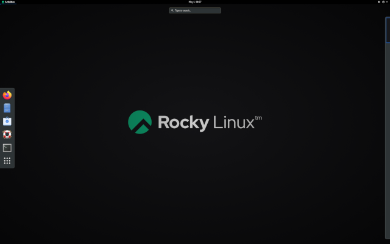
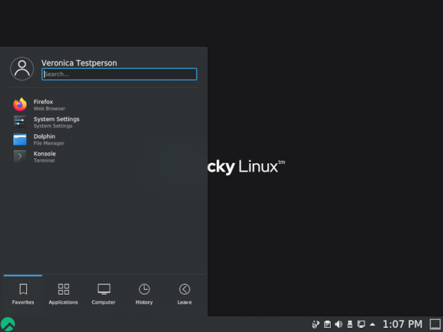

# Linux 操作系统简介

本章将带您将了解 GNU/Linux 发行版。

****

**目标** : 本章将讲解以下内容：

:heavy_check_mark: 操作系统的特性和可能的架构; \
:heavy_check_mark: UNIX 和 GNU/Linux 的历史; \
:heavy_check_mark: 根据需求选择合适的 Linux 发行版; \
:heavy_check_mark: 自由和开源软件的哲学; \
:heavy_check_mark: 了解 SHELL 的用处。

:checkered_flag: **概述**, **linux**, **发行版**

**知识掌握程度**: :star: \
**知识复杂程度**: :star:

**阅读时间**: 10 分钟

****

## 什么是操作系统？

Linux、UNIX、BSD、Windows 和 MacOS 都是**操作系统**。

:clipboard: 操作系统是**一组管理计算机可用资源的程序**。

在这些资源管理中，操作系统必须：

* 管理物理或虚拟内存。
  * **物理内存**由 RAM 条和处理器缓存组成，用于执行程序。
  * **虚拟内存**是位于硬盘上（交换分区），它允许在计算机断电期间卸载物理内存并保存系统的当前状态。
  拦截对外围设备的访问。通常不允许软件直接访问硬件（除了用于非常特殊需求的显卡）。
* 为应用程序提供适当的**任务管理**。
  操作系统负责调度进程以充分使用处理器。
* **保护文件**不受未经授权的访问。
* **收集**有关正在使用或正在进行的程序的**信息**。

## UNIX - GNU/Linux 概述

### 历史

#### UNIX

* **1964 至 1968**:
  MIT、贝尔实验室（AT&amp;T）和通用电气公司共同研发了 MULTICS（多功能信息和计算服务）。

* **1969**: 在贝尔（1969）和通用电气退出该项目后，两位开发人员（肯·汤普森和丹尼斯·里奇）以及后来的布赖恩·克尼根（Brian Kernighan）认为 MULTICS 过于复杂，便启动开发 UNIX（UNiplexed Information and Computing Service）。UNIX 的设计者最初是使用汇编语言开发的，后来开发了 B 语言和 C 语言（1971年），并完全重写了 UNIX。UNIX/Linux 系统自 1970 年开发以来，其参考日期依旧为 1970 年 1 月 1 日。

C 语言仍然是当今流行的编程语言之一！一种接近硬件的低级语言，它允许操作系统适配任何具有 C 编译器的机器架构。

UNIX 是一种开放且不断发展的操作系统，在计算历史上发挥了重要作用。 它已成为许多其他系统的基础：Linux、BSD、Mac OSX 等。

UNIX 在今天仍然很重要（HP-UX、AIX、Solaris等）。

#### Minix

* **1987**: A.S. Tanenbaum 开发了 MINIX（一种简化的 UNIX）以一种简单的方式教授操作系统课程。Tanenbaum 先生将他的操作系统源代码开放。

#### Linux

* **1991**: 芬兰学生 **Linus Torvalds** 为他的个人计算机创建了一个操作系统，并将其命名为 Linux。他在 Usenet 论坛上发布了他的第一个版本 0.02，其他开发者也来帮助他改进他的系统。术语 Linux 是来自创始人的名字 Linus 和 UNIX 两者的组合。

* **1993**: 创建 Debian 发行版。Debian 是一个基于社区的非商业发行版。它最初是为在服务器上使用而开发的，特别适合于服务器，但它是一个通用系统，因此也可以在个人计算机上使用。Debian 是许多其他发行版的基础，例如 Mint 或 Ubuntu。

* **1994**: 商业发行版 RedHat 由 RedHat 公司创建，该公司目前是 GNU/Linux 操作系统的领先发行商。RedHat 支持社区版 Fedora 和自由发行版 CentOS。

* **1997**: 创建 KDE 桌面环境。它基于 QT 组件库和 C++ 开发语言。

* **1999**: 创建 Gnome 桌面环境。它基于 GTK+ 组件库。

* **2002**: 创建 Arch 发行版。其特殊性在于滚动发行（持续更新）。

* **2004**: Canonical 公司（Mark Shuttleworth）创建 Ubuntu。它基于 Debian，但包括自由和专有软件。

* **2021**: Rocky Linux 诞生，基于 RedHat 发行版。

### 市场份额

<!--
TODO: graphics with market share for servers and pc.
-->

人们经常使用 Linux，但它仍然不为公众所熟知。事实上，在**智能手机**、**电视**、**网盒**等中均有 Linux 的身影。世界上几乎 70% 的网页都由 Linux 或 UNIX 服务器提供服务！

略多于 **3% 的个人电脑**配置了 Linux，超过 **82% 的智能手机**配置了 Linux。Android 是以 Linux 为内核的操作系统。

<!-- TODO: review those stats -->

自 2018 年以来，500 台超级计算机全部配备了 Linux。超级计算机是一种在设计时利用已知的技术实现尽可能高性能的计算机，尤其是在计算速度方面。

### 架构设计

* **内核**是第一个软件组件。
  * 它是 Linux 系统的核心。
  * 它管理系统的硬件资源。
  * 其他软件组件必须通过它才能访问硬件。
* **shell** 是一个实用程序，用于解释用户命令并确保其执行。
  * 主要 shell：Bourne shell、C shell、Korn shell 和 Bourne-Again shell (bash)。
* 应用程序是用户程序，例如：
  * 网页浏览器;
  * 办公软件;
  * ...

#### 多任务

Linux 属于分时操作系统家族。它在多个程序之间共享处理时间，以对用户透明的方式从一个程序切换到另一个程序。这意味着：

* 同时执行多个程序;
* 调度程序分配 CPU 时间;
* 减少因应用程序失败而导致的问题;
* 运行过多程序时性能降低。

#### 多用户

Multics 的目的是允许多个用户在一台计算机上（当时非常昂贵）通过多个终端（屏幕和键盘）工作。Linux 受这种操作系统的启发，保持了与多个用户同时独立工作的能力，每个用户都有自己的用户帐户、内存空间以及对文件和软件的访问权限。

#### 多处理器

Linux 能够与多处理器计算机或多核处理器一起工作。

#### 多平台

Linux 是用高级语言编写的，在编译过程中可以适应不同类型的平台。因此，它运行于：

* 家用电脑（个人电脑或笔记本电脑）;
* 服务器（数据、应用程序等）;
* 便携式计算机（智能手机或平板电脑）;
* 嵌入式系统（车载电脑）;
* 有源网络元件（路由器、交换机）;
* 家用电器（电视、冰箱等）。

#### 开放

Linux 基于 [posix](http://fr.wikipedia.org/wiki/POSIX)、TCP/IP、NFS、Samba 等公认的标准，允许与其他应用程序系统共享数据和服务。

### UNIX/Linux 哲学

* 一切皆文件。
* 可移植性。
* 让每一个程序只做好一件事情。
* KISS 原则: 保持简单化和傻瓜化。
* "UNIX 基本上是一个简单的操作系统，但你必须是一个天才才能理解它的简单性。" (__Dennis Ritchie__)
* "Unix 肯定是用户友好的，只不过它在对哪个用户友好的问题上，用情比较专一而已。" (__Steven King__)

## GNU/LINUX 发行版

Linux 发行版是围绕 Linux 内核组装的一组稳定的软件，可以与管理（安装、删除、配置）此软件的必要组件一起安装。有联合或社区发行版（Debian、Rocky）或商业发行版（RedHat、Ubuntu）。

每个发行版提供一个或多个桌面环境，提供一组预装软件和一个额外软件库。配置选项（例如内核或服务选项）特定于每个选项。

这一原则允许您拥有面向初学者的发行版（Ubuntu、Linux Mint等），拥有更复杂的发行版（Gentoo、Arch），拥有更专注于服务器的发行版（Debian、Redhat），或者拥有专注于工作站的发行版。

### 桌面环境

有许多图形环境：**Gnom**e、**KDE**、**LXDE**、**XFCE** 等。有些环境是人人通用的，与微软或苹果系统相比，它们的人机形态并不可耻！

那么，为什么在 Linux 系统没有（或者几乎没有）病毒的情况下，人们对 Linux 的热情如此之低呢？也许是因为所有编辑器 (Adobe) 或制造商 (NVidia) 都不玩免费游戏，也不提供适用于 GNU/Linux 的软件版本或驱动程序？害怕改变？很难找到售卖 Linux 电脑的商家？Linux 下发行的游戏太少（但时间不长）？随着运行在 Linux 上的 Steam-box 游戏机的到来，情况会改变吗？

**Gnome 3** 桌面环境不再使用桌面的概念，而是使用 Gnome Shell 的概念（不要与命令行 shell 混淆）。它充当桌面、仪表板、通知区域和窗口选择器。Gnome 桌面环境基于 GTK+ 组件库。

**KDE** 桌面环境基于 **Qt** 组件库。

传统上更推荐来自 Windows 世界的用户使用 KED。

### 自由 / 开源

Microsoft 或 Mac 操作系统的用户必须购买许可证才能使用其操作系统。这个许可证是有成本的，它的价格包含在计算机的价格中。

在 **GNU/Linux** 世界中，自由软件运动主要提供自由发行版。

**自由**并不意味着免费！

**开源**: 可获取源代码，在一定条件下可以查阅和修改。

自由软件必然是开源的，但反之则不然，因为开源软件与 GPL 许可所提议的自由是不同的。

#### GPL 许可证（通用公共许可证）

**GPL 许可证**向软件作者保证其知识产权，但允许第三方修改、重新分发或转售软件，前提是源代码与软件一起提供。GPL 是来自 **GNU**（GNU is Not UNIX）项目的许可证，该项目在创建 Linux 时起到了重要作用。

这暗示着:

* 出于任何目的运行程序的自由;
* 研究程序如何工作并根据您的需要进行调整的自由;
* 重新分发复制品的自由;
* 为了整个社区的利益，有改进计划和发表改进意见的自由。

另一方面，即使是在 GPL 许可下的产品也可以付费。并不是为产品本身付费，而是保证开发人员团队将继续致力于使其发展并解决错误，甚至为用户提供支持。

## 使用领域

Linux 发行版在以下方面表现出色 :

* **服务器**: HTTP、电子邮件、群件、文件共享等。
* **安全**: 网关、防火墙、路由器、代理等。
* **中央计算机**: 银行、保险、工业等。
* **嵌入式系统**: 路由器、网盒、智能电视等。

Linux 是托管数据库或网站，或者作为邮件服务器、DNS 或防火墙的合适选择。简而言之，Linux 几乎可以做任何事情，这就解释了特定发行版的份额。

## Shell

### 概论

**shell** 称为命令接口，允许用户向操作系统发送命令。由于图形界面的实现，它在如今不太明显，但在 Linux 系统上仍然是一种特权手段，Linux 系统并非都具有图形界面，并且其服务并不总是存在设置界面。

它提供了一种真正的编程语言，包括经典的结构：循环、选择，以及共同的组成部分：变量、参数传递和子程序。它允许创建脚本以自动执行某些操作（备份、创建用户、系统监控等）。

根据用户的喜好，平台上有几种类型的 shell 可供使用和配置：

* sh, POSIX 标准 shell;
* csh, C 中面向命令的 shell;
* bash, Bourne-Again Shell, Linux shell。
* ...

## 功能

* 命令执行（检查给定的命令并执行）;
* 输入/输出重定向（将数据返回到文件而不是将其打印在屏幕上）;
* 连接处理（管理用户的连接）;
* 解释型编程语言（允许创建脚本）;
* 环境变量（在操作期间访问特定于系统的信息）。

### 原理

## 检测所学知识

:heavy_check_mark: 操作系统是一组用于管理计算机可用资源的程序:

- [ ] 对
- [ ] 错

:heavy_check_mark: 操作系统提供:

- [ ] 管理物理和虚拟内存
- [ ] 允许直接访问外围设备
- [ ] 将任务管理分包给处理器
- [ ] 收集有关已使用或正在使用的程序的信息

:heavy_check_mark: 以下哪些人参与了 UNIX 的开发:

- [ ] Linus Torvalds
- [ ] Ken Thompson
- [ ] Lionel Richie
- [ ] Brian Kernighan
- [ ] Andrew Stuart Tanenbaum

:heavy_check_mark: Linux 内核的创造者 Linus Torvalds 的原国籍是:

- [ ] 瑞典
- [ ] 芬兰
- [ ] 挪威
- [ ] 佛兰德
- [ ] 法国

:heavy_check_mark: 以下哪种发行版最早:

- [ ] Debian
- [ ] Slackware
- [ ] RedHat
- [ ] Arch

:heavy_check_mark: Linux 内核是:

- [ ] 多任务
- [ ] 多用户
- [ ] 多处理器
- [ ] 多核
- [ ] 跨平台
- [ ] 开放

:heavy_check_mark: 自由软件一定是开源的吗?

- [ ] 是
- [ ] 否

:heavy_check_mark: 开源软件一定是免费的吗?

- [ ] 是
- [ ] 否

:heavy_check_mark: 以下哪项不是 shell:

- [ ] Jason
- [ ] Jason-Bourne shell (jbsh)
- [ ] Bourne-Again shell (bash)
- [ ] C shell (csh)
- [ ] Korn shell (ksh)