# How to Create New Users and Group Accounts

## Introduction

  This guide will teach you how to manage user and group accounts on Rocky Linux 9.4 using Cockpit, a web-based graphical interface administrative tool for Linux servers.
  
## Prerequsites
- Access to Rocky Linux 9 OS with GUI
- Administrative Priviledges
- Cockpit package installed and enabled

## Cockpit

Cockpit is a web-based graphical interface administrative tool for Linux servers. While it has many use cases, we  will be using Cockpit for managing user and group accounts. The benefits of using Cockpit include ease of use, remote management, integration, real-time feedback and multi-server dashboards. 

### Log In to Cockpit

- Open your web browser and enter https://localhost:9090 in the address bar
    >*Note: You can also enter the same address on the command line
    ```text 
    https://localhost:9090
    ``` 
- Enter your username and password and click the **Log In** button

    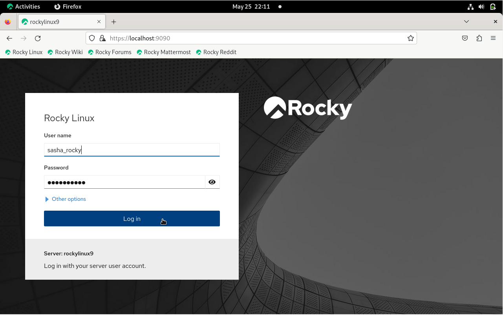

- Click the **Limited access** button and enter your password to enable administrative access

    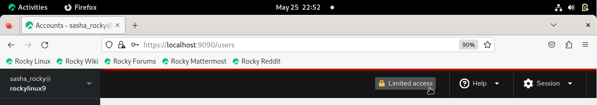

## User and Group Manangement

### Managing User Accounts

- From the left menu, click **Accounts** tab and then click on the **Create new account** button

    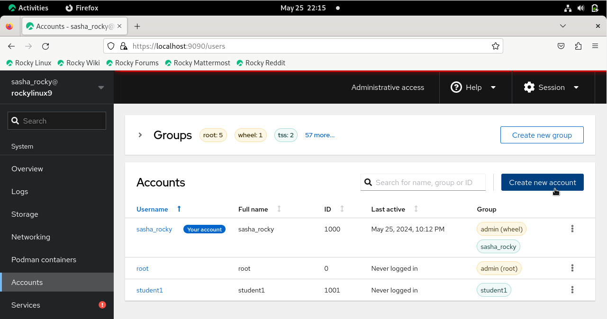


- Enter the user's name in the **Full name** text box
  >*Note that the username will be automatically populated based on the full name. However the username field is also editable.*
- Enter a password for the new user
- Click the **Create** button


    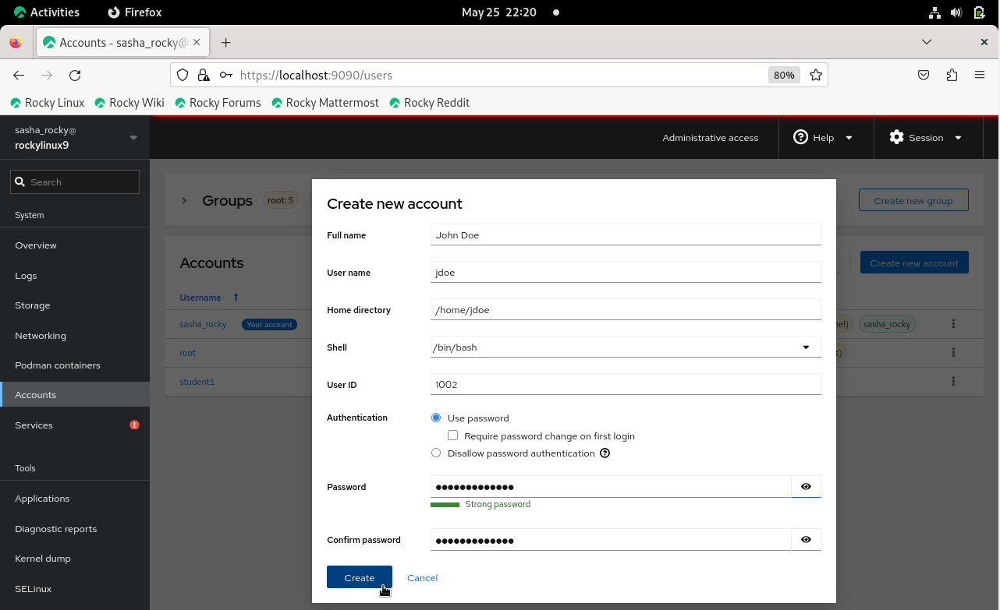


**CLI counterpart**

```text
sudo useradd jdoe -md /home/jdoe -u 1002 -s /bin/bash 
```

```text
sudo passwd jdoe 
```

Observe the addition of the new user to the list of users displayed under the **Accounts** tab.


**CLI counterpart**

```text
cat /etc/passwd
```

#### Modify User Account

- Click the vertical ellipsis icon for our new user, jdoe, and click **Edit user**

    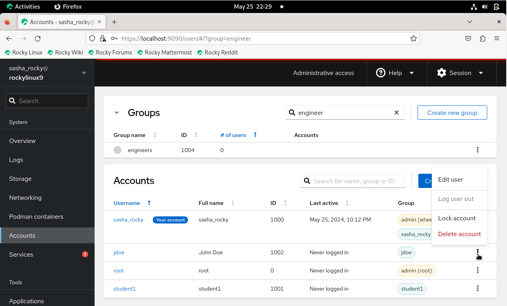

This is where we can modify user account settings, such as:

- Full name
- Group membership
- Password settings
- Shell

    

To add a user to a group do the following:

- Click the vertical ellipsis icon next to the new user and click **Edit user**

- Click the **Groups** text box and begin typing the name of the group.  
  Alternatively, you can scroll down the dropdown menu and click the name of the group you wish to add 

    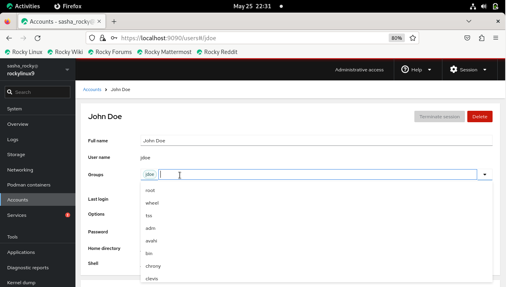

**CLI counterpart**
```text
sudo usermod -aG groupname username
```

To remove the user from a group:

- Click the **x** next to the group name

    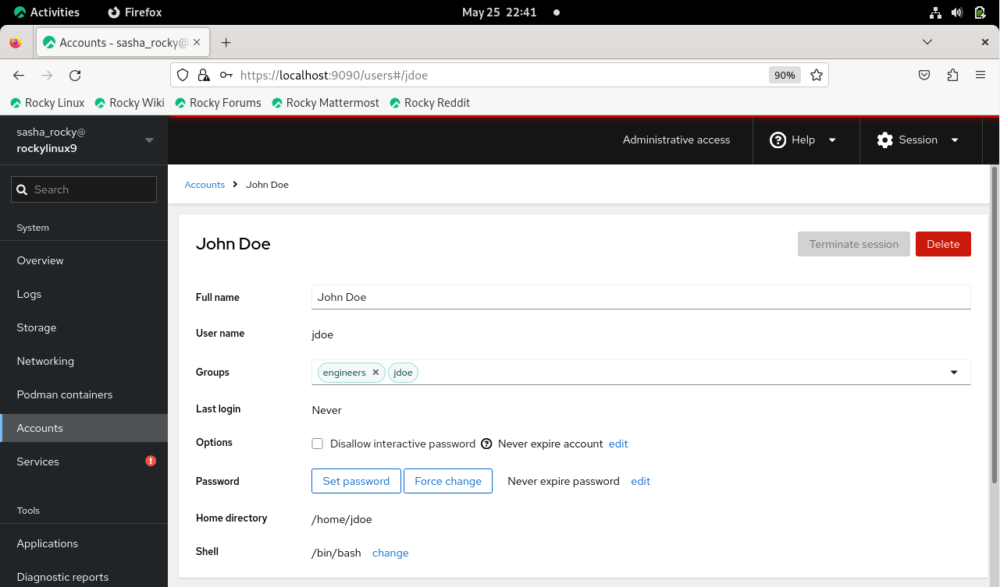

**CLI counterpart**
```text
sudo gpasswd -d username groupname
```

#### Delete User Account

To delete a user account:

- Click the vertical ellipsis icon for our new user, jdoe, and click **Delete account**

    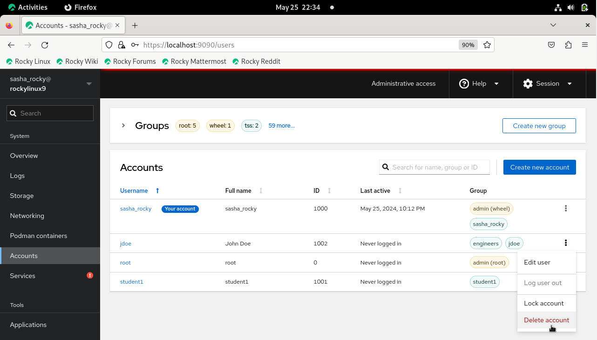

Or 
- Click the username highlighted in blue and select **Delete** box

    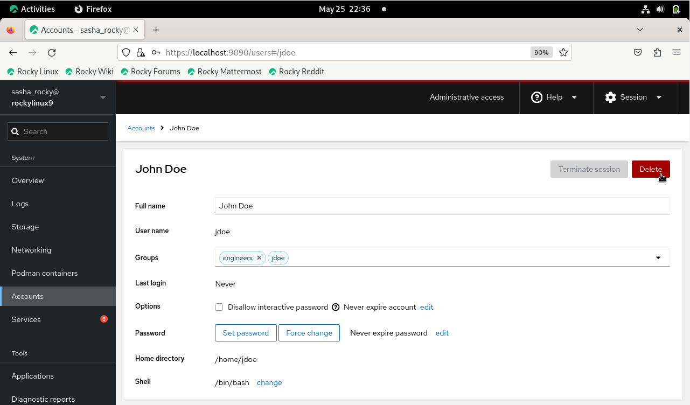

    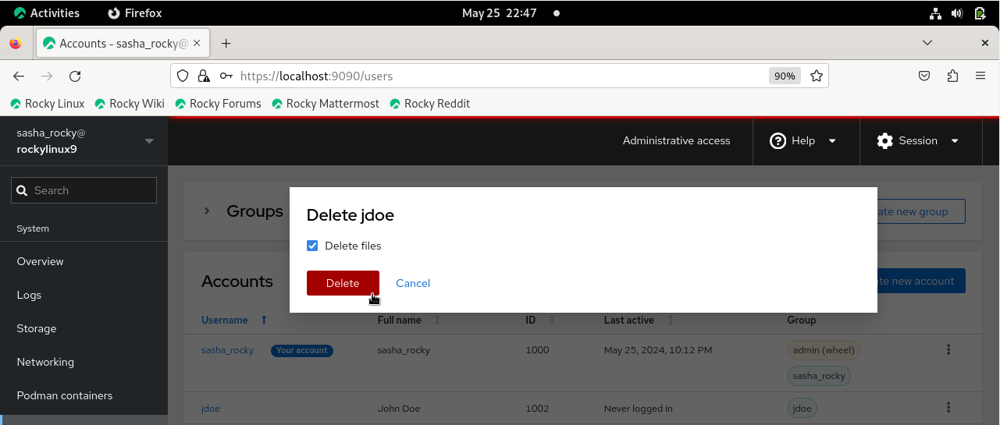

**CLI counterpart**
```text
sudo userdel -d username groupname
```

### Creating and Deleting and Managing Group Accounts

- From the the left menu column, click **Accounts** tab then, click the **Create new group** button

    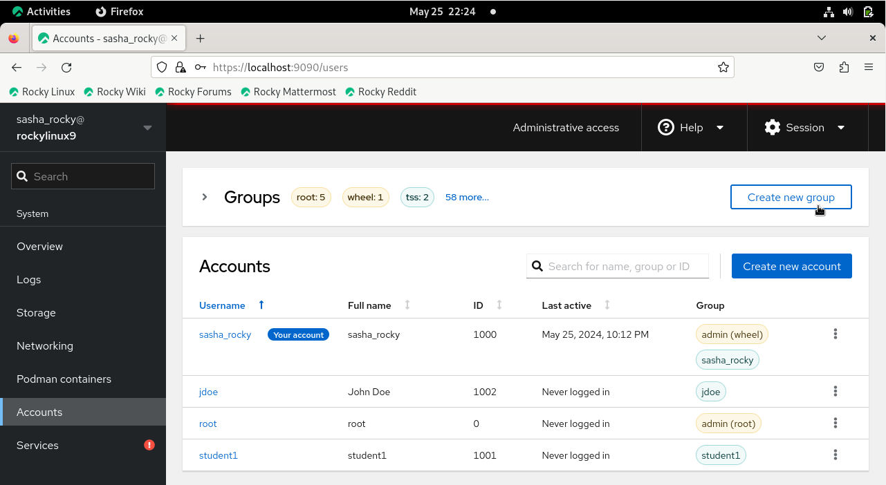

- Enter the group name in the text box
>*Note: You can accept the default group ID or change it to the numerical value you desire (e.g. 5001)*
- Click the **Select** button

    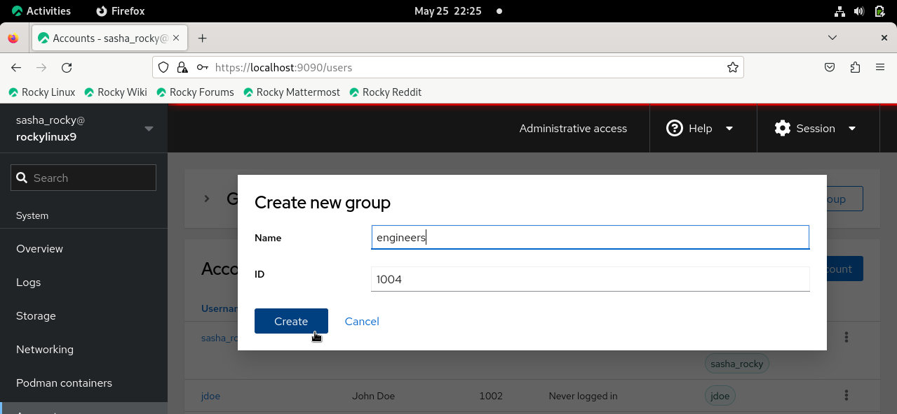

**CLI counterpart**
```text
sudo groupadd groupname
```

To verify the group has been created:

- Enter the group name in the search box on the **Groups** table 

Or 

-  Click the dropdown menu next to **Groups**

    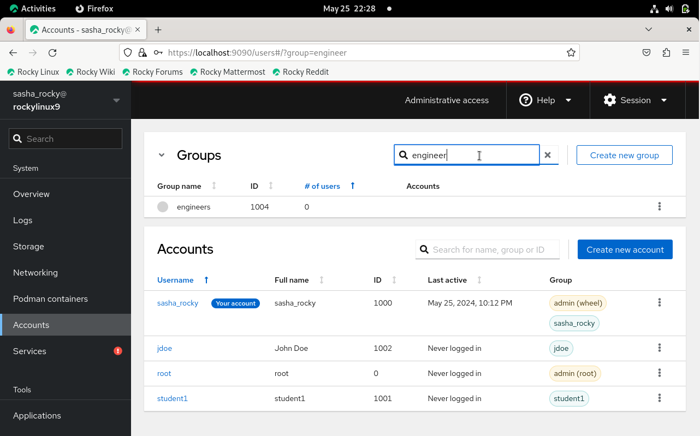

**CLI counterpart**
```text
cat /etc/group | grep groupname
```

To delete a group:

- Click the vertical ellipsis for the new user and click **Delete group**

    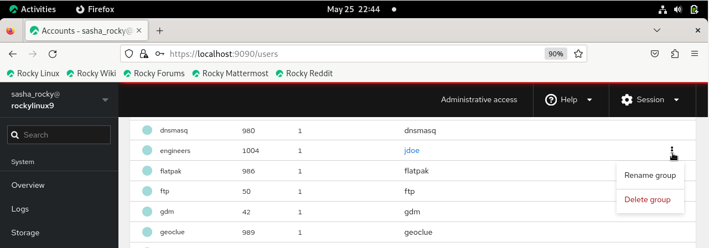
  
**CLI counterpart**

```text
sudo groupdel groupname
```

```text
getent group | grep groupname
```

## Conclusions

  It works great!

---

## REFERENCES

To Install Cockpit: https://ciq.com/blog/how-to-administer-rocky-linux-with-cockpit/
