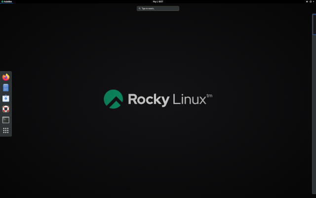

<!-- markdownlint-disable MD025 MD007 -->

# Introduction au système d'exploitation Linux

Dans ce chapitre, vous allez en apprendre plus à propos des distributions GNU/Linux.

****

**Objectifs** : Dans ce chapitre, vous apprendrez à :

:heavy_check_mark: Décrire les caractéristiques et les architectures possibles d'un système d'exploitation.  
:heavy_check_mark: Retracer l'histoire de UNIX et de GNU/Linux.  
:heavy_check_mark: Choisir la distribution Linux adaptée à vos propres besoins.  
:heavy_check_mark: Expliquer la philosophie des logiciels libres et open source.  
:heavy_check_mark: Découvrir l'utilité de la SHELL.

:checkered_flag: **généralités**, **linux**, **distributions**

**Connaissances** : :star:  
**Complexité** : :star:

**Temps de lecture** : 11 minutes

****

## Qu'est-ce qu'un système d'exploitation ?

Linux, UNIX, BSD, VxWorks, Windows et MacOS sont tous des **systèmes d'exploitation**.

!!! abstract "Abstract"

    Un système d'exploitation est un **ensemble de programmes qui gèrent les ressources disponibles d'un ordinateur**.

Dans le cadre de la gestion des ressources, le système d'exploitation doit :

* Gérer la mémoire **physique** ou **virtuelle**.

    * La **mémoire physique** est constituée des barrettes de RAM et de la mémoire cache du processeur qui sont utilisées pour l'exécution des programmes.

    * La **mémoire virtuelle** est un emplacement sur le disque dur (la partition **swap**) qui permet de décharger la mémoire physique et de sauvegarder l'état actuel du système lors de l'arrêt électrique de l'ordinateur.

* Intercepter les **accès aux périphériques**. Les logiciels sont rarement autorisés à accéder directement au matériel (sauf les cartes graphiques pour des besoins très spécifiques).

* Fournir aux applications une **gestion correcte des tâches**. Le système d'exploitation est responsable de l'ordonnencement des processus pour les répartir sur le ou les processeur(s).

* **Protéger les fichiers** contre les accès non autorisés.

* **Collecter des informations** sur les programmes utilisés ou en cours d'exécution.

## Généralités UNIX - GNU/Linux

### Histoire

#### UNIX

* De **1964 à 1968** : MULTICS (MULTiplexed Information and Computing Service) est développé pour le MIT, Bell Labs (AT&T) et General Electric.

* **1969** : Après le retrait de Bell (1969) puis de General Electric du projet, deux développeurs (Ken Thompson et Dennis Ritchie), rejoints plus tard par Brian Kernighan, jugeant MULTICS trop complexe, ont lancé le développement de UNIX (UNiplexed Information and Computing Service). Développé à l'origine en assembleur, les concepteurs d'UNIX développent le langage B puis le langage C (1971) et réécrivent complètement UNIX. Ayant été développé en 1970, la date de référence (epoch) des systèmes UNIX/Linux est toujours fixée au 1er janvier 1970.

C reste encore l'un des langages de programmation les plus populaires aujourd'hui. Un langage de bas niveau, proche du matériel, il permet d'adapter le système d'exploitation à toute architecture de machine ayant un compilateur C.

UNIX est un système d'exploitation ouvert et évolutif qui a joué un rôle majeur dans l'histoire de l'informatique. Il a été la base de beaucoup d'autres systèmes comme GNU/Linux, BSD, macOS, etc.

UNIX est toujours d'actualité aujourd'hui (HP-UX, AIX, Solaris, etc.)

#### Projet GNU

* **1984** : Richard Matthew Stallman lance le projet GNU (GNU's Not Unix), qui vise à établir un système Unix **libre** et **ouvert** dans lequel les outils les plus importants sont : le compilateur gcc, bash shell, l'éditeur Emacs, etc. GNU est un système d'exploitation de type Unix. Le développement de GNU, lancé en janvier 1984, est connu sous le nom de projet GNU. Beaucoup de logiciels GNU sont publiés sous les auspices du projet GNU ; ceux que nous appelons les paquets GNU.

* **1990** : Le noyau de GNU, le GNU Hurd, a été lancé en 1990 (avant le démarrage de Linux).

#### MINIX

* **1987** : Andrew S. Tanenbaum développe MINIX, un système UNIX simplifié, pour faciliter l'enseignement des systèmes d'exploitation. M. Tanenbaum met à disposition le code source de son système d'exploitation.

#### Linux

* **1991** : Un étudiant finlandais, **Linus Torvalds**, crée un système d'exploitation qui s'exécute sur son ordinateur personnel et le nomme Linux. Il publie sa première version, appelée 0.02, sur le forum de discussion Usenet et d'autres développeurs l'aident à améliorer son système. Le terme Linux est un jeu de mots entre le prénom du fondateur, Linus, et UNIX.

* **1993** : La distribution Debian est créée. Debian est une distribution non commerciale basée sur une communauté. Développé à l'origine pour être utilisé sur des serveurs, il est bien adapté à ce rôle. Cependant, il s'agit d'un système universel, utilisable également sur un ordinateur personnel. Debian est la base de nombreuses autres distributions, telles que Mint ou Ubuntu.

* **1994** : Une distribution commerciale de Linux est créée par la société Red Hat, qui est aujourd'hui le principal distributeur du système d'exploitation GNU/Linux. Red Hat prend en charge la version communautaire Fedora et jusqu'à récemment la distribution libre CentOS Linux.

* **1997** : L'environnement de bureau KDE est créé. Il est basé sur la bibliothèque de composants Qt et le langage de développement C++.

* **1999** : L'environnement de bureau GNOME est créé. Il est basé sur la bibliothèque de composants GTK+.

* **2002** : La distribution Arch est créée. Sa particularité est qu'elle offre le rolling release (mise à jour continue).

* **2004** : La distribution Ubuntu est créée par la société Canonical (Mark Shuttleworth). Elle est basée sur Debian, mais inclut aussi bien des logiciels libres et que des logiciels propriétaires.

* **2021** : Rocky Linux est créée, basée sur la distribution de Red Hat.

!!! info "Info"

    Dispute sur le nom : bien que les gens soient habitués à appeler le système d'exploitation Linux, Linux est strictement un noyau. Nous ne devons pas oublier le développement et la contribution du projet GNU à la cause de l'open source ! Nous préférons appeler le système d'exploitation GNU/Linux.

### Part de marché

<!--
TODO: graphics with market share for servers and pc.
-->

Malgré son omniprésence, GNU/Linux reste pratiquement inconnu du grand public. En effet, Linux se cache dans les **smartphones**, **téléviseurs**, **boîtes Internet**, etc. Près de **70 % des sites web** dans le monde sont hébergés sur un serveur GNU/Linux ou UNIX !

Linux équipe un peu plus de **3% des ordinateurs personnels** mais plus de **82 % des smartphones**. Le système d'exploitation **Android**, par exemple, utilise un noyau Linux.

<!-- TODO: review those stats -->

Linux équipe 100% des 500 superordinateurs depuis 2018. Un superordinateur est un ordinateur conçu pour obtenir les meilleures performances possibles avec les techniques connues lors de sa conception, surtout en ce qui concerne la vitesse de calcul.

### Conception architecturale

* Le **noyau** est le premier composant logiciel.

    * C'est le cœur du système GNU/Linux.
    * Il gère les ressources matérielles du système.
    * Les autres composants logiciels doivent passer par lui pour accéder au matériel.

* Le **shell** est un utilitaire qui interprète les commandes de l'utilisateur et assure leur exécution.

    * Principaux shells : Bourne shell, C shell, Korn shell et Bourne-Again shell (bash).

* **Les applications** sont des programmes utilisateur incluant mais non limités à :

    * Navigateurs Internet
    * Traitement de texte
    * Tableurs

#### Multi-tâches

Linux appartient à la famille des systèmes d'exploitation à temps partagé. Il partage le temps de traitement entre plusieurs programmes, passant d'un programme à l'autre d'une manière transparente pour l'utilisateur. Cela implique :

* L'exécution simultanée de plusieurs programmes.
* La distribution du temps CPU par le scheduler.
* La réduction des problèmes dus à une application défaillante.
* Une diminution des performances lorsqu’il y a trop de programmes en cours d'exécution.

#### Multi-utilisateurs

Le but de MULTICS était de permettre à plusieurs utilisateurs de travailler à partir de plusieurs terminaux (écran et clavier) simultanément sur un seul ordinateur (très cher à l'époque). GNU/Linux, inspiré de ce système d'exploitation, a conservé cette capacité de travailler avec plusieurs utilisateurs simultanément et indépendamment, chacun ayant son propre compte utilisateur avec un espace mémoire et des droits d'accès aux fichiers et aux logiciels.

#### Multi-processeurs

Linux est capable de fonctionner sur des ordinateurs multi-processeurs et/ou avec des processeurs multi-cœurs.

#### Multi-plateforme

Linux est écrit dans un langage de haut niveau qui peut être adapté à différents types de plates-formes lors de la compilation. Cela lui permet d'être exécuté sur :

* Ordinateurs domestiques (PC ou ordinateur portable)
* Serveurs (données, applications, ...)
* Ordinateurs portables (smartphones ou tablettes)
* Systèmes embarqués (ordinateur de voiture)
* Éléments réseau actifs (routeurs et commutateurs)
* Appareils ménagers (téléviseurs et réfrigérateurs)

#### Ouvert

Linux est basé sur et utilise des standards reconnus tels que [POSIX](http://fr.wikipedia.org/wiki/POSIX), [TCP/IP](https://fr.wikipedia.org/wiki/Internet_protocol_suite), [NFS](https://fr.wikipedia.org/wiki/Network_File_System), et [Samba](https://fr.wikipedia.org/wiki/Samba_(software)), qui lui permettent de partager des données et des services avec d'autres systèmes d'application.

### La philosophie UNIX/Linux

* Tout est fichier.
* Portabilité.
* Ne faire qu’une seule chose à la fois et la faire bien.
* KISS : Keep It Simple and Stupid.
* "UNIX is a simple operating system, but you have to be a genius to understand the simplicity." (**Dennis Ritchie**)
* “UNIX est convivial. Cependant UNIX ne précise pas vraiment avec qui.” (**Steven King**)

## Les distributions GNU/Linux

Une distribution GNU/Linux est un **ensemble cohérent de logiciels** assemblés autour du noyau Linux et prêt à être installé ainsi que le nécessaire à la gestion de ces logiciels (installation, suppression, configuration,...). Il existe des **distributions associatives** ou **communautaires** (Debian, Rocky Linux) ou bien **commerciales** (Red Hat, Ubuntu).

Chaque distribution offre un ou plusieurs **environnements de bureau** et fournit un ensemble de logiciels préinstallés et une bibliothèque de logiciels supplémentaires. Les options de configuration (options du noyau ou des services par exemple) sont spécifiques à chaque distribution.

Ce principe permet aux distributions d'être orientées vers **débutants** (Ubuntu, Linux Mint...) ou entièrement personnalisable pour **les utilisateurs expérimentés** (Gentoo, Arch) ; les distributions peuvent également être plus adaptées aux **serveurs** (Debian, Red Hat) ou aux **postes de travail** (Fedora).

### Les environnements de bureau

Les environnements graphiques sont nombreux : **GNOME**, **KDE**, **LXDE**, **XFCE**, etc. Il y en a pour tous les goûts et leurs **ergonomies** n’ont pas à rougir de ce que l’on peut retrouver sur les systèmes Microsoft ou Apple.

Alors pourquoi y a-t-il si peu d'enthousiasme pour Linux ? Peut-être est-ce parce que tant d'éditeurs (Adobe) et de fabricants (Nvidia) ne jouent pas au jeu du libre et ne fournissent pas de version de leurs logiciels ou **pilotes** pour GNU/Linux ? Peut-être est-ce la peur du changement, la difficulté de trouver où acheter un ordinateur Linux ou trop peu de jeux distribués sous Linux. Cette dernière excuse au moins ne devrait pas être vraie pour longtemps, avec l'avènement du moteur de jeu Steam pour Linux.

L'environnement de bureau **GNOME 3** n'utilise plus le concept de bureau mais celui de GNOME Shell (à ne pas confondre avec le shell en ligne de commande). Il sert à la fois de bureau, de tableau de bord, de zone de notification et de sélecteur de fenêtre. L'environnement de bureau GNOME est basé sur la bibliothèque de composants **GTK+**.

L’environnement de bureau **KDE** est basé sur la bibliothèque de composants **Qt**. Il est traditionnellement recommandé pour les utilisateurs familiers avec un environnement Windows.

### Libre / Open source

L'utilisateur d'un système d’exploitation Microsoft ou Mac doit s’affranchir d’une licence d’utilisation du système d’exploitation. Cette licence a un coût, même s’il est généralement transparent (le prix de la licence étant inclus dans le prix de l’ordinateur).

Dans le monde **GNU/Linux**, le mouvement du Logiciel Libre permet de fournir des distributions majoritairement libres.

**Libre** ne veut pas dire gratuit !

**Open Source** : les codes sources sont disponibles, il est donc possible de les consulter et de les modifier sous certaines conditions.

Un logiciel libre est nécessairement open-source, mais le contraire n'est pas vrai car la liberté liée au logiciel open-source est distincte de la liberté offerte par la licence GPL.

#### GPL (General Public License)

La **GPL** garantit à l'auteur d'un logiciel sa propriété intellectuelle, mais permet la modification, redistribution ou revente de logiciels par des tiers, à condition que le code source soit inclus dans le logiciel. La licence GPL est la licence issue du projet **GNU** (GNU is Not UNIX), projet déterminant dans la création de Linux.

Elle implique :

* La liberté d’exécuter le programme pour tous les usages.
* La liberté d’étudier le fonctionnement du programme et de l’adapter à vos besoins.
* La liberté de redistribuer des copies.
* La liberté d’améliorer le programme et de publier ces améliorations, pour en faire profiter toute la communauté.

D'autre part, même les produits sous licence GPL peuvent avoir un coût. Ce n'est pas pour le produit lui-même, mais pour la **garantie qu'une équipe de développeurs continuera à travailler dessus pour le faire évoluer, corriger les erreurs et résoudre les  problèmes ou même fournir un support aux utilisateurs**.

## Les domaines d’utilisation

Une distribution GNU/Linux excelle pour :

* **Serveurs** : HTTP, messagerie, groupware, partage de fichiers, etc.
* **Sécurité** : Passerelle, pare-feu, routeur, proxy, etc.
* **Ordinateur centraux** : Banques, assurances, industrie, etc.
* **Systèmes embarqués**: Routeurs, boîtes Internet, SmartTVs, etc.

Linux est un choix adapté pour l’hébergement de bases de données ou de sites Web ou comme serveur de messagerie, DNS ou bien pare-feu. Bref, Linux peut à peu près tout faire, ce qui explique la quantité de distributions spécifiques.

## Le Shell

### Généralités

Le **shell**, _interface de commandes_ en français, permet aux utilisateurs d’envoyer des commandes au système d’exploitation. Il est moins visible aujourd’hui, depuis la mise en place des interfaces graphiques, mais reste un moyen privilégié sur les systèmes GNU/Linux qui ne possèdent pas tous des interfaces graphiques et dont les services ne possèdent pas toujours une interface de configuration.

Il offre un véritable langage de programmation comprenant les structures classiques (boucles, alternatives) et les constituants courants (variables, passage de paramètres, sous-programmes). Il permet donc la création de scripts pour automatiser certaines actions (sauvegardes, création d’utilisateurs, surveillance du système,…).

Il existe plusieurs types d'interpréteurs de commandes disponibles et configurables sur une plate-forme ou selon les préférences de l'utilisateur. En voici quelques exemples :

* sh, le shell aux normes POSIX
* csh, un shell utilisant une syntaxe proche du langage C
* bash, Bourne-Again Shell, le shell de Linux

### Fonctionnalités

* Exécution de commandes (vérifie la commande passée et l’exécute).
* Redirections Entrées/Sorties (renvoi des données vers un fichier au lieu de l’inscrire sur l’écran).
* Processus de connexion (gère la connexion de l'utilisateur).
* Langage de programmation interprété (permettant la création de scripts).
* Variables d’environnement (accès aux informations propres au système en cours de fonctionnement).

### Principe

## Testez vos connaissances

:heavy_check_mark: Un système d’exploitation est un ensemble de programmes permettant la gestion des ressources disponibles d’un ordinateur :

* [ ] Vrai
* [ ] Faux

:heavy_check_mark: Le système d’exploitation est amené à :

* [ ] Gérer la mémoire physique et virtuelle
* [ ] Permettre l’accès direct aux périphériques
* [ ] Sous traiter la gestion des tâches au processeur
* [ ] Collecter des informations sur les programmes utilisées ou en cours d’exécution

:heavy_check_mark: Parmi ces personnalités, lesquelles ont participé au développement de UNIX :

* [ ] Linus Torvalds
* [ ] Ken Thompson
* [ ] Lionel Richie
* [ ] Brian Kernighan
* [ ] Andrew Stuart Tanenbaum

:heavy_check_mark: La nationalité d’origine de Linus Torvalds, créateur du noyau Linux, est :

* [ ] Suédoise
* [ ] Finlandaise
* [ ] Norvégienne
* [ ] Flamande
* [ ] Française (évidemment)

:heavy_check_mark: Parmi les distributions suivantes, quelle est la plus ancienne :

* [ ] Debian
* [ ] Slackware
* [ ] Red Hat
* [ ] Arch

:heavy_check_mark: Le noyau Linux est-il :

* [ ] Multitâche
* [ ] Multiutilisateurs
* [ ] Multi-processeurs
* [ ] Multicoeurs
* [ ] Multiplateforme
* [ ] Ouvert

:heavy_check_mark: Un logiciel libre est-il forcément Open Source ?

* [ ] Vrai
* [ ] Faux

:heavy_check_mark: Un logiciel Open Source est-il forcément libre ?

* [ ] Vrai
* [ ] Faux

:heavy_check_mark: Parmi les propositions suivantes, laquelle n’est pas un shell :

* [ ] Jason
* [ ] Jason-Bourne shell (jbsh)
* [ ] Bourne-Again shell (bash)
* [ ] C shell (csh)
* [ ] Korn shell (ksh)  
