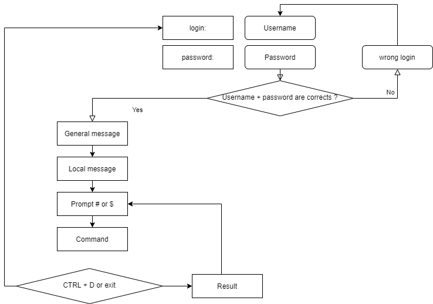

# Introduzione al sistema operativo Linux

In questo capitolo impareremo a conoscere le distribuzioni GNU/Linux.

****

**Obiettivi** : In questo capitolo imparerai a:

:heavy_check_mark: Descrivere le caratteristiche e le possibili architetture di un sistema operativo  
:heavy_check_mark: Raccontare la storia di UNIX e GNU/Linux  
:heavy_check_mark: Scegliere la distribuzione Linux giusta per le tue esigenze  
:heavy_check_mark: Spiegare la filosofia del software libero e opensource  
:heavy_check_mark: Scoprire l'utilità della SHELL.

:checkered_flag: **generalità**, **linux**, **distribuzioni**

**Conoscenza**: :star:  
**Complessità**: :star:

**Tempo di lettura**: 10 minuti

****

## Che cos'è un sistema operativo?

Linux, UNIX, BSD, Windows e MacOS sono tutti **sistemi operativi**.

!!! abstract "Astratto"

    Un sistema operativo è un **insieme di programmi che gestisce le risorse disponibili di un computer**.

Nella gestione di queste risorse, il sistema operativo deve:

* Gestire la memoria fisica o virtuale.
  * La **memoria fisica** è costituita dalla RAM e dalla memoria cache del processore, che viene utilizzata per l'esecuzione dei programmi.
  * La **memoria virtuale** è una locazione sull'hard disk (la partizione di swap) che permette lo scarico della memoria fisica e il salvataggio dello stato attuale del sistema durante lo spegnimento elettrico del computer.
* Intercettare **l'accesso alle periferiche**. Raramente al software è consentito accedere direttamente all'hardware (ad eccezione delle schede grafiche per esigenze molto specifiche).
* Fornire alle applicazioni una corretta **gestione delle attività**. Il sistema operativo è responsabile della pianificazione dei processi che occupano il processore.
* **Protezione dei file** da accessi non autorizzati.
* **Raccolta di informazioni** sui programmi in uso o in esecuzione.

## Generalità UNIX - GNU/Linux

### Storia

#### UNIX

* Dal **1964** al **1968**: MULTICS (MULTiplexed Information and Computing Service) è sviluppato per MIT, Bell Labs (AT&T) e General Electric.

* **1969**: Dopo il ritiro della Bell (1969) e poi della General Electric dal progetto, due sviluppatori (Ken Thompson e Dennis Ritchie), affiancati in seguito da Brian Kernighan, giudicando MULTICS troppo complesso, lanciano lo sviluppo di UNIX (UNiplexed Information and Computing Service). Originariamente sviluppato in assembler, i progettisti di UNIX hanno sviluppato il linguaggio B e poi il linguaggio C (1971) e hanno completamente riscritto UNIX. Essendo stato sviluppato nel 1970, la data di riferimento dei sistemi UNIX/Linux è ancora fissata al 1° gennaio 1970.

Il linguaggio C è ancora oggi uno dei linguaggi di programmazione più popolari! Linguaggio di basso livello, vicino all'hardware, consente l'adattamento del sistema operativo a qualsiasi architettura di macchina dotata di compilatore C.

UNIX è un sistema operativo aperto e in evoluzione che ha svolto un ruolo importante nella storia dell'informatica. È stato la base per molti altri sistemi: Linux, BSD, Mac OSX, ecc.

UNIX è ancora rilevante oggi (HP-UX, AIX, Solaris, etc.)

#### Minix

* **1987**: AS Tanenbaum sviluppa MINIX, un UNIX semplificato, per insegnare i sistemi operativi in modo semplice. Mr. Tanenbaum mette a disposizione il codice sorgente del suo sistema operativo.

#### Linux

* **1991**: Uno studente finlandese, **Linus Torvalds** , crea un sistema operativo dedicato al suo personal computer e lo chiama Linux. Pubblica la sua prima versione 0.02, sul forum di discussione Usenet e altri sviluppatori iniziano a contribuire al miglioramento del suo sistema. Il termine Linux è un gioco di parole tra il nome del fondatore, Linus, e UNIX.

* **1993**: Viene creata la distribuzione Debian. Debian è una distribuzione non commerciale, basata sulla comunità. Sviluppato originariamente per essere utilizzato su server, è particolarmente adatto a questo ruolo, ma è pensato per essere un sistema universale e quindi utilizzabile anche su un personal computer. Debian è usata come base per molte altre distribuzioni, come Mint o Ubuntu.

* **1994**: La distribuzione commerciale RedHat viene creata dalla società RedHat, che è oggi il principale distributore del sistema operativo GNU/Linux. RedHat supporta la versione community Fedora e recentemente la distribuzione gratuita CentOS.

* **1997**: Viene creato l'ambiente desktop KDE. Si basa sulla libreria di componenti Qt e sul linguaggio di sviluppo C++.

* **1999**: Viene creato l'ambiente desktop Gnome. Questo si basa sulla libreria di componenti GTK+.

* **2002**: Viene creata la distribuzione Arch. La sua particolarità deve essere rilasciata in Rolling Release (aggiornamento continuo).

* **2004**: Ubuntu viene creato dalla società Canonical (Mark Shuttleworth). È basato su Debian, che include software gratuito e proprietario.

* **2021**: Nascita di Rocky Linux, basato sulla distribuzione RedHat.

### Quota di mercato

<!--
TODO: graphics with market share for servers and pc.
-->

Linux non è ancora molto conosciuto dal grande pubblico, anche se lo usa regolarmente. Linux infatti è nascosto in **smartphone**, **televisori**, **internet box**, ecc. Quasi il **70% delle pagine web** servite nel mondo sono servite da un server Linux o UNIX!

Linux equipaggia poco più del **3% dei personal computer** ma più dell'**82% degli smartphone**. **Android** è un sistema operativo il cui kernel è Linux.

<!-- TODO: review those stats -->

Linux equipaggia il 100% dei 500 supercomputer dal 2018. Un supercomputer è un computer progettato per ottenere le massime prestazioni possibili con le tecniche note al momento della sua progettazione, in particolare per quanto riguarda la velocità di calcolo.

### Progettazione dell'architettura

* Il **kernel** è il primo componente software.
  * È il cuore del sistema Linux.
  * Gestisce le risorse hardware del sistema.
  * Gli altri componenti software devono attraversarlo per accedere all'hardware.
* La **shell** è un'utilità di sistema che interpreta i comandi dell'utente e ne garantisce l'esecuzione.
  * Shell principali: shell Bourne, shell C, shell Korn e shell Bourne-Again (bash).
* Le applicazioni sono programmi utente come:
  * Browser Internet ;
  * l'elaboratore di testi ;
  * ...

#### Multitask

Linux appartiene alla famiglia dei sistemi operativi time-sharing (tempo condiviso). Condivide il tempo di elaborazione tra più programmi, passando da uno all'altro in modo trasparente per l'utente. Ciò implica:

* esecuzione simultanea di più programmi;
* distribuzione del tempo CPU da parte dello scheduler;
* riduzione dei problemi dovuti ad un'applicazione arrestata in modo anomalo;
* prestazioni ridotte quando ci sono troppi programmi in esecuzione.

#### Multi utente

Lo scopo di Multics era quello di consentire a più utenti di lavorare da più terminali (schermo e tastiera) su un unico computer (molto costoso all'epoca). Linux, che si ispira a questo sistema operativo, ha mantenuto questa capacità di lavorare con più utenti contemporaneamente e indipendentemente, ognuno con il proprio account utente, spazio di memoria e diritti di accesso a file e software.

#### Multiprocessore

Linux è in grado di funzionare con computer multiprocessore o con processori multicore.

#### Multi piattaforma

Linux è scritto in un linguaggio di alto livello che può essere adattato a diversi tipi di piattaforme durante la compilazione. Funziona quindi su:

* computer di casa (PC o laptop);
* server (dati, applicazioni,...);
* computer portatili (smartphone o tablet)
* sistemi integrati (computer per auto);
* elementi di rete attivi (router, switch)
* elettrodomestici (TV, frigoriferi,...).

#### Aperto

Linux è basato su standard riconosciuti [posix](http://fr.wikipedia.org/wiki/POSIX), TCP/IP, NFS, Samba ... che consentono di condividere dati e servizi con altri sistemi operativi.

### La filosofia Unix/Linux

* Tutto è un file.
* Portabilità.
* Fai solo una cosa e falla bene.
* KISS: Mantienilo semplice stupido (Keep It Simple Stupid).
* "UNIX è fondamentalmente un sistema operativo semplice, Ma devi essere un genio per capirne la semplicità." (__Dennis Ritchie__)
* "Unix è facile da usare. Solamente che non è chiaro con quali utenti sia amichevole." (__Steven King__)

## Le distribuzioni GNU/Linux

Una distribuzione Linux è un **insieme coerente di software** assemblato attorno al kernel Linux e pronto per essere installato insieme ai componenti necessari per gestire questo software (installazione, rimozione, configurazione). Ci sono distribuzioni **associative o comunitarie** (Debian, Rocky) o **commerciali** (RedHat, Ubuntu).

Ogni distribuzione offre uno o più **ambienti desktop**, fornisce un set di software preinstallato e una libreria di software aggiuntivo. Le opzioni di configurazione (opzioni del kernel o servizi ad esempio) sono specifiche per ciascuno.

Questo principio ti consente di avere distribuzioni per **principianti** (Ubuntu, Linux Mint...), distribuzioni con un approccio più complesso (Gentoo, Arch), o essere focalizzate di più verso **servers** (Debian, Redhat), o **workstations**.

### Ambienti desktop

Ci sono molti ambienti grafici: **Gnome**, **KDE**, **LXDE**, **XFCE**, etc. C'è qualcosa per ogni esigenza, e la loro **ergonomicità** non ha nulla da invidiare rispetto a Microsoft o Apple Systems!

Allora perché c'è così poco entusiasmo per Linux, quando **non ci sono virus (o quasi) per questo sistema**? Forse perché tutti gli editori (Adobe) o produttori (NVidia) non giocano il gioco gratuito e non forniscono una versione del loro software o dei loro __drivers__ per GNU/Linux? Paura del cambiamento? La difficoltà a trovare dove acquistare un computer Linux? Troppo pochi giochi (ma non ancora per molto) distribuiti sotto Linux? La situazione cambierà con l'arrivo della console di gioco steam-box che funziona con Linux?

L'ambiente Desktop **GNOME 3** non usa più il concetto di desktop ma quello di Gnome Shell (da non confondere con la shell, riga di comando). Serve come desktop, come dashboard, area di notifica e selettore di finestre. L'ambiente desktop GNOME si basa sulla libreria di componenti GTK+.

L'ambiente del desktop **KDE** è basato sulla libreria di componenti **Qt**.

È tradizionalmente più raccomandato per gli utenti provenienti da un mondo Windows.

### Libero / Open source

Un utente di un sistema operativo Microsoft o Mac deve acquistare una licenza per utilizzare il sistema operativo. Questa licenza ha un costo, anche se di solito è trasparente (il prezzo della licenza è incluso nel prezzo del computer).

Nel mondo **GNU/Linux**, il movimento del Software Libero fornisce principalmente distribuzioni gratuite.

**Libero** non significa gratuito!

**Open source**: i codici sorgente sono disponibili, quindi è possibile consultare e modificarli a determinate condizioni.

Un software gratuito è necessariamente Open Source, ma il contrario non è vero poiché un software open source è separato dalla libertà proposta dalla licenza GPL.

#### Licenza GPL (General Public License)

La **Licenza GPL** garantisce all'autore di un software la sua proprietà intellettuale, ma consente la modifica, ridistribuzione o rivendita del software da parte di terzi, a condizione che i codici sorgente siano forniti con il software. La GPL è la licenza dalla quale esce il progetto **GNU** (GNU is Not UNIX), che è stato strumentale nella creazione di Linux.

Questo implica :

* la libertà di eseguire il programma, per qualsiasi scopo;
* la libertà di studiare come funziona il programma e di adattarlo alle proprie esigenze;
* la libertà di ridistribuire copie;
* la libertà di migliorare il programma e pubblicare i tuoi miglioramenti, a beneficio dell'intera comunità.

D'altra parte, anche i prodotti rilasciati sotto la licenza GPL possono essere pagati. Questo non è per il prodotto in se, ma è dato dalla garanzia che un team di sviluppatori continuerà a lavorare su di esso per farlo evolvere e risolvere gli errori, o anche fornire supporto agli utenti.

## Aree di utilizzo

Una distribuzione Linux eccelle per :

* **Un server**: HTTP, email, groupware, condivisione file, etc.
* **Sicurezza**: Gateway, firewall, router, proxy, etc.
* **Computer centrali**: Banche, assicurazioni, industrie, etc.
* **Embedded system**: Routers, Internet boxes, SmartTV, etc.

Linux è una scelta adatta per l'hosting di database o siti Web, o per mail server, DNS o firewall. In breve, Linux può fare qualsiasi cosa, il che spiega la quantità di distribuzioni specifiche.

## Shell

### Generalità

La **shell**, conosciuta anche come _command interface_, consente agli utenti di inviare comandi al sistema operativo. È meno visibile oggi, e questo è dovuto all'implementazione delle interfacce grafiche, ma rimane un mezzo privilegiato sui sistemi Linux che non hanno interfacce grafiche e i cui servizi non sempre hanno un'interfaccia di impostazione.

Offre un vero linguaggio di programmazione incluse le strutture classiche: loops, alternative, e i costituenti comuni: variabili, passaggio dei parametri, e sotto-programmi. Permette la creazione di script per automatizzare determinate azioni (backups, creazione di utenti, monitoraggio del sistema, etc.).

Esistono diversi tipi di shell disponibili e configurabili su una piattaforma o in base alle preferenze dell'utente:

* sh, la shell standard POSIX ;
* csh, command-oriented shell in C ;
* bash, Bourne-Again Shell, Linux shell.
* etc, ...

## Funzionalità

* Esecuzione del comando (controlla il comando assegnato lo esegue);
* Redirezione Input/Output (restituisce i dati su un file invece di scriverlo sullo schermo);
* Processi di connessione (gestisce le connessioni degli utenti);
* Linguaggio di programmazione interpretato (permettendo la creazione di script);
* Variabili d'ambiente (accesso alle informazioni specifiche per il sistema durante il funzionamento).

### Principio

## Controlla la tua conoscenza

:heavy_check_mark: Un sistema operativo è un insieme di programmi per la gestione delle risorse disponibili di un computer:

- [ ] Vero
- [ ] Falso

:heavy_check_mark: Il sistema operativo è portato a:

- [ ] Gestire la memoria fisica e virtuale
- [ ] Consentire accesso diretto alle periferiche
- [ ] Controllo della gestione delle attività al processore
- [ ] Raccogliere informazioni sui programmi utilizzati o in uso

:heavy_check_mark: Tra queste personalità, quali hanno partecipato allo sviluppo di UNIX:

- [ ] Linus Torvalds
- [ ] Ken Thompson
- [ ] Lionel Richie
- [ ] Brian Kernighan
- [ ] Andrew Stuart Tanenbaum

:heavy_check_mark: La nazionalità originale di Linus Torvalds, creatore del kernel Linux, è:

- [ ] Svedese
- [ ] Finlandese
- [ ] Norvegese
- [ ] Fiamminga
- [ ] Francese ovviamente

:heavy_check_mark: Quale delle seguenti distribuzioni è la più antica:

- [ ] Debian
- [ ] Slackware
- [ ] RedHat
- [ ] Arch

:heavy_check_mark: È il kernel di Linux:

- [ ] Multitasking
- [ ] Multi utente
- [ ] Multiprocessore
- [ ] Multi-core
- [ ] Cross-platform
- [ ] Aperto

:heavy_check_mark: Il software gratuito è necessariamente open source?

- [ ] Vero
- [ ] Falso

:heavy_check_mark: Is Open Source software necessarily free?

- [ ] Vero
- [ ] Falso

:heavy_check_mark: Quale dei seguenti non è un shell:

- [ ] Jason
- [ ] Jason-Bourne shell (jbsh)
- [ ] Bourne-Again shell (bash)
- [ ] C shell (csh)
- [ ] Korn shell (ksh)   
