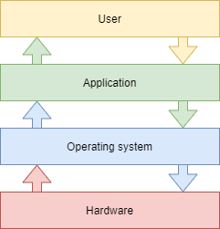

# Linux 운영 체제 소개

이 문서에서는 GNU/Linux 배포판에 대해 배우게 됩니다.

****

**목적**: 이 문서에서는 다음을 수행하는 방법에 대해 알아볼 것 입니다:

:heavy_check_mark: 운영 체제의 특징과 가능한 아키텍처에 대해 설명합니다.   
:heavy_check_mark: UNIX 및 GNU/Linux의 역사를 자세히 설명합니다.   
:heavy_check_mark: 필요에 맞는 Linux 배포판을 선택하는 방법에 대해 설명합니다.   
:heavy_check_mark: 자유 및 오픈 소스 소프트웨어의 철학을 설명합니다.   
:heavy_check_mark: Shell의 유용성에 대해 알아봅니다.

:checkered_flag: **개요**, **Linux**, **배포**

**지식**: :star:    
**복잡성**: :star:

**소요 시간**: 10 분

****

## 운영 체제란 무엇인가?

Linux, UNIX, BSD, VxWorks, Windows, 그리고 MacOS 는 모두 **운영체제**입니다.

!!! 개요

    운영 체제는 **컴퓨터의 사용 가능한 리소스를 관리하는 프로그램 집합입니다**.

이러한 리소스 관리의 일부로 운영 체제는 다음을 수행해야 합니다:

* ** 물리** 또는 **가상** 메모리를 관리합니다.
    * **물리 메모리**는 프로그램 실행에 사용되는 RAM 바와 프로세서 캐시 메모리로 구성됩니다.
    * **가상 메모리**는 하드 디스크(**swap** 파티션) 의 위치로서, 컴퓨터의 전원을 종료 할 때 물리 메모리의 언로딩과 시스템의 현재 상태를 저장하는 역할을 합니다.
* **주변 장치에 대한 액세스**를 차단합니다. 소프트웨어가 하드웨어에 직접 액세스하는 경우는 거의 없습니다(그래픽 카드의 경우 특정한 요구 사항을 위해 제외될 수 있음).
* 애플리케이션에 적절한 **작업 관리**를 제공합니다. 운영 체제는 프로세서를 점유하는 프로세스를 스케줄링하는 역할을 담당합니다.
* 승인되지 않은 접근으로부터 **파일을 보호**합니다.
* 사용 중이거나 진행 중인 프로그램에 대한 **정보를 수집**합니다.

## UNIX - GNU/Linux에 대한 개요

### 역사

#### UNIX

* **1964 — 1968**: MULTICS(Multiplexed Information and Computing Service)는 MIT, Bell Labs(AT&T) 및 General Electric용으로 개발되었습니다.

* **1969 — 1971**: 1969년 Bell과 General Electric이 프로젝트에서 철수한 후, MULTICS가 너무 복잡하다고 판단한 두 명의 개발자 Ken Thompson과 Dennis Ritchie는 UNIX(UNiplexed Information and Computing Service -단일화된 정보 및 전산 서비스)의 개발을 시작합니다(Brian Kernighan은 나중에 합류했습니다). UNIX는 원래 어셈블리 언어로 개발되었으나, 개발자들은 1970년도 초반에 B 언어와 C 언어를 개발하여 UNIX를 완전히 다시 작성했습니다. 1970년에 개발되었으므로, UNIX/Linux 시스템의 시작 시점 기준일(epoch)은 1970년 1월 1일로 설정되어 있습니다.

C 언어는 오늘날 가장 인기 있는 프로그래밍 언어 중 하나입니다. low-level 언어는 하드웨어에 가까운 수준의 언어로, C 컴파일러를 갖춘 모든 기계 아키텍처에 대한 운영 체제의 적응을 가능하게 합니다.

UNIX는 컴퓨팅 역사에서 중요한 역할을 해온 개방적이고 진화하는 운영 체제입니다. 이는 Linux, BSD, MacOS 등과 같은 다른 많은 시스템의 기초를 형성합니다.

UNIX는 오늘날에도 여전히 유의미합니다(HP-UX, AIX, Solaris 등).

#### GNU Project

* **1984**: Richard Matthew Stallman은 GNU(GNU의 Not Unix) 프로젝트를 **자유**롭고 **개방**적인 Unix 시스템을 구축하는 것을 목표로 하며 시작했습니다. 이 Unix 시스템에서 중요한 도구들에는 gcc 컴파일러, bash shell, Emacs 편집기 등이 있습니다. GNU는 Unix 계열의 운영 체제입니다. 1984년 1월에 시작된 GNU 개발은 GNU 프로젝트로 알려져 있습니다. GNU의 많은 프로그램들은 GNU 프로젝트의 후원을 받아 출시되었습니다. 이를 GNU 패키지라고 부릅니다.

* **1990**: GNU의 자체 커널인 GNU Hurd는 (리눅스가 시작되기 전인) 1990년에 시작되었습니다

#### MINIX

* **1987**: Andrew S. Tanenbaum은 운영 체제를 간단한 방법으로 가르치기 위해 단순화된 UNIX인 MINIX를 개발합니다. 그는 본인의 운영체제의 소스 코드를 이용할 수 있게 합니다.

#### Linux

* **1991**: 핀란드 학생인 **Linus Torvalds**는 자신의 개인용 컴퓨터에서 실행되는 운영 체제를 만들고 이름을 Linux로 지정합니다. 그는 Usenet 토론 포럼에 0.02라고 불리는 그의 첫 번째 버전을 게시하고, 다른 개발자들은 그의 시스템을 개선하는 것을 도왔습니다. Linux라는 용어는 이를 개발한 Linus의 이름과 UNIX 사이의 말장난입니다.

* **1993**: Debian 배포판이 생성됩니다. Debian은 비상업적인 커뮤니티 기반 배포판입니다. 원래 서버에서 사용하도록 개발된 것으로 이 역할에 적합하지만 개인용 컴퓨터에서도 사용할 수 있는 범용 시스템입니다. Debian은 Mint나 Ubuntu와 같은 많은 다른 배포판의 기반을 형성합니다.

* **1994**: 상용 배포판 Red Hat은 오늘날 GNU/Linux  운영 체제의 주요 배포업체인 Red Hat 회사에서 만들어졌습니다. Red Hat은 커뮤니티 버전인 Fedora와 최근까지 무료 배포판인 CentOS를 지원합니다.

* **1997**: KDE 데스크톱 환경이 출시되었습니다. 이는 Qt 컴포넌트 라이브러리와 C++ 개발 언어를 기반으로 합니다.

* **1999**: GNOME 데스크톱 환경이 출시되었습니다. 이는 GTK+ 컴포넌트 라이브러리를 기반으로 합니다.

* **2002**: Arch 배포판이 출시되었습니다. 롤링 릴리즈(지속된 업데이트)를 제공하는 것이 특징입니다.

* **2004**: Ubuntu는 Canonical 회사(Mark Shuttleworth)에 의해 만들어졌습니다. Debian을 기반으로 하지만 자유 소프트웨어와 사유 소프트웨어가 포함되어 있습니다.

* **2021**: Rocky Linux가 Red Hat 배포판을 기반으로 출시되었습니다.

!!! 정보

    이름에 대한 논쟁: 사람들이 리눅스 운영 체제를 구두로 부르는 것에 익숙하지만, Linux는 엄격히 말해 커널입니다. 그래서 우리는 오픈 소스 대의에 대한 GNU 프로젝트의 개발과 기여를 잊어서는 안 됩니다! 저는 이를 GNU/Linux 운영 체제라고 부르는 것을 선호합니다.

### 시장 점유율

<!--
TODO: graphics with market share for servers and pc.
-->

리눅스의 보급에도 불구하고, 일반 대중들은 리눅스를 비교적 잘 알지 못합니다. 리눅스는 **스마트폰**, **텔레비전**, **인터넷 박스** 등 안에 숨겨져 있습니다. 전 세계 **웹 사이트의 거의 70%**가 Linux 또는 UNIX 서버에서 호스팅됩니다!

리눅스는 **개인용 컴퓨터의 약 3%**정도에 설치되어 있지만, **스마트폰의 약 82% **이상에 설치되어 있습니다. 예를 들어 **Android** 운영 체제는 Linux 커널을 사용합니다.

<!-- TODO: review those stats -->

2018년부터 상위 500대 슈퍼컴퓨터에 Linux가 100%로 장착되었습니다. 슈퍼컴퓨터는 특히 컴퓨팅 속도와 관련하여 설계 당시 알려진 기술로, 가능한 최고의 성능을 달성하도록 설계된 컴퓨터입니다.

### 아키텍쳐 설계

* ** 커널**은 첫 번째 소프트웨어 구성 요소입니다.
    * 리눅스 시스템의 핵심입니다.
    * 시스템의 하드웨어 리소스를 관리합니다.
    * 하드웨어에 액세스하려면 다른 소프트웨어 컴포넌트를 거쳐야 합니다.
* **셸**은 사용자 명령을 해석하고 실행을 보장하는 유틸리티입니다.
    * 주요 셸: Bourne 셸, C 셸, Korn 셸 및 Bourne-Again 셸(배시).
* **애플리케이션**은 다음을 포함하는 사용자 프로그램입니다:
    * 인터넷 브라우저
    * 워드 프로세서
    * 스프레드시트

#### 멀티 태스크 (다중 작업)

Linux는 시분할 운영 체제 제품군에 속합니다. 여러 프로그램 간에 처리 시간을 분할하여, 사용자에게 투명한 방식으로 한 프로그램에서 다른 프로그램으로 전환합니다. 이는 다음을 의미합니다:

* 여러 프로그램을 동시에 실행합니다.
* 스케줄러에 의한 CPU 시간 분배를 합니다.
* 실패한 응용 프로그램으로 인한 문제를 감소합니다.
* 실행 중인 프로그램이 너무 많을 경우 성능이 저하됩니다.

#### 멀티 유저

MULTICS의 목적은 여러 사용자가 단일 컴퓨터(당시 매우 비싼)에서 여러 터미널(화면과 키보드)을 통해 작업할 수 있도록 하는 것이었습니다. Linux는 이 운영 체제에서 영감을 받아 여러 사용자와 동시에 독립적으로 작업할 수 있는 기능을 유지했습니다. 각 사용자는 자체 사용자 계정을 가지고 있으며 메모리 공간 및 파일 및 소프트웨어에 대한 액세스 권한을 갖게 됩니다.

#### 멀티 프로세서

리눅스는 멀티 프로세서 컴퓨터 또는 멀티 코어 프로세서와 함께 작동할 수 있습니다.

#### 멀티 플랫폼

Linux는 컴파일 중에 다양한 유형의 플랫폼에 적용할 수 있는 고급 언어(high-level language)로 작성됩니다. 이를 통해 다음에서 실행할 수 있습니다:

* 가정용 컴퓨터(PC 및 랩톱)
* 서버(데이터 및 애플리케이션)
* 휴대용 컴퓨터(스마트폰 및 태블릿)
* 임베디드 시스템(자동차 컴퓨터)
* 활성 네트워크 요소(라우터 및 스위치)
* 가전제품(TV 및 냉장고)

#### Open (오픈)

Linux는 [POSIX](http://en.wikipedia.org/wiki/POSIX), [TCP/IP](https://en.wikipedia.org/wiki/Internet_protocol_suite), [NFS](https://en.wikipedia.org/wiki/Network_File_System) 및 [Samba](https://en.wikipedia.org/wiki/Samba_(software))들과 같은 공인 표준을 기반으로 합니다, 이를 통해 다른 애플리케이션 시스템과 데이터 및 서비스를 공유할 수 있습니다.

### UNIX/Linux 철학

* 모든 것을 파일로 처리합니다.
* 휴대성을 중시합니다.
* 한 가지만 잘하면 됩니다.
* KISS: (Keep It Simple Stupid) 간단하게 유지하십시오.
* "UNIX는 기본적으로 단순한 운영 체제이지만, 단순함을 이해하려면 천재가 되어야 합니다." (__Dennis Ritchie__)
* "Unix는 사용자 친화적입니다. 어떤 사용자에게 친숙할지 명확하지 않습니다." (__Steven King__)

## GNU/Linux 배포

Linux 배포판은 Linux 커널을 중심으로 구성된 **일관된 소프트웨어 세트**이며 자체 관리(설치, 제거, 구성)에 필요한 구성요소와 함께 설치할 준비가 되어 있습니다. **연합**또는 **커뮤니티** 배포(Debian, Rocky)와 **상용** 배포(Red Hat, Ubuntu)가 있습니다.

각 배포판은 하나 이상의 **데스크탑 환경**을 제공하고 사전 설치된 소프트웨어 세트와 추가 소프트웨어 라이브러리를 제공합니다. 구성 옵션(예: 커널 또는 서비스 옵션)은 각 배포에 따라 다릅니다.

이 원칙을 통해 배포판은 **초보자**(Ubuntu, Linux Mint...)를 지향하거나 **고급 사용자**(Gentoo, Arch)를 위해 맞춤 제작을 할 수 있습니다; 배포판은 **서버**(Debian, Red Hat) 또는 **워크스테이션**(Fedora)에 더 적합할 수도 있습니다.

### 데스크탑 환경

**GNOME**, **KDE**, **LXDE**, **XFCE**등 많은 그래픽 환경이 있습니다. 리눅스는 모두를 위한 선택지가 있으며, 그들의 **사용성**은 Microsoft나 Apple 시스템에 대적할 만큼 우수합니다.

그렇다면 이 시스템이 실질적으로 **바이러스가 없는**데도 불구하고 Linux에 대한 열의가 적은 이유는 무엇일까요? 많은 편집자(Adobe)와 제조업체(Nvidia)가 무료 게임을 하지 않고 GNU/Linux용 __드라이버__ 또는 소프트웨어 버전 패키지를 제공하지 않기 때문일까요? 아마도 변화에 대한 두려움 때문일 수도 있고, Linux 컴퓨터를 구입할 곳을 찾기 어렵거나, Linux에서 출시되는 게임이 너무 적기 때문일 수도 있습니다. 그러나 Linux용 게임 엔진 Steam의 출시되면서, 이제 그런 변명은 할 수 없습니다.

**GNOME 3** 데스크톱 환경은 더 이상 데스크톱 개념을 사용하지 않고 GNOME Shell의 개념을 사용합니다 (GNOME 셸과 명령줄 셸을 혼동하지 마세요). 이는 데스크톱, 대시보드, 알림 영역 및 창 선택기 역할을 합니다. GNOME 데스크탑 환경은 **GTK+** 컴포넌트 라이브러리를 기반으로 합니다.

**KDE** 데스크톱 환경은 **Qt** 컴포넌트 라이브러리를 기반으로 합니다. 일반적으로 Windows 환경에 익숙한 사용자에게 권장됩니다.

### Free / 오픈소스

Microsoft 또는 Mac 운영 체제의 사용자가 이 운영 체제를 사용하려면 라이센스를 구입해야 합니다. 이 라이선스는 비용이 발생하지만 일반적으로 투명하게 처리됩니다(라이선스 비용은 컴퓨터 가격에 포함되어 있습니다).

**GNU/Linux** 세계에서는 대부분의 무료 배포판을 제공하는 자유 소프트웨어 운동이 있습니다.

**Free**는 무료를 의미하지 않습니다!

**오픈 소스**: 소스 코드가 공개되어 있어 일정한 조건에서 참고 및 수정이 가능합니다.

자유 소프트웨어는 반드시 오픈 소스인 반면, 오픈 소스 소프트웨어는 GPL 라이선스가 제공하는 자유와 구분됩니다.

#### GNU GPL(GNU General Public License: 일반 공중 사용 허가서)

**GPL**은 소프트웨어 작성자에게 지적 재산권을 보장하지만 소스 코드가 소프트웨어에 포함된 경우 제3자에 의한 소프트웨어 수정, 재배포 또는 재판매를 허용합니다. GPL은 리눅스를 만드는 데 중요한 역할을 했던 **GNU **(GNU is Not UNIX) 프로젝트에서 나온 라이센스입니다.

이는 다음을 의미합니다.

* 어떤 목적으로든 프로그램을 실행할 수 있는 자유.
* 프로그램 작동 방식을 연구하고 필요에 맞게 조정할 수 있는 자유.
* 복사본을 재배포할 수 있는 자유.
* 프로그램을 개선하고 전체 커뮤니티의 이익을 위해 이러한 개선 사항을 게시할 수 있는 자유.

반면, GPL에 따라 라이센스가 부여된 제품도 비용이 발생할 수 있습니다. 이는 제품 자체를 위한 것이 아니라 **개발자 팀이 제품을 발전시키고 오류를 해결하거나 사용자에게 지원을 제공하기 위해 계속해서 작업할 것임을 보장**합니다.

## 사용 분야

Linux 배포판은 다음과 같은 이점이 있습니다:

* **서버**: HTTP, 이메일, 그룹웨어, 파일 공유 등
* **보안**: 게이트웨이, 방화벽, 라우터, 프록시 등
* **중앙 컴퓨터**: 은행, 보험, 산업 등
* **내장형 시스템**: 라우터, 인터넷 박스, SmartTV 등

Linux는 데이터베이스나 웹사이트를 호스팅하거나 메일 서버, DNS, 또는 방화벽으로 사용하기에 적합합니다. 간단히 말해서, 리눅스는 거의 모든 것을 할 수 있으며, 이로 인해 다양한 특정 배포판이 존재하는 것을 설명할 수 있습니다.

## 셸

### 개요

사용자는 _명령 인터페이스_로 알려진 **셸**을 통해 운영 체제에 명령을 보낼 수 있습니다. 오늘날에는 그래픽 인터페이스의 구현으로 인해 그 영향이 적어졌지만, 그래도 그래픽 인터페이스나 설정 인터페이스가 없는 Linux 시스템에서 여전히 중요한 수단으로 남아 있습니다.

셸은 고전적인 구조(루프, 대안)와 공통 구성 요소(변수, 매개 변수 전달 및 하위 프로그램)를 포함하는 실제 프로그래밍 언어를 제공합니다. 스크립트를 생성하여 특정 작업(백업, 사용자 생성, 시스템 모니터링 등) 을 자동화할 수 있습니다.

플랫폼 또는 사용자의 기본 설정에 따라 사용 가능하고 구성할 수 있는 여러 유형의 셸이 있습니다. 몇 가지 예는 다음과 같습니다.

* sh, POSIX 표준 셸
* csh, C의 명령 지향 쉘
* bash, Bourne-Again 셸, Linux 셸

### 기능

* 명령 실행(지정된 명령을 확인하고 실행).
* 입력/출력 리디렉션(데이터를 화면에 쓰는 대신 파일로 반환).
* 연결 프로세스(사용자의 연결을 관리).
* 프로그래밍 언어 해석(스크립트 생성 허용).
* 환경 변수(작동 중 시스템 관련 정보에 대한 액세스).

### 원칙

## 배운 내용 확인하기

:heavy_check_mark: 운영 체제는 컴퓨터의 사용 가능한 리소스를 관리하기 위한 프로그램 집합입니다:

- [ ] 예
- [ ] 아니오

:heavy_check_mark: 운영 체제는 다음을 수행하는 데 필요합니다:

- [ ] 물리 및 가상 메모리 관리
- [ ] 주변 장치에 대한 직접 액세스 허용
- [ ] 작업 관리를 프로세서에 맡기기
- [ ] 사용했거나 사용 중인 프로그램에 대한 정보 수집

:heavy_check_mark: UNIX 개발에 참여한 사람들은 누구인가요:

- [ ] Linus Torvalds
- [ ] Ken Thompson
- [ ] Lionel Richie
- [ ] Brian Kernighan
- [ ] Andrew Stuart Tanenbaum

:heavy_check_mark: 리눅스 커널을 만든 리누스 토발즈(Linus Torvalds)의 원래 국적은 어디인가요:

- [ ] 스웨덴
- [ ] 핀란드
- [ ] 노르웨이
- [ ] 벨기에
- [ ] 프랑스

:heavy_check_mark: 다음 배포판 중 가장 오래된 배포판은 무엇입니까?

- [ ] Debian
- [ ] Slackware
- [ ] Red Hat
- [ ] Arch

:heavy_check_mark: Linux 커널은:

- [ ] 멀티태스킹
- [ ] 멀티 유저
- [ ] 멀티 프로세서
- [ ] 멀티 코어
- [ ] 크로스 플랫폼
- [ ] 오픈

:heavy_check_mark: 자유 소프트웨어는 반드시 오픈 소스여야 하나요?

- [ ] 예
- [ ] 아니오

:heavy_check_mark: 오픈 소스 소프트웨어는 반드시 무료입니까?

- [ ] 예
- [ ] 아니오

:heavy_check_mark: 다음 중 셸이 아닌 것은 무엇입니까:

- [ ] Jason
- [ ] Jason-Bourne shell (jbsh)
- [ ] Bourne-Again shell (bash)
- [ ] C shell (csh)
- [ ] Korn shell (ksh)   
