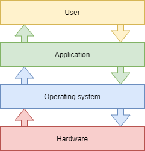

# Introdução ao Sistema Operativo Linux

Neste capítulo você aprenderá sobre as distribuições GNU/Linux.

****

**Objetivos**: Neste capítulo você vai aprender como:

:heavy_check_mark: Descrever os recursos e possíveis arquiteturas de um sistema operativo   
:heavy_check_mark: Recordar a História do UNIX e GNU/Linux   
:heavy_check_mark: Escolher a distribuição Linux mais adequada para suas necessidades   
:heavy_check_mark: Explicar a filosofia do software livre   
:heavy_check_mark: Compreender a utilidade do SHELL.

:checkered_flag: **generalidades**, **linux**, **distribuições**

**Conhecimento**: :star:    
    
**Complexidade**: :star:

**Tempo de leitura**: 10 minutos

****

## O que é um sistema operativo?

Linux, UNIX, BSD, Windows e MacOS são todos **sistemas operativos**.

!!! resumo

    Um sistema operativo é um **conjunto de programas que gerenciam a disponibilidade de recursos em um computador**.

Entre esta gestão de recursos, o sistema operacional tem de:

* Gerenciar a memória física ou virtual.
    * A **memória física** é composta pelas barras de memória RAM e pela memória cache do processador, que é usada para a execução de programas.
    * A **memória virtual** é um local no disco rígido (a **partição swap**) que permite descarregar o conteúdo da memória física e salvar do estado atual do sistema durante o desligamento elétrico do computador.
* Interceptar **acesso aos periféricos**. O software raramente tem permissão para acessar diretamente o hardware (exceto para placas gráficas em necessidades muito específicas).
* Fornecer aplicativos com **gestão de tarefas** adequada. O sistema operativo é responsável por agendar processos para ocupar o uso do processador.
* **Proteger arquivos** contra acesso não autorizado.
* **Coletar informações** sobre programas em uso ou em andamento.

## Generalidades UNIX - GNU/Linux

### História

#### UNIX

* De **1964 a 1968**: MULTICS (Serviço de Informação e Computação MULTiplexado) é desenvolvido para MIT, Bell Labs (AT&T) e General Electric.

* **1969 — 1971**: Depois da saída de Bell Labs (1969) e General Electric do projeto, dois desenvolvedores, Ken Thompson e Dennis Ritchie (seguidos posteriormente por Brian Kernighan), que consideravam o MULTICS muito complexo, iniciaram o desenvolvimento do UNIX (Serviço de Informação e Computação UNIplexado). Embora tenha sido originalmente criado na linguagem Assembly, os criadores do UNIX acabaram desenvolvendo a linguagem B e a linguagem C (1971) e reescreveram completamente o UNIX. Como foi desenvolvido em 1970, a data de referência (época) dos sistemas UNIX/Linux ficou estabelecida em 1 de janeiro de 1970.

A linguagem C permanece como uma das linguagens de programação mais populares do mundo atualmente. Uma linguagem de baixo nível, próxima do hardware, permite a adaptação do sistema operativo a qualquer arquitetura de máquinas que tenha um compilador de C.

O UNIX é um sistema operativo aberto e em evolução que tem desempenhado um papel importante na história da computação. Ele forma a base para muitos outros sistemas operativos como Linux, BSD, MacOS, etc.

O UNIX ainda é relevante nos dias de hoje (HP-UX, AIX, Solaris, etc.).

#### Projeto GNU

* **1984**: Richard Matthew Stallman lançou o Projeto GNU (GNU Não é Unix), que visa estabelecer um sistema Unix **livre** e **aberto**, onde as ferramentas mais importantes são: o compilador gcc, shell bash, editor Emacs e assim por diante. GNU é um sistema operativo do tipo Unix. O desenvolvimento do GNU, iniciado em janeiro de 1984, é conhecido como Projeto GNU. Muitos dos programas do GNU são libertados sob os auspícios do Projecto GNU; aqueles que chamamos pacotes GNU.

* **1990**: o próprio kernel do GNU, o GNU Hurd, foi iniciado em 1990 (antes do início do Linux).

#### MINIX

* **1987**: Andrew S. Tanenbaum desenvolveu o MINIX, um UNIX simplificado, para ensinar sistema operativo de uma maneira mais simples. O Sr. Tanenbaum disponibiliza o código-fonte do seu sistema operativo.

#### Linux

* **1991**: Um estudante finlandês, **Linus Torvalds**, cria um sistema operativo que é executado no seu computador pessoal e o nomeia como Linux. Ele publica a sua primeira versão, chamada 0.02, no fórum de discussão da Usenet e outros programadores o ajudam a melhorar o seu sistema. O termo Linux é uma combinação de palavras entre o primeiro nome do fundador, Linus, e UNIX.

* **1993**: a distribuição Debian é criada. Debian é uma distribuição não comercial, mantida pela comunidade. Originalmente desenvolvido para uso em servidores, é bem adequado para este papel; no entanto, é um sistema universal, utilizável também em um computador pessoal. O Debian forma a base para muitas outras distribuições, como Mint ou Ubuntu.

* **1994**: A distribuição comercial do Red Hat é criada pela empresa Red Hat, que é hoje a principal distribuidora do sistema operativo GNU/Linux. A Red Hat apoia a versão da comunidade do Fedora e até recentemente a distribuição gratuita CentOS.

* **1997**: O ambiente gráfico KDE é criado. Ele é baseado na biblioteca de componentes Qt e na linguagem de programação C++.

* **1999**: O ambiente de trabalho GNOME é criado. Ele é baseado na biblioteca de componentes GTK+.

* **2002**: a distribuição Arch é criada. Seu distintivo é que ele oferece lançamentos constantes (atualização contínua).

* **2004**: Ubuntu é criado pela empresa Canonical (Mark Shuttleworth). É baseado no Debian, mas inclui software livre e proprietário.

* **2021**: O Rocky Linux é criado, com base na distribuição Red Hat.

!!! informações

    Disputa sobre o nome: embora as pessoas estejam acostumadas a chamar de sistema operacional Linux, Linux é estritamente um kernel. Não podemos esquecer o desenvolvimento e a contribuição do projecto GNU para a causa do código aberto! Prefiro chamá-lo sistema operativo GNU/Linux.

### Participação no mercado

<!--
TODO: graphics with market share for servers and pc.
-->

Apesar de sua forte presença, o Linux permanece relativamente desconhecido pelo público em geral. O Linux está escondido em **smartphones**, **televisores**, **caixas de internet**, etc. Quase **70% dos sítios web** no mundo estão hospedados em servidores Linux ou UNIX!

O Linux equipa cerca de **3% dos computadores pessoais**, mas mais de **82% dos smartphones**. O sistema operacional **Android**, por exemplo, utiliza um kernel Linux.

<!-- TODO: review those stats -->

O Linux equipa 100% dos 500 principais supercomputadores desde 2018. Um supercomputador é um computador criado para alcançar o maior desempenho possível com as técnicas conhecidas no momento da sua concepção, especialmente no que diz respeito à velocidade de computação.

### Projeto arquitetônico

* O **kernel** é o primeiro componente de software.
    * É o coração do sistema Linux.
    * Ele gerencia os recursos de hardware do sistema.
    * Os outros componentes do software devem passar por ele para acessar o hardware.
* O **shell** é um utilitário que interpreta comandos do usuário e garante sua execução.
    * Principais shells: Bourne shell, C shell, Korn shell e Bourne-Again shell (bash).
* **Aplicações** são programas do usuário, incluindo, mas não se limitando a:
    * Navegadores de Internet
    * Processadores de texto
    * Planilhas

#### Multi-tarefa

O Linux pertence à família de sistemas operativos com compartilhamento de tempo. Ele divide o tempo de processamento entre diversos programas, alternando entre um e outro de maneira transparente para o utilizador. Isso implica:

* Execução simultânea de vários programas.
* Distribuição do tempo de CPU pelo agendador.
* Redução de problemas causados por uma aplicação com falha.
* Desempenho reduzido em caso de muitos programas em execução.

#### Multi-utilizador

O propósito do MULTICS era permitir que vários utilizadores trabalhassem a partir de vários terminais (tela e teclado) a partir de um único computador (muito caro naquele tempo). Linux, inspirado por este sistema operativo, manteve esta habilidade de trabalhar com vários utilizadores simultaneamente e independentemente, cada um com a sua própria conta de utilizador com espaço de memória e acesso a arquivos e software.

#### Multi-processador

O Linux é capaz de trabalhar com computadores de multi-processadores ou processadores multi-núcleos.

#### Multi-plataforma

O Linux é escrito em uma linguagem de alto nível que pode ser adaptada a diferentes tipos de plataformas durante sua compilação. Isso permite que ele seja executado em:

* Computadores domésticos (PC e portátil)
* Servidores (dados e aplicativos)
* Computadores portáteis (smartphones e tablets)
* Sistemas embarcados (computadores de automóveis)
* Elementos de rede ativos (roteadores e switches)
* Aparelhos domésticos (TVs e refrigeradores)

#### Aberto

O Linux é baseado em padrões reconhecidos como [POSIX](http://en.wikipedia.org/wiki/POSIX), [TCP/IP](https://en.wikipedia.org/wiki/Internet_protocol_suite), [NFS](https://en.wikipedia.org/wiki/Network_File_System), e [Samba](https://en.wikipedia.org/wiki/Samba_(software)), que lhe permitem compartilhar dados e serviços com outros sistemas de aplicativo.

### A filosofia UNIX/Linux

* Tratar tudo como arquivo.
* Valorizar a portabilidade.
* Fazer uma coisa e fazer bem-feito.
* KISS: Manter Estupidamente Simples.
* "O UNIX é basicamente um sistema operativo simples, mas é preciso ser um génio para entender a simplicidade." (__Dennis Ritchie__)
* "Unix é amigável ao utilizador". Ele apenas não é claro a respeito de com quais utilizadores será amigável." (__Steven King__)

## As distribuições GNU/LINUX

Uma distribuição Linux é um **conjunto consistente de software** montado em torno do kernel do Linux, pronto para ser instalado juntamente com os componentes para a sua gestão (instalação, remoção, configuração). Existem distribuições **associativas** ou **comunitárias** (Debian, Rocky) e distribuições **comerciais** (Red Hat, Ubuntu).

Cada distribuição oferece um ou mais **ambientes gráficos** e fornece um conjunto de programas pré-instalados e uma biblioteca de programas adicional. Opções de configuração (kernel ou opções de serviços, por exemplo) são específicas para cada distribuição.

Este princípio permite que as distribuições sejam adaptadas para **iniciantes** (Ubuntu, Linux Mint...), ou totalmente personalizável para **usuários avançados** (Gentoo, Arch); as distribuições também podem ser mais adequadas para **servidores** (Debian, Red Hat), ou **estações de trabalho** (Fedora).

### Ambientes gráficos

Existem diversos ambientes gráficos, como **GNOME**, **KDE**, **LXDE**, **XFCE**, etc. Existem interfaces para todos os tipos de pessoas, e a sua **ergonomia** não perde em nada para os sistemas Microsoft ou Apple.

Então por que há tão pouco entusiasmo em relação ao Linux, sendo que este sistema é praticamente **sem vírus**? Pode ser porque muitos editores (Adobe) e fabricantes (Nvidia) não jogam o jogo livre e não fornecem uma versão de seus programas ou __drivers__ para GNU/Linux? Talvez seja medo da mudança, ou a dificuldade de encontrar onde comprar um computador com Linux, ou poucos jogos distribuídos para Linux. Essa última justificativa não deve durar muito, com o advento do motor de jogo da Steam para Linux.

O ambiente de trabalho **GNOME 3** não usa mais o conceito de desktop, mas sim o de GNOME Shell (não deve ser confundido com a linha de comando shell). Ele serve como área de trabalho, painel de controle, área de notificações e um seletor de janela. O ambiente de trabalho GNOME é baseado na biblioteca de componentes **GTK+**.

O ambiente gráfico **KDE** é baseado na biblioteca de componentes **Qt**. Ele é normalmente recomendado para utilizadores familiarizados com um ambiente Windows.

### Livre / Código Aberto

Um utilizador de um sistema operativo Windows ou Mac deve comprar uma licença para o uso legal do sistema operativo. Essa licença tem um custo, embora geralmente não apareça (o preço da licença está incluído no preço do computador).

No universo **GNU/Linux**, o movimento Software Livre fornece principalmente distribuições livres.

**Livre** não significa grátis!

**Código Aberto**: o código-fonte é disponibilizado, por isso é possível consultá-lo e modificá-lo sob certas condições.

Um software livre é necessariamente de código aberto, mas o oposto não é verdade, já que o software de código aberto é diferente da liberdade oferecida pela licença GPL.

#### GNU GPL (Licença Pública Geral GNU)

A **GPL** garante ao autor de um software a sua propriedade intelectual, mas permite modificação, redistribuição ou revenda do programa por terceiros, desde que o código-fonte esteja incluído no software. A GPL é a licença que veio do projeto **GNU** (GNU não é UNIX), a qual foi fundamental na criação do Linux.

Isso implica:

* A liberdade de executar o programa, para qualquer finalidade.
* A liberdade para estudar como o programa funciona e adaptá-lo às suas necessidades.
* A liberdade para redistribuir cópias.
* A liberdade para melhorar o programa e publicar essas melhorias para o benefício de toda a comunidade.

Por outro lado, até mesmo os produtos licenciados sob a GPL podem ter um custo. Isto não é para o produto em si, mas a **garantia que uma equipa de programadores continuará a trabalhar nela para fazer com que evolua e resolver problemas, ou até mesmo fornecer suporte a utilizadores**.

## Áreas de uso

Uma distribuição Linux é ideal para:

* **Servidores**: HTTP, email, programas colaborativos, compartilhamento de arquivos, etc.
* **Segurança**: Gateway, barreira de segurança, roteador, proxy, etc.
* **Computadores centrais**: Bancos, seguradoras, indústria, etc.
* **Sistemas embarcados**: Roteadores, Caixas de Internet, SmartTVs, etc.

O Linux é uma escolha adequada para hospedar bancos de dados ou sítios web, ou como um servidor de correio eletrónico, DNS ou barreira de segurança. Em suma, o Linux pode fazer praticamente qualquer coisa, o que explica a quantidade de distribuições específicas.

## Shell

### Generalidades

O **shell**, conhecido como _linha de comando_, permite que os utilizadores enviem comandos para o sistema operativo. É menos visível hoje, desde a implementação de ambientes gráficos, mas continua a ser um meio privilegiado em sistemas Linux, onde nem todos possuem interfaces gráficas e cujos serviços nem sempre têm uma interface de configuração.

Oferece uma verdadeira linguagem de programação, incluindo as estruturas clássicas (loops de repetição, estruturas condicionais) e os constituintes comuns (variáveis, passagem de parâmetros e subprogramas). Permite a criação de scripts para automatizar determinadas ações (backups, criação de utilizadores, monitoramento de sistemas, etc.).

Existem vários tipos de shells disponíveis e configuráveis em uma plataforma ou conforme a preferência do utilizador. Alguns exemplos incluem:

* sh, o shell padrão do POSIX
* csh, shell orientado a comando em C
* bash, Bourne-Again Shell, shell Linux

### Funcionalidades

* Execução de comando (verifica o comando informado e o executa).
* Redirecionamento de Entrada/Saída (retorna o dado a um arquivo, ao invés de exibi-lo no ecrã).
* Processo de conexão (gerencia a conexão do utilizador).
* Linguagem de programação interpretada (permitindo a criação de scripts).
* Variáveis de ambiente (acesso a informações específicas do sistema durante a operação).

### Princípio

## Teste os seus conhecimentos

:heavy_check_mark: Um sistema operacional é um conjunto de programas para gerenciar os recursos disponíveis de um computador:

- [ ] Verdadeiro
- [ ] Falso

:heavy_check_mark: O sistema operacional é necessário para:

- [ ] Gerenciar a memória física e virtual
- [ ] Permitir acesso direto aos periféricos
- [ ] Subcontratar o gerenciamento de tarefas para o processador
- [ ] Coletar informações sobre os programas utilizados ou em uso

:heavy_check_mark: Dentre essas personalidades, quais participaram do desenvolvimento do UNIX:

- [ ] Linus Torvalds
- [ ] Ken Thompson
- [ ] Lionel Richie
- [ ] Brian Kernighan
- [ ] Andrew Stuart Tanenbaum

:heavy_check_mark: A nacionalidade original de Linus Torvalds, criador do kernel Linux, é:

- [ ] Sueco
- [ ] Finlandês
- [ ] Norueguês
- [ ] Flamengo
- [ ] Francês

:heavy_check_mark: Qual das seguintes distribuições é a mais antiga:

- [ ] Debian
- [ ] Slackware
- [ ] Red Hat
- [ ] Arch

:heavy_check_mark: O kernel Linux é:

- [ ] Multi-tarefa
- [ ] Multi-usuário
- [ ] Multiprocessador
- [ ] Multi-core
- [ ] Multiplataforma
- [ ] Aberto

:heavy_check_mark: O software livre é necessariamente de código aberto?

- [ ] Verdadeiro
- [ ] Falso

:heavy_check_mark: O software de código aberto é necessariamente gratuito?

- [ ] Verdadeiro
- [ ] Falso

:heavy_check_mark: Qual dos seguintes não é um shell:

- [ ] Jason
- [ ] Jason-Bourne shell (jbsh)
- [ ] Bourne-Again shell (bash)
- [ ] C shell (csh)
- [ ] Korn shell (ksh)   
