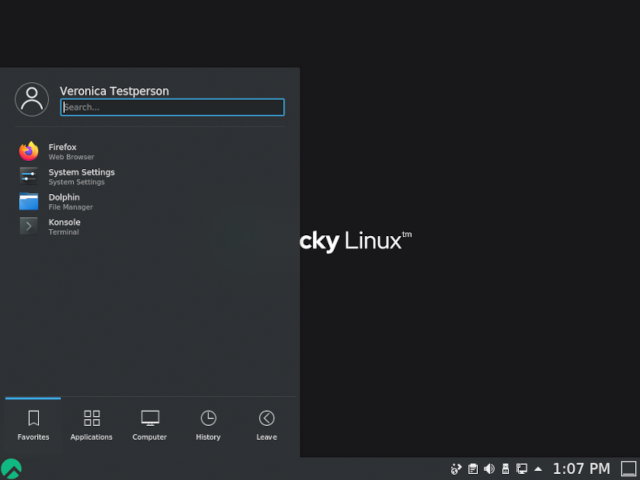

# Linux 操作系统简介

本章将带您将了解 GNU/Linux 发行版。

****

**目标**: 在本章中，您将学习以下内容：

:heavy_check_mark: 操作系统的特性和可能的架构   
:heavy_check_mark: UNIX 和 GNU/Linux 的历史   
:heavy_check_mark: 根据需求选择合适的 Linux 发行版   
:heavy_check_mark: 自由和开源软件的哲学   
:heavy_check_mark: 认识 SHELL 的实用性。

:checkered_flag: **概述**, **linux**, **发行版**

**知识掌握程度**: :star:    
**知识复杂程度**: :star:

**阅读时间**: 10 分钟

****

## 什么是操作系统？

Linux、UNIX、BSD、Windows 和 MacOS 都是**操作系统**。

!!! abstract "摘要"

    操作系统是 **管理计算机可用资源的一组程序** 。

作为资源管理的一部分，操作系统必须：

* 管理 **物理** 或 **虚拟** 内存。
    * **物理内存**是用于执行程序的内存条和处理器缓存组成。
    * **虚拟内存**是硬盘上的一个位置（ **swap**分区），它允许在计算机断电期间取下物理内存的情况下，能够保存系统的当前状态。
* 拦截**访问外设**。 软件很少被允许直接访问硬件（除了用于非常特殊需求的显卡）。
* 为应用程序提供适当的**任务管理**。 操作系统负责调度进程以充分使用处理机。
* **保护文件**不受未经授权的访问。
* **收集有关正在使用或正在进行的程序信息** 。

## UNIX - GNU/Linux 概述

### 历史

#### UNIX

* **1964 — 1968**：MIT、贝尔实验室（AT&T）和通用电气公司共同研发了 MULTICS（多功能信息和计算服务）。

* **1969 — 1971**：在贝尔（1969）和通用电气退出该项目后，两位开发人员（肯·汤普森和丹尼斯·里奇）以及后来的布莱恩·科尼根（Brian Kernighan）认为 MULTICS 过于复杂，便启动开发 UNIX（UNiplexed Information and Computing Service，单一功能信息和计算服务）。 UNIX最初是用汇编语言开发的，它的设计者先后开发了B语言和C语言(1971年)，并完全重写了UNIX。 由于 UNIX/Linux 系统是在1970年开发的，因此 UNIX/Linux 系统的起始时间参考日期（纪元日期）设置为1970年01月01日。

C语言仍然是当今最流行的编程语言之一。 它是一种接近硬件的低级语言，允许操作系统适配任何具有C编译器的机器架构。

UNIX 是一种开放且不断发展的操作系统，在计算历史上发挥了重要作用。 它已成为许多其他系统的基础，如 Linux、BSD、Mac OSX 等。

UNIX 在今天仍然很重要（HP-UX、AIX、Solaris等）。

#### GNU项目

* **1984**：Richard Matthew Stallman启动了GNU（GNU's Non-Unix）项目，旨在建立一个**自由的** 、**开放的** Unix 系统，其中较重要的工具有：gcc 编译器、bash shell、Emacs 编辑等等。 GNU 是一个 类Unix 的操作系统。 GNU的开发始于1984年1月，被称为GNU项目。 GNU中的许多程序都是在GNU项目的支持下发布的，我们称之为GNU软件包。

* **1990**：GNU自己的内核 GNU Hurd 开始于1990年（早于 Linux 内核之前）。

#### MINIX

* **1987**：Andrew S. Tanenbaum开发 MINIX（一种简化的UNIX），以简单的方式教授操作系统课程。 且 Tanenbaum 先生公开了他的操作系统源代码。

#### Linux

* **1991**：芬兰学生 **Linus Torvalds** 创建了一个专用于他个人电脑的操作系统，并将其命名为 Linux 。 他在 Usenet 论坛上发布了他的第一个版本，名为 0.02，其他开发者也来帮助他改进他的系统。 术语 Linux 是来自创始人的名字 Linus 和 UNIX 两者的组合。

* **1993**: 创建 Debian 发行版。 Debian 是一个基于社区的非商业发行版。 最初是为了在服务器上使用而开发的，其非常适合这一角色；然而，它是一个通用的系统，所以也可以在个人计算机上使用。 Debian是许多其他发行版的基础，比如 Mint 或 Ubuntu 。

* **1994**：商业发行版 Red Hat 是由 Red Hat 公司创建的，该公司现在是 GNU/Linux 操作系统的领先经销商。 Red Hat 公司支持社区版 Fedora 以及最近的免费发行版 CentOS。

* **1997**：创建 KDE 桌面环境。 它基于 Qt 组件库和 C++ 开发语言。

* **1999**：创建 GNOME 桌面环境。 它基于 GTK+ 组件库。

* **2002**：创建 Arch 发行版。 它的独特之处在于它提供滚动发布（持续更新）。

* **2004**：Canonical 公司（Mark Shuttleworth）创建 Ubuntu。 它基于 Debian，但包括自由和专有软件。

* **2021**：基于 Red Hat 发行版创建Rocky Linux。

!!! info "信息"

    名称争议：尽管人们习惯于口头上称呼 Linux 操作系统，但严格来说 Linux 只是一个内核。 我们不能忘记 GNU 项目对开源事业的发展和贡献，所以！ 我更愿意将它称为 GNU/Linux 操作系统。

### 市场份额

<!--
TODO: graphics with market share for servers and pc.
-->

尽管 Linux 很流行，但公众对它的了解仍然相对较少。 Linux 隐藏在**智能手机**、**电视**、**互联网盒子**等中。 世界上几乎 **70%的网站** 都托管在 Linux 或 UNIX 服务器上！

Linux在 **大约3%的个人电脑** 上安装，在 **智能手机上超过82%** 。 其中的 **Android** 是以 Linux 为内核的操作系统。

<!-- TODO: review those stats -->

自2018年以来，前500名超级计算机100%配备了 Linux 。 超级计算机是一种在设计时利用已知的技术实现尽可能高性能的计算机，尤其是在计算速度方面。

### 架构设计

* **kernel** 是首要的软件组件。
    * 它是 Linux 系统的核心。
    * 它管理系统的硬件资源。
    * 其他软件组件必须通过它才能访问硬件。
* **shell** 是一个解释并执行用户命令的工具。
    * 主要的 shell：Bourne shell、C shell、Korn shell 和 Bourne-Again shell (bash)。
* **Applications** 是用户程序，包括但不限于：
    * 互联网浏览器
    * 文字处理程序
    * 电子表格

#### 多任务

Linux 属于分时操作系统家族。 它在几个程序之间分配处理时间，以对用户透明的方式从一个程序切换到另一个程序。 这意味着：

* 同时执行多个程序。
* 调度程序分配 CPU 时间。
* 减少由失败的应用程序导致的问题。
* 在程序运行过多的情况下降低性能。

#### 多用户

MULTICS 的目的是允许多个用户在一台计算机上（当时非常昂贵）通过多个终端（屏幕和键盘）工作。 受这种操作系统的启发，Linux保留了这种同时让多用户一起独立工作的能力，每个用户都有自己的用户帐户、内存空间以及对文件和软件的访问权限。

#### 多处理器

Linux 能够在多处理器计算机或多核处理器上工作。

#### 多平台

Linux 是用高级语言编写的，在编译过程中可以适应不同类型的平台。 这允许它运行在：

* 家用电脑（个人电脑或笔记本电脑）
* 服务器（数据、应用程序）
* 便携式电脑（智能手机或平板电脑）
* 嵌入式系统（车载电脑）
* 有源网络元件（路由器、交换机）
* 家用电器（电视、冰箱）

#### 开放

Linux基于 [POSIX](http://en.wikipedia.org/wiki/POSIX)、[TCP/IP](https://en.wikipedia.org/wiki/Internet_protocol_suite)、[NFS](https://en.wikipedia.org/wiki/Network_File_System) 和 [Samba](https://en.wikipedia.org/wiki/Samba_(software)) 等公认的标准，这些标准允许 Linux 与其他应用程序系统共享数据和服务。

### UNIX/Linux 哲学

* 一切皆文件。
* 重视移植性。
* 做一件事且把它做好。
* KISS 原则：保持简单化和傻瓜化。
* "UNIX 基本上是一个简单的操作系统，但你必须是一个天才才能理解它的简单性。" (__Dennis Ritchie__)
* "Unix 对用户是友好的， 只不过他在对哪个用户友好的问题上，用情比较专一而已。" (__Steven King__)

## GNU/Linux 发行版

Linux 发行版是围绕 Linux 内核组装的一组 **一致软件集** ，可与管理此软件的必要组件一起安装（安装、删除、配置）。 有 **联合的** 或 **社区的** 发行版（Debian、Rocky），以及 **商业的** 发行版（RedHat、Ubuntu）。

每个发行版提供一个或多个 **桌面环境**，并提供一套预装软件和一个附加软件库。 配置选项（例如内核或服务选项）特定于每个发行版的。

这一原则允许有面向 **初学者** 的发行版（Ubuntu、Linux Mint等）或者完全为 **高级用户** 定制的发行版（Gentoo、Arch）；更专注于 **服务器** 的发行版（Debian、Red Hat）或者专注于 **工作站** 的发行版。

### 桌面环境

有许多图形环境，如 **GNOME**、**KDE**、**LXDE**、**XFCE** 等。 每个桌面环境都有自己的东西，它们的**人机交互设计**可与微软或苹果系统相媲美。

那么，既然这个 Linux 系统几乎 **没有病毒**，为什么人们对它的热情如此之低呢？ 也许是因为所有设计师（Adobe） 或制造商 （NVidia） 都不玩免费游戏，也不提供适用于 GNU/Linux 的软件或驱动程序版本？ 也许是因为害怕改变，或者是很难找到买 Linux 电脑的地方，或者是在 Linux下发行的游戏太少。 随着游戏引擎 Steam for Linux 的出现，最后一个借口至少不会持续太久。

**GNOME 3** 桌面环境不再使用桌面的概念，而是使用 GNOME Shell 的概念（不要与命令行 shell 混淆）。 它可以作为桌面、仪表盘、通知区和窗口选择器。 GNOME 桌面环境基于 **GTK+** 组件库而来。

**KDE** 桌面环境基于 **Qt** 组件库而来。 通常建议熟悉 Windows 环境的用户使用。

### 自由 / 开源

Microsoft 或 Mac 操作系统的用户必须购买许可证才能使用其操作系统。 尽管许可证通常是透明的（许可证的价格包含在电脑的价格中），但它是有成本的。

在**GNU/Linux**世界中，自由软件运动提供了大部分的自由发行版。

**自由** 并不意味着免费！

**开源**：可获取源代码，因此可以在特定条件下查阅和修改它。

自由软件必然是开源的，但反之则不然，因为开源软件与 GPL 开源许可所提供的自由是分开的。

#### GNU GPL (GNU 通用公共许可证)

**GPL** 保证软件的作者拥有其知识产权，但允许第三方修改、再分发或转售软件，前提是软件需要包含源代码。 GPL 是来自 **GNU**（GNU is Not UNIX）项目的许可证，该项目在创建 Linux 时起到了重要作用。

这暗示着使用者可以：

* 有出于任何目运行程序的自由。
* 研究程序如何工作并根据需要进行调整的自由。
* 重新分发副本的自由。
* 为了整个社区的利益，有改进且发布这些改进的自由。

另一方面，即使是在 GPL 许可下的产品也可以有付费。 但这并不是为产品本身付费，而是 **保证开发团队将继续致力于该产品，以使其发展和排除错误，甚至为用户提供支持** 。

## 使用领域

Linux 发行版在以下方面表现出色：

* **服务器**：HTTP、电子邮件、群件、文件共享等。
* **安全**：网关、防火墙、路由器、代理等。
* **中央计算机**：银行、保险、工业等。
* **嵌入式系统**：路由器、网络盒子、智能电视等。

Linux 是托管数据库或网站，或者作为邮件服务器、DNS 或防火墙的合适选择。 简而言之，Linux 几乎可以做任何事情，这就解释了特定发行版的数量。

## Shell

### 概述

**shell** 称为_命令接口_，允许用户向操作系统发送命令。 由于图形界面的实现，它在如今已经不是那么明显了，但在 Linux 系统上仍然是一种特权手段，Linux 系统并非都具有图形界面，并且其服务并不总是存在设置界面。

它提供了一种真正的编程语言，包括经典结构（循环、选择）以及常见组成部分（变量、参数传递和子程序）。 它允许创建脚本以自动执行某些操作（如备份、创建用户、系统监控等）。

根据用户的喜好，平台上有几种类型的 shell 可供使用和配置： 以下是一些例子：

* sh，POSIX 标准 shell
* csh，C 语言中面向命令的 shell
* bash，Bourne-Again Shell，Linux shell。

### 功能

* 命令执行（检查给定的命令并执行它）。
* 输入/输出重定向（将数据返回到文件而不是将其打印在屏幕上）。
* 连接过程（管理用户的连接）。
* 解释型编程语言（允许创建脚本）。
* 环境变量（在操作期间访问系统特定的信息）。

### 原理

## 检测所学知识

:heavy_check_mark: 操作系统是一组用于管理计算机可用资源的程序：

- [ ] 是
- [ ] 否

:heavy_check_mark: 操作系统必须：

- [ ] 管理物理和虚拟内存
- [ ] 允许直接访问外围设备
- [ ] 将任务管理分包给处理器
- [ ] 收集有关已使用或正在使用的程序信息

:heavy_check_mark: 以下哪些人参与了 UNIX 的开发：

- [ ] Linus Torvalds
- [ ] Ken Thompson
- [ ] Lionel Richie
- [ ] Brian Kernighan
- [ ] Andrew Stuart Tanenbaum

:heavy_check_mark: Linux 内核的创造者 Linus Torvalds 的原国籍是：

- [ ] 瑞典
- [ ] 芬兰
- [ ] 挪威
- [ ] 佛兰德
- [ ] 法国

:heavy_check_mark: 以下哪种发行版最早：

- [ ] Debian
- [ ] Slackware
- [ ] Red Hat
- [ ] Arch

:heavy_check_mark: Linux 内核是：

- [ ] 多任务
- [ ] 多用户
- [ ] 多处理器
- [ ] 多核
- [ ] 跨平台
- [ ] 开放

:heavy_check_mark: 自由软件一定是开源的吗？

- [ ] 是
- [ ] 否

:heavy_check_mark: 开源软件一定是免费的吗？

- [ ] 是
- [ ] 否

:heavy_check_mark: 以下哪项不是 shell：

- [ ] Jason
- [ ] Jason-Bourne shell (jbsh)
- [ ] Bourne-Again shell (bash)
- [ ] C shell (csh)
- [ ] Korn shell (ksh)   
