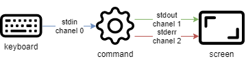

# Commandes pour utilisateurs Linux

Dans ce chapitre, vous allez apprendre à travailler avec les commandes Linux.

****

**Objectifs** : Dans ce chapitre, les futurs administrateurs Linux vont apprendre comment :

:heavy_check_mark: **se déplacer** dans l’arborescence du système ;   
:heavy_check_mark:**créer** un fichier texte, **afficher** son contenu et le **modifier** ;   
:heavy_check_mark: utiliser les commandes les plus utiles de Linux.

:checkered_flag: **commandes utilisateurs**, **linux**

**Connaissances : ** :star:   
**Complexité : ** :star:

**Temps de lecture : **40 minutes

****

## Généralités

Les systèmes Linux actuels possèdent des utilitaires graphiques dédiés au travail d’un administrateur. Toutefois, il est important d’être capable d’utiliser l’interface en mode ligne de commandes et cela pour plusieurs raisons :

* La majorité des commandes du système sont communes à toutes les distributions Linux, ce qui n’est pas le cas des outils graphiques.
* Il peut arriver que le système ne démarre plus correctement mais qu’un interpréteur de commandes de secours reste accessible.
* L’administration à distance se fait en ligne de commandes avec un terminal SSH.
* Afin de préserver les ressources du serveur, l’interface graphique n’est soit pas installée, soit lancée à la demande.
* L’administration se fait par des scripts.

L’apprentissage de ces commandes permet à l’administrateur de se connecter à un terminal Linux, de gérer ses ressources, ses fichiers, d’identifier la station, le terminal et les utilisateurs connectés, etc.

### Les utilisateurs

L’utilisateur du système Linux est défini, dans le fichier `/etc/passwd`, par :

* un **nom de connexion**, plus communément appelé « login », ne contenant pas d’espace ;
* un identifiant numérique : **UID** (User Identifier) ;
* un identifiant de groupe : **GID** (Group Identifier) ;
* un **interpréteur de commandes**, un shell, qui peut être différent d’un utilisateur à l’autre ;
* un **répertoire de connexion**, le __home directory__.

Dans d’autres fichiers par :

* un **mot de passe**, qui sera chiffré avant d’être stocké (`/etc/shadow`) ;
* une **invite de commande**, ou __prompt__ de connexion, qui sera symbolisée par un `#` pour les administrateurs et un `$` pour les autres utilisateurs (`/etc/profile`).

En fonction de la politique de sécurité mise en œuvre sur le système, le mot de passe devra comporter un certain nombre de caractères et respecter des exigences de complexité.

Parmi les interpréteurs de commandes existants, le **Bourne-Again Shell** (`/bin/bash`) est celui qui est le plus fréquemment utilisé. Il est affecté par défaut aux nouveaux utilisateurs. Pour diverses raisons, des utilisateurs avancés de Linux choisiront des interpréteurs de commandes alternatifs parmi le Korn Shell (`ksh`), le C Shell (`csh`), etc.

Le répertoire de connexion de l’utilisateur est par convention stocké dans le répertoire `/home` du poste de travail. Il contiendra les données personnelles de l’utilisateur et les fichiers de configuration de ses applications. Par défaut, à la connexion, le répertoire de connexion est sélectionné comme répertoire courant.

Une installation type poste de travail (avec interface graphique) démarre cette interface sur le terminal 1. Linux étant multi-utilisateurs, il est possible de connecter plusieurs utilisateurs plusieurs fois, sur des **terminaux physiques** (TTY) ou **virtuels** (PTS) différents. Les terminaux virtuels sont disponibles au sein d’un environnement graphique. Un utilisateur bascule d’un terminal physique à l’autre à l’aide des touches <kbd>Alt</kbd> + <kbd>Fx</kbd> depuis la ligne de commandes ou à l’aide des touches <kbd>CTRL</kbd> + <kbd>Alt</kbd> + <kbd>Fx</kbd>.

### Le shell

Une fois que l’utilisateur est connecté sur une console, le shell affiche l’invite de commandes (**prompt**). Il se comporte ensuite comme une boucle infinie, à chaque saisie d’instruction :

* affichage de l’invite de commande ;
* lecture de la commande ;
* analyse de la syntaxe ;
* substitution des caractères spéciaux ;
* exécution de la commande ;
* affichage de l’invite de commande ;
* etc.

La séquence de touche <kbd>CTRL</kbd> + <kbd>C</kbd> permet d’interrompre une commande en cours d’exécution.

L’utilisation d’une commande respecte généralement cette séquence :

```bash
commande [option(s)] [arguments(s)]
```

Le nom de la commande est **souvent en minuscules**.

Un espace sépare chaque élément.

Les **options courtes** commencent par un tiret (`-l`), alors que les **options longues** commencent par deux tirets (`--list`). Un double tiret (`--`) indique la fin de la liste d’options.

Il est possible de regrouper certaines options courtes :

```bash
$ ls -l -i -a
```

est équivalent à :

```bash
$ ls -lia
```

Il peut bien entendu y avoir plusieurs arguments après une option :

```bash
$ ls -lia /etc /home /var
```

Dans la littérature, le terme « option » est équivalent au terme « paramètre », plus utilisé dans le domaine de la programmation. Le côté optionnel d’une option ou d’un argument est symbolisé en le mettant entre crochets `[` et `]`. Lorsque plusieurs options sont possibles, une barre verticale appelée « pipe » les sépare `[a|e|i]`.

## Les commandes générales

### Les commandes `apropos`, `whatis` et `man`

Il est impossible pour un administrateur, quel que soit son niveau, de connaître toutes les commandes et options dans les moindres détails. Un manuel est généralement disponible pour toutes les commandes installées.

#### La commande `apropos`

La commande `apropos` permet de faire une recherche par mot clef au sein de ces pages de manuel :

| Options                                     | Observations                                                            |
| ------------------------------------------- | ----------------------------------------------------------------------- |
| `-s`, `--sections list` ou `--section list` | Se limite aux sections de manuel.                                       |
| `-a` ou `--and`                             | Affiche seulement l’élément correspondant à tous les mots-clés fournis. |

Exemple :

```bash
$ apropos clear
clear (1)            - clear the terminal screen
clear_console (1)    - clear the console
clearenv (3)         - clear the environment
clearerr (3)         - check and reset stream status
clearerr_unlocked (3) - nonlocking stdio functions
feclearexcept (3)    - floating-point rounding and exception handling
fwup_clear_status (3) - library to support management of system firmware updates
klogctl (3)          - read and/or clear kernel message ring buffer; set console_loglevel
sgt-samegame (6)     - Block-clearing puzzle
syslog (2)           - read and/or clear kernel message ring buffer; set console_loglevel
timerclear (3)       - timeval operations
XClearArea (3)       - clear area or window
XClearWindow (3)     - clear area or window
XSelectionClearEvent (3) - SelectionClear event structure
```

Pour chercher la commande qui va permettre le changement du mot de passe d’un compte :

```bash
$ apropos --exact password  -a change
chage (1)            - change user password expiry information
passwd (1)           - change user password
```

#### La commande `whatis`

La commande `whatis` affiche la description de la commande passée en argument :

```bash
whatis clear
```

Exemple :

```bash
$ whatis clear
clear (1)            - clear the terminal screen
```

#### La commande `man`

Une fois trouvée par `apropos` ou `whatis`, la lecture du manuel se fait par `man` (« le man est ton ami »). Cet ensemble de manuels est divisé en 8 sections, regroupant les informations par thèmes, la section par défaut étant la section 1 :

1. Commandes utilisateurs ;
2. Appels système ;
3. Fonctions de bibliothèque C ;
4. Périphériques et fichiers spéciaux ;
5. Formats de fichiers ;
6. Jeux ;
7. Divers ;
8. Outils d’administration système et démons.

Des informations sur chaque section sont accessibles en saisissant `man x intro`, où `x` est le numéro de section.

La commande :

```bash
man passwd
```

informera l’administrateur sur la commande passwd, ses options, etc. Alors qu’un :

```bash
$ man 5 passwd
```

l’informera sur les fichiers en relations avec la commande.

Toutes les pages du manuel ne sont pas traduites de l’anglais. Elles sont toutefois généralement très précises et fournissent toutes les informations utiles. La syntaxe utilisée et le découpage peuvent dérouter l’administrateur débutant, mais avec de la pratique, il y retrouvera rapidement l’information qu’il recherche.

La navigation dans le manuel se fait avec les flèches <kbd>↑</kbd> et <kbd>↓</kbd>. Le manuel se quitte en appuyant sur la touche <kbd>q</kbd>.

### La commande `shutdown`

La commande `shutdown` permet de **stopper électriquement**, immédiatement ou après un certain laps de temps, un serveur Linux.

```bash
shutdown [-h] [-r] time [message]
```

L’heure d’arrêt est à indiquer au format `hh:mm` pour une heure précise, ou `+mm` pour un délai en minutes.

Pour forcer un arrêt immédiat, le mot `now` remplacera l’heure. Dans ce cas, le message optionnel n’est pas envoyé aux autres utilisateurs du système.

Exemples :

```bash
[root]# shutdown -h 0:30 "Server shutdown at 0:30"
[root]# shutdown -r +5
```

Options :

| Options | Observations                     |
| ------- | -------------------------------- |
| `-h`    | Arrête le système électriquement |
| `-r`    | Redémarre le système             |

### La commande `history`

La commande `history` permet d’afficher l’historique des commandes qui ont été saisies par l’utilisateur.

Les commandes sont mémorisées dans le fichier `.bash_history` du répertoire de connexion de l’utilisateur.

Exemple de commande history

```bash
$ history
147 man ls
148 man history
```

| Options | Commentaires                                                                                                 |
| ------- | ------------------------------------------------------------------------------------------------------------ |
| `-w`    | L’option `-w` permet d’y copier l’historique de la session en cours.                                         |
| `-c`    | L’option `-c` effacera l’historique de la session en cours (mais pas le contenu du fichier `.bash_history`). |

* Manipuler l’historique :

Pour manipuler l’historique, des commandes permettent depuis l’invite de commandes de :

| Touches            | Fonction                                                                     |
| ------------------ | ---------------------------------------------------------------------------- |
| <kdb>!!</kdb>      | Rappeler la dernière commande passée.                                        |
| <kdb>!n</kdb>      | Rappeler la commande par son numéro dans la liste.                           |
| <kdb>!string</kdb> | Rappeler la commande la plus récente commençant par la chaîne de caractères. |
| <kdb>↑</kdb>       | Remonter l’historique des commandes.                                         |
| <kdb>↓</kdb>       | Redescendre l’historique des commandes.                                      |

### L’auto-complétion

L’auto-complétion est également d’une aide précieuse.

* Elle permet de compléter les commandes, les chemins saisis ou les noms de fichiers.
* Un appui sur la touche<kbd>TAB</kbd> complète la saisie dans le cas d’une seule solution.
* Sinon, il faudra faire un deuxième appui pour obtenir la liste des possibilités.

Si un double appui sur la touche <kbd>TAB</kbd> ne provoque aucune réaction de la part du système, c’est qu’il n’existe aucune solution à la complétion en cours.

## Affichage et identification

### La commande `clear`

La commande `clear` permet d’effacer le contenu de l’écran du terminal. En réalité, pour être plus précis, elle permet de décaler l’affichage de sorte que l’invite de commandes se retrouve en haut de l’écran sur la première ligne.

Dans un terminal, l’affichage sera définitivement masqué tandis que dans une interface graphique, un ascenseur permettra de remonter dans l’historique du terminal virtuel.

!!! TIP <kbd>CTRL</kbd> + <kbd>L</kbd> aura le même effet que la commande `clear`

### La commande `echo`

La commande `echo` permet d’afficher une chaîne de caractères.

Cette commande est plus particulièrement utilisée dans les scripts d’administration pour informer l’utilisateur pendant l’exécution.

L’option `-n` permet de ne pas revenir à la ligne après avoir affiché le texte (ce qui est le comportement par défaut de la commande).

Pour diverses raisons, le développeur du script peut être amené à utiliser des séquences spéciales (commençant par un caractère `\`). Dans ce cas, l’option `-e` sera stipulée, permettant l’interprétation des séquences.

Parmi les séquences fréquemment utilisées, nous citerons :

| Séquence | Résultat                          |
| -------- | --------------------------------- |
| `\a`    | Émet un bip sonore                |
| `\b`    | Retour en arrière                 |
| `\n`    | Ajoute un saut de ligne           |
| `\t`    | Ajoute une tabulation horizontale |
| `\v`    | Ajoute une tabulation verticale   |

### La commande `date`

La commande `date` permet d’afficher la date et l’heure. La commande respecte la syntaxe suivante :

```bash
date [-d AAAAMMJJ] [format]
```

Exemples :

```bash
$ date
Mon May 24 16:46:53 CEST 2021
$ date -d 20210517 +%j
137
```

Dans ce dernier exemple, l’option `-d` affiche une date donnée. L’option `+%j` formate cette date pour n’afficher que le quantième.

!!! Warning Le format d’une date peut changer suivant la valeur de la langue définie dans la variable d’environnement `$LANG`.

L’affichage de la date peut suivre les formats suivants :

| Option | Format                              |
| ------ | ----------------------------------- |
| `+%A`  | Nom complet du jour                 |
| `+%B`  | Nom complet du mois                 |
| `+%c`  | Affichage complet de la date        |
| `+%d`  | Numéro du jour                      |
| `+%F`  | Date au format `AAAA-MM-JJ`         |
| `+%G`  | Année                               |
| `+%H`  | Heure                               |
| `+%j`  | Quantième du jour                   |
| `+%m`  | Numéro du mois                      |
| `+%M`  | Minute                              |
| `+%R`  | Heure au format `hh:mm`             |
| `+%s`  | Secondes depuis le 1er janvier 1970 |
| `+%T`  | Heure au format `hh:mm:ss`          |
| `+%u`  | Jour de la semaine (`1` pour lundi) |
| `+%V`  | Numéro de la semaine                |
| `+%x`  | Date au format `JJ/MM/AAAA`         |

La commande `date` permet également de modifier la date et l’heure système. Dans ce cas, l’option `-s` sera utilisée.

```bash
[root]# date -s "2021-05-24 10:19"
```

Le format à respecter pour l’argument suivant l’option `-s` est celui-ci :

```bash
date -s "[AA]AA-MM-JJ hh:mm:[ss]"
```

### Les commandes `id`, `who` and `whoami`

La commande `id` affiche le nom de l’utilisateur courant et ses groupes ou ceux d’un utilisateur, si le login de celui-ci est fourni comme argument.

```bash
$ id rockstar
uid=1000(rockstar) gid=1000(rockstar) groups=1000(rockstar),10(wheel)
```

Les options `-g`, `-G`, `-n` et `-u` affichent respectivement le GID du groupe principal, les GID des groupes secondaires, les noms au lieu des identifiants numériques et l’UID de l’utilisateur.

La commande `whoami` affiche le login de l’utilisateur courant.

La commande `who` seule affiche le nom des utilisateurs connectés :

```bash
$ who
rockstar tty1   2021-05-24 10:30
root     pts/0  2021-05-24 10:31
```

Linux étant multi-utilisateurs, il est probable que plusieurs sessions soient ouvertes sur la même station, que ce soit physiquement ou à travers le réseau. Il est intéressant de savoir quels utilisateurs sont connectés, ne serait-ce que pour communiquer avec eux par l’envoi de messages.

* tty : représente un terminal.
* pts/: représente une console virtuelle sous environnement graphique, le nombre suivant représentant le numéro de la console virtuelle (0, 1, 2, ...).

L’option `-r` affiche en plus le niveau d’exécution (voir chapitre « démarrage »).

## Arborescence de fichiers

Sous Linux, l’arborescence des fichiers se présente sous la forme d’un arbre inversé, appelé **arborescence hiérarchique unique**, dont la racine est le répertoire `/`.

Le **répertoire courant** est le répertoire où se trouve l’utilisateur.

Le **répertoire de connexion** est le répertoire de travail associé à l’utilisateur. Les répertoires de connexion sont, en standard, stockés dans le répertoire `/home`.

À la connexion de l’utilisateur, le répertoire courant est le répertoire de connexion.

Un **chemin absolu** référence un fichier depuis la racine en parcourant l’arborescence complète jusqu’au niveau du fichier :

* `/home/groupA/alice/file`

Le **chemin relatif** référence ce même fichier en parcourant l’arborescence complète depuis le répertoire courant :

* `../alice/file`

Dans l’exemple précèdent, les « `..` » font référence au répertoire parent du répertoire actuel.

Un répertoire, même s’il est vide, contiendra obligatoirement au minimum **deux références** :

* `.` : référence sur lui-même.
* `..` : référence le répertoire parent du répertoire actuel.

Un chemin relatif peut ainsi commencer par `./` ou par `../`. Lorsque le chemin relatif fait référence à un sous dossier ou à un fichier du répertoire courant, alors le `./` est souvent omis. Mentionner le premier `./` de l’arborescence ne sera réellement requis que pour lancer un fichier exécutable.

Les erreurs dans les chemins peuvent être la cause de nombreux problèmes : création de dossier ou de fichiers aux mauvais endroits, suppressions involontaires, etc. Il est donc fortement recommandé d’utiliser l’auto-complétion lors des saisies de chemin.


Dans l’exemple ci-dessus, nous cherchons à donner l’emplacement du fichier `myfile` depuis le répertoire de bob.

* Par un **chemin absolu**, le répertoire courant importe peu. Nous commençons par la racine, pour descendre successivement dans les répertoires `home`, `groupA`, `alice` et enfin le fichier `myfile` : `/home/groupA/alice/myfile`.
* Par un **chemin relatif**, notre point de départ étant le répertoire courant `bob`, nous remontons d’un niveau par `..` (soit dans le répertoire `groupA`), puis nous descendons dans le répertoire `alice`, et enfin le fichier `myfile` : `../alice/myfile`.

### La commande `pwd`

La commande `pwd` (Print Working Directory) affiche le chemin absolu du répertoire courant.

```bash
$ pwd
/home/rockstar
```

Pour se déplacer à l’aide d’un chemin relatif, il faut impérativement connaître son positionnement dans l’arborescence.

Selon l’interpréteur de commandes, l’invite de commandes peut également afficher le nom du répertoire courant.

### La commande `cd`

La commande `cd` (Change Directory) permet de changer le répertoire courant, autrement dit, de se déplacer dans l’arborescence.

```bash
$ cd /tmp
$ pwd
/tmp
$ cd ../
$ pwd
/
$ cd
$ pwd
/home/rockstar
```

Comme vous pouvez le constater dans le dernier exemple ci-dessus, la commande `cd` sans argument permet de repositionner le répertoire courant sur le répertoire de connexion (`home directory`).

### La commande `ls`

La commande `ls` affiche le contenu d’un répertoire.

```bash
ls [-a] [-i] [-l] [directory1] [directory2] […]
```

Exemple :

```bash
$ ls /home
.    ..    rockstar
```

Les options principales de la commande `ls` sont :

| Option | Information                                                                                                               |
| ------ | ------------------------------------------------------------------------------------------------------------------------- |
| `-a`   | Affiche tous les fichiers, même ceux cachés. Les fichiers cachés sous Linux sont ceux qui commencent par un `.`.          |
| `-i`   | Affiche les numéros d’inode.                                                                                              |
| `-l`   | Affiche sous forme de liste verticale la liste des fichiers avec des informations supplémentaires formatées par colonnes. |

La commande `ls` offre toutefois de très nombreuses options (voir le `man`) :

| Option | Information                                                                                                                                            |
| ------ | ------------------------------------------------------------------------------------------------------------------------------------------------------ |
| `-d`   | Affiche les informations d’un répertoire au lieu de lister son contenu.                                                                                |
| `-g`   | Affiche les UID et GID plutôt que les noms des propriétaires.                                                                                          |
| `-h`   | Affiche les tailles de fichiers dans le format le plus adapté (octet, kilo-octet, méga-octet, giga-octet, …). `h` pour Human Readable.                 |
| `-s`   | Affiche la taille en octets (sauf si option `k`).                                                                                                      |
| `-A`   | Affiche tous les fichiers du répertoire sauf `.` et `..`.                                                                                              |
| `-R`   | Affiche récursivement le contenu des sous répertoires.                                                                                                 |
| `-F`   | Affiche le type des fichiers. Imprime un `/` pour un répertoire, `*` pour les exécutables, `@` pour un lien symbolique, et rien pour un fichier texte. |
| `-X`   | Trier les fichiers en fonction de leurs extensions.                                                                                                    |

* Description des colonnes :

```bash
$ ls -lia /home
78489 drwx------ 4 rockstar rockstar 4096 25 oct. 08:10 rockstar
```

| Valeur          | Information                                                                                                         |
| --------------- | ------------------------------------------------------------------------------------------------------------------- |
| `78489`         | Numéro d’inode.                                                                                                     |
| `drwx------`    | Type de fichier (`d`) et droits (`rwx------`).                                                                      |
| `4`             | Nombre de sous-répertoires (`.` et `..` inclus). Pour un fichier de type lien physique : nombre de liens physiques. |
| `rockstar`      | Utilisateur propriétaire.                                                                                           |
| `rockstar`      | Groupe propriétaire.                                                                                                |
| `4096`          | Taille en octets.                                                                                                   |
| `25 oct. 08:10` | Date de dernière modification.                                                                                      |
| `rockstar`      | Nom du fichier (ou du répertoire).                                                                                  |

!!! Note Des **alias**  sont fréquemment positionnés au sein des distributions courantes.

    C’est le cas de l’alias `ll` :

    ```
    alias ll='ls -l --color=auto'
    ```

La commande `ls` dispose de nombreuses options dont voici quelques exemples avancés d’utilisations :

* Lister les fichiers de `/etc` par ordre de dernière modification :

```bash
$ ls -ltr /etc
total 1332
-rw-r--r--.  1 root root    662 29 may   2021 logrotate.conf
-rw-r--r--.  1 root root    272 17 may.   2021 mailcap
-rw-------.  1 root root    122 12 may.  2021 securetty
...
-rw-r--r--.  2 root root     85 18 may.  17:04 resolv.conf
-rw-r--r--.  1 root root     44 18 may.  17:04 adjtime
-rw-r--r--.  1 root root    283 18 may.  17:05 mtab
```

* Lister les fichiers de `/var` plus gros qu’un méga-octet mais moins qu’un giga-octets :

```bash
$ ls -Rlh /var | grep [0-9]M
...
-rw-r--r--. 1 apache apache 1,2M 10 may.  13:02 XB RiyazBdIt.ttf
-rw-r--r--. 1 apache apache 1,2M 10 may.  13:02 XB RiyazBd.ttf
-rw-r--r--. 1 apache apache 1,1M 10 may.  13:02 XB RiyazIt.ttf
...
```

* Afficher les droits sur un dossier :

Pour connaître les droits sur un dossier, dans notre exemple `/etc`, la commande suivante ne conviendrait pas :

```bash
$ ls -l /etc
total 1332
-rw-r--r--.  1 root root     44 18 nov.  17:04 adjtime
-rw-r--r--.  1 root root   1512 12 janv.  2010 aliases
-rw-r--r--.  1 root root  12288 17 nov.  17:41 aliases.db
drwxr-xr-x.  2 root root   4096 17 nov.  17:48 alternatives
...
```

puisque cette dernière liste par défaut le contenu du dossier et non le contenant.

Pour ce faire, il faut utiliser l’option `-d` :

```bash
$ ls -ld /etc
drwxr-xr-x. 69 root root 4096 18 nov.  17:05 /etc
```

* Lister les fichiers par taille :

```bash
$ ls -lhS
```

* Afficher la date de modification au format « timestamp » :

```bash
$ ls -l --time-style="+%Y-%m-%d %m-%d %H:%M" /
total 12378
dr-xr-xr-x. 2 root root 4096 2014-11-23 11-23 03:13 bin
dr-xr-xr-x. 5 root root 1024 2014-11-23 11-23 05:29 boot
```

* Ajouter le _trailing slash_ à la fin des dossiers :

Par défaut, la commande `ls` n’affiche pas le dernier slash d’un dossier. Dans certains cas, comme pour des scripts par exemple, il est utile de les afficher :

```bash
$ ls -dF /etc
/etc/
```

* Masquer certaines extensions :

```bash
$ ls /etc --hide=*.conf
```

### La commande `mkdir`

La commande `mkdir` crée un répertoire ou une arborescence de répertoire.

```bash
mkdir [-p] repertoire [repertoire] [...]
```

Exemple :

```bash
$ mkdir /home/rockstar/work
```

Le répertoire « rockstar » devra exister pour créer le répertoire « work ».

Sinon, l’option `-p` devra être utilisée. L’option `-p` crée les répertoires parents s’ils n’existent pas.

!!! Danger Il est vivement déconseillé de donner des noms de commandes Linux comme nom de répertoires ou fichiers.

### La commande `touch`

La commande `touch` modifie l’horodatage d’un fichier ou crée un fichier vide si le fichier n’existe pas.

```bash
touch [-t date] file
```

Exemple :

```bash
$ touch /home/rockstar/myfile
```

| Option    | Information                                                                |
| --------- | -------------------------------------------------------------------------- |
| `-t date` | Modifie la date de dernière modification du fichier avec la date précisée. |

Date au format : `[AAAA]MMJJhhmm[ss]`

!!! Tip La commande `touch` est utilisée en priorité pour créer un fichier vide, mais elle peut avoir un intérêt dans le cadre de sauvegarde incrémentale ou différentielle par exemple. En effet, le fait d’exécuter un `touch` sur un fichier aura pour seul effet de forcer sa sauvegarde lors de la sauvegarde suivante.

### La commande `rmdir`

La commande `rmdir` supprime un répertoire vide.

Exemple :

```bash
$ rmdir /home/rockstar/work
```

| Option | Information                                                                    |
| ------ | ------------------------------------------------------------------------------ |
| `-p`   | Supprime le ou les répertoire(s) parent(s) à la condition qu’ils soient vides. |

!!! Tip Pour supprimer à la fois un répertoire non-vide et son contenu, il faudra utiliser la commande `rm`.

### La commande `rm`

La commande `rm` supprime un fichier ou un répertoire.

```bash
rm [-f] [-r] file [file] [...]
```

!!! Danger Toute suppression de fichier ou de répertoire est définitive.

| Options | Information                                       |
| ------- | ------------------------------------------------- |
| `-f`    | Ne demande pas de confirmation de la suppression. |
| `-i`    | Demande de confirmation de la suppression.        |
| `-r`    | Supprime récursivement les sous-répertoires.      |

!!! Note La commande `rm` en elle-même ne demande pas de confirmation lors de la suppression de fichiers. Cependant avec une distribution RedHat/CentOS, `rm` demande une confirmation de suppression car la commande `rm` y est un `alias` de la commande `rm -i`. Ne soyez pas surpris sur une autre distribution, type Debian par exemple, de ne pas obtenir de demande de confirmation.

La suppression d’un dossier à l’aide de la commande `rm`, que ce dossier soit vide ou non, nécessitera l’ajout de l’option `-r`.

La fin des options est signalée au shell par un double tiret `--`.

Dans l’exemple :

```bash
$ >-dur-dur # Pour créer un fichier vide appelé -dur-dur
dur dur
[CTRL+C] Pour interrompre la création du fichier
$ rm -f -- -dur-dur
```

Le nom du fichier -dur-dur commence par un `-`. Sans l’usage du `--` le shell aurait interprété le `-d` de `-dur-dur` comme une option.

### La commande `mv`

La commande `mv` déplace et renomme un fichier.

```bash
mv file [file ...] destination
```

Exemples :

```bash
$ mv /home/rockstar/file1 /home/rockstar/file2
$ mv /home/rockstar/file1 /home/rockstar/file2 /tmp
```

| Options | Information                                                                   |
| ------- | ----------------------------------------------------------------------------- |
| `-f`    | Ne demande pas de confirmation si écrasement du fichier de destination.       |
| `-i`    | Demande de confirmation si écrasement du fichier de destination (par défaut). |

Quelques cas concrets permettront de mieux saisir les difficultés qui peuvent se présenter :

```bash
$ mv /home/rockstar/file1 /home/rockstar/file2
```

Permet de renommer `file1` en `file2`, si `file2` existe déjà, il sera remplacé par `file1`.

```bash
$ mv /home/rockstar/file1 /home/rockstar/file2 /tmp
```

Permet de déplacer `file1` et `file2` dans le répertoire `/tmp`.

```bash
$ mv file1 /repexist/file2
```

`file1` est déplacé dans `/repexist` et renommé `file2`.

```bash
$ mv file1 file2
```

`file1` est renommé `file2`.

```bash
$ mv file1 /repexist
```

Si le répertoire de destination existe, `file1` est déplacé dans `/repexist`.

```bash
$ mv file1 /wrongrep
```

Si le répertoire de destination n’existe pas,`file1` est renommé `wrongrep` à la racine.

### La commande `cp`

La commande `cp` copie un fichier.

```bash
cp file [file ...] destination
```

Exemple :

```bash
$ cp -r /home/rockstar /tmp
```

| Option | Information                                                                 |
| ------ | --------------------------------------------------------------------------- |
| `-i`   | Demande de confirmation si écrasement (par défaut).                         |
| `-f`   | Ne demande pas de confirmation si écrasement du fichier de destination.     |
| `-p`   | Conserve le propriétaire, les permissions et l’horodatage du fichier copié. |
| `-r`   | Copie un répertoire avec ses fichiers et sous-répertoires.                  |
| `-s`   | Crée un lien symbolique plutôt que de copier.                               |

```bash
cp file1 /repexist/file2
```

`file1` est copié dans `/repexist` sous le nom `file2`.

```bash
$ cp file1 file2
```

`file1` est copié sous le nom `file2` dans ce répertoire.

```bash
$ cp file1 /repexist
```

Si le répertoire de destination existe, `file1` est copié dans `/repexist`.

```bash
$ cp file1 /wrongrep
```

Si le répertoire de destination n’existe pas, `file1` est copié sous le nom `wrongrep` à la racine.

## Visualisation

### La commande `file`

La commande `file` affiche le type d’un fichier.

```bash
file fichier1 [fichiers]
```

Exemple :

```bash
$ file /etc/passwd /etc
/etc/passwd:    ASCII text
/etc:        directory
```

### La commande `more`

La commande `more` affiche le contenu d’un ou de plusieurs fichiers écran par écran.

```bash
more fichier1 [fichiers]
```

Exemple :

```bash
$ more /etc/passwd
root:x:0:0:root:/root:/bin/bash
...
```

En utilisant la touche <kbd>ENTREE</kbd>, le déplacement se fait ligne par ligne. En utilisant la touche <kbd>ESPACE</kbd>, le déplacement se fait page par page. `/texte` permet de chercher l’occurrence dans le fichier.

### La commande `less`

La commande `less` affiche le contenu d’un ou de plusieurs fichiers. La commande `less` est interactive et possède des commandes d’utilisation qui lui sont propres.

```bash
less fichier1 [fichiers]
```

Les commandes propres à `less` sont :

| Commande         | Action                                                            |
| ---------------- | ----------------------------------------------------------------- |
| `h`              | Aide.                                                             |
| `Flèches`        | Monter, descendre d’une ligne ou pour aller à droite ou à gauche. |
| `Entrée`         | Descendre d’une ligne.                                            |
| `Espace`         | Descendre d’une page.                                             |
| `PgAR` ou `PgAV` | Monter ou descendre d’une page.                                   |
| `Pos1` ou `Fin`  | Se placer en début de fichier ou en fin de fichier.               |
| `/texte`         | Rechercher le texte.                                              |
| `q`              | Quitter la commande `less`.                                       |

### La commande `cat`

La commande `cat` concatène (mettre bout à bout) le contenu de plusieurs fichiers et affiche le résultat sur la sortie standard.

```bash
cat fichier1 [fichiers]
```

Exemple 1 - Afficher le contenu d’un fichier vers la sortie standard :

```bash
$ cat /etc/passwd
```

Exemple 2 - Afficher le contenu de plusieurs fichiers vers la sortie standard :

```bash
$ cat /etc/passwd /etc/group
```

Exemple 3 - Afficher le contenu de plusieurs fichiers dans le fichier `usersAndGroups.txt` :

```bash
$ cat /etc/passwd /etc/group > usersAndGroups.txt
```

Exemple 4 - Afficher la numérotation des lignes :

```bash
$ cat -n /etc/profile
     1    # /etc/profile: system-wide .profile file for the Bourne shell (sh(1))
     2    # and Bourne compatible shells (bash(1), ksh(1), ash(1), ...).
     3
     4    if [ "`id -u`" -eq 0 ]; then
     5      PATH="/usr/local/sbin:/usr/local/bin:/usr/sbin:/usr/bin:/sbin:/bin"
     6    else
…
```

Exemple 5 - Affiche la numérotation des lignes non vides :

```bash
$ cat -b /etc/profile
     1    # /etc/profile: system-wide .profile file for the Bourne shell (sh(1))
     2    # and Bourne compatible shells (bash(1), ksh(1), ash(1), ...).

     3    if [ "`id -u`" -eq 0 ]; then
     4      PATH="/usr/local/sbin:/usr/local/bin:/usr/sbin:/usr/bin:/sbin:/bin"
     5    else
…
```

### La commande `tac`

La commande `tac` fait quasiment l’inverse de la commande `cat`. Elle affiche le contenu d’un fichier en commençant par la fin (ce qui est particulièrement intéressant pour la lecture des logs !).

Exemple : Afficher un fichier de logs en affichant en premier la dernière ligne :

```bash
[root]# tac /var/log/messages | less
```

### La commande `head`

La commande `head` affiche le début d’un fichier.

```bash
head [-n x] fichier
```

| Option | Observation                                 |
| ------ | ------------------------------------------- |
| `-n x` | Affiche les `x` premières lignes du fichier |

Par défaut (sans l’option `-n`), la commande `head` affichera les 10 premières lignes du fichier.

### La commande `tail`

La commande `tail` affiche la fin d’un fichier.

```bash
tail [-f] [-n x] file
```

| Option | Observation                                        |
| ------ | -------------------------------------------------- |
| `-n x` | Affiche les `x` dernières lignes du fichier        |
| `-f`   | Affiche les modifications du fichier en temps réel |

Exemple :

```bash
tail -n 3 /etc/passwd
sshd:x:74:74:Privilege-separeted sshd:/var/empty /sshd:/sbin/nologin
tcpdump::x:72:72::/:/sbin/nologin
user1:x:500:500:grp1:/home/user1:/bin/bash
```

Avec l’option `-f`, la commande `tail` ne rend pas la main et s’exécute tant que l’utilisateur ne l’interrompt pas par la séquence <kbd>CTRL</kbd> +<kbd>C</kbd>. Cette option est très fréquemment utilisée pour suivre les fichiers journaux (les logs) en temps réel.

Sans l’option `-n`, la commande `tail` affiche les 10 dernières lignes du fichier.

### La commande `sort`

La commande `sort` trie les lignes d’un fichier.

Elle permet d’ordonner, ranger dans un ordre donné, le résultat d’une commande ou le contenu d’un fichier, selon un ordre numérique, alphabétique, par ordre de grandeur (Ko, Mo, Go) ou dans l’ordre inverse.

```bash
sort [-kx] [-n] [-u] [-o file] [-ty] file
```

Exemple :

```bash
$ sort -k3 -t: -n /etc/passwd
root:x:0:0:root:/root:/bin/bash
adm:x:3:4:adm:/var/adm/:/sbin/nologin
```

| Option    | Observation                                        |
| --------- | -------------------------------------------------- |
| `-kx`     | Précise la colonne `x` sur laquelle se fera le tri |
| `-n`      | Demande un tri numérique                           |
| `-o file` | Enregistre le tri dans le fichier précisé          |
| `-ty`     | Précise le caractère séparateur de champs `y`      |
| `-r`      | Inverse l’ordre du résultat                        |
| `- u`     | Ne conserve que les résultats uniques              |

La commande `sort` ne trie le fichier qu’à l’affichage écran. Le fichier n’est pas modifié par le tri. Pour enregistrer le tri, il faut utiliser l’option `-o` ou une redirection de sortie `>`.

Par défaut, le tri des nombres se fait selon leur caractère. Ainsi, « 110 » sera avant « 20 », qui sera lui-même avant « 3 ». Il faut préciser l’option `-n` pour que les blocs caractères numériques soient bien triés par leur valeur.

La commande `sort` permet d’inverser l’ordre des résultats, avec l’option `-r` :

```bash
$ sort -k3 -t: -n -r /etc/passwd
root:x:0:0:root:/root:/bin/bash
adm:x:3:4:adm:/var/adm/:/sbin/nologin
```

Dans cet exemple, la commande `sort` rangera cette fois-ci le contenu du fichier `/etc/passwd` du plus grand uid au plus petit.

Quelques exemples avancés d’utilisation de la commande `sort` :

* Mélanger les valeurs

La commande `sort` permet également de mélanger les valeurs avec l’option `-R` :

```bash
$ sort -R /etc/passwd
```

* Trier des adresses IP

Un administrateur système est rapidement confronté au traitement des adresses IP issues des logs de ses services comme SMTP, VSFTP ou Apache. Ces adresses sont typiquement extraites avec la commande `cut`.

Voici un exemple avec le fichier `dns-client.txt` :

```
192.168.1.10
192.168.1.200
5.1.150.146
208.128.150.98
208.128.150.99
```

```bash
$ sort -nr dns-client.txt
208.128.150.99
208.128.150.98
192.168.1.200
192.168.1.10
5.1.150.146
```

* Trier un fichier en supprimant les doublons

La commande `sort` permet la suppression des doublons du fichier en utilisant l'option `-u`.

Voici un exemple avec le fichier `colours.txt` :

```
Red
Green
Blue
Red
Pink
```
```
$ sort -u colours.txt
Blue
Green
Pink
Red
```

* Trier des tailles de fichiers

La commande `sort` sait reconnaître les tailles de fichiers, issues de commande comme `ls` avec l’option `-h`.

Voici un exemple avec le fichier `taille.txt` :

```
1,7G
18M
69K
2,4M
1,2M
4,2G
6M
124M
12,4M
4G
```

```bash
$ sort -hr taille.txt
4,2G
4G
1,7G
124M
18M
12,4M
6M
2,4M
1,2M
69K
```

### La commande `wc`

La commande `wc` compte le nombre de lignes, mots et/ou octets d’un fichier.

```bash
wc [-l] [-m] [-w] fichier [fichiers]
```

| Option | Observation                     |
| ------ | ------------------------------- |
| `-c`   | Compte le nombre d’octets.      |
| `-m`   | Compte le nombre de caractères. |
| `-l`   | Compte le nombre de lignes.     |
| `-w`   | Compte le nombre de mots.       |

## Recherche

### La commande `find`

La commande `find` recherche l’emplacement de fichier ou de répertoire.

```bash
find directory [-name name] [-type type] [-user login] [-date date]
```

Les options de la commande `find` étant très nombreuses, il est préférable de se référer au `man`.

Si le répertoire de recherche n’est pas précisé, la commande `find` cherchera à partir du répertoire courant.

| Option              | Observation                                     |
| ------------------- | ----------------------------------------------- |
| `-perm permissions` | Recherche des fichiers selon leurs permissions. |
| `-size taille`      | Recherche des fichiers selon leur taille.       |

### L’option `-exec` de la commande `find`

Il est possible d’utiliser l’option `-exec` de la commande `find` pour exécuter une commande à chaque ligne de résultat :

```bash
$ find /tmp -name *.txt -exec rm -f {} \;
```

La commande précédente recherche tous les fichiers du répertoire `/tmp` nommés `*.txt` et les supprime.

!!! Tip "Comprendre l’option `-exec`" Dans l’exemple ci-dessus, la commande `find` va construire une chaîne de caractères représentant la commande à exécuter.

    Si la commande `find` trouve trois fichiers nommés `log1.txt`, `log2.txt` et `log3.txt`, alors la commande `find` va construire la chaîne en remplaçant dans la chaîne `rm -f {} \;` les accolades par un des résultats de la recherche, et cela autant de fois qu’il y a de résultats.
    
    Ce qui nous donnera :

    ```
    rm -f /tmp/log1.txt ; rm -f /tmp/log2.txt ; rm -f /tmp/log3.txt ;
    ```


    Le caractère `;` est un caractère spécial du shell qui doit être protégé par un `\` pour éviter son interprétation trop tôt par la commande `find` (et non plus dans le `-exec`).

!!! Tip `$ find /tmp -name *.txt -delete` fait la même chose.

### La commande `whereis`

La commande `whereis` recherche des fichiers liés à une commande.

```bash
whereis [-b] [-m] [-s] command
```

Exemple :

```bash
$ whereis -b ls
ls: /bin/ls
```

| Option | Observation                            |
| ------ | -------------------------------------- |
| `-b`   | Ne recherche que le fichier binaire.   |
| `-m`   | Ne recherche que les pages de manuel.  |
| `-s`   | Ne recherche que les fichiers sources. |

### La commande `grep`

La commande `grep` recherche une chaîne de caractères dans un fichier.

```bash
grep [-w] [-i] [-v] "string" file
```

Exemple :

```bash
$ grep -w "root:" /etc/passwd
root:x:0:0:root:/root:/bin/bash
```

| Option | Observation                                            |
| ------ | ------------------------------------------------------ |
| `-i`   | Ignore la casse de la chaîne de caractères recherchée. |
| `-v`   | Exclut les lignes contenant la chaîne de caractère.    |
| `-w`   | Recherche exactement le mot.                           |

La commande `grep` retourne la ligne complète comprenant la chaîne de caractères recherchée.
* Le caractère spécial `^` permet de rechercher une chaîne de caractères placée en début de ligne.
* Le caractère spécial `$` permet de rechercher une chaîne de caractères placée en fin de ligne.

```bash
$ grep -w "^root" /etc/passwd
```

!!! Note Cette commande est très puissante et il est fortement conseillé de consulter son manuel. Elle a de nombreux dérivés.

Il est possible de rechercher une chaîne de caractères dans une arborescence de fichiers avec l’option `-R`.

```bash
grep -R "Virtual" /etc/httpd
```

### Les méta-caractères (wildcards)

Les méta-caractères se substituent à un ou plusieurs caractères (voire à une absence de caractère) lors d’une recherche. Ces méta-caractères sont également connus sous le nom de caractères jokers.

Ils peuvent être combinés.

Le caractère `*` remplace une chaîne composée de plusieurs caractères quelconques. Le caractère `*` peut également représenter une absence de caractère.

```bash
$ find /home -name "test*"
/home/rockstar/test
/home/rockstar/test1
/home/rockstar/test11
/home/rockstar/tests
/home/rockstar/test362
```

Les méta-caractères permettent des recherches plus complexes en remplaçant tout ou partie d’un mot. Il suffit de remplacer les inconnues par ces caractères spéciaux.

Le caractère `?` remplace un unique caractère, quel qu’il soit.

```bash
$ find /home -name "test?"
/home/rockstar/test1
/home/rockstar/tests
```

Les crochets `[` et `]` permettent de spécifier les valeurs que peut prendre un unique caractère.

```bash
$ find /home -name "test[123]*"
/home/rockstar/test1
/home/rockstar/test11
/home/rockstar/test362
```

!!! Note Prendre soin de toujours encadrer les mots contenant des méta-caractères par des `"` pour éviter qu’ils soient remplacés par le nom des fichiers qui répondraient aux critères.

!!! Warning Il ne faut pas confondre les méta-caractères du shell et ceux des expressions régulières. La commande `grep` utilise les méta-caractères des expressions régulières.

## Redirections et tubes

### L’entrée et les sorties standards

Sur les systèmes UNIX et Linux, les flux standards sont aux nombres de trois. Ils permettent aux programmes, via la bibliothèque `stdio.h` de faire entrer ou sortir des informations.

Ces flux sont appelés canal X ou descripteur X de fichier.

Par défaut :

* le clavier est le périphérique d’entrée pour le canal 0, appelé **stdin** ;
* l’écran est le périphérique de sortie pour les canaux 1 et 2, appelés **stdout** et **stderr**.



**stderr** reçoit les flux d’erreurs renvoyés par une commande. Les autres flux sont dirigés vers **stdout**.

Ces flux pointent vers des fichiers périphériques, mais comme tout est fichier sous UNIX/Linux, les flux d’entrées/sorties peuvent facilement être détournés vers d’autres fichiers. Ce principe fait toute la force du shell.

### La redirection d’entrée

Il est possible de rediriger le flux d’entrée depuis un autre fichier avec le caractère inférieur `<` ou `<<`. La commande lira le fichier au lieu du clavier :

```bash
$ ftp -in serverftp << ftp-commands.txt
```

!!! Note Seules les commandes demandant une saisie au clavier pourront gérer la redirection d’entrée.

La redirection d’entrée peut également être utilisée pour simuler une interactivité avec l’utilisateur. La commande lira le flux d’entrée jusqu’à rencontrer le mot clef défini après la redirection d’entrée.

Cette fonctionnalité est utilisée pour scripter des commandes interactives :

```bash
$ ftp -in serverftp << END
user alice password
put file
bye
END
```

Le mot clef `END` peut être remplacé par n’importe quel mot.

```bash
$ ftp -in serverftp << STOP
user alice password
put file
bye
STOP
```

Le shell quitte la commande `ftp` lorsqu’il reçoit une ligne ne contenant que le mot clef.

!!! Warning Le mot clé de fin, ici `END` ou `STOP`, pour terminer la commande doit être le seul mot de la ligne et doit être au début de sa ligne.

La redirection de l’entrée standard est peu utilisée car la plupart des commandes acceptent un nom de fichier en argument.

La commande `wc` pourrait s’utiliser ainsi :

```bash
$ wc -l .bash_profile
27 .bash_profile # the number of lines is followed by the file name
$ wc -l < .bash_profile
27 # returns only the number of lines
```

### Les redirections de sortie

Les sorties standards peuvent être redirigées vers d’autres fichiers grâce aux caractères `>` or `>>`.

La redirection simple `>` écrase le contenu du fichier de sortie :

```bash
$ date +%F > date_file
```

alors que la redirection double `>>` ajoute (concatène) au contenu du fichier de sortie.

```bash
$ date +%F >> date_file
```

Dans les deux cas, le fichier est automatiquement créé lorsqu’il n’existe pas.

La sortie d’erreur standard peut être également redirigée vers un autre fichier. Cette fois-ci, il faudra préciser le numéro du canal (qui peut être omis pour les canaux 0 et 1) :

```bash
$ ls -R / 2> errors_file
$ ls -R / 2>> errors_file
```

### Exemples de redirections

Redirection de 2 sorties vers 2 fichiers :

```bash
$ ls -R / >> ok_file 2>> nok_file
```

Redirection des 2 sorties vers un fichier unique :

```bash
$ ls -R / >> log_file 2>&1
```

Redirection de *stderr* vers un "puits sans fond" (`/dev/null`) :

```bash
$ ls -R / 2>> /dev/null
```

Lorsque les 2 flux de sortie sont redirigés, aucune information n’est affichée à l’écran. Pour utiliser à la fois la redirection de sortie et conserver l’affichage, il faudra utiliser la commande `tee`.

### Les tubes (pipe)

Un tube (**pipe** en anglais) est un mécanisme permettant de relier la sortie standard d’une première commande vers l’entrée standard d’une seconde.

Cette communication est monodirectionnelle et se fait grâce au symbole `|`. Le symbole pipe `|` est obtenu en appuyant simultanément sur les touches <kbd>AltGR</kbd> + <kbd>6</kbd>.


Toutes les données envoyées par la commande à gauche du tube à travers le canal de sortie standard sont envoyées au canal d’entrée standard de la commande placée à droite.

Les commandes particulièrement utilisées après un pipe sont des filtres.

* Exemples :

N'afficher que le début :

```bash
$ ls -lia / | head
```

N'afficher que la fin :

```bash
$ ls -lia / | tail
```

Trier le résultat :

```bash
$ ls -lia / | sort
```

Compter le nombre de mots / caractères :

```bash
$ ls -lia / | wc
```

Chercher une chaîne de caractères dans le résultat :

```bash
$ ls -lia / | grep fichier
```

## Points particuliers

### La commande `tee`

La commande `tee` permet de rediriger la sortie standard d’une commande vers un fichier tout en maintenant l’affichage à l’écran.

Elle est combinée avec le pipe `|` pour recevoir en entrée la sortie de la commande à rediriger :

```bash
$ ls -lia / | tee fic
$ cat fic
```

L’option `-a` permet d’ajouter au fichier au lieu de l’écraser.

### Les commandes `alias` et `unalias`

Utiliser les **alias** est un moyen pour demander au shell de se souvenir d’une commande particulière avec ses options et lui donner un nom.

Par exemple :

```bash
$ ll
```

remplacera la commande :

```bash
$ ls -l
```

La commande `alias` liste les alias de la session en cours. Des alias sont positionnés par défaut sur les distributions Linux. Ici, les alias d’un serveur Rocky :

```bash
$ alias
alias l.='ls -d .* --color=auto'
alias ll='ls -l --color=auto'
alias ls='ls --color=auto'
alias vi='vim'
alias which='alias | /usr/bin/which --tty-only --read-alias --show-dot --show-tilde'
```

Les alias ne sont définis que de façon temporaire, le temps de la session utilisateur.

Pour une utilisation permanente, il faut les créer dans le fichier :

* `.bashrc` du répertoire de connexion de l’utilisateur ;
* `/etc/profile.d/alias.sh` pour tous les utilisateurs.

!!! Warning Une attention particulière doit être portée lors de l’usage d’alias qui peuvent potentiellement s’avérer dangereux ! Par exemple, un alias mis en place à l’insu de l’administrateur :

    ```bash
    alias cd='rm -Rf'
    ```

La commande `unalias` permet de supprimer les alias.

Pour supprimer un seul alias :

```bash
$ unalias ll
```

Pour supprimer tous les alias:

```bash
$ unalias -a
```

Pour désactiver un alias temporairement, la combinaison est `\<alias name>`.

Par exemple, si nous faisons:

```bash
$ type ls
```

il pourrait nous retourner :

```bash
ls is an alias to « ls -rt »
```

Maintenant que nous savons que c'est le cas, nous pouvons voir les résultats de l'utilisation de l'alias ou le désactiver une fois avec le `\` en exécutant les commandes suivantes :

```bash
$ ls file*   # order by time
file3.txt  file2.txt  file1.txt
$ \ls file*  # order by name
file1.txt  file2.txt  file3.txt
```

### Alias et fonctions utiles

* alias `grep`.

Colorise le résultat de la commande `grep` : `alias grep='grep --color=auto'`

* fonction `mcd`

Il est fréquent de créer un dossier puis de se déplacer dedans : `mcd() { mkdir -p "$1"; cd "$1"; }`

* fonction `cls`

Se déplacer dans un dossier et lister son contenu : `cls() { cd "$1"; ls; }`

* fonction `backup`

Créer une copie de sauvegarde d’un fichier : `backup() { cp "$1"{,.bak}; }`

* fonction `extract`

Extrait tout type d’archive :

```bash
extract () {
  if [ -f $1 ] ; then
    case $1 in
      *.tar.bz2) tar xjf $1 ;;
      *.tar.gz) tar xzf $1 ;;
      *.bz2) bunzip2 $1 ;;
      *.rar) unrar e $1 ;;
      *.gz) gunzip $1 ;;
      *.tar) tar xf $1 ;;
      *.tbz2) tar xjf $1 ;;
      *.tgz) tar xzf $1 ;;
      *.zip) unzip $1 ;;
      *.Z) uncompress $1 ;;
      *.7z) 7z x $1 ;;
      *)
        echo "'$1' cannot be extracted via extract()" ;;
    esac
  else
    echo "'$1' is not a valid file"
  fi
}

```

* Si `alias cmount` renvoie le résultat suivant : `alias cmount="mount | column -t"`

Alors nous pouvons utiliser `cmount` pour afficher tous les montages système dans des colonnes comme ceci : `[root]# cmount`

qui retournera les système de fichiers montés comme ceci :

```bash
/dev/simfs  on  /                                          type  simfs        (rw,relatime,usrquota,grpquota)
proc        on  /proc                                      type  proc         (rw,relatime)
sysfs       on  /sys                                       type  sysfs        (rw,relatime)
none        on  /dev                                       type  devtmpfs     (rw,relatime,mode=755)
none        on  /dev/pts                                   type  devpts       (rw,relatime,mode=600,ptmxmode=000)
none        on  /dev/shm                                   type  tmpfs        (rw,relatime)
none        on  /proc/sys/fs/binfmt_misc                   type  binfmt_misc  (rw,relatime)
```

### Le caractère `;`

Le caractère`;` chaîne les commandes.

Les commandes s’exécuteront toutes séquentiellement dans l’ordre de saisie une fois que l’utilisateur aura appuyé sur ENTREE.

```bash
$ ls /; cd /home; ls -lia; cd /
```

## Testez vos connaissances

:heavy_check_mark: Qu’est ce qui défini un utilisateur sous Linux ? (7 réponses)

:heavy_check_mark: Qu’est ce qui caractérise une option longue pour une commande ?

:heavy_check_mark: Quelles commandes permettent de rechercher de l’aide sur une commande ?

- [ ] `google`
- [ ] `chuck --norris`
- [ ] `info`
- [ ] `apropos`
- [ ] `whatis`

:heavy_check_mark: Quelle commande permet de visualiser l’historique d’un utilisateur ?

:heavy_check_mark: Quelle commande permet de rechercher du texte dans un fichier ?

- [ ] `find`
- [ ] `grep`

:heavy_check_mark: Quelle commande permet de rechercher un fichier ?

- [ ] `find`
- [ ] `grep`

:heavy_check_mark: Quelle commande redirige le flux des erreurs d’une commande vers un nouveau fichier `errors.log` ?

- [ ] `ls -R / 2> errors.log`
- [ ] `ls -R / 2>> errors.log`
- [ ] `ls -R / 2> errors.log 2>&1`   
