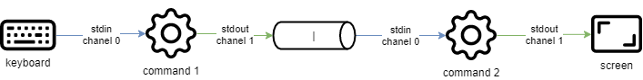

# Linux 사용자를 위한 명령어

이 문서에서는 Linux 명령어와 명령어 사용 방법에 대해 설명합니다.

****

**목표**: 이 문서에서는 미래의 Linux 관리자가 다음을 수행하는 방법을 배웁니다:

:heavy_check_mark: 시스템 트리 내에서 **이동**   
:heavy_check_mark: 텍스트 파일 **생성**, 내용을** 표시 ** 및 ** 수정**   
:heavy_check_mark: 가장 유용한 Linux 명령어를 **사용**

:checkered_flag: **사용자 명령어**, **linux**

**지식**: :star:   
**복잡성**: :star:

**소요 시간**: 40분

****

## 개요

현재 Linux 시스템에는 관리자 업무를 위한 전용 그래픽 유틸리티가 있습니다. 그러나 다음과 같은 몇 가지 이유로 command line 모드에서 인터페이스를 사용할 수 있어야 합니다.

* 대부분의 시스템 명령어들은 모든 Linux 배포판에 공통적으로 사용되지만, 그래픽 도구의 경우에는 그렇지 않은 경우가 많습니다.
* 시스템이 올바르게 시작되지 않을 수 있지만, 백업 명령 해석기에는 여전히 접근할 수 있는 경우가 있을 수 있습니다.
* 원격 관리는 SSH 터미널이 있는 command line에서 수행됩니다.
* 서버 자원을 보존하기 위해, 그래픽 인터페이스는 설치되지 않거나 필요할 때에만 실행됩니다.
* 관리는 스크립트에 의해 수행됩니다.

이러한 명령어를 학습함으로써 관리자는 Linux 터미널에 연결하여 리소스 및 파일을 관리하며, 터미널 및 연결된 사용자 등을 식별할 수 있습니다.

### 사용자 계정

Linux 시스템의 사용자는 `/etc/passwd` 파일에서 다음과 같이 정의됩니다:

* **로그인 이름**은, 일반적으로 "로그인"이라고 하며 공백을 포함하지 않습니다.
* 숫자 식별자: **UID**(User Identifier - 사용자 식별자).
* 그룹 식별자: **GID**(Group Identifier - 그룹 식별자).
* **명령 인터프리터**(예: 셸)는 사용자마다 다를 수 있습니다.
* **연결 디렉토리**(예: __홈 디렉토리__).

사용자는 다른 파일에서 다음에 의해 정의됩니다:

* **비밀번호**: 저장하기 전에 암호화됩니다 (`/etc/shadow`).
* **명령 프롬프트** 또는 __프롬프트__ 로그인: 관리자의 경우 `#`로 표시되며, 다른 사용자의 경우 `$`로 표시됩니다 (`/etc/profile`).

시스템에 구현된 보안 정책에 따라 암호는 특정 수의 문자를 필요로 하며 특정 복잡성 요구 사항을 충족해야합니다.

기존 명령 인터프리터 중에서 **Bourne-Again Shell**(`/bin/bash`) 이 가장 많이 사용됩니다. 이는 기본적으로 새 사용자에게 할당됩니다. 또한, 고급 Linux 사용자는 다양한 이유로 Korn Shell(`ksh`), C Shell(`csh`) 등과 같은 대체 쉘을 선택할 수 있습니다.

사용자의 로그인 디렉토리는 규칙에 따라 워크스테이션의 `/home` 디렉토리에 저장됩니다. 여기에는 사용자의 개인 데이터와 애플리케이션의 구성 파일이 포함됩니다. 기본적으로 로그인 시 로그인 디렉터리가 현재 디렉터리로 선택됩니다.

그래픽 인터페이스를 갖춘 워크스테이션 형태의 설치에서는 이 인터페이스가 터미널 1에서 시작됩니다. Linux는 다중 사용자이므로 서로 다른 **물리 터미널**(TTY) 또는 **가상 터미널**(PTS)에서 여러 사용자를 여러 번 연결할 수 있습니다. 가상 터미널은 그래픽 환경 내에서 사용할 수 있습니다. 사용자가 명령줄에서 <kbd>Alt</kbd> + <kbd>Fx</kbd> 또는 <kbd>CTRL</kbd> + <kbd>Alt</kbd> + <kbd>Fx</kbd>를 사용하여 하나의 물리 터미널에서 다른 터미널로 전환할 수 있습니다.

### 셸

사용자가 콘솔에 연결되면 셸에 **명령 프롬프트**가 표시됩니다. 그런 다음에는 무한 루프처럼 동작하여 각 문장을 입력할 때마다 동일한 패턴을 반복합니다.

* 명령 프롬프트를 표시합니다.
* 명령을 읽습니다.
* 구문을 분석합니다.
* 특수 문자를 대체합니다.
* 명령을 실행합니다.
* 명령 프롬프트를 표시합니다.
* etc.

키 시퀀스 <kbd>CTRL</kbd> + <kbd>C</kbd>는 실행 중인 명령을 중단하는 데 사용됩니다.

명령 사용은 일반적으로 다음 순서를 따릅니다:

```bash
command [option(s)] [arguments(s)]
```

명령 이름은 종종 **소문자**로 표시됩니다.

각 항목은 공백으로 구분됩니다.

**짧은 옵션**은 대시(`-l`) 로 시작하고 **긴 옵션**은 두 개의 대시(`--list`) 로 시작합니다. 이중 대시(`--`)는 옵션 목록의 끝을 나타냅니다.

몇 가지 짧은 옵션을 함께 그룹화할 수 있습니다 :

```bash
$ ls -l -i -a
```

이는 다음과 같습니다.

```bash
$ ls -lia
```

옵션 뒤에는 여러 개의 인수가 있을 수 있습니다:

```bash
$ ls -lia /etc /home /var
```

문헌에서 "옵션(option)"이라는 용어는 프로그래밍에서 더 일반적으로 사용되는 "매개변수(Parameter)"라는 용어와 동일한 의미를 갖습니다. 옵션 또는 인수의 선택적 측면은 대괄호 `[` 또는 `]`로 묶어 기호화됩니다. 둘 이상의 옵션이 가능한 경우 "파이프"라는 세로 막대가 `[a|e|i]`를 구분합니다.

## 일반 명령어

### `apropos`, `whatis` 및 `man` 명령

어떤 수준의 관리자라도 모든 명령어와 옵션을 상세히 알고 있는 것은 불가능합니다 일반적으로 설치된 모든 명령에 대한 매뉴얼을 사용할 수 있습니다.

#### `apropos` 명령

`apropos` 명령을 사용하면 다음 매뉴얼 페이지 내에서 키워드로 검색할 수 있습니다:

| 옵션                                          | 설명                          |
| ------------------------------------------- | --------------------------- |
| `-s`, `--sections list` 또는 `--section list` | 매뉴얼 섹션으로 제한됩니다.             |
| `-a` 또는 `--and`                             | 제공된 모든 키워드와 일치하는 항목만 표시합니다. |

예시:

```bash
$ apropos clear
clear (1)             -  터미널 화면 지우기
clear_console (1)     - 콘솔 지우기
clearenv (3)          - 환경 변수 지우기
clearerr (3)          - 스트림 상태 확인 및 재설정
clearerr_unlocked (3) - 잠금 해제된 비차단 stdio 함수
feclearexcept (3)     - 부동 소수점 반올림 및 예외 처리
fwup_clear_status (3) - 시스템 펌웨어 업데이트 관리 지원 라이브러리
klogctl (3)           - 커널 메시지 링 버퍼 읽기 및/또는 지우기; console_loglevel 설정
sgt-samegame (6)      - 블록 제거 퍼즐
syslog (2)            - 커널 메시지 링 버퍼 읽기 및/또는 지우기; console_loglevel 설정
timerclear (3)        - timeval 작업
XClearArea (3)        - 영역 또는 창 지우기
XClearWindow (3)      - 영역 또는 창 지우기
XSelectionClearEvent (3) - SelectionClear 이벤트 구조체
```

계정의 암호를 변경할 수 있는 명령을 찾으려면 다음을 수행해야합니다:

```bash
$ apropos --exact password  -a change
chage (1)            - 사용자 암호 만료 정보 변경
passwd (1)           - 사용자 암호 변경
```

#### `whatis` 명령

`whatis` 명령은 인수로 전달된 명령에 대한 설명을 표시합니다.

```bash
whatis clear
```

예시:

```bash
$ whatis clear
clear (1)            - 터미널 화면 지우기
```

#### `man` 명령

`apropos` 또는 `whatis`에 의해 발견되면 매뉴얼은 `man`에 의해 읽혀집니다("Man은 당신의 친구라고 생각하세요"). 이 매뉴얼 세트는 8개의 섹션으로 나뉘어져 있으며, 각각의 섹션은 주제별로 정보를 그룹화합니다. 기본 섹션은 1입니다:

1. 실행 가능한 프로그램 또는 명령.
2. 시스템 호출(커널이 제공하는 기능).
3. 라이브러리 호출(라이브러리가 제공하는 기능).
4. 특수 파일(일반적으로 /dev에 있음).
5. 파일 형식 및 규칙(etc/passwd와 같은 구성 파일).
6. 게임 (문자 기반 응용 프로그램 등).
7. 기타(예: man(7)).
8. 시스템 관리 명령(일반적으로 루트에만 해당).
9. 커널 루틴 (non-standard).

각 섹션에 대한 정보는 `man x intro`를 입력하여 액세스할 수 있습니다. 여기서 `x`는 섹션 번호입니다.

명령어:

```bash
man passwd
```

이 명령은 passwd 명령과 해당 옵션 등에 대해 관리자에게 알립니다. 반면에 이 명령은:

```bash
$ man 5 passwd
```

명령과 관련된 파일에 대해 알려줍니다.

<kbd>↑</kbd> 및 <kbd>↓</kbd> 화살표를 사용하여 매뉴얼을 탐색합니다. <kbd>q</kbd> 키를 눌러 매뉴얼을 종료합니다.

### `shutdown` 명령

`shutdown` 명령을 사용하면 Linux 서버를 즉시 또는 일정 시간이 후에 **전원을 종료**할 수 있습니다.

```bash
shutdown [-h] [-r] time [message]
```

종료 시간을 `hh:mm` 형식으로 지정하여 정확한 시간을 지정하거나, 지연 시간(분)을 `+mm`로 지정합니다.

즉시 중지하려면 시간 대신 `now`이라는 단어를 사용합니다. 이 경우 옵셔널 메시지는 시스템의 다른 사용자에게 전송되지 않습니다.

예시:

```bash
[root]# shutdown -h 0:30 "Server shutdown at 0:30"
[root]# shutdown -r +5
```

옵션:

| 옵션   | 메모              |
| ---- | --------------- |
| `-h` | 시스템을 전원을 종료합니다. |
| `-r` | 시스템을 다시 시작합니다.  |

### `history` 명령

`history` 명령은 사용자가 입력한 명령의 기록을 표시합니다.

명령은 사용자 로그인 디렉토리의 `.bash_history` 파일에 저장됩니다.

History 명령의 예시

```bash
$ history
147 man ls
148 man history
```

| 옵션   | 코멘트                                            |
| ---- | ---------------------------------------------- |
| `-w` | 히스토리 파일에 현재 히스토리를 씁니다.                         |
| `-c` | 현재 세션의 히스토리를 삭제합니다(`.bash_history` 파일의 내용 제외). |

* History 수정하기

히스토리를 수정하려면 명령 프롬프트에서 다음 명령을 입력합니다.

| 키                  | 기능                                     |
| ------------------ | -------------------------------------- |
| <kbd>!!</kbd>      | 마지막으로 배치한 명령을 불러옵니다.                   |
| <kbd>!n</kbd>      | 목록의 번호로 명령을 불러옵니다.                     |
| <kbd>!string</kbd> | 문자열로 시작하는 가장 최근 명령을 불러옵니다.             |
| <kbd>↑</kbd>       | 가장 최근의 명령부터 시간을 거슬러 역순으로 작업 기록을 탐색합니다. |
| <kbd>↓</kbd>       | 시간 순서로 이동하며 작업 기록을 탐색합니다.              |

### 자동 완성

자동 완성은 큰 도움이 됩니다.

* 명령, 입력 경로 또는 파일 이름을 완성합니다.
* 단일 솔루션의 경우 <kbd>TAB</kbd> 키를 눌러 입력을 완료하십시오.
* 여러 가지 해결책이 있는 경우, 옵션을 확인하려면 <kbd>TAB</kbd>을 두 번 누르세요.

만약 <kbd>TAB</kbd> 키를 두 번 눌러도 옵션이 나타나지 않는다면, 현재 완성에 대한 솔루션이 없다는 것입니다.

## 표시 및 식별

### `clear` 명령

`clear` 명령은 터미널 화면의 내용을 지웁니다. 보다 정확하게는, 명령 프롬프트가 첫 번째 줄의 화면 맨 위에 오도록 디스플레이를 이동합니다.

물리 터미널에서는 디스플레이가 영구적으로 숨겨지는 반면, 그래픽 인터페이스에서는 스크롤 막대를 사용하여 가상 터미널의 기록으로 돌아갈 수 있습니다.

!!! 팁

    <kbd>CTRL</kbd> + <kbd>L</kbd>은 `clear` 명령과 동일한 효과를 가집니다.

### `echo` 명령

`echo` 명령은 문자열을 표시하는 데 사용됩니다.

이 명령은 실행 중에 사용자에게 알리기 위해 관리 스크립트에서 가장 일반적으로 사용됩니다.

`-n` 옵션은 개행 출력 문자열이 없음을 나타냅니다(기본적으로 개행 출력 문자열).

```bash
shell > echo -n "123";echo "456"
123456

shell > echo "123";echo "456"
123
456
```

여러 가지 이유로 스크립트 개발자는 특수 시퀀스(`\` 문자로 시작) 를 사용해야 할 수 있습니다. 이 경우 `-e` 옵션이 지정되어 시퀀스를 해석할 수 있습니다.

다음은 자주 사용되는 시퀀스들 입니다.

| 시퀀스   | 결과             |
| ----- | -------------- |
| `\a` | Sonar 경고음을 보내기 |
| `\b` | 뒤로가기           |
| `\n` | 줄 바꿈을 추가       |
| `\t` | 가로 탭 추가        |
| `\v` | 세로 탭 추가        |

### `date` 명령

`date` 명령은 날짜와 시간을 표시합니다. 이 명령의 구문은 다음과 같습니다.

```bash
date [-d yyyyMMdd] [format]
```

예시:

```bash
$ date
Mon May 24 16:46:53 CEST 2021
$ date -d 20210517 +%j
137
```

이 마지막 예에서 `-d` 옵션은 주어진 날짜를 표시합니다. `+%j` 옵션은 이 날짜의 형식을 지정하여 해당 연도의 날짜만 표시합니다.

!!! 주의

    환경 변수 `$LANG`에 정의된 언어 값에 따라 날짜 형식이 변경될 수 있습니다.

날짜 표시는 다음 형식을 따를 수 있습니다.

| 옵션    | 형식                                          |
| ----- | ------------------------------------------- |
| `+%A` | Locale의 전체 요일 이름(예: 일요일)                    |
| `+%B` | Locale의 전체 월 이름(예: 1월)                      |
| `+%c` | Locale의 날짜 및 시간(예: Thu Mar 3 23:05:25 2005) |
| `+%d` | 날짜(예: 01)                                   |
| `+%F` | `YYYY-MM-DD` 형식의 날짜                         |
| `+%G` | 년도                                          |
| `+%H` | 시 (00..23)                                  |
| `+%j` | 년도의 날짜 (001..366)                           |
| `+%m` | 월 번호(01..12)                                |
| `+%M` | 분(00..59)                                   |
| `+%R` | `hh:mm ` 형식의 시간                             |
| `+%s` | 1970년 1월 1일 이후 초                            |
| `+%S` | 초 (00..60)                                  |
| `+%T` | `hh:mm:ss` 형식의 시간                           |
| `+%u` | 요일(`1`을 사용하여 월요일을 나타냄)                      |
| `+%V` | 주 번호(`+%V`)                                 |
| `+%x` | `DD/MM/YYYY` 형식의 날짜                         |

`date` 명령을 사용하면 시스템 날짜와 시간을 변경할 수도 있습니다. 이 경우 `-s` 옵션이 사용됩니다.

```bash
[root]# date -s "2021-05-24 10:19"
```

`-s` 옵션 뒤에 사용할 형식은 다음과 같습니다:

```bash
date -s "yyyy-MM-dd hh:mm[:ss]"
```

### `id`、`who` 그리고 `whoami` 명령

`id` 명령은 사용자 및 그룹에 대한 정보를 표시하는 데 사용됩니다. 기본적으로 사용자 매개변수가 추가되지 않고 현재 로그인한 사용자 및 그룹의 정보가 표시됩니다.

```bash
$ id rockstar
uid=1000(rockstar) gid=1000(rockstar) groups=1000(rockstar),10(wheel)
```

`-g`, `-G`, `-n` 및 `-u` 옵션은 기본 그룹 GID, 하위 그룹 GID, 숫자 식별자 대신 이름과 사용자의 UID를 각각 사용합니다.

`whoami` 명령은 현재 사용자의 로그인을 표시합니다.

`who` 명령만으로 로그인한 사용자의 이름을 표시합니다.

```bash
$ who
rockstar tty1   2021-05-24 10:30
root     pts/0  2021-05-24 10:31
```

Linux는 다중 사용자(멀티유저) 가 사용할 수 있기 때문에 동일한 스테이션에서 물리적으로 또는 네트워크를 통해 여러 세션이 열려 있을 수 있습니다. 메시지를 보내서만 통신하는 경우 어떤 사용자가 로그인했는지 아는 것이 흥미롭습니다.

* tty: 터미널을 나타냅니다.
* pts/: 가상 콘솔의 인스턴스를 나타내는 다음 숫자(0, 1, 2...)를 사용하여 그래픽 환경에서 가상 콘솔을 나타냅니다.

`-r` 옵션은 런레벨도 표시합니다("startup" 페이지 참조).

## 파일 트리

Linux에서 파일 트리는 **단일 계층 트리**라고 불리는 반전된 트리이며 루트는 `/` 디렉토리입니다.

**현재 디렉토리**는 사용자가 위치한 디렉토리입니다.

**연결 디렉터리**는 사용자와 연결된 작업 디렉터리입니다. 로그인 디렉터리는 기본적으로 `/home` 디렉터리에 저장됩니다.

사용자가 로그인할 때 현재 디렉터리는 로그인 디렉터리입니다.

**절대 경로**는 전체 트리를 파일 수준으로 순회하여 루트에서 파일을 참조합니다.

* `/home/groupA/alice/file`

**상대 경로**는 현재 디렉터리에서 전체 트리를 순회하여 동일한 파일을 참조합니다.

* `../alice/file`

위의 예에서 "`..`"는 현재 디렉토리의 상위 디렉토리를 나타냅니다.

디렉터리는 비어 있더라도 최소한 **두 개의 참조**를 포함해야 합니다.

* `.`: 자신에 대한 참조.
* `..`: 현재 디렉토리의 상위 디렉토리에 대한 참조.

따라서 상대 경로는 `./` 또는 `../`로 시작할 수 있습니다. 상대 경로가 현재 디렉터리의 하위 디렉터리 또는 파일을 참조하는 경우 `./`는 종종 생략됩니다. 트리에서 첫 번째 `./`를 언급하는 것은 실제로 실행 파일을 실행하는 데만 필요합니다.

경로 오류는 잘못된 위치에 폴더 또는 파일 생성, 의도하지 않은 삭제 등 많은 문제를 일으킬 수 있습니다. 따라서 경로를 입력할 때 자동 완성을 사용하는 것이 좋습니다.


위의 예시에서 우리는 bob의 디렉토리에서 `myfile` 파일의 위치를 제공하려고 합니다.

* **절대 경로**를 사용하면 현재 디렉터리는 중요하지 않습니다. 우리는 루트에서 시작하여 `home`, `groupA`, `alice` 그리고 파일 `myfile`: `/home/groupA/alice/myfile` 까지 내려갑니다.
* **상대 경로**에서 시작점은 현재 디렉토리 `bob`이고 `..`로 한 단계 위로 이동합니다. (즉, `groupA` 디렉토리에서) alice 디렉토리로 아래로 이동한 다음 마지막으로 `myfile` 파일로 갑니다: `../alice/myfile`.

### `pwd` 명령

`pwd`(Print Working Directory, 작업 디렉토리 출력) 명령은 현재 디렉토리의 절대 경로를 표시합니다.

```bash
$ pwd
/home/rockstar
```

상대 경로를 사용하여 파일 또는 디렉터리를 참조하거나 `cd` 명령을 사용하여 다른 디렉터리로 이동하려면 파일 트리에서 해당 위치를 알아야 합니다.

쉘 유형과 구성 파일의 다른 매개변수에 따라 터미널 프롬프트(명령 프롬프트라고도 함)는 현재 디렉토리의 절대 또는 상대 경로를 표시합니다.

### `cd` 명령

`cd`(Change Directory, 디렉토리 변경) 명령을 사용하면 현재 디렉토리를 변경할 수 있습니다. 즉, 트리를 통해 이동할 수 있습니다.

```bash
$ cd /tmp
$ pwd
/tmp
$ cd ../
$ pwd
/
$ cd
$ pwd
/home/rockstar
```

위의 마지막 예에서 볼 수 있듯이 인수가 없는 `cd` 명령은 현재 디렉터리를 `홈 디렉터리`로 이동합니다.

### `ls` 명령

`ls` 명령은 디렉토리의 내용을 표시합니다.

```bash
ls [-a] [-i] [-l] [directory1] [directory2] […]
```

예시:

```bash
$ ls /home
.    ..    rockstar
```

`ls` 명령의 주요 옵션은 다음과 같습니다.

| 옵션   | 정보                                                        |
| ---- | --------------------------------------------------------- |
| `-a` | 숨겨진 파일을 포함한 모든 파일을 표시합니다. Linux의 숨겨진 파일은 `.`로 시작하는 파일입니다. |
| `-i` | inode 번호를 표시합니다.                                          |
| `-l` | 긴 목록 형식을 사용하여, 각 줄은 파일 또는 디렉토리에 대한 긴 형식 정보를 표시합니다.        |

그러나 `ls` 명령에는 많은 옵션이 있습니다(`man` 참조).

| 옵션   | 정보                                                                                                       |
| ---- | -------------------------------------------------------------------------------------------------------- |
| `-d` | 내용을 나열하는 대신 디렉토리에 대한 정보를 표시합니다.                                                                          |
| `-g` | -l 옵션과 비슷하지만 소유자를 나열하지 않습니다.                                                                             |
| `-h` | 파일 크기를 가장 적합한 형식(바이트, 킬로바이트, 메가바이트, 기가바이트, ...)으로 표시합니다. `h`는 Human Readable의 약자입니다. -l 옵션과 함께 사용해야 합니다. |
| `-s` | 각 파일의 할당된 크기를 블록 단위로 표시합니다. GNU/Linux 운영 체제에서 "블록"은 파일 시스템의 가장 작은 저장 단위이며 한 블록은 4096Byte입니다.             |
| `-A` | `.` 및 `..`를 제외한 디렉토리의 모든 파일을 표시합니다.                                                                      |
| `-R` | 하위 디렉토리의 내용을 재귀적으로 표시합니다.                                                                                |
| `-F` | 파일 유형을 표시합니다. 디렉토리의 경우 `/`, 실행 파일의 경우 `*`, 심볼릭 링크의 경우 `@`를 인쇄하고 텍스트 파일의 경우 아무것도 인쇄하지 않습니다.               |
| `-X` | 확장자에 따라 파일을 정렬합니다.                                                                                       |

* `ls -lia` 명령을 실행하여 생성된 열에 대한 설명:

```bash
$ ls -lia /home
78489 drwx------ 4 rockstar rockstar 4096 25 oct. 08:10 rockstar
```

| 값               | 정보                                                                                                              |
| --------------- | --------------------------------------------------------------------------------------------------------------- |
| `78489`         | Inode 번호                                                                                                        |
| `drwx------`    | 파일 유형(`d`) 및 권한(`rwx------`).                                                                                   |
| `4`             | 하위 디렉토리 수(`.` 및 `..` 포함). 파일의 경우 하드 링크 수를 나타내고 1은 자신을 나타냅니다.                                                    |
| `rockstar`      | 사용자 소유권.                                                                                                        |
| `rockstar`      | 그룹 소유권.                                                                                                         |
| `4096`          | 파일의 경우 파일 크기를 표시합니다. 디렉토리의 경우 파일 이름 지정이 차지하는 고정 값 4096바이트를 표시합니다. 디렉토리의 총 크기를 계산하려면 `du -sh rockstar/`를 사용하십시오. |
| `25 oct. 08:10` | 마지막 수정 날짜.                                                                                                      |
| `rockstar`      | 파일(또는 디렉토리)의 이름입니다.                                                                                             |

!!! 참고 사항

    **별칭**은 공통 분포에 자주 배치됩니다.
    
    다음은 별칭 `ll`의 경우입니다.

    ```
    alias ll='ls -l --color=auto'
    ```

`ls` 명령에는 많은 옵션이 있습니다. 다음은 몇 가지 고급 사용 예입니다.

* 마지막 수정 순서대로 `/etc`에 있는 파일을 나열합니다.

```bash
$ ls -ltr /etc
total 1332
-rw-r--r--.  1 root root    662 29 may   2021 logrotate.conf
-rw-r--r--.  1 root root    272 17 may.   2021 mailcap
-rw-------.  1 root root    122 12 may.  2021 securetty
...
-rw-r--r--.  2 root root     85 18 may.  17:04 resolv.conf
-rw-r--r--.  1 root root     44 18 may.  17:04 adjtime
-rw-r--r--.  1 root root    283 18 may.  17:05 mtab
```

* 1MB보다 크고 1GB보다 작은 `/var` 파일을 나열합니다. 여기의 예에서는 정규식과 함께 고급 `grep` 명령을 사용합니다. 초보자도 너무 애쓰지 않아도 됩니다. 앞으로 이러한 정규식을 소개하는 특별한 튜토리얼이 있을 것입니다.

```bash
$ ls -lhR /var/ | grep ^\- | grep -E "[1-9]*\.[0-9]*M" 
...
-rw-r--r--. 1 apache apache 1.2M 10 may.  13:02 XB RiyazBdIt.ttf
-rw-r--r--. 1 apache apache 1.2M 10 may.  13:02 XB RiyazBd.ttf
-rw-r--r--. 1 apache apache 1.1M 10 may.  13:02 XB RiyazIt.ttf
...
```

물론 `find` 명령을 사용하는 것이 좋습니다.

```bash
$ find /var -size +1M -a -size -1024M  -a -type f  -exec ls -lh {} \;
```

* 폴더에 대한 권한 표시:

폴더에 대한 권한을 찾으려면, 밑의 예제 `/etc`에서는 다음 명령어를 사용하는 것이 적절하지 **않습니다**.

```bash
$ ls -l /etc
total 1332
-rw-r--r--.  1 root root     44 18 nov.  17:04 adjtime
-rw-r--r--.  1 root root   1512 12 janv.  2010 aliases
-rw-r--r--.  1 root root  12288 17 nov.  17:41 aliases.db
drwxr-xr-x.  2 root root   4096 17 nov.  17:48 alternatives
...
```

위의 명령은 기본적으로 폴더(내부)의 내용을 표시합니다. 폴더 자체의 경우 `-d` 옵션을 사용할 수 있습니다.

```bash
$ ls -ld /etc
drwxr-xr-x. 69 root root 4096 18 nov.  17:05 /etc
```

* 파일 크기를 기준으로 가장 큰 것부터 정렬:

```bash
$ ls -lhS
```

* `-l`를 사용한 시간/날짜 형식:

```bash
$ ls -l --time-style="+%Y-%m-%d %m-%d %H:%M" /
total 12378
dr-xr-xr-x. 2 root root 4096 2014-11-23 11-23 03:13 bin
dr-xr-xr-x. 5 root root 1024 2014-11-23 11-23 05:29 boot
```

* 폴더 끝에 _트레일링 슬래시_를 추가합니다.

기본적으로 `ls` 명령은 폴더의 마지막 슬래시를 표시하지 않습니다. 예를 들어 스크립트와 같은 일부 경우에는 표시하는 것이 유용합니다.

```bash
$ ls -dF /etc
/etc/
```

* 일부 확장 숨기기:

```bash
$ ls /etc --hide=*.conf
```

### `mkdir` 명령

`mkdir` 명령은 디렉토리 또는 디렉토리 트리를 생성합니다.

```bash
mkdir [-p] directory [directory] [...]
```

예시:

```bash
$ mkdir /home/rockstar/work
```

"work" 디렉토리를 생성하려면 "rockstar" 디렉토리가 존재해야 합니다.

그렇지 않으면 `-p` 옵션을 사용해야 합니다. `-p` 옵션은 존재하지 않는 경우 상위 디렉토리를 생성합니다.

!!! 위험

    Linux 명령 이름을 디렉토리 또는 파일 이름으로 사용하는 것은 권장되지 않습니다.

### `touch` 명령

`touch` 명령은 파일의 타임스탬프를 변경하거나 파일이 없으면 빈 파일을 만듭니다.

```bash
touch [-t date] file
```

예시:

```bash
$ touch /home/rockstar/myfile
```

| 옵션        | 정보                            |
| --------- | ----------------------------- |
| `-t date` | 지정된 날짜로 파일의 마지막 수정 날짜를 변경합니다. |

날짜 형식: `[AAAA]MMJJhhmm[ss]`

!!! 팁

    `touch` 명령은 주로 빈 파일을 만드는 데 사용되지만 예를 들어 증분 또는 차등 백업에 유용할 수 있습니다. 실제로 파일에 '터치'를 실행하는 유일한 효과는 다음 백업 중에 파일을 강제로 저장하는 것입니다.

### `rmdir` 명령

`rmdir` 명령은 빈 디렉토리를 삭제합니다.

예시:

```bash
$ rmdir /home/rockstar/work
```

| 옵션   | 정보                           |
| ---- | ---------------------------- |
| `-p` | 비어 있는 경우 제공된 상위 디렉토리를 제거합니다. |

!!! 팁

    비어 있지 않은 디렉토리와 그 내용을 모두 삭제하려면 `rm` 명령을 사용하십시오.

### `rm` 명령

`rm` 명령은 파일이나 디렉토리를 삭제합니다.

```bash
rm [-f] [-r] file [file] [...]
```

!!! 위험

    파일 또는 디렉토리를 삭제하면 최종 삭제됩니다.

| 옵션   | 정보                               |
| ---- | -------------------------------- |
| `-f` | 삭제 여부를 묻지 않습니다.                  |
| `-i` | 삭제할 것인지 묻습니다.                    |
| `-r` | 디렉터리를 삭제하고 하위 디렉터리를 재귀적으로 삭제합니다. |

!!! 참고 사항

    `rm` 명령 자체는 파일을 삭제할 때 확인을 요청하지 않습니다. 그러나 Red Hat/Rocky 배포에서는 `rm` 명령이 `rm -i` 명령의 `별칭`이기 때문에 `rm`은 삭제 확인을 요청합니다. 예를 들어 Debian과 같은 다른 배포판에서 확인 요청을 받지 못한다고 놀라지 마십시오.

폴더가 비어 있든 없든 `rm` 명령으로 폴더를 삭제하려면 `-r` 옵션을 추가해야 합니다.

옵션의 끝은 이중 대시 `--`로 쉘에 알립니다.

예제:

```bash
$ >-hard-hard # To create an empty file called -hard-hard
hard-hard
[CTRL+C] To interrupt the creation of the file
$ rm -f -- -hard-hard
```

hard-hard 파일 이름은 `-`로 시작합니다. `--`를 사용하지 않으면 쉘은 `-hard-hard`의 `-d`를 옵션으로 해석했을 것입니다.

### `mv` 명령

`mv` 명령은 파일을 이동하고 이름을 바꿉니다.

```bash
mv file [file ...] destination
```

예시:

```bash
$ mv /home/rockstar/file1 /home/rockstar/file2
$ mv /home/rockstar/file1 /home/rockstar/file2 /tmp
```

| 옵션   | 정보                             |
| ---- | ------------------------------ |
| `-f` | 대상 파일을 덮어쓸 경우 확인을 요청하지 않습니다.   |
| `-i` | 대상 파일을 덮어쓸지 여부 확인을 요청합니다(기본값). |

몇 가지 구체적인 사례를 통해 발생할 수 있는 어려움을 이해할 수 있습니다:

```bash
$ mv /home/rockstar/file1 /home/rockstar/file2
```

`file1`의 이름을 `file2`로 바꿉니다. `file2`가 이미 있는 경우 파일의 내용을 `file1`로 바꿉니다.

```bash
$ mv /home/rockstar/file1 /home/rockstar/file2 /tmp
```

`file1` 및 `file2`를 `/tmp` 디렉토리로 이동합니다.

```bash
$ mv file1 /repexist/file2
```

`file1`을 `repexist`로 이동하고 이름을 `file2`로 바꿉니다.

```bash
$ mv file1 file2
```

`file1`의 이름이 `file2`로 변경되었습니다.

```bash
$ mv file1 /repexist
```

대상 디렉토리가 존재하는 경우 `file1`은 `/repexist`로 이동됩니다.

```bash
$ mv file1 /wrongrep
```

대상 디렉터리가 없으면 `file1`은 루트 디렉터리에서 `wrongrep`로 이름이 바뀝니다.

### `cp` 명령

`cp` 명령은 파일을 복사합니다.

```bash
cp file [file ...] destination
```

예시:

```bash
$ cp -r /home/rockstar /tmp
```

| 옵션   | 정보                              |
| ---- | ------------------------------- |
| `-i` | 덮어쓸 경우 확인을 요청합니다(기본값).          |
| `-f` | 대상 파일을 덮어쓸 경우 확인을 요청하지 않습니다.    |
| `-p` | 복사된 파일의 소유자, 권한 및 타임스탬프를 유지합니다. |
| `-r` | 파일 및 하위 디렉터리와 함께 디렉터리를 복사합니다.   |
| `-s` | 복사가 아닌 심볼릭 링크를 만듭니다.            |

```bash
cp file1 /repexist/file2
```

`file1`은 `file2`라는 이름으로 `/repexist`에 복사됩니다.

```bash
$ cp file1 file2
```

`file1`이 이 디렉터리에 `file2`로 복사됩니다.

```bash
$ cp file1 /repexist
```

대상 디렉터리가 있으면 `file1`이 `/repexist`에 복사됩니다.

```bash
$ cp file1 /wrongrep
```

대상 디렉터리가 없으면 `file1`이 `wrongrep`라는 이름으로 루트 디렉터리에 복사됩니다.

## 시각화

### `file` 명령

`file` 명령은 파일 유형을 표시합니다.

```bash
file file1 [files]
```

예시:

```bash
$ file /etc/passwd /etc
/etc/passwd:    ASCII text
/etc:        directory
```

### `more` 명령

`more` 명령은 하나 이상의 파일 내용을 화면별로 표시합니다.

```bash
more file1 [files]
```

예시:

```bash
$ more /etc/passwd
root:x:0:0:root:/root:/bin/bash
...
```

<kbd>ENTER</kbd> 키를 사용하면 한 줄씩 이동합니다. <kbd>SPACE</kbd> 키를 사용하여 페이지 단위로 이동합니다. `/text`를 사용하면 파일에서 해당 항목을 검색할 수 있습니다.

### `less` 명령

`less` 명령은 하나 이상의 파일 내용을 표시합니다. `less` 명령은 대화형이며 사용할 수 있는 고유한 명령이 있습니다.

```bash
less file1 [files]
```

`less`의 특정한 명령은 다음과 같습니다.

| 명령어                                              | 액션                           |
| ------------------------------------------------ | ---------------------------- |
| <kbd>h</kbd>                                     | 도움말입니다.                      |
| <kbd>↑</kbd><kbd>↓</kbd><kbd>→</kbd><kbd>←</kbd> | 줄 위, 아래 또는 오른쪽이나 왼쪽으로 이동합니다. |
| <kbd>Enter</kbd>                                 | 한 줄 아래로 이동합니다.               |
| <kbd>Space</kbd>                                 | 한 페이지 아래로 이동합니다.             |
| <kbd>PgUp</kbd> 및 <kbd>PgDn</kbd>                | 한 페이지 위 또는 아래로 이동합니다.        |
| <kbd>gg</kbd> 및 <kbd>G</kbd>                     | 첫 페이지와 마지막 페이지로 이동합니다.       |
| `/text`                                          | 텍스트를 검색합니다.                  |
| <kbd>q</kbd>                                     | `less` 명령을 종료합니다.            |

### `cat` 명령

`cat` 명령은 여러 파일의 내용을 연결하고 표준 출력에 결과를 표시합니다.

```bash
cat file1 [files]
```

예 1 - 파일 내용을 표준 출력으로 표시:

```bash
$ cat /etc/passwd
```

예 2 - 여러 파일의 내용을 표준 출력으로 표시:

```bash
$ cat /etc/passwd /etc/group
```

예 3 - 출력 리디렉션을 사용하여 여러 파일의 내용을 하나의 파일로 결합:

```bash
$ cat /etc/passwd /etc/group > usersAndGroups.txt
```

예 4 - 행 번호 표시:

```bash
$ cat -n /etc/profile
     1    # /etc/profile: system-wide .profile file for the Bourne shell (sh(1))
     2    # and Bourne compatible shells (bash(1), ksh(1), ash(1), ...).
     3
     4    if [ "`id -u`" -eq 0 ]; then
     5      PATH="/usr/local/sbin:/usr/local/bin:/usr/sbin:/usr/bin:/sbin:/bin"
     6    else
…
```

예 5 - 비어 있지 않은 라인의 번호 매기기 표시:

```bash
$ cat -b /etc/profile
     1    # /etc/profile: system-wide .profile file for the Bourne shell (sh(1))
     2    # and Bourne compatible shells (bash(1), ksh(1), ash(1), ...).

     3    if [ "`id -u`" -eq 0 ]; then
     4      PATH="/usr/local/sbin:/usr/local/bin:/usr/sbin:/usr/bin:/sbin:/bin"
     5    else
…
```

### `tac` 명령

`tac` 명령은 `cat` 명령과 거의 반대입니다. 파일의 내용을 끝에서 시작하여 표시합니다(로그를 읽는 데 특히 유용).

예: 마지막 줄을 먼저 표시하여 로그 파일을 표시합니다:

```bash
[root]# tac /var/log/messages | less
```

### `head` 명령

`head` 명령은 파일의 시작 부분을 표시합니다.

```bash
head [-n x] file
```

| 옵션     | 설명                |
| ------ | ----------------- |
| `-n x` | 파일의 첫 번째 `x` 줄 표시 |

기본적으로(`-n` 옵션 없이) `head` 명령은 파일의 처음 10줄을 표시합니다.

### `tail` 명령

`tail` 명령은 파일의 끝을 표시합니다.

```bash
tail [-f] [-n x] file
```

| 옵션     | 설명                      |
| ------ | ----------------------- |
| `-n x` | 파일의 마지막 `x` 줄 표시합니다.    |
| `-f`   | 파일의 변경 사항을 실시간으로 표시합니다. |

예시:

```bash
tail -n 3 /etc/passwd
sshd:x:74:74:Privilege-separeted sshd:/var/empty /sshd:/sbin/nologin
tcpdump::x:72:72::/:/sbin/nologin
user1:x:500:500:grp1:/home/user1:/bin/bash
```

`-f` 옵션을 사용하면 사용자가 <kbd>CTRL</kbd> + <kbd>C</kbd>로 모니터링 상태를 종료하지 않는 한 파일의 변경 정보가 항상 출력됩니다. 이 옵션은 로그 파일(로그)을 실시간으로 추적하는 데 매우 자주 사용됩니다.

`-n` 옵션을 사용하지 않으면 `tail` 명령어는 파일의 마지막 10줄을 표시합니다.

### `sort` 명령

`sort` 명령은 파일의 줄을 정렬합니다.

명령의 결과나 파일의 내용을 주어진 순서, 숫자, 알파벳, 크기(KB, MB, GB) 또는 역순으로 정렬할 수 있습니다.

```bash
sort [-k] [-n] [-u] [-o file] [-t] file
```

예시:

```bash
$ sort -k 3,4 -t ":" -n /etc/passwd
root:x:0:0:root:/root:/bin/bash
adm:x:3:4:adm:/var/adm/:/sbin/nologin
```

| 옵션        | 설명                                                                    |
| --------- | --------------------------------------------------------------------- |
| `-k`      | 구분할 열을 지정합니다. 여러 열을 지정할 수 있습니다.                                       |
| `-n`      | 숫자 정렬을 요청합니다.                                                         |
| `-o file` | 지정된 파일에 정렬을 저장합니다.                                                    |
| `-t`      | 구분 기호를 지정합니다. 여기에는 해당 파일의 내용이 정기적으로 구분되어야 하며 그렇지 않으면 올바르게 정렬될 수 없습니다. |
| `-r`      | 결과의 순서를 반대로 합니다. `-n` 옵션과 함께 사용하여 큰 것부터 작은 것까지 정렬합니다.                 |
| `-u`      | 정렬 후 중복된 값을 제거합니다. `sort file | uniq`와 동일합니다.                         |

`sort` 명령은 화면에서만 파일을 정렬합니다. 파일은 정렬에 의해 수정되지 않습니다. 정렬을 저장하려면 `-o` 옵션 또는 출력 리디렉션 `>`을 사용하십시오.

기본적으로 숫자는 문자에 따라 정렬됩니다. 따라서 "110"은 "20" 앞에 있고 "3" 앞에 있습니다. 숫자 문자 블록이 해당 값으로 정렬되도록 `-n` 옵션을 지정해야 합니다.

`sort` 명령은 `-r` 옵션을 사용하여 결과의 순서를 반대로 바꿉니다.

```bash
$ sort -k 3 -t ":" -n -r /etc/passwd
nobody:x:65534:65534:Kernel Overflow User:/:/sbin/nologin
systemd-coredump:x:999:997:systemd Core Dumper:/:/sbin/nologin
polkitd:x:998:996:User for polkitd:/:/sbin/nologin
```

이 예에서 `sort` 명령은 이번에는 `/etc/passwd` 파일의 내용을 가장 큰 uid(사용자 식별자)에서 가장 작은 순서로 정렬합니다.

`sort` 명령을 사용하는 몇 가지 고급 예:

* 셔플링 값

`sort` 명령을 사용하면 `-R` 옵션으로 값을 섞을 수도 있습니다.

```bash
$ sort -R /etc/passwd
```

* IP 주소 정렬

시스템 관리자는 SMTP, VSFTP 또는 Apache와 같은 서비스 로그에서 IP 주소 처리에 빠르게 직면합니다. 이러한 주소는 일반적으로 `cut` 명령으로 추출됩니다.

다음은 `dns-client.txt` 파일의 예입니다.

```
192.168.1.10
192.168.1.200
5.1.150.146
208.128.150.98
208.128.150.99
```

```bash
$ sort -nr dns-client.txt
208.128.150.99
208.128.150.98
192.168.1.200
192.168.1.10
5.1.150.146
```

* 중복을 제거하여 파일 정렬

`sort` 명령은 옵션으로 `-u`를 사용하여 파일 출력에서 중복 항목을 제거하는 방법을 알고 있습니다.

다음은 `colours.txt` 파일의 예입니다.

```
Red
Green
Blue
Red
Pink
```
```
$ sort -u colours.txt
Blue
Green
Pink
Red
```

* 크기별로 파일 정렬

`sort` 명령어는 `-h` 옵션이 있는 `ls`와 같은 명령어에서 파일 크기를 인식하는 방법을 알고 있습니다.

다음은 `size.txt` 파일의 예입니다.

```
1.7G
18M
69K
2.4M
1.2M
4.2G
6M
124M
12.4M
4G
```

```bash
$ sort -hr size.txt
4.2G
4G
1.7G
124M
18M
12.4M
6M
2.4M
1.2M
69K
```

### `wc` 명령

`wc` 명령은 파일의 줄, 단어 및/또는 바이트 수를 계산합니다.

```bash
wc [-l] [-m] [-w] file [files]
```

| 옵션   | 설명            |
| ---- | ------------- |
| `-c` | 바이트 수를 계산합니다. |
| `-m` | 문자 수를 계산합니다.  |
| `-l` | 줄 수를 계산합니다.   |
| `-w` | 단어 수를 계산합니다.  |

## 검색

### `find` 명령

`find` 명령은 파일 또는 디렉토리 위치를 검색합니다.

```bash
find directory [-name name] [-type type] [-user login] [-date date]
```

`find` 명령에 대한 옵션이 너무 많기 때문에 `man`을 참조하는 것이 가장 좋습니다.

검색 디렉토리가 지정되지 않은 경우 `find` 명령은 현재 디렉토리에서 검색합니다.

| 옵션                  | 설명              |
| ------------------- | --------------- |
| `-perm permissions` | 권한으로 파일을 검색합니다. |
| `-size size`        | 크기별로 파일을 검색합니다. |

### `find` 명령의 `-exec` 옵션

`find` 명령의 `-exec` 옵션을 사용하여 각 결과 라인에서 명령을 실행할 수 있습니다.

```bash
$ find /tmp -name *.txt -exec rm -f {} \;
```

이전 명령은 `*.txt`라는 이름의 `/tmp` 디렉토리에서 모든 파일을 검색하고 삭제합니다.

!!! 팁 "`-exec` 옵션 이해"

    위의 예에서 `find` 명령은 실행할 명령을 나타내는 문자열을 구성합니다.
    
    `find` 명령이 `log1.txt`, `log2.txt` 및 `log3.txt`라는 세 개의 파일을 찾은 경우 `find` 명령은 문자열 `rm -f {} \;` 를 대체하여 문자열을 구성합니다. 검색 결과 중 하나가 포함된 중괄호를 사용하고 결과가 있는 횟수만큼 이 작업을 수행합니다.
    
    결과적으로:

    ```
    rm -f /tmp/log1.txt ; rm -f /tmp/log2.txt ; rm -f /tmp/log3.txt ;
    ```


    `;` 문자는 (`-exec`가 아닌) `find` 명령에 의해 초기에 해석되는 것을 방지하기 위해 `\`로 보호해야 하는 특수 쉘 문자입니다.

!!! 팁

    `$ find /tmp -name *.txt -delete`도 같은 일을 합니다.

### `whereis` 명령

`whereis` 명령은 명령과 관련된 파일을 검색합니다.

```bash
whereis [-b] [-m] [-s] command
```

예시:

```bash
$ whereis -b ls
ls: /bin/ls
```

| 옵션   | 설명              |
| ---- | --------------- |
| `-b` | 바이너리 파일만 검색합니다. |
| `-m` | 매뉴얼 페이지만 검색합니다. |
| `-s` | 소스 파일만 검색합니다.   |

### `grep` 명령

`grep` 명령은 파일에서 문자열을 검색합니다.

```bash
grep [-w] [-i] [-v] "string" file
```

예시:

```bash
$ grep -w "root:" /etc/passwd
root:x:0:0:root:/root:/bin/bash
```

| 옵션   | 설명                    |
| ---- | --------------------- |
| `-i` | 검색된 문자열의 대소문자를 무시합니다. |
| `-v` | 문자열을 포함하는 줄을 제외합니다.   |
| `-w` | 정확한 단어를 검색합니다.        |

`grep` 명령은 찾고 있는 문자열이 포함된 전체 줄을 반환합니다.
* `^` 특수 문자는 줄 시작 부분에서 문자열을 검색하는 데 사용됩니다.
* `^` 특수 문자는 줄 시작 부분에서 문자열을 검색하는 데 사용됩니다.

```bash
$ grep -w "^root" /etc/passwd
```

!!! 참고 사항

    이 명령어는 매우 강력하며 설명서를 참조하는 것이 좋습니다. 그것은 많은 파생 상품을 가지고 있습니다.

`-R` 옵션으로 파일 트리에서 문자열을 검색할 수 있습니다.

```bash
grep -R "Virtual" /etc/httpd
```

### 메타 문자(와일드카드)

메타 문자는 검색 중에 하나 이상의 문자(또는 문자 부재)를 대체합니다. 이러한 메타 문자는 와일드카드라고도 합니다.

그들은 결합될 수 있습니다.

`*` 문자는 모든 문자로 구성된 문자열을 대체합니다. `*` 문자는 문자가 없음을 나타낼 수도 있습니다.

```bash
$ find /home -name "test*"
/home/rockstar/test
/home/rockstar/test1
/home/rockstar/test11
/home/rockstar/tests
/home/rockstar/test362
```

메타 문자를 사용하면 단어 전체 또는 일부를 대체하여 보다 복잡한 검색이 가능합니다. 알 수 없는 문자를 이러한 특수 문자로 바꾸기만 하면 됩니다.

문자 `?`는 단일 문자를 대체합니다.

```bash
$ find /home -name "test?"
/home/rockstar/test1
/home/rockstar/tests
```

대괄호 `[` 및 `]`는 단일 문자가 사용할 수 있는 값을 지정하는 데 사용됩니다.

```bash
$ find /home -name "test[123]*"
/home/rockstar/test1
/home/rockstar/test11
/home/rockstar/test362
```

!!! 참고 사항

    기준을 충족하는 파일 이름으로 대체되지 않도록 메타 문자가 포함된 단어를 항상 `"`로 둘러쌉니다.

!!! 주의

    셸 메타 문자와 정규식 메타 문자를 혼동하지 마십시오. `grep` 명령은 정규식 메타 문자를 사용합니다.

## 리디렉션 및 파이프

### 표준 입력 및 출력

UNIX 및 Linux 시스템에는 세 가지 표준 스트림이 있습니다. `stdio.h` 라이브러리를 통해 프로그램이 정보를 입력하거나 출력할 수 있습니다.

이러한 스트림을 X 채널 또는 X 파일 디스크립터라고 합니다.

기본값:

* 키보드는 **stdin**이라고 하는 채널 0의 입력 장치입니다.
* 화면은 **stdout** 및 **stderr**라고 하는 채널 1과 2의 출력 장치입니다.


**stderr**는 명령에 의해 반환된 오류 스트림을 수신합니다. 다른 스트림은 **stdout**으로 전달됩니다.

이러한 스트림은 주변 파일을 가리키지만 UNIX/Linux에서는 모든 것이 파일이므로 I/O 스트림을 다른 파일로 쉽게 전환할 수 있습니다. 이 원리는 쉘의 힘입니다.

### 입력 리디렉션

문자 `<` 또는 `<<`를 사용하여 다른 파일에서 입력 스트림을 리디렉션할 수 있습니다. 이 명령은 키보드 대신 파일을 읽습니다.

```bash
$ ftp -in serverftp << ftp-commands.txt
```

!!! 참고 사항

    키보드 입력이 필요한 명령만 입력 리디렉션을 처리할 수 있습니다.

입력 리디렉션을 사용하여 사용자 상호 작용을 시뮬레이션할 수도 있습니다. 명령은 입력 리디렉션 후 정의된 키워드가 나타날 때까지 입력 스트림을 읽습니다.

이 기능은 대화형 명령을 스크립팅하는 데 사용됩니다:

```bash
$ ftp -in serverftp << END
user alice password
put file
bye
END
```

키워드 `END`는 어떤 단어로도 대체할 수 있습니다.

```bash
$ ftp -in serverftp << STOP
user alice password
put file
bye
STOP
```

셸은 키워드만 포함된 줄을 받으면 `ftp` 명령을 종료합니다.

!!! 주의

    종료 키워드인 'END' 또는 'STOP'은 행의 유일한 단어여야 하며, 행의 시작 부분에 있어야 합니다.

대부분의 명령이 파일 이름을 인수로 받아들이기 때문에 표준 입력 리디렉션은 거의 사용되지 않습니다.

`wc` 명령은 다음과 같이 사용할 수 있습니다.

```bash
$ wc -l .bash_profile
27 .bash_profile # the number of lines is followed by the file name
$ wc -l < .bash_profile
27 # returns only the number of lines
```

### 출력 리디렉션

표준 출력은 `>` 또는 `>>` 문자를 사용하여 다른 파일로 리디렉션할 수 있습니다.

간단한 `>` 리디렉션은 출력 파일의 내용을 덮어씁니다.

```bash
$ date +%F > date_file
```

`>>` 문자가 사용되면 명령의 출력 결과가 파일 내용에 추가됨을 나타냅니다.

```bash
$ date +%F >> date_file
```

두 경우 모두 파일이 없으면 자동으로 생성됩니다.

표준 오류 출력을 다른 파일로 리디렉션할 수도 있습니다. 이번에는 채널 번호를 지정해야 합니다(채널 0 및 1에 대해 생략할 수 있음):

```bash
$ ls -R / 2> errors_file
$ ls -R / 2>> errors_file
```

### 리디렉션의 예

2개의 출력을 2개의 파일로 리디렉션:

```bash
$ ls -R / >> ok_file 2>> nok_file
```

2개의 출력을 단일 파일로 리디렉션:

```bash
$ ls -R / >> log_file 2>&1
```

*stderr*을 '바닥이 없는 구멍'으로 리디렉션합니다(`/dev/null`):

```bash
$ ls -R / 2>> /dev/null
```

두 출력 스트림이 모두 리디렉션되면 화면에 정보가 표시되지 않습니다. 출력 리디렉션을 모두 사용하고 디스플레이를 유지하려면 `tee` 명령을 사용해야 합니다.

### 파이프

**파이프**는 첫 번째 명령의 표준 출력을 두 번째 명령의 표준 입력에 연결할 수 있는 메커니즘입니다.

단방향 통신이며 `|` 기호로 수행됩니다. 파이프 기호 `|`는 <kbd>SHIFT</kbd> + <kbd>|</kbd>를 동시에 눌러 얻을 수 있습니다.



표준 출력 채널을 통해 파이프 왼쪽의 컨트롤에서 보낸 모든 데이터는 오른쪽 컨트롤의 표준 입력 채널로 전송됩니다.

파이프 다음에 특히 사용되는 명령은 필터입니다.

* 예시:

시작 부분만 표시:

```bash
$ ls -lia / | head
```

끝만 표시:

```bash
$ ls -lia / | tail
```

결과 정렬:

```bash
$ ls -lia / | sort
```

단어/문자 수 계산:

```bash
$ ls -lia / | wc
```

결과에서 문자열을 검색:

```bash
$ ls -lia / | grep fichier
```

## 특별한 점

### `tee` 명령

`tee` 명령은 화면 디스플레이를 유지하면서 명령의 표준 출력을 파일로 리디렉션하는 데 사용됩니다.

이 명령어는 `|` 파이프와 결합되어 리디렉션할 명령어의 출력을 입력으로 수신합니다:

```bash
$ ls -lia / | tee fic
$ cat fic
```

`-a` 옵션은 파일을 덮어쓰는 대신 파일에 추가합니다.

### `alias` 와 `unalias` 명령

**alias**를 사용하는 것은 옵션과 함께 특정 명령을 기억하고 이름을 지정하도록 셸에 요청하는 방법입니다.

예시:

```bash
$ ll
```

다음 명령을 대체합니다:

```bash
$ ls -l
```

`alias` 명령은 현재 세션의 별칭을 나열합니다. 별칭은 리눅스 배포판에서 기본적으로 설정됩니다. 여기서 Rocky 서버의 별칭은 다음과 같습니다:

```bash
$ alias
alias l.='ls -d .* --color=auto'
alias ll='ls -l --color=auto'
alias ls='ls --color=auto'
alias vi='vim'
alias which='alias | /usr/bin/which --tty-only --read-alias --show-dot --show-tilde'
```

별칭은 사용자 세션 시간 동안 임시로만 정의됩니다.

영구적으로 사용하려면 다음에서 생성해야 합니다.

* `.bashrc` 파일은 사용자의 로그인 디렉토리에 있습니다.
* `/etc/bashrc` 파일을 모든 사용자에게 제공합니다.

!!! 주의

    잠재적으로 위험할 수 있는 별칭을 사용할 때는 특별한 주의를 기울여야 합니다! 예를 들어, 관리자 모르게 설정된 별칭은 다음과 같습니다.

    ```bash
    alias cd='rm -Rf'
    ```

`unalias` 명령을 사용하면 별칭을 삭제할 수 있습니다.

한 개의 별칭을 삭제하려면:

```bash
$ unalias ll
```

별칭을 삭제하려면:

```bash
$ unalias -a
```

별칭을 일시적으로 비활성화하려면 `\&#060;alias name&#062;`. 조합을 사용합니다.

만약에 우리가 이렇게 한다면:

```bash
$ type ls
```

다음을 반환할 수 있습니다.

```bash
ls is an alias to « ls -rt »
```

이것이 알려졌으므로 다음을 실행하여 별칭을 사용하거나 `\`로 한 번 비활성화한 결과를 볼 수 있습니다.

```bash
$ ls file*   # 시간순으로 나열
file3.txt  file2.txt  file1.txt
$ \ls file*  #이름순으로 나열
file1.txt  file2.txt  file3.txt
```

### 별칭 및 유용한 함수

* `grep` alias.

`grep` 명령의 결과 색상화: `alias grep='grep --color=auto'`

* `mcd` 함수

폴더를 만든 다음 그 안에서 이동하는 것이 일반적입니다: `mcd() { mkdir -p "$1"; cd "$1"; }`

* `cls` 함수

폴더로 이동하고 내용을 나열하기: `cls() { cd "$1"; ls; }`

* `backup` 함수

파일의 백업 복사본 만들기: `backup() { cp "$1"{,.bak}; }`

* `extract` 함수

모든 유형의 아카이브 추출:

```bash
extract () {
  if [ -f $1 ] ; then
    case $1 in
      *.tar.bz2) tar xjf $1 ;;
      *.tar.gz) tar xzf $1 ;;
      *.bz2) bunzip2 $1 ;;
      *.rar) unrar e $1 ;;
      *.gz) gunzip $1 ;;
      *.tar) tar xf $1 ;;
      *.tbz2) tar xjf $1 ;;
      *.tgz) tar xzf $1 ;;
      *.zip) unzip $1 ;;
      *.Z) uncompress $1 ;;
      *.7z) 7z x $1 ;;
      *)
        echo "'$1' cannot be extracted via extract()" ;;
    esac
  else
    echo "'$1' is not a valid file"
  fi
}

```

* `alias cmount`가 다음을 반환하는 경우: `alias cmount="mount | column -t"`

그런 다음 `cmount`를 사용하여 `[root]# cmount`와 같은 열에 모든 시스템 마운트를 표시할 수 있습니다.

마운트된 파일 시스템을 다음 형식으로 반환합니다.

```bash
/dev/simfs  on  /                                          type  simfs        (rw,relatime,usrquota,grpquota)
proc        on  /proc                                      type  proc         (rw,relatime)
sysfs       on  /sys                                       type  sysfs        (rw,relatime)
none        on  /dev                                       type  devtmpfs     (rw,relatime,mode=755)
none        on  /dev/pts                                   type  devpts       (rw,relatime,mode=600,ptmxmode=000)
none        on  /dev/shm                                   type  tmpfs        (rw,relatime)
none        on  /proc/sys/fs/binfmt_misc                   type  binfmt_misc  (rw,relatime)
```

### 문자 `;`

`;` 문자열은 명령입니다.

명령은 사용자가 <kbd>ENTER</kbd>를 누르면 입력된 순서대로 모두 순차적으로 실행됩니다.

```bash
$ ls /; cd /home; ls -lia; cd /
```

## 배운 내용 확인하기

:heavy_check_mark: Linux에서 사용자를 정의하는 것은 무엇입니까? (7개 답변)

:heavy_check_mark: 명령에 대한 긴 옵션의 특징은 무엇입니까?

:heavy_check_mark: 명령에 대한 도움말을 검색할 수 있는 명령은 무엇인가요?

- [ ] `google`
- [ ] `chuck --norris`
- [ ] `info`
- [ ] `apropos`
- [ ] `whatis`

:heavy_check_mark: 사용자 기록을 볼 수 있는 명령어는 무엇인가요?

:heavy_check_mark: 파일에서 텍스트를 검색할 수 있는 명령어는 무엇인가요?

- [ ] `find`
- [ ] `grep`

:heavy_check_mark: 파일을 검색할 수 있는 명령어는 무엇인가요?

- [ ] `find`
- [ ] `grep`

:heavy_check_mark: 명령의 오류 스트림을 새 `errors.log` 파일로 리디렉션하는 명령은 무엇입니까?

- [ ] `ls -R / 2> errors.log`
- [ ] `ls -R / 2>> errors.log`
- [ ] `ls -R / 2> errors.log 2>&1`   
