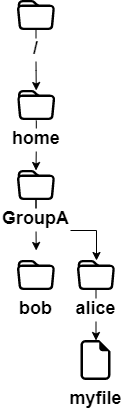

# Comandos para Usuários Linux

Neste capítulo você aprenderá comandos Linux e como utilizá-los.

****

**Objetivos**: Neste capítulo, futuros administradores Linux irão aprender como:

:heavy_check_mark: **Navegar** pela árvore de diretórios do sistema.   
:heavy_check_mark: **Criar** um arquivo texto, **exibir** seu conteúdo e **modificá-lo**.   
:heavy_check_mark: **Utilizar** os comandos mais úteis do Linux.

:checkered_flag: **comandos de usuário**, **linux**

**Conhecimento**: :star:   
**Complexidade**: :star:

**Tempo de leitura**: 40 minutos

****

## Aspectos gerais

Os sistemas Linux atuais têm utilitários gráficos dedicados ao trabalho de um administrador. No entanto, é importante poder utilizar a interface de linha de comando por várias razões:

* A maioria dos comandos do sistema são comuns a todas as distribuições Linux, o que não é o caso para ferramentas gráficas.
* Pode acontecer de o sistema não iniciar corretamente, mas um interpretador de linha de comando de reserva permanecer acessível.
* A administração remota é feita via linha de comando com um terminal SSH.
* A fim de preservar os recursos do servidor, a interface gráfica ou não está instalada, ou não é iniciada na maioria deles.
* A administração é feita por scripts.

Aprender esses comandos permite que o administrador conecte-se a um terminal Linux para gerenciar os seus recursos e arquivos, para identificar a estação, o terminal e os usuários conectados, etc.

### Os usuários

O usuário de um sistema Linux será definido no arquivo `/etc/passwd` por:

* Um **nome de login**, mais comumente chamado de "login", sem espaços.
* Um identificador numérico: **UID** (Identificador do Usuário).
* Um identificador de grupo: **GID** (Identificador do Grupo).
* Um **interpretador de comandos**, por exemplo, um shell, que pode ser diferente de um usuário para outro.
* Um **diretório de conexão**, por exemplo, o __diretório home__.

Em outros arquivos, o usuário será definido por:

* Uma **senha**, que é criptografada antes de ser armazenada (`/etc/shadow`).
* Um **prompt de comando **ou __prompt__ de login, que é simbolizado por um `#` para administradores e um `$` para outros usuários (`/etc/profile`).

Dependendo da política de segurança implementada no sistema, a senha exigirá um certo número de caracteres e deverá atender a certos requisitos de complexidade.

Entre os interpretadores de comandos existentes, o **Bourne-Again Shell** (`/bin/bash`) é o utilizado com mais frequência. Ele é atribuído por padrão a novos usuários. Por várias razões, usuários avançados de Linux podem escolher shells alternativos, como o Korn Shell (`ksh`), o C Shell (`csh`), etc.

O diretório de login do usuário, por convenção, é armazenado no diretório `/home` da estação de trabalho. Ele irá conter os dados pessoais do usuário e os arquivos de configuração dos seus aplicativos. Por padrão, no login, o diretório de login é selecionado como o diretório atual.

Uma instalação de estação de trabalho (com ambiente gráfico) inicia essa interface no terminal 1. O Linux é multi-usuário, então é possível conectar vários usuários várias vezes em diferentes **terminais físicos** (TTY), ou **terminais virtuais** (PTS). Terminais virtuais estão disponíveis em um ambiente gráfico. Um usuário muda de um terminal físico para outro usando <kbd>Alt</kbd> + <kbd>Fx</kbd> na linha de comando ou usando <kbd>CTRL</kbd> + <kbd>Alt</kbd> + <kbd>Fx</kbd>.

### O shell

Uma vez que o usuário esteja conectado a um console, o shell exibe o **prompt de comando**. Então, ele se comporta como um loop infinito, repetindo o mesmo padrão com cada informação inserida:

* Exibe o prompt de comando.
* Lê o comando.
* Analisa a sintaxe.
* Substitui os caracteres especiais.
* Executa o comando.
* Exibe o prompt de comando.
* Etc.

A sequência de teclas <kbd>CTRL</kbd> + <kbd>C</kbd> é usada para interromper um comando em execução.

O uso de um comando geralmente segue essa sequência:

```bash
comando [opção(s)] [argumentos(s)]
```

O nome do comando geralmente é em **letras minúsculas**.

Um espaço separa cada item.

**Opções curtas** começam com um traço (`-l`), enquanto **opções longas** começam com dois traços (`--list`). Um traço duplo (`--`) indica o final da lista de opções.

É possível agrupar algumas opções curtas:

```bash
$ ls -l -i -a
```

é equivalente a:

```bash
$ ls -lia
```

Pode haver vários argumentos após uma opção:

```bash
$ ls -lia /etc /home /var
```

Na literatura, o termo "opção" equivale ao termo "parâmetro", que é mais comumente utilizado na programação. Para indicar que uma opção ou argumento são opcionais, o texto é simbolizado inserido em colchetes `[` e `]`. Quando é possível utilizar mais de uma opção, uma barra vertical chamada "pipe" separa elas `[a|e|i]`.

## Comandos gerais

### Comandos `apropos`, `whatis` e `man`

É impossível para um administrador de qualquer nível saber detalhadamente todos os comandos e opções. Um manual geralmente está disponível para cada um dos comandos instalados.

#### Comando `apropos`

O comando `apropos` permite que você procure por palavra-chave dentro desses manuais:

| Opções                                      | Descrição                                                                 |
| ------------------------------------------- | ------------------------------------------------------------------------- |
| `-s`, `--sections list` ou `--section list` | Limitado às seções manuais.                                               |
| `-a` ou `--and`                             | Exibe apenas o item que corresponde a todas as palavras-chave fornecidas. |

Exemplo:

```bash
$ apropos clear
clear (1)            - clear the terminal screen
clear_console (1)    - clear the console
clearenv (3)         - clear the environment
clearerr (3)         - check and reset stream status
clearerr_unlocked (3) - nonlocking stdio functions
feclearexcept (3)    - floating-point rounding and exception handling
fwup_clear_status (3) - library to support management of system firmware updates
klogctl (3)          - read and/or clear kernel message ring buffer; set console_loglevel
sgt-samegame (6)     - block-clearing puzzle
syslog (2)           - read and/or clear kernel message ring buffer; set console_loglevel
timerclear (3)       - timeval operations
XClearArea (3)       - clear area or window
XClearWindow (3)     - clear area or window
XSelectionClearEvent (3) - SelectionClear event structure
```

Para encontrar o comando que permite alterar a senha de uma conta:

```bash
$ apropos --exact password  -a change
chage (1)            - change user password expiry information
passwd (1)           - change user password
```

#### Comando `whatis`

O comando `whatis` mostra a descrição do comando passado como argumento:

```bash
whatis clear
```

Exemplo:

```bash
$ whatis clear
clear (1)            - clear the terminal screen
```

#### Comando `man`

Uma vez encontrado o comando por `apropos` ou `whatis`, seu respectivo manual é lido pelo `man` ("Man é seu amigo"). Esse conjunto de manuais é dividido em 8 seções, agrupando informações por tópico, sendo que a seção padrão é a 1:

1. Programas ou comandos executáveis.
2. Chamadas de sistema (funções dadas pelo kernel).
3. Chamadas da biblioteca (funções dadas pela biblioteca).
4. Arquivos especiais (normalmente encontrados em /dev).
5. Formatos de arquivo e convenções (arquivos de configuração como /etc/passwd).
6. Jogos (como aplicativos baseados em caracteres).
7. Diversos (por exemplo, man (7)).
8. Comandos de administração do sistema (geralmente apenas para root).
9. Rotinas do kernel (não padrão).

Informações sobre cada seção podem ser acessadas digitando `man x intro`, onde `x` é o número da seção.

O comando:

```bash
man passwd
```

informará o administrador sobre o comando passwd, suas opções, etc. Enquanto que:

```bash
$ man 5 passwd
```

informará a ele sobre os arquivos relacionados ao comando.

Navegue através do manual com as setas <kbd>↑</kbd> e <kbd>↓</kbd>. Saia do manual pressionando a tecla <kbd>q</kbd>.

### Comando `shutdown`

O comando `shutdown` permite que você **desligue eletronicamente** um servidor Linux, imediatamente ou após um determinado tempo.

```bash
shutdown [-h] [-r] time [message]
```

Especifique o tempo de desligamento no formato `hh:mm` para um horário específico, ou `+mm` para uma espera em minutos.

Para forçar uma parada imediata, use a palavra `now` no lugar do horário. Neste caso, a mensagem opcional não é enviada para outros usuários do sistema.

Exemplos:

```bash
[root]# shutdown -h 0:30 "Desligamento do servidor 0:30"
[root]# shutdown -r +5
```

Opções:

| Opções | Comentários                        |
| ------ | ---------------------------------- |
| `-h`   | Desliga o sistema eletronicamente. |
| `-r`   | Reinicia o sistema.                |

### Comando `history`

O comando `history` mostra o histórico de comandos que foram inseridos pelo usuário.

Os comandos são armazenados no arquivo `.bash_history` no diretório de login do usuário.

Exemplo do comando history

```bash
$ history
147 man ls
148 man history
```

| Opções | Comentários                                                                         |
| ------ | ----------------------------------------------------------------------------------- |
| `-w`   | Escreve o histórico atual para o arquivo de histórico.                              |
| `-c`   | Exclui o histórico da sessão atual (mas não o conteúdo do arquivo `.bash_history`). |

* Manipulando o histórico:

Para manipular histórico, os seguintes comandos inseridos pelo prompt de comando irão:

| Teclas             | Função                                                                               |
| ------------------ | ------------------------------------------------------------------------------------ |
| <kdb>!!</kdb>      | Chama o último comando colocado.                                                     |
| <kdb>!n</kdb>      | Chama o comando pelo seu número na lista.                                            |
| <kdb>!string</kdb> | Chama o comando mais recente começando com os caracteres informados.                 |
| <kdb>↑</kdb>       | Navega pelo seu histórico a partir do comando mais recente para o mais antigo.       |
| <kdb>↓</kdb>       | Navega através do seu histórico a partir do comando mais antigo para o mais recente. |

### Autocompletar

A função autocompletar é de grande ajuda.

* Completa comandos, caminhos digitados ou nomes de arquivos.
* Pressione a tecla <kbd>TAB</kbd> para completar a entrada no caso de uma única solução.
* No caso de várias soluções, pressione <kbd>TAB</kbd> uma segunda vez para ver as opções.

Se após pressionar duas vezes a tecla <kbd>TAB</kbd> não for apresentada nenhuma opção, então não há resultado para completar na solução atual.

## Exibição e Identificação

### Comando `clear`

O comando `clear` limpa o conteúdo da tela do terminal. Mais precisamente, ele desloca a tela para que o prompt de comando esteja na parte superior da tela, na primeira linha.

No terminal físico, o display será ocultado permanentemente, enquanto que na interface gráfica uma barra de rolagem permitirá que você volte no histórico do terminal virtual.

!!! Dica

    <kbd>CTRL</kbd> + <kbd>L</kbd> tem o mesmo efeito do comando `clear`

### Comando `echo`

O comando `echo` é utilizado para mostrar uma cadeia de caracteres.

Esse comando é mais comumente utilizado em scripts de administração para exibir informações para os usuários durante a execução.

A opção `-n` indica que a saída não irá gerar uma nova linha ao final (por padrão, a saída do comando sempre gera uma nova linha).

```bash
shell > echo -n "123";echo "456"
123456

shell > echo "123";echo "456"
123
456
```

Por vários motivos, o desenvolvedor do script pode precisar usar sequências especiais (iniciando com um caractere `\`). Nesse caso, a opção `-e` será utilizada, permitindo interpretação das sequências.

Entre as sequências frequentemente usadas, podemos mencionar:

| Sequência | Resultado                         |
| --------- | --------------------------------- |
| `\a`     | Envia um bip sonoro               |
| `\b`     | Volta o cursor uma posição        |
| `\n`     | Adiciona uma quebra de linha      |
| `\t`     | Adiciona uma tabulação horizontal |
| `\v`     | Adiciona uma tabulação vertical   |

### Comando `date`

O comando `date` exibe a data e a hora. O comando possui a seguinte sintaxe:

```bash
date [-d AAAAMMJJ] [formato]
```

Exemplos:

```bash
$ date
Mon May 24 16:46:53 CEST 2021
$ date -d 20210517 +%j
137
```

Nesse último exemplo, a opção `-d` apresenta a data informada. A opção `+%j` formata essa data para mostrar apenas o dia do ano.

!!! Atenção

    O formato de uma data pode mudar dependendo do idioma definido na variável de ambiente `$LANG`.

A exibição da data pode conter os seguintes formatos:

| Opção | Formato                                             |
| ----- | --------------------------------------------------- |
| `+%A` | Nome completo do dia da semana local (ex.: domingo) |
| `+%B` | Nome completo do mês local (ex.: janeiro)           |
| `+%c` | Data e hora locais (ex.: Qui Mar 3 23:05:25 2005)   |
| `+%d` | Dia do mês (ex.: 01)                                |
| `+%F` | Data no formato `AAAA-MM-DD`                        |
| `+%G` | Ano                                                 |
| `+%H` | Hora (00..23)                                       |
| `+%j` | Dia do ano (001..366)                               |
| `+%m` | Número do mês (01..12)                              |
| `+%M` | Minuto (00..59)                                     |
| `+%R` | Hora no formato `hh:mm`                             |
| `+%s` | Segundos desde 1º de janeiro de 1970                |
| `+%S` | Segundos (00..60)                                   |
| `+%T` | Hora no formato `hh:mm:ss`                          |
| `+%u` | Dia da semana (`1` para segunda)                    |
| `+%V` | Número da semana (`+%V`)                            |
| `+%x` | Data no formato `DD/MM/AAAA`                        |

O comando `date` também permite que você altere a data e hora do sistema. Nesse caso, a opção `-s` deve ser utilizada.

```bash
[root]# date -s "2021-05-24 10:19"
```

O formato a ser utilizado seguindo a opção `-s` é esse:

```bash
date -s "[AA]AA-MM-JJ hh:mm:[ss]"
```

### Comandos `id`, `who` e `whoami`

O comando `id` é usado para exibir informações sobre usuários e grupos. Por padrão, nenhum parâmetro do usuário é adicionado e as informações do usuário conectado no momento são exibidas

```bash
$ id rockstar
uid=1000(rockstar) gid=1000(rockstar) groups=1000(rockstar),10(wheel)
```

As opções `-g`, `-G`, `-n` e `-u` apresentam o grupo principal GID, GIDs de subgrupos, nomes ao invés de identificadores numéricos, e o UID do usuário respectivamente.

O comando `whoami` exibe o login do usuário atual.

O comando `who` sozinho exibe os nomes dos usuários logados:

```bash
$ who
rockstar tty1   2021-05-24 10:30
root     pts/0  2021-05-24 10:31
```

Como o Linux é multi-usuário, é possível que várias sessões estejam abertas na mesma estação, tanto fisicamente quanto através da rede. É interessante saber quais usuários estão logados, somente se houver comunicação com eles através do envio de mensagens.

* tty: representa um terminal.
* pts/: representa um console virtual em um ambiente gráfico com o número seguinte representando a instância do console virtual (0, 1, 2...)

A opção `-r` também mostra o nível de execução (ver capítulo "inicialização").

## Árvore de Arquivos

No Linux, a árvore de arquivos é uma árvore invertida, chamada **árvore de hierarquia única**, cuja raiz é diretório `/`.

O **diretório atual** é o diretório onde o usuário está localizado.

O **diretório de conexão** é o diretório de trabalho associado ao usuário. Os diretórios de login são, por padrão, armazenados no diretório `/home`.

Quando o usuário faz login, o diretório atual se torna o diretório de login.

Um **caminho absoluto** faz referência a um arquivo a partir de root por atravessar toda a árvore no nível do arquivo:

* `/home/groupA/alice/file`

O **caminho relativo** faz referência a esse mesmo arquivo ao atravessar a árvore toda a partir do diretório atual:

* `../alice/file`

No exemplo acima, o "`..`" faz referência ao diretório pai do diretório atual.

Um diretório, mesmo estando vazio, necessariamente irá conter no mínimo **duas referências**:

* `.`: referência a ele próprio.
* `..`: referência ao diretório pai do diretório atual.

Um caminho relativo pode iniciar com `./` ou `../`. Quando o caminho relativo se refere a um subdiretório ou arquivo no diretório atual, então o `./` é muitas vezes omitido. Mencionar o primeiro `./` na árvore só é necessário para rodar um arquivo executável.

Erros no caminho indicado podem causar muitos problemas: criar diretórios ou arquivos no local incorreto, exclusões não intencionais, etc. Portanto, é altamente recomendado o uso do auto-completar ao inserir caminhos de diretório e/ou arquivo.



No exemplo a seguir, queremos informar a localização do arquivo `myfile` a partir do diretório do bob.

* Através de um **caminho absoluto**, o diretório atual não interessa. Iniciamos no root e vamos descendo para os diretórios `home`, `groupA`, `alice` e finalmente o arquivo `myfile`: `/home/groupA/alice/myfile`.
* Através de um **caminho relativo**, nosso ponto de partida é o diretório atual `/home/groupA/bob`, voltamos um nível usando `..` (ex., dentro do diretório `groupA`), descemos então no diretório alice, e finalmente o arquivo `myfile` file: `../alice/myfile`.

### Comando `pwd`

O comando `pwd` (Print Working Directory) mostra o caminho absoluto do diretório atual.

```bash
$ pwd
/home/rockstar
```

Para usar um caminho relativo para fazer referência a um arquivo ou diretório, ou usar o comando `cd` para ir para outro diretório, você precisa saber seu local na árvore de arquivos.

Dependendo do tipo de shell e dos diferentes parâmetros de seu arquivo de configuração, o prompt de terminal (também conhecido como o prompt de comando) irá exibir o caminho absoluto ou relativo do diretório atual.

### Comando `cd`

O comando `cd` (Change Directory) permite que você altere o diretório atual -- em outras palavras, movimentar-se pela árvore.

```bash
$ cd /tmp
$ pwd
/tmp
$ cd ../
$ pwd
/
$ cd
$ pwd
/home/rockstar
```

Como você pode ver no exemplo acima, o comando `cd` sem argumentos muda do diretório corrente para o `diretório home`.

### Comando `ls`

O comando `ls` exibe o conteúdo de um diretório.

```bash
ls [-a] [-i] [-l] [directory1] [directory2] […]
```

Exemplo:

```bash
$ ls /home
.    ..    rockstar
```

As principais opções do comando `ls` são:

| Opção | Informações                                                                                                                                         |
| ----- | --------------------------------------------------------------------------------------------------------------------------------------------------- |
| `-a`  | Apresenta todos os arquivos, incluindo aqueles que estiverem ocultos. Arquivos ocultos no Linux são todos aqueles que tem um `.` no início do nome. |
| `-i`  | Exibe números inode.                                                                                                                                |
| `-l`  | Use um formato de lista longa, ou seja, cada linha exibe informações de formato longo para um arquivo ou diretório.                                 |

O comando `ls`, contudo, possui muitas opções (veja o `man`):

| Opção | Informação                                                                                                                                                                                |
| ----- | ----------------------------------------------------------------------------------------------------------------------------------------------------------------------------------------- |
| `-d`  | Exibe informação sobre um diretório ao invés de listar seu conteúdo.                                                                                                                      |
| `-g`  | Como a opção -l, mas não lista o proprietário.                                                                                                                                            |
| `-h`  | Apresenta tamanho de arquivos no formato mais apropriado (byte, kilobyte, megabyte, gigabyte, ...). `h` significa Humanamente Legível. Precisa ser usado com opção -l.                    |
| `-s`  | Exibe o tamanho alocado de cada arquivo, em blocos. No sistema operacional GNU/Linux, o "bloco" é a menor unidade de armazenamento no sistema de arquivos, um bloco equivale a 4096Bytes. |
| `-A`  | Exibe todos os arquivos no diretório, exceto `.` e `..`                                                                                                                                   |
| `-R`  | Exibe o conteúdo de subdiretórios recursivamente.                                                                                                                                         |
| `-F`  | Exibe o tipo dos arquivos. Lista `/` para diretório, `*` para executáveis, `@` para link simbólico, e nada para arquivo de texto.                                                         |
| `-X`  | Ordena arquivos de acordo com suas extensões.                                                                                                                                             |

* Descrição das colunas geradas ao executar o comando `ls -lia`:

```bash
$ ls -lia /home
78489 drwx------ 4 rockstar rockstar 4096 25 oct. 08:10 rockstar
```

| Valor           | Informação                                                                                                                                                                                          |
| --------------- | --------------------------------------------------------------------------------------------------------------------------------------------------------------------------------------------------- |
| `78489`         | Número inode.                                                                                                                                                                                       |
| `drwx------`    | Tipo de arquivo (`d`) e permissões (`rwx-----`).                                                                                                                                                    |
| `4`             | Número de subdiretórios (`.` e `..` inclusos). Para um arquivo, representa o número de links rígidos e 1 representa a si mesmo.                                                                     |
| `rockstar`      | Usuário proprietário.                                                                                                                                                                               |
| `rockstar`      | Grupo proprietário.                                                                                                                                                                                 |
| `4096`          | Para arquivos, mostra o tamanho do arquivo. Para diretórios, mostra o valor fixo de 4096 bytes ocupados pelo nome do arquivo. Para calcular o tamanho total de um diretório, use `du -sh rockstar/` |
| `25 oct. 08:10` | Data de última alteração.                                                                                                                                                                           |
| `rockstar`      | Nome do arquivo (ou diretório).                                                                                                                                                                     |

!!! Nota

    **Aliases** são frequentemente configurados em distribuições comuns.
    
    Esse é o caso do alias `ll`:

    ```
    alias ll='ls -l --color=auto'
    ```

O comando `ls` tem muitas opções. Aqui estão alguns exemplos avançados de utilização:

* Lista os arquivos em `/etc` ordenados pela última modificação:

```bash
$ ls -ltr /etc
total 1332
-rw-r--r--.  1 root root    662 29 may   2021 logrotate.conf
-rw-r--r--.  1 root root    272 17 may.   2021 mailcap
-rw-------.  1 root root    122 12 may.  2021 securetty
...
-rw-r--r--.  2 root root     85 18 may.  17:04 resolv.conf
-rw-r--r--.  1 root root     44 18 may.  17:04 adjtime
-rw-r--r--.  1 root root    283 18 may.  17:05 mtab
```

* Lista os arquivos arquivos maiores que 1 megabyte, mas menores de 1 gigabyte em `/var`. O exemplo aqui usa comandos avançados de `grep` com expressões regulares. Os novatos não precisam se preocupar, haverá um tutorial especial para introduzir essas expressões regulares no futuro.

```bash
$ ls -lhR /var/ | grep ^\- | grep -E "[1-9]*\.[0-9]*M" 
...
-rw-r--r--. 1 apache apache 1.2M 10 may.  13:02 XB RiyazBdIt.ttf
-rw-r--r--. 1 apache apache 1.2M 10 may.  13:02 XB RiyazBd.ttf
-rw-r--r--. 1 apache apache 1.1M 10 may.  13:02 XB RiyazIt.ttf
...
```

Claro, recomendamos que você use o comando `find`.

```bash
$ find /var -size +1M -a -size -1024M  -a -type f  -exec ls -lh {} \;
```

* Mostra as permissões em uma pasta:

Para descobrir quais as permissões de uma pasta, em nosso exemplo `/etc`, o comando a seguir **não** seria apropriado:

```bash
$ ls -l /etc
total 1332
-rw-r--r--.  1 root root     44 18 nov.  17:04 adjtime
-rw-r--r--.  1 root root   1512 12 janv.  2010 aliases
-rw-r--r--.  1 root root  12288 17 nov.  17:41 aliases.db
drwxr-xr-x.  2 root root   4096 17 nov.  17:48 alternatives
...
```

O comando acima exibirá o conteúdo (contido dentro) da pasta, por padrão. Para a própria pasta, você pode usar a opção `-d`.

```bash
$ ls -ld /etc
drwxr-xr-x. 69 root root 4096 18 nov.  17:05 /etc
```

* Ordenar por tamanho de arquivo, maior primeiro:

```bash
$ ls -lhS
```

* formato hora/data com `-l`:

```bash
$ ls -l --time-style="+%Y-%m-%d %m-%d %H:%M" /
total 12378
dr-xr-xr-x. 2 root root 4096 2014-11-23 11-23 03:13 bin
dr-xr-xr-x. 5 root root 1024 2014-11-23 11-23 05:29 boot
```

* Adiciona _barra_ no final das pastas:

Por padrão, o comando `ls` não exibe a última barra da pasta. Em alguns casos, como scripts por exemplo, é útil exibi-las:

```bash
$ ls -dF /etc
/etc/
```

* Ocultar algumas extensões:

```bash
$ ls /etc --hide=*.conf
```

### Comando `mkdir`

O comando `mkdir` cria um diretório ou árvore de diretório.

```bash
mkdir [-p] directory [directory] [...]
```

Exemplo:

```bash
$ mkdir /home/rockstar/work
```

O diretório "rockstar" deve existir para que o diretório "work" seja criado.

Caso contrário, a opção `-p` deve ser utilizada. A opção `-p` cria os diretórios pais, se estes não existirem.

!!! Perigo

    Não é recomendável utilizar nomes de comandos Linux para nomear diretório ou arquivos.

### Comando `touch`

O comando `touch` muda o timestamp de um arquivo ou cria um arquivo vazio caso ele não exista.

```bash
touch [-t data] arquivo
```

Exemplo:

```bash
$ touch /home/rockstar/myfile
```

| Opção     | Informação                                                              |
| --------- | ----------------------------------------------------------------------- |
| `-t data` | Altera a data da última modificação do arquivo com a data especificada. |

Formato de data: `[AAAA]MMJJhhmm[ss]`

!!! Dica

    O comando `touch` é utilizado principalmente para criar um arquivo vazio, mas ele pode ser útil para backups incrementais ou diferenciais, por exemplo. Na verdade, o único efeito em executar o `touch` em um arquivo será forçá-lo a ser salvo no próximo backup.

### Comando `rmdir`

O comando `rmdir` deleta um diretório vazio.

Exemplo:

```bash
$ rmdir /home/rockstar/work
```

| Opção | Informação                                                         |
| ----- | ------------------------------------------------------------------ |
| `-p`  | Remove o diretório pai ou diretório fornecido se estiverem vazios. |

!!! Dica

    Para deletar diretórios não-vazios e todo seu conteúdo, use o comando `rm`.

### Comando `rm`

O comando `rm` deleta um arquivo ou diretório.

```bash
rm [-f] [-r] file [file] [...]
```

!!! Perigo

    Qualquer exclusão de arquivo ou diretório é definitiva.

| Opções | Informações                                              |
| ------ | -------------------------------------------------------- |
| `-f`   | Não pede confirmação para excluir.                       |
| `-i`   | Pede confirmação para excluir.                           |
| `-r`   | Exclui um diretório e seus subdiretórios recursivamente. |

!!! Nota

    Por padrão o comando `rm` não pede confirmação ao deletar arquivos. No entanto, com uma distribuição Red Hat/Rocky, `rm` pede a confirmação da exclusão porque o comando `rm` é um `alias` do comando `rm -i`. Não estranhe se em outra distribuição, como Debian por exemplo, você não obtiver uma confirmação antes da exclusão.

Deletando uma pasta com o comando `rm`, estando a pasta vazia ou não, exigirá a adição da opção `-r`.

O fim das opções é informado para o shell através de barras duplas `--`.

No exemplo:

```bash
$ >-hard-hard # Para criar um arquivo vazio chamado -hard-hard
hard-hard
[CTRL+C] To interrupt the creation of the file
$ rm -f -- -hard-hard
```

O nome do arquivo hard-hard começa com um `-`. Sem o uso do `--` o shell teria interpretado o `-d` em `-hard-hard` como uma opção.

### Comando `mv`

O comando `mv` move e renomeia um arquivo.

```bash
mv arquivo [arquivo ...] destino
```

Exemplos:

```bash
$ mv /home/rockstar/file1 /home/rockstar/file2
$ mv /home/rockstar/file1 /home/rockstar/file2 /tmp
```

| Opções | Informações                                                     |
| ------ | --------------------------------------------------------------- |
| `-f`   | Não pede confirmação se sobrescrever o arquivo de destino.      |
| `-i`   | Requer confirmação se sobrescrever arquivo de destino (padrão). |

Alguns exemplos que irão ajudar você a entender as dificuldades que podem surgir:

```bash
$ mv /home/rockstar/file1 /home/rockstar/file2
```

Renomeia o arquivo `file1` para `file2`. Se `file2` já existir, substitui o conteúdo do arquivo com o `file1`.

```bash
$ mv /home/rockstar/file1 /home/rockstar/file2 /tmp
```

Move os arquivos `file1` e `file2` para o diretório `/tmp`.

```bash
$ mv file1 /repexist/file2
```

Move o arquivo `file1` para o diretório `repexist` e o renomeia para `file2`.

```bash
$ mv file1 file2
```

`file1` é renomeado para `file2`.

```bash
$ mv file1 /repexist
```

Se o diretório de destino existir, o arquivo `file1` é movido para `/repexist`.

```bash
$ mv file1 /wrongrep
```

Se o diretório de destino não existir, o arquivo `file1` será renomeado para `wrongrep` no diretório raiz.

### Comando `cp`

O comando `cp` copia um arquivo.

```bash
cp arquivo [arquivo ...] destino
```

Exemplo:

```bash
$ cp -r /home/rockstar /tmp
```

| Opções | Informações                                                            |
| ------ | ---------------------------------------------------------------------- |
| `-i`   | Solicita confirmação se sobrescrever (padrão).                         |
| `-f`   | Não pede confirmação se estiver sobrescrevendo o arquivo de destino.   |
| `-p`   | Mantém o proprietário, as permissões e o timestamp do arquivo copiado. |
| `-r`   | Copia um diretório com seus arquivos e subdiretórios.                  |
| `-s`   | Cria um link simbólico em vez de copiar.                               |

```bash
cp file1 /repexist/file2
```

`file1` é copiado para `/repexist` com o nome `file2`.

```bash
$ cp file1 file2
```

`file1` é copiado como `file2` no diretório atual.

```bash
$ cp file1 /repexist
```

Se o diretório de destino existir, `file1` é copiado para `/repexist`.

```bash
$ cp file1 /wrongrep
```

Se o diretório de destino não existir, `file1` é copiado com o nome `wrongrep` no diretório raiz.

## Visualização

### Comando `file`

O comando `file` exibe o tipo de um arquivo.

```bash
file file1 [files]
```

Exemplo:

```bash
$ file /etc/passwd /etc
/etc/passwd:    ASCII text
/etc:        directory
```

### Comando `more`

O comando `more` exibe o conteúdo de um ou mais arquivos tela por tela.

```bash
more arquivo1 [files]
```

Exemplo:

```bash
$ more /etc/passwd
root:x:0:0:root:/root:/bin/bash
...
```

Usando a tecla <kbd>ENTER</kbd>, a navegação é linha a linha. Usando a tecla <kbd>SPACE</kbd>, a navegação é página por página. `/texto` permite a você procurar ocorrência do texto no arquivo.

### Comando `less`

O comando `less` exibe o conteúdo de um ou mais arquivos. O comando `less` é interativo e tem seus próprios comandos para uso.

```bash
less arquivo1 [files]
```

Os comandos específicos do `less` são:

| Comando                                          | Ação                                                           |
| ------------------------------------------------ | -------------------------------------------------------------- |
| <kbd>h</kbd>                                     | Ajuda.                                                         |
| <kbd>↑</kbd><kbd>↓</kbd><kbd>→</kbd><kbd>←</kbd> | Move para cima, uma linha abaixo, ou para direita ou esquerda. |
| <kbd>Enter</kbd>                                 | Move uma linha para baixo.                                     |
| <kbd>Espaço</kbd>                                | Move uma página para baixo.                                    |
| <kbd>PgUp</kbd> e <kbd>PgDn</kbd>                | Move uma página para cima ou para baixo.                       |
| <kbd>gg</kbd> e <kbd>G</kbd>                     | Move para a primeira e última páginas                          |
| `/texto`                                         | Procura por texto.                                             |
| <kbd>q</kbd>                                     | Sai do comando `less`.                                         |

### Comando `cat`

O comando `cat` concatena o conteúdo de vários arquivos e exibe o resultado na saída padrão.

```bash
cat arquivo1 [arquivos]
```

Exemplo 1 - Exibindo o conteúdo de um arquivo para a saída padrão:

```bash
$ cat /etc/passwd
```

Exemplo 2 - Exibindo o conteúdo de vários arquivos para a saída padrão:

```bash
$ cat /etc/passwd /etc/group
```

Exemplo 3 - Combinando o conteúdo de vários arquivos em um arquivo usando o redirecionamento de saída:

```bash
$ cat /etc/passwd /etc/group > usersAndGroups.txt
```

Exemplo 4 - Exibindo a numeração de linha:

```bash
$ cat -n /etc/profile
     1    # /etc/profile: system-wide .profile file for the Bourne shell (sh(1))
     2    # and Bourne compatible shells (bash(1), ksh(1), ash(1), ...).
     3
     4    if [ "`id -u`" -eq 0 ]; then
     5      PATH="/usr/local/sbin:/usr/local/bin:/usr/sbin:/usr/bin:/sbin:/bin"
     6    else
…
```

Exemplo 5 - Mostra a numeração de linhas não vazias:

```bash
$ cat -b /etc/profile
     1    # /etc/profile: system-wide .profile file for the Bourne shell (sh(1))
     2    # and Bourne compatible shells (bash(1), ksh(1), ash(1), ...).

     3    if [ "`id -u`" -eq 0 ]; then
     4      PATH="/usr/local/sbin:/usr/local/bin:/usr/sbin:/usr/bin:/sbin:/bin"
     5    else
…
```

### Comando `tac`

O comando `tac` faz quase o oposto do comando `cat`. Exibe o conteúdo de um arquivo iniciando pelo final (que é particularmente interessante para a leitura de logs!).

Exemplo: Exibe um arquivo de log mostrando a última linha primeiro:

```bash
[root]# tac /var/log/messages | less
```

### Comando `head`

O comando `head` exibe o início de um arquivo.

```bash
head [-n x] arquivo
```

| Opção  | Descrição                                |
| ------ | ---------------------------------------- |
| `-n x` | Exibe as primeiras `x` linhas do arquivo |

Por padrão (sem a opção `-n`), o comando `head` mostrará as 10 primeiras linhas do arquivo.

### Comando `tail`

O comando `tail` exibe o final de um arquivo.

```bash
tail [-f] [-n x] arquivo
```

| Opção  | Descrição                                 |
| ------ | ----------------------------------------- |
| `-n x` | Exibe as últimas `x` linhas do arquivo    |
| `-f`   | Exibe alterações no arquivo em tempo real |

Exemplo:

```bash
tail -n 3 /etc/passwd
sshd:x:74:74:Privilege-separeted sshd:/var/empty /sshd:/sbin/nologin
tcpdump::x:72:72::/:/sbin/nologin
user1:x:500:500:grp1:/home/user1:/bin/bash
```

Com a opção `-f`, a mudança de informação do arquivo será exibida sem parar, a menos que o usuário saia do estado de monitoramento com <kbd>CTRL</kbd> + <kbd>C</kbd>. Esta opção é muito usada para acompanhar os arquivos de log (os logs) em tempo real.

Sem a opção `-n`, o comando `tail` mostra as últimas 10 linhas do arquivo.

### Comando `sort`

O comando `sort` classifica as linhas de um arquivo.

Ele permite que você ordene o resultado de um comando ou o conteúdo de um arquivo em uma determinada ordem, numericamente, alfabeticamente, por tamanho (KB, MB, GB) ou em ordem decrescente.

```bash
sort [-k] [-n] [-u] [-o file] [-t] file
```

Exemplo:

```bash
$ sort -k 3,4 -t ":" -n /etc/passwd
root:x:0:0:root:/root:/bin/bash
adm:x:3:4:adm:/var/adm/:/sbin/nologin
```

| Opção        | Descrição                                                                                                                                                              |
| ------------ | ---------------------------------------------------------------------------------------------------------------------------------------------------------------------- |
| `-k`         | Especifica as colunas a serem separadas. Você pode especificar várias colunas.                                                                                         |
| `-n`         | Faz uma ordenação numérica.                                                                                                                                            |
| `-o arquivo` | Salva a classificação no arquivo especificado.                                                                                                                         |
| `-t`         | Especifica um delimitador, que requer que o conteúdo do arquivo correspondente tenha colunas delimitadas, caso contrário, elas não poderão ser ordenadas corretamente. |
| `-r`         | Inverte a ordem do resultado. Usado em conjunto com a opção `-n` para classificar em ordem do maior para o menor.                                                      |
| `-u`         | Remove as duplicidades após a classificação. Equivalente a `sort arquivo | uniq`.                                                                                      |

O comando `sort` classifica o arquivo apenas na tela. O arquivo não é modificado pela classificação. Para gravar a classificação, utilize a opção `-o` ou um redirecionamento de saída `>`.

Por padrão, os números são classificados de acordo com seus caracteres. Assim, "110" estará antes de "20", que por sua vez virá antes do "3". A opção `-n` deve ser especificada para que os blocos de caracteres numéricos sejam classificados pelos seus valores.

O comando `sort` inverte a ordem dos resultados com a opção `-r`:

```bash
$ sort -k 3 -t ":" -n -r /etc/passwd
nobody:x:65534:65534:Kernel Overflow User:/:/sbin/nologin
systemd-coredump:x:999:997:systemd Core Dumper:/:/sbin/nologin
polkitd:x:998:996:User for polkitd:/:/sbin/nologin
```

Neste exemplo, o comando `sort` irá classificar o conteúdo do arquivo `/etc/passwd` desta vez do maior uid (identificador de usuário) para o menor.

Alguns exemplos avançados de uso do comando `sort`:

* Embaralhar valores

O comando `sort` também permite que você embaralhe valores com a opção `-R`:

```bash
$ sort -R /etc/passwd
```

* Classificando endereços IP

Um administrador de sistema é rapidamente confrontado com o processamento de endereços IP a partir dos logs de seus serviços, como SMTP, VSFTP ou Apache. Esses endereços são normalmente extraídos com o comando `cut`.

Aqui está um exemplo com o arquivo `dns-client.txt`:

```
192.168.1.10
192.168.1.200
5.1.150.146
208.128.150.98
208.128.150.99
```

```bash
$ sort -nr dns-client.txt
208.128.150.99
208.128.150.98
192.168.1.200
192.168.1.10
5.1.150.146
```

* Ordenação do arquivo removendo duplicados

O comando `sort` sabe como remover as duplicatas do arquivo de saída usando a opção `-u`.

Aqui está um exemplo com o arquivo `colours.txt`:

```
Red
Green
Blue
Red
Pink
```
```
$ sort -u colours.txt
Blue
Green
Pink
Red
```

* Ordenar arquivo por tamanhos

O comando `sort` sabe reconhecer tamanhos de arquivo de comandos como `ls` com a opção `-h`.

Aqui está um exemplo com o arquivo `size.txt`:

```
1.7G
18M
69K
2.4M
1.2M
4.2G
6M
124M
12.4M
4G
```

```bash
$ sort -hr size.txt
4.2G
4G
1.7G
124M
18M
12.4M
6M
2.4M
1.2M
69K
```

### Comando `wc`

O comando `wc` conta o número de linhas, palavras e/ou bytes em um arquivo.

```bash
wc [-l] [-m] [-w] arquivo [arquivos]
```

| Opção | Descrição                     |
| ----- | ----------------------------- |
| `-c`  | Conta o número de bytes.      |
| `-m`  | Conta o número de caracteres. |
| `-l`  | Conta o número de linhas.     |
| `-w`  | Conta o número de palavras.   |

## Busca

### Comando `find`

O comando `find` procura a localização de arquivos ou diretórios.

```bash
find diretório [-name name] [-type type] [-user login] [-date date]
```

Como existem muitas opções para o comando `find`, o melhor é consultar o `man`.

Se o diretório de busca não for especificado, o comando `find` irá pesquisar a partir do diretório atual.

| Opção              | Descrição                               |
| ------------------ | --------------------------------------- |
| `-perm permissões` | Procura arquivos pelas suas permissões. |
| `-size tamanho`    | Procura arquivos por tamanho.           |

### Opção `-exec` do comando `find`

É possível usar a opção `-exec` do comando `find` para executar um comando em cada linha de resultado:

```bash
$ find /tmp -name *.txt -exec rm -f {} \;
```

O comando anterior pesquisa por todos os arquivos no diretório `/tmp` com `*.txt` no nome e exclui eles.

!!! Dica "Entenda a opção `-exec`"

    No exemplo acima, o comando `find` vai construir uma string representando o comando a ser executado.
    
    Se o comando `find` encontrar três arquivos chamados `log1.txt`, `log2.txt` e `log3.txt`, então o comando `find` construirá a string substituindo as chaves em `rm -f {} \;` com um dos resultados da busca, e repetir para cada resultado.
    
    Isso nos dará:

    ```
    rm -f /tmp/log1.txt ; rm -f /tmp/log2.txt ; rm -f /tmp/log3.txt ;
    ```


    O caractere `;` é um caractere especial de shell que deve ser protegido por um `\` para evitar que ele seja interpretado precocemente pelo comando `find` (e não no `-exec`).

!!! Dica

    `$ find /tmp -name *.txt -delete` faz a mesma coisa.

### Comando `whereis`

O comando `whereis` busca arquivos relacionados a um comando.

```bash
whereis [-b] [-m] [-s] comando
```

Exemplo:

```bash
$ whereis -b ls
ls: /bin/ls
```

| Opção | Descrição                            |
| ----- | ------------------------------------ |
| `-b`  | Pesquisa somente o arquivo binário.  |
| `-m`  | Pesquisa somente por páginas do man. |
| `-s`  | Pesquisa apenas por arquivos fonte.  |

### Comando `grep`

O comando `grep` busca uma string em um arquivo.

```bash
grep [-w] [-i] [-v] "string" arquivo
```

Exemplo:

```bash
$ grep -w "root:" /etc/passwd
root:x:0:0:root:/root:/bin/bash
```

| Opção | Descrição                                        |
| ----- | ------------------------------------------------ |
| `-i`  | Ignora maiúsculo/minúsculo na string pesquisada. |
| `-v`  | Exclui linhas que contenham a string.            |
| `-w`  | Procura a palavra exata.                         |

O comando `grep` retorna a linha completa contendo a string que você está procurando.
* O caractere especial `^` é usado para procurar uma string no início de uma linha.
* O caractere especial `$` procura uma string no final de uma linha.

```bash
$ grep -w "^root" /etc/passwd
```

!!! Nota

    Este comando é muito poderoso e é altamente recomendável consultar seu manual. Ele tem muitas variações.

É possível pesquisar por uma string em uma árvore de arquivo com a opção `-R`.

```bash
grep -R "Virtual" /etc/httpd
```

### Meta-caracteres (curingas)

Meta-caracteres substituem um ou mais caracteres (ou até mesmo uma ausência de caracteres) em uma pesquisa. Estes meta-caracteres também são conhecidos como curingas.

Eles podem ser combinados.

O caractere `*` substitui uma string composta por qualquer caractere. O caractere `*` também pode representar uma ausência de caractere.

```bash
$ find /home -name "test*"
/home/rockstar/test
/home/rockstar/test1
/home/rockstar/test11
/home/rockstar/tests
/home/rockstar/test362
```

Meta-caracteres permitem pesquisas mais complexas substituindo toda ou parte de uma palavra. Simplesmente substitua os desconhecidos por esses caracteres especiais.

O personagem `?` substitui um único caractere, qualquer que seja.

```bash
$ find /home -name "test?"
/home/rockstar/test1
/home/rockstar/tests
```

As colchetes `[` e `]` são usadas para especificar os valores que um único caractere pode representar.

```bash
$ find /home -name "test[123]*"
/home/rockstar/test1
/home/rockstar/test11
/home/rockstar/test362
```

!!! Nota

    Sempre limitar palavras contendo meta-caracteres com `"` para evitar que elas sejam substituídas pelos nomes dos arquivos que atendem aos critérios.

!!! Atenção

    Não confunda meta-caracteres do shell com meta-caracteres de expressão regular. O comando `grep` usa meta-caracteres de expressão regular.

## Redirecionamentos e pipes

### Entrada e saída padrão

Nos sistemas UNIX e Linux, existem três fluxos padrão. Eles permitem que programas, através da biblioteca `stdio.h`, insiram ou extraiam informações.

Esses fluxos são chamados de canal X ou descritor de arquivos X.

Por padrão:

* o teclado é o dispositivo de entrada para o canal 0, chamado **stdin**;
* a tela é o dispositivo de saída dos canais 1 e 2, chamados **stdout** e **stderr**.


O **stderr** recebe os fluxos de erro retornados por um comando. Os demais fluxos são direcionados para o **stdout**.

Esses fluxos apontam para arquivos periféricos, mas como em UNIX/Linux tudo é um arquivo, fluxos de E/S podem ser facilmente desviados para outros arquivos. Este princípio é a força do console.

### Redirecionamento de entrada

É possível redirecionar o fluxo de entrada a partir de outro arquivo com os caracteres `<` ou `<<`. O comando lerá o arquivo em vez do teclado:

```bash
$ ftp -in serverftp << ftp-commands.txt
```

!!! Nota

    Só é possível manipular o redirecionamento de entrada com comandos que requerem entrada via teclado.

O redirecionamento de entrada também pode ser usado para simular uma interação do usuário. O comando vai ler o fluxo de entrada até que ele encontre a palavra-chave definida após o redirecionamento de entrada.

Este recurso é usado para comandos interativos em scripts:

```bash
$ ftp -in serverftp << END
user alice password
put file
bye
END
```

A palavra-chave `END` pode ser substituída por qualquer palavra.

```bash
$ ftp -in serverftp << STOP
user alice password
put file
bye
STOP
```

O shell encerra o comando `ftp` quando ele recebe uma linha contendo a palavra-chave.

!!! Atenção

    A palavra-chave final, aqui `END` ou `STOP`, deve ser a única palavra na linha e deve estar no início da linha.

O redirecionamento de entrada padrão é pouco usado porque a maioria dos comandos aceita um nome de arquivo como argumento.

O comando `wc` pode ser usado assim:

```bash
$ wc -l .bash_profile
27 .bash_profile # o número de linhas, seguido pelo nome do arquivo
$ wc -l < .bash_profile
27 # retorna apenas o número de linhas
```

### Redirecionamento de saída

A saída padrão pode ser redirecionada para outros arquivos usando os caracteres `>` ou `>>`.

O redirecionamento simples `>` sobrescreve o conteúdo do arquivo de saída:

```bash
$ date +%F > arquivo_de_data
```

Quando o comando `>>` é usado, indica que o resultado de saída do comando é adicionado ao final do conteúdo do arquivo.

```bash
$ date +%F >> arquivo_de_data
```

Em ambos os casos, o arquivo é criado automaticamente caso não exista.

A saída de erro padrão também pode ser redirecionada para outro arquivo. Desta vez será necessário especificar o número do canal (que pode ser omitido para os canais 0 e 1):

```bash
$ ls -R / 2> arquivo_de_erros
$ ls -R / 2>> arquivo_de_erros
```

### Exemplos de redirecionamento

Redirecionamento de 2 saídas para 2 arquivos:

```bash
$ ls -R / >> arquivo_ok 2>> arquivo_naok
```

Redirecionamento de 2 saídas para um único arquivo:

```bash
$ ls -R / >> log_file 2>&1
```

Redirecionamento de *stderr* para um "poço sem fundo" (`/dev/null`):

```bash
$ ls -R / 2>> /dev/null
```

Quando ambos os fluxos são redirecionados, nenhuma informação é mostrada na tela. Para redirecionar o fluxo mantendo a exibição em tela, você precisará utilizar o comando `tee`.

### Pipes

Um **pipe** é um mecanismo que permite você interligar a saída padrão do primeiro comando com a entrada padrão do segundo comando.

A comunicação é uni direcional e é feita com o símbolo `|`. O pipe `|` pode ser obtido pressionando as teclas  <kbd>SHIFT</kbd> + <kbd>|</kbd> simultaneamente.


Todos os dados enviados pelo controle à esquerda do pipe através do canal de saída padrão são enviados para o canal de entrada padrão do controle à direita.

Os comandos usados particularmente após um pipe são filtros.

* Exemplos:

Exibir somente o início:

```bash
$ ls -lia / | head
```

Exibir somente o final:

```bash
$ ls -lia / | tail
```

Classificar o resultado:

```bash
$ ls -lia / | sort
```

Contar o número de palavras / caracteres:

```bash
$ ls -lia / | wc
```

Pesquisar uma sequência de caracteres no resultado:

```bash
$ ls -lia / | grep fichier
```

## Pontos Especiais

### Comando `tee`

O comando `tee` é usado para redirecionar a saída padrão de um comando para um arquivo, mantendo a exibição na tela.

Ele é combinado com o pipe `|` para receber como entrada a saída do comando a ser redirecionado:

```bash
$ ls -lia / | tee fic
$ cat fic
```

A opção `-a` adiciona ao arquivo ao invés de substitui-lo.

### Comandos `alias` e `unalias`

Usar o **alias** é uma maneira de pedir ao shell para se lembrar de um determinado comando com as suas opções e lhe dar um nome.

Por exemplo:

```bash
$ ll
```

substituirá o comando:

```bash
$ ls -l
```

O comando `alias` lista os apelidos para a sessão atual. Aliases são definidos por padrão nas distribuições Linux. Aqui, os alias de um servidor Rocky:

```bash
$ alias
alias l.='ls -d .* --color=auto'
alias ll='ls -l --color=auto'
alias ls='ls --color=auto'
alias vi='vim'
alias which='alias | /usr/bin/which --tty-only --read-alias --show-dot --show-tilde'
```

Os apelidos são definidos apenas temporariamente, durante a sessão do usuário.

Para uso permanente, eles devem ser criados:

* no arquivo `.bashrc` do diretório de login do usuário;
* no arquivo `/etc/bashrc` para todos os usuários.

!!! Atenção

    É preciso ter um cuidado especial quando se utilizam aliases que podem ser potencialmente perigosos! Por exemplo, um alias configurado sem o conhecimento do administrador:

    ```bash
    alias cd='rm -Rf'
    ```

O comando `unalias` permite que você exclua os alias.

Para apagar um único alias:

```bash
$ unalias ll
```

Para apagar todos os alias:

```bash
$ unalias -a
```

Para desativar um alias temporariamente, o comando é `\&#060;alias name&#062;`.

Por exemplo, se fizermos:

```bash
$ type ls
```

ela deve retornar o seguinte:

```bash
ls is an alias to « ls -rt »
```

Agora que sabemos disso, podemos ver os resultados de usar o alias ou desativá-lo uma vez com o `\`, executando o seguinte:

```bash
$ ls file*   # classifica pela data
file3.txt  file2.txt  file1.txt
$ \ls file*  # classifica pelo nome
file1.txt  file2.txt  file3.txt
```

### Alias e Funções Úteis

* alias `grep`.

Colore o resultado do comando `grep`: `alias grep='grep --color=auto'`

* função `mcd`

É comum criar uma pasta e então entrar nela: `mcd() { mkdir -p "$1"; cd "$1"; }`

* função `cls`

Entra em uma pasta e lista seu conteúdo: `cls() { cd "$1"; ls; }`

* função `backup`

Cria uma cópia de backup de um arquivo: `backup() { cp "$1"{,.bak}; }`

* função `extract`

Descompacta qualquer tipo de arquivo:

```bash
extract () {
  if [ -f $1 ] ; then
    case $1 in
      *.tar.bz2) tar xjf $1 ;;
      *.tar.gz) tar xzf $1 ;;
      *.bz2) bunzip2 $1 ;;
      *.rar) unrar e $1 ;;
      *.gz) gunzip $1 ;;
      *.tar) tar xf $1 ;;
      *.tbz2) tar xjf $1 ;;
      *.tgz) tar xzf $1 ;;
      *.zip) unzip $1 ;;
      *.Z) uncompress $1 ;;
      *.7z) 7z x $1 ;;
      *)
        echo "'$1' cannot be extracted via extract()" ;;
    esac
  else
    echo "'$1' is not a valid file"
  fi
}

```

* Se o comando `alias cmount` retornar o seguinte: `alias cmount="mount | column -t"`

Então podemos usar `cmount` para mostrar todas pastas montadas do sistema em colunas: `[root]# cmount`

que retornaria nossos pontos de montagem no seguinte formato:

```bash
/dev/simfs  on  /                                          type  simfs        (rw,relatime,usrquota,grpquota)
proc        on  /proc                                      type  proc         (rw,relatime)
sysfs       on  /sys                                       type  sysfs        (rw,relatime)
none        on  /dev                                       type  devtmpfs     (rw,relatime,mode=755)
none        on  /dev/pts                                   type  devpts       (rw,relatime,mode=600,ptmxmode=000)
none        on  /dev/shm                                   type  tmpfs        (rw,relatime)
none        on  /proc/sys/fs/binfmt_misc                   type  binfmt_misc  (rw,relatime)
```

### O caractere `;`

O caractere `;` encadeia os comandos.

Os comandos serão todos executados sequencialmente, por ordem de entrada, assim que o usuário pressionar <kbd>ENTER</kdb>.</p> 

<pre><code class="bash">$ ls /; cd /home; ls -lia; cd /
</code></pre>

<h2 spaces-before="0">
  Teste os seus conhecimentos
</h2>

<p spaces-before="0">
  :heavy_check_mark: O que define um usuário no Linux? (7 respostas)
</p>

<p spaces-before="0">
  :heavy_check_mark: O que caracteriza uma opção longa em um comando?
</p>

<p spaces-before="0">
  :heavy_check_mark: Quais comandos permite que você procure ajuda em um comando?
</p>

<ul>
  <li>
    [ ] <code>google</code>
  </li>
  <li>
    [ ] <code>chuck --norris</code>
  </li>
  <li>
    [ ] <code>info</code>
  </li>
  <li>
    [ ] <code>apropos</code>
  </li>
  <li>
    [ ] <code>whatis</code>
  </li>
</ul>

<p spaces-before="0">
  :heavy_check_mark: Qual comando permite que você veja o histórico de um usuário?
</p>

<p spaces-before="0">
  :heavy_check_mark: Qual comando permite você procurar texto em um arquivo?
</p>

<ul>
  <li>
    [ ] <code>find</code>
  </li>
  <li>
    [ ] <code>grep</code>
  </li>
</ul>

<p spaces-before="0">
  :heavy_check_mark: Qual comando permite você procurar por um arquivo?
</p>

<ul>
  <li>
    [ ] <code>find</code>
  </li>
  <li>
    [ ] <code>grep</code>
  </li>
</ul>

<p spaces-before="0">
  :heavy_check_mark: Qual comando redireciona o fluxo de erro de um comando para um novo arquivo <code>errors.log</code>?
</p>

<ul>
  <li>
    [ ] <code>ls -R / 2&gt; errors.log</code>
  </li>
  <li>
    [ ] <code>ls -R / 2&gt;&gt; errors.log</code>
  </li>
  <li>
    [ ] <code>ls -R / 2&gt; errors.log 2&gt;&1</code>
  </li>
</ul>   
