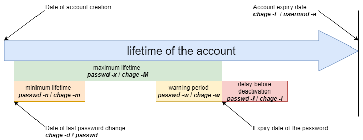

# Gestione utenti

In questo capitolo imparerai come gestire gli utenti.

****
**Obiettivi**: In questo capitolo, i futuri amministratori di Linux impareranno a:

:heavy_check_mark: aggiungere, eliminare o modificare un **gruppo** ;   
:heavy_check_mark: aggiungere, eliminare o modificare un **utente** ;   
:heavy_check_mark: comprendere i file associati agli utenti e ai gruppi e scoprire come gestirli;   
:heavy_check_mark: cambiare il *proprietario* o il *proprietario del gruppo* di un file;   
:heavy_check_mark: *sicuro* account utente;   
:heavy_check_mark: cambiare identità.

:checkered_flag: **utenti**

**Conoscenza**: :star: :star:  
**Complessità**: :star: :star:

**Tempo di lettura**: 30 minuti
****

## Generale

Ogni utente deve avere un gruppo, che è chiamato il gruppo **primario dell'utente**.

Diversi utenti possono far parte dello stesso gruppo.

Gruppo diversi dal gruppo primario sono chiamati **gruppi supplementari**.

!!! Note "Nota"

    Ogni utente ha un gruppo primario e può essere invitato in uno o più gruppi supplementari.

I gruppi e gli utenti sono gestiti dai loro identificatori numerici unici `GID` e `UID`.

* `UID`: _User IDentifier_. ID utente unico.
* `GID`: _Group IDentifier_. Identificatore di gruppo unico.

Sia UID che GID sono riconosciuti dal kernel, il che significa che il Super Admin non è necessariamente l'utente **root**, purché l'utente **uid=0** sia il Super Admin.

I file relativi agli utenti/gruppi sono:

* /etc/passwd
* /etc/shadow
* /etc/group
* /etc/gshadow
* /etc/skel/
* /etc/default/useradd
* /etc/login.defs

!!! Danger "Pericolo"

    Dovresti sempre usare i comandi di amministrazione invece di modificare manualmente i file.

## Gestione del gruppo

File modificati, righe aggiunte:

* `/etc/group`
* `/etc/gshadow`

### comando `groupadd`

Il comando `groupadd` aggiunge un gruppo al sistema.
```
groupadd [-f] [-g GID] group
```

Esempio:

```
$ sudo groupadd -g 1012 GroupeB
```

| Opzione  | Descrizione                                                                                                                        |
| -------- | ---------------------------------------------------------------------------------------------------------------------------------- |
| `-g GID` | Definisce il `GID` del gruppo da creare.                                                                                           |
| `-f`     | Il sistema sceglie un`GID` se quello specificato dall'opzione `-g` esiste già.                                                     |
| `-r`     | Crea un gruppo di sistema con un `GID` tra `SYS_GID_MIN` e `SYS_GID_MAX`. Queste due variabili sono definite in `/etc/login.defs`. |

Regole di denominazione del gruppo:

* Nessun accento o carattere speciale;
* Diverso dal nome di un utente o file di sistema esistenti.

!!! Note "Nota"

    Sotto **Debian**, l'amministratore dovrebbe usare, tranne che negli script destinati ad essere portabili su tutte le distribuzioni Linux, i comandi `addgroup` e `delgroup` come specificato nel `man`:

    ```
    $ man addgroup
    DESCRIPTION
    adduser and addgroup add users and groups to the system according to command line options and configuration information
    in /etc/adduser.conf. They are friendlier front ends to the low-level tools like useradd, groupadd and usermod programs,
    by default, choosing Debian policy conformant UID and GID values, creating a home directory with skeletal configuration,
    running a custom script, and other features.
    ```

### Comando `groupmod`

Il comando `groupmod` consente di modificare un gruppo esistente sul sistema.

```
groupmod [-g GID] [-n nom] group
```

Esempio:

```
$ sudo groupmod -g 1016 GroupP
$ sudo groupmod -n GroupC GroupB
```

| Opzione   | Osservazioni                          |
| --------- | ------------------------------------- |
| `-g GID`  | Nuovo `GID` del gruppo da modificare. |
| `-n name` | Nuovo nome.                           |

È possibile cambiare il nome di un gruppo, il  `GID` o entrambi simultaneamente.

Dopo la modifica, i file appartenenti al gruppo hanno un `GID` sconosciuto. Devono essere riassegnati al nuovo `GID`.

```
$ sudo find / -gid 1002 -exec chgrp 1016 {} \;
```

### comando `groupdel`

Il comando `groupdel` si usa per eliminare un gruppo esistente sul sistema.

```
groupdel group
```

Esempio:

```
$ sudo groupdel GroupC
```

!!! Tip "Suggerimento"

    Quando si elimina un gruppo, si possono verificare due condizioni:

    * Se un utente ha un gruppo primario unico e si lancia il comando `groupdel` su quel gruppo, verrà indicato che c'è un utente specifico sotto il gruppo e che non può essere cancellato.
    * Se un utente appartiene a un gruppo supplementare (non il gruppo primario dell'utente) e tale gruppo non è il gruppo primario di un altro utente del sistema, il comando `groupdel` eliminerà il gruppo senza ulteriori richieste.

    Esempi:

    ```bash
    Shell > useradd testa
    Shell > id testa
    uid=1000(testa) gid=1000(testa) group=1000(testa)
    Shell > groupdel testa
    groupdel: cannot remove the primary group of user 'testa'

    Shell > groupadd -g 1001 testb
    Shell > usermod -G testb root
    Shell > id root
    uid=0(root) gid=0(root) group=0(root),1001(testb)
    Shell > groupdel testb
    ```

!!! Tip "Suggerimento"

    Quando si elimina un utente con il comando `userdel -r`, viene eliminato anche il gruppo primario corrispondente. Il nome del gruppo primario di solito corrisponde al nome dell'utente.

!!! Tip "Suggerimento"

    Ogni gruppo ha un `GID` unico. Un gruppo può essere utilizzato da più utenti come gruppo supplementare. Per convenzione, il GID del super amministratore è 0. Il GIDS riservato ad alcuni servizi o processi sono 201~999, che sono chiamati gruppi di sistema o gruppi di utenti pseudo. Il GID per gli utenti è solitamente maggiore o uguale a 1000. Questi sono relativi a <font color=red>/etc/login.defs</font>, di cui parleremo più tardi.

    ```bash
    # Comment line ignored
    shell > cat  /etc/login.defs
    MAIL_DIR        /var/spool/mail
    UMASK           022
    HOME_MODE       0700
    PASS_MAX_DAYS   99999
    PASS_MIN_DAYS   0
    PASS_MIN_LEN    5
    PASS_WARN_AGE   7
    UID_MIN                  1000
    UID_MAX                 60000
    SYS_UID_MIN               201
    SYS_UID_MAX               999
    GID_MIN                  1000
    GID_MAX                 60000
    SYS_GID_MIN               201
    SYS_GID_MAX               999
    CREATE_HOME     yes
    USERGROUPS_ENAB yes
    ENCRYPT_METHOD SHA512
    ```

!!! Tip "Suggerimento"

    Poiché un utente fa necessariamente parte di un gruppo, è meglio creare i gruppi prima di aggiungere gli utenti. Pertanto, un gruppo potrebbe non avere alcun membro.

### file `/etc/group`

Questo file contiene le informazioni del Gruppo (divise da `:`).

```
$ sudo tail -1 /etc/group
GroupP:x:516:patrick
  (1)  (2)(3)   (4)
```

* 1: Nome del gruppo.
* 2: La password del gruppo è identificata da una `x`. La password del gruppo è memorizzata in `/etc/gshadow`.
* 3: GID.
* 4: Utenti supplementari del gruppo (escluso l'utente primario unico).

!!! Note "Nota"

   Ogni riga nel file `/etc/group` corrisponde a un gruppo. Le informazioni principali dell'utente sono memorizzate in `/etc/passwd`.

### file `/etc/gshadow`

Questo file contiene le informazioni di sicurezza sui gruppi (divisi da `:`).

```
$ sudo grep GroupA /etc/gshadow
GroupA:$6$2,9,v...SBn160:alain:rockstar
   (1)      (2)            (3)      (4)
```

* 1: Nome del gruppo.
* 2: Password criptata.
* 3: Nome dell'amministratore del gruppo.
* 4: Utenti supplementari del gruppo (escluso l'utente primario unico).

!!! Warning "Attenzione"

    Il nome del gruppo in **/etc/group** e **/etc/gshadow** deve corrispondere uno a uno, cioè ogni riga del file **/etc/group** deve avere una riga corrispondente nel file **/etc/gshadow**.

Un `!` nella password indica che la password è bloccata. Quindi nessun utente può utilizzare la password per accedere al gruppo (dal momento che i membri del gruppo non ne hanno bisogno).

## Gestione utenti

### Definizione

Un utente è definito come segue nel file `/etc/passwd`:

* 1: Login name;
* 2: Identificazione della password, `x` indica che l'utente ha una password, la password criptata è memorizzata nel secondo campo di `/etc/shadow`;
* 3: UID;
* 4: GID del gruppo primario;
* 5: Commenti;
* 6: Home directory;
* 7: Shell (`/bin/bash`, `/bin/nologin`, ...).

Esistono tre tipi di utenti:

* **root(uid=0)**: l'amministratore di sistema;
* **system users(uid è uno da 201~999)**: Utilizzato dal sistema per gestire i diritti di accesso alle applicazioni;
* **utente normale (uid>=1000)**: Altro account per accedere al sistema.

File modificati, righe aggiunte:

* `/etc/passwd`
* `/etc/shadow`

### comando `useradd`

Il comando `useradd` è usato per aggiungere un utente.

```
useradd [-u UID] [-g GID] [-d directory] [-s shell] login
```

Esempio:

```
$ sudo useradd -u 1000 -g 1013 -d /home/GroupC/carine carine
```

| Opzione             | Descrizione                                                                                                                                                                                              |
| ------------------- | -------------------------------------------------------------------------------------------------------------------------------------------------------------------------------------------------------- |
| `-u UID`            | `UID` dell'utente da creare.                                                                                                                                                                             |
| `-g GID`            | `GID` del gruppo primario. Il `GID` qui può anche essere un `nome di un gruppo`.                                                                                                                         |
| `-G GID1,[GID2]...` | `GID` dei gruppi supplementari. Il `GID` qui può anche essere un `nome di un gruppo`. È possibile specificare molti gruppi supplementari separati da virgole.                                            |
| `-d directory`      | Crea la directory home.                                                                                                                                                                                  |
| `-s shell`          | Specifica la shell dell'utente.                                                                                                                                                                          |
| `-c COMMENT`        | Aggiunge un commento.                                                                                                                                                                                    |
| `-U`                | Aggiunge l'utente a un gruppo con lo stesso nome che viene creato nello stesso momento. Se non viene specificato, la creazione di un gruppo con lo stesso nome avviene durante la creazione dell'utente. |
| `-M`                | Non crea la home directory dell'utente.                                                                                                                                                                  |
| `-r`                | Crea un account di sistema.                                                                                                                                                                              |

Alla creazione, l'account non ha una password ed è bloccato.

Per sbloccare l'account è necessario assegnare una password.

Quando il comando `useradd` non ha opzioni, appare:

* Crea una home directory con lo stesso nome;
* Crea un gruppo primario con lo stesso nome;
* La shell predefinita è bash;
* I valori UID e GID del gruppo primario dell'utente vengono automaticamente detratti. Questo è di solito un valore unico tra 1000 e 60.000.

!!! note "Nota"

    Le impostazioni e i valori predefiniti si ottengono dai seguenti file di configurazione:
    
    `/etc/login.defs` e `/etc/default/useradd`

```bash
Shell > useradd test1

Shell > tail -n 1 /etc/passwd
test1:x:1000:1000::/home/test1:/bin/bash

Shell > tail -n 1 /etc/shadow
test1:!!:19253:0:99999:7
:::

Shell > tail -n 1 /etc/group ; tail -n 1 /etc/gshadow
test1:x:1000:
test1:!::
```

Regole di denominazione dell'account:

* Niente accenti, lettere maiuscole o caratteri speciali;
* Anche se è possibile utilizzare un nome utente in maiuscolo in RockyLinux, non lo raccomandiamo;
* Opzionale: imposta le opzioni `-u`, `-g`, `-d` e `-s` alla creazione.
* Diverso dal nome di un gruppo o file di sistema esistente;
* Il nome utente può contenere fino a 32 caratteri.

!!! Warning "Attenzione"

    L'albero delle home directory deve essere creato tranne che per l'ultima directory.

L'ultima directory è creata dal comando `useradd`, che coglie l'occasione per copiare i file da `/etc/skel` dentro di essa.

**Un utente può appartenere a diversi gruppi oltre al proprio gruppo primario.**

Esempio:

```
$ sudo useradd -u 1000 -g GroupA -G GroupP,GroupC albert
```

!!! Note "Nota"

    Sotto **Debian**, dovrai specificare l'opzione `-m` per forzare la creazione della directory di login o impostare la variabile `CREATE_HOME` nel file `/etc/login.defs`. In tutti i casi, l'amministratore dovrebbe usare i comandi `adduser` e `deluser` come specificato in `man`, tranne che negli script destinati a essere trasferiti a tutte le distribuzioni Linux:

    ```
    $ man useradd
    DESCRIPTION
        **useradd** is a low level utility for adding users. On Debian, administrators should usually use **adduser(8)**
         instead.
    ```

#### Valori predefiniti per la creazione dell'utente.

Modifica del file `/etc/default/useradd`.

```
useradd -D [-b directory] [-g group] [-s shell]
```

Esempio:

```
$ sudo useradd -D -g 1000 -b /home -s /bin/bash
```

| Opzione        | Descrizione                                                                                  |
| -------------- | -------------------------------------------------------------------------------------------- |
| `-D`           | Imposta i valori predefiniti per la creazione dell'utente.                                   |
| `-b directory` | Imposta la directory di accesso predefinita.                                                 |
| `-g group`     | Imposta il gruppo predefinito.                                                               |
| `-s shell`     | Imposta la shell predefinita.                                                                |
| `-f`           | Imposta il numero di giorni dopo la scadenza della password prima di disabilitare l'account. |
| `-e`           | Imposta la data di disabilitazione dell'account.                                             |

### comando `usermod`

Il comando `usermod` permette di modificare un utente.

```
usermod [-u UID] [-g GID] [-d directory] [-m] login
```

Esempio:

```
$ sudo usermod -u 1044 carine
```

Opzioni identiche al comando `useradd`.

| Opzione         | Descrizione                                                                                                                                                                                                                                                     |
| --------------- | --------------------------------------------------------------------------------------------------------------------------------------------------------------------------------------------------------------------------------------------------------------- |
| `-m`            | Associato all'opzione `-d`. Sposta il contenuto della vecchia directory di login in quella nuova. Se la vecchia home directory non esiste, la creazione di una nuova home directory non avviene; la creazione della nuova home directory avviene se non esiste. |
| `-l login`      | Modifica il nome di accesso. Dopo aver modificato il nome di accesso, è anche necessario modificare il nome della directory home per abbinarlo.                                                                                                                 |
| `-e YYYY-MM-DD` | Modifica la data di scadenza dell'account.                                                                                                                                                                                                                      |
| `-L`            | Blocca l'account in modo permanente. Cioè, aggiunge un `!` all'inizio del campo della password `/etc/shadow`.                                                                                                                                                   |
| `-U`            | Sblocca l'account.                                                                                                                                                                                                                                              |
| `-a`            | Aggiunge i gruppi supplementari dell'utente, che devono essere usati insieme all'opzione `-G`.                                                                                                                                                                  |
| `-G`            | Modifica i gruppi supplementari dell'utente e sovrascrive i gruppi supplementari precedenti.                                                                                                                                                                    |

!!! Tip "Suggerimento"

    Per essere modificato, un utente deve essere disconnesso e non avere processi in corso.

Dopo aver cambiato l'identificatore, i file appartenenti all'utente hanno un `UID` sconosciuto . Deve essere riassegnato il nuovo `UID`.

Dove `1000` è il vecchio `UID` e `1044` quello nuovo. Gli esempi sono i seguenti:

```
$ sudo find / -uid 1000 -exec chown 1044: {} \;
```

Blocco e sblocco dell'account utente, gli esempi sono i seguenti:

```
Shell > usermod -L test1
Shell > grep test1 /etc/shadow
test1:!$6$n.hxglA.X5r7X0ex$qCXeTx.kQVmqsPLeuvIQnNidnSHvFiD7bQTxU7PLUCmBOcPNd5meqX6AEKSQvCLtbkdNCn.re2ixYxOeGWVFI0:19259:0:99999:7
:::

Shell > usermod -U test1
```

La differenza tra l'opzione `-aG` e l'opzione `-G` può essere spiegata dal seguente esempio:

```bash
Shell > useradd test1
Shell > passwd test1
Shell > groupadd groupA ; groupadd groupB ; groupadd groupC ; groupadd groupD
Shell > id test1
uid=1000(test1) gid=1000(test1) groups=1000(test1)

Shell > gpasswd -a test1 groupA
Shell > id test1
uid=1000(test1) gid=1000(test1) groups=1000(test1),1002(groupA)

Shell > usermod -G groupB,groupC test1
Shell > id test1 
uid=1000(test1) gid=1000(test1) gorups=1000(test1),1003(groupB),1004(groupC)

Shell > usermod -aG groupD test1
uid=1000(test1) gid=1000(test1) groups=1000(test1),1003(groupB),1004(groupC),1005(groupD)
```

### comando `userdel`

Il comando `userdel` consente di eliminare l'account di un utente.

```
$ sudo userdel -r carine
```

| Opzione | Descrizione                                                                                                |
| ------- | ---------------------------------------------------------------------------------------------------------- |
| `-r`    | Cancella la directory home dell'utente e i file di posta che si trovano nella directory `/var/spool/mail/` |

!!! Tip "Suggerimento"

    Per essere eliminato, un utente deve essere disconnesso e non avere processi in esecuzione.

Il comando `userdel` rimuove le righe corrispondenti in `/etc/passwd`, `/ etc/shadow`, `/etc/group`, `/etc/gshadow`. Come accennato in precedenza, `userdel -r` cancellerà anche il corrispondente gruppo primario dell'utente.

### file `/etc/passwd`

Questo file contiene le informazioni utente (divise da `:`).

```
$ sudo head -1 /etc/passwd
root:x:0:0:root:/root:/bin/bash
(1)(2)(3)(4)(5)  (6)    (7)
```

* 1: Login name;
* 2: Identificazione della password, `x` indica che l'utente ha una password, la password criptata è memorizzata nel secondo campo di `/etc/shadow`;
* 3: UID.
* 4: GID del gruppo primario;
* 5: Commenti;
* 6: Home directory;
* 7: Shell (`/bin/bash`, `/bin/nologin`, ...).

### file `/etc/shadow`

Questo file contiene le informazioni di sicurezza degli utenti (separate da `:`).
```
$ sudo tail -1 /etc/shadow
root:$6$...:15399:0:99999:7
:::
 (1)    (2)  (3) (4) (5) (6)(7,8,9)
```

* 1: Nome Login.
* 2: Password criptata. Utilizza l'algoritmo di crittografia SHA512, definito dal `ENCRYPT_METHOD` di `/etc/login.defs`.
* 3: L'ora in cui la password è stata cambiata l'ultima volta, il formato timestamp, in giorni. Il cosiddetto timestamp si basa sul 1 gennaio 1970 come orario standard. Ogni volta che un giorno passa, il timestamp è +1.
* 4: Durata minima della password. Ovvero, l'intervallo di tempo tra due modifiche della password (relative al terzo campo), in giorni.  Definito dal `PASS_MIN_DAYS` di `/etc/login.defs`, il valore predefinito è 0, cioè, quando cambi la password per la seconda volta, non c'è alcuna restrizione. Tuttavia, se è 5, significa che non è permesso cambiare la password entro 5 giorni, e solo dopo 5 giorni.
* 5: Durata massima della password. Cioè, il periodo di validità della password (relativo al terzo campo). Definito dal `PASS_MAX_DAYS` di `/etc/login.defs`.
* 6: Il numero di giorni di avviso prima della scadenza della password (relativo al quinto campo). Il valore predefinito è di 7 giorni, definito dal `PASS_WARN_AGE` di `/etc/login.defs`.
* 7: Numero di giorni di tolleranza dopo la scadenza della password (in relazione al quinto campo).
* 8: Tempo di scadenza dell'account, il formato del timestamp, in giorni. **Nota che la scadenza di un account differisce dalla scadenza di una password. In caso di scadenza di un account, l'utente non può effettuare il login. In caso di scadenza della password, all'utente non è consentito effettuare il login utilizzando la sua password.**
* 9: Riservato per un uso futuro.

!!! Danger "Pericolo"

    Per ogni riga del file `/etc/passwd` deve esserci una riga corrispondente nel file `/etc/shadow`.

Per la conversione della data e dell'ora, fare riferimento al seguente formato di comando:

```bash
# Il timestamp viene convertito in una data, "17718" indica il timestamp da inserire.
Shell > date -d "1970-01-01 17718 days" 

# La data è convertita in un timestamp, "2018-07-06" indica la data da compilare.
Shell > echo $(($(date --date="2018-07-06" +%s)/86400+1))
```

## Proprietari dei file

!!! Danger "Pericolo"

    Tutti i file appartengono necessariamente a un utente e a un gruppo.

Il gruppo primario dell'utente che crea il file è, per impostazione predefinita, il gruppo proprietario del file.

### Comandi di modifica

#### comando `chown`

Il comando `chown` consente di cambiare i proprietari di un file.
```
chown [-R] [-v] login[:group] file
```

Esempi:
```
$ sudo chown root myfile
$ sudo chown albert:GroupA myfile
```

| Opzione | Descrizione                                                                              |
| ------- | ---------------------------------------------------------------------------------------- |
| `-R`    | Cambia ricorsivamente i proprietari della directory e di tutti i file in essa contenuti. |
| `-v`    | Visualizza le modifiche.                                                                 |

Per cambiare solo l'utente proprietario:

```
$ sudo chown albert file
```

Per modificare solo il gruppo proprietario:

```
$ sudo chown :GroupA file
```

Modifica dell'utente e del gruppo proprietario:

```
$ sudo chown albert:GroupA file
```

Nell'esempio seguente, il gruppo assegnato sarà il gruppo primario dell'utente specificato.

```
$ sudo chown albert: file
```

Cambia il proprietario e il gruppo di tutti i file in una directory

```
$ sudo chown -R albert:GroupA /dir1
```

### comando `chgrp`

Il comando `chgrp` consente di cambiare il gruppo proprietario di un file.

```
chgrp [-R] [-v] group file
```

Esempio:
```
$ sudo chgrp group1 file
```

| Opzione | Descrizione                                                                     |
| ------- | ------------------------------------------------------------------------------- |
| `-R`    | Modifica i gruppi proprietari della directory e dei suoi contenuti (ricorsivo). |
| `-v`    | Visualizza le modifiche.                                                        |

!!! Note "Nota"

    È possibile applicare a un file un proprietario e un gruppo di proprietari prendendo come riferimento quelli di un altro file:

```
chown [options] --reference=RRFILE FILE
```

Per esempio:

```
chown --reference=/etc/groups /etc/passwd
```

## Gestione degli ospiti

### comando `gpasswd`

Il comando `gpasswd` permette di gestire un gruppo.

```
gpasswd [-a login] [-A login] [-d login] [-M login] group
```

Esempi:

```
$ sudo gpasswd -A alain GroupA
[alain]$ gpasswd -a patrick GroupA
```

| Opzione       | Descrizione                                                                                  |
| ------------- | -------------------------------------------------------------------------------------------- |
| `-a login`    | Aggiunge l'utente al gruppo. Per l'utente aggiunto, questo gruppo è un gruppo supplementare. |
| `-A login`    | Imposta l'elenco degli utenti amministrativi.                                                |
| `-d USER`     | Rimuove l'utente dal gruppo.                                                                 |
| `-M USER,...` | Imposta l'elenco dei membri del gruppo.                                                      |

Il comando `gpasswd -M` agisce come una modifica, non come un'aggiunta.

```
# gpasswd GroupeA
New Password:
Re-enter new password:
```

!!! note "Nota"

    Oltre a usare `gpasswd -a` per aggiungere utenti a un gruppo, si può anche usare `usermod -G` o `usermod -AG` menzionati prima.

### comando `id`

Il comando `id` visualizza i nomi del gruppo di un utente.

```
id USER
```

Esempio:

```
$ sudo id alain
uid=1000(alain) gid=1000(GroupA) groupes=1000(GroupA),1016(GroupP)
```

### comando `newgrp`

Il comando `newgrp` può selezionare un gruppo, dai gruppi supplementari dell'utente, come nuovo gruppo primario **temporaneo**. Il comando `newgrp` ogni volta che viene cambiato il gruppo primario di un utente, crea una nuova **child shell** (child process). Fai attenzione! **child shell** e **sub shell** sono diverse.

```
newgrp [secondarygroups]
```

Esempio:

```
Shell > useradd test1
Shell > passwd test1
Shell > groupadd groupA ; groupadd groupB 
Shell > usermod -G groupA,groupB test1
Shell > id test1
uid=1000(test1) gid=1000(test1) groups=1000(test1),1001(groupA),1002(groupB)
Shell > echo $SHLVL ; echo $BASH_SUBSHELL
1
0

Shell > su - test1
Shell > touch a.txt
Shell > ll
-rw-rw-r-- 1 test1 test1 0 10月  7 14:02 a.txt
Shell > echo $SHLVL ; echo $BASH_SUBSHELL
1
0

# Generate a new child shell
Shell > newgrp groupA
Shell > touch b.txt
Shell > ll
-rw-rw-r-- 1 test1 test1  0 10月  7 14:02 a.txt
-rw-r--r-- 1 test1 groupA 0 10月  7 14:02 b.txt
Shell > echo $SHLVL ; echo $BASH_SUBSHELL
2
0

# You can exit the child shell using the `exit` command
Shell > exit
Shell > logout
Shell > whoami
root
```

## Protezione

### commando `passwd`

Il comando `passwd` viene utilizzato per gestire una password.

```
passwd [-d] [-l] [-S] [-u] [login]
```

Esempi:

```
Shell > passwd -l albert
Shell > passwd -n 60 -x 90 -w 80 -i 10 patrick
```

| Opzione   | Descrizione                                                                                                              |
| --------- | ------------------------------------------------------------------------------------------------------------------------ |
| `-d`      | Rimuove in modo permanente la password. Solo per root (uid=0).                                                           |
| `-l`      | Blocca in modo permanente l'account utente. Solo per root (uid=0).                                                       |
| `-S`      | Visualizza lo stato dell'account. Solo per root (uid=0).                                                                 |
| `-u`      | Sblocca in modo permanente l'account utente. Solo per root (uid=0).                                                      |
| `-e`      | Fa scadere definitivamente la password. Solo per root (uid=0).                                                           |
| `-n DAYS` | Definisce la durata minima della password. Cambiamento permanente. Solo per root (uid=0).                                |
| `-x DAYS` | Definisce la durata massima della password. Cambiamento permanente. Solo per root (uid=0).                               |
| `-w DAYS` | Definisce il tempo di avviso prima della scadenza. Cambiamento permanente. Solo per root (uid=0).                        |
| `-i DAYS` | Definisce il ritardo prima della disattivazione quando la password scade. Cambiamento permanente. Solo per root (uid=0). |

Usare `password -l`, cioè aggiungere "!!" all'inizio del campo della password dell'utente corrispondente a `/etc/shadow`.

Esempio:

* Alain cambia la sua password:

```
[alain]$ passwd
```

* root cambia la password di Alain

```
$ sudo passwd alain
```

!!! Note "Nota"

    Il comando `passwd` è disponibile per gli utenti per modificare la loro password (è richiesta la vecchia password). L'amministratore può modificare le password di tutti gli utenti senza restrizioni.

Dovranno rispettare le restrizioni di sicurezza.

Quando si gestiscono gli account utente tramite script di shell, può essere utile impostare una password predefinita dopo la creazione dell'utente.

Questo può essere fatto passando la password al comando `passwd`.

Esempio:

```
$ sudo echo "azerty,1" | passwd --stdin philippe
```

!!! Warning "Attenzione"

    La password viene inserita in chiaro, `passwd` si occupa di crittografarla.

### comando `chage`

Il comando `chage` modifica le informazioni sulla scadenza della password utente.

```
chage [-d date] [-E date] [-I days] [-l] [-m days] [-M days] [-W days] [login]
```

Esempio:

```
$ sudo chage -m 60 -M 90 -W 80 -I 10 alain
```

| Opzione          | Descrizione                                                                                                                                                                |
| ---------------- | -------------------------------------------------------------------------------------------------------------------------------------------------------------------------- |
| `-I DAYS`        | Definisce i giorni di ritardo prima della disattivazione, a password scaduta. Cambiamento permanente.                                                                      |
| `-l`             | Visualizza i dettagli della politica.                                                                                                                                      |
| `-m DAYS`        | Definisce la durata minima della password. Cambiamento permanente.                                                                                                         |
| `-M DAYS`        | Definisce la durata massima della password. Cambiamento permanente.                                                                                                        |
| `-d LAST_DAY`    | Definisce il numero di giorni dall'ultima modifica della password. È possibile utilizzare lo stile di data e ora dei giorni o lo stile YYYY-MM-DD. Cambiamento permanente. |
| `-E EXPIRE_DATE` | Definisce la data di scadenza dell'account. È possibile utilizzare lo stile di data e ora dei giorni o lo stile YYYY-MM-DD. Cambiamento permanente.                        |
| `-W WARN_DAYS`   | Definisce il numero di giorni di avviso prima della scadenza. Cambiamento permanente.                                                                                      |

Esempi:

```
# Il comando `chage` offre anche una modalità interattiva.
$ sudo chage philippe

# L'opzione `-d` costringe la password a essere cambiata al login.
$ sudo chage -d 0 philippe
```



## Gestione avanzata

File di configurazione:

* `/etc/default/useradd`
* `/etc/login.defs`
* `/etc/skel`

!!! Note "Nota"

    La modifica del file `/etc/default/useradd` viene eseguita con il comando `useradd`.
    
    Gli altri file devono essere modificati con un editor di testo.

### file `/etc/default/useradd`

Questo file contiene le impostazioni predefinite dei dati.

!!! Tip "Suggerimento"

    Quando si crea un utente, se le opzioni non sono specificate, il sistema utilizza i valori di default definiti in `/etc/default/useradd`.

Questo file è modificato dal comando `useradd -D` (`useradd -D` inserito senza nessun'altra opzione visualizza il contenuto del file `/etc/default/useradd`).

```
Shell > grep -v ^# /etc/default/useradd 
GROUP=100
HOME=/home
INACTIVE=-1
EXPIRE=
SHELL=/bin/bash
SKEL=/etc/skel
CREATE_MAIL_SPOOL=yes
```

| Parametri           | Commento                                                                                                                                                                          |
| ------------------- | --------------------------------------------------------------------------------------------------------------------------------------------------------------------------------- |
| `GROUP`             | Definisce il GID del gruppo primario predefinito.                                                                                                                                 |
| `HOME`              | Definisce il percorso della directory del livello superiore della home directory dell'utente comune.                                                                              |
| `INACTIVE`          | Numero di giorni di tolleranza dopo la scadenza della password. Corrisponde al 7° campo del file `/etc/shadow`. Il valore `-1` indica che il periodo di tolleranza è disattivato. |
| `EXPIRE`            | Definisce la data di scadenza dell'account. Corrisponde all'ottavo campo del file `/etc/shadow`.                                                                                  |
| `SHELL`             | Definisce l'interprete dei comandi.                                                                                                                                               |
| `SKEL`              | Definisce la struttura della directory di login.                                                                                                                                  |
| `CREATE_MAIL_SPOOL` | Definisce la creazione della cassetta postale in `/var/spool/mail/`.                                                                                                              |

Se non si ha bisogno di un gruppo primario con lo stesso nome quando si creano gli utenti, si può fare così:

```
Shell > useradd -N test2
Shell > id test2
uid=1001(test2) gid=100(users) groups=100(users)
```

### file `/etc/login.defs`

```bash
# Comment line ignored
shell > cat  /etc/login.defs
MAIL_DIR        /var/spool/mail
UMASK           022
HOME_MODE       0700
PASS_MAX_DAYS   99999
PASS_MIN_DAYS   0
PASS_MIN_LEN    5
PASS_WARN_AGE   7
UID_MIN                  1000
UID_MAX                 60000
SYS_UID_MIN               201
SYS_UID_MAX               999
GID_MIN                  1000
GID_MAX                 60000
SYS_GID_MIN               201
SYS_GID_MAX               999
CREATE_HOME     yes
USERGROUPS_ENAB yes
ENCRYPT_METHOD SHA512
```

`UMASK 022`: Ciò significa che il permesso di creare un file è 755 (rwxr-xr-x). Tuttavia, per motivi di sicurezza, GNU/Linux non prevede il permesso **x** per i file appena creati; questa restrizione si applica a root (uid=0) e agli utenti ordinari (uid>=1000). Per esempio:

```
Shell > touch a.txt
Shell > ll
-rw-r--r-- 1 root root     0 Oct  8 13:00 a.txt
```

`HOME_MODE 0700`: I permessi della directory home di un utente ordinario. Non funziona per la directory home di root.

```
Shell > ll -d /root
dr-xr-x---. 10 root root 4096 Oct  8 13:12 /root

Shell > ls -ld /home/test1/
drwx------ 2 test1 test1 4096 Oct  8 13:10 /home/test1/
```

`USERGROUPS_ENAB yes`: "Quando si elimina un utente con il comando `userdel -r`, viene eliminato anche il gruppo primario corrispondente." Perché? Questo è il motivo.

### directory `/etc/skel`

Quando viene creato un utente, vengono creati la sua home directory e i suoi file di ambiente. I file della directory `/etc/skel/` sono i modelli di file necessari per creare gli utenti.

Questi file vengono copiati automaticamente dalla directory `/etc/skel`.

* `.bash_logout`
* `.bash_profile`
* `.bashrc`

Tutti i file e le directory collocati in questa directory saranno copiati nell'albero utente al momento della loro creazione.

## Cambiamento di identità

### comando `su`

Il comando `su` consente di cambiare l'identità dell'utente connesso.

```
su [-] [-c command] [login]
```

Esempi:

```
$ sudo su - alain
[albert]$ su - root -c "passwd alain"
```

| Opzione      | Descrizione                                                 |
| ------------ | ----------------------------------------------------------- |
| `-`          | Carica l'ambiente completo dell'utente.                     |
| `-c` comando | Esegue il comando sotto l'identità dell'utente specificato. |

Se il login non è specificato, sarà `root`.

Gli utenti standard dovranno digitare la password per la nuova identità.

!!! Tip "Suggerimento"

    È possibile utilizzare il comando `exit`/`logout` per far uscire gli utenti che sono stati attivati. Si noti che dopo il cambio di utente non esiste una nuova `child shell` o `sub shell`, ad esempio:

    ```
    Shell > whoami
    root
    Shell > echo $SHLVL ; echo $BASH_SUBSHELL
    1
    0

    Shell > su - test1
    Shell > echo $SHLVL ; echo $BASH_SUBSHELL
    1
    0
    ```

Attenzione! `su` e `su -` sono diversi, come mostrato nell'esempio seguente:

```
Shell > whoami
test1
Shell > su root
Shell > pwd
/home/test1

Shell > env
...
USER=test1
PWD=/home/test1
HOME=/root
MAIL=/var/spool/mail/test1
LOGNAME=test1
...
```

```
Shell > whoami
test1
Shell > su - root
Shell > pwd
/root

Shell > env
...
USER=root
PWD=/root
HOME=/root
MAIL=/var/spool/mail/root
LOGNAME=root
...
```

Quindi, quando si vuole cambiare utente, ricordarsi di non dimenticare il `-`. Poiché non vengono caricati i file delle variabili d'ambiente necessarie, potrebbero verificarsi problemi nell'esecuzione di alcuni programmi.
