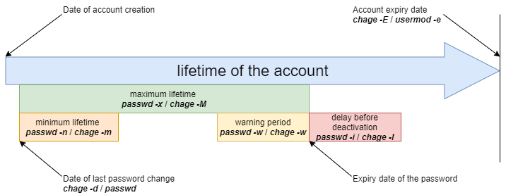

# 사용자 관리

이 문서에서는 사용자를 관리하는 방법을 배웁니다.

****
**목표**: 이 문서에서는 미래의 Linux 관리자가 다음을 수행하는 방법을 배웁니다:

:heavy_check_mark: **그룹** 추가, 삭제 또는 수정;   
:heavy_check_mark: **사용자** 추가, 삭제 또는 수정;   
:heavy_check_mark: 사용자 및 그룹과 관련된 파일을 이해 및 관리하는 방법   
:heavy_check_mark: 파일의 *소유자* 또는 *그룹 소유자* 변경;   
:heavy_check_mark: *보안* 사용자 계정;   
:heavy_check_mark: Id를 변경합니다.

:checkered_flag: **사용자**

**지식**: :star: :star:   
**복잡성**: :star: :star:

**소요 시간**: 30 분
****

## 일반

각 사용자에게는 사용자의 **기본 그룹**(primary group) 이라는 그룹이 있어야 합니다.

여러 사용자가 동일한 그룹에 속할 수 있습니다.

기본 그룹 이외의 그룹을 사용자의 **보조 그룹**(supplementary groups)이라고 합니다.

!!! 참고 사항

    각 사용자에게는 기본 그룹이 있으며 하나 이상의 보조 그룹에 초대될 수 있습니다.

그룹 및 사용자는 고유한 숫자 식별자인 `GID` 및 `UID`로 관리됩니다.

* `UID`: _User IDentifier - 사용자 식별자_. 고유한 사용자 ID입니다.
* `GID`: _Group IDentifier - 그룹 식별자_. 고유한 그룹 ID입니다.

UID와 GID는 모두 커널에서 인식됩니다. 즉, **uid=0** 사용자가 슈퍼 관리자인 한 슈퍼 관리자가 반드시 **root** 사용자일 필요는 없습니다.

사용자/그룹과 관련된 파일은 다음과 같습니다:

* /etc/passwd
* /etc/shadow
* /etc/group
* /etc/gshadow
* /etc/skel/
* /etc/default/useradd
* /etc/login.defs

!!! 위험

    파일을 수동으로 편집하는 대신 항상 관리 명령을 사용해야 합니다.

## 그룹 관리

수정된 파일, 추가된 행:

* `/etc/group`
* `/etc/gshadow`

### `groupadd` 명령

`groupadd` 명령은 시스템에 그룹을 추가합니다.
```
groupadd [-f] [-g GID] group
```

예시:

```
$ sudo groupadd -g 1012 GroupeB
```

| 옵션       | 설명                                                                                              |
| -------- | ----------------------------------------------------------------------------------------------- |
| `-g GID` | 생성할 그룹의 `GID`입니다.                                                                               |
| `-f`     | 시스템은 `-g` 옵션으로 지정된 것이 이미 존재하는 경우 `GID`를 선택합니다.                                                  |
| `-r`     | `SYS_GID_MIN`과 `SYS_GID_MAX` 사이에 `GID`가 있는 시스템 그룹을 생성합니다. 이 두 변수는 `/etc/login.defs`에 정의되어 있습니다. |

그룹 명명 규칙:

* 악센트 또는 특수 문자 없음;
* 기존 사용자 또는 시스템 파일의 이름과 다릅니다.

!!! 참고 사항

    **Debian**에서 관리자는 모든 Linux 배포판에 이식할 수 있는 스크립트를 제외하고 `man`에 지정된 대로 `addgroup` 및 `delgroup` 명령을 사용해야 합니다.

    ```
    $ man addgroup
    DESCRIPTION
    adduser and addgroup add users and groups to the system according to command line options and configuration information
    in /etc/adduser.conf. They are friendlier front ends to the low-level tools like useradd, groupadd and usermod programs,
    by default, choosing Debian policy conformant UID and GID values, creating a home directory with skeletal configuration,
    running a custom script, and other features.
    ```

### `groupmod` 명령

`groupmod` 명령을 사용하면 시스템의 기존 그룹을 수정할 수 있습니다.

```
groupmod [-g GID] [-n nom] group
```

예시:

```
$ sudo groupmod -g 1016 GroupP
$ sudo groupmod -n GroupC GroupB
```

| 옵션        | 설명                  |
| --------- | ------------------- |
| `-g GID`  | 수정할 그룹의 새 `GID`입니다. |
| `-n name` | 새 그룹 이름으로 변경합니다.    |

그룹의 이름, `GID` 또는 둘 다를 동시에 변경할 수 있습니다.

수정 후 그룹에 속한 파일에는 알 수 없는 `GID`가 있습니다. 새 `GID`를 다시 지정해야 합니다.

```
$ sudo find / -gid 1002 -exec chgrp 1016 {} \;
```

### `groupdel` 명령

`groupdel` 명령은 시스템의 기존 그룹을 삭제하는 데 사용됩니다.

```
groupdel group
```

예시:

```
$ sudo groupdel GroupC
```

!!! 팁

    그룹을 삭제할 때 발생할 수 있는 두 가지 조건이 있습니다.

    * 만약 사용자가 고유한 기본 그룹을 가지고 있고, 해당 그룹에 대해 `groupdel` 명령어를 실행하면, 해당 그룹에 특정 사용자가 속해 있어서 그룹을 삭제할 수 없다는 메시지가 나타납니다.
    * 만약 사용자가 보조 그룹에 속하고 (사용자의 주요 그룹이 아닌 경우), 해당 그룹이 시스템에 다른 사용자의 주요 그룹이 아니라면, `groupdel` 명령어를 사용하여 그룹을 추가 확인 없이 삭제할 수 있습니다.

    예시:

    ```bash
    Shell > useradd testa
    Shell > id testa
    uid=1000(testa) gid=1000(testa) group=1000(testa)
    Shell > groupdel testa
    groupdel: cannot remove the primary group of user 'testa'

    Shell > groupadd -g 1001 testb
    Shell > usermod -G testb root
    Shell > id root
    uid=0(root) gid=0(root) group=0(root),1001(testb)
    Shell > groupdel testb
    ```

!!! 팁

    `userdel -r` 명령을 사용하여 사용자를 삭제하면 해당 기본 그룹도 함께 삭제됩니다. 기본 그룹 이름은 일반적으로 사용자 이름과 동일합니다.

!!! 팁

    각 그룹에는 고유한 'GID'가 있습니다. 그룹은 여러 사용자가 보조 그룹으로 사용할 수 있습니다. 규칙에 따라 최고 관리자의 GID는 0입니다. 일부 서비스 또는 프로세스에 예약된 GIDS는 201~999이며, 이를 시스템 그룹 또는 유사 사용자 그룹이라고 합니다. 사용자의 GID는 일반적으로 1000보다 크거나 같습니다. 이것들은 나중에 설명할 <font color=red>/etc/login.defs</font>와 관련이 있습니다.

    ```bash
    # 코멘트 라인 무시
    shell > cat  /etc/login.defs
    MAIL_DIR        /var/spool/mail
    UMASK           022
    HOME_MODE       0700
    PASS_MAX_DAYS   99999
    PASS_MIN_DAYS   0
    PASS_MIN_LEN    5
    PASS_WARN_AGE   7
    UID_MIN                  1000
    UID_MAX                 60000
    SYS_UID_MIN               201
    SYS_UID_MAX               999
    GID_MIN                  1000
    GID_MAX                 60000
    SYS_GID_MIN               201
    SYS_GID_MAX               999
    CREATE_HOME     yes
    USERGROUPS_ENAB yes
    ENCRYPT_METHOD SHA512
    ```

!!! 팁

    사용자는 반드시 그룹의 일부이므로 사용자를 추가하기 전에 그룹을 만드는 것이 가장 좋습니다. 따라서 그룹에 구성원이 없을 수 있습니다.

### `/etc/group` 파일

이 파일에는 그룹 정보가 포함되어 있습니다(`:`로 구분됨).

```
$ sudo tail -1 /etc/group
GroupP:x:516:patrick
  (1)  (2)(3)   (4)
```

* 1: 그룹의 이름입니다.
* 2: 그룹 암호는 `x`로 식별됩니다. 그룹 암호는 `/etc/gshadow`에 저장됩니다.
* 3: GID.
* 4: 그룹의 보조 사용자(고유한 기본 사용자 제외).

!!! 참고 사항

   `/etc/group` 파일의 각 행은 그룹에 해당합니다. 기본 사용자 정보는 `/etc/passwd`에 저장됩니다.

### `/etc/gshadow` 파일

이 파일에는 그룹에 대한 보안 정보가 포함되어 있습니다(`:`로 구분됨).

```
$ sudo grep GroupA /etc/gshadow
GroupA:$6$2,9,v...SBn160:alain:rockstar
   (1)      (2)            (3)      (4)
```

* 1: 그룹의 이름입니다.
* 2: 암호화된 비밀번호.
* 3: 그룹 관리자의 이름입니다.
* 4: 그룹의 보조 사용자(고유한 기본 사용자 제외).

!!! 주의

    **/etc/group** 및 **/etc/gshadow**의 그룹 이름은 하나씩 일치해야 합니다. 즉, **/etc/gshadow** 파일의 각 행에 **/etc/gshadow** 파일의 해당 행이 있어야 합니다.

비밀번호의 `!`는 비밀번호가 잠겨 있음을 나타냅니다. 따라서, 사용자는 그룹에 액세스하기 위해 비밀번호를 사용할 수 없습니다 (그룹 멤버는 비밀번호가 필요하지 않기 때문입니다).

## 사용자 관리

### 정의

사용자는 `/etc/passwd` 파일에서 다음과 같이 정의됩니다.

* 1: 로그인 이름;
* 2: 암호 식별, `x`는 사용자에게 암호가 있음을 나타내며 암호화된 암호는 `/etc/shadow`의 두 번째 필드에 저장됩니다.
* 3: UID;
* 4: 기본 그룹의 GID;
* 5: 코멘트;
* 6: 홈 디렉토리;
* 7: 셸(`/bin/bash`, `/bin/nologin`, ...).

사용자에는 세 가지 유형이 있습니다.

* **root(uid=0)**: 시스템 관리자
* **시스템 사용자(uid는 201~999 중 하나)**: 애플리케이션 액세스 권한을 관리하기 위해 시스템에서 사용합니다.
* **일반 사용자(uid>=1000)**: 시스템에 로그인하기 위한 다른 계정입니다.

수정된 파일, 추가된 행:

* `/etc/passwd`
* `/etc/shadow`

### `useradd` 명령

`useradd` 명령은 사용자를 추가하는 데 사용됩니다.

```
useradd [-u UID] [-g GID] [-d directory] [-s shell] login
```

예시:

```
$ sudo useradd -u 1000 -g 1013 -d /home/GroupC/carine carine
```

| 옵션                  | 설명                                                                              |
| ------------------- | ------------------------------------------------------------------------------- |
| `-u UID`            | 생성할 사용자의 `UID`입니다.                                                              |
| `-g GID`            | 기본 그룹의 `GID`. 여기서 `GID`는 `그룹 이름`일 수도 있습니다.                                      |
| `-G GID1,[GID2]...` | 보조 그룹의 `GID`. 여기서 `GID`는 `그룹 이름`일 수도 있습니다. 여러 보조 그룹을 쉼표로 구분하여 지정할 수 있습니다.       |
| `-d directory`      | 홈 디렉터리                                                                          |
| `-s shell`          | 셸                                                                               |
| `-c COMMENT`        | 코멘트 추가                                                                          |
| `-U`                | 동시에 생성된 같은 이름의 그룹에 사용자를 추가합니다. 이 옵션을 기본적으로 작성하지 않으면 사용자 생성 시 동일한 이름의 그룹이 생성됩니다. |
| `-M`                | 사용자의 홈 디렉토리를 만들지 마십시오.                                                          |
| `-r`                | 시스템 계정을 만듭니다.                                                                   |

생성 시 계정에는 암호가 없으며 잠겨 있습니다.

계정 잠금을 해제하려면 암호를 지정해야 합니다.

`useradd` 명령에 옵션이 없으면 다음과 같이 나타납니다.

* 같은 이름으로 홈 디렉토리를 만듭니다.
* 같은 이름으로 기본 그룹을 만듭니다.
* 기본 쉘은 bash입니다.
* 사용자의 UID 및 기본 그룹 GID 값이 자동으로 추론됩니다. 일반적으로 1000에서 60,000 사이의 고유한 값입니다.

!!! 참고 사항

    기본 설정 및 값은 다음 구성 파일에서 가져옵니다:
    
    `/etc/login.defs` 및 `/etc/default/useradd`

```bash
Shell > useradd test1

Shell > tail -n 1 /etc/passwd
test1:x:1000:1000::/home/test1:/bin/bash

Shell > tail -n 1 /etc/shadow
test1:!!:19253:0:99999:7
:::

Shell > tail -n 1 /etc/group ; tail -n 1 /etc/gshadow
test1:x:1000:
test1:!::
```

계정 명명 규칙:

* 악센트, 대문자 또는 특수 문자가 없습니다.
* RockyLinux에서 대문자 사용자 이름을 사용할 수 있지만 권장하지 않습니다.
* 선택 사항: 생성 시 `-u`, `-g`, `-d` 및 `-s` 옵션을 설정합니다.
* 기존 그룹 또는 시스템 파일의 이름과 다릅니다.
* 사용자 이름은 최대 32자를 포함할 수 있습니다.

!!! 주의

    마지막 디렉터리를 제외하고 홈 디렉터리 트리를 생성해야 합니다.

마지막 디렉토리는 `/etc/skel`에서 파일을 복사할 수 있는 `useradd` 명령에 의해 생성됩니다.

**사용자는 기본 그룹 외에 여러 그룹에 속할 수 있습니다.**

예시:

```
$ sudo useradd -u 1000 -g GroupA -G GroupP,GroupC albert
```

!!! 참고 사항

    **데비안**에서는 `-m` 옵션을 지정하여 로그인 디렉토리를 강제로 생성하거나 `/etc/login.defs` 파일에서 `CREATE_HOME` 변수를 설정해야 합니다. 모든 경우에 관리자는 `man`에 지정된 대로 `adduser` 및 `deluser` 명령을 사용해야 합니다. 단, 모든 Linux 배포판에 이식할 수 있는 스크립트는 예외입니다.

    ```
    $ man useradd
    DESCRIPTION
       **useradd**는 사용자를 추가하기 위한 low-level 유틸리티입니다. Debian에서 관리자는 일반적으로 **adduser(8)**를 대신 사용해야 합니다.
    ```

#### 사용자 생성을 위한 기본값입니다.

`/etc/default/useradd` 파일 수정.

```
useradd -D [-b directory] [-g group] [-s shell]
```

예시:

```
$ sudo useradd -D -g 1000 -b /home -s /bin/bash
```

| 옵션             | 설명                                |
| -------------- | --------------------------------- |
| `-D`           | 사용자 생성을 위한 기본값을 설정합니다.            |
| `-b directory` | 기본 로그인 디렉토리를 설정합니다.               |
| `-g group`     | 기본 그룹을 설정합니다.                     |
| `-s shell`     | 기본 쉘을 설정합니다.                      |
| `-f`           | 암호가 만료된 후 계정이 비활성화되기 전까지의 일 수입니다. |
| `-e`           | 계정이 비활성화되는 날짜입니다.                 |

### `usermod` 명령

`usermod` 명령을 사용하면 사용자를 수정할 수 있습니다.

```
usermod [-u UID] [-g GID] [-d directory] [-m] login
```

예시:

```
$ sudo usermod -u 1044 carine
```

`useradd` 명령과 동일한 옵션입니다.

| 옵션              | 설명                                                                                                                         |
| --------------- | -------------------------------------------------------------------------------------------------------------------------- |
| `-m`            | `-d` 옵션과 관련됩니다. 이전 로그인 디렉터리의 내용을 새로운 디렉터리로 이동합니다. 이전 홈 디렉터리가 존재하지 않는 경우 새로운 홈 디렉터리가 생성되지 않으며, 새로운 홈 디렉터리가 존재하지 않을 때 생성됩니다. |
| `-l login`      | 새 로그인 이름입니다. 로그인 이름을 수정한 후 일치하도록 홈 디렉토리의 이름도 수정해야 합니다.                                                                     |
| `-e YYYY-MM-DD` | 계정 만료 날짜를 수정합니다.                                                                                                           |
| `-L`            | 계정을 영구적으로 잠급니다. 즉, `!`가 `/etc/shadow` 암호 필드 시작 부분에 추가됩니다.                                                                  |
| `-U`            | 계정을 잠금 해제합니다.                                                                                                              |
| `-a`            | `-G` 옵션과 함께 사용해야 하는 사용자의 보조 그룹을 추가합니다.                                                                                     |
| `-G`            | 이전 보조 그룹을 덮어쓰도록 사용자의 보조 그룹을 수정합니다.                                                                                         |

!!! 팁

    수정하려면 사용자의 연결이 끊어지고 실행 중인 프로세스가 없어야 합니다.

식별자를 변경한 후 사용자에게 속한 파일에는 알 수 없는 `UID`가 있습니다. 새 `UID`에 재할당해야 합니다.

여기서 `1000`은 이전 `UID`이고 `1044`는 새 것입니다. 예는 다음과 같습니다.

```
$ sudo find / -uid 1000 -exec chown 1044: {} \;
```

사용자 계정의 잠금 및 잠금 해제, 예는 다음과 같습니다.

```
Shell > usermod -L test1
Shell > grep test1 /etc/shadow
test1:!$6$n.hxglA.X5r7X0ex$qCXeTx.kQVmqsPLeuvIQnNidnSHvFiD7bQTxU7PLUCmBOcPNd5meqX6AEKSQvCLtbkdNCn.re2ixYxOeGWVFI0:19259:0:99999:7
:::

Shell > usermod -U test1
```

`-aG` 옵션과 `-G` 옵션의 차이점은 다음 예에서 설명할 수 있습니다.

```bash
Shell > useradd test1
Shell > passwd test1
Shell > groupadd groupA ; groupadd groupB ; groupadd groupC ; groupadd groupD
Shell > id test1
uid=1000(test1) gid=1000(test1) groups=1000(test1)

Shell > gpasswd -a test1 groupA
Shell > id test1
uid=1000(test1) gid=1000(test1) groups=1000(test1),1002(groupA)

Shell > usermod -G groupB,groupC test1
Shell > id test1 
uid=1000(test1) gid=1000(test1) gorups=1000(test1),1003(groupB),1004(groupC)

Shell > usermod -aG groupD test1
uid=1000(test1) gid=1000(test1) groups=1000(test1),1003(groupB),1004(groupC),1005(groupD)
```

### `userdel` 명령

`userdel` 명령을 사용하면 사용자 계정을 삭제할 수 있습니다.

```
$ sudo userdel -r carine
```

| 옵션   | 설명                                                     |
| ---- | ------------------------------------------------------ |
| `-r` | `/var/spool/mail/` 디렉토리에 있는 사용자의 홈 디렉토리와 메일 파일을 삭제합니다. |

!!! 팁

    삭제하려면 사용자가 로그아웃하고 실행 중인 프로세스가 없어야 합니다.

`userdel` 명령은 `/etc/passwd`, `/etc/shadow`, `/etc/group`, `/etc/gshadow`에서 해당 줄을 제거합니다. 위에서 언급한 것처럼 `userdel -r`은 사용자의 해당 기본 그룹도 삭제합니다.

### `/etc/passwd` 파일

이 파일에는 사용자 정보가 포함되어 있습니다(`:`로 구분됨).

```
$ sudo head -1 /etc/passwd
root:x:0:0:root:/root:/bin/bash
(1)(2)(3)(4)(5)  (6)    (7)
```

* 1: 로그인 이름;
* 2: 암호 식별, `x`는 사용자에게 암호가 있음을 나타내며 암호화된 암호는 `/etc/shadow`의 두 번째 필드에 저장됩니다.
* 3: UID;
* 4: 기본 그룹의 GID;
* 5: 코멘트;
* 6: 홈 디렉토리;
* 7: 셸(`/bin/bash`, `/bin/nologin`, ...).

### `/etc/shadow` 파일

이 파일에는 사용자의 보안 정보가 포함되어 있습니다(`:`로 구분됨).
```
$ sudo tail -1 /etc/shadow
root:$6$...:15399:0:99999:7
:::
 (1)    (2)  (3) (4) (5) (6)(7,8,9)
```

* 1: 로그인 이름;
* 2: 암호화된 비밀번호. `/etc/login.defs`의 `ENCRYPT_METHOD`로 정의된 SHA512 암호화 알고리즘을 사용합니다.
* 3: 암호가 마지막으로 변경된 시간, 타임스탬프 형식(일)입니다. 소위 타임스탬프는 1970년 1월 1일을 기준으로 합니다. 하루가 지날 때마다 타임스탬프는 +1입니다.
* 4: 암호의 최소 수명입니다. 즉, 두 번의 암호 변경(세 번째 필드 관련) 사이의 시간 간격(일)입니다.  `/etc/login.defs`의 `PASS_MIN_DAYS`로 정의되며 기본값은 0입니다. 즉, 비밀번호를 두 번째로 변경할 때 제한이 없습니다. 단, 5일 경우 5일 이내 비밀번호 변경 불가, 5일 이후에만 가능함을 의미합니다.
* 5: 암호의 최대 수명입니다. 즉, 암호의 유효 기간입니다(세 번째 필드 관련). `/etc/login.defs`의 `PASS_MAX_DAYS`로 정의됩니다.
* 6: 암호가 만료되기 전의 경고 일 수(다섯 번째 필드와 관련됨). 기본값은 `/etc/login.defs`의 `PASS_WARN_AGE`로 정의된 7일입니다.
* 7: 비밀번호 만료 후 유예 기간(다섯 번째 필드 관련).
* 8: 계정 만료 시간, 타임스탬프 형식, 일 단위. **계정 만료는 비밀번호 만료와 다릅니다. 계정이 만료된 경우 사용자는 로그인할 수 없습니다. 비밀번호가 만료된 경우 사용자는 자신의 비밀번호를 사용하여 로그인할 수 없습니다.**
* 9: 향후 사용을 위해 예약됨.

!!! 위험

    `/etc/passwd` 파일의 각 줄에 대해 `/etc/shadow` 파일에 해당 줄이 있어야 합니다.

타임스탬프 및 날짜 변환에 대해서는 다음 명령 형식을 참조하십시오.

```bash
# 타임스탬프는 날짜로 변환되며 "17718"은 입력할 타임스탬프를 나타냅니다.
Shell > date -d "1970-01-01 17718 days" 

# 날짜는 타임스탬프로 변환되며 "2018-07-06"은 입력할 날짜를 나타냅니다.
Shell > echo $(($(date --date="2018-07-06" +%s)/86400+1))
```

## 파일 소유자

!!! 위험

    모든 파일은 반드시 하나의 사용자와 하나의 그룹에 속해야 합니다.

파일을 생성하는 사용자의 기본 그룹은 기본적으로 파일을 소유한 그룹입니다.

### 수정 명령

#### `chown` 명령

`chown` 명령을 사용하면 파일 소유자를 변경할 수 있습니다.
```
chown [-R] [-v] login[:group] file
```

예시:
```
$ sudo chown root myfile
$ sudo chown albert:GroupA myfile
```

| 옵션   | 설명                                              |
| ---- | ----------------------------------------------- |
| `-R` | 해당 디렉터리와 그 하위 디렉터리에 속한 모든 파일의 소유자를 재귀적으로 변경합니다. |
| `-v` | 실행된 변경 사항을 표시합니다.                               |

소유자 사용자만 변경하는 방법:

```
$ sudo chown albert file
```

소유자 그룹만 수정하는 방법:

```
$ sudo chown :GroupA file
```

사용자 및 소유자 그룹 변경:

```
$ sudo chown albert:GroupA file
```

다음 예에서 할당된 그룹은 지정된 사용자의 기본 그룹이 됩니다.

```
$ sudo chown albert: file
```

디렉토리에 있는 모든 파일의 소유자 및 그룹 변경

```
$ sudo chown -R albert:GroupA /dir1
```

### `chgrp` 명령

`chgrp` 명령을 사용하면 파일의 소유자 그룹을 변경할 수 있습니다.

```
chgrp [-R] [-v] group file
```

예시:
```
$ sudo chgrp group1 file
```

| 옵션   | 설명                                              |
| ---- | ----------------------------------------------- |
| `-R` | 해당 디렉터리와 그 하위 디렉터리에 속한 모든 파일의 소유자를 재귀적으로 변경합니다. |
| `-v` | 실행된 변경 사항을 표시합니다.                               |

!!! 참고 사항

    다른 파일의 소유자 및 소유자 그룹을 참조로 사용하여 파일에 소유자 및 소유자 그룹을 적용할 수 있습니다.

```
chown [options] --reference=RRFILE FILE
```

예시:

```
chown --reference=/etc/groups /etc/passwd
```

## 게스트 관리

### `gpasswd` 명령

`gpasswd` 명령을 사용하면 그룹을 관리할 수 있습니다.

```
gpasswd [option] group
```

예시:

```
$ sudo gpasswd -A alain GroupA
[alain]$ gpasswd -a patrick GroupA
```

| 옵션            | 설명                                        |
| ------------- | ----------------------------------------- |
| `-a USER`     | 사용자를 그룹에 추가합니다. 추가된 사용자에게 이 그룹은 보조 그룹입니다. |
| `-A USER,...` | 관리 사용자 목록을 설정합니다.                         |
| `-d USER`     | 그룹에서 사용자를 제거합니다.                          |
| `-M USER,...` | 그룹 구성원 목록을 설정합니다.                         |

`gpasswd -M` 명령은 추가가 아니라 수정 역할을 합니다.

```
# gpasswd GroupeA
New Password:
Re-enter new password:
```

!!! note

    `gpasswd -a`를 사용하여 사용자를 그룹에 추가하는 것 외에도 앞서 언급한 `usermod -G` 또는 `usermod -AG`를 사용할 수도 있습니다.

### `id` 명령

`id` 명령은 사용자의 그룹 이름을 표시합니다.

```
id USER
```

예시:

```
$ sudo id alain
uid=1000(alain) gid=1000(GroupA) groupes=1000(GroupA),1016(GroupP)
```

### `newgrp` 명령

`newgrp` 명령은 사용자의 보조 그룹에서 그룹을 사용자의 새로운 **임시** 기본 그룹으로 선택할 수 있습니다. `newgrp` 명령은 사용자의 기본 그룹을 전환할 때마다 새로운 **하위 셸**(하위 프로세스)이 있게 됩니다. 주의하세요! **자식 셸**과 **하위 셸**은 다릅니다.

```
newgrp [secondarygroups]
```

예시:

```
Shell > useradd test1
Shell > passwd test1
Shell > groupadd groupA ; groupadd groupB 
Shell > usermod -G groupA,groupB test1
Shell > id test1
uid=1000(test1) gid=1000(test1) groups=1000(test1),1001(groupA),1002(groupB)
Shell > echo $SHLVL ; echo $BASH_SUBSHELL
1
0

Shell > su - test1
Shell > touch a.txt
Shell > ll
-rw-rw-r-- 1 test1 test1 0 10月  7 14:02 a.txt
Shell > echo $SHLVL ; echo $BASH_SUBSHELL
1
0

# 새로운 자식 쉘 생성
Shell > newgrp groupA
Shell > touch b.txt
Shell > ll
-rw-rw-r-- 1 test1 test1  0 10月  7 14:02 a.txt
-rw-r--r-- 1 test1 groupA 0 10月  7 14:02 b.txt
Shell > echo $SHLVL ; echo $BASH_SUBSHELL
2
0

# `exit` 명령을 사용하여 자식 셸을 종료할 수 있습니다.
Shell > exit
Shell > logout
Shell > whoami
root
```

## 보안

### `passwd` 명령

`passwd` 명령은 암호를 관리하는 데 사용됩니다.

```
passwd [-d] [-l] [-S] [-u] [login]
```

예시:

```
Shell > passwd -l albert
Shell > passwd -n 60 -x 90 -w 80 -i 10 patrick
```

| 옵션        | 설명                                                            |
| --------- | ------------------------------------------------------------- |
| `-d`      | 암호를 영구적으로 제거합니다. 루트(uid=0)의 경우에만 사용하십시오.                      |
| `-l`      | 사용자 계정을 영구적으로 잠급니다. 루트(uid=0)의 경우에만 사용하십시오.                   |
| `-S`      | 계정 상태를 표시합니다. 루트(uid=0)의 경우에만 사용하십시오.                         |
| `-u`      | 사용자 계정을 영구적으로 잠금 해제합니다. 루트(uid=0)의 경우에만 사용하십시오.               |
| `-e`      | 암호가 영구적으로 만료됩니다. 루트(uid=0)의 경우에만 사용하십시오.                      |
| `-n DAYS` | 암호의 최소 수명입니다. 영구적인 변화입니다. 루트(uid=0)의 경우에만 사용하십시오.             |
| `-x DAYS` | 암호의 최대 수명입니다. 영구적인 변화입니다. 루트(uid=0)의 경우에만 사용하십시오.             |
| `-w DAYS` | 만료 전 경고 시간입니다. 영구적인 변화입니다. 루트(uid=0)의 경우에만 사용하십시오.            |
| `-i DAYS` | 암호가 만료되면 비활성화되기 전에 지연됩니다. 영구적인 변화입니다. 루트(uid=0)의 경우에만 사용하십시오. |

`password -l`을 사용합니다. 즉, "!!"를 추가합니다. `/etc/shadow`에 해당하는 사용자의 암호 필드 시작 부분에 있습니다.

예시:

* Alain은 자신의 비밀번호를 변경합니다.

```
[alain]$ passwd
```

* root는 Alain의 암호를 변경합니다.

```
$ sudo passwd alain
```

!!! 참고 사항

    사용자는 'passwd' 명령을 사용하여 비밀번호를 변경할 수 있습니다(이전 비밀번호가 필요함). 관리자는 제한 없이 모든 사용자의 암호를 변경할 수 있습니다.

보안 제한 사항을 준수해야 합니다.

쉘 스크립트로 사용자 계정을 관리할 때 사용자를 생성한 후 기본 비밀번호를 설정해 두면 유용할 수 있습니다.

`passwd` 명령에 암호를 전달하면 됩니다.

예시:

```
$ sudo echo "azerty,1" | passwd --stdin philippe
```

!!! 주의

    암호는 일반 텍스트로 입력되며 `passwd`가 암호를 처리합니다.

### `chage` 명령

`chage` 명령은 사용자 암호 만료 정보를 변경합니다.

```
chage [-d date] [-E date] [-I days] [-l] [-m days] [-M days] [-W days] [login]
```

예시:

```
$ sudo chage -m 60 -M 90 -W 80 -I 10 alain
```

| 옵션               | 설명                                                                                    |
| ---------------- | ------------------------------------------------------------------------------------- |
| `-I DAYS`        | 비활성화 전 지연, 암호가 만료되었습니다. 영구적인 변화입니다.                                                   |
| `-l`             | 정책 세부 정보를 표시합니다.                                                                      |
| `-m DAYS`        | 암호의 최소 수명을 정의합니다. 영구적인 변화입니다.                                                         |
| `-M DAYS`        | 암호의 최대 수명을 정의합니다. 영구적인 변화입니다.                                                         |
| `-d LAST_DAY`    | 암호가 마지막으로 변경된 이후 일 수를 정의합니다. 요일의 타임스탬프 스타일 또는 YYYY-MM-DD 스타일을 사용할 수 있습니다. 영구적인 변화입니다. |
| `-E EXPIRE_DATE` | 계정 만료 날짜를 정의합니다. 요일의 타임스탬프 스타일 또는 YYYY-MM-DD 스타일을 사용할 수 있습니다. 영구적인 변화입니다.             |
| `-W WARN_DAYS`   | 만료 전 경고 시간입니다. 영구적인 변화입니다.                                                            |

예시:

```
# `chage` 명령은 대화식 모드도 제공합니다.
$ sudo chage philippe

# `-d` 옵션은 로그인 시 비밀번호를 강제로 변경하도록 합니다.
$ sudo chage -d 0 philippe
```



## 고급 관리

구성 파일:

* `/etc/default/useradd`
* `/etc/login.defs`
* `/etc/skel`

!!! 참고 사항

    `/etc/default/useradd` 파일 편집은 `useradd` 명령으로 수행됩니다.
    
    다른 파일은 텍스트 편집기로 수정해야 합니다.

### `/etc/default/useradd` 파일

이 파일에는 기본 데이터 설정이 포함되어 있습니다.

!!! 팁

    사용자 생성 시 옵션을 지정하지 않으면 시스템은 `/etc/default/useradd`에 정의된 기본값을 사용합니다.

이 파일은 `useradd -D` 명령으로 수정됩니다(다른 옵션 없이 입력한 `useradd -D`는 `/etc/default/useradd` 파일의 내용을 표시합니다).

```
Shell > grep -v ^# /etc/default/useradd 
GROUP=100
HOME=/home
INACTIVE=-1
EXPIRE=
SHELL=/bin/bash
SKEL=/etc/skel
CREATE_MAIL_SPOOL=yes
```

| 변수                  | 설명                                                                                    |
| ------------------- | ------------------------------------------------------------------------------------- |
| `GROUP`             | 기본 그룹 GID를 정의합니다.                                                                     |
| `HOME`              | 일반 사용자 홈 디렉토리의 상위 디렉토리 경로를 정의합니다.                                                     |
| `INACTIVE`          | 암호 만료 후 유예 기간(일)입니다. `/etc/shadow` 파일의 7번째 필드에 해당합니다. `-1` 값은 유예 기간 기능이 꺼져 있음을 의미합니다. |
| `EXPIRE`            | 계정 만료 날짜를 정의합니다. `/etc/shadow` 파일의 8번째 필드에 해당합니다.                                     |
| `SHELL`             | 명령 해석기.                                                                               |
| `SKEL`              | 로그인 디렉토리의 스켈레톤 디렉토리.                                                                  |
| `CREATE_MAIL_SPOOL` | `/var/spool/mail/`에 메일박스 생성.                                                          |

사용자를 생성할 때 동일한 이름의 기본 그룹이 필요하지 않은 경우 다음을 수행할 수 있습니다.

```
Shell > useradd -N test2
Shell > id test2
uid=1001(test2) gid=100(users) groups=100(users)
```

### `/etc/login.defs` 파일

```bash
# 코멘트 라인 무시
shell > cat  /etc/login.defs
MAIL_DIR        /var/spool/mail
UMASK           022
HOME_MODE       0700
PASS_MAX_DAYS   99999
PASS_MIN_DAYS   0
PASS_MIN_LEN    5
PASS_WARN_AGE   7
UID_MIN                  1000
UID_MAX                 60000
SYS_UID_MIN               201
SYS_UID_MAX               999
GID_MIN                  1000
GID_MAX                 60000
SYS_GID_MIN               201
SYS_GID_MAX               999
CREATE_HOME     yes
USERGROUPS_ENAB yes
ENCRYPT_METHOD SHA512
```

`UMASK 022`: 파일 생성 권한이 755(rwxr-xr-x)임을 의미합니다. 그러나 보안을 위해 GNU/Linux는 새로 생성된 파일에 대한 **x** 권한이 없으며 이 제한은 루트(uid=0) 및 일반 사용자(uid>=1000)에게만 적용됩니다. 예시:

```
Shell > touch a.txt
Shell > ll
-rw-r--r-- 1 root root     0 Oct  8 13:00 a.txt
```

`HOME_MODE 0700`: 일반 사용자의 홈 디렉토리 권한입니다. 루트의 홈 디렉토리에서는 작동하지 않습니다.

```
Shell > ll -d /root
dr-xr-x---. 10 root root 4096 Oct  8 13:12 /root

Shell > ls -ld /home/test1/
drwx------ 2 test1 test1 4096 Oct  8 13:10 /home/test1/
```

`USERGROUPS_ENAB yes`: "`userdel -r` 명령을 사용하여 사용자를 삭제하면 해당 기본 그룹도 삭제됩니다." 왜일까요? 그게 이유입니다.

### `/etc/skel` 디렉토리

사용자가 생성되면 홈 디렉터리와 환경 파일이 생성됩니다. `/etc/skel/` 디렉토리에 있는 파일을 사용자를 생성하는 데 필요한 파일 템플릿으로 생각할 수 있습니다.

이러한 파일은 `/etc/skel` 디렉토리에서 자동으로 복사됩니다.

* `.bash_logout`
* `.bash_profile`
* `.bashrc`

이 디렉터리에 있는 모든 파일과 디렉터리는 생성 시 사용자 트리에 복사됩니다.

## 아이덴티티 변경

### `su` 명령

`su` 명령을 사용하면 연결된 사용자의 Id를 변경할 수 있습니다.

```
su [-] [-c command] [login]
```

예시:

```
$ sudo su - alain
[albert]$ su - root -c "passwd alain"
```

| 옵션           | 설명                 |
| ------------ | ------------------ |
| `-`          | 사용자의 전체 환경을 로드합니다. |
| `-c` command | 사용자 Id로 명령을 실행합니다. |

로그인을 지정하지 않으면 `root`가 됩니다.

표준 사용자는 새 Id의 암호를 입력해야 합니다.

!!! 팁

    You can use the `exit`/`logout` command to exit users who have been switched. 사용자를 전환한 후에는 새로운 `자식 셸` 또는 `하위 셸`이 없다는 점에 유의해야 합니다. 예를 들면 다음과 같습니다.

    ```
    Shell > whoami
    root
    Shell > echo $SHLVL ; echo $BASH_SUBSHELL
    1
    0

    Shell > su - test1
    Shell > echo $SHLVL ; echo $BASH_SUBSHELL
    1
    0
    ```

주의하십시오! `su`와 `su -`는 다음 예와 같이 다릅니다.

```
Shell > whoami
test1
Shell > su root
Shell > pwd
/home/test1

Shell > env
...
USER=test1
PWD=/home/test1
HOME=/root
MAIL=/var/spool/mail/test1
LOGNAME=test1
...
```

```
Shell > whoami
test1
Shell > su - root
Shell > pwd
/root

Shell > env
...
USER=root
PWD=/root
HOME=/root
MAIL=/var/spool/mail/root
LOGNAME=root
...
```

따라서 사용자를 전환할 때 `-`을 잃지 않도록 하십시오. 필요한 환경 변수 파일이 로드되지 않아 일부 프로그램 실행에 문제가 있을 수 있습니다.
