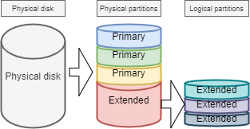
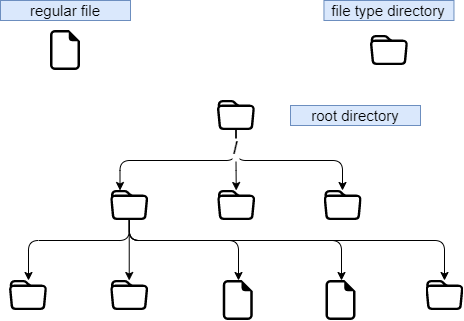
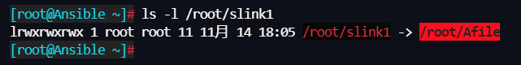

# 파일 시스템

이 문서에서는 파일 시스템으로 작업하는 방법을 배웁니다.

****

**목표** : 이 문서에서는 미래의 Linux 관리자가 다음을 수행하는 방법을 배웁니다.

:heavy_check_mark: 디스크의 파티션 관리   
:heavy_check_mark: 디스크 리소스를 보다 효율적으로 사용하기 위해 LVM 사용   
:heavy_check_mark: 사용자에게 파일 시스템을 제공하고 액세스 권한을 관리

또한 다음을 발견합니다.

:heavy_check_mark: Linux에서 트리 구조가 구성되는 방식;   
:heavy_check_mark: 제공되는 다양한 유형의 파일 및 작업 방법;

:checkered_flag: **하드웨어**, **디스크**, **파티션**, **lvm**, **linux**

**지식**: :star: :star:   
**복잡성**: :star: :star:

**소요 시간**: 20분

****

## 파티셔닝

파티션을 분할하면 여러 운영 체제를 설치할 수 있습니다. 이는 여러 운영 체제가 동일한 논리 드라이브에 공존하는 것이 불가능하기 때문입니다. 파티셔닝을 통해 데이터를 논리적으로 분리할 수도 있습니다(보안, 액세스 최적화 등).

물리적 디스크를 분할된 볼륨으로 나누는 것은 파티션 테이블에 기록되며 디스크의 첫 번째 섹터(MBR: _Master Boot Record_) 에 저장됩니다.

**MBR** 파티션 테이블 유형의 경우 동일한 물리적 디스크를 최대 4개의 파티션으로 나눌 수 있습니다.

* *기본 파티션*(또는 메인 파티션)
* *확장 파티션*

!!! 주의

    물리적 디스크당 하나의 확장 파티션만 있을 수 있습니다. 즉, 물리적 디스크는 MBR 파티션 테이블에서 다음까지 가질 수 있습니다.

    1. 3개의 기본 파티션과 1개의 확장 파티션
    2. 4개의 기본 파티션

    확장 파티션은 데이터를 쓰고 포맷할 수 없으며 논리 파티션만 포함할 수 있습니다. MBR 파티션 테이블에서 인식할 수 있는 가장 큰 물리적 디스크는 **2TB**입니다.




### 장치 파일 이름에 대한 명명 규칙

GNU/Linux 세계에서는 모든 것이 파일입니다. 디스크의 경우 시스템에서 다음과 같이 인식됩니다.

| 하드웨어                | 장치 파일 이름               |
| ------------------- | ---------------------- |
| IDE 하드디스크           | /dev/hd[a-d]           |
| SCSI/SATA/USB 하드디스크 | /dev/sd[a-z]           |
| 광학 드라이브             | /dev/cdrom 또는 /dev/sr0 |
| 플로피 디스크             | /dev/fd[0-7]           |
| 프린터 (25 pins)       | /dev/lp[0-2...]        |
| 프린터 (USB)           | /dev/usb/lp[0-15]      |
| 마우스                 | /dev/mouse             |
| 가상 하드디스크            | /dev/vd[a-z]           |

Linux 커널에는 대부분의 하드웨어 장치용 드라이버가 포함되어 있습니다.

유형으로 식별됩니다.

udev라는 서비스는 명명 규칙(규칙)을 적용하고 감지한 장치에 적용하는 역할을 합니다.

자세한 내용은 [여기](https://www.kernel.org/doc/html/latest/admin-guide/devices.html)를 참조하세요.

### 장치 파티션 번호

블록 장치(저장 장치) 뒤의 숫자는 파티션을 나타냅니다. MBR 파티션 테이블의 경우 숫자 5는 첫 번째 논리 파티션이어야 합니다.

!!! 주의

    주의하십시오! 여기서 언급한 파티션 번호는 주로 블록 장치(저장 장치)의 파티션 번호를 나타냅니다.


디스크 파티셔닝에는 `fdisk` 및 `cfdisk`라는 두 가지 이상의 명령이 있습니다. 두 명령 모두 대화형 메뉴가 있습니다. `cfdisk`는 더 안정적이고 더 최적화되어 있으므로 사용하는 것이 가장 좋습니다.

`fdisk`를 사용하는 유일한 이유는 `-l` 옵션으로 모든 논리 장치를 나열하려는 경우입니다. `fdisk`는 MBR 파티션 테이블을 사용하므로 **GPT** 파티션 테이블에 대해 지원되지 않으며 **2TB**보다 큰 디스크에 대해서도 처리할 수 없습니다.

```
sudo fdisk -l
sudo fdisk -l /dev/sdc
sudo fdisk -l /dev/sdc2
```

### `paraged` 명령

`parted`(_파티션 편집기_) 명령은 디스크를 분할할 수 있으며 `fdisk`의 단점을 해결합니다.

`parted` 명령은 명령줄에서 또는 대화식으로 사용할 수 있습니다. 또한 삭제된 파티션 테이블을 다시 작성할 수 있는 복구 기능도 있습니다.

```
parted [-l] [device]
```

그래픽 인터페이스에는 매우 완벽한 `gparted` 도구가 있습니다: *G*nome *PAR*tition *ED*itor.

`gparted -l` 명령은 컴퓨터의 모든 논리 장치를 나열합니다.

`gparted` 명령만으로 자체 내부 옵션이 있는 대화형 모드로 돌아갑니다.

* `help` 또는 잘못된 명령은 이러한 옵션을 표시합니다.
* 이 모드의 `print all`은 명령줄의 `gparted -l`과 동일한 결과를 가집니다.
* 프롬프트로 돌아가려면 `quit`하십시오.

### `cfdisk` 명령

`cfdisk` 명령은 파티션을 관리하는 데 사용됩니다.

```
cfdisk [device]
```

예시:

```
$ sudo cfdisk /dev/sda
                                 Disk: /dev/sda
               Size: 16 GiB, 17179869184 bytes, 33554432 sectors
                       Label: dos, identifier: 0xcf173747
    Device        Boot       Start        End    Sectors   Size   Id Type
>>  /dev/sda1     *           2048    2099199    2097152     1G   83 Linux
    /dev/sda2              2099200   33554431   31455232    15G   8e Linux LVM
 lqqqqqqqqqqqqqqqqqqqqqqqqqqqqqqqqqqqqqqqqqqqqqqqqqqqqqqqqqqqqqqqqqqqqqqqqqqqqk
 x Partition type: Linux (83)                                                 x
 x     Attributes: 80                                                         x
 xFilesystem UUID: 54a1f5a7-b8fa-4747-a87c-2dd635914d60                       x
 x     Filesystem: xfs                                                        x
 x     Mountpoint: /boot (mounted)                                            x
 mqqqqqqqqqqqqqqqqqqqqqqqqqqqqqqqqqqqqqqqqqqqqqqqqqqqqqqqqqqqqqqqqqqqqqqqqqqqqj
     [Bootable]  [ Delete ]  [ Resize ]  [  Quit  ]  [  Type  ]  [  Help  ]
     [  Write ]  [  Dump  ]
```

_LVM_ 없이 실제 미디어를 준비하는 과정은 다음 5단계를 거칩니다.

* 물리디스크를 설정합니다.
* 볼륨 파티셔닝을 합니다.(디스크의 지리적 구분, 여러 시스템 설치 가능성 등)
* 파일 시스템을 생성합니다.(운영 체제가 파일, 트리 구조, 권한 등을 관리할 수 있음)
* 파일 시스템 마운트합니다.(트리 구조에 파일 시스템 등록)
* 사용자 액세스를 관리합니다.

## Logical Volume Manager (LVM)

**L**ogical **V**olume **M**anager (*LVM*)

**표준 파티션**에 의해 생성된 파티션은 하드 디스크의 리소스를 동적으로 조정할 수 없습니다. 파티션이 장착되고 용량이 완전히 고정되므로 서버에서 이러한 제약을 허용할 수 없습니다. 표준 파티션은 특정 기술적 수단을 통해 강제로 확장하거나 축소할 수 있지만 데이터 손실이 발생하기 쉽습니다. LVM은 이 문제를 아주 잘 해결할 수 있습니다. LVM은 커널 버전 2.4부터 Linux에서 사용할 수 있으며 주요 기능은 다음과 같습니다.

* 보다 유연한 디스크 용량
* 온라인 데이터 이동
* _스트라이프_ 모드의 디스크
* 미러링된 볼륨(recopy)
* 볼륨 스냅샷(_snapshot_).

LVM의 원리는 매우 간단합니다:

* 물리적 디스크(또는 디스크 파티션) 와 파일 시스템 사이에 논리적 추상화 계층이 추가됩니다.
* 여러 디스크(또는 디스크 파티션)를 볼륨 그룹(**VG**)으로 병합
* Logical Volume(**LV**)이라는 것을 통해 기본 디스크 관리 작업을 수행합니다.

**물리적 매체**: LVM의 저장 매체는 전체 하드 디스크, 디스크 파티션 또는 RAID 어레이일 수 있습니다. 추가 작업을 수행하려면 장치를 LVM Physical Volume(**PV**) 으로 변환하거나 초기화해야 합니다.

**PV(Physical Volume)**: LVM의 기본 스토리지 논리 블록입니다. 물리적 볼륨을 생성하려면 디스크 파티션이나 디스크 자체를 사용할 수 있습니다.

**VG(Volume Group)**: 표준 파티션의 물리적 디스크와 마찬가지로 VG는 하나 이상의 PV로 구성됩니다.

**LV(Logical Volume)**: 표준 파티션의 하드 디스크 파티션과 마찬가지로 LV는 VG 위에 구축됩니다. LV에서 파일 시스템을 설정할 수 있습니다.

<b><font color="blue">PE</font></b>: 물리적 볼륨에 할당할 수 있는 최소 스토리지 단위이며 기본값은 <b>4MB</b> 입니다. 추가 크기를 지정할 수 있습니다.

<b><font color="blue">LE</font></b>: 논리 볼륨에 할당할 수 있는 최소 스토리지 단위입니다. 동일한 VG에서 PE와 LE는 동일하며 일대일로 대응합니다.


단점은 물리 볼륨 중 하나가 고장나면 이 물리 볼륨을 사용하는 모든 논리 볼륨이 손실된다는 것입니다. RAID 디스크에서 LVM을 사용해야 합니다.

!!! 참고 사항

    LVM은 운영 체제에서만 관리됩니다. 따라서 _BIOS_는 부팅을 위해 LVM이 없는 파티션이 하나 이상 필요합니다.

!!! 정보

    물리적 디스크에서 가장 작은 저장 단위는 **섹터**입니다. 파일 시스템에서 GNU/Linux의 최소 저장 단위는 **블록**이며 Windows 운영 체제에서는 **클러스터**라고 합니다.; RAID에서 가장 작은 저장 장치는 **청크**입니다.

### LVM 쓰기 메커니즘

데이터를 **LV**에 저장할 때 몇 가지 저장 메커니즘이 있으며 그 중 두 가지는 다음과 같습니다.

* 선형 볼륨;
* _stripe_ 모드의 볼륨
* 미러링된 볼륨.


### 볼륨 관리를 위한 LVM 명령

주요 관련 명령은 다음과 같습니다.

|    항목    |    PV     |    VG     |    LV     |
|:--------:|:---------:|:---------:|:---------:|
|    스캔    |  pcscan   |  vgscan   |  lvscan   |
|    생성    | pvcreate  | vgcreate  | lvcreate  |
|    표시    | pvdisplay | vgdisplay | lvdisplay |
|    제거    | pvremove  | vgremove  | lvremove  |
|    확장    |           | vgextend  | lvextend  |
|    감소    |           | vgreduce  | lvreduce  |
| 사례 요약 정보 |    pvs    |    vgs    |    lvs    |

#### `pvcred` 명령

`pvcreate` 명령은 물리적 볼륨을 생성하는 데 사용됩니다. Linux 파티션(또는 디스크) 을 물리적 볼륨으로 전환합니다.

```
pvcreate [-options] partition
```

예시:

```
[root]# pvcreate /dev/hdb1
pvcreate -- physical volume « /dev/hdb1 » successfully created
```

전체 디스크를 사용할 수도 있습니다(예: 가상 환경에서 디스크 크기 증가를 용이하게 함).

```
[root]# pvcreate /dev/hdb
pvcreate -- physical volume « /dev/hdb » 성공적으로 생성됨

# 다음과 같이 다른 방법으로도 쓸 수 있습니다.
[root]# pvcreate /dev/sd{b,c,d}
[root]# pvcreate /dev/sd[b-d]1
```

| 옵션   | 설명                                                 |
| ---- | -------------------------------------------------- |
| `-f` | 볼륨을 강제로 생성합니다(이미 물리 볼륨으로 변환된 디스크). 매우 주의하여 사용하십시오. |

#### `vgcred` 명령

`vgcreate` 명령은 볼륨 그룹을 만드는 데 사용됩니다. 하나 이상의 물리적 볼륨을 하나의 볼륨 그룹으로 그룹화합니다.

```
vgcreate  <VG_name>  <PV_name...>  [option] 
```

예시:

```
[root]# vgcreate Volumen1 /dev/hdb1
…
vgcreate – volume group « volume1 » successfully created and activated

[root]# vgcreate vg01 /dev/sd{b,c,d}1
[root]# vgcreate vg02 /dev/sd[b-d]1
```

#### `lvcreate` 명령

`lvcreate` 명령은 논리 볼륨을 생성합니다. 그런 다음 이러한 논리 볼륨에 파일 시스템이 생성됩니다.

```
lvcreate -L Größe [-n name] VG_name
```

예시:

```
[root]# lvcreate –L 600M –n VolLog1 volume1
lvcreate -- logical volume « /dev/volume1/VolLog1 » successfully created
```

| 옵션           | 설명                                                                                       |
| ------------ | ---------------------------------------------------------------------------------------- |
| `-L size`    | K, M 또는 G 단위의 논리적 볼륨 크기.                                                                 |
| `-n name`    | LV 이름. 이 이름으로 `/dev/name_volume`에 생성된 특수 파일입니다.                                          |
| `-l  number` | 하드 디스크의 용량 단위를 사용하는 것 외에도 PE의 수를 사용할 수도 있습니다. 또는 PE 의 수를 사용할 수도 있습니다. 하나의 PE는 4MB와 같습니다. |

!!! 정보

    `lvcreate` 명령으로 논리 볼륨을 생성한 후 운영 체제의 명명 규칙은 - `/dev/VG_name/LV_name`이며 이 파일 유형은 소프트 링크(심볼릭 링크라고도 함)입니다. 링크 파일은 `/dev/dm-0` 및 `/dev/dm-1`과 같은 파일을 가리킵니다.

### 볼륨 정보를 보기 위한 LVM 명령

#### `pvdisplay` 명령

`pvdisplay` 명령을 사용하면 물리적 볼륨에 대한 정보를 볼 수 있습니다.

```
pvdisplay /dev/PV_name
```

예시:

```
[root]# pvdisplay /dev/PV_name
```

#### `vgdisplay` 명령

`vgdisplay` 명령을 사용하면 볼륨 그룹에 대한 정보를 볼 수 있습니다.

```
vgdisplay VG_name
```

예시:

```
[root]# vgdisplay volume1
```

#### `lvdisplay` 명령

`lvdisplay` 명령을 사용하면 논리 볼륨에 대한 정보를 볼 수 있습니다.

```
lvdisplay /dev/VG_name/LV_name
```

예시:

```
[root]# lvdisplay /dev/volume1/VolLog1
```

### 물리적 미디어 준비

물리적 지원의 LVM 준비는 다음과 같이 분류됩니다.

* 물리적 디스크 설정
* 볼륨 파티셔닝
* **LVM 물리적 볼륨**
* **LVM 볼륨 그룹**
* **LVM 논리 볼륨**
* 파일 시스템 생성
* 파일 시스템 마운트
* 사용자 액세스 관리

## 파일 시스템의 구조

_파일 시스템_ **FS**는 다음 작업을 담당합니다.

* 파일에 대한 액세스 및 수정 권한 보호
* 파일 조작: 생성, 읽기, 수정 및 삭제
* 디스크에서 파일 찾기
* 파티션 공간 관리

Linux 운영 체제는 다른 파일 시스템(ext2, ext3, ext4, FAT16, FAT32, NTFS, HFS, BtrFS, JFS, XFS, ...)을 사용할 수 있습니다.

### `mkfs` 명령

`mkfs`(make file system) 명령을 사용하면 Linux 파일 시스템을 만들 수 있습니다.

```
mkfs [-t fstype] filesys
```

예시:

```
[root]# mkfs -t ext4 /dev/sda1
```

| 옵션   | 설명                    |
| ---- | --------------------- |
| `-t` | 사용할 파일 시스템 유형을 나타냅니다. |

!!! 주의

    파일 시스템이 없으면 디스크 공간을 사용할 수 없습니다.

각 파일 시스템에는 각 파티션에서 동일한 구조가 있습니다. 시스템에 의해 초기화된 **부트 섹터** 및 **슈퍼 블록** 및 **Inode 테이블** 및 관리자가 초기화한 **데이터 블록**.

!!! 참고 사항

    유일한 예외는 **swap** 파티션입니다.

### 부트 섹터

부트 섹터는 부트 가능한 저장 매체의 첫 번째 섹터, 즉 0실린더, 0트랙, 1섹터(1섹터 = 512바이트)입니다. 세 부분으로 구성됩니다.

1. MBR(Master Boot Record): 446 Bytes.
2. DPT(Disk Partition Table): 64 Bytes.
3. BRID(boot record ID): 2 Bytes.

| 항목   | 설명                                                                                                             |
| ---- | -------------------------------------------------------------------------------------------------------------- |
| MBR  | "boot loade"(또는 "GRUB")를 저장합니다. 커널을 로드하고 매개변수를 전달합니다. 부팅 시 메뉴 인터페이스를 제공합니다. 여러 운영 체제가 설치된 경우와 같이 다른 로더로 전송합니다. |
| DPT  | 전체 디스크의 파티션 상태를 기록합니다.                                                                                         |
| BRID | 그 기능은 장치를 부팅에 사용할 수 있는지 여부를 결정하는 것입니다.                                                                         |

### 슈퍼 블록

**슈퍼 블록** 테이블의 크기는 생성 시 정의됩니다. 각 파티션에 존재하며 활용에 필요한 요소를 포함합니다.

파일 시스템에 대해 설명합니다.

* 논리 볼륨의 이름
* 파일 시스템의 이름
* 파일 시스템 유형
* 파일 시스템 상태
* 파일 시스템의 크기
* 사용 가능한 블록 수
* 사용 가능한 블록 목록의 시작 부분에 대한 포인터
* Inode 목록의 크기
* 사용 가능한 inode의 수 및 목록

시스템이 초기화되는 즉시 복사본이 중앙 메모리에 로드됩니다. 이 사본은 수정되는 즉시 업데이트되며 시스템은 이를 주기적으로 저장합니다(명령 `sync`).

시스템이 중지되면 메모리에 있는 이 테이블도 해당 블록에 복사합니다.

### inode 테이블

**inode 테이블**의 크기는 생성 시 정의되며 파티션에 저장됩니다. 생성된 파일에 해당하는 inode라고 하는 레코드로 구성됩니다. 각 레코드에는 파일을 구성하는 데이터 블록의 주소가 포함됩니다.

!!! 참고 사항

    inode 번호는 파일 시스템 내에서 고유합니다.

시스템이 초기화되는 즉시 복사본이 중앙 메모리에 로드됩니다. 이 사본은 수정되는 즉시 업데이트되며 시스템은 이를 주기적으로 저장합니다(명령 `sync`).

시스템이 중지되면 메모리에 있는 이 테이블도 해당 블록에 복사합니다.

파일은 inode 번호로 관리됩니다.

!!! 참고 사항

    inode 테이블의 크기는 FS가 포함할 수 있는 최대 파일 수를 결정합니다.

*inode 테이블*에 있는 정보:

* Inode number
* 파일 유형 및 액세스 권한
* 소유자 식별 번호
* 소유자 그룹의 식별 번호
* 이 파일의 링크 수
* 파일 크기(바이트)
* 파일이 마지막으로 액세스된 날짜
* 파일이 마지막으로 수정된 날짜
* inode의 마지막 수정 날짜(= 생성).
* 파일 조각을 포함하는 논리 블록에 대한 여러 포인터의 테이블(블록 테이블).

### 데이터 블록

크기는 파티션의 나머지 사용 가능한 공간에 해당합니다. 이 영역에는 각 디렉토리에 해당하는 카탈로그와 파일 내용에 해당하는 데이터 블록이 포함됩니다.

**파일 시스템의 일관성을 보장하기 위해** 운영 체제가 로드될 때 슈퍼블록과 아이노드 테이블의 이미지가 메모리(RAM)에 로드되어 모든 I/O 작업은 이러한 시스템 테이블을 통해 수행됩니다. 사용자가 파일을 생성하거나 수정할 때 이 메모리 이미지가 먼저 업데이트됩니다. 따라서 운영 체제는 논리 디스크의 수퍼 블록을 정기적으로 업데이트해야 합니다(`sync` 명령).

이러한 테이블은 시스템이 종료될 때 하드 디스크에 기록됩니다.

!!! 위험 

    갑작스러운 중지가 발생하면 파일 시스템이 일관성을 잃고 데이터 손실이 발생할 수 있습니다.

### 파일 시스템 복구

`fsck` 명령으로 파일 시스템의 일관성을 확인할 수 있습니다.

오류가 있는 경우 불일치를 복구하기 위한 솔루션이 제안됩니다. 복구 후 inode 테이블에 항목 없이 남아 있는 파일은 논리 드라이브의 `/lost+found` 폴더에 첨부됩니다.

#### `fsck` 명령

`fsck` 명령은 Linux 파일 시스템용 콘솔 모드 무결성 검사 및 복구 도구입니다.

```
fsck [-sACVRTNP] [ -t fstype ] filesys
```

예시:

```
[root]# fsck /dev/sda1
```

루트 파티션을 확인하려면 `forcefsck` 파일을 생성하고 재부팅하거나 `-F` 옵션으로 `shutdown`을 실행할 수 있습니다.

```
[root]# touch /forcefsck
[root]# reboot
or
[root]# shutdown –r -F now
```

!!! 주의

    검사할 파티션을 마운트 해제해야 합니다.

## 파일 시스템 구성

정의에 따라 파일 시스템은 루트 디렉토리에서 구축된 디렉토리의 트리 구조입니다(논리적 장치는 하나의 파일 시스템만 포함할 수 있음).



!!! 참고 사항

    리눅스에서는 모든 것이 파일입니다.

텍스트 문서, 디렉토리, 바이너리, 파티션, 네트워크 리소스, 화면, 키보드, Unix 커널, 사용자 프로그램, ...

Linux는 **FHS**(_Filesystems Hierarchy Standard_)(`man hier` 참조)를 충족합니다. 폴더의 이름과 역할을 정의합니다.

| 디렉토리       | 관찰                        | 단축어                           |
| ---------- | ------------------------- | ----------------------------- |
| `/`        | 특수 디렉토리 포함                |                               |
| `/boot`    | 시스템 시작 관련 파일              |                               |
| `/sbin`    | 시스템 시작 및 복구에 필요한 명령       | _system binaries_             |
| `/bin`     | 기본 시스템 명령의 실행 파일          | _binaries_                    |
| `/usr/bin` | 시스템 관리 명령                 |                               |
| `/lib`     | 공유 라이브러리 및 커널 모듈          | _libraries_                   |
| `/usr`     | 최소한의 시스템 운영에 필요하지 않은 모든 것 | _UNIX System Resources_       |
| `/mnt`     | 임시 SF 마운트                 | _mount_                       |
| `/media`   | 이동식 미디어 장착용               |                               |
| `/misc`    | NFS 서비스의 공유 디렉터리를 마운트합니다. |                               |
| `/root`    | 관리자 로그인 디렉토리              |                               |
| `/home`    | 사용자 데이터                   |                               |
| `/tmp`     | 임시 파일                     | _temporary_                   |
| `/dev`     | 특수 장치 파일                  | _device_                      |
| `/etc`     | 구성 및 스크립트 파일              | _editable text configuration_ |
| `/opt`     | 설치된 애플리케이션에만 해당           | _optional_                    |
| `/proc`    | 다른 프로세스를 나타내는 가상 파일 시스템   | _processes_                   |
| `/var`     | 기타 변수 파일                  | _variables_                   |
| `/sys`     | /proc과 유사한 가상 파일 시스템      |                               |
| `/run`     | 즉 /var/run                |                               |
| `/srv`     | 서비스 데이터 디렉토리              | _service_                     |

* 마운트 또는 마운트 해제를 수행하려면 트리 수준에서 해당 마운트 지점 아래에 있지 않아야 합니다.
* 비어 있지 않은 디렉토리에 마운트해도 내용이 삭제되지 않습니다. 그것은 단지 숨겨져 있습니다.
* 관리자만 마운트를 수행할 수 있습니다.
* 부팅 시 자동으로 마운트될 마운트 지점은 `/etc/fstab`에 입력해야 합니다.

### `/etc/fstab` 파일

`/etc/fstab` 파일은 시스템 시작 시 읽히고 수행할 마운트를 포함합니다. 마운트할 각 파일 시스템은 한 줄에 설명되며 필드는 공백이나 탭으로 구분됩니다.

!!! 참고 사항

    줄을 순차적으로 읽습니다(`fsck`, `mount`, `umount`).

```
/dev/mapper/VolGroup-lv_root   /         ext4    defaults        1   1
UUID=46….92                    /boot     ext4    defaults        1   2
/dev/mapper/VolGroup-lv_swap   swap      swap    defaults        0   0
tmpfs                          /dev/shm  tmpfs   defaults        0   0
devpts                         /dev/pts  devpts  gid=5,mode=620  0   0
sysfs                          /sys      sysfs   defaults        0   0
proc                           /proc     proc    defaults        0   0
  1                              2         3        4            5   6
```

| 열 | 설명                                                                |
| - | ----------------------------------------------------------------- |
| 1 | 파일 시스템 장치(`/dev/sda1`, UUID=..., ...)                             |
| 2 | 마운트 포인트 이름, **절대 경로**(**swap** 제외)                                |
| 3 | 파일 시스템 유형(ext4, swap, ...)                                        |
| 4 | 마운트를 위한 특수 옵션(`defaults`, `ro`, ...)                              |
| 5 | 백업 관리 활성화 또는 비활성화(0:백업되지 않음, 1:백업됨)                               |
| 6 | `fsck` 명령으로 SF 확인 시 순서 확인(0:no check, 1:priority, 2:not priority) |

`mount -a` 명령을 사용하면 구성 파일 `/etc/fstab`의 내용에 따라 자동으로 마운트할 수 있으며 마운트된 정보는`/etc/mtab`에 기록됩니다.

!!! 주의

    `/etc/fstab`에 나열된 마운트 지점만 재부팅 시 마운트됩니다. 일반적으로 USB 플래시 디스크와 이동식 하드 드라이브를 '/etc/fstab' 파일에 쓰는 것은 권장하지 않습니다. 외부 장치의 플러그를 뽑고 재부팅하면 시스템에서 장치를 찾을 수 없다는 메시지가 표시되어 부팅에 실패하기 때문입니다. 그럼 어떻게 해야 할까요? 임시 마운트 예:

    ```bash
    Shell > mkdir /mnt/usb     
    Shell > mount -t  vfat  /dev/sdb1  /mnt/usb  

# USB 플래시 디스크의 정보 읽기
    Shell > cd /mnt/usb/

# 필요하지 않은 경우 다음 명령을 실행하여 USB 플래시 디스크를 꺼내십시오.
    Shell > umount /mnt/usb
    ```

!!! 정보

    `/etc/mtab` 파일을 복사하거나 그 내용을 `/etc/fstab`에 복사할 수 있습니다.
    장치 파티션 번호의 UUID를 보려면 `lsblk -o name,uuid` 명령을 입력하십시오. UUID는 'Universally Unique Identifier'의 약자입니다.

### 마운트 관리 명령

#### `mount` 명령

`mount` 명령을 사용하면 트리에서 논리 드라이브를 마운트하고 볼 수 있습니다.

```
mount [-option] [device] [directory]
```

예시:

```
[root]# mount /dev/sda7 /home
```

| 옵션   | 설명                                               |
| ---- | ------------------------------------------------ |
| `-n` | `/etc/mtab`에 쓰지 않고 마운트합니다.                       |
| `-t` | 사용할 파일 시스템 유형을 나타냅니다.                            |
| `-a` | `/etc/fstab`에 언급된 모든 파일 시스템을 마운트합니다.             |
| `-r` | 파일 시스템을 읽기 전용으로 마운트합니다(`-o ro`와 동일).             |
| `-w` | 기본적으로 파일 시스템 읽기/쓰기를 마운트합니다(동일한 `-o rw`).         |
| `-o` | 인수 다음에 쉼표로 구분된 옵션 목록이 옵니다(`remount`, `ro`, ...). |

!!! 참고 사항

    `mount` 명령만으로 마운트된 모든 파일 시스템을 표시합니다.

#### `umount` 명령

`umount` 명령은 논리 드라이브를 마운트 해제하는 데 사용됩니다.

```
umount [-option] [device] [directory]
```

예시:

```
[root]# umount /home
[root]# umount /dev/sda7
```

| 옵션   | 설명                                      |
| ---- | --------------------------------------- |
| `-n` | `/etc/mtab`에 쓰지 않고 마운트 해제합니다.           |
| `-r` | 마운트 해제가 실패하면 읽기 전용으로 다시 마운트합니다.         |
| `-f` | 강제 마운트 해제.                              |
| `-a` | `/etc/fstab`에 언급된 모든 파일 시스템을 마운트 해제합니다. |

!!! 참고 사항

    분해할 때 장착 지점 아래에 머물지 마십시오. 그렇지 않으면 'device is busy'라는 오류 메시지가 표시됩니다.

## 파일 명명 규칙

여느 시스템과 마찬가지로 트리 구조와 파일 관리를 통해 길을 찾기 위해서는 파일 명명 규칙을 준수하는 것이 중요합니다.

* 파일은 255자로 코딩됩니다.
* 모든 ASCII 문자를 사용할 수 있습니다.
* 대문자와 소문자는 구분됩니다.
* 대부분의 파일에는 파일 확장자 개념이 없습니다. GNU/Linux 세계에서는 몇 가지(예: .jpg, .mp4, .gif 등)를 제외하고는 대부분의 파일 확장자가 필요하지 않습니다.

공백으로 구분된 단어 그룹은 따옴표로 묶어야 합니다.

```
[root]# mkdir "working dir"
```

!!! 참고 사항

    공백이 있는 파일이나 디렉토리를 만드는 것이 기술적으로 잘못된 것은 아니지만 일반적으로 이를 피하고 공백을 밑줄로 바꾸는 것이 "모범 사례"입니다.

!!! 참고 사항

    파일 이름의 시작 부분에 있는 **.**은 단순한 `ls`로부터 파일을 숨기는 역할만 합니다.

파일 확장자 계약의 예:

* `.c` : C 언어로 된 소스 파일;
* `.h` : C 및 Fortran 헤더 파일.
* `.o` : C 언어로 된 객체 파일;
* `.tar` : `tar` 유틸리티로 보관된 데이터 파일.
* `.cpio` : `cpio` 유틸리티로 보관된 데이터 파일.
* `.gz` : `gzip` 유틸리티로 압축된 데이터 파일.
* `.tgz` : `tar` 유틸리티로 아카이브되고 `gzip` 유틸리티로 압축된 데이터 파일.
* `.html` : 웹 페이지.

### 파일 이름의 세부 사항

```
[root]# ls -liah /usr/bin/passwd
266037 -rwsr-xr-x 1 root root 59K mars  22  2019 /usr/bin/passwd
1      2    3     4  5    6    7       8               9
```

| 파트  | 설명                                                                                                                |
| --- | ----------------------------------------------------------------------------------------------------------------- |
| `1` | Inode number                                                                                                      |
| `2` | 파일 유형(10번째 블록의 첫 번째 문자), "-"는 일반 파일임을 의미합니다.                                                                      |
| `3` | 액세스 권한(10개 블록의 마지막 9자)                                                                                            |
| `4` | 디렉토리인 경우 이 숫자는 숨겨진 디렉토리를 포함하여 해당 디렉토리에 있는 하위 디렉토리 수를 나타냅니다. 파일일 경우 하드링크의 개수를 나타내며 숫자 1이 1이면 하드링크가 1개, 즉 자신이 존재한다. |
| `5` | 소유자 이름                                                                                                            |
| `6` | 그룹 이름                                                                                                             |
| `7` | Size (byte, kilo, mega)                                                                                           |
| `8` | 마지막 업데이트 날짜                                                                                                       |
| `9` | 파일의 이름                                                                                                            |

GNU/Linux 세계에는 7가지 파일 유형이 있습니다.

| 파일 유형 | 설명                                                                                                                                                                        |
|:-----:| ------------------------------------------------------------------------------------------------------------------------------------------------------------------------- |
| **-** | 일반 파일을 나타냅니다. 일반 텍스트 파일(ASCII) 포함 바이너리 파일(바이너리); 데이터 형식 파일(데이터); 다양한 압축 파일.                                                                                               |
| **d** | 디렉토리 파일을 나타냅니다.                                                                                                                                                           |
| **b** | 블록 장치 파일입니다. 모든 종류의 하드 드라이브, USB 드라이브 등을 포함합니다.                                                                                                                           |
| **c** | 문자 장치 파일입니다. 마우스, 키보드 등과 같은 직렬 포트의 인터페이스 장치.                                                                                                                              |
| **s** | 소켓 파일입니다. 네트워크 통신에 특별히 사용되는 파일입니다.                                                                                                                                        |
| **p** | 파이프 파일입니다. 특수 파일 유형이며 주요 목적은 동시에 파일에 액세스하는 여러 프로그램으로 인해 발생하는 오류를 해결하는 것입니다. 주요 목적은 동시에 파일에 액세스하는 여러 프로그램으로 인해 발생하는 오류를 해결하는 것입니다. FIFO는 선입 선출(first-in-first-out)의 약자입니다. |
| **l** | 심볼릭 링크 파일이라고도 하는 소프트 링크 파일은 Windows의 바로 가기와 유사합니다. 물리 링크 파일이라고도 하는 하드 링크 파일.                                                                                              |

#### 디렉토리에 대한 보충 설명

각 디렉토리에는 **.** 및 **..**의 두 개의 숨겨진 파일이 있습니다. 예를 들어 보려면 `ls -al`을 사용해야 합니다.

```bash
# . 예를 들어 현재 디렉터리에서 디렉터리의 스크립트를 실행해야 함을 나타냅니다. 일반적으로 다음과 같습니다:
Shell > ./scripts

# .. 예를 들어 현재 디렉터리보다 한 수준 위의 디렉터리를 나타냅니다:
Shell > cd /etc/
Shell > cd ..
Shell > pwd
/

# 빈 디렉터리의 경우 네 번째 부분은 2보다 크거나 같아야 합니다. 왜냐하면 "."와 ".."이 있기 때문입니다.
Shell > mkdir /tmp/t1
Shell > ls -ldi /tmp/t1
1179657 drwxr-xr-x 2 root root 4096 Nov 14 18:41 /tmp/t1
```

#### 특수 파일

주변 장치(하드 디스크, 프린터...)와 통신하기 위해 Linux는 특수 파일 이라는 인터페이스 파일을 사용합니다(_장치 파일_ 또는 _특수 파일_). 주변 장치로 식별할 수 있습니다.

이 파일은 데이터를 포함하지 않지만 장치와 통신하기 위한 액세스 모드를 지정하기 때문에 특별합니다.

두 가지 모드로 정의됩니다.

* **차단** 모드;
* **문자** 모드.

```bash
206 / 5,000
번역 결과
번역 결과
# 블록 장치 파일
Shell > ls -l /dev/sda
brw-------   1   root  root  8, 0 jan 1 1970 /dev/sda

# 문자 장치 파일
Shell > ls -l /dev/tty0
crw-------   1   root  root  8, 0 jan 1 1970 /dev/tty0
```

#### 통신 파일

이들은 파이프(_파이프_) 및 _소켓_ 파일입니다.

* **파이프 파일**은 FIFO(_First In, First Out_)을 통해 프로세스 간에 정보를 전달합니다. 한 프로세스는 임시 정보를 _파이프_ 파일에 쓰고 다른 프로세스는 이를 읽습니다. 읽은 후에는 정보에 더 이상 액세스할 수 없습니다.

* **소켓 파일**은 양방향 프로세스 간 통신(로컬 또는 원격 시스템에서)을 허용합니다. 그들은 파일 시스템의 _inode_를 사용합니다.

#### 링크 파일

이러한 파일은 동일한 물리적 파일에 여러 논리적 이름을 부여할 수 있는 가능성을 제공합니다. 따라서 파일에 대한 새 액세스 지점이 생성됩니다.

링크 파일에는 두 가지 유형이 있습니다.

* 심볼릭 링크 파일이라고도 하는 소프트 링크 파일.
* 물리적 링크 파일이라고도 하는 하드 링크 파일.

주요 기능은 다음과 같습니다.

| 링크 유형     | 설명                                                                                                                                                                                |
| --------- | --------------------------------------------------------------------------------------------------------------------------------------------------------------------------------- |
| 소프트 링크 파일 | Windows와 유사한 바로 가기입니다. 777의 권한이 있으며 원본 파일을 가리킵니다. 원본 파일이 삭제되면 링크된 파일과 원본 파일이 빨간색으로 표시됩니다.                                                                                         |
| 하드 링크 파일  | 원본 파일은 하드 링크된 파일과 동일한 _inode_ 번호를 가집니다. 원본 파일은 하드 링크된 파일과 동일한 _inode_ 번호를 가집니다. 파일의 내용과 수정된 시간을 포함하여 동기식으로 업데이트할 수 있습니다. 파티션을 교차할 수 없고 파일 시스템을 교차할 수 없습니다. 디렉토리에는 사용할 수 없습니다. |

구체적인 예는 다음과 같습니다.

```bash
# 권한 및 해당 권한이 가리키는 원본 파일
Shell > ls -l /etc/rc.locol
lrwxrwxrwx 1 root root 13 Oct 25 15:41 /etc/rc.local -> rc.d/rc.local

# 원본 파일을 삭제할 때. "-s"는 소프트 링크 옵션을 나타냅니다.
Shell > touch /root/Afile
Shell > ln -s /root/Afile /root/slink1
Shell > rm -rf /root/Afile
```



```bash
Shell > cd /home/paul/
Shell > ls –li letter
666 –rwxr--r-- 1 root root … letter

# ln 명령은 하드 링크를 나타내는 옵션을 추가하지 않습니다.
Shell > ln /home/paul/letter /home/jack/read

# 하드 링크의 본질은 서로 다른 디렉토리에 있는 동일한 inode 번호의 파일 매핑입니다.
Shell > ls à li /home/*/*
666 - rwxr--r-- 2 root … letter
666 - rwxr--r-- 2 root … read

# 디렉토리에 대한 하드 링크를 사용하는 경우 다음 메시지가 표시됩니다.
Shell > ln /etc/root/etc_hardlink
ln: /etc: hard link 不允许用于目录
```

## 파일 속성

Linux는 파일에 대한 액세스 제어가 필수적인 다중 사용자 운영 체제입니다.

이러한 제어 기능은 다음과 같습니다.

* 파일 액세스 권한 ;
* 사용자 (_ugo_ _Users Groups Others_ ).

### 파일 및 디렉토리의 기본 권한

**파일 권한**에 대한 설명은 다음과 같습니다.

| 파일 권한 | 설명                                                       |
|:-----:| -------------------------------------------------------- |
|   r   | 읽기. 파일 읽기(`cat`, `less`, ...) 및 파일 복사(`cp`, ...)를 허용합니다. |
|   w   | 쓰기. 파일 콘텐츠(`cat`, `>>`, `vim`, ...)의 수정을 허용합니다.    |
|   x   | 실행. 파일을 e**X**ecutable (실행 가능 - 바이너리 또는 스크립트)으로 간주합니다.   |
|   -   | 권한 없음                                                    |

**디렉터리 권한**에 대한 설명은 다음과 같습니다.

| 디렉터리 권한 | 설명                                                                          |
|:-------:| --------------------------------------------------------------------------- |
|    r    | 읽기. 디렉토리의 내용 읽기를 허용합니다(`ls -R`).                                            |
|    w    | 쓰기. `mkdir`, `rmdir`, `rm`, `touch` 명령과 같이 디렉토리에서 파일/디렉토리를 생성하고 삭제할 수 있습니다. |
|    x    | 실행. 디렉토리(`cd`)에서 내림차순을 허용합니다.                                               |
|    -    | 권한 없음                                                                       |

!!! 정보

    디렉토리 권한의 경우 `r`과 `x`는 일반적으로 동시에 나타납니다. 파일을 이동하거나 이름을 변경하는 것은 파일이 위치한 디렉토리에 `w` 권한이 있는지 여부에 따라 다르며 파일 삭제도 마찬가지입니다.

### 기본 권한에 해당하는 사용자 유형

| 사용자 유형 | 설명     |
|:------:| ------ |
|   u    | 소유자    |
|   g    | 소유자 그룹 |
|   o    | 다른 사용자 |

!!! 정보

    일부 명령에서는 **a** (_all_)로 모든 사람을 지정할 수 있습니다. **a = ugo**.

### 속성 관리

권한 표시는 `ls -l` 명령으로 수행됩니다. 10개 블록의 마지막 9개 문자입니다. 보다 정확하게는 3 x 3 문자입니다.

```
[root]# ls -l /tmp/myfile
-rwxrw-r-x  1  root  sys  ... /tmp/myfile
  1  2  3       4     5
```

| 파트 | 설명                                 |
| -- | ---------------------------------- |
| 1  | 소유자(**u**ser) 권한, 여기서는 `rwx`       |
| 2  | 소유자 그룹 권한(**g**roup), 여기서는 `rw-`   |
| 3  | 다른 사용자의 권한(**o**thers), 여기서는 `r-x` |
| 4  | 파일 소유자                             |
| 5  | 파일의 그룹 소유자                         |

기본적으로 파일의 _소유자_는 파일을 만든 사람입니다. 파일의 _그룹_은 파일을 만든 소유자의 그룹입니다. _다른 사용자_는 이전 사례와 관련이 없는 사람들입니다.

속성은 `chmod` 명령으로 변경됩니다.

파일의 관리자와 소유자만 파일의 권한을 변경할 수 있습니다.

#### `chmod` 명령

`chmod` 명령을 사용하면 파일에 대한 액세스 권한을 변경할 수 있습니다.

```
chmod [option] mode file
```

| 옵션   | 관찰                                      |
| ---- | --------------------------------------- |
| `-R` | 디렉터리 및 디렉터리 아래의 모든 파일의 권한을 재귀적으로 변경합니다. |

!!! 주의

    파일 및 디렉토리의 권한은 분리되지 않습니다. 일부 작업의 경우 파일이 포함된 디렉토리의 권한을 알아야 합니다. 쓰기 금지된 파일을 포함하는 디렉토리의 권한이 이 사용자에게 이 작업을 수행하도록 허용하는 한 다른 사용자는 쓰기 금지된 파일을 삭제할 수 있습니다.

모드 표시는 8진수 표현(예: `744`) 또는 기호 표현([`ugoa`][`+=-`][`rwxst`])일 수 있습니다..

##### 8진수(또는 숫자) 표현：

| 번호 | 설명 |
|:--:| -- |
| 4  | r  |
| 2  | w  |
| 1  | x  |
| 0  | -  |

하나의 사용자 유형 권한을 얻으려면 세 개의 숫자를 함께 추가하십시오. 예: **755=rwxr-xr-x**.


!!! 정보

    때때로 `chmod 4755`가 표시됩니다. 여기서 숫자 4는 특수 권한 **set uid**를 나타냅니다. 특별한 권한은 기본적인 이해로 여기에서 당분간 확장되지 않습니다.

```
[root]# ls -l /tmp/fil*
-rwxrwx--- 1 root root … /tmp/file1
-rwx--x--- 1 root root … /tmp/file2
-rwx--xr-- 1 root root … /tmp/file3

[root]# chmod 741 /tmp/file1
[root]# chmod -R 744 /tmp/file2
[root]# ls -l /tmp/fic*
-rwxr----x 1 root root … /tmp/file1
-rwxr--r-- 1 root root … /tmp/file2
```

##### 기호 표현

이 메서드는 사용자 유형, 운영자 및 권한 간의 "문자 그대로" 연결로 간주할 수 있습니다.


```
[root]# chmod -R u+rwx,g+wx,o-r /tmp/file1
[root]# chmod g=x,o-r /tmp/file2
[root]# chmod -R o=r /tmp/file3
```

## 기본 권한 및 마스크

파일이나 디렉토리가 생성되면 이미 권한이 있습니다.

* 디렉터리: `rwxr-xr-x` 또는 _755_.
* 파일: `rw-r-r-` 또는 _644_.

이 동작은 **기본 마스크**에 의해 정의됩니다.

실행 권한이 없는 최대 권한에서 마스크로 정의된 값을 제거하는 것을 원칙으로 합니다.

디렉토리의 경우:


파일의 경우 실행 권한이 제거됩니다.


!!! 정보

    `/etc/login.defs` 파일은 **022** 값으로 기본 UMASK를 정의합니다. 이것은 파일을 생성할 수 있는 권한이 755(rwxr-xr-x) 임을 의미합니다. 그러나 보안상의 이유로 GNU/Linux는 새로 생성된 파일에 대한 **x** 권한이 없으며 이 제한은 루트(uid=0) 및 일반 사용자(uid>=1000)에게만 적용됩니다.

    ```bash
    # root user
    Shell > touch a.txt
    Shell > ll
    -rw-r--r-- 1 root root     0 Oct  8 13:00 a.txt
    ```

### `umask` 명령

`umask` 명령을 사용하면 마스크를 표시하고 수정할 수 있습니다.

```
umask [option] [mode]
```

예시:
```
$ umask 033
$ umask
0033
$ umask -S
u=rwx,g=r,o=r
$ touch umask_033
$ ls -la  umask_033
-rw-r--r-- 1 rockstar rockstar 0 nov.   4 16:44 umask_033
$ umask 025
$ umask -S
u=rwx,g=rx,o=w
$ touch umask_025
$ ls -la  umask_025
-rw-r---w- 1 rockstar rockstar 0 nov.   4 16:44 umask_025
```

| 옵션   | 설명             |
| ---- | -------------- |
| `-S` | 파일 권한의 상징적 표시. |

!!! 주의

    `umask`는 기존 파일에 영향을 주지 않습니다. `umask -S`는 생성될 파일의 파일 권한(실행 권한 없음)을 표시합니다. 따라서 최대값을 빼는데 사용되는 마스크의 표시가 아닙니다.

!!! 참고 사항

    `umask`는 연결이 끊길 때까지 마스크를 수정합니다.

!!! 정보

    umask 명령어는 bash의 내장 명령어에 속하므로 manumask 명령어를 사용하면 내장 명령어가 모두 표시됩니다. `umask`의 도움말만 보려면 `help umask` 명령을 사용해야 합니다.

값을 유지하려면 다음 프로필 파일을 수정해야 합니다.：

모든 사용자:

* `/etc/profile`
* `/etc/bashrc`

특정 사용자의 경우:

* `~/.bashrc`

위의 파일이 작성되면 실제로 `/etc/login.defs`의 **UMASK** 매개변수를 재정의합니다. 운영 체제의 보안을 강화하려면 umask를 **027** 또는 **077**로 설정할 수 있습니다.
