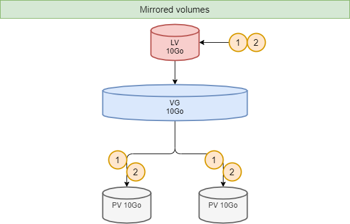
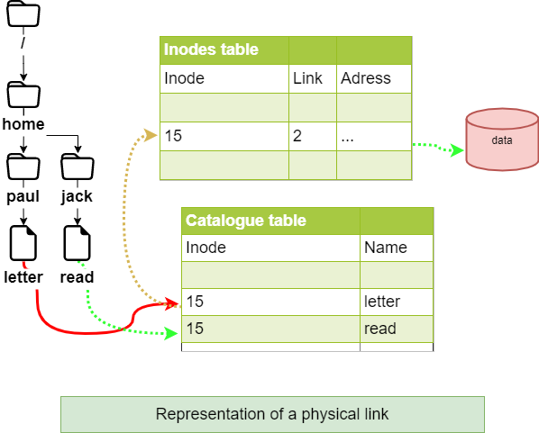
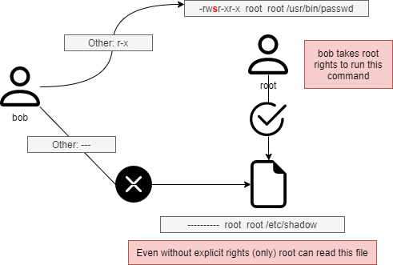

# File System

In this chapter you will learn how to work with filesystems.

****

**Objectives** : In this chapter, future Linux administrators will learn how to:

:heavy_check_mark: manage partitions on disk;   
:heavy_check_mark: use LVM for a better use of disk resources;   
:heavy_check_mark: provide users with a filesystem and manage the access rights.

and also discover:

:heavy_check_mark: how the tree structure is organized in Linux;   
:heavy_check_mark: the different types of files offered and how to work with them;

:checkered_flag: **hardware**, **disk**, **partition**, **lvm**, **linux**

**Knowledge**: :star: :star:   
**Complexity**: :star: :star:   

**Reading time**: 20 minutes

****

## Partitioning

Partitioning will allow the installation of several operating systems because it is impossible to have several of them cohabit on the same logical drive. Partitioning also allows the separation of data logically (security, access optimization, ...).

The division of the physical disk into partitioned volumes is recorded in the partition table, stored in the first sector of the disk (MBR: _Master Boot Record_).

The same physical disk can be divided into a maximum of 4 partitions:

* *Primary* (or main)
* *Extended*

!!! Warning

    There can be only one extended partition per physical disk. In order to benefit from additional drives, the extended partition can be split into logical partitions


The _devices_ are the files identifying the various hardware detected by the motherboard. These files are stored without `/dev`. The service which detects new devices and gives them names is called *udev*.

They are identified by their type.

Storage devices are named *hd* for IDE hard drives and *sd* for other media. Then comes a letter that starts with *a* for the first device, then *b*, *c*, ...

Finally we will find a number that defines the partitioned volume: *1* for the first primary partition, ...

!!! Warning

    Beware, the extended partition, which does not support a file system, still has a number.


There are at least two commands for partitioning a disk: `fdisk` and `cfdisk`. Both commands have an interactive menu. `cfdisk` is more reliable and better optimized, so it is best to use it.

The only reason to use `fdisk` is when you want to list all logical devices with the `-l` option.

```
sudo fdisk -l
sudo fdisk -l /dev/sdc
sudo fdisk -l /dev/sdc2
```

### `parted` command

The `parted` (_partition editor_) command is able to partition a disk.

```
parted [-l] [device]
```

It also has a recovery function capable of rewriting a deleted partition table.

Under graphical interface, there is the very complete `gparted` tool: *G*nome *PAR*tition *ED*itor.

The `gparted -l` command lists all logical devices on a computer.

The `gparted` command alone will return to an interactive mode with its own internal options:

* `help` or an incorrect command will display these options.
* `print all` in this mode will have the same result as `gparted -l` on the command line.
* `quit` to return to the prompt.

### `cfdisk` command

The `cfdisk` command is used to manage partitions.

```
cfdisk device
```

Example:

```
$ sudo cfdisk /dev/sda
                                 Disk: /dev/sda
               Size: 16 GiB, 17179869184 bytes, 33554432 sectors
                       Label: dos, identifier: 0xcf173747
    Device        Boot       Start        End    Sectors   Size   Id Type
>>  /dev/sda1     *           2048    2099199    2097152     1G   83 Linux
    /dev/sda2              2099200   33554431   31455232    15G   8e Linux LVM
 lqqqqqqqqqqqqqqqqqqqqqqqqqqqqqqqqqqqqqqqqqqqqqqqqqqqqqqqqqqqqqqqqqqqqqqqqqqqqk
 x Partition type: Linux (83)                                                 x
 x     Attributes: 80                                                         x
 xFilesystem UUID: 54a1f5a7-b8fa-4747-a87c-2dd635914d60                       x
 x     Filesystem: xfs                                                        x
 x     Mountpoint: /boot (mounted)                                            x
 mqqqqqqqqqqqqqqqqqqqqqqqqqqqqqqqqqqqqqqqqqqqqqqqqqqqqqqqqqqqqqqqqqqqqqqqqqqqqj
     [Bootable]  [ Delete ]  [ Resize ]  [  Quit  ]  [  Type  ]  [  Help  ]
     [  Write ]  [  Dump  ]
```

The preparation, without _LVM_, of the physical media goes through five steps:

* Setting up the physical disk;
* Partitioning of the volumes (geographical division of the disk, possibility of installing several systems, ...);
* Creation of the file systems (allows the operating system to manage the files, the tree structure, the rights, ...);
* Mounting of file systems (registration of the file system in the tree structure);
* Manage user access.

## Logical Volume Manager (LVM)

**L**ogical **V**olume **M**anager (*LVM]*)

Volume management creates an abstract layer on top of physical storage, offering advantages over using physical storage directly:

* More flexible disk capacity;
* Online data movement;
* Disks in _stripe_ mode;
* Mirrored volumes (recopy);
* Volume snapshots (_snapshot_).

The disadvantage is that if one of the physical volumes becomes out of order, then all the logical volumes that use this physical volume are lost. You will have to use LVM on raid disks.

LVM is available under Linux from kernel version 2.4.

!!! Note

    LVM is only managed by the operating system. Therefore the _BIOS_ needs at least one partition without LVM to boot.

### Volume groups

The physical volumes *PV* _Physical Volumes_ (from partitions) are combined into volume groups *VG*.
Each *VG* represents disk space that can be partitioned into *LV* _Logical Volumes_.
*Extension* is the smallest unit of fixed-size space that can be allocated.

* **PE** : _Physical Extension_
* **LE** : _Logical Extension_


### Logical volumes

A volume group, *VG*, is divided into logical volumes, *LV*, offering different operating modes:

* Linear volumes;
* Volumes in _stripe_ mode;
* Mirrored volumes.


!!! Tip

    Striping_ improves performance by writing data to a predetermined number of physical volumes with a _round-robin_ technique.



### LVM commands for volume management

#### `pvcreate` command

The `pvcreate` command is used to create physical volumes. It turns Linux partitions (or disks) into physical volumes.

```
pvcreate [-options] partition
```

Example:

```
[root]# pvcreate /dev/hdb1
pvcreate -- physical volume « /dev/hdb1 » successfully created
```

You can also use a whole disk (which facilitates disk size increases in virtual environments for example).

```
[root]# pvcreate /dev/hdb
pvcreate -- physical volume « /dev/hdb » successfully created
```

| Option | Description                                                                        |
|--------|------------------------------------------------------------------------------------|
| `-f`   | Forces the creation of the volume (disk already transformed into physical volume). |

#### `vgcreate` command

The `vgcreate` command is used to create volume groups. It groups one or more physical volumes into a volume group.

```
vgcreate volume physical_volume [PV...]
```

Example:

```
[root]# vgcreate volume1 /dev/hdb1
…
vgcreate – volume group « volume1 » successfully created and activated
```

#### `lvcreate` command

The `lvcreate` command creates logical volumes. The file system is then created on these logical volumes.

```
lvcreate -L size [-n name] VG_name
```

Example:

```
[root]# lvcreate –L 600M –n VolLog1 volume1
lvcreate -- logical volume « /dev/volume1/VolLog1 » successfully created
```

| Option    | Description                                                         |
|-----------|---------------------------------------------------------------------|
| `-L size` | Logical volume size in K, M or G.                                   |
| `-n name` | LV name. Special file created in `/dev/name_volume` with this name. |

### LVM commands to view volume information

#### `pvdisplay` command

The `pvdisplay` command allows you to view information about the physical volumes.

```
pvdisplay /dev/PV_name
```

Example:

```
[root]# pvdisplay /dev/PV_name
```

#### `vgdisplay` command

The `vgdisplay` command allows you to view information about volume groups.

```
vgdisplay VG_name
```

Example:

```
[root]# vgdisplay volume1
```

#### `lvdisplay` command

The `lvdisplay` command allows you to view information about the logical volumes.

```
lvdisplay /dev/VG_name/LV_name
```

Example:

```
[root]# lvdisplay /dev/volume1/VolLog1
```

### Preparation of the physical media

The preparation with LVM of the physical support is broken down as follows:

* Setting up the physical disk
* Partitioning of the volumes
* **LVM physical volume**
* **LVM volume groups**
* **LVM logical volumes**
* Creating file systems
* Mounting file systems
* Manage user access

## Structure of a file system

A _file system_ **FS** is in charge of the following actions:

* Securing access and modification rights to files;
* Manipulating files: create, read, modify and delete;
* Locating files on the disk;
* Managing partition space.

The Linux operating system is able to use different file systems (ext2, ext3, ext4, FAT16, FAT32, NTFS, HFS, BtrFS, JFS, XFS, ...).

### `mkfs` command

The `mkfs` command allows you to create a Linux file system.

```
mkfs [-t fstype] filesys
```

Example:

```
[root]# mkfs -t ext4 /dev/sda1
```

| Option | Description                               |
|--------|-------------------------------------------|
| `-t`   | Indicates the type of file system to use. |

!!! Warning

    Without a file system it is not possible to use the disk space.

Each file system has a structure which is identical on each partition. A **boot block** and a **super block** initialized by the system and then an **inode table** and a **data area** initialized by the administrator.

!!! Note

    The only exception is the **swap** partition.

### Boot block

The **boot block** occupies the first block on the disk and is present on all partitions. It contains the program that starts and initializes the system and is therefore only filled in for the boot partition.

### Super block

The size of the **super block** table is defined at creation. It is present on each partition and contains the elements necessary for its utilization.

It describes the File System:

* Name of the Logical Volume;
* Name of the File System;
* Type of the File System;
* File System Status;
* Size of the File System;
* Number of free blocks;
* Pointer to the beginning of the list of free blocks;
* Size of the inode list;
* Number and list of free inodes.

A copy is loaded in the central memory as soon as the system is initialized. This copy is updated as soon as it is modified and the system saves it periodically (command `sync`).

When the system stops, it also copies this table in memory to its block.

### Table of inodes

The size of the **inode table** is defined at its creation and is stored on the partition. It consists of records, called inodes, corresponding to the files created. Each record contains the addresses of the data blocks making up the file.

!!! Note

    An inode number is unique within a file system.

A copy is loaded in the central memory as soon as the system is initialized. This copy is updated as soon as it is modified and the system saves it periodically (command `sync`).

When the system stops, it also copies this table in memory to its block.

A file is managed by its inode number.

!!! Note

    The size of the inode table determines the maximum number of files the FS can contain.

Information present in the *inode table* :

* Inode number;
* File type and access permissions;
* Owner identification number;
* Identification number of the owner group;
* Number of links on this file;
* Size of the file in bytes;
* Date the file was last accessed;
* Date the file was last modified;
* Date of the last modification of the inode (= creation);
* Table of several pointers (block table) to the logical blocks containing the pieces of the file.

### Data area

Its size corresponds to the rest of the available space of the partition. This area contains the catalogs corresponding to each directory and the data blocks corresponding to the contents of the files.

**In order to guarantee the consistency of the file system**, an image of the superblock and the inode table is loaded into memory (RAM) when the operating system is loaded so that all I/O operations are done through these system tables. When the user creates or modifies files, this memory image is updated first. The operating system must therefore regularly update the superblock of the logical disk (`sync` command).

These tables are written to the hard disk when the system is shut down.

!!! Danger

    In the event of a sudden stop, the file system may lose its consistency and cause data loss.

### Repairing the file system

It is possible to check the consistency of a file system with the `fsck` command.

In case of errors, solutions are proposed to repair the inconsistencies. After repair, files that remain without entries in the inode table are attached to the `/lost+found` folder of the logical drive.

#### `fsck` command

The `fsck` command is a console-mode integrity check and repair tool for Linux file systems.

```
fsck [-sACVRTNP] [ -t fstype ] filesys
```

Example:

```
[root]# fsck /dev/sda1
```

To check the root partition, it is possible to create a `forcefsck` file and reboot or run `shutdown` with the `-F` option.

```
[root]# touch /forcefsck
[root]# reboot
or
[root]# shutdown –r -F now
```

!!! Warning

    The partition to be checked must be unmounted.

## Organization of a file system

By definition, a File System is a tree structure of directories built from a root directory (a logical device can only contain one file system).


!!! Note

    In Linux everything is a file.

Text document, directory, binary, partition, network resource, screen, keyboard, Unix kernel, user program, ...

Linux meets the **FHS** (_Filesystems Hierarchy Standard_) (see `man hier`) which defines the names of folders and their roles.

| Directory  | Observation                                                   | Abbreviation of               |
|------------|---------------------------------------------------------------|-------------------------------|
| `/`        | Contains special directories                                  |                               |
| `/boot`    | Files related to system startup                               |                               |
| `/sbin`    | Commands necessary for system startup and repair              | _system binaries_             |
| `/bin`     | Executables of basic system commands                          | _binaries_                    |
| `/usr/bin` | System administration commands                                |                               |
| `/lib`     | Shared libraries and kernel modules                           | _libraries_                   |
| `/usr`     | Everything that is not necessary for minimal system operation | _UNIX System Resources_       |
| `/mnt`     | For mounting temporary SF                                     | _mount_                       |
| `/media`   | For mounting removable media                                  |                               |
| `/root`    | Administrator's login directory                               |                               |
| `/home`    | User data                                                     |                               |
| `/tmp`     | Temporary files                                               | _temporary_                   |
| `/dev`     | Special device files                                          | _device_                      |
| `/etc`     | Configuration and script files                                | _editable text configuration_ |
| `/opt`     | Specific to installed applications                            | _optional_                    |
| `/proc`    | Virtual file system representing different processes          | _processes_                   |
| `/var`     | Miscellaneous variable files                                  | _variables_                   |

* To perform a mount or unmount, at the tree level, you must not be under its mount point.
* Mounting on a non-empty directory does not delete the content. It is only hidden.
* Only the administrator can perform mounts.
* Mount points to be automatically mounted at boot time must be entered in `/etc/fstab`.

### `/etc/fstab` file

The `/etc/fstab` file is read at system startup and contains the mounts to be performed. Each file system to be mounted is described on a single line, the fields being separated by spaces or tabs.

!!! Note

    Lines are read sequentially (`fsck`, `mount`, `umount`).

```
/dev/mapper/VolGroup-lv_root   /         ext4    defaults        1   1
UUID=46….92                    /boot     ext4    defaults        1   2
/dev/mapper/VolGroup-lv_swap   swap      swap    defaults        0   0
tmpfs                          /dev/shm  tmpfs   defaults        0   0
devpts                         /dev/pts  devpts  gid=5,mode=620  0   0
sysfs                          /sys      sysfs   defaults        0   0
proc                           /proc     proc    defaults        0   0
  1                              2         3        4            5   6
```

| Column | Description                                                                                       |
|--------|---------------------------------------------------------------------------------------------------|
| 1      | File system device (`/dev/sda1`, UUID=..., ...)                                                   |
| 2      | Mount point name, **absolute path** (except **swap**)                                             |
| 3      | Filesystem type (ext4, swap, ...)                                                                 |
| 4      | Special options for mounting (`defaults`, `ro`, ...)                                              |
| 5      | Enable or disable backup management (0:not backed up, 1:backed up)                                |
| 6      | Check order when checking the SF with the `fsck` command (0:no check, 1:priority, 2:not priority) |

The `mount -a` command allows new mounts to be taken into account without rebooting.
They are then written to the `/etc/mtab` file which contains the current mounts.

!!! Warning

    Only the mount points listed in `/etc/fstab` will be mounted on reboot.

It is possible to make a copy of the `/etc/mtab` file or to copy its contents to `/etc/fstab`.

### Mount management commands

#### `mount` command

The `mount` command allows you to mount and view the logical drives in the tree.

```
mount [-option] [device] [directory]
```

Example:

```
[root]# mount /dev/sda7 /home
```

| Option | Description                                                                    |
|--------|--------------------------------------------------------------------------------|
| `-n`   | Mount without writing to `/etc/mtab`.                                          |
| `-t`   | To indicate the type of file system to use.                                    |
| `-a`   | Mounts all filesystems mentioned in `/etc/fstab`.                              |
| `-r`   | Mounts the file system read-only (equivalent to `-o ro`).                      |
| `-w`   | Mounts the file system read/write, by default (equivalent `-o rw`).            |
| `-o`   | Argument followed by a comma-separated list of options (`remount`, `ro`, ...). |

!!! Note

    The `mount` command alone displays all mounted file systems.

#### `umount` command

The `umount` command is used to unmount logical drives.

```
umount [-option] [device] [directory]
```

Example:

```
[root]# umount /home
[root]# umount /dev/sda7
```

| Option | Description                                        |
|--------|----------------------------------------------------|
| `-n`   | Unmount without writing to `/etc/mtab`.            |
| `-r`   | If unmount fails, remount as read-only.            |
| `-f`   | Force unmount.                                     |
| `-a`   | Unmount all filesystems mentioned in `/etc/fstab`. |

!!! Note

    When disassembling, you must not stay below the mounting point. Otherwise, the following error message is displayed: `device is busy`.

## Types of files

As in any system, in order to be able to find one's way through the tree structure and the file management, it is important to respect the file naming rules.

* Files are coded on 255 characters;
* All ASCII characters can be used;
* Uppercase and lowercase letters are differentiated;
* No notion of extension.

Groups of words separated by spaces must be enclosed in quotation marks:

```
[root]# mkdir "working dir"
```

!!! Note

    While there is nothing technically wrong with creating a file or directory with a space in it, it is generally a "best practice" to avoid this and replace any space with an underscore.

!!! Note

    The **.** at the beginning of the file name only serves to hide it from a simple `ls`.

!!! Warning

    Under Linux, the extension of a file is not a necessary reference to open or modify it. However, it can be useful for the user.

Examples of extension agreements:

* `.c` : source file in C language;
* `.h` : C and Fortran header file;
* `.o` : object file in C language;
* `.tar` : data file archived with the `tar` utility;
* `.cpio` : data file archived with the `cpio` utility;
* `.gz` : data file compressed with the `gzip` utility;
* `.tgz` : data file archived with the `tar` utility and compressed with the `gzip` utility;
* `.html` : web page.

### Details of a file name

```
[root]# ls -liah /usr/bin/passwd
266037 -rwsr-xr-x 1 root root 59K mars  22  2019 /usr/bin/passwd
1      2    3     4  5    6    7       8               9
```

| Row |	Description                                                |
|-----|------------------------------------------------------------|
| `1` | Inode number                                               |
| `2` | File type (1st character of the block of 10)               |
| `3` | Access rights (last 9 characters of the block of 10)       |
| `4` | Number of links (ordinary) or subdirectories (directories) |
| `5` | Name of the owner                                          |
| `6` | Name of the group                                          |
| `7` | Size (byte, kilo, mega)                                    |
| `8` | Date of last update                                        |
| `9` | Name of the file                                           |

### Different types of files

The following types of files can be found on a system:

* Ordinary (text, binary, ...);
* Directories;
* Special (printers, screens, ...);
* Links;
* Communications (tubes and socket).

#### Ordinary files

These are text, program (source), executable (after compilation) or data (binary, ASCII) and multimedia files.

```
[root]# ls -l myfile
-rwxr-xr-x   1   root  root  26  nov  31  15:21 myfile
```

The dash `-` at the beginning of the rights group (10-character block) indicates that it is an ordinary file type.

#### Directory files

Directory files contain references to other files.

By default in each directory are present **.**  and **..**.

* The **.** represents the position in the tree.
* The **..** represents the father of the current position.

```
[root]# ls -l mydirectory
drwxr-xr-x   1   root  root  26  nov  31  15:21 mydirectory
```

The letter `d` at the beginning of the rights group indicates that it is a directory type file.

#### Special files

In order to communicate with peripherals (hard disks, printers, ...), Linux uses interface files called special files (_device file_ or _special file_). They allow identification by the peripherals.

These files are special because they do not contain data but specify the access mode to communicate with the device.

They are defined in two modes:

* **block** mode;
* **character** mode.

##### Block mode

The special **block mode** file allows, using the system buffers, to transfer data to the device.

```
[root]# ls -l /dev/sda
brw-------   1   root  root  8, 0 jan 1 1970 /dev/sda
```

The letter `b` at the beginning of the rights group indicates that it is a special file **block**.

##### Character mode

The special *character mode* file is used to transfer data to the device as a stream of one character at a time without using a buffer. These are devices like printer, screen or DAT tapes, ...

The standard output is the screen.

```
[root]# ls -l /dev/tty0
crw-------   1   root  root  8, 0 jan 1 1970 /dev/tty0
```

The letter `c` at the beginning of the rights group indicates that it is a special character file.

#### Communication files

These are the pipe (_pipes_) and the _socket_ files.

* **Pipe files** pass information between processes by FIFO (_First In, First Out_).
One process writes transient information to a _pipe_ file and another reads it. After reading, the information is no longer accessible.

* **Socket files** allow bidirectional inter-process communication (on local or remote systems). They use an _inode_ of the file system.

#### Link files

These files give the possibility to give several logical names to the same physical file. A new access point to the file is therefore created.

There are two types of link files:

* Physical links;
* Symbolic links.

##### Physical link

The link file and the source file have the same _inode_ number and the link counter is incremented. It is not possible to link different directories or files from different file systems.

!!! Warning

    If the source file is destroyed, the counter is decremented and the link file still accesses the file.

###### Command `ln` for a physical link

The `ln` command allows you to create physical links.

```
[root]# ls –li letter
666 –rwxr--r-- 1 root root … letter
```

```
[root]# ln /home/paul/letter /home/jack/read
```

```
[root]# ls –li /home/*/*
666 –rwxr--r-- 2 root root … letter
666 –rwxr--r-- 2 root root … read
```



##### Symbolic link

Unlike the physical link, the symbolic link involves the creation of a new _inode_. At the symbolic link level, only a path is stored in the inode table.

The file created contains only an indication of the path to the file. This notion no longer has the limitations of physical links and it is now possible to link directories and files belonging to different file systems.

!!! Warning

    If the source file is destroyed, the link file can no longer access the file.

###### `ln` command for a symbolic link

The command `ln` with the argument `-s` allows to create symbolic links.

```
[root]# ls –li letter
666 -rwxr--r-- 1 root root … letter
```

```
[root]# ln -s /home/paul/letter /tmp/read
```

```
[root]# ls –li /home/paul/letter /tmp/read
666 -rwxr--r--- 1 root root … letter
678 lrwxrwxrwx 1 root root … read -> letter
```


## File attributes

Linux is a multi-user operating system where the control of access to files is essential.

These controls are functions of:

* file access permissions ;
* users (_ugo_ _Users Groups Others_).

The command `ls -l` allows to display the attributes.

There are 4 file access rights:

* **r**ead;
* **w**rite;
* e**x**ecution;
* **-** no right.

!!! Warning

    The rights associated with files differ from those associated with directories (see below).

The user types associated with file access rights are:

* **u**ser_ (owner) ;
* **g**roup_ (owner group);
* **o**thers (others users);

In some commands it is possible to designate everyone with **a** (_all_).

**a = ugo**

### Rights associated with ordinary files

* **r**ead: Allows reading a file (`cat`, `less`, ...) and copying a file (`cp`, ...).
* **w**rite: Allows modification of the file content (`cat`, `>>`, `vim`, ...).
* e**x**ecute: Considers the file as an e**X**ecutable (binary or script).
* **-**: No permissions.

!!! Note

    Moving or renaming a file depends on the rights of the target directory. Deleting a file depends on the rights of the parent directory.

### Rights associated with directories

* **r**ead: Allows reading the contents of a directory (`ls -R`).
* **w**rite: Allows modification of the contents of a directory (`touch`) and allows creation and deletion of files if the **x** permission is enabled.
* e**x**ecute: Allows descending in the directory (`cd`).
* **-**: No rights.

### Attribute management

The display of rights is done with the command `ls -l`. It is the last 9 characters of the block of 10. More precisely 3 times 3 characters.

```
[root]# ls -l /tmp/myfile
-rwxrw-r-x  1  root  sys  ... /tmp/myfile
  1  2  3       4     5
```

| Row |	Description                                                   |
|-----|---------------------------------------------------------------|
| 1   | Owner (**u**ser) permissions, here `rwx`                      |
| 2   | Owner group permissions (**g**roup), here `rw-`               |
| 3   | Other users' permissions (**o**thers), here `r-x`             |
| 4   | File owner                                                    |
| 5   | Group owner of the file                                       |

!!! Note

    Permissions apply to **u**ser, **g**roup and **o**ther (**ugo**) depending on the owner and group.

By default, the _owner_ of a file is the one who creates it. The _group_ of the file is the group of the owner who created the file. The _others_ are those which are not concerned by the previous cases.

The attributes are changed with the `chmod` command.

Only the administrator and the owner of a file can change the rights of a file.

#### `chmod` command

The `chmod` command allows you to change the access permissions to a file.

```
chmod [option] mode file
```

The mode indication can be an octal representation (e.g. `744`) or a symbolic representation ([`ugoa`][`+=-`][`rwxst`]).

Several symbolic operations can be separated by commas

Example:

```
[root]# chmod -R u+rwx,g+wx,o-r /tmp/file1
[root]# chmod g=x,o-r /tmp/file2
[root]# chmod -R o=r /tmp/file3
```

```
[root]# ls -l /tmp/fic*
-rwxrwx--- 1 root root … /tmp/file1
-rwx--x--- 1 root root … /tmp/file2
-rwx--xr-- 1 root root … /tmp/file3
```

```
[root]# chmod 741 /tmp/file1
[root]# chmod -R 744 /tmp/file2
[root]# ls -l /tmp/fic*
-rwxr----x 1 root root … /tmp/file1
-rwxr--r-- 1 root root … /tmp/file2
```

| Option |	Observation                                                           |
|--------|------------------------------------------------------------------------|
| `-R`   |  Recursively modify the permissions of directories and their contents. |

There are two methods for making rights changes:

* The **octal** method;
* The **symbolic** method.

!!! Warning

    The rights of files and directories are not dissociated. For some operations, it will be necessary to know the rights of the directory containing the file. A write-protected file can be deleted by another user as long as the rights of the directory containing it allow this user to perform this operation.

#### Principle of the octal method

Each right has a value.


```
[root]# ls -l /tmp/myfile
-rwxrwxrwx  1  root  root  ... /tmp/myfile
```


```
[root]# chmod 741 /tmp/myfile
-rwxr----x  1  root  root  ... /tmp/myfile
```


#### Principle of the symbolic method

This method can be considered as a "literal" association between a user type, an operator, and rights.


```
[root]# chmod u+rwx,g+wx,o-r /tmp/myfile
[root]# chmod g=x,o-r /tmp/myfile
[root]# chmod o=r /tmp/myfile
```

```
[root]# ls -l /tmp/myfile
r--r-- 1 root root … /tmp/myfile
```

```
[root]# chmod u+rwx,g+wx,o-r /tmp/myfile
```

```
[root]# ls -l /tmp/myfile
-rwxrwx--- 1 root root … /tmp/myfile
```

### Special rights

In addition to the fundamental rights (`rwx`), there are the particular rights:

* **set-user-ID** (_SUID]_)
* **set-group-ID** (_SGID]_)
* **sticky-bit**

As with the fundamental rights, the particular rights each have a value. This value is placed before the `ugo` set of rights.


!!! Danger

    `S`, `S` and `T` in capital letters **if the right does not exist**.

#### The sticky-bit

One of the peculiarities of rights in Linux is that the right to write to a directory also allows deletion of *all* files, owner or not.

The _sticky-bit_ set on the directory will only allow users to delete files they own. This is the basic case for the `/tmp` directory.

The setting of the _sticky-bit_ can be done as follows:

Octal method:
```
[root]# chmod 1777 directory
```

Symbolic method:
```
[root]# chmod o+t directory
```

Verification:
```
[root]# ls -l
drwxrwxrwt … directory
```

#### SUID and SGID on a command

These rights allow execution of a command according to the rights set on the command, and not according to the user's rights.

The command is executed with the identity of the owner (_SUID_) or the group (_SGID_) of the command.

!!! Note

    The identity of the user requesting the execution of the order is no longer taken into account.

    This is an additional possibility of access rights assigned to a user when it is necessary for them to have the same rights as the owner of a file or those of the group concerned.

Indeed, a user may have to run a program (usually a system utility) but not have the necessary access rights. By setting the appropriate rights (**s** at the owner level and/or at the group level), the user of the program has, for the time of its execution, the identity of the owner (or that of the group) of the program.

Example:

The file `/usr/bin/passwd` is an executable file (a command) with a _SUID_.

When the user _bob_ runs it, he will have to access the `/etc/shadow` file, but the permissions on this file do not allow _bob_ to access it.

Having a _SUID_ this command, `/usr/bin/passwd`, will be executed with the _UID_ of root and the _GID_ of _root_. The latter being the owner of the `/etc/shadow` file, he will have read rights.



The setting of _SUID_ and _SGID_ can be done as below with the command `chmod`:

Octal method:
```
[root]# chmod 4777 command1
[root]# chmod 2777 command2
```

Symbolic method:
```
[root]# chmod u+s command1
[root]# chmod g+s command2
```

Verification:
```
[root]# ls -l
-rwsrwxrwx … command1
-rwxrwsrwx … command2
```

!!! Warning

    It is not possible to pass the _SUID_ or _SGID_ to a shell script.
    The system does not allow it because it is too dangerous for security!

#### SGID on a file

In a directory with the _SGID_ right, any file created will inherit the group that owns the directory instead of that of the creating user.

Example:
```
[rockstar] $ ls -ld /data/
drwxrwsr-x 2 root users 4096 26 oct. 19:43 /data
```

```
[rockstar] $ touch /data/test_sgid /tmp/fic_reference
```

```
[rockstar] $ ls -ld /data/test_sgid /tmp/fic_reference
-rw-r--r--. 1 rockstar users 0 26 oct. 19:43 /data/test_sgid <1>
-rw-r--r--. 1 rockstar rockstar 0 26 oct. 19:43  /tmp/fic_ref
```

<1> The `test_sgid` file inherits the group owner of its `/data` folder (in this case `users`) whatever the main group of the `rockstar` user is.

## Default rights and mask

When a file or directory is created, it already has permissions.

* For a directory: `rwxr-xr-x` or _755_.
* For a file: `rw-r-r-` or _644_.

This behavior is defined by the **default mask**.

The principle is to remove the value defined by the mask at maximum rights without the execution right.

For a directory :


For a file, the execution rights are removed:


### `umask` command

The `umask` command allows you to display and modify the mask.

```
umask [option] [mode]
```

Example:
```
$ umask 033
$ umask
0033
$ umask -S
u=rwx,g=r,o=r
$ touch umask_033
$ ls -la  umask_033
-rw-r--r-- 1 rockstar rockstar 0 nov.   4 16:44 umask_033
$ umask 025
$ umask -S
u=rwx,g=rx,o=w
$ touch umask_025
$ ls -la  umask_025
-rw-r---w- 1 rockstar rockstar 0 nov.   4 16:44 umask_025
```

| Option |	Description                     |
|--------|----------------------------------|
| `-S`   | Symbolic display of file rights. |

!!! Warning

    `umask` does not affect existing files.

!!! Note

    `umask` modifies the mask until the disconnection.

To keep the value, you have to modify the following profile files:
For all users:

* `/etc/profile`
* `/etc/bashrc`

For a particular user:

* `~/.bashrc`

!!! Warning

    `umask -S` displays the file rights (without the execute right) of the files that will be created. So it is not the display of the mask used to subtract the maximum value.

!!! Tip

    The `umask` command being a _bash_ command, (a `type umask` returns `umask is a shell primitive`) you have to search `umask` in `man bash`.
