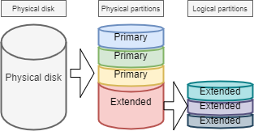
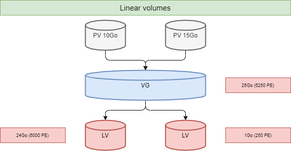
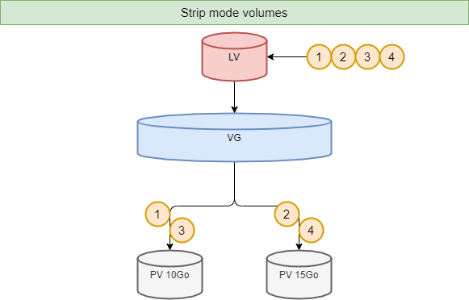
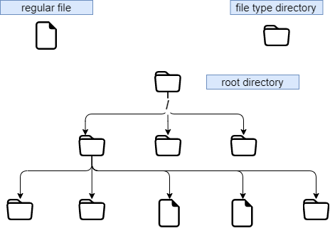
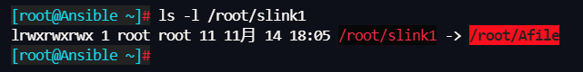
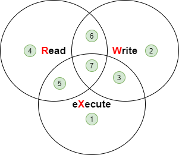
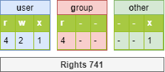

# File System

In this chapter you will learn how to work with files systems.

****

**Objectives** : In this chapter, future Linux administrators will learn how to:

:heavy_check_mark: manage partitions on disk;   
:heavy_check_mark: use LVM for a better use of disk resources;   
:heavy_check_mark: provide users with a filesystem and manage the access rights.

and also discover:

:heavy_check_mark: how the tree structure is organized in Linux;   
:heavy_check_mark: the different types of files offered and how to work with them;

:checkered_flag: **hardware**, **disk**, **partition**, **lvm**, **linux**

**Knowledge**: :star: :star:   
**Complexity**: :star: :star:   

**Reading time**: 20 minutes

****

## Partitioning

Partitioning will allow the installation of several operating systems because it is impossible to have several of them cohabit on the same logical drive. Partitioning also allows the separation of data logically (security, access optimization, ...).

The division of the physical disk into partitioned volumes is recorded in the partition table, stored in the first sector of the disk (MBR: _Master Boot Record_).

For **MBR** partition table types, the same physical disk can be divided into a maximum of 4 partitions:

* *Primary partition* (or main partition)
* *Extended partition*

!!! Warning

    There can be only one extended partition per physical disk, that is, a physical disk can have in the MBR partition table up to:
    
    1. Three primary partitions plus one extended partition
    2. Four primary partitions 

    The extended partition cannot write data and format, and can only contain logical partitions. The largest physical disk that can be recognized by the MBR partition table is **2TB**.




### Naming conventions for device file names

In the world of GNU/Linux, everything is a file. For disks, they are recognized in the system as:

| Hardware               | Device file name       | 
|---                     |---                     |
|IDE hard disk           | /dev/hd[a-d]           | 
|SCSI/SATA/USB hard disk | /dev/sd[a-z]           |
|Optical drive           | /dev/cdrom or /dev/sr0 |
|Floppy disk             | /dev/fd[0-7]           |
|Printer (25 pins)       | /dev/lp[0-2...]        |
|Printer (USB)           | /dev/usb/lp[0-15]      |
|Mouse                   | /dev/mouse             |  
|Virtual hard disk       | /dev/vd[a-z]           |

The Linux kernel contains drivers for most hardware devices.

What we call _devices_ are the files, stored without `/dev`, identifying the different hardware detected by the motherboard.

The service called udev is responsible for applying the naming conventions (rules) and applying them to the devices it detects.

For more information, please see [here](https://www.kernel.org/doc/html/latest/admin-guide/devices.html).

### Device partition number 

The number after the block device (storage device) indicates a partition. For MBR partition tables, the number 5 must be the first logical partition.

!!! Warning

    Attention please! The partition number we mentioned here mainly refers to the partition number of the block device (storage device).


There are at least two commands for partitioning a disk: `fdisk` and `cfdisk`. Both commands have an interactive menu. `cfdisk` is more reliable and better optimized, so it is best to use it.

The only reason to use `fdisk` is when you want to list all logical devices with the `-l` option. `fdisk` uses MBR partition tables, so it is not supported for **GPT** partition tables and cannot be processed for disks larger than **2TB**.

```
sudo fdisk -l
sudo fdisk -l /dev/sdc
sudo fdisk -l /dev/sdc2
```

### `parted` command

The `parted` (_partition editor_) command is able to partition a disk without the drawbacks of `fdisk`.

The `parted` command can be used either on the command-line or interactively. It also has a recovery function capable of rewriting a deleted partition table.

```
parted [-l] [device]
```

Under graphical interface, there is the very complete `gparted` tool: *G*nome *PAR*tition *ED*itor.

The `gparted -l` command lists all logical devices on a computer.

The `gparted` command, when run without any arguments, will show an interactive mode with its internal options:

* `help` or an incorrect command will display these options.
* `print all` in this mode will have the same result as `gparted -l` on the command line.
* `quit` to return to the prompt.

### `cfdisk` command

The `cfdisk` command is used to manage partitions.

```
cfdisk device
```

Example:

```
$ sudo cfdisk /dev/sda
                                 Disk: /dev/sda
               Size: 16 GiB, 17179869184 bytes, 33554432 sectors
                       Label: dos, identifier: 0xcf173747
    Device        Boot       Start        End    Sectors   Size   Id Type
>>  /dev/sda1     *           2048    2099199    2097152     1G   83 Linux
    /dev/sda2              2099200   33554431   31455232    15G   8e Linux LVM
 lqqqqqqqqqqqqqqqqqqqqqqqqqqqqqqqqqqqqqqqqqqqqqqqqqqqqqqqqqqqqqqqqqqqqqqqqqqqqk
 x Partition type: Linux (83)                                                 x
 x     Attributes: 80                                                         x
 xFilesystem UUID: 54a1f5a7-b8fa-4747-a87c-2dd635914d60                       x
 x     Filesystem: xfs                                                        x
 x     Mountpoint: /boot (mounted)                                            x
 mqqqqqqqqqqqqqqqqqqqqqqqqqqqqqqqqqqqqqqqqqqqqqqqqqqqqqqqqqqqqqqqqqqqqqqqqqqqqj
     [Bootable]  [ Delete ]  [ Resize ]  [  Quit  ]  [  Type  ]  [  Help  ]
     [  Write ]  [  Dump  ]
```

The preparation, without _LVM_, of the physical media goes through five steps:

* Setting up the physical disk;
* Partitioning of the volumes (geographical division of the disk, possibility of installing several systems, ...);
* Creation of the file systems (allows the operating system to manage the files, the tree structure, the rights, ...);
* Mounting of file systems (registration of the file system in the tree structure);
* Manage user access.

## Logical Volume Manager (LVM)

**L**ogical **V**olume **M**anager (*LVM*)

The partition created by the **standard partition** cannot dynamically adjust the resources of the hard disk, once the partition is mounted, the capacity is completely fixed, this constraint is unacceptable on the server. Although the standard partition can be forcibly expanded or shrunk through certain technical means, it is easy to cause data loss. LVM can solve this problem very well. LVM is available under Linux from kernel version 2.4, and its main features are:

* More flexible disk capacity;
* Online data movement;
* Disks in _stripe_ mode;
* Mirrored volumes (recopy);
* Volume snapshots (_snapshot_).

The principle of LVM is very simple: 

* a logical abstraction layer is added between the physical disk (or disk partition) and the file system
* merge multiple disks (or disk partition) into Volume Group(**VG**) 
* perform underlying disk management operations on them through something called Logical Volume(**LV**).

**The physical media**: The storage medium of the LVM can be the entire hard disk, disk partition, or RAID array. The device must be converted, or initialized, to an LVM Physical Volume(**PV**), before further operations can be performed.

**PV(Physical Volume)**: The basic storage logic block of LVM. To create a physical volume, you can use a disk partition or the disk itself.

**VG(Volume Group)**: Similar to physical disks in a standard partition, a VG consists of one or more PV.

**LV(Logical Volume)**: Similar to hard disk partitions in standard partitions, LV is built on top of VG. You can set up a file system on LV.

<b><font color="blue">PE</font></b>: The smallest unit of storage that can be allocated in a Physical Volume, default to <b>4MB</b>. You can specify an additional size.

<b><font color="blue">LE</font></b>: The smallest unit of storage that can be allocated in a Logical Volume. In the same VG, PE and LE are the same and correspond one to one.


The disadvantage is that if one of the physical volumes becomes out of order, then all the logical volumes that use this physical volume are lost. You will have to use LVM on raid disks.

!!! note

    LVM is only managed by the operating system. Therefore the _BIOS_ needs at least one partition without LVM to boot.

!!! info

    In the physical disk, the smallest storage unit is the **sector**; in the file system, the smallest storage unit of GNU/Linux is the **block**, which is called **cluster** in Windows operating system.; in RAID, the smallest storage unit is **chunk**.

### The Writing Mechanism of LVM

There are several storage mechanisms when storing data to **LV**, two of which are:

* Linear volumes;
* Volumes in _stripe_ mode;
* Mirrored volumes.





### LVM commands for volume management

The main relevant commands are as follows:

| Item                | PV       | VG       | LV        |
|:---:                |:---:     |:---:     |:---:      |
| scan                | pcscan   |vgscan    | lvscan    |
| create              | pvcreate | vgcreate | lvcreate  |
| display             | pvdisplay| vgdisplay| lvdisplay |
| remove              | pvremove | vgremove | lvremove  |
| extend              |          | vgextend | lvextend  |
| reduce              |          | vgreduce | lvreduce  |
| summary information | pvs      | vgs      | lvs       |

#### `pvcreate` command

The `pvcreate` command is used to create physical volumes. It turns Linux partitions (or disks) into physical volumes.

```
pvcreate [-options] partition
```

Example:

```
[root]# pvcreate /dev/hdb1
pvcreate -- physical volume « /dev/hdb1 » successfully created
```

You can also use a whole disk (which facilitates disk size increases in virtual environments for example).

```
[root]# pvcreate /dev/hdb
pvcreate -- physical volume « /dev/hdb » successfully created

# It can also be written in other ways, such as
[root]# pvcreate /dev/sd{b,c,d}1
[root]# pvcreate /dev/sd[b-d]1
```

| Option | Description                                                                        |
|--------|------------------------------------------------------------------------------------|
| `-f`   | Forces the creation of the volume (disk already transformed into physical volume). Use with extreme caution.|

#### `vgcreate` command

The `vgcreate` command is used to create volume groups. It groups one or more physical volumes into a volume group.

```
vgcreate  <VG_name>  <PV_name...>  [option] 
```

Example:

```
[root]# vgcreate volume1 /dev/hdb1
…
vgcreate – volume group « volume1 » successfully created and activated

[root]# vgcreate vg01 /dev/sd{b,c,d}1
[root]# vgcreate vg02 /dev/sd[b-d]1
```

#### `lvcreate` command

The `lvcreate` command creates logical volumes. The file system is then created on these logical volumes.

```
lvcreate -L size [-n name] VG_name
```

Example:

```
[root]# lvcreate –L 600M –n VolLog1 volume1
lvcreate -- logical volume « /dev/volume1/VolLog1 » successfully created
```

| Option    | Description                                                         |
|-----------|---------------------------------------------------------------------|
| `-L size` | Sets the logical volume size in K, M or G.                                   |
| `-n name` | Sets the LV name. Special file created in `/dev/name_volume` with this name. |
| `-l  number`  | Sets the percentage of the capacity of the hard disk to use. You can also use the number of PE. One PE equals 4MB.  |

!!! info

    After you create a logical volume with the `lvcreate` command, the naming rule of the operating system is - `/dev/VG_name/LV_name`, this file type is a soft link (otherwise known as a symbolic link). The link file points to files like `/dev/dm-0` and `/dev/dm-1`.

### LVM commands to view volume information

#### `pvdisplay` command

The `pvdisplay` command allows you to view information about the physical volumes.

```
pvdisplay /dev/PV_name
```

Example:

```
[root]# pvdisplay /dev/PV_name
```

#### `vgdisplay` command

The `vgdisplay` command allows you to view information about volume groups.

```
vgdisplay VG_name
```

Example:

```
[root]# vgdisplay volume1
```

#### `lvdisplay` command

The `lvdisplay` command allows you to view information about the logical volumes.

```
lvdisplay /dev/VG_name/LV_name
```

Example:

```
[root]# lvdisplay /dev/volume1/VolLog1
```

### Preparation of the physical media

The preparation with LVM of the physical support is broken down into the following:

* Setting up the physical disk
* Partitioning of the volumes
* **LVM physical volume**
* **LVM volume groups**
* **LVM logical volumes**
* Creating file systems
* Mounting file systems
* Manage user access

## Structure of a file system

A _file system_ **FS** is in charge of the following actions:

* Securing access and modification rights to files;
* Manipulating files: create, read, modify and delete;
* Locating files on the disk;
* Managing partition space.

The Linux operating system is able to use different file systems (ext2, ext3, ext4, FAT16, FAT32, NTFS, HFS, BtrFS, JFS, XFS, ...).

### `mkfs` command

The `mkfs`(make file system) command allows you to create a Linux file system. 

```
mkfs [-t fstype] filesys
```

Example:

```
[root]# mkfs -t ext4 /dev/sda1
```

| Option | Description                               |
|--------|-------------------------------------------|
| `-t`   | Indicates the type of file system to use. |

!!! Warning

    Without a file system it is not possible to use the disk space.

Each file system has a structure which is identical on each partition. A **Boot Sector** and a **Super block** initialized by the system and then an **Inode table** and a **Data block** initialized by the administrator.

!!! Note

    The only exception is the **swap** partition.

### Boot sector

Boot sector is the first sector of bootable storage media, that is, 0 cylinder, 0 track, 1 sector(1 sector equals 512 bytes). It consists of three parts:

1. MBR(master boot record): 446 bytes.
2. DPT(disk partition table): 64 bytes.
3. BRID(boot record ID): 2 bytes.

|   Item      |   Description |
|   ---       |   ---         |
|   MBR       | Stores the "boot loader"(or "GRUB"); load the kernel, pass parameters; provide a menu interface at boot time; transfer to another loader, such as when multiple operating systems are installed. |
|   DPT       | Records the partition status of the entire disk.              |
|   BRID      | Determines whether the device is usable to boot.               |

### Super block

The size of the **Super block** table is defined at creation. It is present on each partition and contains the elements necessary for its utilization.

It describes the File System:

* Name of the Logical Volume;
* Name of the File System;
* Type of the File System;
* File System Status;
* Size of the File System;
* Number of free blocks;
* Pointer to the beginning of the list of free blocks;
* Size of the inode list;
* Number and list of free inodes.

A copy is loaded in the central memory as soon as the system is initialized. This copy is updated as soon as it is modified and the system saves it periodically (command `sync`).

When the system stops, it also copies this table in memory to its block.

### Table of inodes

The size of the **inode table** is defined at its creation and is stored on the partition. It consists of records, called inodes, corresponding to the files created. Each record contains the addresses of the data blocks making up the file.

!!! Note

    An inode number is unique within a file system.

A copy is loaded in the central memory as soon as the system is initialized. This copy is updated as soon as it is modified and the system saves it periodically (command `sync`).

When the system stops, it also copies this table in memory to its block.

A file is managed by its inode number.

!!! Note

    The size of the inode table determines the maximum number of files the FS can contain.

Information present in the *inode table* :

* Inode number;
* File type and access permissions;
* Owner identification number;
* Identification number of the owner group;
* Number of links on this file;
* Size of the file in bytes;
* Date the file was last accessed;
* Date the file was last modified;
* Date of the last modification of the inode (= creation);
* Table of several pointers (block table) to the logical blocks containing the pieces of the file.

### Data block

Its size corresponds to the rest of the available space of the partition. This area contains the catalogs corresponding to each directory and the data blocks corresponding to the contents of the files.

**In order to guarantee the consistency of the file system**, an image of the superblock and the inode table is loaded into memory (RAM) when the operating system is loaded so that all I/O operations are done through these system tables. When the user creates or modifies files, this memory image is updated first. The operating system must therefore regularly update the superblock of the logical disk (`sync` command).

These tables are written to the hard disk when the system is shut down.

!!! danger "Attention" 

    In the event of a sudden stop, the file system may lose its consistency and cause data loss.

### Repairing the file system

It is possible to check the consistency of a file system with the `fsck` command.

In case of errors, solutions are proposed to repair the inconsistencies. After repair, files that remain without entries in the inode table are attached to the `/lost+found` folder of the logical drive.

#### `fsck` command

The `fsck` command is a console-mode integrity check and repair tool for Linux file systems.

```
fsck [-sACVRTNP] [ -t fstype ] filesys
```

Example:

```
[root]# fsck /dev/sda1
```

To check the root partition, it is possible to create a `forcefsck` file and reboot or run `shutdown` with the `-F` option.

```
[root]# touch /forcefsck
[root]# reboot
or
[root]# shutdown –r -F now
```

!!! Warning

    The partition to be checked must be unmounted.

## Organization of a file system

By definition, a File System is a tree structure of directories built from a root directory (a logical device can only contain one file system).



!!! Note

    In Linux everything is a file.

Text document, directory, binary, partition, network resource, screen, keyboard, Unix kernel, user program, ...

Linux meets the **FHS** (_Filesystems Hierarchy Standard_) (see `man hier`) which defines the names of folders and their roles.

| Directory  | Functionality                                                 | Abbreviation of               |
|------------|---------------------------------------------------------------|-------------------------------|
| `/`        | Contains special directories                                  |                               |
| `/boot`    | Files related to system startup                               |                               |
| `/sbin`    | Commands necessary for system startup and repair              | _system binaries_             |
| `/bin`     | Executables of basic system commands                          | _binaries_                    |
| `/usr/bin` | System administration commands                                |                               |
| `/lib`     | Shared libraries and kernel modules                           | _libraries_                   |
| `/usr`     | Everything that is not necessary for minimal system operation | _UNIX System Resources_       |
| `/mnt`     | For mounting temporary SF                                     | _mount_                       |
| `/media`   | For mounting removable media                                  |                               |
| `/misc`    | For mounting the shared directory of the NFS service.                |                               |
| `/root`    | Administrator's login directory                               |                               |
| `/home`    | User data                                                     |                               |
| `/tmp`     | Temporary files                                               | _temporary_                   |
| `/dev`     | Special device files                                          | _device_                      |
| `/etc`     | Configuration and script files                                | _editable text configuration_ |
| `/opt`     | Specific to installed applications                            | _optional_                    |
| `/proc`    | Virtual file system representing different processes          | _processes_                   |
| `/var`     | Miscellaneous variable files                                  | _variables_                   |
| `/sys`     | Virtual file system, similar to /proc                         |                               |
| `/run`     | That is /var/run                                              |                               |
| `/srv`     | Service Data Directory                                        | _service_                     |

* To perform a mount or unmount, at the tree level, you must not be under its mount point.
* Mounting on a non-empty directory does not delete the content. It is only hidden.
* Only the administrator can perform mounts.
* Mount points to be automatically mounted at boot time must be entered in `/etc/fstab`.

### `/etc/fstab` file

The `/etc/fstab` file is read at system startup and contains the mounts to be performed. Each file system to be mounted is described on a single line, the fields being separated by spaces or tabs.

!!! Note

    Lines are read sequentially (`fsck`, `mount`, `umount`).

```
/dev/mapper/VolGroup-lv_root   /         ext4    defaults        1   1
UUID=46….92                    /boot     ext4    defaults        1   2
/dev/mapper/VolGroup-lv_swap   swap      swap    defaults        0   0
tmpfs                          /dev/shm  tmpfs   defaults        0   0
devpts                         /dev/pts  devpts  gid=5,mode=620  0   0
sysfs                          /sys      sysfs   defaults        0   0
proc                           /proc     proc    defaults        0   0
  1                              2         3        4            5   6
```

| Column | Description                                                                                       |
|--------|---------------------------------------------------------------------------------------------------|
| 1      | File system device (`/dev/sda1`, UUID=..., ...)                                                   |
| 2      | Mount point name, **absolute path** (except **swap**)                                             |
| 3      | Filesystem type (ext4, swap, ...)                                                                 |
| 4      | Special options for mounting (`defaults`, `ro`, ...)                                              |
| 5      | Enable or disable backup management (0:not backed up, 1:backed up)                                |
| 6      | Check order when checking the SF with the `fsck` command (0:no check, 1:priority, 2:not priority) |

The `mount -a` command allows you to mount automatically based on the contents of the configuration file `/etc/fstab`, the mounted information is then written to `/etc/mtab`.

!!! Warning

    Only the mount points listed in `/etc/fstab` will be mounted on reboot. Generally speaking, we do not recommend writing USB flash disk and removable hard drives to the `/etc/fstab` file, because when the external device is unplugged and rebooted, the system will prompt that the device cannot be found, resulting in a failure to boot. So what am I supposed to do? Temporary mount, for example:
    
    ```bash
    Shell > mkdir /mnt/usb     
    Shell > mount -t  vfat  /dev/sdb1  /mnt/usb  
    
    # Read the information of the USB flash disk
    Shell > cd /mnt/usb/

    # When not needed, execute the following command to pull out the USB flash disk
    Shell > umount /mnt/usb
    ```

!!! info

    It is possible to make a copy of the `/etc/mtab` file or to copy its contents to `/etc/fstab`.
    If you want to view the UUID of the device partition number, type the following command: `lsblk -o name,uuid`. UUID is the abbreviation of `Universally Unique Identifier`.

### Mount management commands

#### `mount` command

The `mount` command allows you to mount and view the logical drives in the tree.

```
mount [-option] [device] [directory]
```

Example:

```
[root]# mount /dev/sda7 /home
```

| Option | Description                                                                    |
|--------|--------------------------------------------------------------------------------|
| `-n`   | Sets mount without writing to `/etc/mtab`.                                          |
| `-t`   | Indicates the type of file system to use.                                    |
| `-a`   | Mounts all filesystems mentioned in `/etc/fstab`.                              |
| `-r`   | Mounts the file system read-only (equivalent to `-o ro`).                      |
| `-w`   | Mounts the file system read/write, by default (equivalent `-o rw`).            |
| `-o`   | Argument followed by a comma-separated list of options (`remount`, `ro`, ...). |

!!! Note

    The `mount` command alone displays all mounted file systems.

#### `umount` command

The `umount` command is used to unmount logical drives.

```
umount [-option] [device] [directory]
```

Example:

```
[root]# umount /home
[root]# umount /dev/sda7
```

| Option | Description                                        |
|--------|----------------------------------------------------|
| `-n`   | Sets mounting removal without writing to `/etc/mtab`.            |
| `-r`   | Remounts as read-only if `umount` fails.            |
| `-f`   | Forces mounting removal.                                     |
| `-a`   | Removes mounts of all filesystems mentioned in `/etc/fstab`. |

!!! Note

    When disassembling, you must not stay below the mounting point. Otherwise, the following error message is displayed: `device is busy`.

## File naming convention

As in any system, in order to be able to find one's way through the tree structure and the file management, it is important to respect the file naming rules.

* Files are coded on 255 characters;
* All ASCII characters can be used;
* Uppercase and lowercase letters are differentiated;
* Most files have no concept of file extension. In the GNU/Linux world, most file extensions are not required, except for a few (for example, .jpg, .mp4, .gif, etc.).

Groups of words separated by spaces must be enclosed in quotation marks:

```
[root]# mkdir "working dir"
```

!!! Note

    While there is nothing technically wrong with creating a file or directory with a space in it, it is generally a "best practice" to avoid this and replace any space with an underscore.

!!! Note

    The **.** at the beginning of the file name only serves to hide it from a simple `ls`.

Examples of file extension agreements:

* `.c` : source file in C language;
* `.h` : C and Fortran header file;
* `.o` : object file in C language;
* `.tar` : data file archived with the `tar` utility;
* `.cpio` : data file archived with the `cpio` utility;
* `.gz` : data file compressed with the `gzip` utility;
* `.tgz` : data file archived with the `tar` utility and compressed with the `gzip` utility;
* `.html` : web page.

### Details of a file name

```
[root]# ls -liah /usr/bin/passwd
266037 -rwsr-xr-x 1 root root 59K mars  22  2019 /usr/bin/passwd
1      2    3     4  5    6    7       8               9
```

| Part |	Description                                                                       |
|-----|-----------------------------------------------------------------------------------|
| `1` | Inode number                                                                      |
| `2` | File type (1st character of the block of 10), "-" means this is an ordinary file. |
| `3` | Access rights (last 9 characters of the block of 10)                              |
| `4` | If this is a directory, this number represents how many subdirectories there are in that directory, including hidden ones. If this is a file, indicates the number of hard links, when the number 1 is, that is, there is only one hard link, that is, it itself.                   |
| `5` | Name of the owner                                                                 |
| `6` | Name of the group                                                                 |
| `7` | Size (byte, kilo, mega)                                                           |
| `8` | Date of last update                                                               |
| `9` | Name of the file                                                                  |

In the GNU/Linux world, there are seven file types:

| File types  | Description                                                                                                                                |
|:-----------:|--------------------------------------------------------------------------------------------------------------------------------------------|
| **-**       | Represents a ordinary file. Including plain text files (ASCII); binary files (binary); data format files (data); various compressed files. |
| **d**       | Represents a directory file. |
| **b**       | Represents a block device file. Includes all kinds of hard drives, USB drives and so on. | 
| **c**       | Represents a character device file. Interface device of serial port, such as mouse, keyboard, etc. |
| **s**       | Represents a socket file. It is a file specially used for network communication. | 
| **p**       | Represents a pipe file. It is a special file type. The main purpose is to solve the errors caused by multiple programs accessing a file at the same time. FIFO is the abbreviation of first-in-first-out. |
| **l**       | Represents soft link files, also called symbolic link files, are similar to shortcuts in Windows. Hard link file, also known as physical link file.| 

#### Supplementary description of directory

In each directory, there are two hidden files:  **.** and **..**. You need to use `ls -al` to view, for example:

```bash
# . Indicates that in the current directory, for example, you need to execute a script in a directory, usually:
Shell > ./scripts

# .. represents the directory one level above the current directory, for example:
Shell > cd /etc/
Shell > cd ..
Shell > pwd
/

# For an empty directory, its fourth part must be greater than or equal to 2. Because there are "." and ".."
Shell > mkdir /tmp/t1
Shell > ls -ldi /tmp/t1
1179657 drwxr-xr-x 2 root root 4096 Nov 14 18:41 /tmp/t1
```

#### Special files

In order to communicate with peripherals (hard disks, printers...), Linux uses interface files called special files (_device file_ or _special file_). They allow identification by the peripherals.

These files are special because they do not contain data but specify the access mode to communicate with the device.

They are defined in two modes:

* **block** mode;
* **character** mode.

```bash
# Block device file
Shell > ls -l /dev/sda
brw-------   1   root  root  8, 0 jan 1 1970 /dev/sda

# Character device file
Shell > ls -l /dev/tty0
crw-------   1   root  root  8, 0 jan 1 1970 /dev/tty0
```

#### Communication files

These are the pipe (_pipes_) and the _socket_ files.

* **Pipe files** pass information between processes by FIFO (_First In, First Out_).
One process writes transient information to a _pipe_ file and another reads it. After reading, the information is no longer accessible.

* **Socket files** allow bidirectional inter-process communication (on local or remote systems). They use an _inode_ of the file system.

#### Link files

These files give the possibility to give several logical names to the same physical file. A new access point to the file is therefore created.

There are two types of link files:

* Soft link file, also called symbolic link files;
* Hard link file, also called physical link files.

Their main features are:

| Link types        | Description        | 
| ---               | ---                |
| soft link file    | Represents a shortcut similar to Windows. It has permission of 777 and points to the original file. When the original file is deleted, the linked file and the original file are displayed in red.|
| Hard link file    | Represents the original file. It has the same _ inode_ number as the hard-linked file. They can be updated synchronously, including the contents of the file and when it was modified. Cannot cross partitions, cannot cross file systems. Cannot be used for directories. |

Specific examples are as follows:

```bash
# Permissions and the original file to which they point
Shell > ls -l /etc/rc.locol
lrwxrwxrwx 1 root root 13 Oct 25 15:41 /etc/rc.local -> rc.d/rc.local

# When deleting the original file. "-s" represents the soft link option
Shell > touch /root/Afile
Shell > ln -s /root/Afile /root/slink1
Shell > rm -rf /root/Afile
```



```bash
Shell > cd /home/paul/
Shell > ls –li letter
666 –rwxr--r-- 1 root root … letter

# The ln command does not add any options, indicating a hard link
Shell > ln /home/paul/letter /home/jack/read

# The essence of hard links is the file mapping of the same inode number in different directories.
Shell > ls –li /home/*/*
666 –rwxr--r-- 2 root root … letter
666 –rwxr--r-- 2 root root … read

# If you use a hard link to a directory, you will be prompted:
Shell > ln  /etc/  /root/etc_hardlink
ln: /etc: hard link not allowed for directory
```

## File attributes

Linux is a multi-user operating system where the control of access to files is essential.

These controls are functions of:

* file access permissions ;
* users (_ugo_ _Users Groups Others_).

### Basic permissions of files and directories

The description of **file permissions** is as follows:

| File permissions | Description                                                                        |
| :---------------:| -------------                                                                      |
| r                | Read. Allows reading a file (`cat`, `less`, ...) and copying a file (`cp`, ...).   |
| w                | Write. Allows modification of the file content (`cat`, `>>`, `vim`, ...).          |
| x                | Execute. Considers the file as an e**X**ecutable (binary or script).               |
| -                | No right                                                                           |

The description of **directory permissions** is as follows:

| Directory permissions | Description                                                                        |
| :---------------:     | -------------                                                                      |
| r                     | Read. Allows reading the contents of a directory (`ls -R`).                        |
| w                     | Write. Allows you to create, and delete files/directories in this directory, such as commands `mkdir`, `rmdir`, `rm`, `touch`, and so on.  |
| x                     | Execute. Allows descending in the directory (`cd`).                                |
| -                     | No right                                                                           |

!!! info

    For the permissions of a directory, `r` and `x` usually appear at the same time. Moving or renaming a file depends on whether the directory where the file is located has `w` permission, and so does deleting a file.

### User type corresponding to basic permission

| User type| Description                    |
| :---:   | ------                         |
| u        | Owner                          |
| g        | Owner group                    |
| o        | Others users                   |

!!! info

    In some commands it is possible to designate everyone with **a** (_all_). **a = ugo**.

### Attribute management

The display of rights is done with the command `ls -l`. It is the last 9 characters of the block of 10. More precisely 3 times 3 characters.

```
[root]# ls -l /tmp/myfile
-rwxrw-r-x  1  root  sys  ... /tmp/myfile
  1  2  3       4     5
```

| Part |	Description                                                   |
|-----|---------------------------------------------------------------|
| 1   | Owner (**u**ser) permissions, here `rwx`                      |
| 2   | Owner group permissions (**g**roup), here `rw-`               |
| 3   | Other users' permissions (**o**thers), here `r-x`             |
| 4   | File owner                                                    |
| 5   | Group owner of the file                                       |

By default, the _owner_ of a file is the one who creates it. The _group_ of the file is the group of the owner who created the file. The _others_ are those which are not concerned by the previous cases.

The attributes are changed with the `chmod` command.

Only the administrator and the owner of a file can change the rights of a file.

#### `chmod` command

The `chmod` command allows you to change the access permissions to a file.

```
chmod [option] mode file
```

| Option |	Observation                                                           |
|--------|------------------------------------------------------------------------|
| `-R`   |  Recursively change the permissions of the directory and all files under the directory. |

!!! Warning

    The rights of files and directories are not dissociated. For some operations, it will be necessary to know the rights of the directory containing the file. A write-protected file can be deleted by another user as long as the rights of the directory containing it allow this user to perform this operation.

The mode indication can be an octal representation (e.g. `744`) or a symbolic representation ([`ugoa`][`+=-`][`rwxst`]).

##### Octal （or number）representation：

| Number | Description      |
| :---:  |      ---         |
| 4      |      r           |
| 2      |      w           | 
| 1      |      x           |
| 0      |      -           |

Add the three numbers together to get one user type permission. E.g. **755=rwxr-xr-x**.






!!! info

    Sometimes you will see `chmod 4755`. The number 4 here refers to the special permission **set uid**. Special permissions will not be expanded here for the moment, just as a basic understanding.

```
[root]# ls -l /tmp/fil*
-rwxrwx--- 1 root root … /tmp/file1
-rwx--x--- 1 root root … /tmp/file2
-rwx--xr-- 1 root root … /tmp/file3

[root]# chmod 741 /tmp/file1
[root]# chmod -R 744 /tmp/file2
[root]# ls -l /tmp/fic*
-rwxr----x 1 root root … /tmp/file1
-rwxr--r-- 1 root root … /tmp/file2
```

##### symbolic representation

This method can be considered as a "literal" association between a user type, an operator, and rights.


```
[root]# chmod -R u+rwx,g+wx,o-r /tmp/file1
[root]# chmod g=x,o-r /tmp/file2
[root]# chmod -R o=r /tmp/file3
```

## Default rights and mask

When a file or directory is created, it already has permissions.

* For a directory: `rwxr-xr-x` or _755_.
* For a file: `rw-r-r-` or _644_.

This behavior is defined by the **default mask**.

The principle is to remove the value defined by the mask at maximum rights without the execution right.

For a directory:


For a file, the execution rights are removed:


!!! info

    The `/etc/login.defs` file defines the default UMASK, with a value of **022**. This means that the permission to create a file is 755 (rwxr-xr-x). However, for the sake of security, GNU/Linux does not have **x** permission for newly created files, this restriction applies to root(uid=0) and ordinary users(uid>=1000).

    ```bash
    # root user
    Shell > touch a.txt
    Shell > ll
    -rw-r--r-- 1 root root     0 Oct  8 13:00 a.txt
    ```

### `umask` command

The `umask` command allows you to display and modify the mask.

```
umask [option] [mode]
```

Example:
```
$ umask 033
$ umask
0033
$ umask -S
u=rwx,g=r,o=r
$ touch umask_033
$ ls -la  umask_033
-rw-r--r-- 1 rockstar rockstar 0 nov.   4 16:44 umask_033
$ umask 025
$ umask -S
u=rwx,g=rx,o=w
$ touch umask_025
$ ls -la  umask_025
-rw-r---w- 1 rockstar rockstar 0 nov.   4 16:44 umask_025
```

| Option |	Description                     |
|--------|----------------------------------|
| `-S`   | Symbolic display of file rights. |

!!! Warning

    `umask` does not affect existing files. `umask -S` displays the file rights (without the execute right) of the files that will be created. So, it is not the display of the mask used to subtract the maximum value.

!!! Note

    `umask` modifies the mask until the disconnection.

!!! info

    The `umask` command belongs to bash's built-in commands, so when you use `man umask`, all built-in commands will be displayed. If you only want to view the help of `umask`, you need to use the `help umask` command.

To keep the value, you have to modify the following profile files：

For all users:

* `/etc/profile`
* `/etc/bashrc`

For a particular user:

* `~/.bashrc`

When the above file is written, it actually overrides the **UMASK** parameter of `/etc/login.defs`. If you want to improve the security of the operating system, you can set umask to **027** or **077**.
