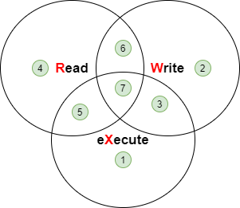
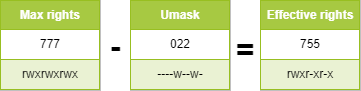

# Sistema de Arquivos

Neste capítulo você aprenderá a trabalhar com sistemas de arquivos.

****

**Objetivos** : Neste capítulo, futuros administradores Linux vão aprender como:

:heavy_check_mark: gerenciar partições no disco;   
:heavy_check_mark: usar LVM para um melhor uso dos recursos de disco;   
:heavy_check_mark: fornecer aos usuários um sistema de arquivos e gerenciar as permissões de acesso.

e também descobrir:

:heavy_check_mark: como a estrutura de árvore é organizada no Linux;   
:heavy_check_mark: os diferentes tipos de arquivos oferecidos e como trabalhar com eles;

:checkered_flag: **hardware**, **disco**, **partição**, **lvm**, **linux**

**Conhecimento**: :star: :star:   
**Complexidade**: :star: :star:

**Tempo de leitura**: 20 minutos

****

## Particionando

O particionamento permitirá a instalação de vários sistemas operacionais, porque é impossível ter vários deles coexistindo na mesma unidade lógica. O particionamento também permite a separação dos dados logicamente (segurança, otimização de acesso, ...).

A divisão do disco físico em volumes particionados está gravada na tabela de partições, armazenada no primeiro setor do disco (MBR: _Registro de Boot Master_).

Para tabelas de partição do tipo **MBR**, o mesmo disco físico pode ser dividido em um máximo de 4 partições:

* *Partição primária* (ou partição principal)
* *Partição estendida*

!!! Atenção

    Pode haver apenas uma partição estendida por disco físico, ou seja, um disco físico pode ter na tabela de partição MBR até:

    1. Três partições primárias mais uma partição estendida
    2. Quatro partições primárias

    A partição estendida não pode escrever dados e formatos, e só pode conter partições lógicas. O tamanho máximo de disco físico que pode ser reconhecido pela tabela de partição MBR é **2TB**.


### Convenções de nomes de arquivos do dispositivo

No mundo do GNU/Linux, tudo é um arquivo. Para discos, eles são reconhecidos no sistema como:

| Hardware                   | Nome do arquivo do dispositivo |
| -------------------------- | ------------------------------ |
| IDE disco rígido           | /dev/hd[a-d]                   |
| Disco rígido SCSI/SATA/USB | /dev/sd[a-z]                   |
| Unidade óptica             | /dev/cdrom ou /dev/sr0         |
| Disco flexível             | /dev/fd[0-7]                   |
| Impressora (25 pins)       | /dev/lp[0-2...]                |
| Impressora (USB)           | /dev/usb/lp[0-15]              |
| Mouse                      | /dev/mouse                     |
| Disco rígido virtual       | /dev/vd[a-z]                   |

O kernel Linux contém drivers para a maioria dos dispositivos de hardware.

O que chamamos de _dispositivos_ são os arquivos, armazenados sem `/dev`, identificando os diferentes hardwares detectados pela placa mãe.

O serviço chamado udev é responsável por aplicar as convenções de nomes (regras) e aplicá-las aos dispositivos que detecta.

Para mais informações, por favor clique [aqui](https://www.kernel.org/doc/html/latest/admin-guide/devices.html).

### Número de partição do dispositivo

O número após o bloco de dispositivo (dispositivo de armazenamento) indica uma partição. Para as tabelas de partição MBR, o número 5 deve ser a primeira partição lógica.

!!! Atenção

    Atenção, por favor! O número de partição que mencionamos aqui refere-se principalmente ao número de partição do bloco de dispositivo (dispositivo de armazenamento).


Existem pelo menos dois comandos para o particionamento de um disco: `fdisk` e `cfdisk`. Ambos os comandos têm um menu interativo. `cfdisk` é mais confiável e mais otimizado, por isso é melhor usá-lo.

A única razão para usar `fdisk` é quando você deseja listar todos os dispositivos lógicos com a opção `-l`. `fdisk` usa tabelas de partição MBR, portanto, não é suportado para tabelas de partição **GPT** e não pode ser usado em discos maiores que **2TB**.

```
sudo fdisk -l
sudo fdisk -l /dev/sdc
sudo fdisk -l /dev/sdc2
```

### Comando `parted`

O comando `parted` (_editor de partições_) é capaz de particionar um disco, isso resolve as limitações do `fdisk`. Recomendamos que você use o comando `parted` ao invés.

O comando `parted` pode ser usado na linha de comando ou de forma interativa. Ele tem também uma função de recuperação capaz de reescrever uma tabela de partição excluída.

```
parted [-l] [dispositivo]
```

Na interface gráfica, existe a ferramenta bem completa `gparted`: *G*nome *PAR*tição *ED*itor.

O comando `gparted -l` lista todos os dispositivos lógicos em um computador.

O comando `gparted` por si só retornará para um modo interativo com suas próprias opções internas:

* `help` ou um comando incorreto exibirá essas opções.
* `print all` deste modo terá o mesmo resultado que `gparted -l` na linha de comando.
* `quit` para retornar ao prompt.

### Comando `cfdisk`

O comando `cfdisk` é usado para gerenciar partições.

```
cfdisk dispositivo
```

Exemplo:

```
$ sudo cfdisk /dev/sda
                                 Disk: /dev/sda
               Size: 16 GiB, 17179869184 bytes, 33554432 sectors
                       Label: dos, identifier: 0xcf173747
    Device        Boot       Start        End    Sectors   Size   Id Type
>>  /dev/sda1     *           2048    2099199    2097152     1G   83 Linux
    /dev/sda2              2099200   33554431   31455232    15G   8e Linux LVM
 lqqqqqqqqqqqqqqqqqqqqqqqqqqqqqqqqqqqqqqqqqqqqqqqqqqqqqqqqqqqqqqqqqqqqqqqqqqqqk
 x Partition type: Linux (83)                                                 x
 x     Attributes: 80                                                         x
 xFilesystem UUID: 54a1f5a7-b8fa-4747-a87c-2dd635914d60                       x
 x     Filesystem: xfs                                                        x
 x     Mountpoint: /boot (mounted)                                            x
 mqqqqqqqqqqqqqqqqqqqqqqqqqqqqqqqqqqqqqqqqqqqqqqqqqqqqqqqqqqqqqqqqqqqqqqqqqqqqj
     [Bootable]  [ Delete ]  [ Resize ]  [  Quit  ]  [  Type  ]  [  Help  ]
     [  Write ]  [  Dump  ]
```

A preparação, sem _LVM_, da mídia física passa por cinco etapas:

* Configuração do disco físico;
* Particionamento dos volumes (divisão geográfica do disco, possibilidade de instalação de vários sistemas...);
* Criação do sistema de arquivos (permite que o sistema operacional gerencie os arquivos, a estrutura de árvores, as permissões, ...);
* Montagem do sistema de arquivos (registro do sistema de arquivos na estrutura de árvore);
* Gerenciar acesso do usuário.

## Gerenciador de Volume Lógico (LVM)

**L**ogical **V**olume **M**anager (*LVM*)

A partição criada pela **partição padrão** não pode ajustar dinamicamente os recursos do disco rígido, uma vez montada a partição, a capacidade é completamente fixa, esta restrição é inaceitável no servidor. Embora a partição padrão possa ser expandida ou reduzida à força através de determinados meios técnicos, é fácil causar perda de dados. O LVM pode resolver este problema muito bem. O LVM está disponível no Linux a partir do kernel versão 2.4, e suas principais características são:

* Capacidade de disco mais flexível;
* Movimento de dados on-line;
* Discos no modo _stripe_;
* Volumes espelhados (recopy);
* Snapshots de volumes (_snapshot_).

O princípio do LVM é muito simples:

* uma camada de abstração lógica é adicionada entre o disco físico (ou partição de disco) e o sistema de arquivos
* mescla vários discos (ou partição de disco) no Grupo de Volume (**VG**)
* realizar operações de gerenciamento de disco subjacentes neles através de algo chamado Volume Lógico(**LV**).

**A mídia física**: O meio de armazenamento do LVM pode ser todo o disco rígido, partição do disco ou arranjo RAID. O dispositivo deve ser convertido, ou inicializado, para um Volume Físico LVM (**PV**), antes que outras operações possam ser executadas.

**PV(Volume Físico)**: O bloco de armazenamento lógico básico do LVM. Para criar um volume físico, você pode usar uma partição de disco ou o próprio disco.

**VG(Grupo de Volume)**: Semelhante aos discos físicos em uma partição padrão, um VG consiste em um ou mais PV.

**LV(Volume Lógico)**: Semelhante às partições de disco rígido em partições padrão, LV é construído em cima do VG. Você pode configurar um sistema de arquivos no LV.

<b><font color="blue">PE</font></b>: A menor unidade de armazenamento que pode ser alocada em um Volume Físico, por padrão <b>4MB</b>. Você pode especificar um tamanho adicional.

<b><font color="blue">LE</font></b>: A menor unidade de armazenamento que pode ser alocada em um Volume Lógico. No mesmo VG, PE e LE são iguais e correspondem um pra um.


A desvantagem é que, se um dos volumes físicos parar de funcionar, então todos os volumes lógicos que usam este volume físico serão perdidos. Você terá que usar o LVM em discos em raid.

!!! nota

    O LVM é gerenciado somente pelo sistema operacional. Portanto, a _BIOS_ precisa de pelo menos uma partição sem LVM para iniciar.

!!! informações

    No disco físico, a menor unidade de armazenamento é o **setor**; no sistema de arquivos, a menor unidade de armazenamento do GNU/Linux é o **bloco**, que se chama **cluster** no sistema operacional Windows.; em RAID, a menor unidade de armazenamento é **chunk**.

### O Mecanismo de Escrita do LVM

Existem vários mecanismos de armazenamento ao salvar dados em **LV**, dois deles são:

* Volumes lineares;
* Volumes no modo _stripe_;
* Volumes espelhados.


### Comandos LVM para gerenciamento de volumes

Os comandos mais relevantes são os seguintes:

|         Item          |    PV     |    VG     |    LV     |
|:---------------------:|:---------:|:---------:|:---------:|
|       procurar        |  pvscan   |  vgscan   |  lvscan   |
|         criar         | pvcreate  | vgcreate  | lvcreate  |
|        exibir         | pvdisplay | vgdisplay | lvdisplay |
|        remover        | pvremove  | vgremove  | lvremove  |
|       estender        |           | vgextend  | lvextend  |
|        reduzir        |           | vgreduce  | lvreduce  |
| informações resumidas |    pvs    |    vgs    |    lvs    |

#### Comando `pvcreate`

O comando `pvcreate` é usado para criar volumes físicos. Ele transforma as partições (ou discos) Linux em volumes físicos.

```
pvcreate [-opções] partição
```

Exemplo:

```
[root]# pvcreate /dev/hdb1
pvcreate -- physical volume « /dev/hdb1 » successfully created
```

Você também pode usar um disco inteiro (o que facilita aumentos de tamanho do disco em ambientes virtuais, por exemplo).

```
[root]# pvcreate /dev/hdb
pvcreate -- physical volume « /dev/hdb » successfully created

# Ele também pode ser escrito de outras maneiras, tal como
[root]# pvcreate /dev/sd{b,c,d}1
[root]# pvcreate /dev/sd[b-d]1
```

| Opção | Descrição                                                                                  |
| ----- | ------------------------------------------------------------------------------------------ |
| `-f`  | Força a criação do volume (disco já convertido em volume físico). Use com extremo cuidado. |

#### Comando `vgcreate`

O comando `vgcreate` é usado para criar grupos de volumes. Ele agrupa um ou mais volumes físicos em um grupo de volume.

```
vgcreate  <nome_VG>  <nome_PV...>  [opção] 
```

Exemplo:

```
[root]# vgcreate volume1 /dev/hdb1
…
vgcreate – volume group « volume1 » successfully created and activated

[root]# vgcreate vg01 /dev/sd{b,c,d}1
[root]# vgcreate vg02 /dev/sd[b-d]1
```

#### Comando `lvcreate`

O comando `lvcreate` cria volumes lógicos. O sistema de arquivos então é criado nestes volumes lógicos.

```
lvcreate -L tamanho [-n nome] nome_VG
```

Exemplo:

```
[root]# lvcreate –L 600M –n VolLog1 volume1
lvcreate -- logical volume « /dev/volume1/VolLog1 » successfully created
```

| Opção        | Descrição                                                                                                         |
| ------------ | ----------------------------------------------------------------------------------------------------------------- |
| `-L tamanho` | Tamanho do volume lógico em K, M ou G.                                                                            |
| `-n nome`    | Nome do VL. Arquivo especial criado em `/dev/nome_volume` com esse nome.                                          |
| `-l número`  | Além de usar a unidade de capacidade do disco rígido, você também pode usar o número de PE. Um PE equivale a 4MB. |

!!! informações

    Depois de criar um volume lógico com o comando `lvcreate`, a regra de nomeação do sistema operacional é - `/dev/nome_VG/nome_LV`, este tipo de arquivo é um link (também conhecido como um link simbólico). O arquivo de link aponta para arquivos como `/dev/dm-0` e `/dev/dm-1`.

### Comandos LVM para ver informações de volume

#### Comando `pvdisplay`

O comando `pvdisplay` permite que você veja informações sobre os volumes físicos.

```
pvdisplay /dev/nome_PV
```

Exemplo:

```
[root]# pvdisplay /dev/nome_PV
```

#### Comando `vgdisplay`

O comando `vgdisplay` permite que você veja informações sobre grupos de volume.

```
vgdisplay nome_VG
```

Exemplo:

```
[root]# vgdisplay volume1
```

#### Comando `lvdisplay`

O comando `lvdisplay` permite que você veja informações sobre os volumes lógicos.

```
lvdisplay /dev/nome_VG/nome_LV
```

Exemplo:

```
[root]# lvdisplay /dev/volume1/VolLog1
```

### Preparação da mídia física

A preparação da parte física com o LVM está dividida da seguinte forma:

* Configurar o disco físico
* Particionamento dos volumes
* **Volume físico de LVM**
* **Grupos de volume LVM**
* **Volume lógico LVM**
* Criação dos sistemas de arquivos
* Montar os sistemas de arquivos
* Gerenciar o acesso de usuário

## Estrutura de um sistema de arquivos

Um _sistema de arquivos_ **FS** é responsável pelas seguintes ações:

* Proteger os direitos de acesso e modificação dos arquivos;
* Manipular arquivos: criar, ler, modificar e excluir;
* Localizar arquivos no disco;
* Gerenciar a área de partição.

O sistema operacional Linux pode usar diferentes sistemas de arquivos (ext2, ext3, ext4, FAT16, FAT32, NTFS, HFS, BtrFS, JFS, XFS, XFS, ...).

### Comando `mkfs`

O comando de `mkfs`(make file system) permite que você crie um sistema de arquivos Linux.

```
mkfs [-t tipofs] arquivosistema
```

Exemplo:

```
[root]# mkfs -t ext4 /dev/sda1
```

| Opção | Descrição                                        |
| ----- | ------------------------------------------------ |
| `-t`  | Indica o tipo de sistema de arquivo a ser usado. |

!!! Atenção

    Sem um sistema de arquivos não é possível usar o espaço em disco.

Cada sistema de arquivos tem uma estrutura que é idêntica em cada partição. Um **Setor de Boot** e um **Super bloco** inicializados pelo sistema e, em seguida, uma **tabela Inode** e um **Bloco de dados** inicializados pelo administrador.

!!! Nota

    A única exceção é a partição **swap**.

### Setor de boot

O setor de inicialização é o primeiro setor da mídia de armazenamento inicializável, ou seja, 0 cilindro, 0 traço, 1 setor (1 setor equivale a 512 bytes). Ela consiste em três partes:

1. MBR(master boot record): 446 bytes.
2. DPT(disk partition table): 64 bytes.
3. BRID(boot record ID): 2 bytes.

| Item | Descrição                                                                                                                                                                                                                           |
| ---- | ----------------------------------------------------------------------------------------------------------------------------------------------------------------------------------------------------------------------------------- |
| MBR  | Armazena o "boot loader"(ou "GRUB"); carrega o kernel, passa parâmetros; fornece uma interface de menu na hora da inicialização; transfere para outro inicializador, como quando vários sistemas operacionais estiverem instalados. |
| DPT  | Registra o status de partição de todo o disco.                                                                                                                                                                                      |
| BRID | Sua função é determinar se o dispositivo pode ser usado para inicializar o sistema.                                                                                                                                                 |

### Super bloco

O tamanho da tabela **Super bloco** é definido na criação. Ele está presente em cada partição e contém os elementos necessários à sua utilização.

Ele descreve o Sistema de Arquivos:

* Nome do Volume Lógico;
* Nome do Sistema de Arquivos;
* Tipo do Sistema de Arquivos;
* Status do Sistema de Arquivos;
* Tamanho do Sistema de Arquivos;
* Número de blocos livres;
* Indica o início da lista de blocos livres;
* Tamanho da lista inode;
* Número e lista de inodes livres.

Uma cópia é carregada na memória central assim que o sistema é inicializado. Esta cópia é atualizada assim que é modificada e o sistema salva periodicamente (comando `sync`).

Quando o sistema para, ele também copia esta tabela na memória para o seu bloco.

### Tabela de inodes

O tamanho da tabela de **inode** é definido em sua criação e é armazenado na partição. Ela consiste em registros, chamados inodes, correspondentes aos arquivos criados. Cada registro contém os endereços dos blocos de dados que compõem o arquivo.

!!! Nota

    Um número inode é único dentro de um sistema de arquivos.

Uma cópia é carregada na memória central assim que o sistema é inicializado. Esta cópia é atualizada sempre que é modificada e o sistema salva-a periodicamente (comando `sync`).

Quando o sistema para, ele também copia esta tabela na memória para o seu bloco.

Um arquivo é gerenciado por seu número de inode.

!!! Nota

    O tamanho da tabela de inode determina o número máximo de arquivos que o FS pode conter.

Informações presentes na *tabela inode*:

* Número Inode;
* Tipo de arquivo e permissões de acesso;
* Número de identificação do proprietário;
* Número de identificação do grupo proprietário;
* Número de links neste arquivo;
* Tamanho do arquivo em bytes;
* Data em que o arquivo foi acessado pela última vez;
* Data em que o arquivo foi modificado pela última vez;
* Data da última modificação do inode (= criação);
* Tabela de vários indicadores (tabela de bloco) para os blocos lógicos que contêm as partes do arquivo.

### Bloco de dados

Seu tamanho corresponde ao resto do espaço disponível da partição. Esta área contém os catálogos correspondentes a cada diretório e os blocos de dados correspondentes ao conteúdo dos arquivos.

**Para garantir a consistência do sistema de arquivos**, uma imagem do superbloco e da tabela de inode é carregada na memória (RAM) quando o sistema operacional é carregado para que todas as operações de E/S sejam feitas através destas tabelas de sistema. Quando o usuário cria ou modifica arquivos, esta imagem de memória é atualizada primeiro. O sistema operacional deve, portanto, atualizar regularmente o superbloco do disco lógico (comando `sync`).

Estas tabelas são escritas no disco rígido quando o sistema é desligado.

!!! Perigo

    No caso de uma parada repentina, o sistema de arquivos pode perder a sua consistência e causar perda de dados.

### Reparando o sistema de arquivos

É possível verificar a consistência de um sistema de arquivos com o comando `fsck`.

Em caso de erros, soluções são propostas para reparar as inconsistências. Após o reparo, arquivos que permanecem sem entradas na tabela de inode são adicionados à pasta `/lost+found` da unidade lógica.

#### Comando `fsck`

O comando `fsck` é uma ferramenta de verificação de integridade e reparo para sistemas de arquivos Linux no modo console.

```
fsck [-sACVRTNP] [ -t tipofs ] arquivossistema
```

Exemplo:

```
[root]# fsck /dev/sda1
```

Para verificar a partição raiz, é possível criar um arquivo `forcefsck` e reiniciar ou executar `shutdown` com a opção `-F`.

```
[root]# touch /forcefsck
[root]# reboot
ou
[root]# shutdown –r -F now
```

!!! Atenção

    A partição a ser verificada não pode estar montada.

## Organização de um sistema de arquivos

Por definição, um Sistema de Arquivos é uma estrutura de árvore de diretórios construída a partir de um diretório raiz (um dispositivo lógico só pode conter um sistema de arquivos).


!!! Nota

    No Linux tudo é um arquivo.

Documento de texto, diretório, binário, partição, recurso de rede, tela, teclado, kernel Unix, programa de usuário, ...

Linux atende ao **FHS** (_Filesystems Hierarchy Standard_) (veja `man hier`) que define os nomes das pastas e suas funções.

| Diretório  | Observação                                                      | Abreviação de                    |
| ---------- | --------------------------------------------------------------- | -------------------------------- |
| `/`        | Contém diretórios especiais                                     |                                  |
| `/boot`    | Arquivos relacionados à inicialização do sistema                |                                  |
| `/sbin`    | Comandos necessários para início e reparação o sistema          | _binários do sistema_            |
| `/bin`     | Executáveis de comandos básicos do sistema                      | _binários_                       |
| `/usr/bin` | Comandos da administração do sistema                            |                                  |
| `/lib`     | Bibliotecas compartilhadas e módulos kernel                     | _bibliotecas_                    |
| `/usr`     | Tudo o que não é necessário para uma operação mínima do sistema | _Recursos do Sistema UNIX_       |
| `/mnt`     | Para montar um SF temporário                                    | _montagem_                       |
| `/media`   | Para montagem de mídia removível                                |                                  |
| `/misc`    | Monta o diretório compartilhado do serviço NFS.                 |                                  |
| `/root`    | Diretório de login do administrador                             |                                  |
| `/home`    | Dados de usuário                                                |                                  |
| `/tmp`     | Arquivos temporários                                            | _temporário_                     |
| `/dev`     | Arquivos de dispositivo especial                                | _dispositivo_                    |
| `/etc`     | Arquivos de configuração e script                               | _configuração de texto editável_ |
| `/opt`     | Específico para aplicativos instalados                          | _opcional_                       |
| `/proc`    | Sistema de arquivos virtuais representando diferentes processos | _processos_                      |
| `/var`     | Arquivos de variáveis diversos                                  | _variáveis_                      |
| `/sys`     | Sistema de arquivos virtuais, similar a /proc                   |                                  |
| `/run`     | Isso é /var/run                                                 |                                  |
| `/srv`     | Diretório de Dados de Serviço                                   | _serviço_                        |

* Para executar uma montagem ou desmontagem, no nível da árvore, você não pode estar no ponto de montagem.
* Montar em um diretório não vazio não apaga o conteúdo. Ele só está escondido.
* Apenas o administrador pode executar montagens.
* Pontos de montagem para serem montados automaticamente durante a inicialização do sistema devem ser inseridos em `/etc/fstab`.

### Arquivo `/etc/fstab`

O arquivo `/etc/fstab` é lido na inicialização do sistema e contém as montagens a serem executadas. Cada sistema de arquivos a ser montado é descrito em uma única linha, sendo os campos separados por espaços ou tabulações.

!!! Nota

    Linhas são lidas sequencialmente (`fsck`, `mount`, `umount`).

```
/dev/mapper/VolGroup-lv_root   /         ext4    defaults        1   1
UUID=46….92                    /boot     ext4    defaults        1   2
/dev/mapper/VolGroup-lv_swap   swap      swap    defaults        0   0
tmpfs                          /dev/shm  tmpfs   defaults        0   0
devpts                         /dev/pts  devpts  gid=5,mode=620  0   0
sysfs                          /sys      sysfs   defaults        0   0
proc                           /proc     proc    defaults        0   0
  1                              2         3        4            5   6
```

| Coluna | Descrição                                                                                                |
| ------ | -------------------------------------------------------------------------------------------------------- |
| 1      | Dispositivo do sistema de arquivo (`/dev/sda1`, UUUID=..., ...)                                          |
| 2      | Nome do ponto de montagem, **caminho absoluto** (exceto **swap**)                                        |
| 3      | Tipo do sistema de arquivos (ext4, swap, ...)                                                            |
| 4      | Opções especiais para montagem (`defaults`, `ro`, ...)                                                   |
| 5      | Ativar ou desativar o gerenciamento de backup (0:não ter backup, 1:backup)                               |
| 6      | Ordem de checagem ao verificar o SF com o comando `fsck` (0:não checar, 1:prioridade, 2:não prioritário) |

O comando `mount -a` permite que você monte automaticamente baseado no conteúdo do arquivo de configuração `/etc/fstab`, a informação montada é então escrita em `/etc/mtab`.

!!! Atenção

    Somente os pontos de montagem listados em `/etc/fstab` serão montados na reinicialização. De um modo geral, não recomendamos colocar disco USB e disco rígido removível para ser inicializado no arquivo `/etc/fstab`, porque quando o dispositivo externo é desconectado e o computador reiniciado, o sistema irá informar que o dispositivo não foi encontrado, resultando em uma falha na inicialização. Então, o que devo fazer? Montagem temporária, por exemplo:

    ```bash
    Shell > mkdir /mnt/usb     
    Shell > mount -t  vfat  /dev/sdb1  /mnt/usb  

    # Ler a informação do disco USB
    Shell > cd /mnt/usb/

    # Quando não for mais necessário, execute o seguinte comando para remover o disco USB
    Shell > umount /mnt/usb
    ```

!!! informações

    É possível fazer uma cópia do arquivo `/etc/mtab` ou copiar seu conteúdo para `/etc/fstab`.
    Se você quiser ver o UUID de uma partição do dispositivo, digite o seguinte comando: `lsblk -o name,uuid`. UUID é a abreviação de `IDentificador Universalmente Único`.

### Comandos de gerenciamento de montagens

#### Comando `mount`

O comando `mount` permite que você monte e veja as unidades lógicas na árvore.

```
monte [-opção] [dispositivo] [diretório]
```

Exemplo:

```
[root]# mount /dev/sda7 /home
```

| Opção | Descrição                                                                                |
| ----- | ---------------------------------------------------------------------------------------- |
| `-n`  | Monta sem escrever em `/etc/mtab`.                                                       |
| `-t`  | Para indicar o tipo de sistema de arquivo a ser usado.                                   |
| `-a`  | Monta todos os sistemas de arquivos mencionados em `/etc/fstab`.                         |
| `-r`  | Monta o sistema de arquivos como somente leitura (equivalente a `-o ro`).                |
| `-w`  | Monta o sistema de arquivos como leitura/escrita, por padrão (equivalente `-o rw`).      |
| `-o`  | Argumento seguido por uma lista de opções separadas por vírgulas (`remount`, `ro`, ...). |

!!! Nota

    O comando `mount` sem argumentos mostra todos os sistemas de arquivos montados.

#### Comando `umount`

O comando `umount` é usado para desmontar unidades lógicas.

```
umount [-opção] [dispositivo] [diretório]
```

Exemplo:

```
[root]# umount /home
[root]# umount /dev/sda7
```

| Opção | Descrição                                                           |
| ----- | ------------------------------------------------------------------- |
| `-n`  | Desmonta sem escrever em `/etc/mtab`.                               |
| `-r`  | Se a desmontagem falhar, remonta como somente leitura.              |
| `-f`  | Força a desmontagem.                                                |
| `-a`  | Desmonta todos os sistemas de arquivos mencionados em `/etc/fstab`. |

!!! Nota

    Quando for desmontar, você não deve estar no ponto de montagem. Caso contrário, a seguinte mensagem de erro é exibida: `o dispositivo está ocupado`.

## Convenção de nomenclatura de arquivo

Como em qualquer sistema, para poder encontrar o caminho através da estrutura da árvore e da gestão de arquivos, é importante respeitar as regras de nomenclatura de arquivos.

* Os arquivos estão codificados com 255 caracteres;
* Todos os caracteres ASCII podem ser usados;
* Letras maiúsculas e minúsculas são diferenciadas;
* A maioria dos arquivos não tem um conceito de extensão de arquivo. No mundo GNU/Linux, a maioria das extensões de arquivo não são necessárias, exceto por alguns (por exemplo, .jpg, .mp4, .gif, etc.).

Grupos de palavras separados por espaços devem ser colocados entre aspas:

```
[root]# mkdir "diretório de trabalho"
```

!!! Nota

    Mesmo que tecnicamente não haja nada de errado em criar um arquivo ou diretório com um espaço no nome, geralmente é uma "melhor prática" evitar e substituir qualquer espaço por um sublinhado.

!!! Nota

    O **.** no início do nome do arquivo serve somente para escondê-lo de um simples `ls`.

Exemplos de acordos de extensão de arquivo:

* `.c` : arquivo de origem em linguagem C;
* `.h` : arquivo de cabeçalho C e Fortran;
* `.o` : arquivo de objeto em linguagem C;
* `.tar` : arquivo de dados armazenados com o utilitário `tar`;
* `.cpio` : arquivo de dados armazenados com o utilitário `cpio`;
* `.gz` : arquivo de dados compactados com o utilitário `gzip`;
* `.tgz` : arquivo de dados armazenados com o utilitário `tar` e compactados com o utilitário `gzip`;
* `.html` : página web.

### Detalhes de um nome de arquivo

```
[root]# ls -liah /usr/bin/passwd
266037 -rwsr-xr-x 1 root root 59K mars  22  2019 /usr/bin/passwd
1      2    3     4  5    6    7       8               9
```

| Parte | Descrição                                                                                                                                                                                                                                                  |
| ----- | ---------------------------------------------------------------------------------------------------------------------------------------------------------------------------------------------------------------------------------------------------------- |
| `1`   | Número inode                                                                                                                                                                                                                                               |
| `2`   | Tipo de arquivo (1º caractere do bloco de 10), "-" significa que este é um arquivo comum.                                                                                                                                                                  |
| `3`   | Permissões de acesso (últimos 9 caracteres do bloco de 10)                                                                                                                                                                                                 |
| `4`   | Se for um diretório, este número representa quantos subdiretórios existem neste diretório, incluindo os ocultos. Se for um arquivo, indica o número de links rígidos, quando o número é 1, significa que existe apenas um link rígido, ou seja, ele mesmo. |
| `5`   | Nome do proprietário                                                                                                                                                                                                                                       |
| `6`   | Nome do grupo                                                                                                                                                                                                                                              |
| `7`   | Tamanho (byte, kilo, mega)                                                                                                                                                                                                                                 |
| `8`   | Data da última atualização                                                                                                                                                                                                                                 |
| `9`   | Nome do arquivo                                                                                                                                                                                                                                            |

No mundo GNU/Linux, há sete tipos de arquivos:

| Tipos de arquivo | Descrição                                                                                                                                                                                                             |
|:----------------:| --------------------------------------------------------------------------------------------------------------------------------------------------------------------------------------------------------------------- |
|      **-**       | Representa um arquivo comum. Incluindo arquivos de texto simples (ASCII); arquivos binários (binário); arquivos de formato de dados (dados); vários arquivos compactados.                                             |
|      **d**       | Representa um arquivo de diretório.                                                                                                                                                                                   |
|      **b**       | Arquivo de bloco de dispositivo. Incluindo todos os tipos de discos rígidos, unidades USB e assim por diante.                                                                                                         |
|      **c**       | Arquivo de dispositivo de caractere. Dispositivo de interface de porta serial, como mouse, teclado, etc.                                                                                                              |
|      **s**       | Arquivo de socket. É um arquivo usado especialmente para a comunicação de rede.                                                                                                                                       |
|      **p**       | Arquivo de pipe. É um tipo especial de arquivo, o principal objetivo é resolver os erros causados por vários programas acessando um arquivo ao mesmo tempo. FIFO é a abreviação de primeiro-a-entrar-primeiro-a-sair. |
|      **l**       | Arquivos de soft link, também chamados arquivos de link simbólicos, são semelhantes aos atalhos no Windows. Arquivo de hard link, também conhecido como arquivo de link físico.                                       |

#### Descrição complementar do diretório

Em cada diretório, existem dois arquivos ocultos:  **.** e **..**. Você precisa usar `ls -al` para visualizar, por exemplo:

```bash
# . Indica que no diretório atual, por exemplo, você precisa executar um script em um diretório, normalmente: Shell > ./scripts

# .. representa o diretório um nível acima do diretório atual, por exemplo:
Shell > cd /etc/
Shell > cd ..
Shell > pwd
/

# Para um diretório vazio, sua quarta parte deve ser maior ou igual a 2. Porque existem "." e ".."
Shell > mkdir /tmp/t1
Shell > ls -ldi /tmp/t1
1179657 drwxr-xr-x 2 root root 4096 Nov 14 18:41 /tmp/t1
```

#### Arquivos especiais

Para se comunicar com os periféricos (discos rígidos, impressoras...), o Linux usa arquivos de interface chamados arquivos especiais (_arquivo de dispositivo_ ou _arquivo especial_). Permitem a identificação por parte dos periféricos.

Esses arquivos são especiais porque eles não contêm dados, mas especificam o modo de acesso para se comunicar com o dispositivo.

São definidos em dois modos:

* modo de **bloco**;
* modo de **caractere**.

```bash
# Arquivo de dispositivo de bloco
Shell > ls -l /dev/sda
brw-------   1   root  root  8, 0 jan 1 1970 /dev/sda

# Arquivo de dispositivo de caractere
Shell > ls -l /dev/tty0
crw-------   1   root  root  8, 0 jan 1 1970 /dev/tty0
```

#### Arquivos de comunicação

Estes são os pipe (_pipes_) e os arquivos de _socket_.

* **Arquivos de pipe** passam informações entre processos por FIFO (_First In, First Out_). Um processo grava informações transitórias em um arquivo _pipe_ e outro lê. Após ler, a informação não está mais acessível.

* **Arquivos de soquete** permitem comunicação bidirecional interprocesso (em sistemas locais ou remotos). Eles usam um _inode_ do sistema de arquivos.

#### Arquivos de link

Estes arquivos permitem dar vários nomes lógicos para o mesmo arquivo físico. Portanto, um novo ponto de acesso ao arquivo é criado.

Existem dois tipos de arquivos de link:

* Soft links, também chamados de arquivos de link simbólico;
* Hard links, também chamados de arquivos de link físicos.

As suas principais características são:

| Tipos de link        | Descrição                                                                                                                                                                                                                                                                                           |
| -------------------- | --------------------------------------------------------------------------------------------------------------------------------------------------------------------------------------------------------------------------------------------------------------------------------------------------- |
| arquivo de soft link | Um atalho semelhante ao Windows. Tem permissão 777 e aponta para o arquivo original. Quando o arquivo original é excluído, o arquivo vinculado e o original são exibidos em vermelho.                                                                                                               |
| Arquivo de hard link | O arquivo original tem o mesmo número _ inode_ que o arquivo vinculado. Eles podem ser atualizados sincronizadamente, incluindo o conteúdo do arquivo e quando ele foi modificado. Não é possível cruzar partições, não é possível cruzar sistemas de arquivos. Não pode ser usado para diretórios. |

Seguem exemplos específicos:

```bash
# Permissões e o arquivo original para o qual elas apontam
Shell > ls -l /etc/rc.locol
lrwxrwxrwx 1 root root 13 Oct 25 15:41 /etc/rc.local -> rc.d/rc.local

# Quando se exclui o arquivo original. "-s" representa a opção de soft link
Shell > touch /root/arquivoA
Shell > ln -s /root/arquivoA /root/slink1
Shell > rm -rf /root/arquivoA
```


```bash
Shell > cd /home/paul/
Shell > ls –li letter
666 –rwxr--r-- 1 root root … letter

# O comando ln não adiciona nenhuma opção, indicando um hard link
Shell > ln /home/paul/letter /home/jack/read

# A essência dos hard links é o mapeamento de arqiuvo com o mesmo número inode em diferentes diretórios.
Shell > ls –li /home/*/*
666 –rwxr--r-- 2 root root … letter
666 –rwxr--r-- 2 root root … read

# Se você usar um hard link para um diretório, receberá a mensagem:
Shell > ln  /etc/  /root/etc_hardlink
ln: /etc: hard link not allowed for directory
```

## Atributos do arquivo

O Linux é um sistema operacional multiusuário, onde o controle do acesso aos arquivos é essencial.

Estes controles são funções de:

* permissões de acesso de arquivos ;
* usuários (_ugo_ _Usuários Grupos Outros_).

### Permissões básicas de arquivos e diretórios

A descrição das **permissões de arquivos** é a seguinte:

| Permissões de arquivos | Descrição                                                                              |
|:----------------------:| -------------------------------------------------------------------------------------- |
|           r            | Leitura. Permite ler um arquivo (`cat`, `less`, ...) e copiar um arquivo (`cp`, ...).  |
|           w            | Escrita. Permite a modificação do conteúdo do arquivo (`cat`, `>>`, `vim`, ...). |
|           x            | Execução. Considera o arquivo como um e**X**ecutável (binário ou script).              |
|           -            | Sem permissão                                                                          |

A descrição das **permissões de diretório** é a seguinte:

| Permissões do diretório | Descrição                                                                                                                                       |
|:-----------------------:| ----------------------------------------------------------------------------------------------------------------------------------------------- |
|            r            | Leitura. Permite ler o conteúdo de um diretório (`ls -R`).                                                                                      |
|            w            | Escrita. Permite que você crie e exclua arquivos/diretórios neste diretório, comandos como `mkdir`, `rmdir`, `rm`, `touch`, e assim por diante. |
|            x            | Execução. Permite entrar no diretório (`cd`).                                                                                                   |
|            -            | Sem permissões                                                                                                                                  |

!!! informações

    Para as permissões de um diretório, `r` e `x` geralmente aparecem ao mesmo tempo. Mover ou renomear um arquivo depende se o diretório onde o arquivo está localizado tem a permissão `w`, assim como a exclusão de um arquivo.

### Tipo de usuário correspondente à permissão básica

| Tipo de usuário | Descrição          |
|:---------------:| ------------------ |
|        u        | Proprietário       |
|        g        | Grupo proprietário |
|        o        | Outros usuários    |

!!! informações

    Em alguns comandos é possível designar todos com **a** (_all_). **a = ugo**.

### Gerenciamento de atributos

A exibição das permissões é feita com o comando `ls -l`. São os últimos 9 caracteres do bloco de 10. Mais precisamente 3 vezes 3 caracteres.

```
[root]# ls -l /tmp/meuarquivo
-rwxrw-r-x  1  root  sys  ... /tmp/meuarquivo
  1  2  3       4     5
```

| Parte | Descrição                                                |
| ----- | -------------------------------------------------------- |
| 1     | Permissões de proprietário (**u**ser), aqui `rwx`        |
| 2     | Permissões do grupo proprietário (**g**roup), aqui `rw-` |
| 3     | Permissões de outros usuários (**o**thers), aqui `r-x`   |
| 4     | Proprietário do arquivo                                  |
| 5     | Grupo proprietário do arquivo                            |

Por padrão, o _dono_ de um arquivo é quem o cria. O _grupo_ do arquivo é o grupo do dono que criou o arquivo. Os _outros_ são todos aqueles que não estejam nesses casos anteriores.

Os atributos são alterados com o comando `chmod`.

Somente o administrador e o proprietário de um arquivo podem alterar as permissões de um arquivo.

#### Comando `chmod`

O comando `chmod` permite que você altere as permissões de acesso em um arquivo.

```
chmod [opção] modo arquivo
```

| Opção | Observação                                                                             |
| ----- | -------------------------------------------------------------------------------------- |
| `-R`  | Altera recursivamente as permissões do diretório e de todos os arquivos contidos nele. |

!!! Atenção

    As permissões dos arquivos e diretórios não são dissociadas. Para algumas operações, será necessário saber os direitos do diretório que contém o arquivo. Um arquivo protegido pela gravação pode ser excluído por outro usuário, desde que os direitos do diretório que o contêm, permitam que esse usuário execute essa operação.

A indicação do modo pode ser uma representação octal (por exemplo, `744`) ou uma representação simbólica ([`ugoa`][`+=-`][`rwxst`]).

##### Representação Octal （ou numérica）：

| Número | Descrição |
|:------:| --------- |
|   4    | r         |
|   2    | w         |
|   1    | x         |
|   0    | -         |

Adicione os três números juntos para obter um tipo de permissão de usuário. Ex.: **755=rwxr-xr-x**.




!!! informações

    Algumas vezes você verá `chmod 4755`. O número 4 aqui refere-se à permissão especial **set uid**. As permissões especiais não serão expandidas aqui por enquanto, apenas como um entendimento básico.

```
[root]# ls -l /tmp/fil*
-rwxrwx--- 1 root root … /tmp/file1
-rwx--x--- 1 root root … /tmp/file2
-rwx--xr-- 1 root root … /tmp/file3

[root]# chmod 741 /tmp/file1
[root]# chmod -R 744 /tmp/file2
[root]# ls -l /tmp/fic*
-rwxr----x 1 root root … /tmp/file1
-rwxr--r-- 1 root root … /tmp/file2
```

##### representação simbólica

Este método pode ser considerado uma associação "literal" entre um tipo de usuário, um operador e permissões.


```
[root]# chmod -R u+rwx,g+wx,o-r /tmp/file1
[root]# chmod g=x,o-r /tmp/file2
[root]# chmod -R o=r /tmp/file3
```

## Permissões padrão e máscara

Quando um arquivo ou diretório é criado, ele já tem permissões.

* Para um diretório: `rwxr-xr-x` ou _755_.
* Para um arquivo: `rw-r-r-` ou _644_.

Esse comportamento é definido pela **máscara padrão**.

O princípio é remover o valor definido pela máscara com o máximo de permissões, sem permissão de execução.

Para um diretório :



Para um arquivo, as permissões de execução são removidas:


!!! informações

    O arquivo `/etc/login.defs` define o UMASK padrão, com um valor de **022**. Isso significa que a permissão para criar um arquivo é de 755 (rwxr-xr-x). No entanto, por uma questão de segurança, o GNU/Linux não tem permissão de **x** para arquivos recém-criados. esta restrição se aplica a root(uid=0) e usuários comuns (uid>=1000).

    ```bash
    # usuário root
    Shell > touch a.txt
    Shell > ll
    -rw-r--r-- 1 root root     0 Oct  8 13:00 a.txt
    ```

### Comando `umask`

O comando `umask` permite que você exiba e modifique a máscara.

```
umask [opção] [modo]
```

Exemplo:
```
$ umask 033
$ umask
0033
$ umask -S
u=rwx,g=r,o=r
$ touch umask_033
$ ls -la  umask_033
-rw-r--r-- 1 rockstar rockstar 0 nov.   4 16:44 umask_033
$ umask 025
$ umask -S
u=rwx,g=rx,o=w
$ touch umask_025
$ ls -la  umask_025
-rw-r---w- 1 rockstar rockstar 0 nov.   4 16:44 umask_025
```

| Opção | Descrição                                    |
| ----- | -------------------------------------------- |
| `-S`  | Exibição simbólica de permissões de arquivo. |

!!! Atenção

    `umask` não afeta arquivos existentes. `umask -S` exibe as permissões (sem a permissão de execução) dos arquivos que serão criados. Portanto, não é a exibição da máscara usada para subtrair o valor máximo.

!!! Nota

    `umask` modifica a máscara até a desconexão.

!!! informações

    O comando `umask` pertence aos comandos internos do bash, então quando você usar `man umask`, todos os comandos internos serão exibidos. Se você quiser apenas ver a ajuda de `umask`, você precisa usar o comando `help umask`.

Para manter o valor, você tem que modificar os seguintes arquivos de perfil：

Para todos os usuários:

* `/etc/profile`
* `/etc/bashrc`

Para um usuário em particular:

* `~/.bashrc`

Quando o arquivo acima é escrito, na verdade ele substitui o parâmetro **UMASK** de `/etc/login.defs`. Se você quer melhorar a segurança do sistema operacional, você pode definir umask para **027** ou **077**.
