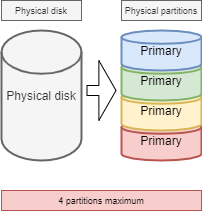
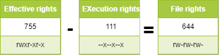

# Файлова система

У цьому розділі ви дізнаєтеся, як працювати з файловими системами.

****

**Цілі**: у цьому розділі майбутні адміністратори Linux дізнаються як:

:heavy_check_mark: керувати розділами на диску;   
:heavy_check_mark: використовувати LVM для кращого використання дискових ресурсів;   
:heavy_check_mark: надавати користувачам файлову систему та керувати правами доступу.

а також дізнаються:

:heavy_check_mark: як організовано деревовидну структуру в Linux;   
:heavy_check_mark: про різні типи файлів і як з ними працювати;

:checkered_flag: **апаратне забезпечення**, **диск**, **розділ**, **lvm**, **linux**

**Знання**: :star: :star:   
**Складність**: :star: :star:

**Час читання**: 20 хвилин

****

## Розділення

Розбиття на розділи дозволить інсталювати кілька операційних систем, оскільки неможливо мати декілька з них на одному логічному диску. Розбиття також дозволяє логічно розділяти дані (безпека, оптимізація доступу, ...).

Поділ фізичного диска на розділені томи записується в таблицю розділів, яка зберігається в першому секторі диска (MBR: _Master Boot Record_).

Для типів таблиць розділів **MBR** той самий фізичний диск можна розділити щонайбільше на 4 розділи:

* *Основний розділ* (або головний розділ)
* *Розширений розділ*

!!! Увага

    На фізичному диску може бути лише один розширений розділ, тобто фізичний диск може містити в таблиці розділів MBR до:

    1. Трьох основних розділів плюс один розширений розділ
    2. Чотирьох основних розділів

    Розширений розділ не може записувати дані та форматувати, і може містити лише логічні розділи. Найбільший фізичний диск, який можна розпізнати за таблицею розділів MBR, становить **2 ТБ**.




### Правила іменування імен файлів пристроїв

У світі GNU/Linux все є файлом. Для дисків вони розпізнаються системою як:

| Устаткування                | Ім'я файлу пристрою     |
| --------------------------- | ----------------------- |
| Жорсткий диск IDE           | /dev/hd[a-d]            |
| Жорсткий диск SCSI/SATA/USB | /dev/sd[a-z]            |
| Оптичний диск               | /dev/cdrom або /dev/sr0 |
| Дискета                     | /dev/fd[0-7]            |
| Принтер (25 контактів)      | /dev/lp[0-2...]         |
| Принтер (USB)               | /dev/usb/lp[0-15]       |
| Миша                        | /dev/mouse              |
| Віртуальний жорсткий диск   | /dev/vd[a-z]            |

Ядро Linux містить драйвери для більшості апаратних пристроїв.

Те, що ми називаємо _пристроями_, — це файли, що зберігаються без `/dev`, що ідентифікують різне обладнання, виявлене материнською платою.

Служба під назвою udev відповідає за застосування угод (правил) іменування та їх застосування до пристроїв, які вона виявляє.

Додаткову інформацію можна переглянути [тут](https://www.kernel.org/doc/html/latest/admin-guide/devices.html).

### Номер розділу пристрою

Номер після блокового пристрою (пристрою зберігання) вказує на розділ. Для таблиць розділів MBR номер 5 має бути першим логічним розділом.

!!! Важливо

    Увага, будь ласка! Номер розділу, який ми тут згадали, в основному стосується номера розділу блокового пристрою (пристрою зберігання).


Існує принаймні дві команди для розділення диска: `fdisk` і `cfdisk`. Обидві команди мають інтерактивне меню. `cfdisk` є більш надійною і краще оптимізованою, тому найкраще використовувати її.

Єдина причина для використання `fdisk` - це коли ви хочете перерахувати всі логічні пристрої за допомогою параметра `-l`. `fdisk` використовує таблиці розділів MBR, тому вона не підтримується для таблиць розділів **GPT** і не може оброблятися для дисків, розмір яких перевищує **2 ТБ**.

```
sudo fdisk -l
sudo fdisk -l /dev/sdc
sudo fdisk -l /dev/sdc2
```

### Команда `parted`

Команда `parted` (_редактор розділів_) може розділити диск, вона усуває недоліки `fdisk`, тому ми рекомендуємо вам використовувати < 0>parted</code> замість `fdisk`.

Команду `parted` можна використовувати як у командному рядку, так і в інтерактивному режимі. Вона також має функцію відновлення, здатну переписати видалену таблицю розділів.

```
parted [-l] [device]
```

У графічному інтерфейсі є дуже потужний інструмент `gparted`: *G*nome *PAR*tition *ED*itor.

Команда `gparted -l` показує список усіх логічних пристроїв на комп’ютері.

Команда `gparted`, якщо працює без будь-яких аргументів, відобразить інтерактивний режим із внутрішніми параметрами:

* `help` або неправильна команда відобразить ці параметри.
* `print all` у цьому режимі матиме той самий результат, що й `gparted -l` у командному рядку.
* `quit`, негайно повернеться.

### Команда `cfdisk`

Команда `cfdisk` використовується для керування розділами.

```
cfdisk device
```

Приклад:

```
$ sudo cfdisk /dev/sda
                                 Disk: /dev/sda
               Size: 16 GiB, 17179869184 bytes, 33554432 sectors
                       Label: dos, identifier: 0xcf173747
    Device        Boot       Start        End    Sectors   Size   Id Type
>>  /dev/sda1     *           2048    2099199    2097152     1G   83 Linux
    /dev/sda2              2099200   33554431   31455232    15G   8e Linux LVM
 lqqqqqqqqqqqqqqqqqqqqqqqqqqqqqqqqqqqqqqqqqqqqqqqqqqqqqqqqqqqqqqqqqqqqqqqqqqqqk
 x Partition type: Linux (83)                                                 x
 x     Attributes: 80                                                         x
 xFilesystem UUID: 54a1f5a7-b8fa-4747-a87c-2dd635914d60                       x
 x     Filesystem: xfs                                                        x
 x     Mountpoint: /boot (mounted)                                            x
 mqqqqqqqqqqqqqqqqqqqqqqqqqqqqqqqqqqqqqqqqqqqqqqqqqqqqqqqqqqqqqqqqqqqqqqqqqqqqj
     [Bootable]  [ Delete ]  [ Resize ]  [  Quit  ]  [  Type  ]  [  Help  ]
     [  Write ]  [  Dump  ]
```

Підготовка фізичного носія без _LVM_ складається з п’яти етапів:

* Налаштування фізичного диска;
* Розбиття томів (поділ диска, можливість встановлення кількох систем, ...);
* Створення файлових систем (дозволяє операційній системі керувати файлами, структурою дерева, правами, ...);
* Монтування файлових систем (реєстрація файлової системи в деревовидній структурі);
* Керування доступом користувачів.

## Диспетчер логічних томів (LVM)

**L**ogical **V**olume **M**anager (*LVM*)

Розділ, створений за допомогою **стандартного розділу**, не може динамічно регулювати ресурси жорсткого диска. Після монтування розділу ємність повністю фіксована, це обмеження є неприйнятним на сервері. Хоча стандартний розділ можна примусово розширити або зменшити за допомогою певних технічних засобів, це легко спричиняє втрату даних. LVM може дуже добре вирішити цю проблему. LVM доступний у Linux з ядром версії 2.4, і його основні функції:

* Більш гнучка ємність диска;
* Рух даних онлайн;
* Диски в режимі _stripe_;
* Дзеркальні томи (рекопіювання);
* Знімки томів (_моментальний знімок_).

Принцип LVM дуже простий:

* між фізичним диском (або розділом диска) і файловою системою додається рівень логічної абстракції
* об’єднання декілька дисків (або розділів дисків) у групу томів (**VG**)
* виконання базових операцій керування дисками над ними за допомогою логічного тому (**LV**).

**Фізичний носій**: носієм даних LVM може бути весь жорсткий диск, розділ диска або масив RAID. Перед виконанням подальших операцій пристрій має бути перетворено або ініціалізовано на фізичний том LVM (**PV**).

**PV (Physical Volume)**: основний логічний блок зберігання LVM. Для створення фізичного тому можна використовувати розділ диска або сам диск.

**VG (Volume Group)**: Подібно до фізичних дисків у стандартному розділі, VG складається з одного або кількох PV.

**LV (логічний том)**: Подібно до розділів жорсткого диска в стандартних розділах, LV побудовано поверх VG. Ви можете налаштувати файлову систему на LV.

<b><font color="blue">PE</font></b>: найменша одиниця пам’яті, яку може виділити фізичний том, за замовчуванням <b mark="crwd -mark">4 МБ</b>. Ви можете вказати додатковий розмір.

<b><font color="blue">LE</font></b>: найменша одиниця пам’яті, яку може виділити фізичний том. У однакових VG PE і LE однакові і відповідають одна до одної.


Недоліком є те, що якщо один із фізичних томів виходить з ладу, усі логічні томи, які використовують цей фізичний том, втрачаються. Вам доведеться використовувати LVM на дисках raid.

!!! Примітка

    LVM керується лише операційною системою. Тому для завантаження _BIOS_ потрібен принаймні один розділ без LVM.

!!! інформація

    На фізичному диску найменшою одиницею зберігання є **сектор**; у файловій системі найменшою одиницею зберігання GNU/Linux є **блок**, який в операційній системі Windows називається **кластером**.; у RAID найменшою одиницею зберігання є **фрагмент**.

### Механізм запису LVM

Існує кілька механізмів зберігання даних у **LV**, два з яких:

* Лінійні томи;
* Томи в режимі _stripe_;
* Дзеркальні томи.


### Команди LVM для керування томами

Основні відповідні команди:

|        Дія        |    PV     |    VG     |    LV     |
|:-----------------:|:---------:|:---------:|:---------:|
|    сканування     |  pvscan   |  vgscan   |  lvscan   |
|     створення     | pvcreate  | vgcreate  | lvcreate  |
|   відображення    | pvdisplay | vgdisplay | lvdisplay |
|     видалення     | pvremove  | vgremove  | lvremove  |
|    розширення     |           | vgextend  | lvextend  |
|     зменшення     |           | vgreduce  | lvreduce  |
| зведені відомості |    pvs    |    vgs    |    lvs    |

#### Команда `pvcreate`

Команда `pvcreate` використовується для створення фізичних томів. Вона перетворює розділи (або диски) Linux на фізичні томи.

```
pvcreate [-options] partition
```

Приклад:

```
[root]# pvcreate /dev/hdb1
pvcreate -- physical volume « /dev/hdb1 » successfully created
```

Ви також можете використовувати цілий диск (що полегшує збільшення розміру диска, наприклад, у віртуальних середовищах).

```
[root]# pvcreate /dev/hdb
pvcreate -- physical volume « /dev/hdb » successfully created

# It can also be written in other ways, such as
[root]# pvcreate /dev/sd{b,c,d}1
[root]# pvcreate /dev/sd[b-d]1
```

| Опція | Опис                                                                                                       |
| ----- | ---------------------------------------------------------------------------------------------------------- |
| `-f`  | Примусово створюється том (диск уже перетворено на фізичний том). Використовувати з особливою обережністю. |

#### Команда `vgcreate`

Команда `vgcreate` використовується для створення груп томів. Вона групує один або кілька фізичних томів у групу томів.

```
vgcreate  <VG_name>  <PV_name...>  [option] 
```

Приклад:

```
[root]# vgcreate volume1 /dev/hdb1
…
vgcreate – volume group « volume1 » successfully created and activated

[root]# vgcreate vg01 /dev/sd{b,c,d}1
[root]# vgcreate vg02 /dev/sd[b-d]1
```

#### Команда `lvcreate`

Команда `lvcreate` створює логічні томи. Потім на цих логічних томах створюється файлова система.

```
lvcreate -L size [-n name] VG_name
```

Приклад:

```
[root]# lvcreate –L 600M –n VolLog1 volume1
lvcreate -- logical volume « /dev/volume1/VolLog1 » successfully created
```

| Опція       | Опис                                                                                                                                                          |
| ----------- | ------------------------------------------------------------------------------------------------------------------------------------------------------------- |
| `-L розмір` | Розмір логічного тому в K, M або G.                                                                                                                           |
| `-n ім'я`   | Назва LV. Спеціальний файл, створений у `/dev/name_volume` з такою назвою.                                                                                    |
| `-l  номер` | Крім використання одиниці ємності жорсткого диска, можна також використовувати кількість PE. Також можна використовувати кількість PE. Один PE дорівнює 4 МБ. |

!!! інформація

    Після створення логічного тому за допомогою команди `lvcreate` правило іменування операційної системи - `/dev/VG_name/LV_name`, цей тип файлу є м’яким посиланням (інакше відомим як символьне посилання). Файл посилання вказує на такі файли, як `/dev/dm-0` і `/dev/dm-1`.

### Команди LVM для перегляду інформації про обсяг

#### Команда `pvdisplay`

Команда `pvdisplay` дозволяє переглядати інформацію про фізичні томи.

```
pvdisplay /dev/PV_name
```

Приклад:

```
[root]# pvdisplay /dev/PV_name
```

#### Команда `vgdisplay`

Команда `vgdisplay` дозволяє переглядати інформацію про групи томів.

```
vgdisplay VG_name
```

Приклад:

```
[root]# vgdisplay volume1
```

#### Команда `lvdisplay`

Команда `lvdisplay` дозволяє переглядати інформацію про логічні томи.

```
lvdisplay /dev/VG_name/LV_name
```

Приклад:

```
[root]# lvdisplay /dev/volume1/VolLog1
```

### Підготовка фізичного носія

Підготовка фізичної підтримки за допомогою LVM розбивається на наступне:

* Налаштування фізичного диска
* Розбиття томів
* **Фізичний том LVM**
* **Групи томів LVM**
* **Логічні томи LVM**
* Створення файлових систем
* Монтування файлових систем
* Керування доступом користувачів

## Структура файлової системи

_Файлова система_ **FS** відповідає за такі дії:

* Забезпечення прав доступу та модифікації файлів;
* Маніпулювання файлами: створення, читання, зміна та видалення;
* Розташування файлів на диску;
* Управління простором розділу.

Операційна система Linux може використовувати різні файлові системи (ext2, ext3, ext4, FAT16, FAT32, NTFS, HFS, BtrFS, JFS, XFS, ...).

### Команда `mkfs`

Команда `mkfs`(make file system) дозволяє створити файлову систему Linux.

```
mkfs [-t fstype] filesys
```

Приклад:

```
[root]# mkfs -t ext4 /dev/sda1
```

| Опція | Опис                                          |
| ----- | --------------------------------------------- |
| `-t`  | Вказує тип файлової системи для використання. |

!!! Важливо

    Без файлової системи неможливо використовувати дисковий простір.

Кожна файлова система має структуру, яка є ідентичною для кожного розділу. **Завантажувальний сектор** і **Суперблок**, ініціалізовані системою, а потім **Таблиця Inode** і **Блок даних**, ініціалізований адміністратором.

!!! Важливо

    Єдиним винятком є розділ **swap**.

### Завантажувальний сектор

Завантажувальний сектор — це перший сектор завантажувального носія, тобто 0 циліндрів, 0 доріжок, 1 сектор (1 сектор дорівнює 512 байтам). Він складається з трьох частин:

1. MBR (головний завантажувальний запис): 446 байт.
2. DPT (таблиця розділів диска): 64 байти.
3. BRID (ідентифікатор завантажувального запису): 2 байти.

| Елемент | Опис                                                                                                                                                                                                                 |
| ------- | -------------------------------------------------------------------------------------------------------------------------------------------------------------------------------------------------------------------- |
| MBR     | Зберігає "завантажувач" (або "GRUB"); завантажує ядро, передає параметри; забезпечує інтерфейс меню під час завантаження; переносить до іншого завантажувача, наприклад, коли встановлено кілька операційних систем. |
| DPT     | Записує стан розділу всього диска.                                                                                                                                                                                   |
| BRID    | Визначає, чи придатний пристрій для завантаження.                                                                                                                                                                    |

### Super block

Розмір таблиці **Super block** визначається під час створення. Він присутній на кожній перегородці і містить елементи, необхідні для її використання.

Він описує файлову систему:

* Назва логічного тому;
* Назва файлової системи;
* Тип файлової системи;
* Статус файлової системи;
* Розмір файлової системи;
* Кількість вільних блоків;
* Покажчик на початок списку вільних блоків;
* Розмір списку inode;
* Кількість і список вільних inode.

Копія завантажується в центральну пам'ять, як тільки система ініціалізується. Ця копія оновлюється, як тільки її змінюють, і система періодично зберігає її (команда `sync`).

Коли система зупиняється, вона також копіює цю таблицю в пам'яті в свій блок.

### Inodes таблиця

Розмір **таблиці inode** визначається під час її створення та зберігається в розділі. Він складається із записів, званих inode, що відповідають створеним файлам. Кожен запис містить адреси блоків даних, що утворюють файл.

!!! Примітка

    Номер inode є унікальним у файловій системі.

Копія завантажується в центральну пам'ять, як тільки система ініціалізується. Ця копія оновлюється, як тільки її змінюють, і система періодично зберігає її (команда `sync`).

Коли система зупиняється, вона також копіює цю таблицю в пам'яті в свій блок.

Файл керується номером inode.

!!! Примітка

    Розмір таблиці inode визначає максимальну кількість файлів, які може містити FS.

Інформація, яку містить *таблиця inode*:

* Номер Inode;
* Тип файлу та права доступу;
* Ідентифікаційний номер власника;
* Ідентифікаційний номер групи власників;
* Кількість посилань на цей файл;
* Розмір файлу в байтах;
* Дата останнього доступу до файлу;
* Дата останньої зміни файлу;
* Дата останньої модифікації inode (= створення);
* Таблиця з кількох покажчиків (таблиця блоків) на логічні блоки, що містять фрагменти файлу.

### Блок даних

Його розмір відповідає решті доступного простору перегородки. Ця область містить каталоги, що відповідають кожному каталогу, і блоки даних, що відповідають вмісту файлів.

**Щоб гарантувати узгодженість файлової системи**, образ суперблоку та таблиці inode завантажується в пам’ять (RAM) під час завантаження операційної системи, щоб усі Операції введення/виведення виконувались через ці системні таблиці. Коли користувач створює або змінює файли, цей образ пам’яті оновлюється першим. Тому операційна система повинна регулярно оновлювати суперблок логічного диска (команда `sync`).

Ці таблиці записуються на жорсткий диск, коли система вимикається.

!!! увага 

    У разі раптової зупинки файлова система може втратити послідовність і спричинити втрату даних.

### Відновлення файлової системи

Перевірити узгодженість файлової системи можна за допомогою команди `fsck`.

У разі виявлення помилок пропонуються рішення для усунення невідповідностей. Після відновлення файли, які залишаються без записів у таблиці inode, долучаються до папки `/lost+found` логічного диска.

#### Команда `fsck`

Команда `fsck` — це інструмент перевірки цілісності та відновлення файлових систем Linux у консольному режимі.

```
fsck [-sACVRTNP] [ -t fstype ] filesys
```

Приклад:

```
[root]# fsck /dev/sda1
```

Щоб перевірити кореневий розділ, можна створити файл `forcefsck` і перезавантажити комп’ютер або запустити `shutdown` за допомогою параметра `-F`.

```
[root]# touch /forcefsck
[root]# reboot
or
[root]# shutdown –r -F now
```

!!! Важливо

    Розділ, який потрібно перевірити, має бути відмонтований.

## Організація файлової системи

За визначенням, файлова система — це деревоподібна структура каталогів, побудована з кореневого каталогу (логічний пристрій може містити лише одну файлову систему).


!!! Примітка

    У Linux все є файлом.

Текстовий документ, каталог, двійковий файл, розділ, мережевий ресурс, екран, клавіатура, ядро Unix, програма користувача, ...

Linux відповідає **FHS** (_Стандартам ієрархії файлових систем_) (див. `man hier`), який визначає назви папок та їхні ролі.

| Каталог    | Функціональність                                                                                 | Повне слово                        |
| ---------- | ------------------------------------------------------------------------------------------------ | ---------------------------------- |
| `/`        | Містить спеціальні довідники                                                                     |                                    |
| `/boot`    | Файли, пов'язані із запуском системи                                                             |                                    |
| `/sbin`    | Команди, необхідні для запуску та відновлення системи                                            | _системні двійкові файли_          |
| `/bin`     | Виконувані файли основних системних команд                                                       | _бінарні файли_                    |
| `/usr/bin` | Команди системного адміністрування                                                               |                                    |
| `/lib`     | Спільні бібліотеки та модулі ядра                                                                | _бібліотеки_                       |
| `/usr`     | Зберігає ресурси даних, пов'язані з UNIX                                                         | _Системні ресурси UNIX_            |
| `/mnt`     | Тимчасовий каталог точки монтування                                                              | _mount_                            |
| `/media`   | Для кріплення знімних носіїв                                                                     |                                    |
| `/misc`    | Монтування спільного каталогу служби NFS.                                                        |                                    |
| `/root`    | Каталог входу адміністратора                                                                     |                                    |
| `/home`    | Каталог верхнього рівня домашнього каталогу звичайного користувача                               |                                    |
| `/tmp`     | Каталог, що містить тимчасові файли                                                              | _тимчасовий_                       |
| `/dev`     | Спеціальні файли пристроїв                                                                       | _пристрій_                         |
| `/etc`     | Файли конфігурації та сценаріїв                                                                  | _редагована текстова конфігурація_ |
| `/opt`     | Специфічні для встановлених програм                                                              | _необов'язковий_                   |
| `/proc`    | Це точка монтування для файлової системи proc, яка надає інформацію про запущені процеси та ядро | _процеси_                          |
| `/var`     | Цей каталог містить файли, розмір яких може змінюватися, як-от спул і журнали                    | _змінні_                           |
| `/sys`     | Віртуальна файлова система, подібна до /proc                                                     |                                    |
| `/run`     | Це /var/run                                                                                      |                                    |
| `/srv`     | Каталог даних служби                                                                             | _служба_                           |

* Щоб виконати монтування або демонтування на рівні дерева, ви не повинні перебувати під його точкою монтування.
* Підключення до непорожнього каталогу не видаляє вміст. Він тільки прихований.
* Виконувати монтування може лише адміністратор.
* Точки монтування, які автоматично монтуються під час завантаження, потрібно ввести в `/etc/fstab`.

### Файл `/etc/fstab`

Файл `/etc/fstab` зчитується під час запуску системи та містить монтування, які потрібно виконати. Кожна файлова система, яку потрібно змонтувати, описується в одному рядку, поля розділені пробілами або символами табуляції.

!!! Важливо

    Рядки читаються послідовно (`fsck`, `mount`, `umount`).

```
/dev/mapper/VolGroup-lv_root   /         ext4    defaults        1   1
UUID=46….92                    /boot     ext4    defaults        1   2
/dev/mapper/VolGroup-lv_swap   swap      swap    defaults        0   0
tmpfs                          /dev/shm  tmpfs   defaults        0   0
devpts                         /dev/pts  devpts  gid=5,mode=620  0   0
sysfs                          /sys      sysfs   defaults        0   0
proc                           /proc     proc    defaults        0   0
  1                              2         3        4            5   6
```

| Колонка | Опис                                                                                                                                                                                                                                                                                   |
| ------- | -------------------------------------------------------------------------------------------------------------------------------------------------------------------------------------------------------------------------------------------------------------------------------------- |
| 1       | Пристрій файлової системи (`/dev/sda1`, UUID=..., ...)                                                                                                                                                                                                                                 |
| 2       | Назва точки монтування, **абсолютний шлях** (окрім **swap**)                                                                                                                                                                                                                           |
| 3       | Тип файлової системи (ext4, swap, ...)                                                                                                                                                                                                                                                 |
| 4       | Спеціальні параметри монтування (`defaults`, `ro`, ...)                                                                                                                                                                                                                                |
| 5       | Увімкніть або вимкніть керування резервним копіюванням (0:без резервного копіювання, 1:резервне копіювання). Для резервного копіювання тут використовується команда `dump`. Ця застаріла функція спочатку була розроблена для резервного копіювання старих файлових систем на стрічку. |
| 6       | Перевірте порядок під час перевірки FS командою `fsck` (0:без перевірки, 1:пріоритет, 2:не пріоритет)                                                                                                                                                                                  |

Команда `mount -a` дозволяє автоматично монтувати на основі вмісту конфігураційного файлу `/etc/fstab`, потім змонтована інформація записується в `/etc/ mtab`.

!!! Warning "Увага"

    Під час перезавантаження буде змонтовано лише точки монтування, перелічені в `/etc/fstab`. Загалом, ми не рекомендуємо записувати флеш-диск USB і знімні жорсткі диски у файл `/etc/fstab`, тому що коли зовнішній пристрій буде від’єднано та перезавантажено, система повідомить, що пристрій неможливо знайти, що призведе до збою. Тож що я маю робити? Тимчасове монтування, наприклад:

    ```bash
    Shell > mkdir /mnt/usb     
    Shell > mount -t  vfat  /dev/sdb1  /mnt/usb  

    # Read the information of the USB flash disk
    Shell > cd /mnt/usb/

    # When not needed, execute the following command to pull out the USB flash disk
    Shell > umount /mnt/usb
    ```

!!! примітка

    Можна зробити копію файлу `/etc/mtab` або скопіювати його вміст до `/etc/fstab`.
    Якщо ви хочете переглянути UUID номера розділу пристрою, введіть таку команду: `lsblk -o name,uuid`. UUID – це абревіатура від `Universally Unique Identifier`.

### Команди керування монтуванням

#### Команда `mount`

Команда `mount` дозволяє монтувати та переглядати логічні диски в дереві.

```
mount [-option] [device] [directory]
```

Приклад:

```
[root]# mount /dev/sda7 /home
```

| Опція     | Опис                                                                               |
| --------- | ---------------------------------------------------------------------------------- |
| `-n`      | Встановлює монтування без запису в `/etc/mtab`.                                    |
| `-t`      | Вказує тип файлової системи для використання.                                      |
| `-a`      | Монтує всі файлові системи, згадані в `/etc/fstab`.                                |
| `-r`      | Монтує файлову систему лише для читання (еквівалентно `-o ro`).                    |
| `-w`      | Монтує файлову систему читання/запису за замовчуванням (еквівалент `-o rw`).       |
| `-o opts` | Аргумент, за яким іде список параметрів, розділених комами (`remount`, `ro`, ...). |

!!! Примітка

    Лише команда `mount` відображає всі змонтовані файлові системи. Якщо параметр монтування має значення `-o defaults`, це означає, що він еквівалентний `-o rw,suid,dev,exec,auto,nouser,async`, і ці параметри не залежать від файлової системи. Якщо вам потрібно переглянути спеціальні параметри монтування, пов’язані з файловою системою, прочитайте розділ «Параметри монтування FS-TYPE» у `man 8 mount` (FS-TYPE замінюється відповідною файловою системою, як-от ntfs, vfat, ufs тощо)

#### Команда `umount`

Команда `umount` використовується для відключення логічних дисків.

```
umount [-option] [device] [directory]
```

Приклад:

```
[root]# umount /home
[root]# umount /dev/sda7
```

| Опція | Опис                                                              |
| ----- | ----------------------------------------------------------------- |
| `-n`  | Встановлює видалення монтування без запису в `/etc/mtab`.         |
| `-r`  | Повторно монтує як лише для читання, якщо `umount` не вдається.   |
| `-f`  | Примусове зняття монтажу.                                         |
| `-a`  | Видаляє монтування всіх файлових систем, згаданих у `/etc/fstab`. |

!!! Примітка

    При розбиранні не можна залишатися нижче точки кріплення. В іншому випадку відображається таке повідомлення про помилку: `пристрій зайнятий`.

## Правила іменування файлів

Як і в будь-якій системі, для того, щоб мати можливість знайти шлях у структурі дерева та керуванні файлами, важливо дотримуватися правил іменування файлів.

* Файли закодовані на 255 символів;
* Можна використовувати всі символи ASCII;
* Розрізняються великі та малі літери;
* Більшість файлів не мають поняття розширення. У світі GNU/Linux більшість розширень файлів не є обов’язковими, за винятком кількох (наприклад, .jpg, .mp4, .gif тощо).

Групи слів, розділених пробілами, необхідно брати в лапки:

```
[root]# mkdir "working dir"
```

!!! Примітка

    Хоча немає нічого технічно поганого у створенні файлу чи каталогу з пробілом у ньому, загалом «найкращою практикою» є уникати цього та замінювати будь-які пробіли символом підкреслення.

!!! Примітка

    **.** на початку назви файлу служить лише для того, щоб приховати його від простого `ls`.

Приклади угод про розширення файлів:

* `.c` : вихідний файл мовою C;
* `.h` : файл заголовків C і Fortran;
* `.o` : об'єктний файл мовою C;
* `.tar` : файл даних, заархівований за допомогою утиліти `tar`;
* `.cpio` : файл даних, заархівований за допомогою утиліти `cpio`;
* `.gz` : файл даних, стиснутий за допомогою утиліти `gzip`;
* `.tgz`: файл даних, заархівований за допомогою утиліти `tar` і стиснений за допомогою утиліти `gzip`;
* `.html` : веб-сторінка.

### Деталі імені файлу

```
[root]# ls -liah /usr/bin/passwd
266037 -rwsr-xr-x 1 root root 59K mars  22  2019 /usr/bin/passwd
1      2    3     4  5    6    7       8               9
```

| Частина | Опис                                                                                                                                                                                                                       |
| ------- | -------------------------------------------------------------------------------------------------------------------------------------------------------------------------------------------------------------------------- |
| `1`     | Номер Inode                                                                                                                                                                                                                |
| `2`     | Тип файлу (1-й символ блоку з 10), "-" означає, що це звичайний файл.                                                                                                                                                      |
| `3`     | Права доступу (останні 9 символів блоку з 10)                                                                                                                                                                              |
| `4`     | Якщо це каталог, це число означає кількість підкаталогів у цьому каталозі, включаючи приховані. Якщо це файл, вказує на кількість жорстких посилань, коли цифра 1, тобто існує лише одне жорстке посилання, тобто він сам. |
| `5`     | Ім'я власника                                                                                                                                                                                                              |
| `6`     | Назва групи                                                                                                                                                                                                                |
| `7`     | Розмір (байт, кіло, мега)                                                                                                                                                                                                  |
| `8`     | Дата останнього оновлення                                                                                                                                                                                                  |
| `9`     | Ім'я файлу                                                                                                                                                                                                                 |

У світі GNU/Linux існує сім типів файлів:

| Типи файлів | Опис                                                                                                                                                                                                |
|:-----------:| --------------------------------------------------------------------------------------------------------------------------------------------------------------------------------------------------- |
|    **-**    | Представляє звичайний файл. Включаючи звичайні текстові файли (ASCII); двійкові файли (бінарні); файли формату даних (data); різні стислі файли.                                                    |
|    **d**    | Представляє файл каталогу.                                                                                                                                                                          |
|    **b**    | Представляє файл блокового пристрою. Включає всі види жорстких дисків, USB-накопичувачів тощо.                                                                                                      |
|    **c**    | Представляє файл символьного пристрою. Пристрій інтерфейсу послідовного порту, наприклад миша, клавіатура тощо.                                                                                     |
|    **s**    | Представляє файл сокета. Це файл, який спеціально використовується для мережевого зв’язку.                                                                                                          |
|    **p**    | Представляє pipe файл. Це особливий тип файлу. Основною метою є усунення помилок, спричинених одночасним доступом кількох програм до файлу. FIFO - це абревіатура "перший прийшов - перший вийшов". |
|    **l**    | Представляє файли програмних посилань, також звані файлами символічних посилань, подібні до ярликів у Windows. Файл жорсткого посилання, також відомий як файл фізичного посилання.                 |

#### Додатковий опис каталогу

У кожному каталозі є два прихованих файли: **.** і **..**. Вам потрібно використовувати `ls -al` для перегляду, наприклад:

```bash
# . Вказує, що в поточному каталозі, наприклад, вам потрібно виконати сценарій у каталозі, зазвичай:
Shell > ./scripts

# .. представляє каталог на один рівень вище поточного каталогу, наприклад:
Shell > cd /etc/
Shell > cd ..
Shell > pwd
/

# Для порожнього каталогу його четверта частина має бути більшою або дорівнювати 2. Тому що є "." і ".."
Shell > mkdir /tmp/t1
Shell > ls -ldi /tmp/t1
1179657 drwxr-xr-x 2 root root 4096 Nov 14 18:41 /tmp/t1
```

#### Спеціальні файли

Для зв’язку з периферійними пристроями (жорсткими дисками, принтерами...) Linux використовує файли інтерфейсу, які називаються спеціальними файлами (_файл пристрою_ або _спеціальний файл_). Вони дозволяють ідентифікувати периферійні пристрої.

Ці файли особливі, оскільки вони не містять даних, а вказують режим доступу для зв’язку з пристроєм.

Вони визначаються двома способами:

* режим **блокування**;
* режим **символів**.

```bash
# Block device file
Shell > ls -l /dev/sda
brw-------   1   root  root  8, 0 jan 1 1970 /dev/sda

# Character device file
Shell > ls -l /dev/tty0
crw-------   1   root  root  8, 0 jan 1 1970 /dev/tty0
```

#### Комунікаційні файли

Це файли каналів (_pipes_) і _сокетів_.

* **Файли каналів** передають інформацію між процесами за FIFO (_Першим увійшов, першим вийшов_). Один процес записує тимчасову інформацію у файл _каналу_, а інший читає її. Після прочитання інформація більше не доступна.

* **Файли сокетів** дозволяють двонаправлений зв’язок між процесами (у локальних або віддалених системах). Вони використовують _inode_ файлової системи.

#### Файли посилань

Ці файли дають можливість давати декілька логічних імен одному фізичному файлу. Таким чином, створюється нова точка доступу до файлу.

Існує два типи файлів посилань:

* Файл м’якого посилання, який також називають файлами символічного посилання;
* Файл жорсткого посилання, який також називають файлами фізичного посилання.

Їх основні особливості:

| Типи посилань            | Опис                                                                                                                                                                                                                                                                             |
| ------------------------ | -------------------------------------------------------------------------------------------------------------------------------------------------------------------------------------------------------------------------------------------------------------------------------- |
| файл м'якого посилання   | Являє собою ярлик, подібний до Windows. Він має дозвіл 777 і вказує на вихідний файл. Коли оригінальний файл видаляється, зв’язаний файл і вихідний файл відображаються червоним кольором.                                                                                       |
| Файл жорсткого посилання | Представляє вихідний файл. Він має той самий номер _ inode_, що й файл із жорстким посиланням. Їх можна оновлювати синхронно, включаючи вміст файлу та час його зміни. Не можна перетинати розділи, не можна перетинати файлові системи. Не можна використовувати для каталогів. |

Конкретні приклади:

```bash
# Дозволи та вихідний файл, на який вони вказують
Shell > ls -l /etc/rc.locol
lrwxrwxrwx 1 root root 13 Oct 25 15:41 /etc/rc.local -> rc.d/rc.local

# При видаленні вихідного файлу. "-s" представляє параметр м'якого посилання
Shell > touch /root/Afile
Shell > ln -s /root/Afile /root/slink1
Shell > rm -rf /root/Afile
```


```bash
Shell > cd /home/paul/
Shell > ls –li letter
666 –rwxr--r-- 1 root root … letter

# Команда ln не додає жодних параметрів, що вказує на жорстке посилання
Shell > ln /home/paul/letter /home/jack/read

# Суть жорстких посилань полягає у відображенні файлів з однаковим номером inode в різних каталогах.
Shell > ls –li /home/*/*
666 –rwxr--r-- 2 root root … letter
666 –rwxr--r-- 2 root root … read

# Якщо ви використовуєте жорстке посилання на каталог, вам буде запропоновано:
Shell > ln  /etc/  /root/etc_hardlink
ln: /etc: жорстке посилання не дозволено для каталогу
```

## Атрибути файлів

Linux — це багатокористувацька операційна система, де контроль доступу до файлів є дуже важливим.

Ці елементи керування є функціями:

* права доступу до файлів;
* користувачів (_ugo_ _Users Groups Others_).

### Основні права доступу до файлів і каталогів

Опис **дозвіл на файл** наступний:

| Права доступу до файлів | Опис                                                                             |
|:-----------------------:| -------------------------------------------------------------------------------- |
|            r            | Читання. Дозволяє читати файл (`cat`, `less`, ...) і копіювати файл (`cp`, ...). |
|            w            | Писати. Дозволяє змінювати вміст файлу (`cat`, `>>`, `vim`, ...).          |
|            x            | Виконати. Розглядає файл як e**X**виконуваний файл (двійковий або сценарій).     |
|            -            | Не має прав доступу до файлу                                                     |

Опис **дозвіл на каталог** як показано нижче:

| Дозволи каталогу | Опис                                                                                                                                   |
|:----------------:| -------------------------------------------------------------------------------------------------------------------------------------- |
|        r         | Читання. Дозволяє читати вміст каталогу (`ls -R`).                                                                                     |
|        w         | Писати. Дозволяє створювати та видаляти файли/каталоги в цьому каталозі, наприклад команди `mkdir`, `rmdir`, `rm`, `touch` і так далі. |
|        x         | Виконати. Дозволяє пересуватися по каталогу (`cd`).                                                                                    |
|        -         | Не має прав доступу до файлу                                                                                                           |

!!! info "примітка"

    Для дозволів каталогу `r` і `x` зазвичай з'являються одночасно. Переміщення або перейменування файлу залежить від того, чи має каталог, де розташований файл, дозвіл `w`, як і видалення файлу.

### Тип користувача, що відповідає базовому дозволу

| Тип користувача | Опис             |
|:---------------:| ---------------- |
|        u        | Власник          |
|        g        | Власник групи    |
|        o        | Інші користувачі |

!!! примітка

    У деяких командах можна позначити всіх за допомогою **a** (_all_). **a = ugo**.

### Управління атрибутами

Відображення прав виконується командою `ls -l`. Це останні 9 символів блоку з 10. Точніше 3 рази по 3 символи.

```
[root]# ls -l /tmp/myfile
-rwxrw-r-x  1  root  sys  ... /tmp/myfile
  1  2  3       4     5
```

| Частина | Опис                                               |
| ------- | -------------------------------------------------- |
| 1       | Дозволи власника (**u**ser), тут `rwx`             |
| 2       | Дозволи групи власників (**g**roup), тут `rw-`     |
| 3       | Дозволи інших користувачів (**others**), тут `r-x` |
| 4       | Власник файлу                                      |
| 5       | Груповий власник файлу                             |

За замовчуванням _власником_ файлу є той, хто його створює. _Група_ файлу — це група власника, який створив файл. _Інші_ це ті, яких не стосуються попередні справи.

Атрибути змінюються за допомогою команди `chmod`.

Тільки адміністратор і власник файлу можуть змінювати права на файл.

#### Команда `chmod`

Команда `chmod` дозволяє змінити права доступу до файлу.

```
chmod [option] mode file
```

| Опція | Функціональність                                                    |
| ----- | ------------------------------------------------------------------- |
| `-R`  | Рекурсивно змінюйте дозволи для каталогу та всіх файлів у каталозі. |

!!! Важливо

    Права файлів і каталогів не розмежовуються. Для деяких операцій необхідно буде знати права каталогу, що містить файл. Файл, захищений від запису, може бути видалений іншим користувачем, якщо права каталогу, що його містить, дозволяють цьому користувачеві виконати цю операцію.

Індикатор режиму може бути вісімковим (наприклад, `744`) або символічним представленням ([`ugoa`][`+=-`][` rwxst`]).

##### Вісімкове (або числове) подання：

| Номер | Опис |
|:-----:| ---- |
|   4   | r    |
|   2   | w    |
|   1   | x    |
|   0   | -    |

Додайте три числа разом, щоб отримати один дозвіл типу користувача. Наприклад, **755=rwxr-xr-x**.


!!! примітка

    Іноді ви побачите `chmod 4755`. Цифра 4 тут стосується спеціального дозволу **set uid**. Спеціальні дозволи наразі не розглядаються, лише як базове розуміння.

```
[root]# ls -l /tmp/fil*
-rwxrwx--- 1 root root … /tmp/file1
-rwx--x--- 1 root root … /tmp/file2
-rwx--xr-- 1 root root … /tmp/file3

[root]# chmod 741 /tmp/file1
[root]# chmod -R 744 /tmp/file2
[root]# ls -l /tmp/fic*
-rwxr----x 1 root root … /tmp/file1
-rwxr--r-- 1 root root … /tmp/file2
```

##### символічне представлення

Цей метод можна розглядати як "буквальний" зв'язок між типом користувача, оператором і правами.


```
[root]# chmod -R u+rwx,g+wx,o-r /tmp/file1
[root]# chmod g=x,o-r /tmp/file2
[root]# chmod -R o=r /tmp/file3
```

## Права та маска за замовчуванням

Коли файл або каталог створено, вони вже мають дозволи.

* Для каталогу: `rwxr-xr-x` або _755_.
* Для файлу: `rw-r-r-` або _644_.

Така поведінка визначається **маскою за замовчуванням**.

Принцип полягає у видаленні значення, визначеного маскою, із максимальними правами без права виконання.

Для каталогу:


Для файлу права на виконання видаляються:



!!! примітка

    Файл `/etc/login.defs` визначає UMASK за умовчанням зі значенням **022**. Це означає, що дозвіл на створення файлу становить 755 (rwxr-xr-x). Проте з міркувань безпеки GNU/Linux не має дозволу **x** для щойно створених файлів, це обмеження застосовується до root (uid=0) і звичайних користувачів (uid>=1000).

    ```bash
    # root user
    Shell > touch a.txt
    Shell > ll
    -rw-r--r-- 1 root root     0 Oct  8 13:00 a.txt
    ```

### Команда `umask`

Команда `umask` дозволяє відображати та змінювати маску.

```
umask [option] [mode]
```

Приклад:
```
$ umask 033
$ umask
0033
$ umask -S
u=rwx,g=r,o=r
$ touch umask_033
$ ls -la  umask_033
-rw-r--r-- 1 rockstar rockstar 0 nov.   4 16:44 umask_033
$ umask 025
$ umask -S
u=rwx,g=rx,o=w
$ touch umask_025
$ ls -la  umask_025
-rw-r---w- 1 rockstar rockstar 0 nov.   4 16:44 umask_025
```

| Опція | Опис                                 |
| ----- | ------------------------------------ |
| `-S`  | Символьне відображення прав на файл. |

!!! Увага

    `umask` не впливає на існуючі файли. `umask -S` відображає права на файл (без права на виконання) для файлів, які будуть створені. Отже, для віднімання максимального значення не використовується відображення маски.

!!! Примітка

    `umask` змінює маску до відключення.

!!! примітка

    Команда `umask` належить до вбудованих команд bash, тому, коли ви використовуєте `man umask`, відображатимуться всі вбудовані команди. Якщо ви хочете лише переглянути довідку `umask`, вам потрібно скористатися командою `help umask`.

Щоб зберегти значення, вам потрібно змінити такі файли профілю：

Для всіх користувачів:

* `/etc/profile`
* `/etc/bashrc`

Для конкретного користувача:

* `~/.bashrc`

Коли наведений вище файл записується, він фактично замінює параметр **UMASK** `/etc/login.defs`. Якщо ви хочете покращити безпеку операційної системи, ви можете встановити umask на **027** або **077**.
