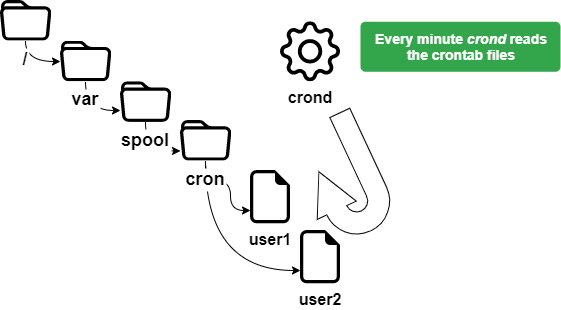

# Task-Verwaltung mit `cron`

In diesem Kapitel lernen Sie, wie Sie geplante Aufgaben verwalten.

****

**Ziele**: In diesem Kapitel lernen zukünftige Linux-Administratoren Folgendes:

:heavy_check_mark: wie GNU/Linux die Aufgabenplanung implementiert;  
:heavy_check_mark: die Verwendung von **`cron`** auf bestimmte Benutzer beschränken;  
:heavy_check_mark: Tasks planen.

:checkered_flag: **crontab**, **crond**, **scheduling**, **linux**

**Vorwissen**: :star: :star:  
**Komplexität**: :star: :star:

**Lesezeit**: 17 Minuten

****

## Allgemeines

Die Zeitplanung der Aufgaben wird mit dem `cron` Tool verwaltet. Es ermöglicht die periodische Ausführung von Aufgaben.

Dieses Hilfsprogramm ist dem Administrator für Systemaufgaben vorbehalten, kann aber von normalen Benutzern für Aufgaben oder Skripte verwendet werden, zu denen sie Zugriff haben. Um auf das `cron` Tool zuzugreifen, verwenden wir: `crontab`.

Der `cron` Dienst wird verwendet für:

* Wiederholte Verwaltungsvorgänge;
* Sicherungen;
* Überwachung der Systemaktivität;
* Programmausführung.

Der Name `crontab` steht für **cron-Tabelle**, kann aber als Task-Planungstabelle angesehen werden.

!!! warning "Warnhinweis"

    Um einen Zeitplan mit crontab einzurichten, muss die richtige Systemzeit eingestellt werden.

## Wie der Dienst funktioniert

Der `crond`-Daemon wird von einem `cron`-Dienst im Speicher ausgeführt.

Um seinen Status zu überprüfen:

```bash
[root] # systemctl status crond
```

!!! tip "Hinweis"

    Wenn der `crond`-Daemon nicht läuft, müssen Sie ihn manuell initialisieren und/oder beim Start automatisch starten. Selbst wenn Aufgaben geplant sind, werden sie nicht gestartet.

Initialisierung des `crond`-Daemons aus dem Handbuch:

```bash
[root]# systemctl {status|start|restart|stop} crond
```

Initialisierung des `crond`-Daemons beim Start:

```bash
[root]# systemctl enable crond
```

## Sicherheit

Um einen Zeitplan auszuführen, muss ein Benutzer die Berechtigung zur Nutzung des `cron`-Dienstes haben.

Diese Berechtigung hängt von den Informationen ab, die in den folgenden Dateien enthalten sind:

* `/etc/cron.allow`
* `/etc/cron.deny`

!!! warning "Warnhinweis"

    Wenn keine der beiden Dateien vorhanden ist, können alle Benutzer `cron` verwenden.

### Die `cron.allow` und `cron.deny` Dateien

Datei `/etc/cron.allow`

Nur Benutzer, die in dieser Datei enthalten sind, dürfen `cron` verwenden.

Wenn die Datei existiert und leer ist, können keine Benutzer `cron` verwenden.

!!! warning "Warnhinweis"

    Wenn `cron.allow` vorhanden ist, wird `cron.deny` **ignoriert**.

Datei `/etc/cron.deny`

Benutzer in dieser Datei dürfen `cron` nicht verwenden.

Wenn es leer ist, können alle Benutzer `cron` verwenden.

Standardmäßig ist die Datei `/etc/cron.deny` vorhanden und leer, und `/etc/cron.allow` ist nicht vorhanden. Wenn zwei Dateien gleichzeitig vorhanden sind, verwendet das System nur den Inhalt von `cron.allow` als Grundlage für die Beurteilung und ignoriert die Existenz der Datei `cron.deny.` vollständig.

### Einen Benutzer zulassen

Nur **user1** kann `cron` verwenden.

```bash
[root]# vi /etc/cron.allow
user1
```

### Benutzer verbieten

Nur **user2** kann `cron` nicht verwenden. Beachten Sie, dass die Datei `/etc/cron.allow` nicht existieren darf.

```bash
[root]# vi /etc/cron.deny
user2
```

Wenn derselbe Benutzer gleichzeitig in `/etc/cron.deny` und `/etc/cron.allow` existiert, kann der Benutzer cron normal verwenden.

## Aufgabenplanung - tasks scheduling

Wenn ein Benutzer eine Aufgabe plant, wird unter `/var/spool/cron/` eine Datei mit seinem Namen erstellt.

Diese Datei enthält alle Informationen, die `crond` über die von diesem Benutzer erstellten Aufgaben wissen muss, einschließlich der auszuführenden Befehle oder Programme und des Zeitplans für deren Ausführung (Stunde, Minute, Tag usw.). Beachten Sie, dass die kleinste Zeiteinheit, die `crond` erkennen kann, 1 Minute beträgt. Es gibt ähnliche Planungsaufgaben in RDBMS (wie MySQL), wobei zeitbasierte Planungsaufgaben als `Event Scheduler` (dessen erkennbare Zeiteinheit die Sekunde ist) und Ereignis-basierte Planungsaufgaben als `Trigger` bezeichnet werden.



### Der `crontab` Befehl

Der `crontab` Befehl wird verwendet, um die schedule-Datei zu verwalten.

```bash
crontab [-u user] [-e | -l | -r]
```

Beispiel:

```bash
[root]# crontab -u user1 -e
```

| Option            | Beschreibung                                       |
| ----------------- | -------------------------------------------------- |
| `-e`              | Bearbeitet die schedule-Datei mit vi               |
| `-l`              | Zeigt den Inhalt der schedule-Datei an             |
| `-u <user>` | Legt einen einzelnen Benutzer für den Betrieb fest |
| `-r`              | Schedule-Datei löschen                             |

!!! warning "Warnhinweis"

    `crontab` ohne Option löscht die alte schedule-Datei und wartet auf die Eingabe neuer Zeilen. Mit der Tastenkombination <kbd>ctrl</kbd> + <kbd>d</kbd> können Sie den Editiermodus verlassen.
    
    Nur `root` kann die `-u <user>` Option verwenden, um die Schedule-Datei eines anderen Benutzers zu bearbeiten.
    
    Das obige Beispiel ermöglicht es dem Root-Benutzer, eine Aufgabe für `user1` zu planen.

### Anwendungen von `crontab`

Die Anwendungen von `crontab` sind vielfältig und beinhalten:

* Änderungen an den `crontab` Dateien werden sofort berücksichtigt;
* Kein Neustart erforderlich.

Andererseits müssen folgende Punkte berücksichtigt werden:

* Das Programm muss autonom sein;
* Stellt Umleitungen bereit (stdin, stdout, stderr);
* Es ist nicht relevant, Befehle auszuführen, die Eingabe- und Ausgabeanfragen auf einem Terminal verwenden.

!!! note "Anmerkung"

    Es ist wichtig zu verstehen, dass der Zweck von Scheduling darin besteht, die Aufgaben automatisch auszuführen, ohne dass ein externes Eingreifen erforderlich ist.

## Die Datei `crontab`

Die Datei `crontab` ist nach folgenden Regeln strukturiert.

* Jede Zeile dieser Datei entspricht einem Schedule;
* Jede Zeile hat sechs Felder, 5 für die Zeit und 1 für die Aufgabe;
* Jedes Feld wird durch ein Leer- oder ein Tabulatorzeichen getrennt;
* Jede Zeile endet mit einem Zeilenvorschub;
* Das Zeichen `#` am Anfang der Zeile kommentiert sie aus.

```bash
[root]# crontab –e
10 4 1 * * /root/scripts/backup.sh
1  2 3 4 5       6
```

| Feld | Beschreibung              | Details                   |
| ---- | ------------------------- | ------------------------- |
| 1    | Minute(n)                 | Von 0 bis 59              |
| 2    | Stunde(n)                 | Von 0 bis 23              |
| 3    | Tag(e) des Monats         | Von 1 bis 31              |
| 4    | Monat des Jahres          | Von 1 bis 12              |
| 5    | Tag(e) der Woche          | Von 0 bis 7 (0=7=Sonntag) |
| 6    | Die auszuführende Aufgabe | Befehl oder Skript        |

!!! warning "Warnhinweis"

    Die auszuführenden Aufgaben müssen absolute Pfade verwenden und, wenn möglich, Weiterleitungen nutzen.

Um die Notation für die Definition der Zeit zu vereinfachen, empfiehlt es sich, spezielle Symbole zu verwenden.

| Besondere Symbole | Beschreibung                                       |
| ----------------- | -------------------------------------------------- |
| `*`               | Zeigt alle Zeitwerte des Feldes an                 |
| `-`               | Kennzeichnet einen kontinuierlichen Zeitbereich    |
| `,`               | Kennzeichnet einen diskontinuierlichen Zeitbereich |
| `/`               | Gibt ein Zeitintervall an                          |

Beispiele:

Skript ausgeführt am 15. April um 10:25 Uhr:

```bash
25 10 15 04 * /root/scripts/script > /log/…
```

Führt die Aufgabe einmal täglich um 11 Uhr und um 16 Uhr aus:

```bash
00 11,16 * * * /root/scripts/script > /log/…
```

Die Aufgabe wird täglich einmal pro Stunde von 11 bis 16 Uhr ausgeführt:

```bash
00 11-16 * * * /root/scripts/script > /log/…
```

Läuft an Werktagen während der Arbeitszeit alle 10 Minuten:

```bash
*/10 8-17 * * 1-5 /root/scripts/script > /log/…
```

Für den Root-Benutzer hat `crontab` auch einige spezielle Zeiteinstellungen:

| @Option   | Beschreibung                                                          |
| --------- | --------------------------------------------------------------------- |
| @reboot   | Task beim Neustart des Systems ausführen                              |
| @hourly   | Task jede Stunde ausführen                                            |
| @daily    | Der Task läuft täglich unmittelbar nach Mitternacht                   |
| @weekly   | Der Task läuft jeden Sonntag kurz nach Mitternacht                    |
| @monthly  | Task wird am ersten Tag des Monats direkt nach Mitternacht ausgeführt |
| @annually | Der Task läuft am 1. Januar unmittelbar nach Mitternacht              |

### Ausführungsprozess des Tasks

Ein Benutzer, rockstar, möchte seine `crontab` Datei bearbeiten:

1. Der `crond`-Daemon prüft, ob der Benutzer die Berechtigung hat (`/etc/cron.allow` und `/etc/cron.deny`).

2. Falls er dazu berechtigt ist, bearbeitet er seine `crontab`-Datei (`/var/spool/cron/rockstar`).

Der `crond`-Daemon:

* Reads – Liest jede Minute die geplanten Aufgabendateien aller Benutzer.
* Runs – Führt Aufgaben gemäß dem Zeitplan aus.
* Writes – Schreibt die entsprechenden Ereignisse und Meldungen in die Datei (`/var/log/cron`).
