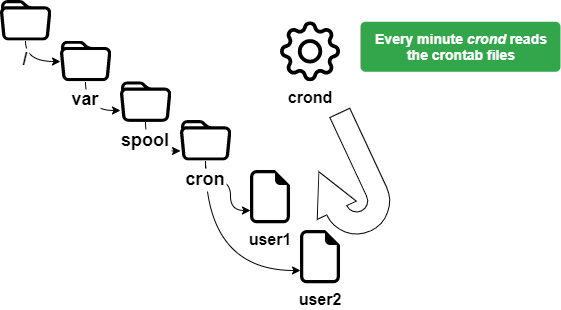

# Gestion des Tâches

Dans ce chapitre, vous allez apprendre à gérer les tâches planifiées.

****

**Objectifs** : Dans ce chapitre, les futurs administrateurs Linux vont apprendre comment :

:heavy_check_mark: Linux gère la planification des tâches ;  
:heavy_check_mark: restreint l'utilisation de **`cron`** à certains utilisateurs ;  
:heavy_check_mark: planifie les tâches.

:checkered_flag: **crontab**, **crond**, **planification**, **linux**

**Connaissances** : :star: :star:  
**Complexité** : :star: :star:

**Temps de lecture** : 15 minutes

****

## Généralités

La planification des tâches est gérée avec l’utilitaire `cron`. Il permet l’exécution périodique des tâches.

Il est réservé à l’administrateur pour les tâches systèmes mais peut être utilisé par les utilisateurs standards pour les tâches ou les scripts auxquels ils ont accès. Pour accéder à l'utilitaire `cron`, nous utiliserons `crontab`.

Le service `cron` sert notamment pour :

* Les opérations d’administration répétitives ;
* Les sauvegardes ;
* La surveillance de l’activité du système ;
* L’exécution de programme.

`crontab` est le diminutif de **chrono table** mais peut être considéré comme une table de planification des tâches.

!!! warning "Avertissement"

    Pour configurer un schedule, le système doit être réglé à l'heure exacte.

## Comment fonctionne le service

Un démon `crond` présent exécute le service `cron` en mémoire.

Pour vérifier son statut :

```bash
[root] # systemctl status crond
```

!!! tip "Astuce"

    Si le démon `crond` n'est pas en cours d'exécution, vous devrez le lancer manuellement et/ou automatiquement au démarrage. En effet, même si des tâches sont planifiées, elles ne seront pas lancées.

Initialisation du démon `crond` dans le manuel :

```bash
[root]# systemctl {status|start|restart|stop} crond
```

Initialisation du démon `crond` au démarrage :

```bash
[root]# systemctl enable crond
```

## Sécurité

Afin d'implémenter un schedule, un utilisateur doit avoir la permission d'utiliser le service `cron`.

Cette permission varie en fonction des informations contenues dans les fichiers ci-dessous :

* `/etc/cron.allow`
* `/etc/cron.deny`

!!! warning "Avertissement"

    Si aucun fichier n'est présent, tous les utilisateurs peuvent utiliser `cron`.

### Les fichiers `cron.allow` et `cron.deny`

Le fichier `/etc/cron.allow`

Seuls les utilisateurs contenus dans ce fichier sont autorisés à utiliser `cron`.

S'il existe et est vide, aucun utilisateur ne peut utiliser `cron`.

!!! warning "Avertissement"

    Si `cron.allow` existe, `cron.deny` est **ignoré**.

Le fichier `/etc/cron.deny`

Les utilisateurs indiqués dans ce fichier ne sont pas autorisés à utiliser `cron`.

S'il est vide, tous les utilisateurs peuvent utiliser `cron`.

Par défaut, le fichier `/etc/cron.deny` existe et est vide et `/etc/cron.allow` n'existe pas. Lorsque deux fichiers existent en même temps, le système utilise uniquement le contenu de `cron.allow` comme référence et ignore complètement l'existence des fichiers `cron.deny`.

### Autoriser un utilisateur

Seul **user1** pourra utiliser `cron`.

```bash
[root]# vi /etc/cron.allow
user1
```

### Interdire un utilisateur

Seul **user2** ne sera pas capable d'utiliser `cron`. Notez que le fichier `/etc/cron.allow` ne peut pas exister.

```bash
[root]# vi /etc/cron.deny
user2
```

Si le même utilisateur figure à la fois dans `/etc/cron.deny` et `/etc/cron.allow`, il peut utiliser `cron` normalement.

## Planification des tâches

Lorsqu'un utilisateur planifie une tâche, un fichier portant son nom est créé dans le répertoire `/var/spool/cron/`.

Ce fichier contient toutes les informations que `crond` doit connaître concernant les tâches créées par cet utilisateur, y compris les commandes ou programmes à exécuter, ainsi que le calendrier de leur exécution (heure, minute, jour, etc.). Note that the minimum time unit that `crond` can recognize is 1 minute. Il existe des tâches de planification similaires dans les SGBDR (comme MySQL), où les tâches de planification basées sur le temps sont appelées « Planificateur d'événements, Event Scheduler » (dont l'unité de temps reconnaissable est 1 seconde), et les tâches de planification basées sur les événements sont appelées « Déclencheurs, Triggers ».



### La commande `crontab`

La commande `crontab` est utilisée pour gérer le fichier de planification.

```bash
crontab [-u utilisateur] [-e | -l | -r]
```

Exemple :

```bash
[root]# crontab -u user1 -e
```

| Option            | Description                                    |
| ----------------- | ---------------------------------------------- |
| `-e`              | Modifie le fichier de planification avec vi    |
| `-l`              | Affiche le contenu du fichier de planification |
| `-u <user>` | Spécifier un seul utilisateur à considérer     |
| `-r`              | Supprime le fichier de planification           |

!!! warning "Avertissement"

    `crontab` sans options supprime l'ancien fichier de planification et attend que l'utilisateur entre de nouvelles lignes. Vous devez utiliser <kbd>ctrl</kbd> + <kbd>d</kbd> pour quitter le mode éditeur.
    
    Seul l'utilisateur `root` peut utiliser l'option `-u <utilisateur>` pour gérer le fichier de planification d'un autre utilisateur.
    
    L'exemple ci-dessus permet à root de planifier une tâche pour l'utilisateur user1.

### Utilisations de `crontab`

Les utilisations de `crontab` sont nombreuses et incluent :

* Modifications des fichiers `crontab` prises en compte immédiatement ;
* Pas besoin de redémarrer.

Par contre, il faut tenir compte des points suivants :

* Le programme doit être autonome ;
* Prise en charge des redirections (stdin, stdout, stderr);
* Il n'est pas pertinent d'exécuter des commandes qui utilisent des requêtes d'entrée/sortie sur un terminal.

!!! note "Remarque"

    Il est important de comprendre que le but de la programmation du schedule est d’effectuer des tâches automatiquement, sans nécessiter d’intervention extérieure.

## Le fichier `crontab`

Le fichier `crontab` est structuré selon les règles suivantes.

* Chaque ligne de ce fichier correspond à un planning ;
* Chaque ligne a six champs, 5 pour la date et 1 pour la commande;
* Chaque champ est séparé par un espace ou un tab ;
* Chaque ligne se termine par un retour chariot ;
* Un `#` au début de la ligne indique un commentaire.

```bash
[root]# crontab –e
10 4 1 * * /root/scripts/backup.sh
1  2 3 4 5       6
```

| Champ | Description           | Détail                      |
| ----- | --------------------- | --------------------------- |
| 1     | Minute(s)             | De 0 à 59                   |
| 2     | Heure(s)              | De 0 à 23                   |
| 3     | Jour(s) du mois       | De 1 à 31                   |
| 4     | Mois de l'année       | De 1 à 12                   |
| 5     | Jour(s) de la semaine | De 0 à 7 (0=7=dimanche)     |
| 6     | Tâche à exécuter      | Commande complète ou script |

!!! warning "Avertissement"

    Les tâches à effectuer doivent utiliser des chemins absolus et, si possible, utiliser des redirections.

Pour simplifier la notation relative à la définition du temps, il est conseillé d'utiliser des symboles spécifiques.

| Symboles Spéciaux | Description                                  |
| ----------------- | -------------------------------------------- |
| `*`               | Indique toutes les valeurs de temps du champ |
| `-`               | Indique une plage de temps continue          |
| `,`               | Indique une plage de temps discontinue       |
| `-n`              | Indique un intervalle de temps               |

Exemples :

Script exécuté le 15 avril à 10h25:

```bash
25 10 15 04 * /root/scripts/script > /log/…
```

Lancement à 11: 00 puis à 16: 00 tous les jours :

```bash
00 11,16 * * * /root/scripts/scrip t > /log/…
```

Lancement à chaque heure de 11:00 à 16:00 tous les jours :

```bash
00 11-16 * * * /root/scripts/script > /log/…
```

Lancer toutes les 10 minutes pendant les heures de travail des jours de la semaine :

```bash
*/10 8-17 * * 1-5 /root/scripts/script > /log/…
```

Pour l'utilisateur root `crontab` a également des paramètres de temps spéciaux :

| Réglages      | Description                                                    |
| ------------- | -------------------------------------------------------------- |
| @reboot       | Exécute une commande au redémarrage du système                 |
| @hourly       | Exécuter la commande toutes les heures                         |
| @daily        | Exécute tous les jours juste après minuit                      |
| @hebdomadaire | Exécute la commande tous les dimanches juste après minuit      |
| @mensuel      | Exécute la commande le premier jour du mois juste après minuit |
| @annuel       | Exécute le 1er janvier juste après minuit                      |

### Processus d'exécution de la tâche

Un utilisateur, rockstar, veut éditer son fichier `crontab` :

1. Le démon `crond` vérifie si l'utilisateur est autorisé (`/etc/cron.allow` et `/etc/cron.deny`).

2. Si l'utilisateur y est autorisé, il accède à son fichier `crontab` (`/var/spool/cron/rockstar`).

Le démon `crond` :

* Reads - Lit les fichiers de tâches planifiées de tous les utilisateurs toutes les minutes.
* Runs - Exécute les tâches selon le calendrier.
* Writes - Écrit les événements et messages correspondants dans le fichier (`/var/log/cron`).
