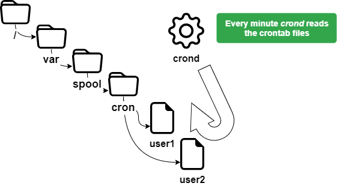

# Task Management

In this chapter you will learn how to manage scheduled tasks.

****

**Objectives**: In this chapter, future Linux administrators will learn how to:

:heavy_check_mark: Linux deals with the tasks scheduling;
:heavy_check_mark: restrict the use of **`cron`** to certain users;
:heavy_check_mark: schedule tasks.

:checkered_flag: **crontab**, **crond**, **scheduling**, **linux**

**Knowledge**: :star: :star:  
**Complexity**: :star: :star:

**Reading time**: 15 minutes

****

## Generalities

The scheduling of tasks is managed with the `cron` utility. It allows the periodic execution of tasks.

It is reserved to the administrator for system tasks but can be used by normal users for tasks or scripts that they have access to. To access the `cron` utility, we use: `crontab`.

The `cron` service is used for:

* Repetitive administration operations;
* Backups;
* Monitoring of system activity;
* Program execution.

`crontab` is short for **cron table**, but can be thought of as a task scheduling table.

!!! Warning

    To set up a schedule, the system must have the correct time set.

## How the service works

The `cron` service is run by a `crond` daemon present in memory.

To check its status:

```bash
[root] # systemctl status crond
```

!!! Tip

    If the `crond` daemon is not running, you will have to initialize it manually and/or automatically at startup. Indeed, even if tasks are scheduled, they will not be launched.

Initialization of the `crond` daemon in manual:

```bash
[root]# systemctl {status|start|restart|stop} crond
```

Initialization of the `crond` daemon at startup:

```bash
[root]# systemctl enable crond
```

## Security

In order to implement a schedule, a user must have permission to use the `cron` service.

This permission varies according to the information contained in the files below:

* `/etc/cron.allow`
* `/etc/cron.deny`

!!! Warning

    If neither file is present, all users can use `cron`.

### The `cron.allow` and `cron.deny` Files

File `/etc/cron.allow`

Only users contained in this file are allowed to use `cron`.

If it exists and is empty, no users can use `cron`.

!!! Warning

    If `cron.allow` is present, `cron.deny` is **ignored**.

File `/etc/cron.deny`

Users in this file are not allowed to use `cron`.

If it is empty, all users can use `cron`.

By default, `/etc/cron.deny` exists and is empty and `/etc/cron.allow` does not exist.

### Allowing a user

Only **user1** will be able to use `cron`.

```bash
[root]# vi /etc/cron.allow
user1
```

### Prohibit a user

Only **user2** will not be able to use `cron`.

```bash
[root]# vi /etc/cron.deny
user2
```

`cron.allow` must not be present.

## Scheduling tasks

When a user schedules a task, a file with his name is created under `/var/spool/cron/`.

This file contains all the information the `crond` needs to know regarding all tasks created by this user, the commands or programs to run, and when to run them (hour, minute, day ...).



### The `crontab` command

The `crontab` command is used to manage the schedule file.

```bash
crontab [-u user] [-e | -l | -r]
```

Example:

```bash
[root]# crontab -u user1 -e
```

| Option |Description                                              |
|--------|-----------------------------------------------------------|
| `-e`   | Edits the schedule file with vi                            |
| `-l`   | Displays the contents of the schedule file                |
| `-u`   | Sets the name of the user whose schedule file is to be manipulated |
| `-r`   | Deletes the schedule file                                  |

!!! Warning

    `crontab` without option deletes the old schedule file and waits for the user to enter new lines. You have to press <kbd>ctrl</kbd> + <kbd>d</kbd> to exit this editing mode.

    Only `root` can use the `-u user` option to manage another user's schedule file.

    The example above allows root to schedule a task for user1.

### Uses of `crontab`

The uses of `crontab` are many and include:

* Modifications to the `crontab` files taken into account immediately;
* No need to restart.

On the other hand, the following points must be taken into account:

* The program must be autonomous;
* Provide redirections (stdin, stdout, stderr);
* It is not relevant to run commands that use input/output requests on a terminal.

!!! Note

    It is important to understand that the purpose of scheduling is to perform tasks automatically, without the need for external intervention.

## The `crontab` file

The `crontab` file is structured according to the following rules.

* Each line of this file corresponds to a schedule;
* Each line has six fields, 5 for the time and 1 for the order;
* Each field is separated by a space or a tab;
* Each line ends with a carriage return;
* A `#` at the beginning of the line comments it.

```bash
[root]# crontab –e
10 4 1 * * /root/scripts/backup.sh
1  2 3 4 5       6
```

| Field | Description         | Detail                   |
|-------|---------------------|--------------------------|
| 1     | Minute(s)           | From 0 to 59             |
| 2     | Hour(s)             | From 0 to 23             |
| 3     | Day(s) of the month | From 1 to 31             |
| 4     | Month of the year   | From 1 to 12             |
| 5     | Day(s) of the week  | From 0 to 7 (0=7=sunday) |
| 6     | Task to execute     | Full command or script   |

!!! Warning

    The tasks to be executed must use absolute paths and if possible, use redirects.

In order to simplify the notation for the definition of time, it is advisable to use special symbols.

| Wildcards | Description                      |
|---------------|----------------------------------|
| `*`           | Indicates all possible values of the field |
| `-`           | Indicates a range of values      |
| `,`           | Indicates a list of values       |
| `/`           | Defines a step                   |

Examples:

Script executed on April 15 at 10:25 am:

```bash
25 10 15 04 * /root/scripts/script > /log/…
```

Run at 11am and then at 4pm every day:

```bash
00 11,16 * * * /root/scripts/script > /log/…
```

Run every hour from 11am to 4pm every day:

```bash
00 11-16 * * * /root/scripts/script > /log/…
```

Run every 10 minutes during working hours:

```bash
*/10 8-17 * * 1-5 /root/scripts/script > /log/…
```

For the root user, `crontab` also has some special time settings:

| Setting  | Description                   |
|----------|-------------------------------|
| @reboot  | Runs a command on system reboot  |
| @hourly  | Runs a command every hour        |
| @daily   | Runs daily just after midnight|
| @weekly  | Runs command every Sunday just after midnight    |
| @monthly | Runs command on the first day of the month just after midnight |
| @annually| Runs January 1st just after midnight |

### Task execution process

A user, rockstar, wants to edit his `crontab` file:

1. `crond` checks to see if he is allowed (`/etc/cron.allow` and `/etc/cron.deny`).

2. If he is, he accesses his `crontab` file (`/var/spool/cron/rockstar`).

    Every minute `crond` reads the schedule files.

3. It executes the scheduled tasks.

4. It reports systematically in a log file (`/var/log/cron`).
