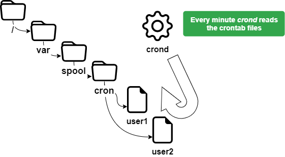

# Управління задачами

У цьому розділі ви дізнаєтесь, як керувати запланованими задачами.

****

**Цілі**: у цьому розділі майбутні адміністратори Linux дізнаються, як:

:heavy_check_mark: Linux займається плануванням завдань;   
:heavy_check_mark: обмежує використання **`cron`** певними користувачами;   
:heavy_check_mark: скласти розклад задач.

:checkered_flag: **crontab**, **crond**, **scheduling**, **linux**

**Знання**: :star: :star:  
**Складність**: :star: :star:

**Час читання**: 15 хвилин

****

## Загальні положення

Керування плануванням задач здійснюється за допомогою утиліти `cron`. Це дозволяє періодично виконувати задачі.

Ця утиліта зарезервована для адміністратора для системних задач, але може використовуватися звичайними користувачами для задач або сценаріїв, до яких вони мають доступ. Щоб отримати доступ до утиліти `cron`, ми використовуємо: `crontab`.

Служба `cron` використовується для:

* Повторювані операції адміністрування;
* Резервні копії;
* Моніторинг діяльності системи;
* Виконання програми.

`crontab` — це скорочення від **cron table**, але його можна розглядати як таблицю планування задач.

!!! Увага

    Щоб налаштувати розклад, у системі має бути правильно встановлений час.

## Як працює сервіс

Служба `cron` запускається демоном `crond`, присутнім у пам’яті.

Щоб перевірити його статус:

```
[root] # systemctl status crond
```

!!! tip "Порада"

    Якщо демон `crond` не працює, вам доведеться ініціалізувати його вручну та/або автоматично під час запуску. Дійсно, навіть якщо задачі заплановані, вони не будуть запущені.

Ініціалізація демона `crond` вручну:

```
[root]# systemctl {status|start|restart|stop} crond
```

Ініціалізація демона `crond` під час запуску:

```
[root]# systemctl enable crond
```

## Безпека

Щоб реалізувати розклад, користувач повинен мати дозвіл на використання служби `cron`.

Цей дозвіл залежить від інформації, що міститься у файлах нижче:

* `/etc/cron.allow`
* `/etc/cron.deny`

!!! Важливо

    Якщо жодного файлу немає, усі користувачі можуть використовувати `cron`.

### Файли `cron.allow` і `cron.deny`

Файл `/etc/cron.allow`

Лише користувачам, які містяться в цьому файлі, дозволено використовувати `cron`.

Якщо він існує і порожній, користувачі не можуть використовувати `cron`.

!!! Увага

    Якщо присутній `cron.allow`, `cron.deny` **ігнорується**.

Файл `/etc/cron.deny`

Користувачам цього файлу заборонено використовувати `cron`.

Якщо він порожній, усі користувачі можуть використовувати `cron`.

За замовчуванням `/etc/cron.deny` існує та є порожнім, а `/etc/cron.allow` не існує.

### Надати дозвіл користувачу

Лише **user1** зможе використовувати `cron`.

```
[root]# vi /etc/cron.allow
user1
```

### Заборонити користувача
Лише **user2** не зможе використовувати `cron`.

```
[root]# vi /etc/cron.deny
user2
```

`cron.allow` не має бути присутнім.

## Планування задач

Коли користувач планує завдання, у `/var/spool/cron/` створюється файл із його іменем.

Цей файл містить усю інформацію, яку має знати `crond` щодо всіх задач, створених цим користувачем, команд або програм, які потрібно виконати, і часу їх запуску (година, хвилина, день ...).



### Команда `crontab`

Команда `crontab` використовується для керування файлом розкладу.

```
crontab [-u user] [-e | -l | -r]
```

Приклад:

```
[root]# crontab -u user1 -e
```

| Опція | Опис                                                                 |
| ----- | -------------------------------------------------------------------- |
| `-e`  | Редагує файлу розкладу за допомогою vi                               |
| `-l`  | Відображення вмісту файлу розкладу                                   |
| `-u`  | Встановлює ім’я користувача, файлом розкладу якого потрібно керувати |
| `-r`  | Видаляє файл розкладу                                                |

!!! Важливо

    `crontab` без опції видаляє старий файл розкладу та чекає, поки користувач введе нові рядки. Ви повинні натиснути <kbd>ctrl</kbd> + <kbd>d</kbd> щоб вийти з цього режиму редагування.
    
    Тільки `root` може використовувати параметр `-u user` для керування файлом розкладу іншого користувача.
    
    Приклад вище дозволяє root запланувати завдання для користувача1.

### Використання `crontab`

Застосувань `crontab` багато та включають в себе:

* Зміни файлів `crontab` враховуються негайно;
* Не потрібно перезапускати.

З іншого боку, необхідно враховувати наступні моменти:

* Програма має бути автономною;
* Забезпечити перенаправлення (stdin, stdout, stderr);
* Виконувати команди, які використовують запити введення/виведення на терміналі, не має значення.

!!! Примітка

    Важливо розуміти, що метою планування є автоматичне виконання задач без необхідності стороннього втручання.

## Файл `crontab`

Файл `crontab` структурований відповідно до наступних правил.

* Кожен рядок цього файлу відповідає розкладу;
* Кожен рядок має шість полів, 5 для часу та 1 для порядку;
* Кожне поле відокремлюється пробілом або табуляцією;
* Кожен рядок закінчується символом повернення каретки;
* `#` на початку рядка коментує його.

```
[root]# crontab –e
10 4 1 * * /root/scripts/backup.sh
1  2 3 4 5       6
```

| Поле | Опис                   | Значення                   |
| ---- | ---------------------- | -------------------------- |
| 1    | Хвилина(и)             | З 0 до 59                  |
| 2    | Година(и)              | З 0 до 23                  |
| 3    | День місяця            | З 1 до 31                  |
| 4    | Місяць року            | З 1 до 12                  |
| 5    | День тижня             | З 0 до 7 (0=7=неділя)      |
| 6    | Завдання для виконання | Повна команда або сценарій |

!!! Увага

    Завдання, які потрібно виконати, мають використовувати абсолютні шляхи та, якщо можливо, використовувати перенаправлення.

Для спрощення позначення для визначення часу доцільно використовувати спеціальні символи.

| Символи підстановки | Опис                             |
| ------------------- | -------------------------------- |
| `*`                 | Вказує всі можливі значення поля |
| `-`                 | Вказує діапазон значень          |
| `,`                 | Вказує на список значень         |
| `/`                 | Визначає крок                    |

Приклади:

Сценарій виконано 15 квітня о 10:25:

```
25 10 15 04 * /root/scripts/script > /log/…
```

Запуск об 11:00, а потім о 16:00 щодня:

```
00 11,16 * * * /root/scripts/script > /log/…
```

Запуск щогодини з 11:00 до 16:00 щодня:

```
00 11-16 * * * /root/scripts/script > /log/…
```

Запуск кожні 10 хвилин у робочий час:

```
*/10 8-17 * * 1-5 /root/scripts/script > /log/…
```

Для користувача root `crontab` також має деякі спеціальні налаштування часу:

| Налаштування | Опис                                                       |
| ------------ | ---------------------------------------------------------- |
| @reboot      | Виконує команду під час перезавантаження системи           |
| @hourly      | Виконує команду щогодини                                   |
| @daily       | Виконує щодня відразу після півночі                        |
| @weekly      | Виконує команду щонеділі відразу після півночі             |
| @monthly     | Виконує команду в перший день місяця відразу після півночі |
| @annually    | Виконується 1 січня відразу після півночі                  |

### Процес виконання завдання

Користувач, rockstar, хоче відредагувати свій файл `crontab`:

1) `crond` перевіряє, чи дозволено йому (`/etc/cron.allow` та `/etc/cron.deny`).

2) Якщо так, він отримує доступ до свого файлу `crontab` (`/var/spool/cron/rockstar`).

Щохвилини `crond` читає файли розкладу.

3) Виконує заплановані задачі.

4) Систематично звітує у файлі журналу (`/var/log/cron`).
