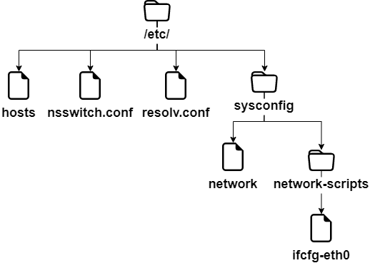

# Implementierung des Netzwerks

In diesem Kapitel erfahren Sie, wie Sie mit dem Netzwerk arbeiten und das Netzwerk verwalten.

****

**Ziele**: In diesem Kapitel lernen Sie Folgendes:

:heavy_check_mark: eine Workstation konfigurieren, um DHCP zu benutzen;  
:heavy_check_mark: eine Workstation so konfigurieren, dass sie eine statische Konfiguration verwendet;  
:heavy_check_mark: eine Workstation konfigurieren, um ein Gateway zu benutzen;  
:heavy_check_mark: eine Workstation konfigurieren, um einen DNS-Server zu benutzen;  
:heavy_check_mark: beim Netzwerk einer Workstation, Probleme lösen.

:checkered_flag: **Netzwerk**, **Linux**, **IP**

**Wissen** : :star: :star:  
**Komplexität** : :star: :star:

**Lesezeit**: 31 Minuten

****

## Allgemeines

Um dieses Kapitel zu veranschaulichen, verwenden wir die folgende Architektur.


Dabei werden wir Folgendes berücksichtigen:

* Integration in ein LAN (lokales Netzwerk);
* die Konfiguration eines Gateways, um einen entfernten Server zu erreichen;
* die Konfiguration eines DNS-Servers und die Implementierung der Namensauflösung.

Die minimalen Parameter, die für die Maschine definiert werden müssen, sind folgende:

* der Name der Maschine;
* die IP-Adresse;
* die Subnetzmaske.

Beispiel:

* `pc-rocky`;
* `192.168.1.10`;
* `255.255.255.0`.

Die Notation namens CIDR wird immer häufiger: 192.168.1.10/24

IP-Adressen werden für das korrekte Routen von Nachrichten (Pakete) verwendet. Sie sind in zwei Teile aufgeteilt:

* der feste Teil, der das Netzwerk identifiziert;
* die Kennung des Hosts im Netzwerk.

Die Subnetz-Maske ist ein Satz von **4 Bytes** um folgende Adressen zu isolieren:

* die Netzwerkadresse (**NetID** oder **SubnetID**) durch eine bitweise logische UND-Verknüpfung zwischen der IP-Adresse und der Maske;
* die Host-Adresse (**HostID**) durch eine bitweise logische UND-Verknüpfung zwischen der IP-Adresse und das Komplement der Maske.

Es gibt auch spezifische Adressen innerhalb eines Netzwerks, die identifiziert werden müssen. Die erste Adresse eines Bereichs und der letzteren haben eine bestimmte Rolle:

* Die erste Adresse eines Bereichs ist die **Netzwerkadresse**. Sie dient zur Identifizierung von Netzwerken und zur Weiterleitung von Informationen von einem Netzwerk zu einem anderen.

* Die letzte Adresse eines Bereichs ist die **Broadcast-Adresse**. Sie wird zur Übertragung von Informationen auf alle Maschinen im Netzwerk verwendet.

### MAC-Adresse / IP-Adresse

Eine **MAC-Adresse** ist ein physikalischer Identifikator, der bei der Herstellung auf das Gerät geschrieben wurde. Dies wird manchmal als Hardware-Adresse bezeichnet. Es besteht aus 6 Bytes, die oft in hexadezimaler Form angegeben werden (z.B. 5E:FF:56:A2:AF:15). Genauer: 3 Bytes des Herstellers und 3 Bytes als Seriennummer.

!!! warning "Warnhinweis"

    Diese letzte Behauptung verliert heutzutage bei Virtualisierung etwas an Bedeutung. Es gibt auch noch Softwarelösungen zum Ändern der MAC-Adresse.

Eine Internet-Protokoll (**IP**) Adresse ist eine Identifikationsnummer, die dauerhaft oder vorübergehend jedem Gerät zugewiesen ist, das über das Internet-Protokoll an ein Computernetzwerk angeschlossen ist. Ein Teil definiert die Netzwerkadresse (NetID oder SubnetID), der andere Teil definiert die Adresse des Hosts im Netzwerk (HostID). Die relative Größe jedes Teils variiert je nach Netz (Sub-)Maske.

Eine IPv4-Adresse definiert eine Adresse auf 4 Bytes. Die Anzahl der verfügbaren Adressen, die nahe an der Sättigung angekommen war, erforderte die Schaffung eines neuen Standards. IPv6 wurde auf 16 Bytes definiert.

IPv6 wird oft durch 8 Gruppen von 2 Bytes durch einen Doppelpunkt getrennt repräsentiert. Unbedeutende Nullen können weggelassen werden, eine oder mehrere Gruppen von 4 aufeinanderfolgenden Nullen können durch zwei aufeinander folgende Doppelpunkte ersetzt werden.

Subnetzmasken haben von 0 bis 128 Bit. (zum Beispiel 21ac:0000:0000:0611:21e0:00ba:321b:54da/64 oder 21ac::611:21e0:ba:321b:54da/64)

In einer Webadresse oder URL (Uniform Resource Locator), eine IPv4-Adresse kann von einem Doppelpunkt und einer Port-Adresse gefolgt werden (welche die Anwendung angibt, an die die Daten geschickt werden). Um Verwirrung in einer URL zu vermeiden, wird die IPv6-Adresse auch in eckigen Klammern [ ], Doppelpunkt, Port-Adresse geschrieben.

IP- und MAC-Adressen müssen im Netzwerk eindeutig sein!

### DNS-Domäne

Client-Maschinen können Teil einer DNS (**Domain Name System**, z.B. `mydomain.lan`) Domain sein.

Der voll qualifizierte Maschinenname (**FQDN**) wird `pc-rocky.mydomain.lan`.

Ein Satz von Computern kann in eine logische Namensauflösung gruppiert werden, die als DNS-Domain bezeichnet wird. Eine DNS-Domäne ist natürlich nicht auf ein einziges physikalisches Netzwerk beschränkt.

Damit ein Computer Teil einer DNS-Domain sein kann, muss er ein DNS-Suffix bekommen (hier `mydomain.lan`) sowie Server, die er abfragen kann.

### Erinnerung an das OSI-Modell

!!! note "Eselsbrücke"

    Um sich an die Reihenfolge der Schichten des OSI-Modells zu erinnern, merke den folgenden Satz: __Please Do Not Touch Steven's Pet Alligator__.

| Layer            | Protokolle                                 |
| ---------------- | ------------------------------------------ |
| 7 - Anwendung    | POP, IMAP, SMTP, SSH, SNMP, HTTP, FTP, ... |
| 6 - Präsentation | ASCII, MIME, ...                           |
| 5 - Session      | TLS, SSL, NetBIOS, ...                     |
| 4 - Transport    | TLS, SSL, TCP, UDP, ...                    |
| 3 - Netzwerk     | IPv4, IPv6, ARP, ...                       |
| 2 - Datenlink    | Ethernet, WiFi, Token Ring, ...            |
| 1 - Physikalisch | Kabel, Glasfasern, Funkwellen, usw...      |

**Ebene 1** (Physikalisch) unterstützt die Übertragung über einen Kommunikationskanal (Wi-Fi, optische Faser, RJ-Kabel, usw...). Einheit: Bit.

**Layer 2** (Data Link) unterstützt Netzwerktopologie (Token-Ring, Stern, Bus, usw...), Datenaufteilung und Übertragungsfehler. Einheit: Frame.

**Layer 3** (Netzwerk) unterstützt End-zu-Ende-Datenübertragung (IP-Routing = Gateway). Einheit: Das Paket.

**Layer 4** (Transport) unterstützt Service Typ (verbunden oder nicht verbunden), Verschlüsselung und Strömungskontrolle. Einheit: das Segment oder das Datagram.

**Layer 5** (Session) unterstützt die Kommunikation zwischen zwei Computern.

**Layer 6** (Präsentation) repräsentiert den Bereich, der unabhängig von Daten auf der Anwendungsebene ist. Im Wesentlichen übersetzt diese Ebene vom Netzwerkformat ins Anwendungsformat oder vom Anwendungsformat ins Netzwerkformat.

**Layer 7** (Anwendung) repräsentiert den Kontakt mit dem Benutzer. Es umfasst die vom Netzwerk angebotenen Dienste: http, dns, ftp, imap, pop, smtp, usw...

## Die Benennung von Schnittstellen

*lo* ist die "**loopback**"-Schnittstelle, die es TCP/IP Programmen erlaubt, miteinander zu kommunizieren, ohne den lokalen Rechner zu verlassen. Dies aktiviert Testing, wenn das **-Netzwerkmodul des Systems ordnungsgemäß** funktioniert und ermöglicht auch das Anpingen des localhost. Alle Pakete, die durch localhost eingehen werden, gehen auch durch localhost aus. Die empfangenen Pakete sind die gesendeten Pakete.

Der Linux-Kernel weist Schnittstellennamen mit einem bestimmten Präfix je nach Typ zu. Üblicherweise begannen beispielsweise alle **Ethernet** Schnittstellen mit **eth**. Dem Präfix folgte eine Nummer, die erste 0 (eth0, eth1, eth2...). Die Wifi-Schnittstellen erhielten ein wlan prefix.

Auf Rocky8 Linux-Distributionen wird systemd Schnittstellen mit der neuen Konvention benennen, bei denen "X" eine Nummer darstellt:

* `enoX`: Onboard-Geräte
* `ensX`: PCI Express Hotplug Slot
* `enpXsX`: physikalische/geographische Position des Steckverbinders der Hardware
* ...

## Verwendung dès `ip` Befehls

Vergessen Sie den alten `ifconfig` Befehl! Denke `ip`!

!!! note "Anmerkung"

    Kommentar für Administratoren älterer Linux-Systeme:
    
    Der historische Netzwerk-Management-Befehl ist `ifconfig`. Dieser Befehl wurde durch den `ip`-Befehl ersetzt, der Netzwerkadministratoren bereits gut bekannt ist.
    
    Das Kommando `ip` ist der Befehl par excellence, der **IP-Adresse, ARP, Routing, usw...** verwaltet.
    
    Der Befehl `ifconfig` ist standardmäßig nicht mehr auf Rocky8 installiert.
    
    Es ist wichtig, jetzt gute Gewohnheiten zu bekommen.

## Der Hostname

Der `hostname` Befehl zeigt oder setzt den Hostnamen des Systems

```bash
hostname [-f] [hostname]
```

| Option | Beschreibung                |
| ------ | --------------------------- |
| `-f`   | FQDN anzeigen               |
| `-i`   | System-IPs-Adresse anzeigen |

!!! tip "Hinweis"

    Dieser Befehl wird von verschiedenen Netzwerkprogrammen verwendet, um den Rechner zu identifizieren.

Um einen Hostnamen zuzuweisen, ist es möglich den `hostname` Befehl zu verwenden, aber die Änderungen werden beim nächsten Booten nicht beibehalten. Der Befehl ohne Argumente zeigt den Hostnamen an.

Um den Hostnamen dauerhaft festzulegen, muss die Datei `/etc/sysconfig/network` geändert werden:

```bash
NETWORKING=yes
HOSTNAME=pc-rocky.mondomaine.lan
```

Außerdem liest das Boot-Skript die Datei `/etc/hosts`, um den System-Hostnamen aufzulösen.

Beim Systemstart wertet Linux den `HOSTNAME`-Wert in der Datei `/etc/sysconfig/network` aus.

Es verwendet dann die Datei `/etc/hosts`, um die Haupt-IP-Adresse des Servers und dessen Hostnamen auszuwerten. Es leitet den DNS-Domänennamen ab.

Daher ist es wichtig, diese beiden Dateien vor jeder Konfiguration von Netzwerkdiensten auszufüllen.

!!! tip "Hinweis"

    Um zu wissen, ob diese Konfiguration vollständig ist, müssen die Befehle `hostname` und `hostname -f` mit den erwarteten Werten antworten.

## /etc/hosts Datei

Die Datei `/etc/hosts` ist eine statische Hostnamenzuordnungstabelle, die dem folgenden Format folgt:

```bash
@IP <hostname>  [alias]  [# comment]
```

Beispiel für eine `/etc/hosts` Datei:

```bash
127.0.0.1       localhost localhost.localdomain
::1             localhost localhost.localdomain
192.168.1.10    rockstar.rockylinux.lan rockstar
```

Die `/etc/hosts` Datei wird immer noch vom System verwendet, insbesondere zum Boot-Zeitpunkt, wenn das System-FQDN ermittelt wird.

!!! tip "Hinweis"

    RedHat empfiehlt, dass mindestens eine Zeile mit dem Systemnamen ausgefüllt werden sollte.

Wenn der **DNS** Service (**D**omain**N**ame **S**ervice) nicht vorhanden ist, müssen Sie alle Namen in der Hosts-Datei für jeden Ihrer Rechner eingeben.

Die Datei `/etc/hosts` enthält eine Zeile pro Eintrag mit der IP-Adresse, den FQDN, dann den Hostnamen (in dieser Reihenfolge) und eine Reihe von Aliase (alias1 alias2 . .). Der Alias ist optional.

## `/etc/nsswitch.conf` Datei

Die **NSS** (**N**Name **S**ervice **S**witch) erlaubt Konfigurationsdateien (z.B. `/etc/passwd`, `/etc/group`, `/etc/hosts`), die durch eine oder mehrere zentralisierte Datenbanken ersetzt werden sollen.

Die Datei `/etc/nsswitch.conf` wird verwendet, um die Namen-Service-Datenbanken zu konfigurieren.

```bash
passwd: files
shadow: files
group: files

hosts: files dns
```

In diesem Fall wird Linux zuerst nach einem Hostnamen suchen (`hosts:` Zeile) in der `/etc/hosts` Datei (`files` Wert) bevor er DNS abgefragt (`dns` Wert) wird! Dieses Verhalten kann einfach durch Bearbeiten der Datei `/etc/nsswitch.conf` geändert werden.

Natürlich kann man sich vorstellen, ein LDAP abzufragen, MySQL oder ein anderer Server, indem Sie den Nameservice so konfigurieren, dass er auf Systemanfragen für Hosts, Benutzer, Gruppen usw. reagiert.

Die Auflösung des Namendienstes kann mit dem `getent` Befehl getestet werden, den wir später in diesem Kurs sehen werden.

## `/etc/resolv.conf` Datei

Die Datei `/etc/resolv.conf` enthält die Konfiguration der DNS-Namensauflösung.

```bash
#Generated by NetworkManager
domain mondomaine.lan
search mondomaine.lan
nameserver 192.168.1.254
```

!!! tip "Hinweis"

    Diese Datei ist historisch. Sie wird nicht mehr direkt ausgefüllt!

Neuere Generationen von Distributionen haben im Allgemeinen den `NetworkManager` Dienst integriert. Mit diesem Service können Sie die Konfiguration effizienter verwalten, entweder im Grafik- oder im Konsolen-Modus.

Es erlaubt das Hinzufügen von DNS-Servern aus der Konfigurationsdatei einer Netzwerkschnittstelle. Anschließend wird die Datei `/etc/resolv.conf` dynamisch aufgefüllt, die niemals direkt bearbeitet werden sollte, da die Konfigurationsänderungen sonst beim nächsten Start des Netzwerkdienstes verloren gehen.

## `ip` Befehl

Das `ip` Kommando des `iproute2` Pakets erlaubt es Ihnen, eine Schnittstelle und deren Routing-Tabelle zu konfigurieren.

Schnittstellen anzeigen:

```bash
[root]# ip link
```

Schnittstellen-Information anzeigen:

```bash
[root]# ip addr show
```

Zeigt die Informationen einer Schnittstelle an:

```bash
[root]# ip addr show eth0
```

ARP-Tabelle anzeigen:

```bash
[root]# ip neigh
```

Alle historischen Netzwerkverwaltungsbefehle wurden unter dem `ip` Befehl zusammengefasst, der Netzwerkadministratoren gut bekannt ist.

## DHCP-Konfiguration

Das **DHCP** Protokoll (**D**ynamic **H**ost **C**ontrol **P**rotocol) erlaubt es Ihnen, eine komplette IP-Konfiguration über das Netzwerk zu erhalten. Dies ist der Standard-Konfigurationsmodus einer Netzwerkschnittstelle unter Rocky Linux, was erklärt, warum ein an das Netzwerk eines Internet-Routers angeschlossenes System ohne zusätzliche Konfiguration funktionieren kann.

Die Konfiguration von Schnittstellen unter Rocky Linux erfolgt im Ordner `/etc/sysconfig/network-scripts/`.

Für jede Ethernet-Schnittstelle ermöglicht eine `ifcfg-ethX` Datei die Konfiguration der dazugehörigen Schnittstelle.

```bash
DEVICE=eth0
ONBOOT=yes
BOOTPROTO=dhcp
HWADDR=00:0c:29:96:32:e3
```

* Schnittstellenname (muss im Dateinamen sein):

```bash
DEVICE=eth0
```

* Die Schnittstelle automatisch starten:

```bash
ONBOOT=yes
```

* Eine DHCP-Anfrage beim Start der Schnittstelle auslösen:

```bash
BOOTPROTO=dhcp
```

* Geben Sie die MAC-Adresse an (optional, aber nützlich, wenn es mehrere Schnittstellen gibt) :

```bash
HWADDR=00:0c:29:96:32:e3
```

!!! tip "Hinweis"

    Wenn NetworkManager installiert ist, werden die Änderungen automatisch berücksichtigt. Falls nicht, müssen Sie den Netzwerkdienst neu starten.

* Netzwerkdienst neustarten:

```bash
[root]# systemctl restart NetworkManager
```

## Statische Konfiguration

Die statische Konfiguration erfordert mindestens:

```bash
DEVICE=eth0
ONBOOT=yes
BOOTPROTO=none
IPADDR=192.168.1.10
NETMASK=255.255.255.0
```

* Hier werden "dhcp" durch "none" ersetzt, was der statischen Konfiguration entspricht:

```bash
BOOTPROTO=none
```

* IP-Adresse:

```bash
IPADDR=192.168.1.10
```

* Subnet-Maske:

```bash
NETMASK=255.255.255.0
```

* Die Maske kann auch mit einem Präfix angegeben werden:

```bash
PREFIX=24
```

!!! warning "Warnhinweis"

    Sie sollten NETMASK ODER PREFIX verwenden - Nicht beides!

## Routing


```bash
DEVICE=eth0
ONBOOT=yes
BOOTPROTO=none
HWADDR=00:0c:29:96:32:e3
IPADDR=192.168.1.10
NETMASK=255.255.255.0
GATEWAY=192.168.1.254
```

Das Kommando `ip route`:

```bash
[root]# ip route show
192.168.1.0/24 dev eth0 […] src 192.168.1.10 metric 1
default via 192.168.1.254 dev eth0 proto static
```

Es ist eine gute Idee, eine Routing-Tabelle lesen zu können, insbesondere in einer Umgebung mit mehreren Netzwerkschnittstellen.

* Im angezeigten Beispiel ist das `192.168.1.0/24` Netzwerk direkt vom `eth0` Gerät aus erreichbar also gibt es eine Metrik bei `1` (durchläuft keinen Router).

* Alle anderen Netzwerke als dem vorherigen werden erreichbar sein, wieder von dem `eth0` Gerät, aber diesmal werden die Pakete an ein `192.68.1.254` Gateway adressiert. Das Routing-Protokoll ist ein statisches Protokoll (obwohl es möglich ist, eine Route zu einer dynamisch zugewiesenen Adresse in GNU/Linux hinzuzufügen).

## Namensauflösung

Ein System muss Folgendes auflösen:

* FQDNs in IP-Adressen

```bash
www.free.fr = 212.27.48.10
```

* IP-Adressen in Namen

```bash
212.27.48.10 = www.free.fr
```

* oder um Informationen über ein Gebiet zu erhalten:

```bash
MX de free.fr = 10 mx1.free.fr + 20 mx2.free.fr
```

```bash
DEVICE=eth0
ONBOOT=yes
BOOTPROTO=none
HWADDR=00:0c:29:96:32:e3
IPADDR=192.168.1.10
NETMASK=255.255.255.0
GATEWAY=192.168.1.254
DNS1=172.16.1.2
DNS2=172.16.1.3
DOMAIN=rockylinux.lan
```

In diesem Fall, um das DNS zu erreichen, müssen Sie durch das Gateway gehen.

```bash
 #Generated by NetworkManager
 domain mondomaine.lan
 search mondomaine.lan
 nameserver 172.16.1.2
 nameserver 172.16.1.3
```

Die Datei wurde vom NetworkManager aktualisiert.

## Fehlerbehebung

Der `ping` Befehl sendet Datagramme an eine andere Maschine und wartet auf eine Antwort.

Es ist der grundlegende Befehl zum Testen des Netzwerks, da er die Verbindung zwischen Ihrer Netzwerkschnittstelle und einer anderen überprüft.

Syntax des `ping` Befehl:

```bash
ping [-c numerical] destination
```

Mit der Option `-c` (count) können Sie den Befehl nach dem Countdown in Sekunden beenden.

Beispiel:

```bash
[root]# ping –c 4 localhost
```

!!! tip "Hinweis"

    Konnektivität von nah bis fern überprüfen

1. Überprüft die TCP/IP-Software-Ebene

    ```bash
    [root]# ping localhost
    ```

    "ping" der inneren Schleife erkennt keinen Hardwarefehler an der Netzwerkschnittstelle. Es stellt einfach fest, ob die IP-Software-Konfiguration korrekt ist.

2. Überprüfen der Netzwerkkarte

    ```bash
    [root]# ping 192.168.1.10
    ```

    Um die Verfügbarkeit der Netzwerkkarte festzustellen, müssen wir deren IP-Adresse anpingen. Wenn das Netzwerkkabel nicht mit der Netzwerkkarte verbunden ist, sollte diese sich im „Down“-Zustand befinden.

    Wenn ping nicht funktioniert, zuerst das Netzwerkkabel zusammen mit dem Switch überprüfen und die Schnittstelle neu zusammenstellen (siehe `if up` Befehl), dann die Schnittstelle selbst überprüfen.

3. Überprüfen der Verbindung des Gateways

    ```bash
    [root]# ping 192.168.1.254
    ```

4. Überprüfung der Konnektivität eines entfernten Servers

    ```bash
    [root]# ping 172.16.1.2
    ```

5. Validierung des DNS-Dienstes

    ```bash
    [root]# ping www.leo.org
    ```

### `dig` Befehl

Der `dig` Befehl wird verwendet, um den DNS-Server abzufragen.

Die `dig` Befehlssyntax:

```bash
dig [-t type] [+short] [name]
```

Beispiele:

```bash
[root]# dig +short rockylinux.org
76.223.126.88
[root]# dig -t MX +short rockylinux.org                                                          ✔
5 alt1.aspmx.l.google.com.
...
```

Der `dig` Befehl wird verwendet, um DNS-Server abzufragen. Standardmäßig ist es ausführlich - verbose -, aber die Option `+short` kann dieses Verhalten ändern.

It is also possible to specify a DNS **record type** to resolve, such as an MX **type** to get information about the mail exchangers for a domain.

### `getent` Befehl

Der Befehl `getent` (Get Entry) ruft einen NSSwitch-Eintrag ab (`hosts` + `dns`)

Syntax des `getent` Befehls:

```bash
getent hosts name
```

Beispiel:

```bash
[root]# getent hosts rockylinux.org
  76.223.126.88 rockylinux.org
```

Die Abfrage nur eines DNS-Servers kann zu einem fehlerhaften Ergebnis führen, das den Inhalt einer `hosts`-Datei nicht berücksichtigt, obwohl dies heutzutage selten sein sollte.

Um auch die `/etc/hosts` Datei zu berücksichtigen, muss der NSSwitch Namensdienst abgefragt werden, der sich um jede DNS-Auflösung kümmert.

### `ipcalc` Befehl

Das Kommando `ipcalc` (**ip calculation**) wird verwendet, um die Adresse eines Netzwerks oder Broadcasts von einer IP-Adresse und einer Maske zu berechnen.

Syntax des `ipcalc` Befehls:

```bash
ipcalc  [options] IP <netmask>
```

Beispiel:

```bash
[root]# ipcalc –b 172.16.66.203 255.255.240.0
BROADCAST=172.16.79.255
```

!!! tip "Hinweis"

    Dieser Befehl ist interessant, gefolgt von einer Umleitung zum automatischen Ausfüllen der Konfigurationsdateien Ihrer Schnittstellen:

    ```
    [root]# ipcalc –b 172.16.66.203 255.255.240.0 >> /etc/sysconfig/network-scripts/ifcfg-eth0
    ```

| Option | Beschreibung                            |
| ------ | --------------------------------------- |
| `-b`   | Zeigt die Broadcast-Adresse.            |
| `-n`   | Zeigt die Netzwerkadresse und Maske an. |

Der Befehl `ipcalc` bietet eine einfache Möglichkeit, die IP-Informationen eines Hosts zu berechnen. Die verschiedenen Optionen geben an, welche Informationen `ipcalc` anzeigen soll. Sie können mehrere Optionen auswählen. Sie müssen eine IP-Adresse angeben, unter der gearbeitet werden soll. Die meisten Operationen erfordern auch eine Netzwerkmaske oder einen CIDR-Präfix.

| Kurz-Option | Lang-Option   | Beschreibung                                                                                                                                                                                                                                                                           |
| ----------- | ------------- | -------------------------------------------------------------------------------------------------------------------------------------------------------------------------------------------------------------------------------------------------------------------------------------- |
| `-b`        | `--broadcast` | Zeigt die Broadcast-Adresse der angegebenen IP-Adresse und die Netzwerkmaske an.                                                                                                                                                                                                       |
| `-h`        | `--hostname`  | Zeigt den Hostnamen der via DNS angegebenen IP-Adresse.                                                                                                                                                                                                                                |
| `-n`        | `--netmask`   | Berechnet die Netzwerkmaske für die angegebene IP-Adresse. Dies unter der Voraussetzung, dass die IP-Adresse Teil eines kompletten Netzwerks der Klasse A, B oder C ist. Viele Netzwerke verwenden keine Standard-Netzwerkmasken, in diesem Fall wird ein falscher Wert zurückgegeben. |
| `-p`        | `--prefix`    | Gibt das Präfix der Maske/IP-Adresse an.                                                                                                                                                                                                                                               |
| `-n`        | `--network`   | Gibt die Netzwerkadresse der angegebenen IP-Adresse und Maske an.                                                                                                                                                                                                                      |
| `-s`        | `--silent`    | Keine Fehlermeldungen anzeigen.                                                                                                                                                                                                                                                        |

### Das Kommando `ss`

Der Befehl `ss` (**Socketstatistiken**) zeigt die Listening-Ports im Netzwerk an.

Syntax des `ss`-Befehls:

```bash
ss [-tuna]
```

Beispiel:

```bash
[root]# ss –tuna
tcp   LISTEN   0   128   *:22   *:*
```

Die Befehle `ss` und `netstat` ('to follow') werden für den Rest Ihres GNU/Linux-Lebens sehr wichtig sein.

Bei der Implementierung von Netzwerkdiensten ist es üblich, mit einem dieser beiden Befehle zu überprüfen, ob der Dienst auf den erwarteten Ports lauscht.

### Das Kommando `netstat`

!!! warning "Warnhinweis"

    Der Befehl `netstat` ist jetzt obsolet und wird standardmäßig nicht mehr unter Rocky Linux installiert. Möglicherweise finden Sie immer noch einige Linux-Versionen, die es installiert haben, aber es ist am besten, wenn Sie `ss` für alles verwenden, wofür Sie bisher `netstat` benutzt haben.

Der `netstat` Befehl (**Netzwerkstatistiken**) zeigt die listening-Ports im Netzwerk an.

Syntax des `netstat` Befehls:

```bash
netstat -tapn
```

Beispiel:

```bash
[root]# netstat –tapn
tcp  0  0  0.0.0.0:22  0.0.0.0:*  LISTEN 2161/sshd
```

### IP- oder MAC-Adressen-Konflikte

Eine fehlerhafte Konfiguration kann dazu führen, dass mehrere Schnittstellen dieselbe IP-Adresse verwenden. Dies kann passieren, wenn ein Netzwerk mehrere DHCP-Server hat oder wenn die gleiche IP-Adresse mehrfach manuell zugewiesen wurde.

Wenn das Netzwerk nicht richtig funktioniert und die Ursache möglicherweise ein IP-Adresskonflikt ist, können Sie die Software `arp-scan` verwenden (erfordert das EPEL-Repository):

```bash
dnf install arp-scan
```

Beispiel:

```bash
$ arp-scan -I eth0 -l

172.16.1.104  00:01:02:03:04:05       3COM CORPORATION
172.16.1.107  00:0c:29:1b:eb:97       VMware, Inc.
172.16.1.250  00:26:ab:b1:b7:f6       (Unknown)
172.16.1.252  00:50:56:a9:6a:ed       VMWare, Inc.
172.16.1.253  00:50:56:b6:78:ec       VMWare, Inc.
172.16.1.253  00:50:56:b6:78:ec       VMWare, Inc. (DUP: 2)
172.16.1.253  00:50:56:b6:78:ec       VMWare, Inc. (DUP: 3)
172.16.1.253  00:50:56:b6:78:ec       VMWare, Inc. (DUP: 4)
172.16.1.232  88:51:fb:5e:fa:b3       (Unknown) (DUP: 2)
```

!!! tip "Hinweis"

    Wie das obige Beispiel zeigt, sind MAC-Adresskonflikte möglich! Virtualisierungstechnologien und das Kopieren virtueller Maschinen verursachen diese Probleme.

## Hot-Konfiguration

Das Kommando `ip` kann eine IP-Adresse zu einer Schnittstelle unmittelbar hinzufügen.

```bash
ip addr add @IP dev DEVICE
```

Beispiel:

```bash
[root]# ip addr add 192.168.2.10 dev eth1
```

Der `ip` Befehl erlaubt die Aktivierung oder Deaktivierung einer Schnittstelle:

```bash
ip link set DEVICE up
ip link set DEVICE down
```

Beispiel:

```bash
[root]# ip link set eth1 up
[root]# ip link set eth1 down
```

Der `ip` Befehl kann verwendet werden, um eine Route hinzuzufügen:

```bash
ip route add [default|netaddr] via @IP [dev device]
```

Beispiel:

```bash
[root]# ip route add default via 192.168.1.254
[root]# ip route add 192.168.100.0/24 via 192.168.2.254 dev eth1
```

## Zusammenfassung

Die in diesem Kapitel verwendeten Dateien sind Folgende:



Eine komplette Schnittstellen-Konfiguration könnte wie folgt aussehen (Datei `/etc/sysconfig/network-scripts/ifcfg-eth0`):

```bash
 DEVICE=eth0
 ONBOOT=yes
 BOOTPROTO=none
 HWADDR=00:0c:29:96:32:e3
 IPADDR=192.168.1.10
 NETMASK=255.255.255.0
 GATEWAY=192.168.1.254
 DNS1=172.16.1.1
 DNS2=172.16.1.2
 DOMAIN=rockylinux.lan
```

Die Vorgehensweise bei der Fehlerbehebung sollte von dem nächstgelegenen bis zum weitesten gehen:

1. ping localhost (Software-Test)
2. ping IP-Adresse (Hardwaretest)
3. ping Gateway (Verbindungstest)
4. ping Remote-Server (Routing-Test)
5. DNS-Query (dig oder ping)


