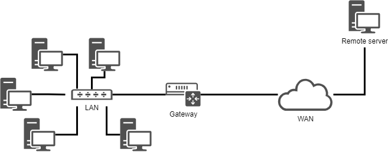
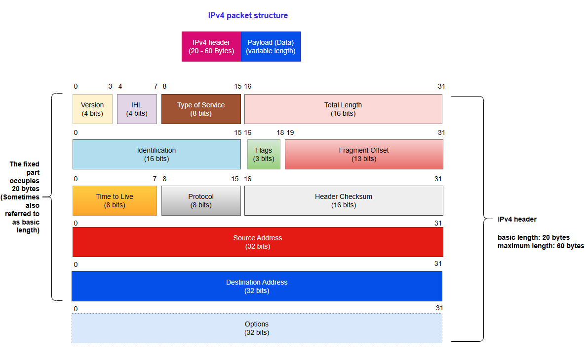
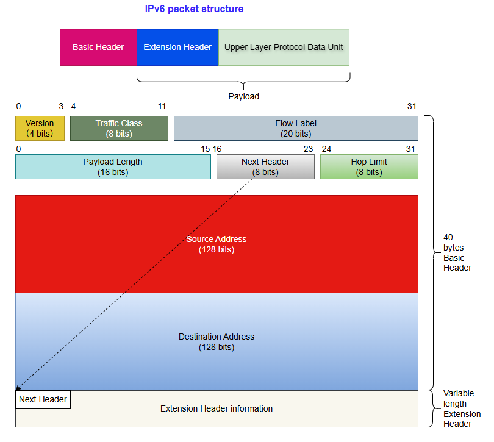
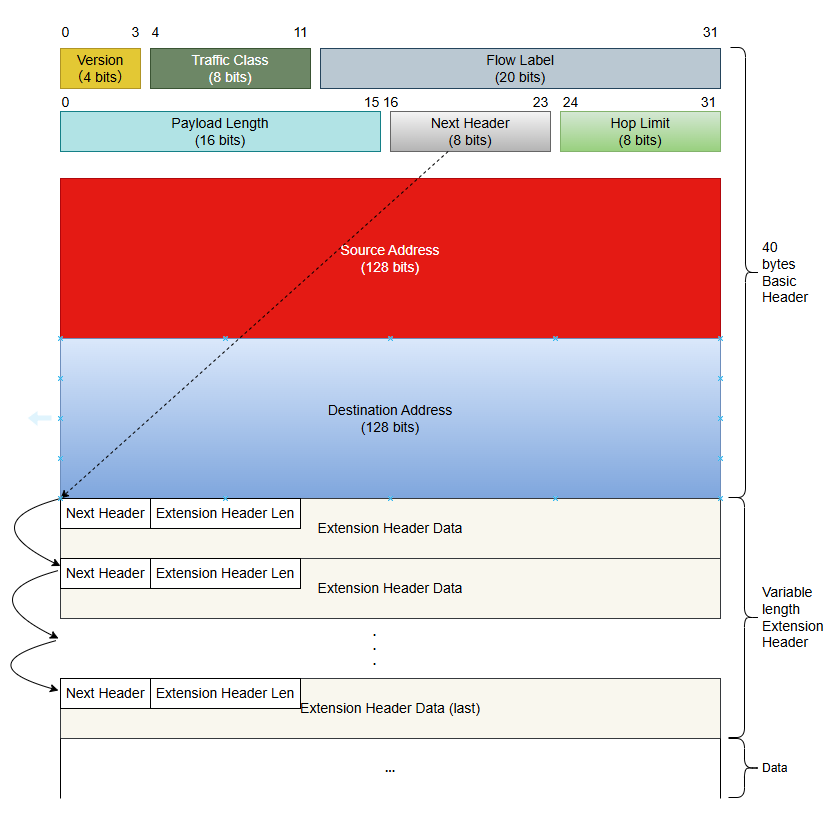
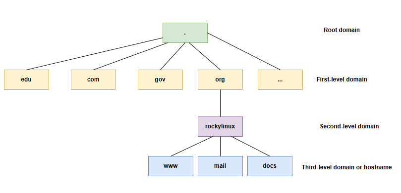
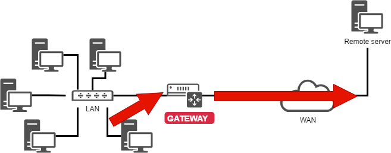
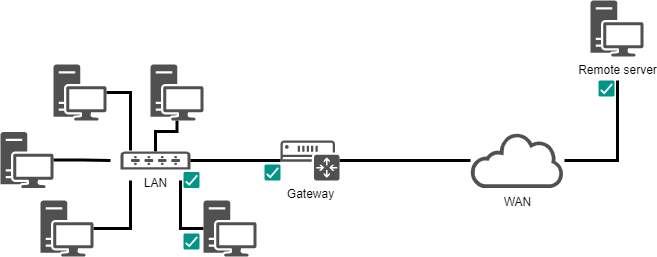

# Implementazione della Rete

In questo capitolo, si spiegerà come gestire e lavorare con la rete.

****

**Obiettivi** : In questo capitolo si apprenderà come:

:heavy_check_mark: Configurare una workstation per usare DHCP;  
:heavy_check_mark: Configurare una workstation per utilizzare una configurazione statica;  
:heavy_check_mark: Configurare una workstation per utilizzare un gateway;  
:heavy_check_mark: Configurare una workstation per utilizzare i server DNS;  
:heavy_check_mark: Risolvere i problemi relativi alla rete di una workstation.

:checkered_flag: **rete**, **linux**, **ip**

**Conoscenza**: :star: :star:  
**Complessità**: :star::star:

**Tempo di lettura**: 30 minuti

****

## Generalità

Per illustrare questo capitolo, useremo la seguente architettura.



Ci consentirà di prendere in considerazione:

* l'integrazione in una LAN (local area network);
* la configurazione di un gateway per raggiungere un server remoto;
* la configurazione di un server DNS e l'implementazione della risoluzione dei nomi.

I parametri minimi da definire per la macchina sono:

* il nome della macchina;
* l'indirizzo IP;
* la subnet mask.

Esempio:

* `pc-rocky`;
* `192.168.1.10`;
* `255.255.255.0`.

La notazione chiamata CIDR è sempre più frequente: 192.168.1.10/24

Gli indirizzi IP vengono utilizzati per il corretto routing dei messaggi (pacchetti). Sono divisi in due parti:

* network bits - La parte associata a "1" consecutivi nella maschera di sottorete binaria
* host bits - La parte associata a "0" consecutivi nella subnet mask binaria

```
                                            |<- host bits ->|
                  |<--    network bits  -->|
192.168.1.10  ==> 11000000.10101000.00000001.00001010
255.255.255.0 ==> 11111111.11111111.11111111.00000000
```

La subnet mask viene utilizzata per definire i bit di network e del host di un indirizzo IP. Utilizzando la subnet mask, si può determinare l'indirizzo IP corrente:

* l'indirizzo di rete (**NetID** o **SubnetID**) eseguendo un AND logico bit per bit tra l'indirizzo IP e la maschera;
* l'indirizzo dell'host. (**HostID**) eseguendo un AND logico bit per bit tra l'indirizzo IP e il complemento della maschera.

```
192.168.1.10  ==> 11000000.10101000.00000001.00001010
255.255.255.0 ==> 11111111.11111111.11111111.00000000

NetID             11000000.10101000.00000001.00000000
                    192   . 168    . 1      . 0

HostID            00000000.00000000.00000000.00001010
                     0    .   0    .    0   . 10
```

**Legitimate subnet mask** - Da sinistra a destra, gli 1 consecutivi possono essere definiti come subnet masks valide.

```
legitimate       11111111.11111111.11111111.00000000

illegitimate     11001001.11111111.11111111.00000000
```

!!! tip "Suggerimento"

    L'indirizzo IP e la subnet mask devono apparire in coppia, come stabilito dai principi fondamentali della comunicazione di rete.

All'interno di una rete esistono anche indirizzi specifici che devono essere identificati. Il primo indirizzo di un intervallo, come l'ultimo, hanno un ruolo particolare:

* Il primo indirizzo di un intervallo è l'**indirizzo di rete**. Viene utilizzato per identificare le reti e instradare le informazioni da una rete all'altra. Questo indirizzo può essere ottenuto tramite Logic and Operations

    ```
    192.168.1.10  ==> 11000000.10101000.00000001.00001010
    255.255.255.0 ==> 11111111.11111111.11111111.00000000

    network address   11000000.10101000.00000001.00000000
                        192   . 168    . 1      . 0
    ```

    **Logic and Operations** - Quando entrambe sono vere (1), il risultato è vero (1); altrimenti, è falso (0)

* L'ultimo indirizzo di un intervallo è l'**indirizzo di broadcast**. Viene utilizzato per trasmettere informazioni a tutte le macchine presenti sulla rete. Mantiene invariati i bit di rete e sostituisce tutti i bit host con 1 per ottenere questo indirizzo.

    ```
    192.168.1.10  ==> 11000000.10101000.00000001.00001010
    255.255.255.0 ==> 11111111.11111111.11111111.00000000

    broadcast address 11000000.10101000.00000001.11111111
                        192   . 168    . 1      . 255
    ```

!!! tip "Suggerimento"

    Questi due indirizzi, che svolgono ruoli speciali, **non possono** essere assegnati alla macchina terminale.

### Indirizzo MAC / Indirizzo IP

Un **indirizzo MAC** è un identificatore fisico scritto dal produttore sul dispositivo. Talvolta è indicato come indirizzo hardware. È composto da 6 byte spesso indicati in forma esadecimale (ad esempio 5E:FF:56:A2:AF:15).

Questi 6 byte rappresentano rispettivamente:

* I primi tre byte rappresentano l'identificativo del produttore. Questo identifier è denominato OUI (Organizationally Unique Identifier, identificatore univoco dell'organizzazione).
* Gli ultimi tre byte rappresentano il numero di serie assegnato dal produttore.

!!! Warning "Attenzione"

    L'indirizzo MAC è codificato in modo permanente quando l'hardware lascia la fabbrica. Esistono due metodi principali per modificarlo:

    * Modifiche a livello di firmware (permanente): richiede strumenti avanzati in grado di riscrivere direttamente l'indirizzo MAC nella ROM della scheda di rete. Tali strumenti sono solitamente disponibili solo per i produttori di hardware.
    * Spoofing a livello software (temporaneo): modifica la modalità di visualizzazione dell'indirizzo MAC nel sistema operativo. Queste modifiche vengono solitamente ripristinate dopo il riavvio del sistema. Anche l'indirizzo MAC della scheda di rete virtuale nell'host virtuale viene implementato tramite spoofing.

Un indirizzo IP (Internet Protocol) è un numero identificativo assegnato in modo permanente o temporaneo a ciascun dispositivo connesso a una rete informatica che utilizza il protocollo Internet. L'indirizzo IP e la subnet mask devono apparire in coppia, come stabilito dai principi fondamentali della comunicazione di rete. Attraverso la subnet mask, possiamo conoscere l'indirizzo IP corrente:

* network bits e host bits
* NetID oppure SubnetID
* HostID
* Indirizzo di rete
* Indirizzo di broadcast

Gli indirizzi IP sono classificati in base al campo versione nel pacchetto come segue:

* **IPv4‌** - (4 bits, 0100). La quantità disponibile di IPv4 è 2<sup>32</sup> (ricavata dai campi dell'indirizzo di origine e di destinazione nei pacchetti IPv4). Specificatamente suddivisi in:

    * Indirizzi di Classe A. Il suo intervallo va da **0.0.0.0** a **127.255.255.255**.
    * Indirizzi di Classe B. Il suo intervallo va da **128.0.0.0** a **191.255.255.255</0</li>
    * Indirizzi di Classe C. Il suo intervallo va da **192.0.0.0** a **223.255.255.255**.
    * Indirizzi di Classe D. Il suo intervallo va da **224.0.0.0** a **239.255.255.255**.
    * Indirizzi di Classe E. Il suo intervallo va da **240.0.0.0** a **255.255.255.255**.

    Tra questi, gli indirizzi di classe A, gli indirizzi di classe B e gli indirizzi di classe C hanno tutti i propri intervalli di indirizzi privati. 0.0.0.0 è un indirizzo riservato e non è assegnato all'host. Gli indirizzi di classe D sono utilizzati per la comunicazione multicast e non sono assegnati agli host. Gli indirizzi di classe E sono riservati e non vengono utilizzati per le reti regolari.</ul></li>

* **IPv6** - (4 bits, 0110). La quantità disponibile di IPv6 è 2<sup>128</sup> (ricavata dai campi dell'indirizzo di origine e di destinazione nei pacchetti IPv6). Specificatamente suddivisi in:

    * Indirizzo Unicast. Include indirizzo unicast locale di collegamento (LLA), indirizzo locale univoco (ULA), indirizzo unicast globale (GUA), indirizzo di loopback, indirizzo non specificato
    * Indirizzo Anycast
    * Indirizzo Multicast</ul>

Descrizione del formato di scrittura per IPv6 a 128 bit:

* Formato di scrittura preferito - **X:X:X:X:X:X:X:X**. In questo formato di scrittura, gli indirizzi IPv6 a 128 bit sono suddivisi in 8 gruppi, ciascuno rappresentato da 4 valori esadecimali (0-9, A-F), separati da due punti (`:`) tra i gruppi. Ogni “X” rappresenta un insieme di valori esadecimali. Ad esempio **2001:0db8:130F:0000:0000:09C0:876A:130B**.

    * Omissione dello 0 iniziale - Per comodità di scrittura, lo “0” iniziale in ciascun gruppo può essere omesso, quindi l'indirizzo sopra riportato può essere abbreviato come **2001:db8:130F:0:0:9C0:876A:130B**.
    * Utilizzare il due punti due volte - Se l'indirizzo contiene due o più gruppi consecutivi entrambi pari a 0, è possibile utilizzare invece un doppio punto doppio. Quindi l'indirizzo sopra riportato può essere ulteriormente abbreviato come **2001:db8:130F::9C0:876A:130B**. Attenzione!  In un indirizzo IPv6 è possibile inserire solo il doppio due punti.

* Compatibile con i formati di scrittura - **X:X:X:X:X:X:d.d.d.d**. In un ambiente di rete misto, questo formato garantisce la compatibilità tra i nodi IPv6 e i nodi IPv4. Ad esempio **0:0:0:0:0:ffff:192.1.56.10** e **::ffff:192.1.56.10/96**.

In un indirizzo web (Uniform Resource Locator), un indirizzo IP può essere seguito da due punti e da un numero di porta (che indica l'applicazione a cui sono destinati i dati). Inoltre, per evitare confusione nell'URL, l'indirizzo IPv6 è scritto tra parentesi quadre (ad esempio, `[2001:db8:130F::9C0:876A:130B]:443`).

Come accennato in precedenza, le maschere di sottorete dividono gli indirizzi IPv4 in due parti: bit di rete e bit host. In IPv6, anche le subnet mask hanno la stessa funzione, ma il nome è cambiato (“n” rappresenta il numero di bit occupati dalla subnet mask):

* Prefisso di rete - È equivalente ai bit di rete in un indirizzo IPv4. In base alla subnet mask, occupa “n” bit.
* ID interfaccia - È equivalente ai bit host in un indirizzo IPv4. In base alla subnet mask, occupa “128-n” bit.

Ad esempio **2001:0db8:130F:0000:0000:09C0:876A:130B/64**：

```
    Network prefix
|<-    64 bits   ->|

                        Interface ID
                     |<-    64 bits    ->|
2001:0db8:130F:0000 : 0000:09C0:876A:130B
```

All'interno della stessa rete, gli indirizzi IP devono essere univoci: questa è una regola fondamentale della comunicazione di rete. All'interno della stessa LAN (Local Area Network), l'indirizzo MAC deve essere univoco.

### Struttura dei pacchetti IPv4

I pacchetti IPv4 contengono sia parti di intestazione che parti di dati:



**Versione**: aiuta i router a identificare le versioni dei protocolli. Per IPv4, il valore qui è 0100 (il valore binario 0100 equivale al valore decimale 4).

**IHL**: campo utilizzato per controllare la lunghezza dell'intestazione. Quando il campo “Opzioni” non è incluso, il valore minimo è 5 (ovvero binario 0101). In questo caso l'intestazione occupa 20 byte. Il valore massimo è 15 (ovvero 1111 in binario) e la lunghezza dell'intestazione è di 60 byte.

```
Lunghezza effettiva dell'intestazione IPv4 = Valore del campo IHL * 4
```

**Tipo di servizio**: questo campo viene utilizzato per definire la QoS (Quality Of Service) e la priorità dei pacchetti di dati. Questo campo è ora utilizzato principalmente per DSCP (Differentiated Services Code Point) ed ECN (Explicit Congestion Notification).

**Lunghezza totale**: rappresenta la lunghezza totale dell'intero datagramma IPv4 (pacchetto IPv4) in byte.

!!! note "Nota" 

    Il pacchetto IP e il datagramma IP sono espressioni tecnicamente diverse dello stesso concetto, entrambe riferite alle unità di dati trasmesse a livello di rete.

**Identificazione**: identifica tutti i frammenti di un datagramma IPv4. Tutti i frammenti dello stesso datagramma originale condividono lo stesso valore di identificazione per consentire un corretto riassemblaggio.

**Flag**: viene utilizzato per controllare il comportamento della frammentazione dei datagrammi IPv4. In ordine da sinistra a destra:

* Il primo bit - Non utilizzato, valore 0
* La seconda parte - DF (Don't Fragment, non frammentare). Se DF=1, significa che il datagramma IPv4 deve essere trasmesso nella sua interezza. Se supera l'MTU, viene scartato e viene restituito un errore ICMP (ad esempio “Fragmentazione necessaria”). Se DF=0, il router divide il datagramma IPv4 in più frammenti, ciascuno dei quali trasporta lo stesso valore del campo Identificazione.
* Il terzo bit - MF (More Fragment). Se MF=1, significa che il frammento corrente non è l'ultimo e che ci sono altri frammenti; se MF=0, significa che questo è l'ultimo frammento.

**Fragment Offset**: indica la posizione relativa del frammento nel datagramma IPv4 originale, in unità di 8 byte. Questo campo viene utilizzato principalmente per il riassemblaggio dei frammenti.

**TTL (Time To Live)**: questo campo viene utilizzato per limitare il tempo massimo di sopravvivenza o il numero massimo di hop dei datagrammi nella rete. Il valore iniziale è determinato dal mittente e il TTL diminuisce di 1 ogni volta che passa attraverso il router. Quando TTL=0, il datagramma viene scartato.

**Protocollo**: indica il tipo di protocollo utilizzato dai dati trasportati in questo datagramma. Il suo intervallo di valori è compreso tra 0 e 255.  Ad esempio, il numero di protocollo di TCP è 6, quello di UDP è 17, e quello di ICMP è 1.

**Header Checksum**: questo campo verrà ricalcolato ogni volta che il datagramma passa attraverso il router, principalmente a causa della diminuzione del campo TTL che provoca modifiche nell'intestazione. Questo campo verifica solo l'intestazione (esclusa la parte relativa ai dati). Se gli altri campi rimangono invariati e cambia solo il TTL, il checksum verrà aggiornato con un nuovo valore (diverso da zero) per garantire che l'intestazione non sia stata manomessa o danneggiata durante la trasmissione.

**Indirizzo di origine**: indirizzo IPv4 del mittente del datagramma

**Indirizzo di destinazione**: indirizzo IPv4 del destinatario del datagramma

**Opzioni**: campo facoltativo, con una lunghezza compresa tra 0 e 40 byte. Viene utilizzato solo quando l'IHL è superiore a 5. La lunghezza di questo campo deve essere un multiplo intero di 4 byte (se la lunghezza è inferiore a 4 byte, utilizzare il campo **padding** per il riempimento).

!!! tip "Suggerimento"

    Bit ha due significati. Nella teoria dell'informazione, si riferisce all'unità fondamentale di informazione, che rappresenta una scelta binaria (0 o 1). In informatica, è la più piccola unità di archiviazione dati, dove 8 bit equivalgono in genere a 1 byte, salvo diversamente specificato.

### Struttura dei pacchetti IPv6

I datagrammi IPv6 sono composti da tre parti:

* Basic Header
* Extension Header
* Upper Layer Protocol Data Unit

In alcuni libri, l'Extended Header  e Upper Layer Protocol Data Unit sono collettivamente denominate **Payload**.



La lunghezza fissa del Basic Header è di 40 byte ed è fissata a 8 campi:

**Versione**: aiuta i router a identificare le versioni dei protocolli. Per IPv6, il valore qui è 0110 (il valore binario 0110 equivale al valore decimale 6).

**Classe di Traffico**: equivalente al campo TOS (Type Of Service) nei datagrammi IPv4. Questo campo viene utilizzato per definire il QOS (Quality Of Service) e la priorità dei pacchetti di dati.

**Flow Label**: questo nuovo campo IPv6 viene utilizzato per controllare il flusso dei pacchetti. Un valore diverso da zero in questo campo indica che il pacchetto deve essere trattato in modo speciale; ovvero, il pacchetto non deve essere inviato attraverso percorsi diversi per raggiungere la destinazione, ma deve utilizzare lo stesso percorso. Un vantaggio di questo sistema è che il destinatario non deve riordinare il pacchetto, velocizzando così il processo. Questo campo aiuta a evitare il riordino dei pacchetti di dati ed è progettato specificamente per lo streaming multimediale/live.

**Payload Length**: Indica la dimensione del payload. Questo campo può rappresentare solo un payload con una lunghezza massima di 65535 byte. Se la lunghezza del payload è superiore a 65535 byte, il campo della lunghezza del payload verrà impostato su 0 e l'opzione jumbo payload verrà utilizzata nell'intestazione di estensione delle opzioni hop-by-hop.

**Next Header**: Utilizzato per indicare il tipo di intestazione del pacchetto dopo l'intestazione di base. Se è presente un primo header di estensione, esso rappresenta il tipo del primo header di estensione. Altrimenti, rappresenta il tipo di protocollo utilizzato dal livello superiore, come 6 (TCP) e 17 (UDP).

**Hop Limit**: questo campo è equivalente al Time To Live (TTL) nei datagrammi IPv4.

**Indirizzo sorgente**: questo campo rappresenta l'indirizzo del mittente del datagramma IPv6.

**Indirizzo di destinazione**: questo campo rappresenta l'indirizzo del destinatario del datagramma IPv6.



Nei datagrammi IPv4, l'intestazione IPv4 contiene campi opzionali quali Opzioni, che includono Sicurezza, Timestamp, Registrazione percorso, ecc. Queste opzioni possono estendere la lunghezza dell'intestazione IPv4 da 20 byte a 60 byte. Durante il processo di inoltro, la gestione dei datagrammi IPv4 che trasportano queste opzioni può consumare una quantità significativa di risorse del dispositivo, quindi nella pratica viene utilizzata raramente.

IPv6 rimuove queste opzioni dall'intestazione di base IPv6 e le inserisce nell'intestazione di estensione, che si trova tra l'intestazione di base IPv6 e l'unità dati del protocollo di livello superiore.

Un pacchetto IPv6 può contenere 0, 1 o più intestazioni di estensione, che vengono aggiunte dal mittente solo quando il dispositivo o il nodo di destinazione richiedono un'elaborazione speciale.

A differenza del campo Opzioni IPv4 (che può essere esteso fino a 40 byte e richiede uno spazio di archiviazione continuo), l'intestazione di estensione IPv6 adotta una struttura a catena e non ha limiti di lunghezza fissi, rendendola più scalabile in futuro. Il suo meccanismo di allineamento a 8 byte è implementato attraverso il campo Next Header, che garantisce l'efficienza dell'elaborazione ed evita il sovraccarico dovuto alla frammentazione.

**Intestazione successiva**: questo campo ha la stessa funzione del campo Intestazione successiva nell'intestazione di base.

**Extension Header Le**: indica la lunghezza dell'intestazione dell'estensione (esclusa la lunghezza dell'intestazione successiva).

**Extension Head Data**: il contenuto dell'intestazione di estensione è una combinazione di una serie di campi opzionali e campi di riempimento.

Attualmente, RFC definisce i seguenti tipi di Extension Header:

* Intestazione delle opzioni hop-by-hop (il valore del campo dell'intestazione successiva è 0) - Deve essere gestita da tutti i router nel percorso.
* Intestazione delle opzioni di destinazione (il valore del campo dell'intestazione successivo è 60) - Elaborata solo dal nodo di destinazione.
* Intestazione di instradamento (il valore del campo dell'intestazione successiva è 43) - Questa intestazione di estensione è simile alle opzioni Loose Source e Record Route in IPv4.
* Intestazione del frammento (il valore del campo dell'intestazione successivo è 44) - Come i pacchetti IPv4, la lunghezza dei pacchetti IPv6 da inoltrare non può superare l'unità massima di trasmissione (MTU). Quando la lunghezza del pacchetto supera l'MTU, il pacchetto deve essere frammentato. In IPv6, l'intestazione Fragment viene utilizzata da un nodo sorgente IPv6 per inviare un pacchetto più grande dell'MTU.
* Intestazione di autenticazione (il valore del campo Next Header è 51) - IPSec utilizza questa intestazione per fornire l'autenticazione dell'origine dei dati, il controllo dell'integrità dei dati e le funzioni anti-replay dei pacchetti. Protegge anche alcuni campi nell'intestazione di base IPv6.
* Intestazione Encapsulating Security Payload (il valore del campo dell'intestazione successiva è 50) - Questa intestazione fornisce le stesse funzioni dell'intestazione Authentication più la crittografia dei pacchetti IPv6.

L'RFC specifica che quando più intestazioni di estensione vengono utilizzate nello stesso datagramma, è consigliabile che tali intestazioni appaiano nel seguente ordine:

1. IPv6 Basic Header
2. Hop-by-Hop Options header
3. Destination Options header
4. Routing header
5. Fragment header
6. Authentication header
7. Encapsulating Security Payload header
8. Destination Options header
9. Upper-layer protocol header

Ad eccezione del Destination Option Header, che può apparire una o due volte (una volta prima del Routing Extension Header e una volta prima dell'intestazione Upper-layer protocol), tutte le altre intestazioni di estensione possono apparire solo una volta.

### DNS

**DNS (Domain Name System)**: La famiglia di protocolli TCP/IP offre la possibilità di connettersi ai dispositivi tramite indirizzi IP, ma per gli utenti è piuttosto difficile ricordare l'indirizzo IP di un dispositivo. Pertanto, è stato appositamente progettato un meccanismo di denominazione degli host basato su stringhe, in cui questi nomi host corrispondono all'indirizzo IP. È necessario un meccanismo di conversione e interrogazione tra indirizzi IP e nomi host, e il sistema che fornisce tale meccanismo è il Domain Name System (DNS). Il processo di "traduzione" di un nome di dominio in un indirizzo IP è chiamato **Risoluzione del nome di dominio**.

Il nome completo della macchina (**FQDN**) diventa `pc-rocky.mydomain.lan`.

* Hostname - viene utilizzato per identificare in modo univoco i dispositivi all'interno di una LAN (rete locale) o come parte di un nome di dominio (ad esempio `docs`)
* Domain name - Utilizzato per identificare in modo univoco i dispositivi sulla WAN (Wide Area Network). Ad esempio `docs.rockylinux.org`, dove `rockylinux.org` è il nome di dominio del dominio

!!! tip "Suggerimento"

    Il dominio non rappresenta un host specifico

**D: Perché è necessario il DNS?**

Agli albori di Internet, per ricordare la corrispondenza tra nomi host e indirizzi IP, era necessario scrivere tutte le corrispondenze in un file e gli utenti dovevano aggiornare manualmente il contenuto del file. Con il vigoroso sviluppo di Internet, i principali problemi che devono essere risolti sono:

* Un singolo file ha effetto solo sul computer attualmente in uso
* La gestione manuale dei contenuti dei file sta diventando sempre più difficile

Per risolvere i problemi emersi, è stato sviluppato il DNS, i cui vantaggi sono:

* Distribuito - Server DNS disponibili per gli utenti di tutto il mondo
* Gestione gerarchica - Divide la gerarchia per una gestione più semplice. Come mostrato nella figura seguente:

    

**Il livello 2** (collegamento dati) supporta la topologia di rete (token ring, stella, bus, ecc.), la suddivisione dei dati e gli errori di trasmissione. Un'espressione più standardizzata:

> "Il sistema globale dei server root DNS è strutturato logicamente attorno a 13 endpoint canonici (da a.root-servers.net a m.root-servers.net), un design che affonda le sue radici nei vincoli storici del protocollo. Dal punto di vista fisico, questi endpoint sono implementati attraverso oltre 1.500 server anycast distribuiti in tutto il mondo, gestiti da 13 organizzazioni indipendenti sotto il coordinamento di ICANN/IANA."

Per `docs.rockylinux.org.`:

* **Dominio principale** - Si riferisce a un punto (`.`).
* **Dominio di primo livello** - Si riferisce alla stringa `org`. Esistono molte controversie riguardo alla divisione dei domini di primo livello; ad esempio, alcuni documenti classificano `.org` o `org.` come domini di primo livello.
* **Dominio di secondo livello** - Si riferisce alla stringa `rockylinux`. Esistono molte controversie riguardo alla divisione dei domini di secondo livello, ad esempio alcuni documenti riportano `rockylinux.org.` o `.rockylinux.org.` come domini di secondo livello.
* **hostname** -  Si riferisce alla stringa `docs`.

**FQDN (Fully Qualified Domain Name)**: nome di dominio completo costituito da un nome host e vari livelli di domini. Secondo lo standard RFC (RFC 1034, RFC 2181, RFC 8499), il dominio root alla fine è uno standard industriale (ad esempio `docs.rockylinux.org.`). Nei file di configurazione di alcuni software DNS è necessario inserire un FQDN standard, ma il dominio principale può essere ignorato quando si accede a determinate risorse di rete (ad esempio, quando un utente visita `https://docs.rockylinux.org`, il browser aggiunge automaticamente un punto alla fine). **Domain name**: struttura che collega domini a tutti i livelli e inizia con un nome host. **Zona**: rappresenta una porzione contigua dello spazio dei nomi DNS gestita da un server autoritativo specifico, che memorizza tutti i record di risoluzione FQDN (come A, MX, ecc.) all'interno di tale ambito.

!!! tip "Suggerimento"

    In generale, "FQDN" è più efficace nell'esprimere il significato del documento di un autore rispetto a "nome di dominio", poiché i lettori di settori diversi hanno una comprensione diversa del termine "nome di dominio". Ad esempio, nel caso di `rockylinux.org`, alcuni lettori potrebbero interpretarlo come un nome di dominio, ma in realtà non è corretto. A rigor di termini, questo dovrebbe essere definito dominio (anziché nome di dominio). Pertanto, al fine di garantire un maggiore rigore, si richiede ai lettori di distinguere rigorosamente il significato dei domini e dei nomi di dominio.

### Modello teorico a 7 livelli ISO/OSI

**ISO (Organizzazione internazionale per la normazione)** - Organizzazione internazionale fondata nel 1974, il cui ruolo principale è quello di definire standard internazionali in vari settori. Per il settore Internet, l'ISO ha proposto il modello teorico di riferimento a 7 livelli OSI.

**OSI (Open System Interconnection Reference Model)** - Questo modello propone un quadro standard che cerca di interconnettere vari computer in una rete mondiale.

| Livello                 | Descrizione                                                                                                                                                                    |
| ----------------------- | ------------------------------------------------------------------------------------------------------------------------------------------------------------------------------ |
| 7 - Applicazione        | Fornire vari servizi di richiesta per applicazioni o richieste degli utenti                                                                                                    |
| 6 - Presentazione       | Codifica dei dati, conversione dei formati, crittografia dei dati                                                                                                              |
| 5 - Sessione            | Creare, gestire e mantenere le sessioni.                                                                                                                                       |
| 4 - Trasporto           | Comunicazione dati, creazione di connessioni end-to-end, ecc.                                                                                                                  |
| 3 - Rete                | Gestione delle connessioni di rete (instaurazione, mantenimento e interruzione), selezione del percorso di routing, raggruppamento dei pacchetti, controllo del traffico, ecc. |
| 2 - Collegamento dati   | Incapsulamento e trasmissione dei frame, controllo del traffico e verifica degli errori, ecc.                                                                                  |
| 1 - Collegamento fisici | Gestione dei mezzi di trasmissione, specifiche dell'interfaccia fisica, conversione e trasmissione dei segnali, ecc.                                                           |

!!! Note "Aiuto alla memoria"

    Per ricordare l'ordine degli strati del modello ISO/OSI, ricorda la seguente frase: **All People Seem To Need Data Processing**.

**Struttura gerarchica del modello**: incarna un principio di progettazione modulare, ovvero, scomponendo le complesse funzioni di comunicazione di rete in livelli indipendenti, ottiene il disaccoppiamento funzionale e la collaborazione standardizzata.

!!! note "Nota"

    Va notato che il modello a 7 livelli ISO/OSI non esiste nella comunicazione di rete reale. Fornisce semplicemente un quadro di riferimento e un approccio progettuale per la comunicazione via Internet.

**Modello a 4 livelli TCP/IP** - Il modello gerarchico utilizzato nella comunicazione di rete effettiva (semplifica il modello a 7 livelli ISO/OSI in un modello a 4 livelli). TCP/IP è sinonimo di un gruppo che comprende numerosi protocolli di rete e costituisce la suite dei protocolli TCP/IP. Nell'analisi dei protocolli o nell'ambito didattico, talvolta viene informalmente denominato **modello TCP/IP a 5 livelli**.

| Livello                 | Protocolli                                                                                                                                                                       | Dispositivi hardware coinvolti in questo layer  |
|:----------------------- |:-------------------------------------------------------------------------------------------------------------------------------------------------------------------------------- |:----------------------------------------------- |
| 4 - Applicativo         | HTTP, FTP, SMTP, DNS, DHCP ...                                                                                                                                                   | -                                               |
| 3 - Trasporto           | TCP, UDP                                                                                                                                                                         | Firewall e load balancer                        |
| 2 - Internet            | IP, ICMP, ARP, RARP, IGMP                                                                                                                                                        | Router                                          |
| 1 - Interfaccia di rete | Ethernet protocol (IEEE 802.3), PPP (Point to Point Protocol), PPPoE (Point-to-Point Protocol over Ethernet), Wi-Fi (IEEE 802.11), ADSL (Asymmetric Digital Subscriber Line) ... | NIC, switch, hub, repeater, twisted pair, modem |

* **Livello applicativo** - Unifica i livelli applicativo, presentazione e sessione nel modello teorico in un unico livello applicativo.
* **Livello trasporto** - Il livello di trasporto nel modello teorico.
* **Livello Internet** - Il livello di rete nel modello teorico.
* **Livello interfaccia di rete** - Integrazione del livello di collegamento dati e del livello fisico del modello teorico in un unico livello.

!!! tip Suggerimento “Espressione terminologica”

    Il modello a 4 livelli TCP/IP, la suite di protocolli TCP/IP e lo stack di protocolli TCP/IP sono espressioni diverse dello stesso concetto.

## La denominazione delle interfacce

*lo* è l'interfaccia "**loopback**", che consente ai programmi TCP/IP di comunicare tra loro senza uscire dal computer locale. Ciò consente di verificare se il **modulo di rete del sistema funziona correttamente** e permette anche di eseguire il ping del localhost. Tutti i pacchetti che entrano tramite localhost escono tramite localhost. I pacchetti ricevuti sono identici ai pacchetti inviati.

Il device manager `udev` assegna nomi alle interfacce con un prefisso specifico a seconda del tipo. Tradizionalmente, tutte le interfacce **Ethernet**, ad esempio, iniziavano con **eth**. Il prefisso era seguito da un numero, il primo dei quali era 0 (eth0, eth1, eth2...). Alle interfacce wifi è stato assegnato un prefisso WLAN.

Nelle distribuzioni Linux Rocky 8/9/10, il device manager `udev` assegnerà un nome alle interfacce secondo la seguente politica, dove “X” rappresenta un numero:

* `enoX`: dispositivi on-board
* `ensX`: slot hotplug PCI Express
* `enpXsX`: posizione fisica/geografica del connettore dell'hardware
* ...

!!! tip suggerimento “Integrazione e acquisizione”

    Nelle versioni precedenti delle distribuzioni Linux, udev era un componente autonomo e funzionava utilizzando un processo separato, ma le moderne distribuzioni Linux mainstream hanno integrato il codice udev nel progetto systemd, rendendolo uno dei componenti principali della suite systemd.

## Configurare, esplorare e testare la rete

### Il comando `ip`

Si dimentichi il vecchio comando `ifconfig`! Si usi `ip`!

!!! Note "Nota"

    Commento per gli amministratori di sistemi Linux piu' stagionati:
    
    Il comando storico per la gestione della rete è `ifconfig`. Questo comando è stato rimpiazzato dal comando `ip`, già ben noto agli amministratori di rete.
    
    Il comando `ip` è l'unico comando che consente di gestire **indirizzi IP, ARP, routing, ecc.**.
    
    Il comando `ifconfig` non è più installato di default in Rocky 8/9/10. Oltre al comando `ip`, gli amministratori di sistema possono anche utilizzare i comandi nel componente di rete [NetworkManager](https://www.networkmanager.dev/) per gestire le reti, i più comunemente utilizzati sono i comandi `nmtui` e `nmcli`.
    
    È importante acquisire buone abitudini fin da ora.

Il comando `ip` del pacchetto `iproute2` consente di configurare un'interfaccia e la relativa tabella di routing.

Mostrare le interfacce di rete:

```bash
[root]# ip link
```

Mostra le informazioni sulle interfacce di rete:

```bash
[root]# ip addr show
```

Mostra le informazioni su una interfaccia di rete:

```bash
[root]# ip addr show eth0
```

Mostra la tabella ARP:

```bash
[root]# ip neigh
```

### I comandi `nmtui` e `nmcli`

[Questo documento](../../gemstones/network/nmtui.md) illustra l'utilizzo del comando `nmtui` e dei relativi file di configurazione.

[Questo documento](../../gemstones/network/network_manager.md) illustra l'utilizzo del comando `nmcli` e dei relativi file di configurazione.

### Il comando `mtr`

`mtr` è uno strumento di diagnostica di rete in grado di diagnosticare i problemi di rete. Viene utilizzato per sostituire i comandi `ping` e `traceroute`. In termini di prestazioni, il comando `mtr` è più veloce.

Il comando mtr è descritto in dettaglio in [questo documento](../../gemstones/network/mtr.md).

### Il comando `ss`

Questo comando sostituisce la vecchia versione di `netstat`, utilizzato principalmente per visualizzare lo stato delle porte e dei socket. Si utilizza cosi':

```
ss [OPTIONS] [FILTER]
```

Le opzioni piu' comuni comprendono:

| Opzioni | Descrizione                                |
|:------- |:------------------------------------------ |
| `-a`    | Mostra tutti i socket                      |
| `-r`    | Mostra l'hostname di sistema               |
| `-t`    | Mostra i socket TCP                        |
| `-u`    | Mostra i socket UDP                        |
| `-l`    | Mostra i socket in ascolto                 |
| `-n`    | Mostra l'indirizzo IP e il numero di porta |
| `-p`    | Mostra i processi che utilizzano socket    |

Visualizza i socket che hanno stabilito connessioni:

```bash
[root]# ss
```

Visualizza le porte su cui il computer locale è in ascolto:

```bash
[root]# ss -tulnp
Netid  State   Recv-Q  Send-Q     Local Address:Port     Peer Address:Port    Process
udp    UNCONN  0       0              127.0.0.1:323           0.0.0.0:*        users:(("chronyd",pid=703,fd=5))
udp    UNCONN  0       0                  [::1]:323              [::]:*        users:(("chronyd",pid=703,fd=6))
tcp    LISTEN  0       128              0.0.0.0:22            0.0.0.0:*        users:(("sshd",pid=734,fd=3))
tcp    LISTEN  0       128                 [::]:22               [::]:*        users:(("sshd",pid=734,fd=4))
```

Visualizza tutte le connessioni di rete su questo dispositivo:

```bash
[root]# ss -an
Netid State  Recv-Q Send-Q     Local Address:Port     Peer Address:Port  Process
nl    UNCONN 0      0                    0:695                 *
...
```

`ss -tulnp`: Visualizza solo le connessioni in stato di ascolto TCP/UDP e include le informazioni sul processo.

`ss -an`: Visualizza tutte le connessioni dell'host (comprese quelle in ascolto e quelle attive)

Descrizione delle colonne di output:

* Netid - Tipo di socket e tipo di trasmissione
* State - Stato del socket. “ESTAB” sta per “stabilire una connessione”; ‘UNCONN’ rappresenta le connessioni non stabilite; “LISTEN” rappresenta la connessione in ascolto
* Recv-Q - Dimensione della coda dei socket in ricezione
* Send-Q - Dimensione della coda dei socket inviati
* Indirizzo:Porta Locali - Indirizzo IP e porta locale
* Indirizzo:Porta peer - Indirizzo IP e porta all'altra estremità della connessione
* Process - Informazioni relative al processo corrispondente, inclusi ID e nome processo e descrittore file.

Se hai bisogno di conoscere la corrispondenza tra porte predefinite e servizi, fai riferimento al contenuto del file **/etc/services**.

### Visualizza le proprietà della scheda NIC

Utilizza spesso il comando `ethtool` per visualizzare le proprietà della scheda di rete (NIC, Network Interface Card). Si utilizza cosi':

```
ethtool [option] DEVNAME
```

```bash
[root]# ethtool ens160
Settings for ens160:
        Supported ports: [ TP ]
        Supported link modes:   1000baseT/Full
                                10000baseT/Full
        Supported pause frame use: No
        Supports auto-negotiation: No
        Supported FEC modes: Not reported
        Advertised link modes:  Not reported
        Advertised pause frame use: No
        Advertised auto-negotiation: No
        Advertised FEC modes: Not reported
        Speed: 10000Mb/s
        Duplex: Full
        Auto-negotiation: off
        Port: Twisted Pair
        PHYAD: 0
        Transceiver: internal
        MDI-X: Unknown
        Supports Wake-on: uag
        Wake-on: d
        Link detected: yes
```

Descrizione degli attributi importanti:

* Supports auto-negotiation
* Speed
* Duplex
* Port - Si riferisce al supporto per la trasmissione dei dati, come "doppino intrecciato" e "FIBRA".
* Link detected

Se è necessario configurare impostazioni più dettagliate per gli attributi della scheda di rete, accedere al terminale interattivo del comando `nmcli`, ad esempio:

```bash
[root]# nmcli connection show
NAME    UUID                                  TYPE      DEVICE
ens160  76999cf9-b99e-4a9d-a325-0c54224d9300  ethernet  ens160

[root]# nmcli connection edit ens160

nmcli> set 802-3-ethernet.
accept-all-mac-addresses   generate-mac-address-mask  port                       speed
auto-negotiate             mac-address                s390-nettype               wake-on-lan
cloned-mac-address         mac-address-blacklist      s390-options               wake-on-lan-password
duplex                     mtu                        s390-subchannels

nmcli> print

nmcli> save

nmcli> quit

[root]# nmcli connection down ens160

[root]# nmcli connection up ens160
```

### Test IPv6/IPv4

Query dell'indirizzo IPv4/IPv6 della wide area network di questa macchina:

```bash
[root]# curl -4 ifconfig.me
116.207.111.120

[root]# curl -6 ifconfig.me
240e:36a:8339:8500:20c:29ff:feb3:41fd
```

### comando `ipcalc`

Il comando `ipcalc` (**calcolo IP**) calcola l'indirizzo di una rete o di una trasmissione da un indirizzo IP e una maschera. Questo comando supporta sia indirizzi IPv4 che indirizzi IPv6.

Sintassi del comando `ipcalc`:

```bash
ipcalc [OPTION]... <IP address>[/prefix] [netmask]
```

Esempio:

```bash
[root]# ipcalc -m -p -b -n 192.168.100.20/24
NETMASK=255.255.255.0
PREFIX=24
BROADCAST=192.168.100.255
NETWORK=192.168.100.0

[root]# ipcalc -h ::1
HOSTNAME=localhost
```

!!! Tip "Suggerimento"

    Questo comando è interessante, seguito da un reindirizzamento per compilare automaticamente i file di configurazione delle interfacce:

    ```
    [root]# ipcalc –b 172.16.66.203 255.255.240.0 >> /etc/sysconfig/network-scripts/ifcfg-eth0
    ```

|       Opzione        |                 Descrizione                 |
|:--------------------:|:-------------------------------------------:|
| `-b` o `--broadcast` |   Visualizza l'indirizzo di trasmissione.   |
|  `-n` o `--network`  |       Visualizza l'indirizzo di rete        |
|  `-p` o `--prefix`   |       Visualizza il prefisso di rete        |
|  `-m` o `--netmask`  |    Visualizza la maschera di rete per IP    |
|  `-s` o `--silent`   |  Non visualizza alcun messaggio di errore   |
| `-h` o `--hostname`  | Mostra il nome host determinato tramite DNS |

## Contenuto relativo al hostname

### Imposta e visualizza il nome host

systemd non è solo un programma di inizializzazione; è una ampia suite software che gestisce numerosi componenti di sistema. `hostnamectl` è un componente di systemd per gestire i nomi dell'host.

Il comando `hostnamectl` è un'alternativa a `hostname`. È importante sottolineare che le modifiche apportate dal comando `hostnamectl` sono **permanenti**. Si utilizza cosi':

```
hostnamectl [OPTIONS...] COMMAND ...
```

Richiedere le informazioni relative al nome host:

```bash
[root]# hostnamectl
   Static hostname: HOME01
         Icon name: computer-vm
           Chassis: vm
        Machine ID: dd5a13887a7b4325a8fa18bb730ff060
           Boot ID: 87e3adf2b2754ee28fe4497ee956064c
    Virtualization: vmware
  Operating System: Rocky Linux 8.10 (Green Obsidian)
       CPE OS Name: cpe:/o:rocky:rocky:8:GA
            Kernel: Linux 4.18.0-553.83.1.el8_10.x86_64
      Architecture: x86-64
```

Imposta il nome host del computer e la posizione dell'host:

```bash
[root]# hostnamectl set-hostname HOME10

[root]# hostnamectl set-location "Vancouver, Canada"

[root]# hostnamectl
   Static hostname: HOME10
         Icon name: computer-vm
           Chassis: vm
          Location: Vancouver, Canada
        Machine ID: dd5a13887a7b4325a8fa18bb730ff060
           Boot ID: 87e3adf2b2754ee28fe4497ee956064c
    Virtualization: vmware
  Operating System: Rocky Linux 8.10 (Green Obsidian)
       CPE OS Name: cpe:/o:rocky:rocky:8:GA
            Kernel: Linux 4.18.0-553.83.1.el8_10.x86_64
      Architecture: x86-64
```

!!! Tip "Suggerimento"

    In una rete locale, un nome host identifica un dispositivo all'interno della rete. Ovviamente, avere un nome host univoco non basta: anche l'indirizzo IP corrispondente a quel nome host deve essere univoco. 
    In una rete geografica, l'FQDN, costituito da nomi host e vari livelli di domini, identifica in modo univoco i dispositivi attraverso il sistema DNS gerarchico.

### /etc/hostname file

Il contenuto di questo file è il nome host del computer corrente. In genere si sconsiglia di modificare direttamente il contenuto di questo file.

## Contenuti relativi al DNS

Quando il sistema operativo deve risolvere un nome host, effettua le ricerche nel seguente ordine:

1. Cache DNS
2. /etc/hosts
3. Server DNS

### /etc/hosts file

Durante il processo di avvio del sistema operativo, il file **/etc/hosts** viene utilizzato per determinare il nome di dominio completo.

Il file **/etc/hosts** è una tabella statica di mappatura dei nomi host e verrà utilizzato per primo nelle seguenti situazioni:

* Server DNS non disponibili
* Prima di inviare una richiesta ai server DNS

Il formato di questo file è il seguente:

```bash
@IP         <hostname>     [alias]    [# comment]
 ↑              ↑             ↑             ↑    
required    required       optional     optional
```

Ogni riga rappresenta una singola relazione di mappatura. Il contenuto di questo file non può essere vuoto e deve contenere almeno una relazione di mappatura.

Esempio di un file `/etc/hosts`:

```
127.0.0.1       localhost localhost.localdomain
::1             localhost localhost.localdomain
192.168.1.10    rockstar.rockylinux.lan rockstar
```

### Il processo di risoluzione DNS

Quando un utente digita www.rockylinux.org nel browser, succede questo:

1. **Fase di risoluzione locale**

> 1. Cerca nella cache del browser (cache DNS). Se viene individuato il record di mappatura corrispondente, la query termina. Se non viene trovato, verrà eseguito il passaggio successivo 
> 2. Cerca il file Hosts locale (/etc/hosts). Se esiste un record di mappatura corrispondente, la query termina. Altrimenti, passa alla fase successiva

2. **Fase di interrogazione ricorsiva**

> 1. Invia una richiesta di risoluzione al server DNS configurato nel file /etc/resolv.conf (ad esempio 8.8.8.8). I server DNS configurati dagli utenti nel sistema operativo sono noti anche come server DNS locali. Con "server DNS locali" si intendono in questo caso i server DNS pubblici messi a disposizione per uso pubblico, come ad esempio 8.8.8.8 e 114.114.114. Se la richiesta di query trova corrispondenza con un record presente nella cache del server DNS locale, la richiesta termina e restituisce il risultato; in caso contrario, entra nel processo di query iterativo
> 2. Il server DNS locale invia una richiesta al server dei nomi radice e ottiene l'indirizzo del dominio .org. 
> 3. Il server del dominio di primo livello (TLD) richiederà l'indirizzo di rockylinux.org al server .org
> 4. Il server dei nomi ottiene infine l'indirizzo IP esatto di www.rockylinux.org dal server rockylinux.org

3. **Restituisce i risultati dell'analisi all'utente e li memorizza nella cache locale**

> Il server DNS locale restituisce l'indirizzo IP al client e memorizza i record di mappatura nella cache locale (la durata della cache è determinata dal TTL). Anche il browser dell'utente ha memorizzato nella cache questo record di mappatura.

### file /etc/resolv.conf

Il file **/etc/resolv.conf** contiene la configurazione per la risoluzione dei nomi DNS.

```bash
#Generated by NetworkManager
domain mondomaine.lan
search mondomaine.lan
nameserver 192.168.1.254
```

In Rocky Linux 8/9/10, non è consigliabile modificare direttamente questo file; è invece necessario configurare il server dei nomi utilizzando i comandi corrispondenti del componente di rete `NetworkManager`.

```bash
[root]# nmcli connection modify ens160 ipv4.dns "114.114.114.114,8.8.8.8"

[root]# systemctl restart NetworkManager.service

[root]# nmcli connection show ens160
...
ipv4.dns:                               114.114.114.114,8.8.8.8
...

[root]# cat /etc/resolv.conf
# Generated by NetworkManager
nameserver 114.114.114.114
nameserver 8.8.8.8
```

### Comandi correlati

I tre comandi, `host`, `nslookup` e `dig`, servono tutti a visualizzare i risultati dell'analisi, e `dig` è il comando consigliato.

```bash
[root]# host www.rockylinux.org
www.rockylinux.org is an alias for rockylinux.org.
rockylinux.org has address 76.223.126.88
rockylinux.org mail is handled by 5 alt2.aspmx.l.google.com.
rockylinux.org mail is handled by 10 alt4.aspmx.l.google.com.
rockylinux.org mail is handled by 1 aspmx.l.google.com.
rockylinux.org mail is handled by 5 alt1.aspmx.l.google.com.
rockylinux.org mail is handled by 10 alt3.aspmx.l.google.com.

[root]# nslookup docs.rockylinux.org
Server:         114.114.114.114
Address:        114.114.114.114#53

Non-authoritative answer:
docs.rockylinux.org     canonical name = f5612ab73a7647d2.vercel-dns-016.com.
Name:   f5612ab73a7647d2.vercel-dns-016.com
Address: 216.150.16.193
Name:   f5612ab73a7647d2.vercel-dns-016.com
Address: 216.150.1.193

[root]# dig wiki.rockylinux.org

; <<>> DiG 9.11.36-RedHat-9.11.36-16.el8_10.6 <<>> wiki.rockylinux.org
;; global options: +cmd
;; Got answer:
;; ->>HEADER<<- opcode: QUERY, status: NOERROR, id: 43671
;; flags: qr rd ra; QUERY: 1, ANSWER: 2, AUTHORITY: 0, ADDITIONAL: 0

;; QUESTION SECTION:
;wiki.rockylinux.org.           IN      A

;; ANSWER SECTION:
wiki.rockylinux.org.    305     IN      CNAME   rockylinux.map.fastly.net.
rockylinux.map.fastly.net. 305  IN      A       151.101.42.132

;; Query time: 98 msec
;; SERVER: 114.114.114.114#53(114.114.114.114)
;; WHEN: Sun Nov 23 17:46:13 CST 2025
;; MSG SIZE  rcvd: 92
```

### Tipo di record di risoluzione DNS

* A - Risolve il nome di dominio nell'indirizzo IPv4 specificato
* AAAA - Risolve il nome di dominio nell'indirizzo IPv6 specificato
* NS - Indica un server DNS specifico per gestire la configurazione della risoluzione dei nomi di dominio
* CNAME - Indirizza un nome di dominio verso un altro nome di dominio.
* PTR - Mappa gli indirizzi IP ai nomi di dominio e verifica se un indirizzo IP corrisponde a un nome di dominio specifico tramite i record PTR. Viene utilizzato principalmente per la risoluzione inversa dei server di posta
* MX - Indica il server di posta elettronica associato al nome di dominio. Ciò è necessario durante la configurazione dei servizi relativi alla posta elettronica
* SRV - Indica che un server sta utilizzando un determinato servizio.
* TXT - Viene utilizzato per identificare e descrivere i nomi di dominio. I record TXT vengono comunemente utilizzati in contesti quali la verifica della titolarità dei nomi di dominio, i certificati digitali, i record SPF (Sender Policy Framework) e il recupero dei nomi di dominio.

## file /etc/nsswitch.conf

Questo file definisce i servizi e l'ordine di ricerca utilizzati dal sistema operativo durante la ricerca di varie informazioni (ad esempio, `/etc/passwd`, `/etc/group`, `/etc/hosts`). Questo file utilizza un meccanismo denominato NSS (Name Service Switch) per eseguire tutte queste operazioni.

```bash
[root]# grep -v ^# /etc/nsswitch.conf
...
hosts:      files dns myhostname
...
```

La sintassi di base per ogni riga è:

```
<Database Name>: <Method1> [Action1] <Methond2> [Action2] ...
    ↑               ↑          ↑
required        required    optional
```

Per risolvere il nome host, utilizzare innanzitutto il file locale **/etc/hosts** per l'interrogazione, quindi ricorrere al server DNS locale. `myhostname` è un metodo speciale che serve principalmente a risolvere localmente il nome host del sistema operativo stesso.

Nella stragrande maggioranza dei casi, non è necessario modificare il contenuto di questo file.

### Comando `getent`

Il comando `getent` è incluso nel pacchetto glibc-common, quindi potrebbe essere necessario eseguire il seguente comando:

```bash
[root]# dnf -y install glibc-common
```

Il comando `getent` (get entry) recupera una voce NSSwitch (`hosts` + `dns`)

Syntax of the `getent` command:

```
getent [OPTION...] database [key ...]
```

Esempio:

```bash
[root]# getent hosts rockylinux.org
  76.223.126.88 rockylinux.org
```

L'utilizzo esclusivo di un server DNS locale potrebbe fornire risultati di risoluzione errati, poiché non tiene conto delle voci presenti nel file **/etc/hosts**, anche se ciò è piuttosto raro nei sistemi moderni.

Per una corretta risoluzione del file **/etc/hosts**, interroga il servizio di nomi NSSwitch che gestisce la risoluzione DNS.

## Q & A

**D: È meglio utilizzare i metodi tradizionali o il moderno NetworkManager per gestire i file di configurazione delle schede di rete di Rocky Linux 8.x?**

In questa versione, NetworkManager è compatibile con i tradizionali file di configurazione delle schede di rete, ma l'autore consiglia di utilizzare i comandi specifici di NetworkManager per gestire tali file. In questo modo, potrai gestire senza problemi le reti per le versioni successive 9.x o 10.x.

**D: Nel file di configurazione della scheda di rete gestito da NetworkManager, quali attributi (chiavi) è possibile configurare?**

Si prega di consultare il contenuto di `man 5 nm-settings` e `man 5 NetworkManager.conf`.

**D: Come verificare passo dopo passo lo stato della connessione di rete?**

È possibile utilizzare il comando `mtr` o `ping` per verificare gradualmente lo stato di comunicazione della rete. Gli oggetti dell'ispezione sono:

1. Livello software TCP/IP. Ad esempio `mtr -c 4 localhost` o `ping -c 4 localhost`.
2. Scheda di rete (NIC). Ad esempio `mtr 192.168.100.20` o `ping 192.168.100.20`
3. Gateway. Ad esempio `mtr 192.168.100.1` o `ping 192.168.100.1`
4. Server remoti per reti geografiche. Ad esempio `mtr 151.101.42.132` o `ping 151.101.42.132`
5. Server DNS locale. Ad esempio `mtr 1.1.1.1` o `ping 1.1.1.1`

!!! tip "Suggerimento"

    Durante i test, verificare innanzitutto che i collegamenti indicati nello schema della topologia di rete siano corretti e controllare che i cavi di rete e i cavi in fibra ottica non presentino danni.

!!! note "Spiegazione terminologica"

    Schema della topologia di rete: un diagramma che illustra graficamente le relazioni di connessione fisiche o logiche tra i dispositivi di rete





**D: Nella rete attuale è presente un conflitto tra indirizzi IP o indirizzi MAC. Come posso risolverlo?**

Un errore di configurazione può far sì che più interfacce utilizzino lo stesso indirizzo IP. Ciò può verificarsi quando una rete dispone di più server DHCP oppure quando lo stesso indirizzo IP viene assegnato manualmente più volte.

Quando la rete non funziona correttamente e la causa potrebbe essere un conflitto di indirizzi IP, è possibile utilizzare il software `arp-scan` (richiede il repository EPEL):

```bash
dnf install arp-scan
```

L'uso è

```
arp-scan [options] [hosts...]
```

Esempio:

```bash
$ arp-scan -I eth0 -l

172.16.1.104  00:01:02:03:04:05       3COM CORPORATION
172.16.1.107  00:0c:29:1b:eb:97       VMware, Inc.
172.16.1.250  00:26:ab:b1:b7:f6       (Unknown)
172.16.1.252  00:50:56:a9:6a:ed       VMWare, Inc.
172.16.1.253  00:50:56:b6:78:ec       VMWare, Inc.
172.16.1.253  00:50:56:b6:78:ec       VMWare, Inc. (DUP: 2)
172.16.1.253  00:50:56:b6:78:ec       VMWare, Inc. (DUP: 3)
172.16.1.253  00:50:56:b6:78:ec       VMWare, Inc. (DUP: 4)
172.16.1.232  88:51:fb:5e:fa:b3       (Unknown) (DUP: 2)
```

Opzioni comuni del comando `arp-scan`:

|    Opzione     |                                         Descrizione                                         |
|:--------------:|:-------------------------------------------------------------------------------------------:|
| `-I interface` |                    Indica l'interfaccia di rete o la connessione di rete                    |
|   `-r count`   |        Imposta la frequenza di scansione per ciascun host; il valore predefinito è 2        |
|      `-l`      |           Crea un elenco di indirizzi basato sull'interfaccia di rete specificata           |
|      `-D`      |             Visualizza il tempo di andata e ritorno (RTT) dei pacchetti di dati             |
|      `-g`      |                            Non visualizza i pacchetti duplicati                             |
|  `-t timeout`  | Imposta il tempo di timeout (in millisecondi) per ciascun host; il valore predefinito è 500 |


!!! Tip "Suggerimento"

    Come dimostra l'esempio sopra riportato, i conflitti tra indirizzi MAC sono possibili! Questi problemi sono causati dalle tecnologie di virtualizzazione e dalla copia delle macchine virtuali.

## Il presente documento comprende diversi file

* **/etc/hosts**
* **/etc/nsswitch.conf**
* **/etc/hostname**
* **/etc/resolv.conf**
* File di configurazione delle schede di rete nella directory **/etc/sysconfig/network-scripts/**
* File di configurazione delle schede di rete nella directory **/etc/NetworkManager/system-connections/**
