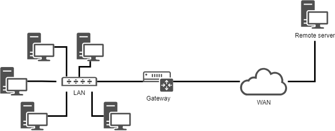

# Implementazione della Rete

In questo capitolo imparerai come gestire e lavorare con la rete.

****

**Obiettivi** : In questo capitolo imparerai come:

:heavy_check_mark: Configurare una workstation per usare DHCP;  
:heavy_check_mark: Configurare una workstation per utilizzare una configurazione statica;  
:heavy_check_mark: Configurare una workstation per utilizzare un gateway;  
:heavy_check_mark: Configurare una workstation per utilizzare i server DNS;  
:heavy_check_mark: Risolvere i problemi relativi alla rete di una workstation.

:checkered_flag: **rete**, **linux**, **ip**

**Conoscenza**: :star: :star:  
**Complessità**: :star::star:

**Tempo di lettura**: 30 minuti

****

## Generalità

Per illustrare questo capitolo, useremo la seguente architettura.



Ci consentirà di prendere in considerazione:

* l'integrazione in una LAN (local area network);
* la configurazione di un gateway per raggiungere un server remoto;
* la configurazione di un server DNS e l'implementazione della risoluzione dei nomi.

I parametri minimi da definire per la macchina sono:

* il nome della macchina;
* l'indirizzo IP;
* la subnet mask.

Esempio:

* `pc-rocky`;
* `192.168.1.10`;
* `255.255.255.0`.

La notazione chiamata CIDR è sempre più frequente: 192.168.1.10/24

Gli indirizzi IP vengono utilizzati per il corretto routing dei messaggi (pacchetti). Sono divisi in due parti:

* network bits - La parte associata a "1" consecutivi nella maschera di sottorete binaria
* host bits - La parte associata a "0" consecutivi nella subnet mask binaria

```
                                            |<- host bits ->|
                  |<--    network bits  -->|
192.168.1.10  ==> 11000000.10101000.00000001.00001010
255.255.255.0 ==> 11111111.11111111.11111111.00000000
```

La subnet mask viene utilizzata per definire i bit di network e del host di un indirizzo IP. Utilizzando la subnet mask, si può determinare l'indirizzo IP corrente:

* l'indirizzo di rete (**NetID** o **SubnetID**) eseguendo un AND logico bit per bit tra l'indirizzo IP e la maschera;
* l'indirizzo dell'host. (**HostID**) eseguendo un AND logico bit per bit tra l'indirizzo IP e il complemento della maschera.

```
192.168.1.10  ==> 11000000.10101000.00000001.00001010
255.255.255.0 ==> 11111111.11111111.11111111.00000000

NetID             11000000.10101000.00000001.00000000
                    192   . 168    . 1      . 0

HostID            00000000.00000000.00000000.00001010
                     0    .   0    .    0   . 10
```

**Legitimate subnet mask** - Da sinistra a destra, gli 1 consecutivi possono essere definiti come subnet masks valide.

```
legitimate       11111111.11111111.11111111.00000000

illegitimate     11001001.11111111.11111111.00000000
```

!!! tip "Suggerimento"

    L'indirizzo IP e la subnet mask devono apparire in coppia, come stabilito dai principi fondamentali della comunicazione di rete.

All'interno di una rete esistono anche indirizzi specifici che devono essere identificati. Il primo indirizzo di un intervallo e l'ultimo hanno un ruolo particolare:

* Il primo indirizzo di un intervallo è l'**indirizzo di rete**. Viene utilizzato per identificare le reti e instradare le informazioni da una rete all'altra. Questo indirizzo può essere ottenuto tramite Logic and Operations

    ```
    192.168.1.10  ==> 11000000.10101000.00000001.00001010
    255.255.255.0 ==> 11111111.11111111.11111111.00000000

    network address   11000000.10101000.00000001.00000000
                        192   . 168    . 1      . 0
    ```

    **Logic and Operations** - Quando entrambe sono vere (1), il risultato è vero (1); altrimenti, è falso (0)

* L'ultimo indirizzo di un intervallo è l'**indirizzo di broadcast**. Viene utilizzato per trasmettere informazioni a tutte le macchine presenti sulla rete. Mantieni invariati i bit di rete e sostituisci tutti i bit host con 1 per ottenere questo indirizzo.

    ```
    192.168.1.10  ==> 11000000.10101000.00000001.00001010
    255.255.255.0 ==> 11111111.11111111.11111111.00000000

    broadcast address 11000000.10101000.00000001.11111111
                        192   . 168    . 1      . 255
    ```

!!! tip "Suggerimento"

    Questi due indirizzi che svolgono ruoli speciali **non possono** essere assegnati al terminale per l'utilizzo.

### Indirizzo MAC / Indirizzo IP

Un **indirizzo MAC** è un identificatore fisico scritto in fabbrica sul dispositivo. Questo viene talvolta indicato come indirizzo hardware. È composto da 6 byte spesso indicati in forma esadecimale (ad esempio 5E:FF:56:A2:AF:15).

Questi 6 byte rappresentano rispettivamente:

* I primi tre byte rappresentano l'identificativo del produttore. Questo identifier è denominato OUI (Organizationally Unique Identifier, identificatore univoco dell'organizzazione).
* Gli ultimi tre byte rappresentano il numero di serie assegnato dal produttore.

!!! Warning "Attenzione"

    L'indirizzo MAC è codificato in modo permanente quando l'hardware lascia la fabbrica. Esistono due metodi principali per modificarlo:

    * Modifiche a livello di firmware (permanente): richiede strumenti avanzati in grado di riscrivere direttamente l'indirizzo MAC nella ROM della scheda di rete. Tali strumenti sono solitamente disponibili solo per i produttori di hardware.
    * Spoofing a livello software (temporaneo): modifica la modalità di visualizzazione dell'indirizzo MAC nel sistema operativo. Queste modifiche vengono solitamente ripristinate dopo il riavvio del sistema. Anche l'indirizzo MAC della scheda di rete virtuale nell'host virtuale viene implementato tramite spoofing.

Un indirizzo IP (Internet Protocol) è un numero identificativo assegnato in modo permanente o temporaneo a ciascun dispositivo connesso a una rete informatica che utilizza il protocollo Internet. L'indirizzo IP e la subnet mask devono apparire in coppia, come stabilito dai principi fondamentali della comunicazione di rete. Attraverso la subnet mask, possiamo conoscere l'indirizzo IP corrente:

* network bits e host bits
* NetID oppure SubnetID
* HostID
* Indirizzo di rete
* Indirizzo di broadcast

Gli indirizzi IP sono classificati in base al campo versione nel pacchetto come segue:

* **IPv4‌** - (4 bits, 0100). La quantità disponibile di IPv4 è 2<sup>32</sup> (ricavata dai campi dell'indirizzo di origine e di destinazione nei pacchetti IPv4). Specificatamente suddivisi in:

    * Indirizzi di Classe A. Il suo intervallo va da **0.0.0.0** a **127.255.255.255**.
    * Indirizzi di Classe B. Il suo intervallo va da **128.0.0.0** a **191.255.255.255</0</li>
    * Indirizzi di Classe C. Il suo intervallo va da **192.0.0.0** a **223.255.255.255**.
    * Indirizzi di Classe D. Il suo intervallo va da **224.0.0.0** a **239.255.255.255**.
    * Indirizzi di Classe E. Il suo intervallo va da **240.0.0.0** a **255.255.255.255**.

    Tra questi, gli indirizzi di classe A, gli indirizzi di classe B e gli indirizzi di classe C hanno tutti i propri intervalli di indirizzi privati. 0.0.0.0 è un indirizzo riservato e non è assegnato all'host. Gli indirizzi di classe D sono utilizzati per la comunicazione multicast e non sono assegnati agli host. Gli indirizzi di classe E sono riservati e non vengono utilizzati per le reti regolari.</ul></li>

* **IPv6** - (4 bits, 0110). La quantità disponibile di IPv6 è 2<sup>128</sup> (ricavata dai campi dell'indirizzo di origine e di destinazione nei pacchetti IPv6). Specificatamente suddivisi in:

    * Indirizzo Unicast. Include indirizzo unicast locale di collegamento (LLA), indirizzo locale univoco (ULA), indirizzo unicast globale (GUA), indirizzo di loopback, indirizzo non specificato
    * Indirizzo Anycast
    * Indirizzo Multicast</ul>

Descrizione del formato di scrittura per IPv6 a 128 bit:

* Formato di scrittura preferito - **X:X:X:X:X:X:X:X**. In questo formato di scrittura, gli indirizzi IPv6 a 128 bit sono suddivisi in 8 gruppi, ciascuno rappresentato da 4 valori esadecimali (0-9, A-F), separati da due punti (`:`) tra i gruppi. Ogni “X” rappresenta un insieme di valori esadecimali. Ad esempio **2001:0db8:130F:0000:0000:09C0:876A:130B**.

    * Omissione dello 0 iniziale - Per comodità di scrittura, lo “0” iniziale in ciascun gruppo può essere omesso, quindi l'indirizzo sopra riportato può essere abbreviato come **2001:db8:130F:0:0:9C0:876A:130B**.
    * Utilizzare il due punti due volte - Se l'indirizzo contiene due o più gruppi consecutivi entrambi pari a 0, è possibile utilizzare invece un doppio punto doppio. Quindi l'indirizzo sopra riportato può essere ulteriormente abbreviato come **2001:db8:130F::9C0:876A:130B**. Attenzione!  In un indirizzo IPv6 è possibile inserire solo il doppio due punti.

* Compatibile con i formati di scrittura - **X:X:X:X:X:X:d.d.d.d**. In un ambiente di rete misto, questo formato garantisce la compatibilità tra i nodi IPv6 e i nodi IPv4. Ad esempio **0:0:0:0:0:ffff:192.1.56.10** e **::ffff:192.1.56.10/96**.

In un indirizzo web (Uniform Resource Locator), un indirizzo IP può essere seguito da due punti e da un numero di porta (che indica l'applicazione a cui sono destinati i dati). Inoltre, per evitare confusione nell'URL, l'indirizzo IPv6 è scritto tra parentesi quadre (ad esempio, `[2001:db8:130F::9C0:876A:130B]:443`).

Come accennato in precedenza, le maschere di sottorete dividono gli indirizzi IPv4 in due parti: bit di rete e bit host. In IPv6, anche le subnet mask hanno la stessa funzione, ma il nome è cambiato (“n” rappresenta il numero di bit occupati dalla subnet mask):

* Prefisso di rete - È equivalente ai bit di rete in un indirizzo IPv4. In base alla subnet mask, occupa “n” bit.
* ID interfaccia - È equivalente ai bit host in un indirizzo IPv4. In base alla subnet mask, occupa “128-n” bit.

Ad esempio **2001:0db8:130F:0000:0000:09C0:876A:130B/64**：

```
    Network prefix
|<-    64 bits   ->|

                        Interface ID
                     |<-    64 bits    ->|
2001:0db8:130F:0000 : 0000:09C0:876A:130B
```

All'interno della stessa rete, gli indirizzi IP devono essere univoci: questa è una regola fondamentale della comunicazione di rete. All'interno della stessa LAN (Local Area Network), l'indirizzo MAC deve essere univoco.

### Struttura dei pacchetti IPv4

I pacchetti IPv4 contengono sia parti di intestazione che parti di dati:


**Versione**: aiuta i router a identificare le versioni dei protocolli. Per IPv4, il valore qui è 0100 (il valore binario 0100 equivale al valore decimale 4).

**IHL**: campo utilizzato per controllare la lunghezza dell'intestazione. Quando il campo “Opzioni” non è incluso, il valore minimo è 5 (ovvero binario 0101). In questo caso l'intestazione occupa 20 byte. Il valore massimo è 15 (ovvero 1111 in binario) e la lunghezza dell'intestazione è di 60 byte.

```
Lunghezza effettiva dell'intestazione IPv4 = Valore del campo IHL * 4
```

**Tipo di servizio**: questo campo viene utilizzato per definire la QoS (Quality Of Service) e la priorità dei pacchetti di dati. Questo campo è ora utilizzato principalmente per DSCP (Differentiated Services Code Point) ed ECN (Explicit Congestion Notification).

**Lunghezza totale**: rappresenta la lunghezza totale dell'intero datagramma IPv4 (pacchetto IPv4) in byte.

!!! note "Nota" 

    Il pacchetto IP e il datagramma IP sono espressioni tecnicamente diverse dello stesso concetto, entrambe riferite alle unità di dati trasmesse a livello di rete.

**Identificazione**: identifica tutti i frammenti di un datagramma IPv4. Tutti i frammenti dello stesso datagramma originale condividono lo stesso valore di identificazione per consentire un corretto riassemblaggio.

**Flag**: viene utilizzato per controllare il comportamento della frammentazione dei datagrammi IPv4. In ordine da sinistra a destra:

* Il primo bit - Non utilizzato, valore 0
* La seconda parte - DF (Don't Fragment, non frammentare). Se DF=1, significa che il datagramma IPv4 deve essere trasmesso nella sua interezza. Se supera l'MTU, viene scartato e viene restituito un errore ICMP (ad esempio “Fragmentazione necessaria”). Se DF=0, il router divide il datagramma IPv4 in più frammenti, ciascuno dei quali trasporta lo stesso valore del campo Identificazione.
* Il terzo bit - MF (More Fragment). Se MF=1, significa che il frammento corrente non è l'ultimo e che ci sono altri frammenti; se MF=0, significa che questo è l'ultimo frammento.

**Fragment Offset**: indica la posizione relativa del frammento nel datagramma IPv4 originale, in unità di 8 byte. Questo campo viene utilizzato principalmente per il riassemblaggio dei frammenti.

**TTL (Time To Live)**: questo campo viene utilizzato per limitare il tempo massimo di sopravvivenza o il numero massimo di hop dei datagrammi nella rete. Il valore iniziale è determinato dal mittente e il TTL diminuisce di 1 ogni volta che passa attraverso il router. Quando TTL=0, il datagramma viene scartato.

**Protocollo**: indica il tipo di protocollo utilizzato dai dati trasportati in questo datagramma. Il suo intervallo di valori è compreso tra 0 e 255.  Ad esempio, il numero di protocollo di TCP è 6, quello di UDP è 17, e quello di ICMP è 1.

**Header Checksum**: questo campo verrà ricalcolato ogni volta che il datagramma passa attraverso il router, principalmente a causa della diminuzione del campo TTL che provoca modifiche nell'intestazione. Questo campo verifica solo l'intestazione (esclusa la parte relativa ai dati). Se gli altri campi rimangono invariati e cambia solo il TTL, il checksum verrà aggiornato con un nuovo valore (diverso da zero) per garantire che l'intestazione non sia stata manomessa o danneggiata durante la trasmissione.

**Indirizzo di origine**: indirizzo IPv4 del mittente del datagramma

**Indirizzo di destinazione**: indirizzo IPv4 del destinatario del datagramma

**Opzioni**: campo facoltativo, con una lunghezza compresa tra 0 e 40 byte. Viene utilizzato solo quando l'IHL è superiore a 5. La lunghezza di questo campo deve essere un multiplo intero di 4 byte (se la lunghezza è inferiore a 4 byte, utilizzare il campo **padding** per il riempimento).

!!! tip "Suggerimento"

    Bit ha due significati. Nella teoria dell'informazione, si riferisce all'unità fondamentale di informazione, che rappresenta una scelta binaria (0 o 1). In informatica, è la più piccola unità di archiviazione dati, dove 8 bit equivalgono in genere a 1 byte, salvo diversamente specificato.

### Struttura dei pacchetti IPv6

I datagrammi IPv6 sono composti da tre parti:

* Basic Header
* Extension Header
* Upper Layer Protocol Data Unit

In alcuni libri, l'Extended Header  e Upper Layer Protocol Data Unit sono collettivamente denominate **Payload**.


La lunghezza fissa del Basic Header è di 40 byte ed è fissata a 8 campi:

**Versione**: aiuta i router a identificare le versioni dei protocolli. Per IPv6, il valore qui è 0110 (il valore binario 0110 equivale al valore decimale 6).

**Classe di Traffico**: equivalente al campo TOS (Type Of Service) nei datagrammi IPv4. Questo campo viene utilizzato per definire il QOS (Quality Of Service) e la priorità dei pacchetti di dati.

**Flow Label**: questo nuovo campo IPv6 viene utilizzato per controllare il flusso dei pacchetti. Un valore diverso da zero in questo campo indica che il pacchetto deve essere trattato in modo speciale; ovvero, il pacchetto non deve essere inviato attraverso percorsi diversi per raggiungere la destinazione, ma deve utilizzare lo stesso percorso. Un vantaggio di questo sistema è che il destinatario non deve riordinare il pacchetto, velocizzando così il processo. Questo campo aiuta a evitare il riordino dei pacchetti di dati ed è progettato specificamente per lo streaming multimediale/live.

**Payload Length**: Indica la dimensione del payload. Questo campo può rappresentare solo un payload con una lunghezza massima di 65535 byte. Se la lunghezza del payload è superiore a 65535 byte, il campo della lunghezza del payload verrà impostato su 0 e l'opzione jumbo payload verrà utilizzata nell'intestazione di estensione delle opzioni hop-by-hop.

**Next Header**: Utilizzato per indicare il tipo di intestazione del pacchetto dopo l'intestazione di base. Se è presente un primo header di estensione, esso rappresenta il tipo del primo header di estensione. Altrimenti, rappresenta il tipo di protocollo utilizzato dal livello superiore, come 6 (TCP) e 17 (UDP).

**Hop Limit**: questo campo è equivalente al Time To Live (TTL) nei datagrammi IPv4.

**Indirizzo sorgente**: questo campo rappresenta l'indirizzo del mittente del datagramma IPv6.

**Indirizzo di destinazione**: questo campo rappresenta l'indirizzo del destinatario del datagramma IPv6.


Nei datagrammi IPv4, l'intestazione IPv4 contiene campi opzionali quali Opzioni, che includono Sicurezza, Timestamp, Registrazione percorso, ecc. Queste opzioni possono estendere la lunghezza dell'intestazione IPv4 da 20 byte a 60 byte. Durante il processo di inoltro, la gestione dei datagrammi IPv4 che trasportano queste opzioni può consumare una quantità significativa di risorse del dispositivo, quindi nella pratica viene utilizzata raramente.

IPv6 rimuove queste opzioni dall'intestazione di base IPv6 e le inserisce nell'intestazione di estensione, che si trova tra l'intestazione di base IPv6 e l'unità dati del protocollo di livello superiore.

Un pacchetto IPv6 può contenere 0, 1 o più intestazioni di estensione, che vengono aggiunte dal mittente solo quando il dispositivo o il nodo di destinazione richiedono un'elaborazione speciale.

A differenza del campo Opzioni IPv4 (che può essere esteso fino a 40 byte e richiede uno spazio di archiviazione continuo), l'intestazione di estensione IPv6 adotta una struttura a catena e non ha limiti di lunghezza fissi, rendendola più scalabile in futuro. Il suo meccanismo di allineamento a 8 byte è implementato attraverso il campo Next Header, che garantisce l'efficienza dell'elaborazione ed evita il sovraccarico dovuto alla frammentazione.

**Intestazione successiva**: questo campo ha la stessa funzione del campo Intestazione successiva nell'intestazione di base.

**Extension Header Le**: indica la lunghezza dell'intestazione dell'estensione (esclusa la lunghezza dell'intestazione successiva).

**Extension Head Data**: il contenuto dell'intestazione di estensione è una combinazione di una serie di campi opzionali e campi di riempimento.

Attualmente, RFC definisce i seguenti tipi di Extension Header:

* Intestazione delle opzioni hop-by-hop (il valore del campo dell'intestazione successiva è 0) - Deve essere gestita da tutti i router nel percorso.
* Intestazione delle opzioni di destinazione (il valore del campo dell'intestazione successivo è 60) - Elaborata solo dal nodo di destinazione.
* Intestazione di instradamento (il valore del campo dell'intestazione successiva è 43) - Questa intestazione di estensione è simile alle opzioni Loose Source e Record Route in IPv4.
* Intestazione del frammento (il valore del campo dell'intestazione successivo è 44) - Come i pacchetti IPv4, la lunghezza dei pacchetti IPv6 da inoltrare non può superare l'unità massima di trasmissione (MTU). Quando la lunghezza del pacchetto supera l'MTU, il pacchetto deve essere frammentato. In IPv6, l'intestazione Fragment viene utilizzata da un nodo sorgente IPv6 per inviare un pacchetto più grande dell'MTU.
* Intestazione di autenticazione (il valore del campo Next Header è 51) - IPSec utilizza questa intestazione per fornire l'autenticazione dell'origine dei dati, il controllo dell'integrità dei dati e le funzioni anti-replay dei pacchetti. Protegge anche alcuni campi nell'intestazione di base IPv6.
* Intestazione Encapsulating Security Payload (il valore del campo dell'intestazione successiva è 50) - Questa intestazione fornisce le stesse funzioni dell'intestazione Authentication più la crittografia dei pacchetti IPv6.

L'RFC specifica che quando più intestazioni di estensione vengono utilizzate nello stesso datagramma, è consigliabile che tali intestazioni appaiano nel seguente ordine:

1. IPv6 Basic Header
2. Hop-by-Hop Options header
3. Destination Options header
4. Routing header
5. Fragment header
6. Authentication header
7. Encapsulating Security Payload header
8. Destination Options header
9. Upper-layer protocol header

Ad eccezione del Destination Option Header, che può apparire una o due volte (una volta prima del Routing Extension Header e una volta prima dell'intestazione Upper-layer protocol), tutte le altre intestazioni di estensione possono apparire solo una volta.

### DNS

**DNS (Domain Name System)**: La famiglia di protocolli TCP/IP offre la possibilità di connettersi ai dispositivi tramite indirizzi IP, ma per gli utenti è piuttosto difficile ricordare l'indirizzo IP di un dispositivo. Pertanto, è stato appositamente progettato un meccanismo di denominazione degli host basato su stringhe, in cui questi nomi host corrispondono all'indirizzo IP. È necessario un meccanismo di conversione e interrogazione tra indirizzi IP e nomi host, e il sistema che fornisce tale meccanismo è il Domain Name System (DNS). Il processo di "traduzione" di un nome di dominio in un indirizzo IP è chiamato **Risoluzione del nome di dominio**.

Il nome completo della macchina (**FQDN**) diventa `pc-rocky.mydomain.lan`.

* Hostname - viene utilizzato per identificare in modo univoco i dispositivi all'interno di una LAN (rete locale) o come parte di un nome di dominio (ad esempio `docs`)
* Domain name - Utilizzato per identificare in modo univoco i dispositivi sulla WAN (Wide Area Network). Ad esempio `docs.rockylinux.org`, dove `rockylinux.org` è il nome di dominio del dominio

!!! tip "Suggerimento"

    Il dominio non rappresenta un host specifico

**D: Perché è necessario il DNS?**

Agli albori di Internet, per ricordare la corrispondenza tra nomi host e indirizzi IP, era necessario scrivere tutte le corrispondenze in un file e gli utenti dovevano aggiornare manualmente il contenuto del file. Con il vigoroso sviluppo di Internet, i principali problemi che devono essere risolti sono:

* Un singolo file ha effetto solo sul computer attualmente in uso
* La gestione manuale dei contenuti dei file sta diventando sempre più difficile

Per risolvere i problemi emersi, è stato sviluppato il DNS, i cui vantaggi sono:

* Distribuito - Server DNS disponibili per gli utenti di tutto il mondo
* Gestione gerarchica - Divide la gerarchia per una gestione più semplice. Come mostrato nella figura seguente:

    

**Il livello 2** (collegamento dati) supporta la topologia di rete (token ring, stella, bus, ecc.), la suddivisione dei dati e gli errori di trasmissione. Un'espressione più standardizzata:

> "Il sistema globale dei server root DNS è strutturato logicamente attorno a 13 endpoint canonici (da a.root-servers.net a m.root-servers.net), un design che affonda le sue radici nei vincoli storici del protocollo. Dal punto di vista fisico, questi endpoint sono implementati attraverso oltre 1.500 server anycast distribuiti in tutto il mondo, gestiti da 13 organizzazioni indipendenti sotto il coordinamento di ICANN/IANA."

Per `docs.rockylinux.org.`:

* **Dominio principale** - Si riferisce a un punto (`.`).
* **Dominio di primo livello** - Si riferisce alla stringa `org`. Esistono molte controversie riguardo alla divisione dei domini di primo livello; ad esempio, alcuni documenti classificano `.org` o `org.` come domini di primo livello.
* **Dominio di secondo livello** - Si riferisce alla stringa `rockylinux`. Esistono molte controversie riguardo alla divisione dei domini di secondo livello, ad esempio alcuni documenti riportano `rockylinux.org.` o `.rockylinux.org.` come domini di secondo livello.
* **hostname** -  Si riferisce alla stringa `docs`.

**FQDN (Fully Qualified Domain Name)**: nome di dominio completo costituito da un nome host e vari livelli di domini. Secondo lo standard RFC (RFC 1034, RFC 2181, RFC 8499), il dominio root alla fine è uno standard industriale (ad esempio `docs.rockylinux.org.`). Nei file di configurazione di alcuni software DNS è necessario inserire un FQDN standard, ma il dominio principale può essere ignorato quando si accede a determinate risorse di rete (ad esempio, quando un utente visita `https://docs.rockylinux.org`, il browser aggiunge automaticamente un punto alla fine). **Domain name**: struttura che collega domini a tutti i livelli e inizia con un nome host. **Zona**: rappresenta una porzione contigua dello spazio dei nomi DNS gestita da un server autoritativo specifico, che memorizza tutti i record di risoluzione FQDN (come A, MX, ecc.) all'interno di tale ambito.

!!! tip "Suggerimento"

    In generale, "FQDN" è più efficace nell'esprimere il significato del documento di un autore rispetto a "nome di dominio", poiché i lettori di settori diversi hanno una comprensione diversa del termine "nome di dominio". Ad esempio, nel caso di `rockylinux.org`, alcuni lettori potrebbero interpretarlo come un nome di dominio, ma in realtà non è corretto. A rigor di termini, questo dovrebbe essere definito dominio (anziché nome di dominio). Pertanto, al fine di garantire un maggiore rigore, si richiede ai lettori di distinguere rigorosamente il significato dei domini e dei nomi di dominio.

### Modello teorico a 7 livelli ISO/OSI

**ISO (Organizzazione internazionale per la normazione)** - Organizzazione internazionale fondata nel 1974, il cui ruolo principale è quello di definire standard internazionali in vari settori. Per il settore Internet, l'ISO ha proposto il modello teorico di riferimento a 7 livelli OSI.

**OSI (Open System Interconnection Reference Model)** - Questo modello propone un quadro standard che cerca di interconnettere vari computer in una rete mondiale.

| Livello                 | Descrizione                                                                                                                                                                    |
| ----------------------- | ------------------------------------------------------------------------------------------------------------------------------------------------------------------------------ |
| 7 - Applicazione        | Fornire vari servizi di richiesta per applicazioni o richieste degli utenti                                                                                                    |
| 6 - Presentazione       | Codifica dei dati, conversione dei formati, crittografia dei dati                                                                                                              |
| 5 - Sessione            | Creare, gestire e mantenere le sessioni.                                                                                                                                       |
| 4 - Trasporto           | Comunicazione dati, creazione di connessioni end-to-end, ecc.                                                                                                                  |
| 3 - Rete                | Gestione delle connessioni di rete (instaurazione, mantenimento e interruzione), selezione del percorso di routing, raggruppamento dei pacchetti, controllo del traffico, ecc. |
| 2 - Collegamento dati   | Incapsulamento e trasmissione dei frame, controllo del traffico e verifica degli errori, ecc.                                                                                  |
| 1 - Collegamento fisici | Gestione dei mezzi di trasmissione, specifiche dell'interfaccia fisica, conversione e trasmissione dei segnali, ecc.                                                           |

!!! Note "Aiuto alla memoria"

    Per ricordare l'ordine degli strati del modello ISO/OSI, ricorda la seguente frase: **All People Seem To Need Data Processing**.

**Struttura gerarchica del modello**: incarna un principio di progettazione modulare, ovvero, scomponendo le complesse funzioni di comunicazione di rete in livelli indipendenti, ottiene il disaccoppiamento funzionale e la collaborazione standardizzata.

!!! note "Nota"

    Va notato che il modello a 7 livelli ISO/OSI non esiste nella comunicazione di rete reale. Fornisce semplicemente un quadro di riferimento e un approccio progettuale per la comunicazione via Internet.

**Modello a 4 livelli TCP/IP** - Il modello gerarchico utilizzato nella comunicazione di rete effettiva (semplifica il modello a 7 livelli ISO/OSI in un modello a 4 livelli). TCP/IP è sinonimo di un gruppo di protocolli che comprende numerosi protocolli e costituisce la suite di protocolli TCP/IP. Nell'analisi dei protocolli o nell'ambito didattico, talvolta viene informalmente denominato **modello a 5 livelli TCP/IP**.

| Livello                 | Protocolli                                                                                                                                                                       | Dispositivi hardware coinvolti in questo layer  |
|:----------------------- |:-------------------------------------------------------------------------------------------------------------------------------------------------------------------------------- |:----------------------------------------------- |
| 4 - Applicativo         | HTTP, FTP, SMTP, DNS, DHCP ...                                                                                                                                                   | -                                               |
| 3 - Trasporto           | TCP, UDP                                                                                                                                                                         | Firewall e load balancer                        |
| 2 - Internet            | IP, ICMP, ARP, RARP, IGMP                                                                                                                                                        | Router                                          |
| 1 - Interfaccia di rete | Ethernet protocol (IEEE 802.3), PPP (Point to Point Protocol), PPPoE (Point-to-Point Protocol over Ethernet), Wi-Fi (IEEE 802.11), ADSL (Asymmetric Digital Subscriber Line) ... | NIC, switch, hub, repeater, twisted pair, modem |

* **Livello applicativo** - Unifica i livelli applicativo, presentazione e sessione nel modello teorico in un unico livello applicativo.
* **Livello trasporto** - Il livello di trasporto nel modello teorico.
* **Livello Internet** - Il livello di rete nel modello teorico.
* **Livello interfaccia di rete** - Integrazione del livello di collegamento dati e del livello fisico del modello teorico in un unico livello.

!!! tip Suggerimento “Espressione terminologica”

    Il modello a 4 livelli TCP/IP, la suite di protocolli TCP/IP e lo stack di protocolli TCP/IP sono espressioni diverse dello stesso concetto.

## La denominazione delle interfacce

*lo* è l'interfaccia "**loopback**", che consente ai programmi TCP/IP di comunicare tra loro senza uscire dal computer locale. Ciò consente di verificare se il **modulo di rete del sistema funziona correttamente** e permette anche di eseguire il ping del localhost. Tutti i pacchetti che entrano tramite localhost escono tramite localhost. I pacchetti ricevuti sono i pacchetti inviati.

Il kernel Linux assegna nomi alle interfacce con un prefisso specifico a seconda del tipo. Tradizionalmente, tutte le interfacce **Ethernet**, ad esempio, iniziavano con **eth**. Il prefisso era seguito da un numero, il primo dei quali era 0 (eth0, eth1, eth2...). Alle interfacce wifi è stato assegnato un prefisso WLAN.

Nelle distribuzioni Linux Rocky8, systemd nominerà le interfacce con la seguente politica, dove "X" rappresenta un numero:

* `enoX`: dispositivi on-board
* `ensX`: slot hotplug PCI Express
* `enpXsX`: posizione fisica/geografica del connettore dell'hardware
* ...

## Uso del comandi `ip`

Dimenticate il vecchio comando `ifconfig`! Pensa a `ip`!

!!! Note "Nota"

    Commento per gli amministratori di sistemi Linux meno recenti:
    
    Il comando storico per la gestione della rete è `ifconfig`. Questo comando è stato sostituito dal comando `ip`, già ben noto agli amministratori di rete.
    
    Il comando `ip` è l'unico comando che consente di gestire **indirizzi IP, ARP, routing, ecc.**.
    
    Il comando `ifconfig` non è più installato di default in Rocky8.
    
    È importante acquisire buone abitudini fin da ora.

## Il nome host

Il comando `hostname` visualizza o imposta il nome host del sistema.

```bash
hostname [-f] [hostname]
```

| Opzione | Descrizione                             |
| ------- | --------------------------------------- |
| `-f`    | Mostra il FQDN                          |
| `-i`    | Visualizza gli indirizzi IP del sistema |

!!! Tip "Suggerimento"

    Questo comando viene utilizzato da vari programmi di rete per identificare il computer.

Per assegnare un nome host, è possibile utilizzare il comando `hostname`, ma le modifiche non verranno mantenute al successivo avvio. Il comando senza argomenti visualizza il nome dell'host.

Per impostare il nome host, è necessario modificare il file `/etc/sysconfig/network`:

```bash
NETWORKING=yes
HOSTNAME=pc-rocky.mondomaine.lan
```

Lo script di avvio RedHat consulta anche il file `/etc/hosts` per risolvere il nome host del sistema.

All'avvio del sistema, Linux valuta il valore `HOSTNAME` nel file `/etc/sysconfig/network`.

Quindi utilizza il file `/etc/hosts` per valutare l'indirizzo IP principale del server e il suo nome host. Deduce il nome di dominio DNS.

È quindi fondamentale compilare questi due file prima di qualsiasi configurazione dei servizi di rete.

!!! Tip "Suggerimento"

    Per verificare che questa configurazione sia corretta, i comandi `hostname` e `hostname -f` devono restituire i valori previsti.

## /etc/hosts file

Il file `/etc/hosts` è una tabella statica di mappatura dei nomi host, che segue il seguente formato:

```bash
@IP <hostname>  [alias]  [# comment]
```

Esempio di un file `/etc/hosts`:

```bash
127.0.0.1       localhost localhost.localdomain
::1             localhost localhost.localdomain
192.168.1.10    rockstar.rockylinux.lan rockstar
```

Il file `/etc/hosts` è ancora utilizzato dal sistema, in particolare al momento dell'avvio, quando viene determinato il nome di dominio completo (FQDN) del sistema.

!!! Tip "Suggerimento"

    RedHat raccomanda di compilare almeno una riga contenente il nome del sistema.

Se il servizio **DNS** (**D**omain **N**ame **S**ervice) non è attivo, è necessario inserire tutti i nomi nel file hosts per ciascuna delle macchine.

Il file `/etc/hosts` contiene una riga per ogni voce, con l'indirizzo IP, l'FQDN, quindi il nome host (in quest'ordine) e una serie di alias (alias1 alias2 ...). L'alias è opzionale.

## il file `/etc/nsswitch.conf`

Il **NSS** (**N**ame **S**ervice **S**witch) consente ai file di configurazione (ad esempio, `/etc/passwd`, `/etc/group`, `/etc/hosts`) possano essere sostituiti da uno o più database centralizzati.

Il file `/etc/nsswitch.conf` viene utilizzato per configurare i database dei servizi di nome.

```bash
passwd: files
shadow: files
group: files

hosts: files dns
```

In questo caso, Linux cercherà prima una corrispondenza del nome host (riga `hosts:`) nel file `/etc/hosts` (valore `files`) prima di interrogare il DNS (valore `dns`)! Questo comportamento può essere modificato modificando il file `/etc/nsswitch.conf`.

Naturalmente, è possibile immaginare di interrogare un server LDAP, MySQL o altro configurando il servizio nomi in modo che risponda alle richieste di sistema relative a host, utenti, gruppi, ecc.

La risoluzione del servizio nomi può essere verificata con il comando `getent`, che vedremo più avanti in questo corso.

## file `/etc/resolv.conf`

Il file `/etc/resolv.conf` contiene la configurazione della risoluzione dei nomi DNS.

```bash
#Generated by NetworkManager
domain mondomaine.lan
search mondomaine.lan
nameserver 192.168.1.254
```

!!! Tip "Suggerimento"

    Questo file è storico. Non viene più compilato direttamente!

Le distribuzioni di nuova generazione hanno generalmente integrato il servizio `NetworkManager`. Questo servizio consente di gestire la configurazione in modo più efficiente, sia in modalità grafica che in modalità console.

Consente di aggiungere server DNS al file di configurazione di un'interfaccia di rete. Quindi popola dinamicamente il file `/etc/resolv.conf`, che non dovrebbe mai essere modificato direttamente, altrimenti le modifiche alla configurazione andranno perse al successivo avvio del servizio di rete.

## comando `ip`

Il comando `ip` del pacchetto `iproute2` consente di configurare un'interfaccia e la relativa tabella di routing.

Mostra le interfacce :

```bash
[root]# ip link
```

Mostra le informazioni sulle interfacce:

```bash
[root]# ip addr show
```

Mostra le informazioni su una interfaccia :

```bash
[root]# ip addr show eth0
```

Mostra la tabella ARP:

```bash
[root]# ip neigh
```

Tutti i comandi storici di gestione della rete sono stati raggruppati sotto il comando `ip`, ben noto agli amministratori di rete.

## configurazione DHCP

Il protocollo **DHCP** (**D**ynamic **H**ost **C**ontrol **P**rotocol) consente di ottenere una configurazione IP completa tramite la rete. Questa è la modalità di configurazione predefinita di un'interfaccia di rete in Rocky Linux, il che spiega perché un sistema connesso alla rete di un router Internet può funzionare senza ulteriori configurazioni.

La configurazione delle interfacce in Rocky Linux viene effettuata nella cartella `/etc/sysconfig/network-scripts/`.

Per ogni interfaccia Ethernet, un file `ifcfg-ethX` configura l'interfaccia associata.

```bash
DEVICE=eth0
ONBOOT=yes
BOOTPROTO=dhcp
HWADDR=00:0c:29:96:32:e3
```

* Nome dell'interfaccia : (deve essere nel nome del file)

```bash
DEVICE=eth0
```

* Avvia automaticamente l'interfaccia:

```bash
ONBOOT=yes
```

* Effettua una richiesta DHCP all'avvio dell'interfaccia:

```bash
BOOTPROTO=dhcp
```

* Specificare l'indirizzo MAC (facoltativo ma utile quando sono presenti più interfacce):

```bash
HWADDR=00:0c:29:96:32:e3
```

!!! Tip "Suggerimento"

    Se NetworkManager è installato, le modifiche vengono applicate automaticamente. In caso contrario, è necessario riavviare il servizio di rete.

* Riavviare il servizio di rete:

```bash
[root]# systemctl restart NetworkManager
```

## Configurazione statica

La configurazione statica richiede almeno:

```bash
DEVICE=eth0
ONBOOT=yes
BOOTPROTO=none
IPADDR=192.168.1.10
NETMASK=255.255.255.0
```

* Qui stiamo sostituendo "dhcp" con "none" che equivale alla configurazione statica:

```bash
BOOTPROTO=none
```

* Indirizzo IP:

```bash
IPADDR=192.168.1.10
```

* Subnet mask:

```bash
NETMASK=255.255.255.0
```

* La maschera può essere specificata con un prefisso:

```bash
PREFIX=24
```

!!! Warning "Attenzione"

    È necessario utilizzare NETMASK O PREFIX - Non entrambi!

## Routing (Instradamento)


```bash
DEVICE=eth0
ONBOOT=yes
BOOTPROTO=none
HWADDR=00:0c:29:96:32:e3
IPADDR=192.168.1.10
NETMASK=255.255.255.0
GATEWAY=192.168.1.254
```

Il comando `ip route`:

```bash
[root]# ip route show
192.168.1.0/24 dev eth0 […] src 192.168.1.10 metric 1
default via 192.168.1.254 dev eth0 proto static
```

È utile sapere come leggere una tabella di routing, specialmente in un ambiente con più interfacce di rete.

* Nell'esempio mostrato, la rete `192.168.1.0/24` è raggiungibile direttamente dal dispositivo `eth0`, quindi la metrica è `1` (non attraversa un router).

* Tutte le altre reti diverse dalla precedente saranno raggiungibili, sempre dal dispositivo `eth0`, ma questa volta i pacchetti saranno indirizzati a un gateway `192.168.1.254`. Il protocollo di routing è un protocollo statico (anche se in Linux è possibile aggiungere un percorso a un indirizzo assegnato dinamicamente).

## Risoluzione dei nomi

Un sistema deve risolvere:

* FQDN in indirizzi IP

```bash
www.free.fr = 212.27.48.10
```

* Indirizzi IP in nomi

```bash
212.27.48.10 = www.free.fr
```

* o per ottenere informazioni su un'area:

```bash
MX de free.fr = 10 mx1.free.fr + 20 mx2.free.fr
```

```bash
DEVICE=eth0
ONBOOT=yes
BOOTPROTO=none
HWADDR=00:0c:29:96:32:e3
IPADDR=192.168.1.10
NETMASK=255.255.255.0
GATEWAY=192.168.1.254
DNS1=172.16.1.2
DNS2=172.16.1.3
DOMAIN=rockylinux.lan
```

In questo caso, per raggiungere il DNS, è necessario passare attraverso il gateway.

```bash
 #Generated by NetworkManager
 domain mondomaine.lan
 search mondomaine.lan
 nameserver 172.16.1.2
 nameserver 172.16.1.3
```

NetworkManager ha aggiornato il file.

## Risoluzione dei problemi

Il comando `ping` invia datagrammi a un altro computer e attende una risposta.

È il comando di base per testare la connettività di rete perché verifica la connessione tra la tua interfaccia di rete e un'altra.

Sintassi del comando `ping`:

```bash
ping [-c numerical] destination
```

L'opzione `-c` (count) consente di interrompere il comando dopo il conto alla rovescia in secondi.

Esempio:

```bash
[root]# ping –c 4 localhost
```

!!! Tip "Suggerimento"

    Convalidare la connettività da vicino a lontano

1. Convalidare il livello software TCP/IP

    ```bash
    [root]# ping localhost
    ```

    Il "ping" del loop interno non rileva un guasto hardware sull'interfaccia di rete. Determina semplicemente se la configurazione del software IP è corretta.

2. Convalidare la scheda di rete

    ```bash
    [root]# ping 192.168.1.10
    ```

    Per verificare il funzionamento della scheda di rete, dobbiamo eseguire il ping del suo indirizzo IP. If the network cable is not connected to the network card, the network card should be in a "down" state.

    Se il ping non funziona, controllare prima il cavo di rete allo switch di rete e riassemblare l'interfaccia (vedere il comando `if up`), quindi controllare l'interfaccia stessa.

3. Convalidare la connettività del gateway

    ```bash
    [root]# ping 192.168.1.254
    ```

4. Convalidare la connettività di un server remoto

    ```bash
    [root]# ping 172.16.1.2
    ```

5. Convalidare il servizio DNS

    ```bash
    [root]# ping www.free.fr
    ```

### comando `dig`

Il comando `dig` viene utilizzato per interrogare il server DNS.

La sintassi del comando `dig`:

```bash
dig [-t type] [+short] [name]
```

Esempi:

```bash
[root]# dig +short rockylinux.org
76.223.126.88
[root]# dig -t MX +short rockylinux.org                                                          ✔
5 alt1.aspmx.l.google.com.
...
```

Il comando `dig` è usato per interrogare i server DNS. L'impostazione predefinita è prolissa, ma l'opzione `+short` può modificare questo comportamento.

È anche possibile specificare un **tipo di record** DNS da risolvere, come un **tipo** MX per ottenere informazioni sui mail exchanger di un dominio.

### comando `getent`

Il comando `getent` (get entry) ottiene una voce NSSwitch (`hosts` + `dns`)

Sintassi del comando `getent`:

```bash
getent hosts name
```

Esempio:

```bash
[root]# getent hosts rockylinux.org
  76.223.126.88 rockylinux.org
```

L'interrogazione di un solo server DNS potrebbe restituire un risultato errato che non tiene conto del contenuto di un file `hosts`, anche se al giorno d'oggi ciò dovrebbe verificarsi raramente.

Per tenere conto del file `/etc/hosts`, è necessario interrogare il servizio di nomi NSSwitch, che si occuperà di qualsiasi risoluzione DNS.

### comando `ipcalc`

Il comando `ipcalc` (**calcolo IP**) calcola l'indirizzo di una rete o di una trasmissione da un indirizzo IP e una maschera.

Sintassi del comando `ipcalc`:

```bash
ipcalc  [options] IP <netmask>
```

Esempio:

```bash
[root]# ipcalc –b 172.16.66.203 255.255.240.0
BROADCAST=172.16.79.255
```

!!! Tip "Suggerimento"

    Questo comando è interessante, seguito da un reindirizzamento per compilare automaticamente i file di configurazione delle interfacce:

    ```
    [root]# ipcalc –b 172.16.66.203 255.255.240.0 >> /etc/sysconfig/network-scripts/ifcfg-eth0
    ```

| Opzione | Descrizione                                   |
| ------- | --------------------------------------------- |
| `-b`    | Visualizza l'indirizzo di trasmissione.       |
| `-n`    | Visualizza l'indirizzo di rete e la maschera. |

`ipcalc` è un modo semplice per calcolare le informazioni IP di un host. Le varie opzioni indicano quali informazioni `ipcalc` deve visualizzare sull'output standard. È possibile specificare più opzioni. Dovrai selezionare un indirizzo IP su cui operare. La maggior parte delle operazioni richiede anche una maschera di rete o un prefisso CIDR.

| Opzione corta | Opzione lunga | Descrizione                                                                                                                                                                                                                                       |
| ------------- | ------------- | ------------------------------------------------------------------------------------------------------------------------------------------------------------------------------------------------------------------------------------------------- |
| `-b`          | `--broadcast` | Visualizza l'indirizzo di trasmissione dell'indirizzo IP specificato e la maschera di rete.                                                                                                                                                       |
| `-h`          | `--hostname`  | Visualizza il nome host dell'indirizzo IP fornito tramite DNS.                                                                                                                                                                                    |
| `-n`          | `--netmask`   | Calcola la maschera di rete per l'indirizzo IP specificato. Presuppone che l'indirizzo IP faccia parte di una rete completa di classe A, B o C. Molte reti non utilizzano maschere di rete predefinite, quindi verrà restituito un valore errato. |
| `-p`          | `--prefix`    | Indica il prefisso della maschera/indirizzo IP.                                                                                                                                                                                                   |
| `-n`          | `--network`   | Indica l'indirizzo di rete dell'indirizzo IP e della maschera specificati.                                                                                                                                                                        |
| `-s`          | `--silent`    | Non visualizza alcun messaggio di errore.                                                                                                                                                                                                         |

### comando `ss`

Il comando `ss` (**statistiche socket**) visualizza le porte in ascolto sulla rete.

Sintassi del comando `ss`:

```bash
ss [-tuna]
```

Esempio:

```bash
[root]# ss –tuna
tcp   LISTEN   0   128   *:22   *:*
```

I comandi `ss` e `netstat` (da seguire) saranno molto importanti per il resto della tua vita con Linux.

Quando si implementano servizi di rete, è prassi comune verificare se il servizio è in ascolto sulle porte previste utilizzando uno di questi due comandi.

### comando `netstat`

!!! Warning "Attenzione"

    Il comando `netstat` è ora deprecato e non è più installato di default su Rocky Linux. È ancora possibile trovare alcune versioni di Linux che lo hanno installato, ma è meglio passare a `ss` per tutto ciò per cui avresti usato `netstat`.

Il comando `netstat` (**statistiche di rete**) visualizza le porte in ascolto sulla rete.

Sintassi del comando `netstat`:

```bash
netstat -tapn
```

Esempio:

```bash
[root]# netstat –tapn
tcp  0  0  0.0.0.0:22  0.0.0.0:*  LISTEN 2161/sshd
```

### Conflitti di indirizzi IP o MAC

Una configurazione errata può causare l'utilizzo dello stesso indirizzo IP da parte di più interfacce. Questo può accadere quando una rete ha più server DHCP o quando lo stesso indirizzo IP viene assegnato manualmente più volte.

Quando la rete non funziona correttamente e la causa potrebbe essere un conflitto di indirizzi IP, è possibile utilizzare il software `arp-scan` (richiede il repository EPEL):

```bash
dnf install arp-scan
```

Esempio:

```bash
$ arp-scan -I eth0 -l

172.16.1.104  00:01:02:03:04:05       3COM CORPORATION
172.16.1.107  00:0c:29:1b:eb:97       VMware, Inc.
172.16.1.250  00:26:ab:b1:b7:f6       (Unknown)
172.16.1.252  00:50:56:a9:6a:ed       VMWare, Inc.
172.16.1.253  00:50:56:b6:78:ec       VMWare, Inc.
172.16.1.253  00:50:56:b6:78:ec       VMWare, Inc. (DUP: 2)
172.16.1.253  00:50:56:b6:78:ec       VMWare, Inc. (DUP: 3)
172.16.1.253  00:50:56:b6:78:ec       VMWare, Inc. (DUP: 4)
172.16.1.232  88:51:fb:5e:fa:b3       (Unknown) (DUP: 2)
```

!!! Tip "Suggerimento"

    Come mostra l'esempio precedente, i conflitti di indirizzi MAC sono possibili! Le tecnologie di virtualizzazione e la copia di macchine virtuali causano questi problemi.

## Configurazione a caldo

Il comando `ip` consente di aggiungere un indirizzo IP a un'interfaccia.

```bash
ip addr add @IP dev DEVICE
```

Esempio:

```bash
[root]# ip addr add 192.168.2.10 dev eth1
```

Il comando `ip` consente l'attivazione o la disattivazione di un'interfaccia:

```bash
ip link set DEVICE up
ip link set DEVICE down
```

Esempio:

```bash
[root]# ip link set eth1 up
[root]# ip link set eth1 down
```

Il comando `ip` aggiunge una route:

```bash
ip route add [default|netaddr] via @IP [dev device]
```

Esempio:

```bash
[root]# ip route add default via 192.168.1.254
[root]# ip route add 192.168.100.0/24 via 192.168.2.254 dev eth1
```

## In sintesi

I file utilizzati in questo capitolo sono:


Una configurazione completa dell'interfaccia potrebbe essere questa (file `/etc/sysconfig/network-scripts/ifcfg-eth0`):

```bash
 DEVICE=eth0
 ONBOOT=yes
 BOOTPROTO=none
 HWADDR=00:0c:29:96:32:e3
 IPADDR=192.168.1.10
 NETMASK=255.255.255.0
 GATEWAY=192.168.1.254
 DNS1=172.16.1.1
 DNS2=172.16.1.2
 DOMAIN=rockylinux.lan
```

Il metodo di risoluzione dei problemi dovrebbe andare dal più vicino al più lontano:

1. ping localhost (software test)
2. ping IP-address (hardware test)
3. ping gateway (connectivity test)
4. ping remote server (routing test)
5. DNS query (dig or ping)


