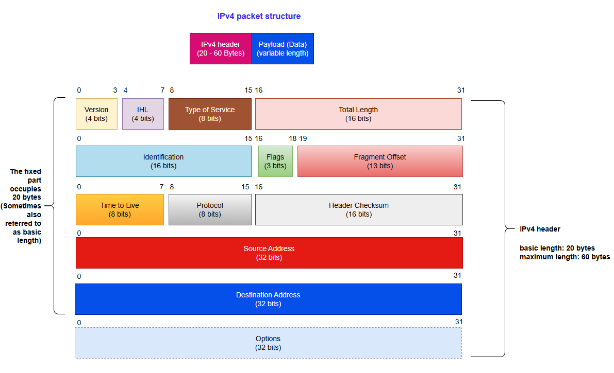
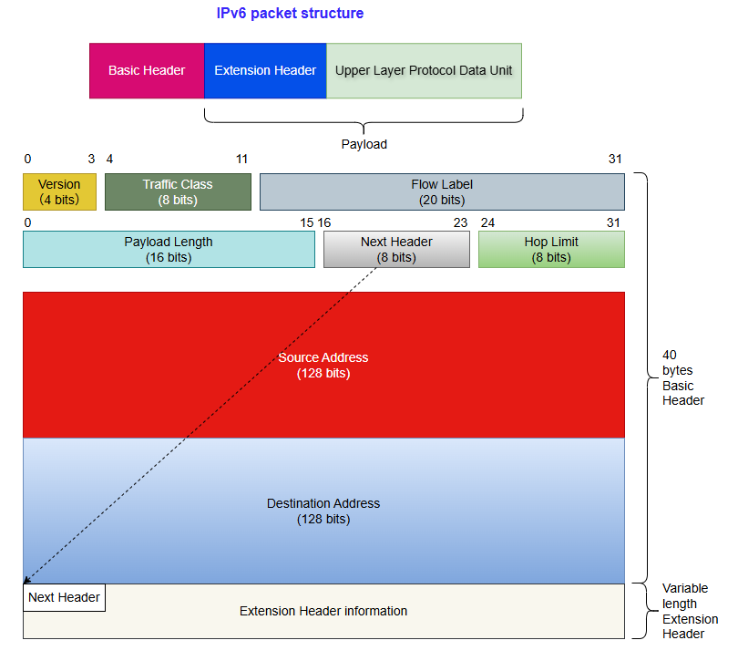
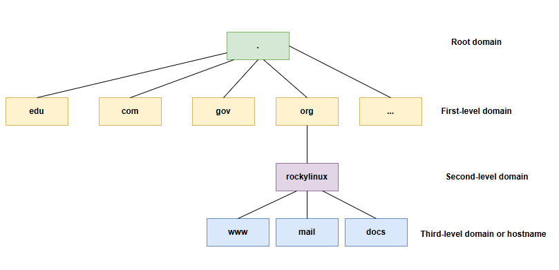

# Implementing the Network

In this chapter you will learn how to work with and manage the network.

****

**Objectives**: In this chapter you will learn how to:

:heavy_check_mark: Configure a workstation to use DHCP;  
:heavy_check_mark: Configure a workstation to use a static configuration;  
:heavy_check_mark: Configure a workstation to use a gateway;  
:heavy_check_mark: Configure a workstation to use DNS servers;  
:heavy_check_mark: Troubleshoot the network of a workstation.  

:checkered_flag: **network**, **linux**, **ip**

**Knowledge**: :star: :star:  
**Complexity**: :star: :star:

**Reading time**: 30 minutes

****

## Generalities

To illustrate this chapter, we will use the following architecture.


It will allow us to consider:

* integration in a LAN (local area network);
* the configuration of a gateway to reach a remote server;
* the configuration of a DNS server and the implementation of name resolution.

The minimum parameters to be defined for the machine are:

* the name of the machine;
* the IP address;
* the subnet mask.

Example:

* `pc-rocky`;
* `192.168.1.10`;
* `255.255.255.0`.

The notation called CIDR is more and more frequent: 192.168.1.10/24

IP addresses are used for the proper routing of messages (packets). They are divided into two parts:

* network bits - The part associated with consecutive "1s" in the binary subnet mask
* host bits - The part associated with consecutive "0s" in the binary subnet mask

```
                                            |<- host bits ->|
                  |<--    network bits  -->|
192.168.1.10  ==> 11000000.10101000.00000001.00001010
255.255.255.0 ==> 11111111.11111111.11111111.00000000
```

The subnet mask is used to define the network bits and host bits of an IP address. By using subnet mask, we can determine the current IP address:

* the network address (**NetID** or **SubnetID**) by performing a bitwise logical AND between the IP address and the mask;
* the host address (**HostID**) by performing a bitwise logical AND between the IP address and the complement of the mask.

```
192.168.1.10  ==> 11000000.10101000.00000001.00001010
255.255.255.0 ==> 11111111.11111111.11111111.00000000

NetID             11000000.10101000.00000001.00000000
                    192   . 168    . 1      . 0

HostID            00000000.00000000.00000000.00001010
                     0    .   0    .    0   . 10
```

**Legitimate subnet mask** - In order from left to right, consecutive 1s can be defined as valid subnet masks.

```
legitimate       11111111.11111111.11111111.00000000

illegitimate     11001001.11111111.11111111.00000000
```

!!! tip

    The IP address and subnet mask must appear in pairs, which is determined by the basic principles of network communication.

There are also specific addresses within a network, which must be identified. The first address of a range as well as the last one have a particular role:

* The first address of a range is the **network address**. It is used to identify networks and to route information from one network to another. This address can be obtained through Logic and Operations.

    ```
    192.168.1.10  ==> 11000000.10101000.00000001.00001010
    255.255.255.0 ==> 11111111.11111111.11111111.00000000
                      
    network address   11000000.10101000.00000001.00000000
                        192   . 168    . 1      . 0
    ```

    **Logic and Operations** - When both are true (1), the result is true (1); otherwise, it is false (0)

* The last address of a range is the **broadcast address**. It is used to broadcast information to all the machines on the network. Keep the network bits unchanged and replace all host bits with 1 to obtain the this address.

    ```
    192.168.1.10  ==> 11000000.10101000.00000001.00001010
    255.255.255.0 ==> 11111111.11111111.11111111.00000000
                      
    broadcast address 11000000.10101000.00000001.11111111
                        192   . 168    . 1      . 255
    ```

!!! tip

    These two addresses, which play special roles, **cannot** be assigned to the terminal machine for use.

### MAC address and IP address

A **MAC address** is a physical identifier written in the factory onto the device. This is sometimes referred to as the hardware address. It consists of 6 bytes often given in hexadecimal form (for example, 5E:FF:56:A2:AF:15).

These 6 bytes respectively represent:

* The first three bytes represent the manufacturer identifier. This identifier is called OUI (Organizationally Unique Identifier).
* The last three bytes contain the manufacturer-allocated serial number.

!!! Warning

    The MAC address is hardcoded when the hardware leaves the factory. There are two main methods to modify it:
    
    * Firmware-level modification (permanent): Requires advanced tools that can directly rewrite the MAC address in the network card's ROM. Such tools are typically only available to hardware manufacturers.
    * Software-level spoofing (temporary): Modifies how the MAC address appears to the operating system. These changes are usually reset after a system reboot. The MAC address of the virtual network card in the virtual host is also spoofed.

An Internet Protocol (**IP**) address is an identification number permanently or temporarily assigned to each device connected to a computer network using the Internet Protocol. The IP address and subnet mask must appear in pairs, which is determined by the basic principles of network communication. Through the subnet mask, we can know the current IP address:

* network bits and host bits
* NetID or SubnetID
* HostID
* network address
* broadcast address

IP addresses are classified based on the version field in the packet as follows:

* **IPv4‌** - (4 bits, 0100). The available IPv4 address space is 2<sup>32</sup> (as indicated by the source and destination address fields in IPv4 packets). Specifically divided into:

    * Class A address. Its range is from **0.0.0.0** to **127.255.255.255**
    * Class B address. Its range is from **128.0.0.0** to **191.255.255.255**
    * Class C address. Its range is from **192.0.0.0** to **223.255.255.255**
    * Class D address. Its range is from **224.0.0.0** to **239.255.255.255**
    * Class E address. Its range is from **240.0.0.0** to **255.255.255.255**

    Among them, Class A, Class B, and Class C addresses each have their own private address ranges. 0.0.0.0 is a reserved address and is not assigned to the host. Class D addresses are used for multicast communication and are not assigned to hosts. Class E addresses are reserved and not used for regular networks.

* **IPv6** - (4 bits, 0110). The available quantity of IPv6 is 2<sup>128</sup> (as indicated by the source and destination address fields in IPv6 packets). Specifically divided into:

    * Unicast address. Include Link-local unicast address (LLA), Unique local address (ULA), Global unicast address (GUA), Loopback address, Unspecified address
    * Anycast address
    * Multicast address

Description of writing format for 128-bit IPv6:

* Preferred writing format - **X:X:X:X:X:X:X:X**. In this writing format, 128-bit IPv6 addresses are divided into eight groups, each represented by four hexadecimal values (0-9, A-F), separated by colons (`:`) between groups. Each "X" represents a set of hexadecimal values. For example, **2001:0db8:130F:0000:0000:09C0:876A:130B**.

    * Omitting the leading 0 - For the convenience of writing, the leading "0" in each group can be omitted so that the above address can be abbreviated as **2001:db8:130F:0:0:9C0:876A:130B**.
    * Use double colon - If the address contains two or more consecutive groups that are both 0, a double colon can be used instead. The above address can be further abbreviated to **2001:db8:130F::9C0:876A:130B**. Attention! A double colon can only appear once in an IPv6 address.

* Compatible with writing formats - **X:X:X:X:X:X:d.d.d.d**. In a mixed network environment, this format ensures compatibility between IPv6 nodes and IPv4 nodes. For example **0:0:0:0:0:ffff:192.1.56.10** and **::ffff:192.1.56.10/96**.

In a web address (Uniform Resource Locator), an IP address can be followed by a colon and a port number (indicating the application to which the data is destined). Also, to avoid confusion in a URL, the IPv6 address is written in square brackets (For example, `[2001:db8:130F::9C0:876A:130B]:443`).

As mentioned earlier, subnet masks divide IPv4 addresses into two parts: network bits and host bits. In IPv6, subnet masks also have the same function, but the name has changed ("n" represents the number of bits occupied by the subnet mask):

* Network prefix - It is equivalent to the network bits in an IPv4 address. According to the subnet mask, occupy "n" bits.
* Interface ID - It is equivalent to the host bits in an IPv4 address. According to the subnet mask, occupy "128-n" bits.

For example **2001:0db8:130F:0000:0000:09C0:876A:130B/64**:

```
    Network prefix
|<-    64 bits   ->|

                        Interface ID
                     |<-    64 bits    ->|
2001:0db8:130F:0000 : 0000:09C0:876A:130B
```

In the same network, IP addresses must be unique, which is a fundamental rule of network communication. In the same LAN (Local Area Network), the MAC address must be unique.

### IPv4 packet structure

IPv4 packets contain both header and data parts:



**Version**: Help routers identify protocol versions. For IPv4, the value here is 0100 (Binary 0100 is equivalent to decimal 4)

**IHL**: A field used to control the length of the header. When the "Options" field is not included, the minimum value is 5 (namely, binary 0101). At this time, the head occupies 20 bytes. The maximum value is 15 (namely, binary 1111), and the header is 60 bytes long.

```
The actual length of the IPv4 header = The value of the IHL field * 4
```

**Type of Service**: This field is used to define the QoS (Quality of Service) and priority of data packets. This field is now used primarily for DSCP (Differentiated Services Code Point) and ECN (Explicit Congestion Notification).

**Total Length**: Represents the total length of the entire IPv4 datagram (IPv4 packet) in bytes.

!!! note 

    An IP packet and an IP datagram are technically distinct terms for the same concept: data units transmitted at the network layer.

**Identification**: Identifies all fragments of an IPv4 datagram. All fragments from the same original datagram share the same Identification value to enable correct reassembly.

**Flags**: Used to control IPv4 datagram fragmentation behavior. In order from left to right:

* The first bit - Not used, value 0
* The second bit - DF (Don’t Fragment). If DF=1, the IPv4 datagram must be transmitted in its entirety. If it exceeds the MTU, it is discarded and an ICMP error is returned (e.g., "Fragmentation Needed"). If DF=0, the router splits the IPv4 datagram into multiple fragments, each of which carries the same ‌Identification‌ field value
* The third bit - MF (More Fragment). If MF=1, it means that the current fragment is not the last one and there are other fragments; If MF=0, it means this is the last fragment

**Fragment Offset**: Indicate the relative position of the fragment in the original IPv4 datagram, in units of 8 bytes. This field is mainly used for fragment reassembly.

**TTL (Time To Live)**: This field limits the maximum survival time or hop count of datagrams in the network. The sender sets the initial value, and the TTL decreases by one each time it passes through a router. When TTL=0, the datagram is discarded.

**Protocol**: Indicates the protocol type used by the data carried in this datagram. Its value range is 0-255. For example, the protocol numbers for TCP, UDP, and ICMP are 6, 17, and 1, respectively.

**Header Checksum**: This field is recalculated whenever a datagram passes through the router, primarily because the decreasing TTL field changes the header. This field only verifies the header (excluding the data part). If other fields remain unchanged and only the TTL changes, the checksum will be updated to a new value (non-zero) to ensure that the header has not been tampered with or damaged during transmission.

**Source address**: IPv4 address of the datagram sender

**Destination address**: IPv4 address of the datagram receiver

**Options**: Optional field, with a length range of 0-40 bytes. It is only used when the IHL is greater than 5. The length of this field must be an integer multiple of 4 bytes (If the length is less than an integer multiple of 4 bytes, use the **padding** field for padding).

!!! tip

    Bit has two meanings. In information theory, it refers to the fundamental unit of information, representing one binary choice (0 or 1). In computer science, it is the smallest unit of data storage; 8 bits typically equal 1 byte, unless specified otherwise.

### IPv6 packet structure

IPv6 datagrams consist of three parts:

* Basic header
* Extension header
* Upper Layer Protocol Data Unit

In some books, the Extended header and Upper Layer Protocol Data Unit are collectively referred to as the **Payload**.



The fixed length of the Basic header is 40 bytes and it is fixed to 8 fields:

**Version**: Help routers identify protocol versions. For IPv6, the value here is 0110 (Binary 0110 is equivalent to decimal 6).

**Traffic Class**: Equivalent to the TOS (Type Of Service) field in IPv4 datagrams. This field is used to define the QOS (Quality of Service) and priority of data packets.

**Flow Label**: This IPv6 new field is used to control packet flow. A non-zero value in this field indicates that the packet should be treated specially; i.e., it should not be routed through different paths to reach the destination, but instead use the same path. An advantage of this is that the receiving end doesn’t have to reorder the package, thereby speeding up the process. This field helps prevent data packet reordering and is specifically designed for streaming media/live media.

**Payload Length**: Indicate the size of the payload. This field can only represent a Payload with a maximum length of 65535 bytes. In case the length of the payload is greater than 65535 bytes, then the payload length field will be set to 0 and the jumbo payload option is used in the Hop-by-Hop Options extension header. 

**Next header**: Used to indicate the type of packet header after the basic header. If there is a first extension header, it represents the type of the first extension header. Otherwise, it represents the protocol type used by the upper layer, such as 6 (TCP) and 17 (UDP).

**Hop Limit**: This field is equivalent to Time To Live (TTL) in IPv4 datagrams.

**Source Address**: This field represents the address of the IPv6 datagram sender.

**Destination Address**: This field represents the address of the IPv6 datagram receiver.


In IPv4 datagrams, the IPv4 header contains optional fields such as Options, which include Security, Timestamp, Record Route, etc. These Options can increase the IPv4 header length from 20 to 60 bytes. During forwarding, handling IPv4 datagrams carrying these Options can consume significant device resources, so they are rarely used in practice.

IPv6 removes these Options from the IPv6 basic header and places them in the extension header, which is placed between the IPv6 Basic header and the Upper Layer Protocol Data Unit. 

An IPv6 packet can contain 0, 1, or multiple extension headers, which are only added by the sender when the device or destination node requires special processing. 

Unlike the IPv4 Options field (which can be extended up to 40 bytes and requires continuous storage), the IPv6 extension header adopts a chain structure and has no fixed length limit, making it more scalable in the future. Its 8 byte alignment mechanism is implemented through the Next header field, which ensures processing efficiency and avoids fragmentation overhead.

**Next header**: This field has the same function as the Next header field in the Basic header.

**Extension header Len**: Indicate the length of the extension header (excluding the length of the Next header).

**Extension header Data**: The content of the extension header is a combination of a series of Option fields and Padding fields.

Currently, RFC defines the following types of extension headers:

* Hop-by-Hop Options header (Next header field value is 0) - Must be handled by all routers in the path.
* Destination Options header (Next header field value is 60) - Only processed by the destination node.
* Routing header (Next header field value is 43) - This extension header is similar to the Loose Source and Record Route options in IPv4.
* Fragment header (Next header field value is 44) - Like IPv4 packets, the length of IPv6 packets to be forwarded cannot exceed the maximum transmission unit (MTU). When the packet length exceeds the MTU, the packet needs to be fragmented. In IPv6, the Fragment header is used by an IPv6 source node to send a packet larger than the MTU.
* Authentication header (Next header field value is 51) - IPSec uses this header to provide data origin authentication, data integrity check, and packet anti-replay functions. It also protects some fields in the IPv6 Basic header.
* Encapsulating Security Payload header (Next header field value is 50) - This header provides the same functions as the Authentication header plus IPv6 packet encryption.

RFC specifies that when multiple extension headers are used in the same datagram, it is recommended that these headers appear in the following order:

1. IPv6 Basic header
2. Hop-by-Hop Options header
3. Destination Options header
4. Routing header
5. Fragment header
6. Authentication header
7. Encapsulating Security Payload header
8. Destination Options header
9. Upper-layer Protocol header

Except for the Destination Option header which may appear once or twice (once before the Routing extension header and once before the Upper-layer Protocol header), all other extension headers can only appear once.

### DNS

**DNS (Domain Name System)**: The TCP/IP protocol family provides the ability to connect to devices through IP addresses, but it is quite difficult for users to remember the IP address of a device. Therefore, a string based host naming mechanism has been specifically designed, where these hostnames correspond to the IP address. There needs to be a conversion and query mechanism between IP addresses and hostnames, and the system that provides this mechanism is the Domain Name System (DNS). The process of "translating" a domain name into an IP address is called **Domain Name Resolution**.

Please note the difference between hostname and domain name:

* Hostname - It is used to uniquely identify devices within a LAN (Local Area Network) or as part of a domain name (for example `docs`)
* Domain name - Used to uniquely identify devices on the WAN (Wide Area Network). For example `docs.rockylinux.org`, where `rockylinux.org` is the Domain name of the Domain

!!! tip

    Domain does not represent a specific host

**Q: Why is DNS needed?**

In the early days of the Internet, to remember the correspondence between hostnames and IP addresses, all the correspondence had to be written into a file, and users had to manually maintain the file content. With the vigorous development of the Internet, the main problems that need to be solved are:

* A single file only takes effect on the computer currently in use
* Manually maintaining file content is becoming increasingly difficult

To solve the problems that emerged, people developed DNS, whose advantages are:

* Distributed - DNS servers available for users all over the world
* Hierarchical management - Divide the hierarchy for easier management. As shown in the following figure:

    

For the root domain, it is commonly referred to as having thirteen root domain servers worldwide. A more standardized expression:

> "The global DNS root server system is logically architected around 13 canonical endpoints (a.root-servers.net through m.root-servers.net), a design rooted in historical protocol constraints. Physically, these endpoints are implemented through over 1,500 anycast-instanced servers distributed worldwide, operated by 13 independent organizations under ICANN/IANA coordination."

For `docs.rockylinux.org.`:

* **Root Domain** - It refers to a point (`.`).
* **First-level domain** - It refers to the string `org`. There is a lot of controversy about the division of first-level domains, for example, some document materials classify `.org` or `org.` as first-level domains.
* **Second-level domain** - It refers to the string `rockylinux`. There is a lot of controversy about the division of second-level domains, for example, some document materials `rockylinux.org.` or `.rockylinux.org.` as second-level domains.
* **hostname** -  It refers to the string `docs`.

**FQDN (Fully Qualified Domain Name)**: A complete domain name consisting of a hostname and various levels of domains. According to the RFC standard (RFC 1034, RFC 2181, RFC 8499), the root domain at the end is industry standard (for example `docs.rockylinux.org.`). In the configuration files of some DNS software, a standard FQDN must be entered, but the root domain can be ignored when accessing certain network resources (for example, when a user visits `https://docs.rockylinux.org`, the browser will automatically add a dot to the end).
**Domain name**: A structure that connects domains at all levels and starts with a hostname.
**Zone**: Represents a contiguous portion of the DNS namespace managed by a specific authoritative server, which stores all the FQDN resolution records (such as A, MX, etc.) within that scope.

!!! tip

    Generally speaking, "FQDN" is more effective in expressing the meaning of an author's document than "domain name", as readers from different industries have different understandings of the term "domain name". For example, for `rockylinux.org`, some readers may interpret it as a domain name, but this is actually incorrect. Strictly speaking, this should be referred to as a domain (rather than a domain name). Therefore, in order to enhance rigor, readers are requested to strictly distinguish the meanings of domains and domain names.

### ISO/OSI 7-layer theoretical model

**ISO (International Organization for Standardization)** - An international organization established in 1974, its main role is to set international standards in various fields. For the field of the Internet, ISO has proposed the OSI 7-layer theoretical reference model.

**OSI (Open System Interconnection Reference Model)** - This model proposes a standard framework that attempts to interconnect various computers into a network worldwide.

|  Layer            |  Description                                  |
|-------------------|----------------------------------------------|
|  7 - Application  |  Provide various request services for applications or user requests |
|  6 - Presentation |  Data encoding, format conversion, data encryption                  |
|  5 - Session      |  Create, manage, and maintain sessions.                     |
|  4 - Transport    |  Data communication, establishing end-to-end connections, etc.         |
|  3 - Network      |  Network connection management (establishment, maintenance, and termination), routing path selection, packet grouping, traffic control, etc.                       |
|  2 - Data Link    |  Frame encapsulation and transmission, traffic control and error checking, etc.         |
|  1 - Physical     |  Management of transmission media, physical interface specifications, conversion and transmission of signals, etc.   |

!!! Note "Memory aid"

    To remember the order of the layers of the ISO/OSI model, remember the following sentence: **All People Seem To Need Data Processing**.

**Hierarchical design of the model**: It embodies a modular design principle, that is, by decomposing complex network communication functions into independent levels, it achieves functional decoupling and standardized collaboration.

!!! note

    It should be noted that the ISO/OSI 7-layer model does not exist in real network communication. It merely provides a design framework and approach for Internet communication.

**TCP/IP 4-layer model** - The hierarchical model used in actual network communication (simplifies the ISO/OSI 7-layer model to a 4-layer model). TCP/IP is a synonym for a group of protocols, which includes many protocols and forms the TCP/IP protocol suite. In protocol analysis or teaching environment, it is sometimes unofficiously referred to as **TCP/IP 5-layer model**.

| Layer | Protocols | Hardware devices working on this layer |
| :---  | :--- | :--- |
| 4 - Application | HTTP, FTP, SMTP, DNS, DHCP ... | - |
| 3 - Transport |  TCP, UDP | Firewall and load balancer |
| 2 - Internet  | IP, ICMP, ARP, RARP, IGMP | Router |
| 1 - Network Interface | Ethernet protocol (IEEE 802.3), PPP (Point to Point Protocol), PPPoE (Point-to-Point Protocol over Ethernet), Wi-Fi (IEEE 802.11), ADSL (Asymmetric Digital Subscriber Line) ... | NIC, switch, hub, repeater, twisted pair, modem |

* **Application layer** - Unify the application layer, presentation layer, and session layer in the theoretical model into one application layer.
* **Transport layer** - The transport layer in the theoretical model.
* **Internet layer** - The network layer in the theoretical model.
* **Network Interface layer** - Integrating the data link layer and physical layer from the theoretical model into a single layer.

!!! tip "Terminology expression"

    The TCP/IP 4-layer model, the TCP/IP protocol suite, and the TCP/IP protocol stack are different expressions of the same concept.

## The naming of interfaces

*lo* is the "**loopback**" interface, which allows TCP/IP programs to communicate with each other without leaving the local machine. This enables testing if the **network module of the system is working properly** and also allows pinging the localhost. All packets that enter through localhost leave through localhost. The packets received are the same as the packets sent.

The `udev` device manager assigns interface names with a specific prefix depending on the type. Traditionally, all **Ethernet** interfaces, for example, began with **eth**. A number followed the prefix, the first being 0 (eth0, eth1, eth2...). The wifi interfaces were given a WLAN prefix.

On Rocky 8/9/10 Linux distributions, `udev` device manager will name interfaces with the following policy, where "X" represents a number:

* `enoX`:  on-board devices
* `ensX`: PCI Express hotplug slot
* `enpXsX`: physical/geographical location of the connector of the hardware
* ...

!!! tip "Integration and Takeover"

    In older versions of Linux distributions, udev was a standalone component and ran using a separate process, but modern mainstream Linux distributions have integrated udev code into the systemd project, making it one of the core components of the systemd suite.

## Configure, browse, and test the network

### `ip` command

Forget the old `ifconfig` command! Think `ip`!

!!! Note

    Comment for administrators of older Linux systems:

    The historical network management command is `ifconfig`. This command has been replaced by the `ip` command, which is already well known to network administrators.

    The `ip` command is the only command for managing **IP addresses, ARP, routing, etc.**.

    The `ifconfig` command is no longer installed by default in Rocky 8/9/10. In addition to `ip` command, system administrators can also use commands in the [NetworkManager](https://www.networkmanager.dev/) network component to manage networks, with the most commonly used being the `nmtui` and `nmcli` commands.

    It is important to get into good habits now.

The `ip` command from the `iproute2` package allows you to configure an interface and its routing table.

Display interfaces:

```bash
[root]# ip link
```

Display interface information:

```bash
[root]# ip addr show
```

Display the information of an interface:

```bash
[root]# ip addr show eth0
```

Display the ARP table:

```bash
[root]# ip neigh
```

### `nmtui` and `nmcli` command

[This document](../../gemstones/network/nmtui.md) introduces the usage of the `nmtui` command and the related configuration files.

[This document](../../gemstones/network/network_manager.md) introduces the usage of `nmcli` command and the related configuration files.

### `mtr` command

`mtr` is a network diagnostic tool that can diagnose network problems. It is used to replace the `ping` and `traceroute` commands. In terms of performance, the `mtr` command is faster.

The mtr command is introduced in detail in [this document](../../gemstones/network/mtr.md)

### `ss` command 

This command is a replacement for the old version of the `netstat` command, mainly used to view the status of ports and sockets. Its usage is:

```
ss [OPTIONS] [FILTER]
```

Common options include:

| Options | Explanation |
| :--- | :--- |
| `-a` | Display all sockets |
| `-r` | Resolve hostname |
| `-t` | Display TCP sockets |
| `-u` | Display UDP sockets |
| `-l` | Display the listening socket |
| `-n` | Display IP address and port number |
| `-p` | Display processes using sockets |

Display sockets that have established connections:

```bash
[root]# ss
```

View the ports that the local machine is listening on：

```bash
[root]# ss -tulnp
Netid  State   Recv-Q  Send-Q     Local Address:Port     Peer Address:Port    Process
udp    UNCONN  0       0              127.0.0.1:323           0.0.0.0:*        users:(("chronyd",pid=703,fd=5))
udp    UNCONN  0       0                  [::1]:323              [::]:*        users:(("chronyd",pid=703,fd=6))
tcp    LISTEN  0       128              0.0.0.0:22            0.0.0.0:*        users:(("sshd",pid=734,fd=3))
tcp    LISTEN  0       128                 [::]:22               [::]:*        users:(("sshd",pid=734,fd=4))
```

View all network connections on this device:

```bash
[root]# ss -an
Netid State  Recv-Q Send-Q     Local Address:Port     Peer Address:Port  Process
nl    UNCONN 0      0                    0:695                 *
...
```

`ss -tulnp`: Only displays TCP/UDP listening status connections and includes process information.

`ss -an`: Display all types of connections (including listening and activity)

Output column description:

* Netid - Socket type and transmission type
* State - The status of the socket. "ESTAB" stands for establishing a connection; "UNCONN" represents unconnected connections; "LISTEN" represents the listened connection
* Recv-Q - The size of the socket receiving queue
* Send-Q - The size of the socket sending queue
* Local Address:Port - The local IP address and port
* Peer Address:Port - IP address and port of the connection end
* Process - Corresponding process information, including process ID, process name, and file descriptor

If you need to know the correspondence between default ports and services, please refer to the contents of the **/etc/services** file.

### View the properties of the NIC

Frequently use the `ethtool` command to view the properties of NIC (Network Interface Card). Its usage is:

```
ethtool [option] DEVNAME
```

```bash
[root]# ethtool ens160
Settings for ens160:
        Supported ports: [ TP ]
        Supported link modes:   1000baseT/Full
                                10000baseT/Full
        Supported pause frame use: No
        Supports auto-negotiation: No
        Supported FEC modes: Not reported
        Advertised link modes:  Not reported
        Advertised pause frame use: No
        Advertised auto-negotiation: No
        Advertised FEC modes: Not reported
        Speed: 10000Mb/s
        Duplex: Full
        Auto-negotiation: off
        Port: Twisted Pair
        PHYAD: 0
        Transceiver: internal
        MDI-X: Unknown
        Supports Wake-on: uag
        Wake-on: d
        Link detected: yes
```

Important attribute description:

* Supports auto-negotiation
* Speed
* Duplex
* Port - This refers to the media for data transmission, such as "Twisted Pair" and "FIBRE"
* Link detected

If you need to make more detailed Settings for the NIC attributes, please enter the interactive terminal of the `nmcli` command, for example:

```bash
[root]# nmcli connection show
NAME    UUID                                  TYPE      DEVICE
ens160  76999cf9-b99e-4a9d-a325-0c54224d9300  ethernet  ens160

[root]# nmcli connection edit ens160

nmcli> set 802-3-ethernet.
accept-all-mac-addresses   generate-mac-address-mask  port                       speed
auto-negotiate             mac-address                s390-nettype               wake-on-lan
cloned-mac-address         mac-address-blacklist      s390-options               wake-on-lan-password
duplex                     mtu                        s390-subchannels

nmcli> print

nmcli> save

nmcli> quit

[root]# nmcli connection down ens160

[root]# nmcli connection up ens160
```

### Test IPv6/IPv4

Query the wide area network IPv4/IPv6 address of this machine:

```bash
[root]# curl -4 ifconfig.me
116.207.111.120

[root]# curl -6 ifconfig.me
240e:36a:8339:8500:20c:29ff:feb3:41fd
```

### `ipcalc` command

The `ipcalc` (**ip calculation**) command calculates the address of a network or broadcast from an IP address and a mask. This command supports both IPv4 address and IPv6 address.

Syntax of the `ipcalc` command:

```bash
ipcalc [OPTION]... <IP address>[/prefix] [netmask]
```

Example:

```bash
[root]# ipcalc -m -p -b -n 192.168.100.20/24
NETMASK=255.255.255.0
PREFIX=24
BROADCAST=192.168.100.255
NETWORK=192.168.100.0

[root]# ipcalc -h ::1
HOSTNAME=localhost
```

!!! Tip

    This command is interesting, followed by a redirection to fill in the configuration files of your interfaces automatically:

    ```
    [root]# ipcalc –b 172.16.66.203 255.255.240.0 >> /etc/sysconfig/network-scripts/ifcfg-eth0
    ```

|  Option                   |  Description                           |
| :---:                     | :---:                                  |
|  `-b` or `--broadcast `   | Displays the broadcast address.        |
|  `-n` or `--network`      | Display network address                |
|  `-p` or `--prefix`       | Display network prefix                 |   
|  `-m` or `--netmask`      | Display netmask for IP                 |
|  `-s` or`--silent`        | Does not display any error messages    |
|  `-h` or `--hostname`     | Show hostname determined via DNS       |

## Content related to the host name

### Set and view the host name

systemd is not just an initialization program, it is a large software suite that takes over many system components. `hostnamectl` is a component in systemd used to manage host names.

The `hostnamectl` command is an alternative to the `hostname` command. It should be noted that the modifications made by the `hostnamectl` command are **permanent**. Its usage is:

```
hostnamectl [OPTIONS...] COMMAND ...
```

Query the relevant information of the host name:

```bash
[root]# hostnamectl
   Static hostname: HOME01
         Icon name: computer-vm
           Chassis: vm
        Machine ID: dd5a13887a7b4325a8fa18bb730ff060
           Boot ID: 87e3adf2b2754ee28fe4497ee956064c
    Virtualization: vmware
  Operating System: Rocky Linux 8.10 (Green Obsidian)
       CPE OS Name: cpe:/o:rocky:rocky:8:GA
            Kernel: Linux 4.18.0-553.83.1.el8_10.x86_64
      Architecture: x86-64
```

Set the hostname of the machine and the location of the host:

```bash
[root]# hostnamectl set-hostname HOME10

[root]# hostnamectl set-location "Vancouver, Canada"

[root]# hostnamectl
   Static hostname: HOME10
         Icon name: computer-vm
           Chassis: vm
          Location: Vancouver, Canada
        Machine ID: dd5a13887a7b4325a8fa18bb730ff060
           Boot ID: 87e3adf2b2754ee28fe4497ee956064c
    Virtualization: vmware
  Operating System: Rocky Linux 8.10 (Green Obsidian)
       CPE OS Name: cpe:/o:rocky:rocky:8:GA
            Kernel: Linux 4.18.0-553.83.1.el8_10.x86_64
      Architecture: x86-64
```

!!! Tip

    In a local area network, the function of a host name is to identify the uniqueness of a device within the network. Of course, having a unique hostname is not enough, and the IP address corresponding to that hostname must also be unique. 
    In a wide area network, the FQDN, which consists of host names and various levels of domains, identifies the uniqueness of devices through the hierarchical system of DNS.

### /etc/hostname file

The content of this file is the hostname of the current machine. It is generally not recommended that you directly modify the content of this file.

## Content related to DNS

When the operating system needs to resolve a host name, it will query in the following order:

1. DNS cache
2. /etc/hosts
3. DNS servers

### /etc/hosts file

During the startup process of the operating system, the **/etc/hosts** file is used to determine the fully qualified domain name.

The **/etc/hosts** file is a static hostname mapping table, and it will be used first in the following situations:

* DNS servers unavailable
* Before requesting a query from the DNS servers

The format of this file is as follows:

```bash
@IP         <hostname>     [alias]    [# comment]
 ↑              ↑             ↑             ↑    
required    required       optional     optional
```

Each line represents a single mapping relationship. The content of this file cannot be empty and must have at least one mapping relationship.

Example of **/etc/hosts** file:

```
127.0.0.1       localhost localhost.localdomain
::1             localhost localhost.localdomain
192.168.1.10    rockstar.rockylinux.lan rockstar
```

### The DNS resolution process

When a user types www.rockylinux.org in a browser, this happens:

1. **Local resolution stage**

> 1. Search browser cache (DNS cache). If the corresponding mapping record is found, it indicates the end of the query. If not found, the next step will be executed 
> 2. Search for the local Hosts file (/etc/hosts). If there is a corresponding mapping record, the query ends. Otherwise, proceed to the next step

2. **Recursive query stage**

> 1. Initiate a query request to the DNS server configured in /etc/resolv.conf (such as 8.8.8.8). The DNS server that users configure themselves in the operating system is also known as Local DNS server(s). The Local DNS server(s) here refer to public DNS provided for public use, such as 8.8.8.8 and 114.114.114. If the query request hits the cache record of the Local DNS server, the request ends and returns the result; otherwise, it enters the iterative query process
> 2. Local DNS server initiates a request to the Root Name server and obtains the server address for the .org domain. 
> 3. The top-level domain (TLD) server will query the address of rockylinux.org from the .org server
> 4. The Name Server ‌finally gets the exact IP address of www.rockylinux.org from the rockylinux.org server

3. **Return the parsing results to the user and cache the results locally**

> The Local DNS server returns the obtained IP address to the client and caches the mapping records locally (the caching time is determined based on the TTL value). The user's browser also cached this mapping record.

### /etc/resolv.conf file

The **/etc/resolv.conf** file contains the DNS name resolution configuration.

```bash
#Generated by NetworkManager
domain mondomaine.lan
search mondomaine.lan
nameserver 192.168.1.254
```

In Rocky Linux 8/9/10, you should not directly edit this file, but configure the name server through the relevant commands of the `NetworkManager` network component.

```bash
[root]# nmcli connection modify ens160 ipv4.dns "114.114.114.114,8.8.8.8"

[root]# systemctl restart NetworkManager.service

[root]# nmcli connection show ens160
...
ipv4.dns:                               114.114.114.114,8.8.8.8
...

[root]# cat /etc/resolv.conf
# Generated by NetworkManager
nameserver 114.114.114.114
nameserver 8.8.8.8
```

### Related commands

The three commands, `host`, `nslookup`, and `dig`, are all used to view the information of the parsing results, among which `dig` is the recommended command.

```bash
[root]# host www.rockylinux.org
www.rockylinux.org is an alias for rockylinux.org.
rockylinux.org has address 76.223.126.88
rockylinux.org mail is handled by 5 alt2.aspmx.l.google.com.
rockylinux.org mail is handled by 10 alt4.aspmx.l.google.com.
rockylinux.org mail is handled by 1 aspmx.l.google.com.
rockylinux.org mail is handled by 5 alt1.aspmx.l.google.com.
rockylinux.org mail is handled by 10 alt3.aspmx.l.google.com.

[root]# nslookup docs.rockylinux.org
Server:         114.114.114.114
Address:        114.114.114.114#53

Non-authoritative answer:
docs.rockylinux.org     canonical name = f5612ab73a7647d2.vercel-dns-016.com.
Name:   f5612ab73a7647d2.vercel-dns-016.com
Address: 216.150.16.193
Name:   f5612ab73a7647d2.vercel-dns-016.com
Address: 216.150.1.193

[root]# dig wiki.rockylinux.org

; <<>> DiG 9.11.36-RedHat-9.11.36-16.el8_10.6 <<>> wiki.rockylinux.org
;; global options: +cmd
;; Got answer:
;; ->>HEADER<<- opcode: QUERY, status: NOERROR, id: 43671
;; flags: qr rd ra; QUERY: 1, ANSWER: 2, AUTHORITY: 0, ADDITIONAL: 0

;; QUESTION SECTION:
;wiki.rockylinux.org.           IN      A

;; ANSWER SECTION:
wiki.rockylinux.org.    305     IN      CNAME   rockylinux.map.fastly.net.
rockylinux.map.fastly.net. 305  IN      A       151.101.42.132

;; Query time: 98 msec
;; SERVER: 114.114.114.114#53(114.114.114.114)
;; WHEN: Sun Nov 23 17:46:13 CST 2025
;; MSG SIZE  rcvd: 92
```

### DNS resolution record type

* A - Resolve the domain name to the specified IPv4 address
* AAAA - Resolve the domain name to the specified IPv6 address
* NS - Specify a specific DNS server to manage the resolution configuration of domain names
* CNAME - Resolve a domain name to another domain name.
* PTR - Map IP addresses to domain names, and verify whether an IP address corresponds to a specific domain name through PTR records. It is mainly used for reverse resolution of mail servers
* MX - Specify the e-mail server corresponding to the domain name. This is necessary when configuring e-mail related services
* SRV - It is used to indicate that a server is using a certain service.
* TXT - It is used to identify and describe domain names. TXT records are commonly used for scenarios such as domain name ownership verification, digital certificates, SPF (Sender Policy Framework) records, and domain name recovery.

## /etc/nsswitch.conf file

This file defines the services and search order used by the operating system when searching for various information (e.g., `/etc/passwd`, `/etc/group`, `/etc/hosts`). This file uses a mechanism called NSS (Name Service Switch) to accomplish all of this.

```bash
[root]# grep -v ^# /etc/nsswitch.conf
...
hosts:      files dns myhostname
...
```

The basic syntax for each line is:

```
<Database Name>: <Method1> [Action1] <Methond2> [Action2] ...
    ↑               ↑          ↑
required        required    optional
```

When resolving the host name, first use the local **/etc/hosts** file for querying, and then use the Local DNS server. `myhostname` is a special method that primarily provides local resolution for the host name of the operating system itself.

In the vast majority of cases, there is no need to modify the content of this file.

### `getent` command

The `genent` command is released from the glibc-common package, so you may need to execute the following command:

```bash
[root]# dnf -y install glibc-common
```

The `getent` (get entry) command gets an NSSwitch entry (`hosts` + `dns`)

Syntax of the `getent` command:

```
getent [OPTION...] database [key ...]
```

Example:

```bash
[root]# getent hosts rockylinux.org
76.223.126.88   rockylinux.org
```

Solely querying a Local DNS server may yield incorrect resolution results by failing to account for **/etc/hosts** file entries, though this is uncommon in modern systems. 

For proper **/etc/hosts** file resolution, query the NSSwitch name service which handles DNS resolution.

## Q & A

**Q: Should I use traditional methods or modern NetworkManager to manage Rocky Linux 8.x's network card configuration files?**

In this version, NetworkManager is compatible with traditional network card configuration files, but the author recommends that you use the relevant commands of NetworkManager to manage network card configuration files. This way, you can seamlessly manage networks for subsequent versions 9.x or 10.x.

**Q: Question: In the network interface card configuration file managed by NetworkManager, which attributes (keys) can be configured?**

Please refer to the contents of `man 5 nm-settings` and `man 5 NetworkManager.conf`.

**Q: How to check the communication status of the network step by step?**

You can use the `mtr` or `ping` command to gradually check the communication status of the network. The objects of inspection are:

1. TCP/IP software layer. For example `mtr -c 4 localhost` or `ping -c 4 localhost`. 
2. NIC (Network Interface Card). For example `mtr 192.168.100.20` or `ping 192.168.100.20`
3. Gateway. For example `mtr 192.168.100.1` or `ping 192.168.100.1`
4. Remote servers for wide area networks. For example `mtr 151.101.42.132` or `ping 151.101.42.132`
5. Local DNS server. For example `mtr 1.1.1.1` or `ping 1.1.1.1`

!!! tip

    During testing, first verify the correct connections in the network topology diagram and inspect whether the network cables and fiber optic cables are damaged.

!!! note "terminology explanation"

    Network topology diagram：A chart that graphically presents the physical or logical connection relationships between network devices


**Q: There is a conflict between IP addresses or MAC addresses in the current network. How should I solve it?**

A misconfiguration can cause multiple interfaces to use the same IP address. This can happen when a network has multiple DHCP servers, or the same IP address is manually assigned numerous times.

When the network is malfunctioning, and when an IP address conflict could be the cause, it is possible to use the `arp-scan` software (requires the EPEL repository):

```bash
dnf install arp-scan
```

Usage is

```
arp-scan [options] [hosts...]
```

Example:

```bash
$ arp-scan -I eth0 -l

172.16.1.104  00:01:02:03:04:05       3COM CORPORATION
172.16.1.107  00:0c:29:1b:eb:97       VMware, Inc.
172.16.1.250  00:26:ab:b1:b7:f6       (Unknown)
172.16.1.252  00:50:56:a9:6a:ed       VMWare, Inc.
172.16.1.253  00:50:56:b6:78:ec       VMWare, Inc.
172.16.1.253  00:50:56:b6:78:ec       VMWare, Inc. (DUP: 2)
172.16.1.253  00:50:56:b6:78:ec       VMWare, Inc. (DUP: 3)
172.16.1.253  00:50:56:b6:78:ec       VMWare, Inc. (DUP: 4)
172.16.1.232  88:51:fb:5e:fa:b3       (Unknown) (DUP: 2)
```

Common options for the `arp-scan` command:

|  Option                   |  Description                           |
| :---:                     | :---:                                  |
| `-I interface`            | Specify network interface or network connection |
| `-r count`                | Set the scanning frequency for each host, with a default value of 2 |
| `-l`                      | Generate an address list based on the specified network interface |
| `-D`                      | Display RTT (round-trip time) of data packets |
| `-g`                      | Don't display duplicate packets |
| `-t timeout`              | Set the timeout time (in milliseconds) for each host, with a default value of 500 |


!!! Tip

    As the above example shows, MAC address conflicts are possible! Virtualization technologies and the copying of virtual machines cause these problems.

## This document involves multiple files

* **/etc/hosts**
* **/etc/nsswitch.conf**
* **/etc/hostname**
* **/etc/resolv.conf**
* Network card configuration files in the **/etc/sysconfig/network-scripts/** directory
* Network card configuration files in the **/etc/NetworkManager/system-connections/** directory