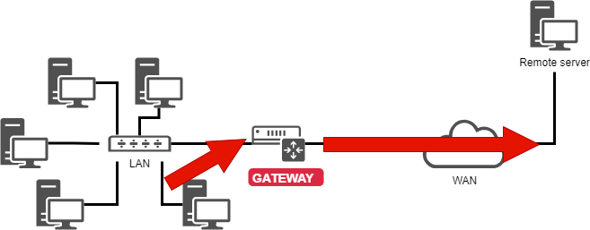

# Впровадження мережі

У цьому розділі ви дізнаєтеся, як працювати з мережею та керувати нею.

****

**Цілі**: В цьому розділі ви дізнаєтеся як:

:heavy_check_mark: Налаштувати робочу станцію для використання DHCP;  
:heavy_check_mark: Налаштувати робочу станцію для використання статичної конфігурації;   
:heavy_check_mark: Налаштувати робочу станцію для використання шлюзу;   
:heavy_check_mark: Налаштувати робочу станцію для використання DNS-серверів;   
:heavy_check_mark: Виправлення неполадок мережі робочої станції.

:checkered_flag: **мережа**, **linux**, **ip**

**Знання**: :star: :star:  
**Складність**: :star: :star:

**Час читання**: 30 хвилин

****

## Загальні положення

Щоб проілюструвати цю главу, ми будемо використовувати наступну архітектуру.


Це дозволить нам розглянути:

* інтеграцію в LAN (локальна мережа);
* налаштування шлюзу для доступу до віддаленого сервера;
* конфігурацію DNS-сервера та реалізацію розпізнавання імен.

Мінімальні параметри, які необхідно визначити для машини:

* назва машини;
* iP адреса;
* маска підмережі.

Приклад:

*   `pc-rocky`;
*   `192.168.1.10`;
*   `255.255.255.0`.

Все частіше зустрічається нотація під назвою CIDR: 192.168.1.10/24

IP-адреси використовуються для належної маршрутизації повідомлень (пакетів). Вони поділяються на дві частини:

* фіксована частина, що ідентифікує мережу;
* ідентифікатор хоста в мережі.

Маска підмережі — це набір із **4 байтів**, призначений для відокремлення:

* мережевої адреси (**NetID** або **SubnetID**), виконавши порозрядне логічне І між IP-адресою та маскою;
* адреси хоста (**HostID**), виконавши побітове логічне AND між IP-адресою та доповненням до маски.

У мережі також є конкретні адреси, які необхідно ідентифікувати. Перша адреса діапазону, а також остання мають певну роль:

* Перша адреса діапазону – це **адреса мережі**. Вона використовується для ідентифікації мереж і маршрутизації інформації з однієї мережі в іншу.

* Остання адреса діапазону є **широкомовною адресою**. Він використовується для трансляції інформації на всі машини в мережі.

### MAC-адреса / IP-адреса

**MAC-адреса** – це фізичний ідентифікатор, записаний на заводі на пристрої. Це іноді називають апаратною адресою. Вона складається з 6 байтів, які часто подаються у шістнадцятковій формі (наприклад, 5E:FF:56:A2:AF:15). Вона складається з: 3 байтів ідентифікатора виробника та 3 байтів серійного номера.

!!! Увага

    Це останнє твердження сьогодні дещо менш вірно щодо віртуалізації. Існують також програмні рішення для зміни MAC-адреси.

Адреса Інтернет-протоколу (**IP**) — це ідентифікаційний номер, який постійно або тимчасово призначається кожному пристрою, підключеному до комп’ютерної мережі за допомогою Інтернет-протоколу. Одна частина визначає мережеву адресу (NetID або SubnetID залежно від випадку), інша частина визначає адресу хоста в мережі (HostID). Відносний розмір кожної частини змінюється залежно від мережевої (під)маски.

Адреса IPv4 визначає адресу на 4 байтах. Оскільки кількість доступних адрес була близькою до насичення, було створено новий стандарт, IPv6 визначений на 16 байтах.

IPv6 часто представлено 8 групами по 2 байти, розділених двокрапкою. Незначущі нулі можна опускати, одну або декілька груп із 4 послідовних нулів можна замінити подвійною двокрапкою.

Маски підмережі мають від 0 до 128 біт. (наприклад, 21ac:0000:0000:0611:21e0:00ba:321b:54da/64 або 21ac::611:21e0:ba:321b:54da/64)

У веб-адресі або URL-адресі (Uniform Resource Locator) IP-адреса може супроводжуватися двокрапкою та адресою порту (що вказує на програму, якій призначено дані). Крім того, щоб уникнути плутанини в URL-адресі, адреса IPv6 записується в квадратних дужках [], двокрапка, адреса порту.

IP та MAC адреси мають бути унікальними в мережі!

### Домен DNS

Клієнтські машини можуть бути частиною домену DNS (**система доменних імен**, наприклад, `mydomain.lan`).

Повне ім’я комп’ютера (**FQDN**) стає `pc-rocky.mydomain.lan`.

Набір комп’ютерів можна згрупувати в логічний набір із розпізнаванням імен, який називається доменом DNS. Домен DNS, звичайно, не обмежується однією фізичною мережею.

Щоб комп’ютер був частиною домену DNS, йому потрібно надати DNS-суфікс (тут `mydomain.lan`), а також сервери, до яких він може надсилати запити.

### Модель OSI

!!! Примітка

    Щоб запам’ятати порядок шарів моделі OSI, запам’ятайте таке речення: __Please Do Not Touch Steven's Pet Alligator__.

| Шар                      | Протоколи                                  |
| ------------------------ | ------------------------------------------ |
| 7 - Додаток              | POP, IMAP, SMTP, SSH, SNMP, HTTP, FTP, ... |
| 6 – Презентація          | ASCII, MIME, ...                           |
| 5 - Сеанс                | TLS, SSL, NetBIOS, ...                     |
| 4 - Транспорт            | TLS, SSL, TCP, UDP, ...                    |
| 3 - Мережа               | IPv4, IPv6, ARP, ...                       |
| 2 - Канал передачі даних | Ethernet, WiFi, Token Ring, ...            |
| 1 - Фізичний             | Кабелі, оптичні волокна, радіохвилі, ...   |

**Рівень 1** (фізичний) підтримує передачу через канал зв’язку (Wi-Fi, оптичне волокно, кабель RJ тощо). Одиниця: біт.

**Рівень 2** (канал даних) підтримує топологію мережі (токен-кільце, зірка, шина тощо), помилки поділу даних і передачі. Одиниця: фрейм.

**Рівень 3** (мережа) підтримує наскрізну передачу даних (IP-маршрутизація = шлюз). Одиниця: пакет.

**Рівень 4** (транспортний) підтримує тип служби (підключений або непідключений) шифрування та керування потоком. Одиниця: сегмент або дейтаграма.

**Рівень 5** (сеанс) підтримує зв’язок між двома комп’ютерами.

**Рівень 6** (Презентація) представляє область, яка не залежить від даних на прикладному рівні. По суті, цей рівень перетворює мережевий формат у формат програми або з формату програми в мережевий формат.

**Рівень 7** (додаток) представляє контакт із користувачем. Він надає послуги, які пропонує мережа: http, dns, ftp, imap, pop, smtp тощо.

## Іменування інтерфейсів

*lo* — це інтерфейс "**loopback**", який дозволяє програмам TCP/IP спілкуватися одна з одною, не виходячи з локальної машини. Це дає змогу перевірити, чи **мережевий модуль системи працює належним чином**, а також дозволяє перевірити локальний хост. Усі пакети, які надходять через localhost, виходять через localhost. Отримані пакети – це надіслані пакети.

Ядро Linux призначає назви інтерфейсів із певним префіксом залежно від типу. Традиційно всі інтерфейси **Ethernet**, наприклад, починалися з **eth**. За префіксом йшло число, першим було 0 (eth0, eth1, eth2...). Інтерфейси Wi-Fi отримали префікс wlan.

У дистрибутивах Rocky8 Linux systemd називатиме інтерфейси за новою такою політикою, де «X» означає число:

* `enoX`: бортові пристрої
* `ensX`: слот PCI Express для гарячого підключення
* `enpXsX`: фізичне/географічне розташування роз’єму обладнання
* ...

## Використання команди `ip`

Забудьте стару команду `ifconfig`! Є `ip`!

!!! Примітка

    Коментар для адміністраторів старих систем Linux:
    
    Історична команда керування мережею — `ifconfig`. Ця команда була замінена командою `ip`, яка вже добре відома адміністраторам мережі.
    
    Команда `ip` — це єдина команда для керування **IP-адресою, ARP, маршрутизацією тощо**.
    
    Команда `ifconfig` більше не встановлена за замовчуванням у Rocky8.
    
    Зараз важливо набути корисних звичок.

## Hostname

Команда `hostname` відображає або встановлює ім’я хоста системи

```
hostname [-f] [hostname]
```

| Опція | Опис                         |
| ----- | ---------------------------- |
| `-f`  | Відображає FQDN              |
| `-i`  | Відображає IP-адреси системи |

!!! Порада

    Ця команда використовується різними мережевими програмами для ідентифікації машини.

Щоб призначити ім’я хоста, можна використати команду `hostname`, але зміни не будуть збережені під час наступного завантаження. Команда без аргументів відображає ім’я хоста.

Щоб установити ім’я хоста, потрібно змінити файл `/etc/sysconfig/network`:

```
NETWORKING=yes
HOSTNAME=pc-rocky.mondomaine.lan
```

Сценарій завантаження RedHat також звертається до файлу `/etc/hosts` для визначення імені хоста системи.

Коли система завантажується, Linux оцінює значення `HOSTNAME` у файлі `/etc/sysconfig/network`.

Потім він використовує файл `/etc/hosts` для оцінки основної IP-адреси сервера та імені його хоста. Він виводить доменне ім’я DNS.

Тому важливо заповнити ці два файли перед будь-яким налаштуванням мережевих служб.

!!! Порада

    Щоб дізнатися, чи правильно виконано цю конфігурацію, команди `hostname` і `hostname -f` мають відповідати очікуваними значеннями.

## Файл /etc/hosts

Файл `/etc/hosts` — це статична таблиця зіставлення імен хостів, яка має такий формат:

```
@IP <hostname>  [alias]  [# comment]
```

Приклад файлу `/etc/hosts`:

```
127.0.0.1       localhost localhost.localdomain
::1             localhost localhost.localdomain
192.168.1.10    rockstar.rockylinux.lan rockstar
```

Файл `/etc/hosts` все ще використовується системою, особливо під час завантаження, коли визначається FQDN системи.

!!! Порада

    RedHat рекомендує заповнити принаймні один рядок із назвою системи.

Якщо служба **DNS** (**D**domain **N**ame **S**service) не працює, ви повинні заповнити всі імена у файлі hosts для кожної з ваших машин.

Файл `/etc/hosts` містить один рядок для кожного запису з IP-адресою, повним доменним ім’ям, потім іменем хоста (у такому порядку) та низкою псевдонімів (alias1 alias2 ...). Alias як опція.

## Файл `/etc/nsswitch.conf`

**NSS** (**N**name **S**service **S**witch) дозволяє конфігураційні файли (наприклад, `/etc/ passwd`, `/etc/group`, `/etc/hosts`), щоб замінити одну або кілька централізованих баз даних.

Файл `/etc/nsswitch.conf` використовується для налаштування баз даних служби імен.

```
passwd: files
shadow: files
group: files

hosts: files dns
```

У цьому випадку Linux спочатку шукатиме відповідність імені хоста (рядок `hosts:`) у файлі `/etc/hosts` (значення `files`) перед запитом DNS (значення `dns`)! Цю поведінку можна просто змінити шляхом редагування файлу `/etc/nsswitch.conf`.

Звичайно, можна уявити запит до LDAP, MySQL або іншого сервера, налаштувавши службу імен для відповіді на системні запити для хостів, користувачів, груп тощо.

Роздільну здатність служби імен можна перевірити за допомогою команди `getent`, яку ми побачимо пізніше в цьому курсі.

## Файл `/etc/resolv.conf`

Файл `/etc/resolv.conf` містить конфігурацію розпізнавання імен DNS.

```
#Generated by NetworkManager
domain mondomaine.lan
search mondomaine.lan
nameserver 192.168.1.254
```

!!! Порада

    Цей файл є історичним. Він більше не заповнюється безпосередньо!

Новіші покоління дистрибутивів зазвичай інтегрували службу `NetworkManager`. Ця послуга дозволяє більш ефективно керувати конфігурацією в графічному або консольному режимі.

Це дозволяє додавати DNS-сервери з файлу конфігурації мережевого інтерфейсу. Потім він динамічно заповнює файл `/etc/resolv.conf`, який ніколи не слід редагувати безпосередньо, інакше зміни конфігурації буде втрачено під час наступного запуску мережевої служби.

## Команда `ip`

Команда `ip` з пакету `iproute2` дозволяє налаштувати інтерфейс і його таблицю маршрутизації.

Відобразити інтерфейс:

```
[root]# ip link
```

Відображення інформації про інтерфейси:

```
[root]# ip addr show
```

Відображення інформації про інтерфейс:

```
[root]# ip addr show eth0
```

Відобразити таблицю ARP:

```
[root]# ip neigh
```

Усі історичні команди керування мережею згруповано під командою `ip`, яка добре відома адміністраторам мережі.

## Конфігурація DHCP

Протокол **DHCP** (**D**ynamic **H**ost **C**ontrol **P**rotocol) дозволяє отримати повну конфігурацію IP через мережу. Це стандартний режим конфігурації мережевого інтерфейсу в Rocky Linux, що пояснює, чому система, підключена до мережі Інтернет-маршрутизатора, може працювати без додаткового налаштування.

Конфігурація інтерфейсів у Rocky Linux виконується в папці `/etc/sysconfig/network-scripts/`.

Для кожного інтерфейсу Ethernet файл `ifcfg-ethX` дозволяє налаштувати відповідний інтерфейс.

```
DEVICE=eth0
ONBOOT=yes
BOOTPROTO=dhcp
HWADDR=00:0c:29:96:32:e3
```

*  Назва інтерфейсу: (має бути в назві файлу)

```
DEVICE=eth0
```

* Автоматичний запуск інтерфейсу:

```
ONBOOT=yes
```

* Зробити запит DHCP під час запуску інтерфейсу:

```
BOOTPROTO=dhcp
```

* Вказати MAC-адресу (необов’язково, але корисно, коли є кілька інтерфейсів):

```
HWADDR=00:0c:29:96:32:e3
```

!!! Порада

    Якщо встановлено NetworkManager, зміни враховуються автоматично. Якщо ні, потрібно перезапустити службу мережі.

* Перезапустити мережеву службу:

```
[root]# systemctl restart NetworkManager
```

## Статична конфігурація

Статична конфігурація вимагає принаймні:

```
DEVICE=eth0
ONBOOT=yes
BOOTPROTO=none
IPADDR=192.168.1.10
NETMASK=255.255.255.0
```

* Тут ми замінюємо «dhcp» на «none», що дорівнює статичній конфігурації:

```
BOOTPROTO=none
```

* IP-адреса:

```
IPADDR=192.168.1.10
```

* Маска підмережі:

```
NETMASK=255.255.255.0
```

* Маску можна вказати за допомогою префікса:

```
PREFIX=24
```

!!! Важливо

    Ви повинні використовувати МАСКУ МЕРЕЖІ АБО ПРЕФІКС – не обидва!

## Маршрутизація



```
DEVICE=eth0
ONBOOT=yes
BOOTPROTO=none
HWADDR=00:0c:29:96:32:e3
IPADDR=192.168.1.10
NETMASK=255.255.255.0
GATEWAY=192.168.1.254
```

Команда `ip route`:

```
[root]# ip route show
192.168.1.0/24 dev eth0 […] src 192.168.1.10 metric 1
default via 192.168.1.254 dev eth0 proto static
```

Варто знати, як читати таблицю маршрутизації, особливо в середовищі з кількома мережевими інтерфейсами.

* У наведеному прикладі мережа `192.168.1.0/24` доступна безпосередньо з пристрою `eth0`, тому є показник `1` (не проходить через маршрутизатор).

* Усі інші мережі, окрім попередньої, будуть доступні знову з пристрою `eth0`, але цього разу пакети будуть адресовані до шлюзу `192.168.1.254`. Протокол маршрутизації є статичним протоколом (хоча в Linux можна додати маршрут до динамічно призначеної адреси).

## Роздільна здатність імен

Система повинна вирішити:

* FQDN в IP-адреси

```
www.free.fr = 212.27.48.10
```

* IP-адреси в іменах

```
212.27.48.10 = www.free.fr
```

* або отримати інформацію про ділянку:

```
MX de free.fr = 10 mx1.free.fr + 20 mx2.free.fr
```

```
DEVICE=eth0
ONBOOT=yes
BOOTPROTO=none
HWADDR=00:0c:29:96:32:e3
IPADDR=192.168.1.10
NETMASK=255.255.255.0
GATEWAY=192.168.1.254
DNS1=172.16.1.2
DNS2=172.16.1.3
DOMAIN=rockylinux.lan
```

У цьому випадку, щоб отримати доступ до DNS, вам потрібно пройти через шлюз.

```
 #Generated by NetworkManager
 domain mondomaine.lan
 search mondomaine.lan
 nameserver 172.16.1.2
 nameserver 172.16.1.3
```

Файл оновлено за допомогою NetworkManager.

## Вирішення проблем

Команда `ping` надсилає дейтаграми на іншу машину та очікує на відповідь.

Це основна команда для тестування мережі, оскільки вона перевіряє зв’язок між вашим мережевим інтерфейсом та іншим.

Синтаксис команди `ping`:

```
ping [-c numerical] destination
```

Параметр `-c` (count) дозволяє зупинити команду після зворотного відліку за секунди.

Приклад:

```
[root]# ping –c 4 localhost
```

!!! Порада

    Перевірте підключення від близького до далекого

1) Перевірте програмний рівень TCP/IP

```
[root]# ping localhost
```

«Пінгування» внутрішнього циклу не виявляє збій обладнання мережевого інтерфейсу. Він просто визначає, чи правильна конфігурація програмного забезпечення IP.

2) Перевірте мережеву карту

```
[root]# ping 192.168.1.10
```

Щоб визначити, що мережева карта функціональна, тепер ми повинні перевірити її IP-адресу. Мережева карта, якщо мережевий кабель не підключений, повинна бути в стані «вимкнено».

Якщо перевірка ping не працює, спочатку перевірте мережевий кабель до мережевого комутатора та повторно зберіть інтерфейс (дивіться команду `if up`), а потім перевірте сам інтерфейс.

3) Перевірте підключення шлюзу

```
[root]# ping 192.168.1.254
```

4) Перевірте підключення віддаленого сервера

```
[root]# ping 172.16.1.2
```

5) Перевірте службу DNS

```
[root]# ping www.free.fr
```

### Команда `dig`

Команда `dig` використовується для запиту до сервера DNS.

Синтаксис команди `dig`:

```
dig [-t type] [+short] [name]
```

Приклади:

```
[root]# dig +short rockylinux.org
76.223.126.88
[root]# dig -t MX +short rockylinux.org                                                          ✔
5 alt1.aspmx.l.google.com.
...
```

Команда `dig` використовується для запиту до серверів DNS. За замовчуванням він дуже багатослівний, але цю поведінку можна змінити за допомогою параметра `+short`.

Також можна вказати **тип запису** DNS для вирішення, наприклад **тип** MX, щоб отримати інформацію про обмінники поштою для домену.

### Команда `getent`

Команда `getent` (отримати запис) використовується для отримання запису NSSwitch (`hosts` + `dns`)

Синтаксис команди `getent`:


```
getent hosts name
```

Приклад:

```
[root]# getent hosts rockylinux.org
  76.223.126.88 rockylinux.org
```

Запит лише до DNS-сервера може повернути помилковий результат, який не враховує вміст файлу `hosts`, хоча сьогодні це має бути рідкістю.

Щоб також врахувати файл `/etc/hosts`, потрібно запитати службу імен NSSwitch, яка подбає про будь-яке вирішення DNS.

### Команда `ipcalc`

Команда `ipcalc` (**ip calculation**) використовується для обчислення адреси мережі або широкомовлення на основі IP-адреси та маски.

Синтаксис команди `ipcalc`:

```
ipcalc  [options] IP <netmask>
```

Приклад:

```
[root]# ipcalc –b 172.16.66.203 255.255.240.0
BROADCAST=172.16.79.255
```

!!! Порада

    Ця команда цікава тим, що за нею слідує переспрямування для автоматичного заповнення конфігураційних файлів ваших інтерфейсів:

    ```
    [root]# ipcalc –b 172.16.66.203 255.255.240.0 >> /etc/sysconfig/network-scripts/ifcfg-eth0
    ```

| Опція | Опис                                 |
| ----- | ------------------------------------ |
| `-b`  | Відображає широкомовну адресу.       |
| `-n`  | Відображає мережеву адресу та маску. |

`ipcalc` — це простий спосіб обчислення IP-інформації про хост. Різні параметри вказують, яку інформацію `ipcalc` має відображати на стандартному виводі. Можна вказати кілька варіантів. Необхідно вказати IP-адресу, на якій працюватиме. Для більшості операцій також потрібна маска мережі або префікс CIDR.

| Коротка опція | Довша опція   | Опис                                                                                                                                                                                                                                 |
| ------------- | ------------- | ------------------------------------------------------------------------------------------------------------------------------------------------------------------------------------------------------------------------------------ |
| `-b`          | `--broadcast` | Відображає широкомовну адресу заданої IP-адреси та маску мережі.                                                                                                                                                                     |
| `-h`          | `--hostname`  | Відображає ім’я хоста IP-адреси, наданої через DNS.                                                                                                                                                                                  |
| `-n`          | `--netmask`   | Обчислює маску мережі для заданої IP-адреси. Припускає, що IP-адреса є частиною повної мережі класу A, B або C. Багато мереж не використовують мережеві маски за замовчуванням, у цьому випадку буде повернено неправильне значення. |
| `-p`          | `--prefix`    | Вказує на префікс маски/IP-адреси.                                                                                                                                                                                                   |
| `-n`          | `--network`   | Вказує мережеву адресу заданої IP-адреси та маски.                                                                                                                                                                                   |
| `-s`          | `--silent`    | Не відображає жодних повідомлень про помилки.                                                                                                                                                                                        |

### Команда `ss`

Команда `ss` (**статистика сокета**) відображає прослуховувані порти в мережі.

Синтаксис команди `ss`:

```
ss [-tuna]
```

Приклад:

```
[root]# ss –tuna
tcp   LISTEN   0   128   *:22   *:*
```

Команди `ss` і `netstat` будуть дуже важливими для решти вашого життя Linux.

Під час впровадження мережевих служб дуже часто можна перевірити за допомогою однієї з цих двох команд, що служба прослуховує очікувані порти.

### Команда `netstat`

!!! Важливо

    Команда `netstat` тепер застаріла та більше не встановлюється за замовчуванням у Rocky Linux. Ви все ще можете знайти деякі версії Linux, у яких його встановлено, але найкраще переходити до використання `ss` для всього, для чого ви використовували `netstat`.

Команда `netstat` (**статистика мережі**) відображає порти прослуховування в мережі.

Синтаксис команди `netstat`:

```
netstat -tapn
```

Приклад:

```
[root]# netstat –tapn
tcp  0  0  0.0.0.0:22  0.0.0.0:*  LISTEN 2161/sshd
```

### Конфлікти IP- або MAC-адрес

Неправильна конфігурація може спричинити використання однієї IP-адреси кількома інтерфейсами. Це може статися, коли в мережі є кілька серверів DHCP або коли одна і та сама IP-адреса призначається вручну кілька разів.

Якщо мережа не працює, і коли причиною може бути конфлікт IP-адрес, можна використати програмне забезпечення `arp-scan` (потрібне сховище EPEL):

```
$ dnf install arp-scan
```

Приклад:

```
$ arp-scan -I eth0 -l

172.16.1.104  00:01:02:03:04:05       3COM CORPORATION
172.16.1.107  00:0c:29:1b:eb:97       VMware, Inc.
172.16.1.250  00:26:ab:b1:b7:f6       (Unknown)
172.16.1.252  00:50:56:a9:6a:ed       VMWare, Inc.
172.16.1.253  00:50:56:b6:78:ec       VMWare, Inc.
172.16.1.253  00:50:56:b6:78:ec       VMWare, Inc. (DUP: 2)
172.16.1.253  00:50:56:b6:78:ec       VMWare, Inc. (DUP: 3)
172.16.1.253  00:50:56:b6:78:ec       VMWare, Inc. (DUP: 4)
172.16.1.232  88:51:fb:5e:fa:b3       (Unknown) (DUP: 2)
```

!!! Порада

    Як показує приклад вище, також можливі конфлікти MAC-адрес! Ці проблеми викликані технологіями віртуалізації та копіюванням віртуальних машин.

## Гаряча конфігурація

Команда `ip` може швидко додати IP-адресу до інтерфейсу

```
ip addr add @IP dev DEVICE
```

Приклад:

```
[root]# ip addr add 192.168.2.10 dev eth1
```

Команда `ip` дозволяє активувати або деактивувати інтерфейс:

```
ip link set DEVICE up
ip link set DEVICE down
```

Приклад:

```
[root]# ip link set eth1 up
[root]# ip link set eth1 down
```

Команда `ip` використовується для додавання маршруту:

```
ip route add [default|netaddr] via @IP [dev device]
```

Приклад:

```
[root]# ip route add default via 192.168.1.254
[root]# ip route add 192.168.100.0/24 via 192.168.2.254 dev eth1
```

## Коротко

У цьому розділі використовуються такі файли:


Повна конфігурація інтерфейсу може бути такою (файл `/etc/sysconfig/network-scripts/ifcfg-eth0`):

```
 DEVICE=eth0
 ONBOOT=yes
 BOOTPROTO=none
 HWADDR=00:0c:29:96:32:e3
 IPADDR=192.168.1.10
 NETMASK=255.255.255.0
 GATEWAY=192.168.1.254
 DNS1=172.16.1.1
 DNS2=172.16.1.2
 DOMAIN=rockylinux.lan
```

Метод усунення несправностей має йти від найближчого до найдальшого:

1. ping localhost (тест програмного забезпечення)
2. ping IP-адреси (апаратний тест)
3. ping gateway (тест підключення)
4. ping remote server (тест маршрутизації)
5. DNS-запит (dig або ping)


