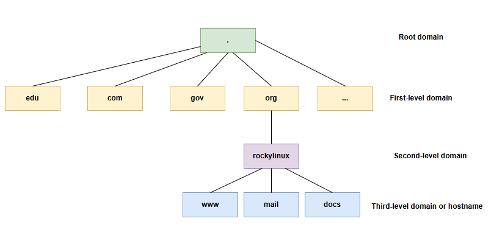

# 实施网络

在本章中，您将学习如何使用和管理网络。

****

**目标**: 本章您将学习如何：

‌:heavy_check_mark: 使用 DHCP‌ 配置工作站；  
:heavy_check_mark: 使用静态配置配置工作站；  
:heavy_check_mark: 使用网关配置工作站；  
:heavy_check_mark: 使用 DNS 服务器配置工作站；  
:heavy_check_mark: 排除工作站的网络故障。

:checkered_flag: **network**、**linux**、**ip**

**知识性**: :star: :star:  
**复杂度**: :star: :star:

**阅读时间**：30 分钟

****

## 概述

为了说明本章，我们将使用以下架构。


这将使我们能够考虑：

* 集成到LAN（局域网）中；
* 配置网关以访问远程服务器；
* DNS 服务器的配置和名称解析的实现。

机器需要定义的最小参数是：

* 机器的名称；
* IP 地址；
* 子网掩码。

示例：

* `pc-rocky`；
* `192.168.1.10`；
* `255.255.255.0`。

被称为 CIDR 的表示法越来越常见：192.168.1.10/24

IP地址用于消息（数据包）的正确路由。 它们分为两部分：

* 网络位 - 二进制子网掩码中与连续 "1" 对应的部分
* 主机位 - 二进制子网掩码中与连续 "0" 对应的部分

```
                                            |<- host bits ->|
                  |<--    network bits  -->|
192.168.1.10  ==> 11000000.10101000.00000001.00001010
255.255.255.0 ==> 11111111.11111111.11111111.00000000
```

子网掩码用于定义 IP 地址的网络位和主机位。 通过使用子网掩码，我们可以确定当前 IP 地址的：

* 通过将 IP 地址与掩码进行按位逻辑与运算来获取网络地址（**NetID** 或 **SubnetID**）；
* 通过将 IP 地址与掩码的补码进行按位逻辑与运算来获取主机地址（**HostID**）。

```
192.168.1.10  ==> 11000000.10101000.00000001.00001010
255.255.255.0 ==> 11111111.11111111.11111111.00000000

NetID             11000000.10101000.00000001.00000000
                    192   . 168    . 1      . 0

HostID            00000000.00000000.00000000.00001010
                     0    .   0    .    0   . 10
```

**合法子网掩码** - 按从左到右的顺序，连续的 1 可以定义为有效子网掩码。

```
合法       11111111.11111111.11111111.00000000
非法       11001001.11111111.11111111.00000000
```

!!! tip "提示"

    IP 地址和子网掩码必须成对出现，这是由网络通信的基本原理决定的。

在网络中，还存在一些特定地址，必须对其予以识别。 地址范围中的首个地址和最后一个地址都具有特殊作用：

* 地址范围的首个地址是 **网络地址**。 该地址用于标识网络，并实现信息在不同网络间的路由传输。 此地址可通过逻辑与运算得出 。

    ```
    192.168.1.10  ==> 11000000.10101000.00000001.00001010
    255.255.255.0 ==> 11111111.11111111.11111111.00000000

    network address   11000000.10101000.00000001.00000000
                        192   . 168    . 1      . 0
    ```

    **逻辑与运算** - 当两者都为真（1）时，结果为真（1）；否则为假（0）

* 地址范围的最后一个地址是 **广播地址**。 它用于向网络上的所有机器广播信息。 保持网络位不变，将主机位全部替换为 1 ，即可得到该地址。

    ```
    192.168.1.10  ==> 11000000.10101000.00000001.00001010
    255.255.255.0 ==> 11111111.11111111.11111111.00000000

    broadcast address 11000000.10101000.00000001.11111111
                        192   . 168    . 1      . 255
    ```

!!! tip "提示"

    这两个扮演特殊角色的地址 **不能** 分配给终端机器使用。

### MAC 地址 和 IP 地址

**MAC地址** 是在出厂时写在设备上的物理标识符。 有时被称为硬件地址。 它由 6 字节组成，通常以十六进制形式给出（例如，5E:FF:56:A2:AF:15）。

这 6 个字节分别代表：

* 前三个字节表示制造商标识符。 该标识符称为 OUI（组织唯一标识符）。
* 最后三个字节包含制造商分配的序列号。

!!! warning "警告"

    MAC 地址在硬件出厂时即被固化。 修改它有两种主要方法：

    * 固件级修改（永久）：需要可以直接重写网卡 ROM 中 MAC 地址的高级工具。 此类工具通常仅适用于硬件制造商。
    * 软件级伪装（临时）：修改 MAC 地址在操作系统上的显示方式。 这些更改通常在系统重启后重置。 虚拟主机中虚拟网卡的 MAC 地址也会被伪装。

互联网协议（**IP**）地址是永久或临时分配给使用互联网协议连接到计算机网络的每个设备的标识号。 IP 地址和子网掩码成对出现，这是由网络通信的基本原理决定的。 通过子网掩码，我们可以知道当前 IP 地址：

* 网络位和主机位
* NetID 或 SubnetID
* HostID
* 网络地址
* 广播地址

IP 地址根据数据包中的 version 字段分类如下：

* **IPv4‌** - （4 bits，0100）。 IPv4 的可用地址空间为2<sup>32</sup>（从 IPv4 数据包中的源地址和目的地址字段中已知）。 具体分为：

    * A 类地址。 其范围为 **0.0.0.0** 到 **127.255.255.255**
    * B 类地址。 其范围为 **128.0.0.0** 到 **191.255.255.255**
    * C 类地址。 其范围为 **192.0.0.0** 到 **223.255.255.255**
    * D 类地址。 其范围为 **224.0.0.0** 到 **239.255.255.255**
    * E 类地址。 其范围为 **240.0.0.0** 到 **255.255.255.255**

    其中，A 类地址、B 类地址和 C 类地址都有自己的私有地址范围。 0.0.0.0 是一个保留地址，不分配给主机。 D 类地址用于多播通信，不分配给主机。 E 类地址是保留的，不用于常规网络。

* **IPv6** - （4 bits，0110）。 IPv6 的可用数量为2<sup>128</sup>（从 IPv6 数据包中的源地址和目的地址字段中已知）。 具体分为：

    * 单播地址。 包括链路本地单播地址（LLA）、唯一本地地址（ULA）、全球单播地址（GUA）、环回地址、未指定地址
    * 任播地址
    * 组播地址

128位 IPv6 书写格式说明：

* 首选书写格式 - **X:X:X:X:X:X:X:X**。 在这种书写格式中，128位 IPv6 地址分为 8 组，每组由 4 个十六进制值（0-9，A-F）表示，组之间用冒号（：）分隔。 每个 "X" 代表一组十六进制值。 例如 **2001:0db8:130F:0000:0000:09C0:876A:130B**。

    * 省略前导 0 — 为了便于书写，每组中的前导 "0" 可以省略，因此上述地址可以缩写为 **2001:db8:130F:0:0:9C0:876A:130B**。
    * 使用双冒号 - 如果地址包含两个或多个都为 0 的连续组，则可以使用双冒号。 上述地址可以进一步缩写为 **2001:db8:130F::9C0:876A:130B**。 注意！ 双冒号在 IPv6 地址中只能出现一次。

* 兼容书写格式 - **X:X:X:X:X:X:d.d.d.d**。 在混合网络环境中，这种格式确保了 IPv6 节点和 IPv4 节点之间的兼容性。 例如 **0:0:0:0:0:ffff:192.1.56.10** 和 **::ffff:192.1.56.10/96**。

在网址 URL（Uniform Resource Locator，统一资源定位）中，IP 地址后面可以跟一个冒号和端口地址（表示数据的目的地应用程序）。 为了避免在 URL 中出现混淆，IPv6 地址书写在方括号中（例如 `[2001:db8:130F::9C0:876A:130B]:443`）。

如前所述，子网掩码将 IPv4 地址分为两部分：网络位和主机位。 在 IPv6 中，子网掩码也具有相同的功能，但名称已更改（"n" 表示子网掩码占用的位数）：

* 网络前缀 - 它相当于 IPv4 地址中的网络位。 依据子网掩码，占用 "n" 位。
* 接口标识 - 它相当于 IPv4 地址中的主机位。 依据子网掩码，占用 "128-n" 位。

例如 **2001:0db8:130F:0000:0000:09C0:876A:130B/64**：

```
    Network prefix
|<-    64 bits   ->|

                        Interface ID
                     |<-    64 bits    ->|
2001:0db8:130F:0000 : 0000:09C0:876A:130B
```

在同一个网络中，IP 地址必须是唯一的，这是网络通信的基本规则。 在同一局域网中，MAC 地址必须是唯一的。

### IPv4 数据包结构

IPv4 数据包包含头部和数据部分：


**Version**：帮助路由器识别协议版本。 对于 IPv4，这里的值是0100（二进制 0100 等同于十进制 4）

**IHL**：用于控制头部长度的字段。 当不包括 "Options" 字段时，最小值为 5（即二进制 0101）。 此时头部长度为 60 字节。 最大值为 15（即二进制 1111），头部长度为 60 字节。

```
IPv4 头部的实际长度 = IHL 字段的值 * 4
```

**Type of Service**：此字段用于定义数据包的 QoS（服务质量）和优先级。 该字段现在主要用于 DSCP（差分服务代码点）和 ECN（显式拥塞通知）。

**Total Length**：表示整个 IPv4 数据报（IPv4 数据包）的总长度（以字节为单位）。

!!! note "说明" 

    IP 数据包（IP packet） 和 IP 数据报（ IP datagram）在技术上是描述同一概念的不同术语：即在网络层传输的数据单元。

**Identification**：标识 IPv4 数据报的所有分片。 来自同一原始数据报的所有分片共享相同的标识值，以实现正确的重组。

**Flags**：它用于控制 IPv4 数据报的分片行为。 按从左到右的顺序：

* 第一位 - 未使用，值为 0
* 第二位 - DF（Don’t Fragment，不分片）。 如果 DF=1，则意味着必须完整传输 IPv4 数据报。 如果它超过 MTU，它将被丢弃并返回 ICMP 错误（例如 "Fragmentation Needed"）。 如果 DF=0，路由器会将 IPv4 数据报拆分为多个分片，每个分片都携带相同的‌ Identification‌ 字段值
* 第三位 - MF（More Fragment，更多分片）。 如果 MF=1，则表示当前分片不是最后一个分片，还有其他分片；如果 MF=0，则表示这是最后一个分片

**Fragment Offset**：指示分片在原始 IPv4 数据报中的相对位置，单位为 8 字节。 该字段主要用于分片重组。

**TTL (Time To Live)**：此字段用于限制网络中数据报的最大生存时间或最大跳数。 由发送方设置初始值，且 TTL 每次通过一个路由器时都会减少 1 。 当 TTL=0 时，数据报被丢弃。

**Protocol**：指示此数据报中携带的数据所使用的协议类型。 它的取值范围为 0-255。 例如，TCP、UDP、ICMP 的协议号分别为6、17、1。

**Header Checksum**：每次数据报通过路由器时，都会重新计算此字段，这主要是由于 TTL 字段的减少导致头部发生变化。 此字段仅验证头部（不包括数据部分）。 如果其他字段保持不变且只有 TTL 发生变化，校验和将被更新为新值（非零），以确保头部在传输过程中没有被篡改或损坏。

**Source address**：数据报发送方的 IPv4 地址

**Destination address**：数据报接收方的 IPv4 地址

**Options**：可选字段，长度范围为 0-40 字节。 它仅在 IHL 大于 5 时被使用。 此字段的长度必须是 4 字节的整数倍（如果长度小于 4 字节整数倍，则使用 **padding** 字段进行填充）。

!!! tip "提示"

    Bit 有两个含义。 在信息论中，它指的是信息的基本单位，表示一个二元选择（0 或 1）。 在计算机科学中，它是数据存储的最小单位，除非另有说明，否则 8 bits 通常等于 1 字节。

### IPv6 数据包结构

IPv6 数据报由三部分组成：

* 基本报头
* 扩展报头
* 上层协议数据单元

在一些书籍中，扩展报头和上层协议数据单元被统称为**有效荷载**。


基本报头的固定长度为 40 字节且固定为 8 个字段：

**Version**：帮助路由器识别协议版本。 对于 IPv6，这里的值是0110（二进制 0110 等同于十进制 6）。

**Traffic Class**：等同于 IPv4 数据报中的 TOS（Type Of Service）字段。 此字段用于定义数据包的 QOS（服务质量）和优先级。

**Flow Label**：此 IPv6 新字段用于控制数据包流。 该字段的非零值意味着应该对数据包进行特殊处理；即不应通过不同路径转发至目的地，而应始终使用同一条路径。 这样做的一个优点是接收端不必重新排序数据包，从而加快了处理过程。 该字段有助于避免重新排序数据包，专为流媒体/直播媒体而设计。

**Payload Length**：表示有效荷载的大小。 此字段只能表示最大长度为 65535 字节的有效载荷。 如果有效载荷的长度大于 65535 字节，则 Payload Length 字段将设置为 0，并在逐跳选项扩展报头中使用巨型有效载荷选项。

**Next Header**：用于指示扩展报头后的数据包头部类型。 如果存在第一个扩展报头，则表示第一个扩展报头的类型。 否则表示上层使用的协议类型，如 6 （TCP）和 17（UDP）。

**Hop Limit**：此字段等同于 IPv4 数据报中的 Time To Live（TTL）。

**Source Address**：此字段表示 IPv6 数据报发送方的地址。

**Destination Address**：此字段表示 IPv6 数据报接收方的地址。


在 IPv4 数据报中，IPv4 头部包含可选字段，如 Options，其中包括 Security、Timestamp、Record Route 等。 这些 Options 可以将 IPv4 头部的长度从 20 字节扩展到 60 字节。 在转发过程中，处理携带这些 Options 的 IPv4 数据报会消耗大量的设备资源，因此在实际中很少使用。

IPv6 从 IPv6 基本报头中删除这些 Options，并将其放置在扩展报头中，该扩展报头位于 IPv6 基本报头和上层协议数据单元之间。

一个 IPv6 数据包可以包含0、1或多个扩展报头，这些扩展报头仅在设备或目标节点需要特殊处理时由发送方添加。

与 IPv4 Options 字段（可扩展至 40 字节且需要连续存储）不同，IPv6 扩展报头采用链式结构，没有固定长度限制，使其在未来更具可扩展性。 它的 8 字节对齐机制是通过 Next Header 字段实现的，这确保了处理效率并避免了分片开销。

**Next header**：该字段与基本报头中的 Next header 字段具有相同的功能。

**Extension header Len**：指示扩展报头的长度（不包括 Next Header 的长度）。

**Extension head Data**：扩展报头的内容是一系列 Options 字段和 Padding 字段的组合。

目前，RFC 定义了以下类型的扩展报头：

* 逐跳选项报头（Next header 字段值为 0） - 必须由路径上的所有路由器进行处理。
* 目的选项报头（Next header 字段值为 60）- 仅由目标节点处理。
* 路由报头（Next header 字段值为 43）- 这个扩展报头类似于 IPv4 中的 Loose Source 和 Record Route 选项。
* 分段报头（Next header 字段值为 44）- 与 IPv4 报文一样，IPv6 报文的转发长度也不能超过 MTU （maximum transmission unit）。 当报文长度超过 MTU 时，需要对报文进行分段处理。 在 IPv6 中，源节点会使用 Fragment header 发送大于 MTU 的数据包。
* 认证报头（Next header 字段值为 51）- IPSec 利用该报头提供数据源认证、数据完整性校验和报文防重放功能。 它还保护 IPv6 基本报头中的某些字段。
* 封装安全载荷报头（Next header 字段值为 50） - 此报头提供与认证报头相同的功能，并增加 IPv6 数据包加密。

RFC 规定，当在同一数据报中使用多个扩展报头时，建议这些报头按以下顺序出现：

1. IPv6 基本报头
2. 逐跳选项报头
3. 目的选项报头
4. 路由报头
5. 分段报头
6. 认证报头
7. 封装安全载荷报头
8. 目的选项报头
9. 上层协议报头

除了目的选项报头可能出现一次或两次（一次在路由扩展报头之前，一次在上层协议报头之前）外，所有其他扩展报头只能出现一次。

### DNS域

**DNS（域名系统）**：TCP/IP 协议族提供了通过 IP 地址连接到设备的能力，但用户很难记住设备的 IP 地址。 因此，专门设计了一种基于字符串的主机命名机制，其中这些主机名对应于 IP 地址。 IP 地址和主机名之间需要有一种转换和查询机制，提供这种机制的系统是域名系统（DNS）。 将域名 "翻译" 为 IP 地址的过程被称为 **域名解析**。

请注意主机名和域名之间的区别：

* 主机名（Hostname） - 它用于唯一标识局域网（LAN）内的设备或作为域名的一部分（例如`docs`）
* 域名（Domain name） - 用于唯一标识 WAN（广域网）上的设备。 例如 `docs.rockylinux.org`，其中 `rockylinux.org`是该域名的域

!!! tip "提示"

    域不代表特定主机

**Q：为什么需要DNS？**

在互联网的早期，为了记住主机名和 IP 地址之间的对应关系，所有的对应关系都必须写入到一个文件中，用户必须手动维护文件内容。 随着互联网的蓬勃发展，需要解决的主要问题有：

* 单个文件仅在当前使用的计算机上生效
* 手动维护文件内容变得越来越困难

为了解决出现的问题，人们开发了 DNS，其优点是：

* 分布式 - DNS 服务器可供全球用户使用
* 分层管理 - 划分层次结构以便于管理。 如下图所示：

    

对于根域，它通常被称为在全球拥有 13 个根域服务器。 一个更标准的表达：

> "全球 DNS 根服务器系统在逻辑上围绕 13 个规范端点（a.root-servers.net 至 m.root-servers.net）构建，这一设计源于历史协议限制。 在物理上，这些端点通过全球分布的 1500 多个任播实例服务器实现，由 13 个独立组织在 ICANN/IANA 协调下运营。"

对于 `docs.rockylinux.org.`：

* **根域** - 它指的是一个点（`.`）。
* **一级域** - 它指的是字符串 `org` 。 关于一级域的划分存在很多争议，例如，一些文档资料将 `.org` 或 `org.` 归类为一级域。
* **二级域** - 它指的是字符串 `rockylinux`。 关于二级域的划分存在很多争议，例如，一些文档资料将 `rockylinux.org.` 或 `.rockylinux.org.`作为二级域。
* **主机名** - 它指的是字符串 `dcos`。

**FQDN（Fully Qualified Domain Name，完全合格域名）**：由主机名和各级域组成的完整域名。 根据 RFC 标准（RFC 1034、RFC 2181、RFC 8499），末尾的根域是行业标准（例如 `docs.rockylinux.org.` ）。 在某些 DNS 软件的配置文件中，必须输入标准 FQDN，但在访问某些网络资源时可以忽略根域（例如，当用户访问 `https://docs.rockylinux.org` 时，浏览器会自动在末尾添加一个点）。 **域名**：一种连接各级域并以主机名开头的结构。 **Zone**：表示由特定权威服务器管理的 DNS 命名空间的连续部分，该服务器存储该范围内的所有 FQDN 解析记录（如 A、MX 等）。

!!! tip "提示"

    一般来说，"FQDN" 比 "域名" 更能有效地表达作者文档的含义，因为不同行业的读者对 "域名" 一词的理解不同。 例如，对于 `rockylinux.org`，一些读者可能会将其解释为域名，但这实际上是不正确的。 严格来说，这应该被称为域（而不是域名）。 因此为了提高严谨型，需要读者严格区分域（domain）和域名（domain name）的含义。

### ISO/OSI 7层理论模型

**ISO（国际标准化组织）** - 一个成立于 1974 年的国际组织，主要作用是制定各领域的国际标准。 对于互联网领域，ISO 提出了OSI 7层理论参考模型。

**OSI（开放系统互连参考模型）** - 该模型提出了一个标准框架，试图将各种计算机互连成一个全球网络。

| 层         | 说明                                |
| --------- | --------------------------------- |
| 7 - 应用层   | 为应用程序或用户请求提供各种请求服务                |
| 6 - 表示层   | 数据编码、格式转换、数据加密                    |
| 5 - 会话层   | 创建、管理和维护会话。                       |
| 4 - 传输层   | 数据通信、建立端到端连接等。                    |
| 3 - 物理层   | 网络连接管理（建立、维护和终止）、路由路径选择、分组、流量控制等。 |
| 2 - 数据链路层 | 帧封装和传输、流量控制和错误检测等。                |
| 1 - 物理层   | 传输介质的管理，物理接口规范，信号的转换和传输等。         |

!!! Note "辅助记忆"

    为了记住 ISO/OSI 模型的层顺序，记住下面的句子：**All People Seem To Need Data Processing**。

**模型的分层设计**：它体现了模块化的设计原则，即通过将复杂的网络通信功能分解为独立的层次，实现功能解耦和标准化协作。

!!! note "说明"

    应当注意，ISO/OSI 7层模型在实际网络通信中并不存在。 它只是为互联网通信提供了一个设计框架和方法。

**TCP/IP 4层模型** - 实际网络通信中使用的分层模型（将 ISO/OSI 7层模型简化为4层模型）。 TCP/IP 是协议组的统称，包含多种协议并构成 TCP/IP 协议族。 在协议分析或教学环境中，它有时被非正式地称为 **TCP/IP 5层模型**。

| 层        | 协议                                                                               | 在此层上工作的硬件设备              |
|:-------- |:-------------------------------------------------------------------------------- |:------------------------ |
| 4 - 应用层  | HTTP、FTP、SMTP、DNS、DHCP...                                                        | -                        |
| 3 - 传输层  | TCP、UDP                                                                          | 防火墙和负载均衡器                |
| 2 - 网际层  | IP、ICMP、ARP、RARP、IGMP                                                            | 路由器                      |
| 1- 网络接口层 | 以太网协议（IEEE 802.3）、PPP（点对点协议）、PPPoE（以太网点对点协议）、Wi-Fi （IEEE 802.11）、ADSL（非对称数字用户线）… | 网卡、交换机、集线器、中继器、双绞线、调制解调器 |

* **应用层** - 将理论模型中的应用层、表示层和会话层统一为一个应用层。
* **传输层** - 理论模型中的传输层。
* **网际层** - 理论模型中的网络层。
* **网络接口层** - 将理论模型中的数据链路层和物理层集成到一个单层中。

!!! tip "术语表达"

    TCP/IP 4层模型、TCP/IP 协议族和 TCP/IP 协议栈是同一概念的不同表达。

## 接口的命名

*lo** 是指 "**环回**" 接口，它允许 TCP/IP 程序在不离开本地机器的情况下相互通信。 这允许测试 **系统的网络模块是否正常工作**，也允许 ping 本地主机。 所有通过 localhost 进入的数据包都通过 localhost 离开。 接收到的数据包与发送的数据包相同。</p>

`udev` 设备管理器根据类型为接口名称分配特定的前缀。 例如，传统上，所有 **以太网** 接口都以 **eth** 开头。 前缀后面跟着一个数字，第一个是0（eth0，eth1，eth2…）。 wifi 接口被赋予了 WLAN 前缀。

在 Rocky 8/9/10 Linux 发行版上，systemd 将使用以下策略命名接口，其中 "X" 表示一个数字：

* `enoX`：板载设备
* `ensX`：PCI Express热插拔插槽
* `enpXsX`：硬件连接器的物理/地理位置
* ...

!!! tip "整合与接管"

    在旧版本的 Linux 发行版中，udev 是一个独立的组件，使用单独的进程运行，但现代主流 Linux 发行版已将 udev 代码集成到 systemd 项目中，使其成为 systemd 套件的核心组件之一。

## 配置、浏览和测试网络

### `ip` 命令

忘记旧的 `ifconfig` 命令吧！ 试试 `ip`！

!!! Note "说明"

    针对旧 Linux 系统管理员的说明：
    
    历史网络管理命令是 `ifconfig`。 此命令已被网络管理员熟知的 `ip` 命令所取代。
    
    `ip` 命令是管理 **IP 地址、ARP、路由等** 的唯一命令。
    
    在 Rocky 8/9/10 中，默认情况下不再安装 `ifconfig` 命令。 除了 `ip` 命令外，系统管理员还可以使用 [NetworkManager](https://www.networkmanager.dev/) 网络组件中的命令来管理网络，最常用的是 `nmtui` 和 `nmcli` 命令。
    
    现在养成好习惯是很重要的。

`iproute2` 软件包中的 `ip` 命令允许您配置接口及其路由表。

显示接口 :

```bash
[root]# ip link
```

显示接口信息：

```bash
[root]# ip addr show
```

显示一个接口的信息：

```bash
[root]# ip addr show eth0
```

显示 ARP 表：

```bash
[root]# ip neigh
```

### `nmtui` 和 `nmcli` 命令

[本文档](../../gemstones/network/nmtui.md) 介绍了 `nmtui` 命令的使用方法和相关的配置文件。

[本文档](../../gemstones/network/network_manager.md) 介绍了 `nmcli` 命令的使用方法和相关的配置文件。

### `mtr` 命令

`mtr` 是一个可以诊断网络问题的网络诊断工具。 它用于替换 `ping` 和 `traceroute` 命令。 就性能而言， `mtr` 命令更快。

本文档详细介绍了 [mtr](../../gemstones/network/mtr.md) 命令

### `ss` 命令

此命令是旧版本 `netstat` 命令的替代品，主要用于查看端口和套接字的状态。 其用法是：

```
ss [OPTIONS] [FILTER]
```

常见选项包括：

| 选项   | 解释           |
|:---- |:------------ |
| `-a` | 显示所有套接字      |
| `-r` | 解析主机名        |
| `-t` | 显示 TCP 套接字   |
| `-u` | 显示 UDP 套接字   |
| `-l` | 显示监听套接字      |
| `-n` | 显示 IP 地址和端口号 |
| `-p` | 显示使用套接字的进程   |

显示已建立连接的套接字：

```bash
[root]# ss
```

查看本地计算机正在侦听的端口：

```bash
[root]# ss -tulnp
Netid  State   Recv-Q  Send-Q     Local Address:Port     Peer Address:Port    Process
udp    UNCONN  0       0              127.0.0.1:323           0.0.0.0:*        users:(("chronyd",pid=703,fd=5))
udp    UNCONN  0       0                  [::1]:323              [::]:*        users:(("chronyd",pid=703,fd=6))
tcp    LISTEN  0       128              0.0.0.0:22            0.0.0.0:*        users:(("sshd",pid=734,fd=3))
tcp    LISTEN  0       128                 [::]:22               [::]:*        users:(("sshd",pid=734,fd=4))
```

查看此设备上的所有网络连接：

```bash
[root]# ss -an
Netid State  Recv-Q Send-Q     Local Address:Port     Peer Address:Port  Process
nl    UNCONN 0      0                    0:695                 *
...
```

`ss -tulnp`：仅显示 TCP/UDP 侦听状态连接，并包含进程信息。

`ss -an`：显示所有类型的连接（包括监听的和活跃的）

输出列说明：

* Netid - 套接字类型和传输类型
* State - 套接字状态。 "ESTAB" 表示建立连接；"UNCONN" 表示未连接的连接；"LISTEN" 代表已监听的连接
* Recv-Q - 套接字接收队列的大小
* Send-Q - 套接字发送队列的大小
* Local Address:Port - 本地 IP 地址和端口
* Peer Address:Port - 连接端的 IP 地址和端口
* Process - 相应的进程信息，包括进程ID、进程名称和文件描述符

如果您需要了解默认端口和服务之间的对应关系，请参阅 **/etc/services** 文件的内容。

### 查看网卡的属性

经常使用 `ethtool` 命令查看网卡（NIC）的属性。 其用法是：

```
ethtool [option] DEVNAME
```

```bash
[root]# ethtool ens160
Settings for ens160:
        Supported ports: [ TP ]
        Supported link modes:   1000baseT/Full
                                10000baseT/Full
        Supported pause frame use: No
        Supports auto-negotiation: No
        Supported FEC modes: Not reported
        Advertised link modes:  Not reported
        Advertised pause frame use: No
        Advertised auto-negotiation: No
        Advertised FEC modes: Not reported
        Speed: 10000Mb/s
        Duplex: Full
        Auto-negotiation: off
        Port: Twisted Pair
        PHYAD: 0
        Transceiver: internal
        MDI-X: Unknown
        Supports Wake-on: uag
        Wake-on: d
        Link detected: yes
```

重要属性说明：

* Supports auto-negotiation
* Speed
* Duplex
* Port - 指用于数据传输的介质，如 "Twisted Pair" （双绞线） 和 "FIBRE" （光纤）
* Link detected

如果需要对网卡属性进行更详细的设置，请进入 `nmcli` 命令的交互终端，例如：

```bash
[root]# nmcli connection show
NAME    UUID                                  TYPE      DEVICE
ens160  76999cf9-b99e-4a9d-a325-0c54224d9300  ethernet  ens160

[root]# nmcli connection edit ens160

nmcli> set 802-3-ethernet.
accept-all-mac-addresses   generate-mac-address-mask  port                       speed
auto-negotiate             mac-address                s390-nettype               wake-on-lan
cloned-mac-address         mac-address-blacklist      s390-options               wake-on-lan-password
duplex                     mtu                        s390-subchannels

nmcli> print

nmcli> save

nmcli> quit

[root]# nmcli connection down ens160

[root]# nmcli connection up ens160
```

### 测试 IPv6 或 IPv4

查询此计算机的广域网 IPv4/IPv6 地址：

```bash
[root]# curl -4 ifconfig.me
116.207.111.120

[root]# curl -6 ifconfig.me
240e:36a:8339:8500:20c:29ff:feb3:41fd
```

### `ipcalc` 命令

`ipcalc`（**ip calculation**）命令根据 IP 地址和掩码计算网络或广播地址。 此命令支持 IPv4 地址和 IPv6 地址。

`ipcalc` 命令的语法：

```bash
ipcalc [OPTION]... <IP address>[/prefix] [netmask]
```

示例：

```bash
[root]# ipcalc -m -p -b -n 192.168.100.20/24
NETMASK=255.255.255.0
PREFIX=24
BROADCAST=192.168.100.255
NETWORK=192.168.100.0

[root]# ipcalc -h ::1
HOSTNAME=localhost
```

!!! Tip "提示"

    这个命令很有趣，后面跟一个重定向来自动填充接口的配置文件：

    ```
    [root]# ipcalc –b 172.16.66.203 255.255.240.0 >> /etc/sysconfig/network-scripts/ifcfg-eth0
    ```

|          选项          |       说明        |
|:--------------------:|:---------------:|
| `-b` 或 `--broadcast` |     显示广播地址。     |
|  `-n` 或 `--network`  |     显示网络地址      |
|  `-p` 或 `--prefix`   |     显示网络前缀      |
|  `-m` 或 `--netmask`  |   显示 IP 的网络掩码   |
|  `-s` 或 `--silent`   |    不显示任何错误消息    |
| `-h` 或 `--hostname`  | 显示通过 DNS 确定的主机名 |

## 与主机名相关的内容

### 设置并查看主机名

systemd 不仅仅是一个初始化程序，它是一个接管许多系统组件的大型软件套件。 `hostnamectl` 是 systemd 中用于管理主机名的组件。

`hostnamectl` 命令是 `hostname` 命令的替代方案。 应该注意的是，`hostnamectl` 命令所做的修改是 **永久性** 的。 其用法是：

```
hostnamectl [OPTIONS...] COMMAND ...
```

查询主机名的相关信息：

```bash
[root]# hostnamectl
   Static hostname: HOME01
         Icon name: computer-vm
           Chassis: vm
        Machine ID: dd5a13887a7b4325a8fa18bb730ff060
           Boot ID: 87e3adf2b2754ee28fe4497ee956064c
    Virtualization: vmware
  Operating System: Rocky Linux 8.10 (Green Obsidian)
       CPE OS Name: cpe:/o:rocky:rocky:8:GA
            Kernel: Linux 4.18.0-553.83.1.el8_10.x86_64
      Architecture: x86-64
```

设置机器的主机名和主机的位置：

```bash
[root]# hostnamectl set-hostname HOME10

[root]# hostnamectl set-location "Vancouver, Canada"

[root]# hostnamectl
   Static hostname: HOME10
         Icon name: computer-vm
           Chassis: vm
          Location: Vancouver, Canada
        Machine ID: dd5a13887a7b4325a8fa18bb730ff060
           Boot ID: 87e3adf2b2754ee28fe4497ee956064c
    Virtualization: vmware
  Operating System: Rocky Linux 8.10 (Green Obsidian)
       CPE OS Name: cpe:/o:rocky:rocky:8:GA
            Kernel: Linux 4.18.0-553.83.1.el8_10.x86_64
      Architecture: x86-64
```

!!! Tip "提示"

    在局域网中，主机名的功能是在网络中识别设备的唯一性。 当然，拥有唯一的主机名是不够的，与该主机名对应的 IP 地址也必须是唯一的。 
    在广域网中，由主机名和各级域组成的 FQDN 通过 DNS 的分层系统标识设备的唯一性。

### /etc/hostname 文件

此文件的内容是当前计算机的主机名。 通常不建议您直接修改此文件的内容。

## 与 DNS 相关的内容

当操作系统需要解析主机名时，它将按以下顺序查询：

1. DNS 缓存
2. /etc/hosts
3. DNS 服务器

### /etc/hosts 文件

在操作系统的启动过程中，**/etc/hosts** 文件用于确定 FQDN。

**/etc/hosts** 文件是一个静态主机名映射表，在以下情况下将首先使用它：

* DNS 服务器不可用
* 在向 DNS 服务器请求查询之前

此文件的格式如下：

```bash
@IP         <hostname>     [alias]    [# comment]
 ↑              ↑             ↑             ↑    
必需    必需       可选     可选
```

每行代表一个映射关系。 此文件的内容不能为空，并且必须至少有一个映射关系。

**/etc/hosts** 文件示例：

```
127.0.0.1       localhost localhost.localdomain
::1             localhost localhost.localdomain
192.168.1.10    rockstar.rockylinux.lan rockstar
```

### DNS 解析过程

当用户在浏览器中键入 www.rockylinux.org 时，会发生以下情况：

1. **本地解析阶段**

> 1. 搜索浏览器缓存（DNS缓存）。 如果找到相应的映射记录，则表示查询结束。 如果未找到，将执行下一步 
> 2. 搜索本地 Hosts 文件（/etc/hosts）。 如果存在对应的映射记录，则查询结束。 否则，执行下一步

2. **递归查询阶段**

> 1. 向 /etc/resolv.conf 中配置的 DNS 服务器发起查询请求（如 8.8.8.8）。 用户在操作系统中自行配置的 DNS 服务器也称为本地 DNS 服务器。 这里的本地 DNS 服务器指提供给公众使用的公共 DNS 服务器，如 8.8.8.8 和 114.114.114 。 如果查询请求命中本地 DNS 服务器的缓存记录，则请求结束并返回结果；否则，它将进入迭代查询过程
> 2. 本地 DNS 服务器向根名称服务器发起请求，并获取.org 域的服务器地址。 
> 3. 顶级域（TLD）服务器会从.org 服务器查询 rockylinux.org 的地址
> 4. 名称服务器‌最终从 rockylinux.org 服务器获取 www.rockylinux.com 的确切 IP 地址

3. **将解析结果返回给用户并在本地缓存结果**

> 本地 DNS 服务器将获得的 IP 地址返回给客户端，并在本地缓存映射记录（缓存时间根据 TTL 值确定）。 用户的浏览器也缓存了此映射记录。

### /etc/resolv.conf 文件

**/etc/resolv.conf** 文件中包含 DNS 名称解析配置。

```bash
#Generated by NetworkManager
domain mondomaine.lan
search mondomaine.lan
nameserver 192.168.1.254
```

在 Rocky Linux 8/9/10 中，您不应该直接编辑此文件，而应该通过`NetworkManager` 网络组件的相关命令配置名称服务器。

```bash
[root]# nmcli connection modify ens160 ipv4.dns "114.114.114.114,8.8.8.8"

[root]# systemctl restart NetworkManager.service

[root]# nmcli connection show ens160
...
ipv4.dns:                               114.114.114.114,8.8.8.8
...

[root]# cat /etc/resolv.conf
# Generated by NetworkManager
nameserver 114.114.114.114
nameserver 8.8.8.8
```

### 相关命令

`host`、`nslookup` 和 `dig` 这三个命令都用于查看解析结果的信息，其中 `dig` 是推荐的命令。

```bash
[root]# host www.rockylinux.org
www.rockylinux.org is an alias for rockylinux.org.
rockylinux.org has address 76.223.126.88
rockylinux.org mail is handled by 5 alt2.aspmx.l.google.com.
rockylinux.org mail is handled by 10 alt4.aspmx.l.google.com.
rockylinux.org mail is handled by 1 aspmx.l.google.com.
rockylinux.org mail is handled by 5 alt1.aspmx.l.google.com.
rockylinux.org mail is handled by 10 alt3.aspmx.l.google.com.

[root]# nslookup docs.rockylinux.org
Server:         114.114.114.114
Address:        114.114.114.114#53

Non-authoritative answer:
docs.rockylinux.org     canonical name = f5612ab73a7647d2.vercel-dns-016.com.
Name:   f5612ab73a7647d2.vercel-dns-016.com
Address: 216.150.16.193
Name:   f5612ab73a7647d2.vercel-dns-016.com
Address: 216.150.1.193

[root]# dig wiki.rockylinux.org

; <<>> DiG 9.11.36-RedHat-9.11.36-16.el8_10.6 <<>> wiki.rockylinux.org
;; global options: +cmd
;; Got answer:
;; ->>HEADER<<- opcode: QUERY, status: NOERROR, id: 43671
;; flags: qr rd ra; QUERY: 1, ANSWER: 2, AUTHORITY: 0, ADDITIONAL: 0

;; QUESTION SECTION:
;wiki.rockylinux.org.           IN      A

;; ANSWER SECTION:
wiki.rockylinux.org.    305     IN      CNAME   rockylinux.map.fastly.net.
rockylinux.map.fastly.net. 305  IN      A       151.101.42.132

;; Query time: 98 msec
;; SERVER: 114.114.114.114#53(114.114.114.114)
;; WHEN: Sun Nov 23 17:46:13 CST 2025
;; MSG SIZE  rcvd: 92
```

### DNS 解析记录类型

* A - 将域名解析为指定的 IPv4 地址
* AAAA - 将域名解析为指定的 IPv6 地址
* NS - 指定一个特定的 DNS 服务器来管理域名的解析配置
* CNAME - 将域名解析为另一个域名。
* PTR - 将 IP 地址映射到域名，并通过 PTR 记录验证 IP 地址是否对应于特定域名。 主要用于邮件服务器的反向解析
* MX - 指定域名对应的邮件服务器。 配置电子邮件相关服务时，这是必要的
* SRV - 它用于指示服务器正在使用某项服务。
* TXT - 它用于识别和描述域名。 TXT 记录通常用于域名所有权验证、数字证书、SPF（发件人策略框架）记录和域名恢复等场景。

## /etc/nsswitch.conf 文件

这个文件定义了操作系统在搜索各种信息时使用的服务和搜索顺序（例如，`/etc/passwd`, `/etc/group`, `/etc/hosts`）。 该文件使用名为 NSS（Name Service Switch）的机制来完成所有这些工作。

```bash
[root]# grep -v ^# /etc/nsswitch.conf
...
hosts:      files dns myhostname
...
```

每行的基本语法是：

```
<Database Name>: <Method1> [Action1] <Methond2> [Action2] ...
    ↑               ↑          ↑
必需       必需    可选
```

解析主机名时，首先使用本地 <strong x-id=“1”>/etc/hosts</strong> 文件进行查询，然后使用本地 DNS 服务器。 `myhostname` 是一种特殊的方法，主要为操作系统本身的主机名提供本地解析。

在绝大多数情况下，不需要修改该文件的内容。

### `getent` 命令

`getent` 命令是从 glibc-common 软件包中释放的，因此您可能需要执行以下命令：

```bash
[root]# dnf -y install glibc-common
```

`getent` (get entry) 命令用来获取 NSSwitch 条目（`hosts` + `dns`）

`getent` 命令的语法：

```
getent [OPTION...] database [key ...]
```

示例：

```bash
[root]# getent hosts rockylinux.org
76.223.126.88   rockylinux.org
```

仅查询本地 DNS 服务器可能因未考虑 **/etc/hosts** 文件中的条目而导致解析结果错误，尽管这种情况在现代系统中并不常见。

要正确解析 **/etc/hosts** 文件，请查询负责 DNS 解析的 NSSwitch 名称服务。

## 常见问题

**Q：我应该使用传统方法还是现代 NetworkManager 来管理 Rocky Linux 8.x 的网卡配置文件？**

在此版本中，NetworkManager 与传统的网卡配置文件兼容，但作者建议您使用 NetworkManager 的相关命令来管理网卡配置文件。 这样，您就可以无缝管理后续版本 9.x 或 10.x 的网络。

**Q：在 NetworkManager 管理的网卡配置文件中，可以配置哪些属性（键）？**

请参阅 `man 5 nm-settings` 和 `man 5 NetworkManager.conf` 的内容。

**Q：如何逐步检查网络的通信状态？**

您可以使用 `mtr` 或 `ping` 命令逐步检查网络的通信状态。 检查对象为：

1. TCP/IP 软件层。 例如 `mtr -c 4 localhost` 或 `ping -c 4 localhost`。
2. NIC（网卡）。 例如 `mtr 192.168.100.20` 或 `ping 192.168.100.20`
3. 网关。 例如 `mtr 192.168.100.1` 或 `ping 192.168.100.1`
4. 用于广域网的远程服务器。 例如 `mtr 151.101.42.132` 或 `ping 151.101.42.132`
5. 本地 DNS 服务器。 例如 `mtr 1.1.1.1` 或 `ping 1.1.1.1`

!!! tip "提示"

    在测试过程中，首先验证网络拓扑图中的连接是否正确，并检查网络电缆和光纤电缆是否损坏。

!!! note "术语解释"

    网络拓扑图：以图形方式显示网络设备之间的物理或逻辑连接关系的图表


**Q： 当前网络中的 IP 地址或 MAC 地址之间存在冲突。 我该怎么解决？**

配置错误会导致多个接口使用相同的 IP 地址。 当一个网络有多个 DHCP 服务器，或者多次手动分配相同的 IP 地址时，就会发生这种情况。

当网络出现故障且可能是 IP 地址冲突的原因时，可以使用 `arp-scan` 软件（需要 EPEL 存储库）：

```bash
dnf install arp-scan
```

用法为

```
arp-scan [options] [hosts...]
```

示例：

```bash
$ arp-scan -I eth0 -l

172.16.1.104  00:01:02:03:04:05       3COM CORPORATION
172.16.1.107  00:0c:29:1b:eb:97       VMware, Inc.
172.16.1.250  00:26:ab:b1:b7:f6       (Unknown)
172.16.1.252  00:50:56:a9:6a:ed       VMWare, Inc.
172.16.1.253  00:50:56:b6:78:ec       VMWare, Inc.
172.16.1.253  00:50:56:b6:78:ec       VMWare, Inc. (DUP: 2)
172.16.1.253  00:50:56:b6:78:ec       VMWare, Inc. (DUP: 3)
172.16.1.253  00:50:56:b6:78:ec       VMWare, Inc. (DUP: 4)
172.16.1.232  88:51:fb:5e:fa:b3       (Unknown) (DUP: 2)
```

`arp-scan` 命令的常用选项：

|       选项       |              说明              |
|:--------------:|:----------------------------:|
| `-I interface` |         指定网络接口或网络连接          |
|   `-r count`   |      设置每个主机的扫描频率，默认值为 2      |
|      `-l`      |       根据指定的网络接口生成地址列表        |
|      `-D`      |       显示数据包的 RTT（往返时间）       |
|      `-g`      |          不显示重复的数据包           |
|  `-t timeout`  | 为每个主机设置超时时间（以毫秒为单位），默认值为 500 |


!!! Tip "提示"

    如上例所示，MAC 地址冲突是可能的！ 虚拟化技术和虚拟机的复制导致了这些问题。

## 本文档涉及多个文件

* **/etc/hosts**
* **/etc/nsswitch.conf**
* **/etc/hostname**
* **/etc/resolv.conf**
* **/etc/sysconfig/Network-scripts/** 目录中的网卡配置文件
* **/etc/NetworkManager/system-connections/** 目录中的网卡配置文件