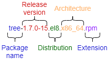

# Gestione del software

## Generalità

Su un sistema Linux, è possibile installare il software in due modi:

* Scaricare i pacchetti software dal repository e installarli sul computer locale
* Compilare il pacchetto del codice sorgente del progetto e installarlo sul computer locale

!!! Note "Nota"

    L'installazione da sorgente non è trattata qui. Di norma, è necessario scaricare il pacchetto software corrispondente dal repository, a meno che il pacchetto software di cui avete bisogno non sia presente nel repository. Questo perché il sistema di gestione dei pacchetti può aiutare gli utenti a risolvere i problemi di dipendenza. Per i principianti, risolvere le dipendenze necessarie per compilare i pacchetti di codice sorgente può risultare complicato.

**Il pacchetto**: gli sviluppatori compilano in anticipo una serie di file sorgente in codice macchina eseguibile e li raggruppano in file binari in un formato specifico. Salvo diversa indicazione, il termine "pacchetto software" in Linux si riferisce ai pacchetti software binari.

**Il file sorgente**: un singolo file di codice leggibile dall'utente (con estensioni quali .c, .py, .java), che può essere semplicemente un frammento di codice o un modulo dell'intero progetto e che richiede la compilazione o un interprete per essere eseguito su un computer.

**Il pacchetto del codice sorgente**: un file di archivio compresso che contiene i file sorgente e i file correlati (come i file di compilazione quali Makefile e configure; i file di documentazione quali README e LICENSE) dell'intero progetto. Estensioni come `.tar.gz` o `.tar.xz` indicano spesso questo tipo di file.

## Panoramica su RPM

**RPM** (RedHat Package Manager) è un sistema di gestione del software. È possibile installare, disinstallare, aggiornare o verificare lo stato del software contenuto nei pacchetti.

**RPM** è il sistema di gestione dei pacchetti utilizzato da tutte le distribuzioni Red Hat (Rocky Linux, Fedora, CentOS, SUSE, Mandriva, ...), i cui pacchetti sono identificati dall'estensione `.rpm`. Debian e le sue distribuzioni derivate utilizzano il sistema di gestione dei pacchetti DPKG per gestire i pacchetti software, identificati dall'estensione `.deb`.

Convenzioni di denominazione per i pacchetti software RPM:



!!! tip "Spiegazione della terminologia"

    Quando utilizziamo l'acronimo "RPM" in maiuscolo, ci riferiamo al sistema di gestione dei pacchetti. Quando si usa "rpm" con la "r" minuscola, nella stragrande maggioranza dei casi ci si riferisce specificatamente al comando `rpm`. Quando si utilizza `.rpm`, si fa riferimento al suffisso del formato del pacchetto. I lettori non devono lasciarsi confondere da questi elementi durante la lettura dei documenti.

Il sistema di gestione dei pacchetti RPM è ancora oggi oggetto di aggiornamenti e miglioramenti costanti; per ulteriori informazioni, si consulti [qui](https://rpm.org/).

## Gestore di pacchetti locale

Il comando `rpm`: strumento da riga di comando per la gestione dei pacchetti RPM locali nelle distribuzioni a monte e a valle di Red Hat.

**Nome completo del pacchetto**: il nome completo del pacchetto software binario, ad esempio `tree-1.7.0-15.el8.x86_64.rpm`.

**Nome del pacchetto**: il nome del pacchetto software, ad esempio `tree`.

Se il pacchetto software in questione non è ancora presente nel sistema operativo (non è installato), è necessario utilizzare il "nome completo del pacchetto" quando si esegue il comando `rpm`. Se il pacchetto software in questione non è nuovo per il sistema operativo (è già installato), è necessario utilizzare il "nome del pacchetto" quando si impiega il comando `rpm`. Questo perché il formato `rpm` memorizza le informazioni relative ai pacchetti software nella directory del database **/var/lib/rpm/**.

Il comando `rpm` si utilizza nel modo seguente:

```bash
rpm [options] <Package-Name> | <Full-Package-Name>
```

### Installare, aggiornare e disinstallare pacchetti software

Le opzioni disponibili sono le seguenti:

| Opzione                        | Descrizione                                         |
| ------------------------------ | --------------------------------------------------- |
| `-i <Full-Package-Name>` | Installa il pacchetto.                              |
| `-U <Full-Package-Name>` | Aggiorna un pacchetto già installato.               |
| `-e <Package-Name>`      | Disinstalla il pacchetto.                           |
| `-h`                           | Visualizza una barra di avanzamento.                |
| `-v`                           | Informa sullo stato di avanzamento dell'operazione. |
| `--test`                       | Esegue il test del comando senza eseguirlo.         |

* Installa uno o più pacchetti - `rpm -ivh <Nome-completo-del-pacchetto> ...`
* Aggiornare uno o più pacchetti - `rpm -Uvh <Nome-completo-del-pacchetto> ...`
* Disinstallare uno o più pacchetti - `rpm -e <Nome-pacchetto> ...`

Poiché `rpm` è un gestore di pacchetti locale, gli utenti devono risolvere manualmente eventuali problemi di dipendenza durante l'installazione del software. Se mancano alcune dipendenze necessarie, verrà visualizzato un messaggio del tipo "failed dependencies".

Comprendere le relazioni di dipendenza dei pacchetti RPM:

* **Relazione di dipendenza ad albero (a.rpm ---> b.rpm ---> c.rpm)** - Quando si installa a.rpm, viene richiesto di installare prima b.rpm. Durante l'installazione di b.rpm, viene richiesto di installare prima c.rpm. Il modo più semplice per risolvere questo problema è concatenare le installazioni con: `rpm -ivh a.rpm b.rpm c.rpm`
* **Relazione di dipendenza circolare (a.rpm ---> b.rpm ---> c.rpm ---> a.rpm)** - `rpm -ivh a.rpm b.rpm c.rpm`
* **Relazioni di dipendenza tra moduli** - Vai su [questo sito web](https://www.rpmfind.net/) per effettuare una ricerca

**D: Perché l'installazione dei pacchetti software comporta sempre problemi di dipendenze?**

Poiché i software o le applicazioni si basano quasi sempre su altri software o librerie, se il programma o la libreria condivisa richiesti non sono presenti nel sistema operativo, è necessario soddisfare questo prerequisito prima di installare l'applicazione desiderata.

### Ricerca pacchetti

Le opzioni disponibili sono le seguenti:

| Opzione  | Descrizione                                                                                                                                                                                                                                                                |
| -------- | -------------------------------------------------------------------------------------------------------------------------------------------------------------------------------------------------------------------------------------------------------------------------- |
| `-q`     | Verificare se il pacchetto software è stato installato, ad esempio con il comando `rpm -q tree-1.7.0-15.el8.x86_64.rpm`                                                                                                                                                    |
| `-a`     | Se utilizzata insieme all'opzione `-q`, consente di visualizzare tutti i pacchetti RPM installati, come nel comando `rpm -qa`                                                                                                                                              |
| `-i`     | Da utilizzare insieme all'opzione `-q` per ottenere informazioni dettagliate sul pacchetto RPM installato corrispondente. Ad esempio `rpm -qi bash`                                                                                                                        |
| `-l`     | Se utilizzata insieme all'opzione `-q`, visualizza l'elenco dei file distribuiti dal pacchetto RPM installato corrispondente                                                                                                                                               |
| `-p`     | Indica i pacchetti software disinstallati, ad esempio `rpm -qip tree-1.7.0-15.el8.x86_64.rpm` e `rpm -qlp tree-1.7.0-15.el8.x86_64.rpm`                                                                                                                                    |
| `-f`     | Se utilizzata insieme all'opzione `-q`, consente di verificare a quale pacchetto software appartiene il file di installazione, ad esempio `rpm -qf /usr/bin/bash`                                                                                                          |
| `-R`     | Se utilizzata insieme all'opzione `-q`, consente di verificare le dipendenze dei pacchetti RPM installati. Se utilizzata insieme all'opzione `-p`, è possibile verificare le dipendenze dei pacchetti RPM non installati, ad esempio: `rpm -qRp mtr-0.92-3.el8.x86_64.rpm` |
| `--last` | Elenca i pacchetti in base alla data di installazione, a partire dal più recente                                                                                                                                                                                           |

Il database RPM si trova nella directory `/var/lib/rpm/`.

Alcuni esempi:

```bash
sudo rpm -qa

sudo rpm -qilp zork-1.0.3-1.el8.x86_64.rpm tree-1.7.0-15.el8.x86_64.rpm

# list the last installed packages:
sudo rpm -qa --last | head
NetworkManager-config-server-1.26.0-13.el8.noarch Mon 24 May 2021 02:34:00 PM CEST
iwl2030-firmware-18.168.6.1-101.el8.1.noarch  Mon 24 May 2021 02:34:00 PM CEST
iwl2000-firmware-18.168.6.1-101.el8.1.noarch  Mon 24 May 2021 02:34:00 PM CEST
iwl135-firmware-18.168.6.1-101.el8.1.noarch   Mon 24 May 2021 02:34:00 PM CEST
iwl105-firmware-18.168.6.1-101.el8.1.noarch   Mon 24 May 2021 02:34:00 PM CEST
iwl100-firmware-39.31.5.1-101.el8.1.noarch    Mon 24 May 2021 02:34:00 PM CEST
iwl1000-firmware-39.31.5.1-101.el8.1.noarch   Mon 24 May 2021 02:34:00 PM CEST
alsa-sof-firmware-1.5-2.el8.noarch            Mon 24 May 2021 02:34:00 PM CEST
iwl7260-firmware-25.30.13.0-101.el8.1.noarch  Mon 24 May 2021 02:33:59 PM CEST
iwl6050-firmware-41.28.5.1-101.el8.1.noarch   Mon 24 May 2021 02:33:59 PM CEST

# list the installation history of the kernel:
sudo rpm -qa --last kernel
kernel-4.18.0-305.el8.x86_64                  Tue 25 May 2021 06:04:56 AM CEST
kernel-4.18.0-240.22.1.el8.x86_64             Mon 24 May 2021 02:33:35 PM CEST
```

!!! tip "Consigli d'uso"

    Quando si utilizza la funzione di query (l'opzione `-q`), il pacchetto software corrispondente deve essere deterministico. In altre parole, non è possibile utilizzare caratteri jolly nella riga di comando `rpm` per trovare corrispondenze con il nome del pacchetto. Per filtrare uno o più pacchetti specifici, è necessario utilizzare il simbolo della barra verticale (`|`) e il comando `grep`.

    ```bash
    sudo rpm -qa | grep ^dbus
    dbus-common-1.12.8-27.el8_10.noarch
    dbus-glib-0.110-2.el8.x86_64
    dbus-libs-1.12.8-27.el8_10.x86_64
    dbus-daemon-1.12.8-27.el8_10.x86_64
    dbus-tools-1.12.8-27.el8_10.x86_64
    dbus-1.12.8-27.el8_10.x86_64
    ```

### Verificare la firma del pacchetto software

Per eseguire questa operazione è necessario utilizzare l'opzione `-K`.

Quando scarichi un pacchetto binario RPM da un sito web sconosciuto o da una fonte non attendibile, non puoi sapere se è stato manomesso. Pertanto, gli utenti devono verificare la firma del pacchetto software per assicurarsi che il pacchetto scaricato sia completo e non sia stato manomesso.

Importare la chiave pubblica richiesta prima di eseguire la verifica della firma sul pacchetto software. Di solito è compito dell'amministratore di sistema.

A partire da RHEL 8.x, è possibile utilizzare il comando `dnf download` per scaricare pacchetti software specifici. Ad esempio, se devi scaricare il pacchetto `wget`, usa:

```bash
sudo dnf download wget

ls -l wget-1.19.5-12.el8_10.x86_64.rpm
-rw-r--r-- 1 root root 750748 Jan  3 17:29 wget-1.19.5-12.el8_10.x86_64.rpm

# Use the "-K" option to verify the signature of the corresponding software package
## You can also use the "-v" or "-vv" option to display more detailed information
sudo rpm -K wget-1.19.5-12.el8_10.x86_64.rpm
wget-1.19.5-12.el8_10.x86_64.rpm: digests signatures OK

# If the software package you downloaded has been tampered with, the following information will be displayed:
echo  "change content" >> /root/wget-1.19.5-12.el8_10.x86_64.rpm
sudo rpm -K wget-1.19.5-12.el8_10.x86_64.rpm
wget-1.19.5-12.el8_10.x86_64.rpm: DIGESTS SIGNATURES NOT OK
```

Se la firma di un pacchetto software non supera la verifica, è consigliabile non continuare a utilizzarlo.

### Verifica le modifiche apportate ai file dopo l'installazione del pacchetto software

Per eseguire questa operazione è necessario utilizzare l'opzione `-V`.

Dopo l'installazione del pacchetto software RPM, il database RPM registra le caratteristiche iniziali e quelle modificate dei file in questione per stabilire se siano stati alterati in modo doloso.

```bash
sudo rpm -q chrony
chrony-4.5-2.el8_10.x86_64

rpm -V chrony
S.5....T.  c /etc/chrony.conf
```

Il risultato è suddiviso in 3 colonne distinte.

- **Prima colonna (S.5....T.)**

    Utilizza 9 campi per rappresentare le informazioni valide del file dopo l'installazione del pacchetto software RPM. Ogni campo o caratteristica che ha superato un determinato controllo o test è contrassegnato da un ".".

    Questi 9 diversi campi o controlli sono:

    - S: Se la dimensione del file è stata modificata.
    - M: Se è stata apportata una modifica al tipo di file o ai permessi del file (rwx).
    - 5: Se il checksum MD5 del file è stato modificato.
    - D: Se vi è una modifica al numero di dispositivi.
    - L: Se è stata apportata una modifica al percorso del file.
    - U: Se è stata apportata una modifica al proprietario del file.
    - G: Se è stata apportata una modifica al gruppo a cui appartiene il file.
    - T: Se è stata apportata una modifica alla data di modifica (mTime) del file.
    - P: Se vi è una modifica alla funzionalità del programma.

- **Seconda colonna (c)**

    **c**: Indica le modifiche apportate al file di configurazione. Può anche assumere i seguenti valori:

    - d: file di documentazione
    - g: file ghost. Se ne vedono pochissimi
    - l: file di licenza
    - r: file readme

- **Terza colonna (/etc/chrony.conf)**

    - **/etc/chrony.conf**: Indica il percorso del file modificato.

## Gestore pacchetti DNF

**DNF** (**Dandified Yum**) è un gestore di pacchetti software, successore di **YUM** (**Y**ellow dog **U**pdater **M**odified).

Il comando `dnf`: questo comando consente di gestire i pacchetti software binari interagendo con il repository. Per i comandi relativi alle voci funzionali più comuni, il loro utilizzo è identico a quello del comando `yum`. Per alcune distribuzioni più recenti (come Rocky Linux 10.x o Fedora 43), sono disponibili aggiornamenti per lo strumento da riga di comando `dnf`. Ad esempio, in Rocky Linux 10.x, gli utenti possono installare in modo selettivo `dnf5` dal repository.

Le distribuzioni basate su Red Hat, come Rocky Linux, Fedora e CentOS, utilizzano lo strumento da riga di comando `dnf`. Il suo equivalente nell'ambiente Debian è lo strumento da riga di comando `apt` (**A**dvanced **P**ackaging **T**ool).

### I comandi relativi agli oggetti funzionali di `dnf`

La sintassi del comando `dnf` è la seguente:

```
dnf [options] <command> [<args>...]
```

Il termine "command" nella sintassi rappresenta l'elemento funzionale command di `dnf`. Alcuni comandi sono integrati, mentre altri richiedono il supporto di plugin di terze parti. È possibile visualizzare le istruzioni per l'uso di ciascun comando utilizzando l'opzione `--help`, ad esempio `dnf list --help`.

1. **Comando `list`**

    Elenca i pacchetti software in base alle diverse opzioni disponibili con questo comando. Per impostazione predefinita, vengono elencati tutti i pacchetti software disponibili per l'installazione nel sistema operativo (il comando `dnf list` equivale a `dnf list --all`).

    * `dnf list --installed` - Elenca i pacchetti software installati per il sistema operativo corrente
    * `dnf list --updates` - Elenca i pacchetti software che è possibile aggiornare

    Le opzioni specifiche del comando list sono le seguenti:

    | Opzioni specifiche | Descrizione                                         |
    | ------------------ | --------------------------------------------------- |
    | `--all`            | mostra tutti i pacchetti (impostazione predefinita) |
    | `--available`      | mostra solo i pacchetti disponibili                 |
    | `--installed`      | mostra solo i pacchetti installati                  |
    | `--extras`         | mostra solo i pacchetti aggiuntivi                  |
    | `--updates`        | mostra solo i pacchetti di aggiornamento            |
    | `--upgrades`       | mostra solo i pacchetti di aggiornamento            |
    | `--autoremove`     | mostra solo i pacchetti con rimozione automatica    |
    | `--recent`         | mostra solo i pacchetti modificati di recente       |

1. **Comando `search`**

    Cerca i pacchetti software nel repository utilizzando la stringa indicata. Ad esempio `dnf search vim`.

1. **Comando `install`**

    Installa uno o più pacchetti software dal repository. Ad esempio `dnf -y install wget tree`. L'opzione `-y` indica che la risposta automatica è "yes". Quando si installano i pacchetti in questo modo, `dnf` gestisce automaticamente la risoluzione delle dipendenze.

    Oltre a installare pacchetti software dal repository, è possibile installare pacchetti software da un URL specificato o da un pacchetto RPM locale, ad esempio `dnf install https://dl.fedoraproject.org/pub/epel/epel-release-latest-8.noarch.rpm`, `dnf install /tmp/mtr-0.92-3.el8.x86_64.rpm`

1. **Comando `info`**

    Visualizza le informazioni su uno o più pacchetti software, ad esempio `dnf info wget tree`

1. Comando **`deplist`** (obsoleto)

    Elenca le dipendenze del pacchetto software. In alternativa, utilizzare il comando `dnf repoquery --deplist <Nome-del-pacchetto>`.

1. **Comando `repolist`**

    Visualizza le informazioni relative ai repository; per impostazione predefinita vengono visualizzati i repository abilitati (il comando `dnf repolist` equivale a `dnf repolist --enabled`)

    * `dnf repolist --all` - Elenca tutti i repository
    * `dnf repolist -v` - Visualizza informazioni dettagliate sui repository abilitati
    * `dnf repolist --disabled` - Elenca solo i repository disabilitati.

1. **Comando `history`**

    Mostra la cronologia dei comandi `dnf` digitati. Per impostazione predefinita, `dnf history` equivale a `dnf history list`. È possibile sostituire "list" con una delle seguenti opzioni: `info`, `redo`, `replay`, `rollback`, `store`, `undo` o `userinstalled`.

1. **Comando `provides`**

    Visualizza il pacchetto software a cui appartiene il file indicato. Ad esempio, `dnf provides /usr/bin/systemctl`.

1. **Comando `remove`**

    Rimuove uno o più pacchetti software dal sistema operativo corrente. Per impostazione predefinita, verrà chiesto se si desidera disinstallare il pacchetto software e il relativo pacchetto di dipendenze; è possibile rispondere automaticamente "yes" tramite l'opzione `-y`.

1. **Comando `autoremove`**

    Elimina automaticamente i pacchetti che in passato erano utilizzati come dipendenze ma che ora non vengono più utilizzati. Ad esempio `dnf -y autoremove`.

1. **Comando `makecache`**

    Crea una cache per i repository appena aggiunti o per i metadati non aggiornati.

1. **Comando `update` o `upgrade`**

    Aggiorna uno o più pacchetti software del sistema operativo. Ad esempio, `dnf update -y` aggiornerà tutti i pacchetti software aggiornabili presenti nel sistema operativo.

1. **Comando `grouplist`, `groupinstall`, `groupremove` o `groupinfo`**

    L'oggetto di questi comandi sono i gruppi di pacchetti, ovvero insiemi di pacchetti software predisposti per uno scenario o un ambiente specifico.

    In Rocky Linux 8.x sono presenti i seguenti gruppi di pacchetti:

    ```bash
    sudo dnf grouplist
    Available Environment Groups:
       Server with GUI
       Server
       Workstation
       KDE Plasma Workspaces
       Virtualization Host
       Custom Operating System
    Installed Environment Groups:
       Minimal Install
    Available Groups:
       Container Management
       .NET Core Development
       RPM Development Tools
       Development Tools
       Graphical Administration Tools
       Headless Management
       Legacy UNIX Compatibility
       Network Servers
       Scientific Support
       Security Tools
       Smart Card Support
       System Tools
       Fedora Packager
       Xfce
    ```

    Per evitare ambiguità, quando si opera su uno o più gruppi di pacchetti, è opportuno racchiudere il nome di un singolo gruppo di pacchetti tra virgolette doppie.

1. **Comando `clean`**

    Cancella i dati memorizzati nella cache. È possibile ripulire tutte le cache dei dati con il comando: `dnf clean all`.

    | Tipo di metadati da ripulire | Descrizione                                                        |
    | ---------------------------- | ------------------------------------------------------------------ |
    | `all`                        | Elimina tutti i file temporanei creati per i repository abilitati. |
    | `dbcache`                    | Elimina i file di cache generati dai metadati del repository.      |
    | `expire-cache`               | Contrassegna i metadati dell'archivio come scaduti.                |
    | `metadata`                   | Rimuove i metadati del repository.                                 |
    | `packages`                   | Rimuove tutti i pacchetti memorizzati nella cache dal sistema.     |

1. **`download` plugin**

    Scarica uno o più pacchetti software dal repository sul computer locale senza installarli.

    È possibile utilizzare le opzioni `--destdir DESTDIR` o `--downloaddir DESRDIR` per specificare il percorso di salvataggio, ad esempio `dnf download tree --downloaddir /tmp/`.

1. **`versionlock` plugin**

    Richiede le informazioni pertinenti utilizzando le diverse opzioni che seguono il comando, in modo simile a `rpm -q`.

    * `dnf repoquery --deplist <Nome-pacchetto>` - Visualizza le dipendenze
    * `dnf repoquery --list <Nome-pacchetto>` - Visualizza l'elenco dei file dopo l'installazione del pacchetto software (indipendentemente dal fatto che il software sia già installato sul sistema operativo)

1. **`config-manager` plugin**

    Gestisce i repository tramite la riga di comando, comprese le operazioni di aggiunta, eliminazione, attivazione e disattivazione dei repository.

    * `dnf config-manager --add-repo <URL>` - Aggiunge un nuovo repository
    * `dnf config-manager --set-disabled devel` - Disattiva in modo permanente un singolo repository
    * `dnf config-manager --set-enabled devel` - Abilita in modo permanente un singolo repository

È possibile visualizzare i comandi disponibili del plugin tramite l'output del comando `dnf --help`:

```bash
sudo dnf --help
...
List of Plugin Commands:

builddep                  Install build dependencies for package or spec file
changelog                 Show changelog data of packages
config-manager            manage dnf configuration options and repositories
copr                      Interact with Copr repositories.
debug-dump                dump information about installed rpm packages to file
debug-restore             restore packages recorded in debug-dump file
debuginfo-install         install debuginfo packages
download                  Download package to current directory
groups-manager            create and edit groups metadata file
needs-restarting          determine updated binaries that need restarting
offline-distrosync        Prepare offline distrosync of the system
offline-upgrade           Prepare offline upgrade of the system
playground                Interact with Playground repository.
repoclosure               Display a list of unresolved dependencies for repositories
repodiff                  List differences between two sets of repositories
repograph                 Output a full package dependency graph in dot format
repomanage                Manage a directory of rpm packages
reposync                  download all packages from remote repo
system-upgrade            Prepare system for upgrade to a new release
...
```

!!! tip 

    Se questi comandi dei plugin non sono presenti, installare il pacchetto `dnf-plugins-core`. Per ulteriori informazioni, clicca qui: https://dnf-plugins-core.readthedocs.io/en/latest/index.html

### Descrizione del file di configurazione

Tutti i file di configurazione dei repository (che terminano con `.repo`) si trovano nella directory **/etc/yum.repos.d/**. Ogni file `.repo` può contenere uno o più repository, e gli utenti possono attivarli o disattivarli in modo selettivo a seconda delle loro esigenze specifiche.

```bash
ls -l /etc/yum.repos.d/
total 72
-rw-r--r--  1 root root 1919 Sep 13  2024 docker-ce.repo
-rw-r--r--  1 root root 1680 Aug 31  2024 epel-modular.repo
-rw-r--r--  1 root root 1332 Aug 31  2024 epel.repo
-rw-r--r--  1 root root 1779 Aug 31  2024 epel-testing-modular.repo
-rw-r--r--  1 root root 1431 Aug 31  2024 epel-testing.repo
-rw-r--r--. 1 root root  710 Jun  7  2024 Rocky-AppStream.repo
-rw-r--r--. 1 root root  695 Jun  7  2024 Rocky-BaseOS.repo
-rw-r--r--  1 root root 1773 Jun  7  2024 Rocky-Debuginfo.repo
-rw-r--r--. 1 root root  360 Jul 11  2024 Rocky-Devel.repo
-rw-r--r--. 1 root root  695 Jun  7  2024 Rocky-Extras.repo
-rw-r--r--. 1 root root  731 Jun  7  2024 Rocky-HighAvailability.repo
-rw-r--r--. 1 root root  680 Jun  7  2024 Rocky-Media.repo
-rw-r--r--. 1 root root  680 Jun  7  2024 Rocky-NFV.repo
-rw-r--r--. 1 root root  690 Jun  7  2024 Rocky-Plus.repo
-rw-r--r--. 1 root root  715 Mar 29 17:39 Rocky-PowerTools.repo
-rw-r--r--. 1 root root  746 Jun  7  2024 Rocky-ResilientStorage.repo
-rw-r--r--. 1 root root  681 Jun  7  2024 Rocky-RT.repo
-rw-r--r--  1 root root 2335 Jun  7  2024 Rocky-Sources.repo
```

Il formato dei contenuti di un singolo repository in ciascun file `.repo` è fisso, ad esempio:

```
[baseos]
name=Rocky Linux $releasever - BaseOS
mirrorlist=https://mirrors.rockylinux.org/mirrorlist?arch=$basearch&repo=BaseOS-$releasever
#baseurl=http://dl.rockylinux.org/$contentdir/$releasever/BaseOS/$basearch/os/
gpgcheck=1
enabled=1
countme=1
gpgkey=file:///etc/pki/rpm-gpg/RPM-GPG-KEY-rockyofficial
```

Descrizione del contenuto:

* Utilizzare "[ ]" per inserire l'ID del repository, che deve essere univoco.
* Sotto i simboli "[ ]" si trovano le opzioni del repository.
* L'opzione "name" - Indica il nome completo del repository.
* L'opzione "mirrorlist" - URL di un elenco di mirror per il repository. Gli URL supportano diversi protocolli, quali https, http, ftp, file, NFS, ecc. Il simbolo "$" nel valore rappresenta la variabile del repository corrispondente.
* L'opzione "baseurl" - Elenco degli URL del repository. Gli URL supportano diversi protocolli, quali https, http, ftp, file, NFS, ecc. Il simbolo "$" nel valore rappresenta la variabile del repository corrispondente.
* Le righe che iniziano con "#" sono righe di commento.
* L'opzione "gpgcheck" - Indica se eseguire il controllo della firma GPG sui pacchetti presenti in questo repository. Il valore predefinito è False (0).
* L'opzione "enabled" - Include questo repository come fonte di pacchetti. Il valore predefinito è True (1).
* L'opzione "countme" - Carica dati statistici anonimi sull'utilizzo. Il valore predefinito è False (0).
* L'opzione "gpgkey" - Percorso della chiave pubblica GPG.

Per ulteriori informazioni, consultare `man 5 yum.conf`.

## Flussi di applicazioni

**Flussi di applicazioni in RL 8.x e RL 9.x:**: Rocky Linux 8.x e 9.x utilizzano una nuova tecnologia modulare che consente ai repository di ospitare più versioni delle applicazioni e delle relative dipendenze. Grazie all'adozione di un'architettura modulare, gli Application Streams in questi due sistemi operativi vengono anche denominati "Module Streams". Gli amministratori di sistema possono scegliere una versione specifica, il che garantisce una maggiore flessibilità. Se gli amministratori di sistema devono gestire gli Application Streams, spesso devono ricorrere al comando `dnf module`.

**Application Streams in RL 10.x**: A partire da Rocky Linux 10.x, gli amministratori di sistema possono continuare a utilizzare gli Application Streams, ma questi non sono più disponibili in forma modulare. In altre parole, il comando `dnf module` nella versione 10.x non funziona più, e gli amministratori di sistema possono gestire le diverse versioni delle applicazioni nel modo tradizionale. In questa versione del sistema operativo, il termine "Application Streams" non corrisponde a "Module Streams".

Ogni flusso di applicazioni ha un ciclo di vita diverso. Si prega di consultare il seguente link:

* https://access.redhat.com/support/policy/updates/rhel-app-streams-life-cycle#rhel8_application_streams
* https://access.redhat.com/support/policy/updates/rhel-app-streams-life-cycle#rhel9_application_streams
* https://access.redhat.com/support/policy/updates/rhel-app-streams-life-cycle#rhel10_dependent_application_streams

In questo documento, l'autore illustra principalmente i flussi applicativi dell'architettura modulare.

### Flussi dei moduli

Nota importante:

* Per utilizzare l'architettura modulare Application Streams nelle versioni RL 8.x e RL 9.x, è necessario abilitare prima il repository **AppStream**. Nel repository Appstream, i **moduli** rappresentano insiemi di pacchetti software destinati a unità logiche che vengono compilati, testati e pubblicati insieme. Un singolo modulo può contenere più flussi (versioni) della stessa applicazione.
* Ogni modulo riceve gli aggiornamenti separatamente.
* Dopo aver abilitato un singolo modulo, gli utenti possono utilizzare solo una versione di quel modulo.
* Ogni modulo può avere un proprio flusso predefinito (versione predefinita) contrassegnato con "[d]".
* Lo stream predefinito rimane attivo a meno che non si disattivi il modulo o si attivi un altro stream per il modulo.

### Profili dei moduli

**Profili dei moduli**: un insieme di elenchi di pacchetti software raggruppati in base a specifici scenari di utilizzo. Ad esempio:

```bash
sudo dnf module list nginx
Last metadata expiration check: 10:04:05 ago on Wed 07 Jan 2026 01:42:24 PM CST.
Rocky Linux 8 - AppStream
Name                      Stream                       Profiles                       Summary
nginx                     1.14 [d]                     common [d]                     nginx webserver
nginx                     1.16                         common [d]                     nginx webserver
nginx                     1.18                         common [d]                     nginx webserver
nginx                     1.20                         common [d]                     nginx webserver
nginx                     1.22                         common [d]                     nginx webserver
nginx                     1.24                         common [d]                     nginx webserver

sudo sudo dnf module install nginx:1.14
Last metadata expiration check: 10:04:31 ago on Wed 07 Jan 2026 01:42:24 PM CST.
Dependencies resolved.
========================================================================================================================
 Package                            Architecture  Version                                        Repository        Size
========================================================================================================================
Installing group/module packages:
 nginx                              x86_64        1:1.14.1-9.module+el8.4.0+542+81547229         appstream        566 k
 nginx-all-modules                  noarch        1:1.14.1-9.module+el8.4.0+542+81547229         appstream         22 k
 nginx-filesystem                   noarch        1:1.14.1-9.module+el8.4.0+542+81547229         appstream         23 k
 nginx-mod-http-image-filter        x86_64        1:1.14.1-9.module+el8.4.0+542+81547229         appstream         34 k
 nginx-mod-http-perl                x86_64        1:1.14.1-9.module+el8.4.0+542+81547229         appstream         45 k
 nginx-mod-http-xslt-filter         x86_64        1:1.14.1-9.module+el8.4.0+542+81547229         appstream         32 k
 nginx-mod-mail                     x86_64        1:1.14.1-9.module+el8.4.0+542+81547229         appstream         63 k
 nginx-mod-stream                   x86_64        1:1.14.1-9.module+el8.4.0+542+81547229         appstream         84 k
Installing dependencies:
 dejavu-fonts-common                noarch        2.35-7.el8                                     baseos            73 k
 dejavu-sans-fonts                  noarch        2.35-7.el8                                     baseos           1.5 M
 fontconfig                         x86_64        2.13.1-4.el8                                   baseos           273 k
 fontpackages-filesystem            noarch        1.44-22.el8                                    baseos            15 k
 gd                                 x86_64        2.2.5-7.el8                                    appstream        143 k
 jbigkit-libs                       x86_64        2.1-14.el8                                     appstream         54 k
 libX11                             x86_64        1.6.8-9.el8_10                                 appstream        611 k
 libX11-common                      noarch        1.6.8-9.el8_10                                 appstream        157 k
 libXau                             x86_64        1.0.9-3.el8                                    appstream         36 k
 libXpm                             x86_64        3.5.12-11.el8                                  appstream         58 k
 libjpeg-turbo                      x86_64        1.5.3-14.el8_10                                appstream        156 k
 libtiff                            x86_64        4.0.9-36.el8_10                                appstream        190 k
 libwebp                            x86_64        1.0.0-11.el8_10                                appstream        273 k
 libxcb                             x86_64        1.13.1-1.el8                                   appstream        228 k
Installing module profiles:
 nginx/common
Enabling module streams:
 nginx                                            1.14

Transaction Summary
========================================================================================================================
Install  22 Packages

Total download size: 4.5 M
Installed size: 14 M
Is this ok [y/N]:
```

Ogni flusso di moduli può avere un numero qualsiasi di profili (o anche nessuno). I profili predefiniti del modulo Stream sono contrassegnati con "[d]".

Nell'esempio sopra riportato, quando l'utente deve installare nginx, il comando seguente è equivalente:

```bash
sudo dnf install nginx

sudo dnf install nginx:1.14

sudo dnf install nginx:1.14/common
```

### Percorsi del modulo di gestione

Il comando utilizzato è `dnf module` e prevede alcuni sottocomandi per le diverse funzionalità.

!!! tip "Consigli per l'uso"

    Quando si esegue il comando `dnf module` su una singola riga che riguarda i moduli, è possibile specificare più nomi di moduli, ad esempio `dnf module enable nginx httpd:2.4` o `dnf module list nodejs:10 perl`.

#### Visualizzare

Per eseguire questa operazione, utilizzare `list` o `info` nei sottocomandi.

* `dnf module list` - Restituisce un elenco di tutti i moduli disponibili.
* `dnf module list <Nome-modulo>` oppure `dnf module list <Nome-modulo>:<Stream>` - Elenca tutti gli stream (versioni) disponibili per il modulo corrente. Elenca le informazioni relative a un singolo flusso di modulo. Ad esempio `dnf module list postgresql` o `dnf module list postgresql:15`.
* `dnf module list --enabled` - Lists the enabled module stream(s).
* `dnf module info <Nome-modulo>` oppure `dnf module info <Nome-modulo>:<Stream>` - Visualizza le informazioni relative allo stream del modulo. Se si digita solo il nome di un modulo senza specificare uno stream, verranno visualizzate tutte le informazioni relative agli stream di quel modulo. Ad esempio `dnf module info ruby` o `dnf module info ruby:2.6`.
* `dnf module --info --profile <Nome-modulo>` oppure `dnf module --info --profile <Nome-modulo>:<Stream>` - Elenca le informazioni sul profilo dello stream del modulo. Se si digita solo il nome di un modulo senza specificare uno stream, verranno visualizzate tutte le informazioni relative al profilo dello stream per quel modulo.

#### Installazione

Prima di installare lo specifico stream di un modulo, è necessario abilitarlo. La sintassi utilizzata è la seguente:

```bash
dnf module enable <Module-Name>:<Stream> ...
```

Ad esempio:

```bash
dnf -y module enable httpd:2.4
```

!!! tip "Ribadiamo"

    Lo stream predefinito rimane attivo a meno che non si disattivi il modulo o si attivi un altro stream per il modulo.

Sono ammessi i seguenti metodi d'installazione:

* `dnf -y module install <Module-Name>` - Utilizza lo stream predefinito e il profilo predefinito di un singolo modulo (se esiste un profilo predefinito). Ad esempio: `dnf -y install httpd`
* `dnf -y install <Module-Name>:<Stream>/<Profile>` - Utilizzare uno stream e un profilo specifici di un singolo modulo. Ad esempio, `dnf -y install httpd:2.4:/minimal`. Se sono presenti più profili, è possibile utilizzare `*` per rappresentarli tutti, ad esempio `dnf module install httpd:2.4/*`

#### Remove

Per rimuovere di pacchetti è possibile utilizzare la seguente sintassi:

* `dnf -y module remove --all <Module-name>:<Stream> ...` - Rimuove tutti i pacchetti da un singolo stream all’interno di un singolo modulo. Ad esempio: `dnf -y module remove --all httpd:2.4`
* `dnf -y module remove --all <Nome-modulo>:<Stream>/<Profilo> ...` - Rimuove tutti i pacchetti associati a un profilo specifico, utilizzando `*` per indicare tutti i profili. Ad esempio `dnf -y module remove httpd:2.4/*`

#### Reset

È possibile utilizzare il comando `reset` per riportare il modulo allo stato iniziale. La sintassi corrispondente è la seguente:

* `dnf -y module reset <Module-Name> ...` - For example `dnf -y module reset httpd`

!!! tip "Nota Importante"

    Il reset del modulo non modificherà i pacchetti software installati.

#### Switch

Si può passare allo stream aggiornato. Sono necessari due prerequisiti per eseguire questa operazione:

1. Il sistema operativo è stato completamente aggiornato
2. I pacchetti software installati nel sistema operativo non sono più recenti di quelli disponibili nel repository

È possibile utilizzare il comando `dnf distro-sync` per passare al nuovo stream.

Se sono disponibili aggiornamenti per lo stream del modulo, è necessario eseguire i seguenti passaggi:

1. `dnf module reset <Module-Name> ...`
2. `dnf module enable <Module-Name>:<New-Stream> ...`
3. `dnf distro-sync`

Se sono già installati nel sistema operativo, è possibile utilizzare l'opzione di comando `switch-to` per eseguire l'aggiornamento o il downgrade di questi pacchetti software. La sintassi in questo caso è:

```bash
dnf module switch-to <Module-Name>:<Stream>
```

#### Disable

La sintassi utilizzata è:

```bash
dnf module disable <Module-Name> ...
```

#### Personalizzazione utilizzando un file YAML

Un amministratore di sistema può personalizzare lo stream predefinito e il profilo predefinito creando un file YAML nella directory <strong x-id=“1”>/etc/dnf/modules.defaults.d/</strong>.

Prendendo il modulo PostgreSQL come esempio, dalle informazioni visualizzate si può notare che il suo stream predefinito è 10 e il profilo predefinito è “server”:

```bash
sudo dnf module list postgresql
Name                   Stream             Profiles                       Summary
postgresql             9.6                client, server [d]             PostgreSQL server and client module
postgresql             10 [d]             client, server [d]             PostgreSQL server and client module
postgresql             12                 client, server [d]             PostgreSQL server and client module
postgresql             13                 client, server [d]             PostgreSQL server and client module
postgresql             15                 client, server [d]             PostgreSQL server and client module
postgresql             16                 client, server [d]             PostgreSQL server and client module

Hint: [d]efault, [e]nabled, [x]disabled, [i]nstalled
```

Impostare 15 come stream predefinito e impostare il profilo predefinito per postgresql:12 su “client”:

```bash
sudo vim /etc/dnf/modules.defaults.d/postgresql.yaml
---
document: modulemd-defaults
version: 1
data:
        module: postgresql
        stream: "15"
        profiles:
                "9.6": [server]
                "10": [server]
                "12": [client]
                "13": [server]
                "15": [server]
...

sudo dnf module list postgresql
Last metadata expiration check: 0:41:35 ago on Sat 10 Jan 2026 10:10:22 PM CST.
Rocky Linux 8 - AppStream
Name                   Stream             Profiles                       Summary
postgresql             9.6                client, server [d]             PostgreSQL server and client module
postgresql             10                 client, server [d]             PostgreSQL server and client module
postgresql             12                 client [d], server             PostgreSQL server and client module
postgresql             13                 client, server [d]             PostgreSQL server and client module
postgresql             15 [d]             client, server [d]             PostgreSQL server and client module
postgresql             16                 client, server                 PostgreSQL server and client module

Hint: [d]efault, [e]nabled, [x]disabled, [i]nstalled
```

#### Esempio:

Prendiamo come esempio il modulo nodejs:

```bash
sudo dnf module list nodejs
Last metadata expiration check: 0:44:38 ago on Sat 10 Jan 2026 10:10:22 PM CST.
Rocky Linux 8 - AppStream
Name                Stream              Profiles                                          Summary
nodejs              10 [d]              common [d], development, minimal, s2i             Javascript runtime
nodejs              12                  common [d], development, minimal, s2i             Javascript runtime
nodejs              14                  common [d], development, minimal, s2i             Javascript runtime
nodejs              16                  common [d], development, minimal, s2i             Javascript runtime
nodejs              18                  common [d], development, minimal, s2i             Javascript runtime
nodejs              20                  common [d], development, minimal, s2i             Javascript runtime
nodejs              22                  common, development, minimal, s2i                 Javascript runtime
nodejs              24                  common, development, minimal, s2i                 Javascript runtime

Hint: [d]efault, [e]nabled, [x]disabled, [i]nstalled

sudo dnf -y module enable nodejs:18

sudo dnf module list --enabled nodejs
Last metadata expiration check: 0:46:01 ago on Sat 10 Jan 2026 10:10:22 PM CST.
Rocky Linux 8 - AppStream
Name                Stream              Profiles                                          Summary
nodejs              18 [e]              common [d], development, minimal, s2i             Javascript runtime

Hint: [d]efault, [e]nabled, [x]disabled, [i]nstalled

sudo dnf -y module install nodejs:18/minimal

sudo dnf module list --enabled nodejs
Last metadata expiration check: 0:47:26 ago on Sat 10 Jan 2026 10:10:22 PM CST.
Rocky Linux 8 - AppStream
Name               Stream             Profiles                                             Summary
nodejs             18 [e]             common [d], development, minimal [i], s2i            Javascript runtime

Hint: [d]efault, [e]nabled, [x]disabled, [i]nstalled

sudo dnf -y module install nodejs:18/common

sudo dnf module list --enabled nodejs
Last metadata expiration check: 0:48:34 ago on Sat 10 Jan 2026 10:10:22 PM CST.
Rocky Linux 8 - AppStream
Name              Stream            Profiles                                                Summary
nodejs            18 [e]            common [d] [i], development, minimal [i], s2i           Javascript runtime

Hint: [d]efault, [e]nabled, [x]disabled, [i]nstalled

sudo dnf -y module remove --all nodejs:18/*

sudo dnf -y module reset nodejs

sudo dnf module list nodejs
Last metadata expiration check: 0:50:03 ago on Sat 10 Jan 2026 10:10:22 PM CST.
Rocky Linux 8 - AppStream
Name                Stream              Profiles                                          Summary
nodejs              10 [d]              common [d], development, minimal, s2i             Javascript runtime
nodejs              12                  common [d], development, minimal, s2i             Javascript runtime
nodejs              14                  common [d], development, minimal, s2i             Javascript runtime
nodejs              16                  common [d], development, minimal, s2i             Javascript runtime
nodejs              18                  common [d], development, minimal, s2i             Javascript runtime
nodejs              20                  common [d], development, minimal, s2i             Javascript runtime
nodejs              22                  common, development, minimal, s2i                 Javascript runtime
nodejs              24                  common, development, minimal, s2i                 Javascript runtime

Hint: [d]efault, [e]nabled, [x]disabled, [i]nstalled
```

## Il repository EPEL

**Che cos’è EPEL e come si usa?**

<strong x-id=“1”>EPEL</strong> (<strong x-id=“1”>E</strong>xtra <strong x-id=“1”>P</strong>ackages for <strong x-id=‘1’>E</strong>nterprise <strong x-id=“1” >L</strong>inux) è un repository open source e gratuito basato sulla comunità, gestito dal [Gruppo di interesse speciale EPEL di Fedora](https://docs.fedoraproject.org/en-US/epel/). Questa risorsa fornisce una serie di pacchetti aggiuntivi per RHEL (oltre che per CentOS, Rocky Linux e altre distribuzioni) provenienti dai repository di Fedora.

Sia che si tratti di utenti privati o aziende che utilizzano Rocky Linux 8.x/9.x/10.x, di solito si consiglia di abilitare il repository EPEL.

È possibile installare il repository EPEL nei seguenti modi:

```bash
dnf install epel-release
```

Esaminare le informazioni pertinenti e verificare che l'installazione sia stata eseguita correttamente:

```bash
sudo dnf info epel-release
Last metadata expiration check: 1 day, 23:02:38 ago on Sat 10 Jan 2026 10:10:22 PM CST.
Installed Packages
Name         : epel-release
Version      : 8
Release      : 22.el8
Architecture : noarch
Size         : 34 k
Source       : epel-release-8-22.el8.src.rpm
Repository   : @System
From repo    : epel
Summary      : Extra Packages for Enterprise Linux repository configuration
URL          : http://download.fedoraproject.org/pub/epel
License      : GPLv2
Description  : This package contains the Extra Packages for Enterprise Linux (EPEL) repository
             : GPG key as well as configuration for yum.

rpm -qa | grep epel
epel-release-8-14.el8.noarch

sudo dnf repolist
repo id            repo name
...
epel                                      Extra Packages for Enterprise Linux 8 - x86_64
...
```

Qui si può notare come il pacchetto non contiene file eseguibili, librerie e così via, ma solo i file di configurazione e le chiavi GPG necessari per configurare il repository.

File `.repo` associati:

```bash
ls -lh /etc/yum.repos.d/epel*
-rw-r--r-- 1 root root 1.7K Apr 23  2025 /etc/yum.repos.d/epel-modular.repo
-rw-r--r-- 1 root root 1.4K Apr 23  2025 /etc/yum.repos.d/epel.repo
-rw-r--r-- 1 root root 1.8K Apr 23  2025 /etc/yum.repos.d/epel-testing-modular.repo
-rw-r--r-- 1 root root 1.4K Apr 23  2025 /etc/yum.repos.d/epel-testing.repo
```

Di default, sono abilitati solo i repository con l'ID epel presenti nel file `epel.repo`.

```bash
cat /etc/yum.repos.d/epel.repo
[epel]
name=Extra Packages for Enterprise Linux 8 - $basearch
# It is much more secure to use the metalink, but if you wish to use a local mirror
# place its address here.
#baseurl=https://download.example/pub/epel/$releasever/Everything/source/tree/
metalink=https://mirrors.fedoraproject.org/metalink?repo=epel-source-$releasever&arch=$basearch&infra=$infra&content=$contentdir
enabled=0
gpgkey=file:///etc/pki/rpm-gpg/RPM-GPG-KEY-EPEL-8
gpgcheck=1
```

Elencare tutti i pacchetti software disponibili con ID repository epel:

```bash
dnf --repoid epel list --available 
```

Se nel tuo sistema operativo sono presenti altri repository, ma desideri installare pacchetti solo da EPEL:

```bash
sudo dnf --disablerepo="*" --enablerepo="epel" install nmon
Last metadata expiration check: 0:08:13 ago on Mon 12 Jan 2026 09:34:25 PM CST.
Dipendenze risolte.
========================================================================================================================
 Package                   Architecture                Version                          Repository                 Size
========================================================================================================================
Installing:
 nmon                      x86_64                      16p-5.el8                        epel                       80 k

Transaction Summary
========================================================================================================================
Install  1 Package

Total download size: 80 k
Installed size: 161 k
Is this ok [y/N]:
```

!!! tip "Promemoria utile"

    Quando sono abilitati più repository, lo stesso pacchetto software può avere più versioni e, per impostazione predefinita, la versione più recente ha la priorità più alta. Questo è anche il motivo per cui si utilizzano le opzioni `--disablerepo` e `--enablerepo`.

!!! attention "Considerazione sul Supporto"

    EPEL è un progetto avviato da volontari della comunità Fedora, pertanto non beneficia del supporto commerciale di Red Hat. Proprio come per Fedora stessa, Red Hat ospita l'infrastruttura di questo progetto e i tecnici di Red Hat vi partecipano in qualità di manutentori e responsabili, ma Red Hat non offre contratti di assistenza commerciale né accordi sul livello di servizio per i pacchetti presenti in EPEL.

Per le domande frequenti su EPEL, consultare [le FAQ su EPEL nella documentazione di Fedora](https://docs.fedoraproject.org/en-US/epel/epel-faq/).
