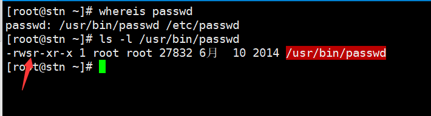
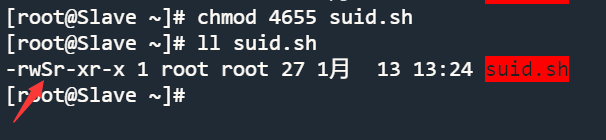

<font color=red>이 문서의 모든 예제는 일반 사용자 동작이 주석 처리되어 있는 root 동작을 사용합니다. 마크다운 코드 블록에서 명령 설명은 이전 줄에 #으로 표시됩니다.</font>

# 기본 권한 검토

GNU/Linux의 기본 권한은 `ls -l`사용하여 볼 수 있습니다:

```bash
Shell > ls -l 
-  rwx  r-x  r-x  1  root  root    1358  Dec 31 14:50  anaconda-ks.cfg
↓   ↓    ↓    ↓   ↓   ↓     ↓       ↓        ↓            ↓
1   2    3    4   5   6     7       8        9            10
```

그 의미는 다음과 같습니다.

| 파트 | 설명                                                                                          |
| -- | ------------------------------------------------------------------------------------------- |
| 1  | 파일 유형 `-`는 이것이 일반 파일임을 나타냅니다. 7개의 파일 형식은 나중에 소개됩니다.                                         |
| 2  | 소유자 사용자의 권한입니다. rwx의 의미는 각각 읽기, 쓰기, 실행을 나타냅니다.                                              |
| 3  | 소유자 그룹의 권한입니다.                                                                              |
| 4  | 다른 사용자의 권한입니다.                                                                              |
| 5  | 하위 디렉토리 수(`.` 및 `..` 포함)입니다. 파일의 경우 하드 링크 수를 나타내며, 1은 해당 파일 자체를 나타냅니다.                      |
| 6  | 소유자 사용자의 이름입니다.                                                                             |
| 7  | 소유자 그룹의 이름입니다.                                                                              |
| 8  | 파일의 크기입니다. 디렉토리의 경우 파일 네이밍에 의해 사용되는 고정값인 4096바이트를 표시합니다. 디렉토리의 총 크기를 계산하려면 `du -sh`를 사용하세요. |
| 9  | 최종 수정 날짜입니다.                                                                                |
| 10 | 파일(또는 디렉토리)의 이름입니다.                                                                         |

## 7가지 파일 유형

| 파일 유형 | 설명                                                                                                            |
|:-----:| ------------------------------------------------------------------------------------------------------------- |
| **-** | 일반 파일을 나타냅니다. 일반 텍스트 파일(ASCII) 포함 바이너리 파일(binary); 데이터 형식 파일(data); 다양한 압축 파일을 포함합니다.                         |
| **d** | 디렉토리 파일을 나타냅니다. 기본적으로 모든 디렉터리 `.` 와`..`에 하나씩 있습니다.                                                            |
| **b** | 블록 장치 파일입니다. 모든 종류의 하드 드라이브, USB 드라이브 등을 포함합니다.                                                               |
| **c** | 문자 장치 파일입니다. 마우스, 키보드 등의 직렬 포트 인터페이스 장치입니다.                                                                   |
| **s** | 소켓 파일입니다. 네트워크 통신에 특별히 사용되는 파일입니다.                                                                            |
| **p** | 파이프 파일입니다. 이는 여러 프로그램이 동시에 파일에 접근하는 것으로 인한 오류를 해결하기 위한 특수한 파일 유형입니다. FIFO는 선입 선출(first-in-first-out) 의 약자입니다. |
| **l** | 심볼릭 링크 파일이라고도 하는 소프트 링크 파일은 Windows의 바로 가기와 유사합니다. 하드 링크 파일로도 알려진 실제 링크 파일입니다.                                |

## 기본 권한의 의미

파일의 경우:

| 디지털 표현 | 권한           | 설명                                                                             |
|:------:| ------------ | ------------------------------------------------------------------------------ |
|   4    | r(read)      | 이 파일을 읽을 수 있음을 나타냅니다. `cat`, `head`, `more`, `less`, `tail` 등의 명령을 사용할 수 있습니다. |
|   2    | w(write)     | 파일을 수정할 수 있음을 나타냅니다. `vim`과 같은 명령을 사용할 수 있습니다.                                 |
|   1    | x(execution) | 실행 파일(예: 스크립트 또는 바이너리)에 대한 권한입니다.                                              |

디렉토리의 경우:

| 디지털 표현 | 권한         | 설명                                                                          |
|:------:| ---------- | --------------------------------------------------------------------------- |
|   4    | r(read)    | `ls -l`과 같이 디렉토리의 내용을 나열할 수 있음을 나타냅니다.                                      |
|   2    | w(write)   | `mkdir`, `touch`, `rm` 등의 명령과 같이 이 디렉토리에서 파일을 생성, 삭제 및 이름을 변경할 수 있음을 나타냅니다. |
|   1    | x(execute) | `cd` 명령과 같이 디렉토리를 진입할 수 있음을 나타냅니다.                                          |

!!! info

    디렉터리의 경우, 일반적으로 **r** 및 **x** 권한이 동시에 나타납니다.

## 특수 권한

GNU/Linux에서 기본 권한 외에도 특수 권한이 몇 가지 있습니다. 이를 하나씩 소개하겠습니다.

### ACL 권한

ACL이란 무엇인가요? ACL(Access Control List - 액세스 제어 목록) 의 목적은 Linux의 세 가지 ID가 리소스 권한 할당 요구를 충족시키지 못하는 문제를 해결하기 위한 것입니다.

예를 들어, 선생님이 학생에게 수업을 가르치기 위해 OS의 루트 디렉토리 아래에 디렉토리를 생성합니다 이 수업에 속한 학생들만 업로드와 다운로드를 허용하고, 다른 사람들은 허용되지 않습니다. 이 때 디렉터리의 권한은 770입니다. 어느 날, 다른 학교 학생이 선생님의 강의를 듣기 위해 왔다면 어떻게 권한을 할당해야 할까요? 이 학생을 **소유자 그룹**에 넣으면 이 학생은 이 수업의 학생들과 동일한 권한인 **rwx**를 갖게 됩니다. 이 학생을 **다른 사용자**로 넣으면 어떤 권한도 갖지 않습니다. 이때 기본 권한 할당은 요구 사항을 충족시키지 못하므로 ACL을 사용해야 합니다.

Windows 운영 체제에도 유사한 기능이 있습니다. 예를 들어 파일에 대해 사용자에게 권한을 할당하려면 사용자 정의 디렉토리/파일에서 **오른쪽 클릭** ---> **속성** ---> **보안** ---> **편집** ---> **추가** ---> **고급** ---> **찾기**, 해당하는 사용자/그룹 찾기 ---> 특정 권한 할당 ---> **적용**하고 완료합니다.

<!--Screenshots of the English interface are required-->

GNU/Linux에서도 마찬가지입니다. 지정된 사용자/그룹을 파일/디렉토리에 추가하고 적절한 권한을 부여하여 ACL 권한 할당을 완료할 수 있습니다.

ACL을 어떻게 활성화할까요? 마운트 지점이 위치한 장치의 파일 이름과 파티션 번호를 찾아야 합니다. 예를 들어, 내 컴퓨터에서 다음과 같이 수행할 수 있습니다:

```bash
Shell > df -hT
Filesystem     Type      Size  Used  Avail Use% Mounted on
devtmpfs       devtmpfs  3.8G     0  3.8G    0% /dev
tmpfs          tmpfs     3.8G     0  3.8G    0% /dev/shm
tmpfs          tmpfs     3.8G  8.9M  3.8G    1% /run
tmpfs          tmpfs     3.8G     0  3.8G    0% /sys/fs/cgroup
/dev/nvme0n1p2 ext4       47G   11G   35G   24% /
/dev/nvme0n1p1 xfs      1014M  187M  828M   19% /boot
tmpfs          tmpfs     774M     0  774M    0% /run/user/0

Shell > dumpe2fs /dev/nvme0n1p2 | head -n 10
dumpe2fs 1.45.6 (20-Mar-2020)
Filesystem volume name:   <none>
Last mounted on:          /
Filesystem UUID:          c8e6206d-2892-4c22-a10b-b87d2447a885
Filesystem magic number:  0xEF53
Filesystem revision #:    1 (dynamic)
Filesystem features:      has_journal ext_attr resize_inode dir_index filetype needs_recovery extent 64bit flex_bg sparse_super large_file huge_file dir_nlink extra_isize metadata_csum
Filesystem flags:         signed_directory_hash 
Default mount options:    user_xattr acl
Filesystem state:         clean
Errors behavior:          Continue
```

**"Default mount options: user_xattr acl"** 줄이 표시되면 ACL이 활성화되었음을 확인 할 수 있습니다. Acl이 활성화되지 않았다면 일시적으로 활성화할 수도 있습니다 -- `mount -o remount,acl /`명령을 사용할 수 있습니다. 영구적으로 활성화하려면 다음과 같이 할 수도 있습니다:

```bash
Shell > vim /etc/fstab
UUID=c8e6206d-2892-4c22-a10b-b87d2447a885  /   ext4    defaults,acl        1 1

Shell > mount -o remount /
# or
Shell > reboot
```

#### ACL 보기 및 설정

ACL을 보려면 `getfacle` 명령을 사용해야 합니다. -- `getfacle FILE_NAME`

ACL 권한을 설정하려면 `setfacl` 명령을 사용해야 합니다.

```bash
Shell > setfacl <option> <FILE_NAME>
```

| 옵션 | 설명                    |
| -- | --------------------- |
| -m | 파일의 현재 ACL을 수정합니다.    |
| -x | 파일의 ACL에서 항목을 제거합니다.  |
| -b | 모든 확장 ACL 항목 제거합니다.   |
| -d | 작업은 기본 ACL에 적용됩니다.    |
| -k | 기본 ACL을 제거합니다.        |
| -R | 하위 디렉토리로 재귀적으로 적용합니다. |

ACL의 사용법을 설명하기 위해 첫 번째에 언급된 선생님의 예시를 사용해 보겠습니다.

```bash
# 선생님은 root 사용자입니다.
Shell > groupadd class1
Shell > mkdir /project
Shell > chown root:class1 /project
Shell > chmod 770 /project
Shell > ls -ld /project/
drwxrwx--- 2 root class1 4096 Jan  12 12:58 /project/

# 학급의 학생들을 class1 그룹에 넣습니다.
Shell > useradd frank
Shell > passwd frank
Shell > useradd aron
Shell > passwd aron
Shell > gpasswd -a frank class1
Shell > gpasswd -a aron class1

# 다른 학교의 학생이 선생님 수업을 듣러 왔습니다.
Shell > useradd tom
Shell > passwd tom
# 그룹인 경우, "u"는 여기서 "g"로 대체되어야 합니다.
Shell > setfacle -m u:tom:rx  /project

# 출력 메시지에 "+" 기호가 추가됩니다.
Shell > ls -ld /project/
drwxrwx---+ 2 root class1 4096 Jan  12 12:58 /project/

Shell > getfacl -p /project/
# file: /project/
# owner: root
# group: class1
user::rwx
user:tom:r-x
group::rwx
mask::rwx
other::---
```

#### ACL의 최대 유효 권한

`getfacl` 명령을 사용할 때 출력 메시지의 "mask:: rwx"는 무엇을 의미합니까? **마스크**는 최대 유효 권한을 지정하는 데 사용됩니다. 사용자에게 부여된 권한은 실제 권한이 아니며 실제 권한은 사용자 권한과 마스크 권한의 "logical and"를 사용해야만 얻을 수 있습니다.

!!! 정보

    "Logical and"란 모든 조건이 참이면 결과가 참이 되고, 하나의 조건이라도 거짓이면 결과는 거짓이 되는 것을 의미합니다.
    
    | Permissions set by users | Mask permissions | Result |
    |:---:|:---:|:---:|
    | r | r | r |
    | r | - | - |
    | - | r | - |
    | - | - | - |

!!! 정보

    기본 마스크가 rwx인 경우, 모든 사용자의 ACL 권한에 대한 결과는 해당 사용자의 권한입니다.

마스크 권한을 조정할 수도 있습니다.

```bash
Shell > setfacl -m u:tom:rwx /project
Shell > setfacl -m m:rx /project

Shell > getfacl  -p /project/
# file: project/
# owner: root
# group: class1
user::rwx
user:tom:rwx                    #effective:r-x
group::rwx                      #effective:r-x
mask::r-x
other::---
```

#### ACL 권한 삭제

```bash
# 지정된 디렉토리에서 사용자/그룹의 ACL 권한 삭제.
Shell > setfacl -x u:USER_NAME FILE_NAME
Shell > setfacl -x g:GROUP_NAME FILE_NAME

# 지정된 디렉토리에 대한 모든 ACL 권한을 제거.
Shell > setfacl -b FILE_NAME
```

#### ACL 권한의 기본 및 재귀

ACL 권한의 재귀란 무엇을 의미할까요? ACL 권한에서 이는 상위 디렉토리가 ACL 권한을 설정할 때, 모든 하위 디렉토리와 파일에 동일한 ACL 권한이 적용되는 것을 의미합니다.

!!! 정보

    재귀는 이미 존재하는 파일/디렉토리에 적용됩니다.

다음 예를 살펴보십시오.

```bash
Shell > setfacl -m m:rwx /project
Shell > setfacl -m u:tom:rx /project

Shell > cd /project
Shell > touch file1 file2
# 재귀가 없기 때문에 여기의 파일에는 ACL 권한이 없습니다. 
Shell > ls -l
-rw-r--r-- 1 root root 0 Jan  12 14:35 file1
-rw-r--r-- 1 root root 0 Jan  12 14:35 file2

Shell > setfacl -m u:tom:rx -R /project
Shell > ls -l /project
-rw-r-xr--+ 1 root root 0 Jan  12 14:35 file1
-rw-r-xr--+ 1 root root 0 Jan  12 14:35 file2
```

이제 질문이 있습니다. 이 디렉토리에 새 파일을 생성하면 ACL 권한이 있는 걸까요? 답은 아니오입니다. 새로 생성된 파일은 `setfacl-m u:tom:rx -R /project` 명령이 실행된 후에 생성되기 때문입니다.

```bash
Shell > touch /project/file3
Shell > ls -l /project/file3
-rw-r--r-- 1 root root 0 Jan  12 14:52 /project/file3
```

새로 생성된 디렉토리/파일에 ACL 권한도 부여하려면 기본 ACL 권한을 사용해야 합니다.

```bash
Shell > setfacl -m d:u:tom:rx  /project
Shell > cd /project && touch file4 && ls -l 
-rw-r-xr--+ 1 root root 0 Jan  12 14:35 file1
-rw-r-xr--+ 1 root root 0 Jan  12 14:35 file2
-rw-r--r--  1 root root 0 Jan  12 14:52 file3
-rw-rw----+ 1 root root 0 Jan  12 14:59 file4

Shell > getfacl -p /project
# file: /project
# owner: root
# group: class1
user::rwx
user:tom:r-x
group::rwx
mask::rwx
other::---
default:user::rwx
default:user:tom:r-x
default:group::rwx
default:mask::rwx
default:other::---
```

### SetUID

"SetUID"의 역할:

* 실행 가능한 이진 파일만 SUID 권한을 설정할 수 있습니다.
* 명령어의 실행자는 프로그램에 대한 x 권한을 가지고 있어야 합니다.
* 명령어의 실행자는 프로그램을 실행할 때 프로그램 파일 소유자의 Id를 얻습니다.
* Id 변경은 실행 중에만 유효하며, 이진 프로그램이 종료되면 실행자의 Id가 원래 Id로 복원됩니다.

GNU/Linux에 왜 그런 이상한 권한이 필요할까요? 가장 일반적인 `passwd` 명령을 예로 들어 보겠습니다.



보시다시피 일반 사용자는 r과 x만 가지고 있지만 소유자의 x는 s가 되어 `passwd` 명령에 SUID 권한이 있음을 증명합니다.

일반 사용자(uid >= 1000)가 자신의 암호를 변경할 수 있다는 것은 잘 알려져 있습니다. 실제 비밀번호는 **/etc/shadow** 파일에 저장되지만 shadows 파일의 권한은 000으로 일반 사용자는 어떠한 권한도 가지고 있지 않습니다.

```bash
Shell > ls -l /etc/shadow
---------- 1 root root 874 Jan  12 13:42 /etc/shadow
```

일반 사용자는 비밀번호를 변경할 수 있으므로 **/etc/shadow** 파일에 비밀번호를 적어 두어야 합니다. 일반 사용자가 `passwd` 명령을 실행하면 일시적으로 파일 소유자인 **root**로 변경됩니다. **shadow** 파일의 경우 **root**는 권한으로 제한할 수 없습니다. 이것이 `passwd` 명령에 SUID 권한이 필요한 이유입니다.

앞서 언급했듯이, 기본 권한은 755, 644와 같은 숫자로 표현될 수 있습니다. SUID는 **4**로 표시됩니다. 실행 가능한 이진 파일의 경우, 다음과 같이 권한을 설정할 수 있습니다 -- **4755**.

```bash
# SUID 권한 설정
Shell > chmod 4755 FILE_NAME
# 또는
Shell > chmod u+s FILE_NAME

# SUID 권한 제거
Shell > chmod 755 FILE_NAME
# 또는
Shell > chmod u-s FILE_NAME
```

!!! 주의

    실행 가능한 이진 파일/프로그램의 소유자가 **x**를 가지고 있지 않을 때, 대문자 **S**를 사용한다는 것은 파일이 SUID 권한을 사용할 수 없음을 의미합니다.


    ```bash
    # 이것이 실행 가능한 이진 파일이라고 가정합시다
    Shell > vim suid.sh
    #!/bin/bash
    cd /etc && ls

    Shell > chmod 4644 suid.sh
    ```


    

!!! 주의

    SUID는 일반 사용자를 일시적으로 root로 변경할 수 있기 때문에, 서버를 유지보수할 때 이러한 권한을 가진 파일에 특히 주의해야 합니다. 다음 명령어를 사용하여 SUID 권한을 가진 파일을 찾을 수 있습니다.

    ```bash
    Shell > find / -perm -4000 -a -type f -exec ls -l  {} \;
    ```

### SetGID

"SetGID"의 역할:

* 실행 가능한 이진 파일만 SUID 권한을 설정할 수 있습니다.
* 명령어의 실행자는 프로그램에 대한 x 권한을 가지고 있어야 합니다.
* 명령어의 실행자는 프로그램을 실행할 때 프로그램 파일 소유자의 Id를 얻습니다.
* Id 변경은 실행 중에만 유효하며, 이진 프로그램이 종료되면 실행자의 Id가 원래 Id로 복원됩니다.

`locate` 명령어를 예로 들어봅시다:

```
Shell > rpm -ql mlocate
/usr/bin/locate
...
/var/lib/mlocate/mlocate.db

Shell > ls -l /var/lib/mlocate/mlocate.db
-rw-r----- 1 root slocate 4151779 1月  14 11:43 /var/lib/mlocate/mlocate.db

Shell > ll /usr/bin/locate 
-rwx--s--x. 1 root slocate 42248 4月  12 2021 /usr/bin/locate
```

`locate` 명령은 **mlocate.db** 데이터베이스 파일을 사용하여 파일을 빠르게 검색합니다.

`locate` 명령에는 SGID 권한이 있으므로, 실행자(일반 사용자) 가 `locate` 명령을 실행하면, 소유자 그룹이 **slocate**로 변경됩니다. `slocate`에는 **/var/lib/mlocate/mlocate.db** 파일에 대한 r 권한을 가지고 있습니다.

SGID는 숫자 **2**로 표시되므로 `locate` 명령의 권한은 2711입니다.

```bash
# SGID 권한 설정
Shell > chmod 2711 FILE_NAME
# 또는
Shell > chmod g+s FILE_NAME

# SGID 권한 제거
Shell > chmod 711 FILE_NAME
# 또는
Shell > chmod g-s FILE_NAME
```

!!! 주의

    실행 가능한 이진 파일/프로그램의 소유자 그룹에 **x**가 없으면 대문자 **S**를 사용하여 파일의 SGID 권한을 올바르게 사용할 수 없음을 나타냅니다.

    ```bash
    # 이것이 실행 가능한 이진 파일이라고 가정합시다.
    Shell > touch sgid

    Shell > chmod 2741 sgid
    Shell > ls -l sgid
    -rwxr-S--x  1 root root         0 Jan  14 12:11 sgid
    ```

SGID는 실행 가능한 이진 파일/프로그램뿐만 아니라 디렉토리에도 사용할 수 있지만, 그렇게 자주 사용되지는 않습니다.

* 일반 사용자는 디렉토리에 대한 rwx 권한이 있어야 합니다.
* 이 디렉토리에서 일반 사용자가 생성한 파일의 기본 소유 그룹은 디렉토리의 소유 그룹입니다.

예시:

```bash
Shell > mkdir /SGID_dir
Shell > chmod 2777 /SGID_dir
Shell > ls -ld /SGID_dir
drwxrwsrwx  2 root root      4096 Jan 14 12:17 SGID_dir

Shell > su - tom
Shell(tom) > cd /SGID_dir && touch tom_file && ls -l
-rw-rw-r-- 1 tom root 0 Jan  14 12:26 tom_file
```

!!! warning "주의"

    SGID는 일반 사용자의 소유 그룹을 일시적으로 root로 변경할 수 있기 때문에, 서버를 유지보수할 때 이러한 권한을 가진 파일에 특히 주의해야 합니다. 다음 명령어를 사용하여 SGID 권한을 가진 파일을 찾을 수 있습니다.

    ```bash
    Shell > find / -perm -2000 -a -type f -exec ls -l  {} \;
    ```

### Sticky BIT

"스티키 비트"의 역할:

* 디렉토리에만 유효합니다.
* 일반 사용자는 이 디렉토리에 대한 w 및 x 권한을 가집니다.
* Sticky Bit이 없는 경우, w 권한을 가진 일반 사용자는 이 디렉토리에 있는 모든 파일(다른 사용자가 생성한 파일 포함)를 삭제할 수 있습니다. 디렉토리에 SBIT 권한이 부여되면 루트 사용자만 모든 파일을 삭제할 수 있습니다. 일반 사용자가 w 권한을 가지더라도, 자신이 생성한 파일만 삭제할 수 있습니다(다른 사용자가 생성한 파일은 삭제할 수 없습니다).

SBIT는 숫자 **1**로 표시됩니다.

파일/디렉토리가 **7755** 권한을 가질 수 있습니까? 아니요, 이 권한들은 서로 다른 대상을 대상으로 합니다. SUID는 실행 가능한 이진 파일에 사용되며, SGID는 실행 가능한 이진 파일과 디렉토리에 사용됩니다. SBIT는 디렉토리에만 사용됩니다. 즉, 다른 대상에 따라 이러한 특수 권한을 설정해야 합니다.

디렉토리 **/tmp**에는 SBIT 권한이 있습니다. 다음은 예시입니다.

```bash
# /tmp 디렉토리의 권한은 1777입니다.
Shell > ls -ld /tmp
drwxrwxrwt. 8 root root 4096 Jan  14 12:50 /tmp

Shell > su - tom 
Shell > cd /tmp && touch tom_file1 
Shell > exit

Shell > su - jack 
Shell(jack) > cd /tmp && rm -rf tom_file1
rm: cannot remove 'tom_file1': Operation not permitted
Shell(jack) > exit

# 파일이 삭제되었습니다
Shell > su - tom 
Shell(tom) > rm -rf /tmp/tom_file1
```

!!! 정보

    root (uid=0) 사용자는 SUID, SGID 및 SBIT 권한에 제한을 받지 않습니다.

### chattr

Chattr 권한의 기능: 시스템의 중요한 파일이나 디렉토리가 잘못된 작업으로 삭제되는 것을 보호하는 데 사용됩니다.

`chattr` 명령 사용 -- `chattr [ -RVf ] [ -v version ] [ -p project ] [ mode ] files...`

심볼릭 모드의 형식은+-=[aAcCdDeFijPsStTu]입니다.

* "+"는 권한을 추가하는 것을 의미합니다.
* "-"는 권한을 감소하는 것을 의미합니다.
* "="는 권한이 같음을 의미합니다.

가장 일반적으로 사용되는 권한(속성이라고도 함)은 **a** 및 **i**입니다.

#### 속성 i에 대한 설명:

|      |               삭제                |         자유로운 수정          |         파일 내용 추가         |            보기            | 파일 생성 |
|:----:|:-------------------------------:|:------------------------:|:------------------------:|:------------------------:|:-----:|
|  파일  |                ×                |            ×             |            ×             |            √             |   -   |
| 디렉토리 | x <br>(디렉토리 및 디렉토리 아래 파일) | √ <br>(디렉터리 안의 파일) | √ <br>(디렉터리 안의 파일) | √ <br>(디렉터리 안의 파일) |   x   |

파일의 예:

```bash
Shell > touch /tmp/filei
Shell > vim /tmp/filei
123

Shell > chattr +i /tmp/filei
Shell > lsattr -a /tmp/filei
----i---------e----- /tmp/filei

Shell > rm -rf /tmp/filei
rm: cannot remove '/tmp/filei': Operation not permitted

# 임의로 수정 불가
Shell > vim /tmp/file1

Shell > echo "adcd" >> /tmp/filei 
-bash: /tmp/filei: Operation not permitted

Shell > cat /tmp/filei
123
```

디렉토리의 예:

```bash
Shell > mkdir /tmp/diri
Shell > cd /tmp/diri && echo "qwer" > f1

Shell > chattr +i /tmp/diri
Shell > lsattr -ad /tmp/diri
----i---------e----- /tmp/diri

Shell > rm -rf /tmp/diri
rm: cannot remove '/tmp/diri/f1': Operation not permitted

# 수정 허용
Shell > vim /tmp/diri/f1
qwer-tom

Shell > echo "jim" >> /tmp/diri/f1
Shell > cat /tmp/diri/f1
qwer-tom
jim

Shell > touch /tmp/diri/file2
touch: settng time of '/tmp/diri/file2': No such file or directory
```

위의 예에서 i 속성을 제거하십시오.

```bash
Shell > chattr -i /tmp/filei /tmp/diri
```

#### 속성 a에 대한 설명:

|      |               삭제                |         자유로운 수정          |         파일 내용 추가         |            보기            | 파일 생성 |
|:----:|:-------------------------------:|:------------------------:|:------------------------:|:------------------------:|:-----:|
|  파일  |                ×                |            ×             |            √             |            √             |   -   |
| 디렉토리 | x <br>(디렉토리 및 디렉토리 아래 파일) | √ <br>(디렉터리 안의 파일) | √ <br>(디렉터리 안의 파일) | √ <br>(디렉터리 안의 파일) |   √   |

파일의 예:

```bash
Shell > touch /etc/tmpfile1
Shell > echo "zxcv" > /etc/tmpfile1

Shell > chattr +a /etc/tmpfile1
Shell > lsattr -a /etc/tmpfile1
-----a--------e----- /etc/tmpfile1

Shell > rm -rf /etc/tmpfile1
rm: cannot remove '/etc/tmpfile1': Operation not permitted

# 임의로 수정 불가
Shell > vim /etc/tmpfile1

Shell > echo "new line" >> /etc/tmpfile1
Shell > cat /etc/tmpfile1
zxcv
new line
```

디렉토리의 예:

```bash
Shell > mkdir /etc/dira
Shell > cd /etc/dira && echo "asdf" > afile

Shell > chattr +a /etc/dira
Shell > lsattr -a /etc/dira
-----a--------e----- /etc/dira/

Shell > rm -rf /etc/dira
rm: cannot remove '/etc/dira/afile': Operation not permitted

# 수정 허용
Shell > vim /etc/dira/afile
asdf-bcd

Shell > echo "new line" >> /etc/dira/afile
Shell > cat /etc/dira/afile
asdf-bcd
new line

# 새 파일 생성 허용
Shell > touch /etc/dira/newfile
```

위의 예에서 a 속성을 제거하십시오.

```bash
Shell > chattr -a /etc/tmpfile1 /etc/dira/
```

!!! 질문

    파일에 ai 속성을 설정하면 어떻게 될까요? 
    파일을 보기만 할 수 있고, 다른 작업은 할 수 없습니다.
    
    디렉토리의 경우 어떤 것이 허용되나요?
    허용되는 항목: 자유로운 수정, 파일 내용 추가 및 보기 등 입니다.
    허용되지 않는 항목: 파일을 삭제하고 생성하는 것은 안됩니다.

### sudo

"sudo"의 역할:

* root 사용자를 통해 root 사용자(uid=0) 만 실행할 수 있는 명령어를 일반 사용자에게 실행할 수 있도록 할당합니다.
* "sudo"의 작업 대상은 시스템 명령어입니다.

관리자 root 만이 GNU/Linux 디렉토리에서 **/sbin/** 및 **/usr/sbin/** 아래의 명령을 사용할 수 있는 권한이 있음을 알고 있습니다. 일반적으로 회사는 일련의 서버를 유지보수하는 팀을 가지고 있습니다. 이러한 서버 세트는 한 지리적 위치의 단일 컴퓨터실을 참조할 수도 있고, 여러 지리적 위치의 컴퓨터실을 참조할 수도 있습니다. 팀장은 root 사용자의 권한을 사용하며, 다른 팀원은 일반 사용자의 권한만 가질 수 있습니다. 책임자로서 많은 작업이 있어 서버의 일상 업무를 유지보수할 시간이 없으므로, 대부분의 작업은 일반 사용자가 유지보수해야 합니다. 그러나 일반 사용자는 명령어 사용에 많은 제약이 있으며, 이 경우에는 sudo 권한을 사용해야 합니다.

일반 사용자에게 권한을 부여하려면 **root 사용자(uid=0)를 사용해야 합니다**.

`visudo` 명령을 사용하여 일반 사용자에게 권한을 부여할 수 있습니다. 실제로 변경하는 것은 **/etc/sudoers** 파일입니다.

```bash
Shell > visudo
...
88 Defaults    secure_path = /sbin:/bin:/usr/sbin:/usr/bin
89 
90 ## 다음은 주요 부분입니다: 어떤 사용자가 어떤 컴퓨터에서
91 ## 어떤 소프트웨어를 실행할 수 있는지 확인합니다.
92 ## (sudoers 파일을 여러 시스템 간에 공유할 수 있음).
93 ## Syntax:
94 ##
95 ##      user    MACHINE=COMMANDS
96 ##
97 ## COMMANDS 섹션에는 다른 옵션이 추가될 수 있습니다.
98 ##
99 ## root가 어디서나 모든 명령을 실행할 수 있도록 허용
100 root    ALL=(ALL)       ALL
     ↓     ↓    ↓        ↓
     1       2    3          4
...
```

| 파트 | 설명                                                                                     |
|:--:| -------------------------------------------------------------------------------------- |
| 1  | 사용자 이름 또는 소유자 그룹 이름입니다. 권한이 부여된 사용자/그룹을 나타냅니다. 소유자 그룹인 경우 **%root**와 같이 "%"를 작성해야 합니다. |
| 2  | 어떤 기계에서 명령을 실행할 수 있는지를 나타냅니다. 단일 IP 주소, 네트워크 세그먼트 또는 ALL일 수 있습니다.                      |
| 3  | 변환할 수 있는 ID를 나타냅니다.                                                                    |
| 4  | 권한이 부여된 명령어로, 절대 경로로 표시되어야 합니다.                                                        |

예시:

```bash
Shell > visudo
...
101 tom  ALL=/sbin/shutdown  -r now 
...

# "-c" 옵션을 사용하여 /etc/sudoers 쓰기 오류를 확인할 수 있습니다.
Shell > visudo -c

Shell > su - tom
# 사용 가능한 sudo 명령을 봅니다.
Shell(tom) > sudo -l

# 사용 가능한 sudo 명령을 사용하려면 일반 사용자는 명령 앞에 sudo를 추가해야 합니다.
Shell(tom) > sudo /sbin/shutdown -r now
```

인권한 부여 명령어가 `/sbin/shutdown`인 경우, 권한이 부여된 사용자는 해당 명령의 모든 옵션을 사용할 수 있음을 의미합니다.

!!! 주의

    Sudo는 "ultra vires" 작업이므로 **/etc/sudoers** 파일을 처리할 때 주의해야 합니다!
