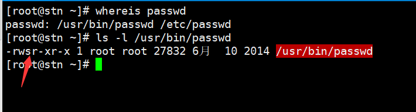
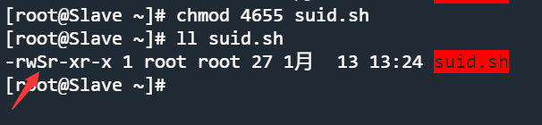

<font color=red>Усі приклади в цьому документі використовують дії root, а дії звичайних користувачів коментуються окремо. У блоці коду markdown опис команди буде позначено знаком # у попередньому рядку.</font>

# Перегляд основних дозволів

Добре відомо, що основні дозволи GNU/Linux можна переглянути за допомогою `ls -l`:

```bash
Shell > ls -l 
-  rwx  r-x  r-x  1  root  root    1358  Dec 31 14:50  anaconda-ks.cfg
↓   ↓    ↓    ↓   ↓   ↓     ↓       ↓        ↓            ↓
1   2    3    4   5   6     7       8        9            10
```

Їх значення наступні:

| Частина | Опис                                                                                                                                                                                 |
| ------- | ------------------------------------------------------------------------------------------------------------------------------------------------------------------------------------ |
| 1       | Тип файлу. `-` вказує, що це звичайний файл. Пізніше буде представлено сім типів файлів.                                                                                             |
| 2       | Дозволи користувача-власника, значення rwx відповідно означає: читання, запис, виконання.                                                                                            |
| 3       | Дозволи групи власників.                                                                                                                                                             |
| 4       | Дозволи інших користувачів.                                                                                                                                                          |
| 5       | Кількість підкаталогів (`.` і `..` включно). Для файлу він представляє кількість жорстких посилань, а 1 представляє себе.                                                            |
| 6       | Ім'я користувача власника.                                                                                                                                                           |
| 7       | Назва групи власників.                                                                                                                                                               |
| 8       | Для файлів показує розмір файлу. Для каталогів він показує фіксоване значення 4096 байт, зайняте іменуванням файлу. Щоб обчислити загальний розмір каталогу, використовуйте `du -sh` |
| 9       | Дата останньої зміни.                                                                                                                                                                |
| 10      | Ім'я файлу (або каталогу).                                                                                                                                                           |

## Сім типів файлів

| Типи файлів | Опис                                                                                                                                                                                                           |
|:-----------:| -------------------------------------------------------------------------------------------------------------------------------------------------------------------------------------------------------------- |
|    **-**    | Представляє звичайний файл. Включаючи звичайні текстові файли (ASCII); двійкові файли (бінарні); файли формату даних (data); різні стислі файли.                                                               |
|    **d**    | Представляє файл каталогу. За замовчуванням є один у кожному каталозі `.` та `..`.                                                                                                                             |
|    **b**    | Файл блоку пристрою. Включаючи всілякі жорсткі диски, USB-накопичувачі тощо.                                                                                                                                   |
|    **c**    | Файл символьного пристрою. Пристрій інтерфейсу послідовного порту, наприклад миша, клавіатура тощо.                                                                                                            |
|    **s**    | Файл сокета. Це файл, який спеціально використовується для мережевого зв’язку.                                                                                                                                 |
|    **p**    | Pipe файл. Це особливий тип файлу, основна мета якого – усунути помилки, спричинені одночасним доступом кількох програм до файлу. FIFO - це абревіатура "перший прийшов - перший вийшов" (first-in-first-out). |
|    **l**    | Файли програмних посилань, також звані файлами символічних посилань, подібні до ярликів у Windows. Файл жорсткого посилання, також відомий як файл фізичного посилання.                                        |

## Значення основних дозволів

Для файлу:

| Цифрове представлення | Дозволи      | Опис                                                                                                                                     |
|:---------------------:| ------------ | ---------------------------------------------------------------------------------------------------------------------------------------- |
|           4           | r (читання)  | Вказує на те, що ви можете прочитати цей файл. Ви можете використовувати такі команди, як `cat`, `head`, `more`, `less`, `tail`, і т. д. |
|           2           | w (написати) | Вказує на те, що файл можна змінити. Можна використовувати такі команди, як `vim`.                                                       |
|           1           | x (виконати) | Дозволи для виконуваних файлів (наприклад, сценаріїв або двійкових файлів).                                                              |

Для каталогу:

| Цифрове представлення | Дозволи      | Опис                                                                                                                                |
|:---------------------:| ------------ | ----------------------------------------------------------------------------------------------------------------------------------- |
|           4           | r (читання)  | Вказує, що вміст каталогу можна перерахувати, наприклад `ls -l`.                                                                    |
|           2           | w (написати) | Вказує, що ви можете створювати, видаляти та перейменовувати файли в цьому каталозі, наприклад команди `mkdir`, `touch`, `rm` тощо. |
|           1           | x (виконати) | Вказує на те, що ви можете увійти до каталогу, наприклад командою `cd`.                                                             |

!!! примітка

    Для каталогів дозволи **r** і **x** зазвичай з’являються одночасно.

## Спеціальний орган (Special Authority)

У GNU/Linux, окрім базових дозволів, згаданих вище, є також деякі спеціальні дозволи, які ми представимо один за одним.

### Дозволи ACL

Що таке ACL? ACL (список контролю доступу), мета полягає в тому, щоб вирішити проблему, через яку три ідентифікатори в Linux не можуть задовольнити потреби розподілу дозволів на ресурси.

Наприклад, учитель дає уроки учням, а вчитель створює каталог у кореневому каталозі ОС. Наприклад, учитель дає уроки учням, а вчитель створює каталог у кореневому каталозі Ос. На даний момент дозволи для каталогу становлять 770. Одного разу учень з іншої школи прийшов послухати вчителя, як мають бути призначені дозволи? Якщо ви додасте цього студента до **групи власників**, він матиме ті самі дозволи, що й студенти цього класу - **rwx**. Якщо студента поміщено до **інших користувачів**, він не матиме жодних дозволів. Наразі розподіл базових дозволів не відповідає вимогам, і вам потрібно використовувати ACL.

Подібна функція є і в операційній системі Windows. Наприклад, щоб призначити користувачеві права доступу до файлу, для каталогу/файлу, визначеного користувачем, **клацніть правою кнопкою миші** ---> **Властивості** ---> **Безпека** ---> **Редагувати** ---> **Додати** ---> **Додатково** ---> **Знайти зараз**, знайти відповідного користувача/групу ---> призначити певні дозволи ---> **застосувати** та завершити.

<!--Screenshots of the English interface are required-->

Те саме стосується GNU/Linux: додайте вказаного користувача/групу до файлу/каталогу та надайте відповідні дозволи для завершення призначення дозволу ACL.

Як увімкнути ACL? Потрібно знайти назву файлу пристрою, на якому розташована точка монтування, і номер його розділу. Наприклад, на моїй машині ви можете зробити щось подібне:

```bash
Shell > df -hT
Filesystem     Type      Size  Used  Avail Use% Mounted on
devtmpfs       devtmpfs  3.8G     0  3.8G    0% /dev
tmpfs          tmpfs     3.8G     0  3.8G    0% /dev/shm
tmpfs          tmpfs     3.8G  8.9M  3.8G    1% /run
tmpfs          tmpfs     3.8G     0  3.8G    0% /sys/fs/cgroup
/dev/nvme0n1p2 ext4       47G   11G   35G   24% /
/dev/nvme0n1p1 xfs      1014M  187M  828M   19% /boot
tmpfs          tmpfs     774M     0  774M    0% /run/user/0

Shell > dumpe2fs /dev/nvme0n1p2 | head -n 10
dumpe2fs 1.45.6 (20-Mar-2020)
Filesystem volume name:   <none>
Last mounted on:          /
Filesystem UUID:          c8e6206d-2892-4c22-a10b-b87d2447a885
Filesystem magic number:  0xEF53
Filesystem revision #:    1 (dynamic)
Filesystem features:      has_journal ext_attr resize_inode dir_index filetype needs_recovery extent 64bit flex_bg sparse_super large_file huge_file dir_nlink extra_isize metadata_csum
Filesystem flags:         signed_directory_hash 
Default mount options:    user_xattr acl
Filesystem state:         clean
Errors behavior:          Continue
```

Коли ви бачите рядок **"Default mount options: user_xattr acl""**, це означає, що ACL увімкнено. Якщо його не ввімкнено, ви також можете ввімкнути його тимчасово -- `mount -o remount,acl /`. Його також можна ввімкнути постійно:

```bash
Shell > vim /etc/fstab
UUID=c8e6206d-2892-4c22-a10b-b87d2447a885  /   ext4    defaults,acl        1 1

Shell > mount -o remount /
# or
Shell > reboot
```

#### Перегляд і налаштування ACL

Щоб переглянути ACL, потрібно використати команду `getfacle` -- `getfacle FILE_NAME`

Якщо ви хочете встановити дозволи ACL, вам потрібно скористатися командою `setfacl`.

```bash
Shell > setfacl <option> <FILE_NAME>
```

| Опція | Опис                                            |
| ----- | ----------------------------------------------- |
| -m    | змінити поточний ACL файлу(ів)                  |
| -x    | видалити записи з ACL файлу(ів)                 |
| -b    | видалити всі розширені записи ACL               |
| -d    | операції застосовуються до ACL за замовчуванням |
| -k    | видалити ACL за замовчуванням                   |
| -R    | повертатися до підкаталогів                     |

Використовуйте приклад вчителя, згаданий на початку статті, щоб проілюструвати використання ACL.

```bash
# The teacher is the root user
Shell > groupadd class1
Shell > mkdir /project
Shell > chown root:class1 /project
Shell > chmod 770 /project
Shell > ls -ld /project/
drwxrwx--- 2 root class1 4096 Jan  12 12:58 /project/

# Put the students in the class into the class1 group
Shell > useradd frank
Shell > passwd frank
Shell > useradd aron
Shell > passwd aron
Shell > gpasswd -a frank class1
Shell > gpasswd -a aron class1

# A student from another school came to listen to the teacher
Shell > useradd tom
Shell > passwd tom
# If it is a group, "u" here should be replaced by "g"
Shell > setfacle -m u:tom:rx  /project

# "+" sign is added in the output message
Shell > ls -ld /project/
drwxrwx---+ 2 root class1 4096 Jan  12 12:58 /project/

Shell > getfacl -p /project/
# file: /project/
# owner: root
# group: class1
user::rwx
user:tom:r-x
group::rwx
mask::rwx
other::---
```

#### Максимально дійсні дозволи ACL

Під час використання команди `getfacl`, що означає "mask:: rwx" у вихідному повідомленні? **mask** використовується для визначення максимально допустимих дозволів. Дозволи, надані користувачеві, не є справжніми дозволами, справжні дозволи можна отримати, лише використовуючи «логічне та» дозволів користувача та дозволів маски.

!!! примітка

    «Логічне і» означає: що якщо все вірно, результат вірний; якщо є одна помилка, результат є помилкою.
    
    | Permissions set by users | Mask permissions | Result |
    |:---:|:---:|:---:|
    | r | r | r |
    | r | - | - |
    | - | r | - |
    | - | - | - |

!!! примітка

    Оскільки типовою маскою є rwx, для дозволів ACL будь-якого користувача результатом є їхні власні дозволи.

Ви також можете налаштувати дозволи маски:

```bash
Shell > setfacl -m u:tom:rwx /project
Shell > setfacl -m m:rx /project

Shell > getfacl  -p /project/
# file: project/
# owner: root
# group: class1
user::rwx
user:tom:rwx                    #effective:r-x
group::rwx                      #effective:r-x
mask::r-x
other::---
```

#### Видалити дозвіл ACL

```bash
# Delete the ACL permissions of user/group in the specified directory
Shell > setfacl -x u:USER_NAME FILE_NAME
Shell > setfacl -x g:GROUP_NAME FILE_NAME

# Removes all ACL permissions for the specified directory
Shell > setfacl -b FILE_NAME
```

#### Дозволи за замовчування та рекурсія ACL дозволів

Що таке рекурсія дозволів ACL? Для дозволів ACL це означає, що коли батьківський каталог встановлює дозволи ACL, усі підкаталоги та підфайли матимуть однакові дозволи ACL.

!!! примітка

    Рекурсія застосовується до файлів/каталогів, які вже існують.

Розглянемо наступний приклад:

```bash
Shell > setfacl -m m:rwx /project
Shell > setfacl -m u:tom:rx /project

Shell > cd /project
Shell > touch file1 file2
# Because there is no recursion, the file here does not have ACL permission. 
Shell > ls -l
-rw-r--r-- 1 root root 0 Jan  12 14:35 file1
-rw-r--r-- 1 root root 0 Jan  12 14:35 file2

Shell > setfacl -m u:tom:rx -R /project
Shell > ls -l /project
-rw-r-xr--+ 1 root root 0 Jan  12 14:35 file1
-rw-r-xr--+ 1 root root 0 Jan  12 14:35 file2
```

Тепер виникає запитання: якщо я створю новий файл у цьому каталозі, чи матиме він дозвіл ACL? Відповідь – ні, тому що новостворений файл з’являється після виконання команди `setfacl-m u:tom:rx -R /project`.

```bash
Shell > touch /project/file3
Shell > ls -l /project/file3
-rw-r--r-- 1 root root 0 Jan  12 14:52 /project/file3
```

Якщо ви хочете, щоб новостворений каталог/файл також мав дозволи ACL, вам потрібно використовувати дозволи ACL за замовчуванням.

```bash
Shell > setfacl -m d:u:tom:rx  /project
Shell > cd /project && touch file4 && ls -l 
-rw-r-xr--+ 1 root root 0 Jan  12 14:35 file1
-rw-r-xr--+ 1 root root 0 Jan  12 14:35 file2
-rw-r--r--  1 root root 0 Jan  12 14:52 file3
-rw-rw----+ 1 root root 0 Jan  12 14:59 file4

Shell > getfacl -p /project
# file: /project
# owner: root
# group: class1
user::rwx
user:tom:r-x
group::rwx
mask::rwx
other::---
default:user::rwx
default:user:tom:r-x
default:group::rwx
default:mask::rwx
default:other::---
```

### SetUID

Роль "SetUID":

* Лише виконувані двійкові файли можуть установлювати дозволи SUID.
* Виконавець команди повинен мати дозвіл x на програму.
* Виконавець команди отримує інформацію про власника програмного файлу під час виконання програми.
* Зміна ідентичності дійсна лише під час виконання, і після завершення бінарної програми ідентифікація виконавця відновлюється до початкової ідентифікації.

Чому GNU/Linux потрібні такі дивні дозволи? Візьмемо для прикладу найпоширенішу команду `passwd`:



Як бачите, звичайні користувачі мають лише r та x, але x власника стає s, доводячи, що команда `passwd` має дозволи SUID.

Добре відомо, що звичайні користувачі (uid >= 1000) можуть змінити свій пароль. Справжній пароль зберігається у файлі **/etc/shadow**, але дозвіл тіньового файлу становить 000, і звичайні користувачі не мають жодних дозволів.

```bash
Shell > ls -l /etc/shadow
---------- 1 root root 874 Jan  12 13:42 /etc/shadow
```

Оскільки звичайні користувачі можуть змінити свій пароль, вони мають записати пароль у файл **/etc/shadow**. Коли звичайний користувач виконує команду `passwd`, він тимчасово змінює власника файлу -- **root**. Для файлу **shadow** **root** не може бути обмежено дозволами. Ось чому команда `passwd` потребує дозволу SUID.

Як згадувалося раніше, базові дозволи можуть бути представлені числами, наприклад 755, 644 і так далі. SUID представлено **4**. Для виконуваних двійкових файлів ви можете встановити такі дозволи -- **4755**.

```bash
# Set SUID permissions
Shell > chmod 4755 FILE_NAME
# or
Shell > chmod u+s FILE_NAME

# Remove SUID permission
Shell > chmod 755 FILE_NAME
# or
Shell > chmod u-s FILE_NAME
```

!!! важливо

    Якщо власник виконуваного двійкового файлу/програми не має **x**, використання великої літери **S** означає, що файл не може використовувати дозволи SUID.


    ```bash
    # Suppose this is an executable binary file
    Shell > vim suid.sh
    #!/bin/bash
    cd /etc && ls

    Shell > chmod 4644 suid.sh
    ```


    

!!! важливо

    Оскільки SUID може тимчасово змінити звичайних користувачів на root, вам потрібно бути особливо обережними з файлами з цим дозволом під час обслуговування сервера. Ви можете знайти файли з дозволами SUID за допомогою такої команди:

    ```bash
    Shell > find / -perm -4000 -a -type f -exec ls -l  {} \;
    ```

### SetGID

Роль "SetGID":

* Лише виконувані двійкові файли можуть установлювати дозволи SGID.
* Виконавець команди повинен мати дозвіл x на програму.
* Виконавець команди отримує ідентичність групи власників програмного файлу під час виконання програми.
* Зміна ідентичності дійсна лише під час виконання, і після завершення бінарної програми ідентифікація виконавця відновлюється до початкової ідентифікації.

Візьмемо, наприклад, команду `locate`:

```
Shell > rpm -ql mlocate
/usr/bin/locate
...
/var/lib/mlocate/mlocate.db

Shell > ls -l /var/lib/mlocate/mlocate.db
-rw-r----- 1 root slocate 4151779 1月  14 11:43 /var/lib/mlocate/mlocate.db

Shell > ll /usr/bin/locate 
-rwx--s--x. 1 root slocate 42248 4月  12 2021 /usr/bin/locate
```

Команда `locate` використовує файл бази даних **mlocate.db** для швидкого пошуку файлів.

Оскільки команда `locate` має дозвіл SGID, коли виконавець (звичайні користувачі) виконує команду `locate`, група власників перемикається на **slocate**. `slocate` має дозвіл r для файлу **/var/lib/mlocate/mlocate.db**.

SGID позначається числом **2**, тому команда `locate` має дозвіл 2711.

```bash
# Set SGID permissions
Shell > chmod 2711 FILE_NAME
# or
Shell > chmod g+s FILE_NAME

# Remove SGID permission
Shell > chmod 711 FILE_NAME
# or
Shell > chmod g-s FILE_NAME
```

!!! важливо

    Якщо група власників виконуваного двійкового файлу/програми не має **x**, використовуйте **S** у верхньому регістрі, щоб вказати, що дозволи SGID файлу не можна використовувати належним чином.

    ```bash
    # Suppose this is an executable binary file
    Shell > touch sgid

    Shell > chmod 2741 sgid
    Shell > ls -l sgid
    -rwxr-S--x  1 root root         0 Jan  14 12:11 sgid
    ```

SGID можна використовувати не лише для виконуваного бінарного файлу/програми, але й для каталогів, але він використовується рідко.

* Звичайні користувачі повинні мати права доступу rwx до каталогу.
* Для файлів, створених звичайними користувачами в цьому каталозі, групою власників за замовчуванням є група власників каталогу.

Наприклад:

```bash
Shell > mkdir /SGID_dir
Shell > chmod 2777 /SGID_dir
Shell > ls -ld /SGID_dir
drwxrwsrwx  2 root root      4096 Jan 14 12:17 SGID_dir

Shell > su - tom
Shell(tom) > cd /SGID_dir && touch tom_file && ls -l
-rw-rw-r-- 1 tom root 0 Jan  14 12:26 tom_file
```

!!! важливо

    Оскільки SGID може тимчасово змінити групу власників звичайних користувачів на root, вам потрібно приділяти особливу увагу файлам із цим дозволом під час обслуговування сервера. Ви можете знайти файли з дозволами SGID за допомогою такої команди:

    ```bash
    Shell > find / -perm -2000 -a -type f -exec ls -l  {} \;
    ```

### Sticky BIT

Роль "Sticky BIT":

* Дійсний лише для каталогу.
* Звичайні користувачі мають дозволи w і x на цей каталог.
* Якщо Sticky Bit відсутній, звичайні користувачі з дозволом w можуть видалити всі файли в цьому каталозі (включаючи файли, створені іншими користувачами). Після того, як каталозі буде надано дозвіл SBIT, лише користувач root може видалити всі файли. Навіть якщо звичайні користувачі мають дозвіл w, вони можуть видаляти лише файли, створені власноруч (файли, створені іншими користувачами, не можуть бути видалені).

SBIT представлено числом **1**.

Чи може файл/каталог мати дозвіл **7755**? Ні, вони спрямовані на різні об'єкти. SUID призначений для виконуваних двійкових файлів; SGID використовується для виконуваних двійкових файлів і каталогів; SBIT призначений лише для каталогів. Тобто вам потрібно встановити ці спеціальні дозволи відповідно до різних об’єктів.

Каталог **/tmp** має дозвіл SBIT. Приклад:

```bash
# The permissions of the /tmp directory are 1777
Shell > ls -ld /tmp
drwxrwxrwt. 8 root root 4096 Jan  14 12:50 /tmp

Shell > su - tom 
Shell > cd /tmp && touch tom_file1 
Shell > exit

Shell > su - jack 
Shell(jack) > cd /tmp && rm -rf tom_file1
rm: cannot remove 'tom_file1': Operation not permitted
Shell(jack) > exit

# The file has been deleted
Shell > su - tom 
Shell(tom) > rm -rf /tmp/tom_file1
```

!!! примітка

    користувачі root (uid=0) не обмежені дозволами SUID, SGID і SBIT.

### chattr

Функція дозволу chattr: використовується для захисту важливих файлів або каталогів у системі від видалення внаслідок неправильної роботи.

Використання команди `chattr` -- `chattr [ -RVf ] [ -v version ] [ -p project ] [ mode ] files...`

Формат символьного режиму: +-=[aAcCdDeFijPsStTu].

* «+» означає збільшення дозволів;
* «-» означає зменшення дозволів;
* "=" означає дорівнює дозволу.

Дозволи, які найчастіше використовуються (також називаються атрибутами), це **a** та **i**.

#### Опис атрибута i:

|         |                Видалення                 |          Модифікація           |     Додавання вмісту файлу     |            Перегляд            | Створення файлу |
|:-------:|:----------------------------------------:|:------------------------------:|:------------------------------:|:------------------------------:|:---------------:|
|  файл   |                    ×                     |               ×                |               ×                |               √                |        -        |
| каталог | x <br>(Каталог і файли в каталозі) | √ <br>(Файли в каталозі) | √ <br>(Файли в каталозі) | √ <br>(Файли в каталозі) |        x        |

Приклади для файлу:

```bash
Shell > touch /tmp/filei
Shell > vim /tmp/filei
123

Shell > chattr +i /tmp/filei
Shell > lsattr -a /tmp/filei
----i---------e----- /tmp/filei

Shell > rm -rf /tmp/filei
rm: cannot remove '/tmp/filei': Operation not permitted

# Cannot be modified freely
Shell > vim /tmp/file1

Shell > echo "adcd" >> /tmp/filei 
-bash: /tmp/filei: Operation not permitted

Shell > cat /tmp/filei
123
```

Приклади для каталогу:

```bash
Shell > mkdir /tmp/diri
Shell > cd /tmp/diri && echo "qwer" > f1

Shell > chattr +i /tmp/diri
Shell > lsattr -ad /tmp/diri
----i---------e----- /tmp/diri

Shell > rm -rf /tmp/diri
rm: cannot remove '/tmp/diri/f1': Operation not permitted

# Allow modification
Shell > vim /tmp/diri/f1
qwer-tom

Shell > echo "jim" >> /tmp/diri/f1
Shell > cat /tmp/diri/f1
qwer-tom
jim

Shell > touch /tmp/diri/file2
touch: settng time of '/tmp/diri/file2': No such file or directory
```

Видалення атрибута i з наведеного вище прикладу:

```bash
Shell > chattr -i /tmp/filei /tmp/diri
```

#### Опис атрибута a:

|         |                Видалення                 |          Модифікація           |     Додавання вмісту файлу     |            Перегляд            | Створення файлу |
|:-------:|:----------------------------------------:|:------------------------------:|:------------------------------:|:------------------------------:|:---------------:|
|  файл   |                    ×                     |               ×                |               √                |               √                |        -        |
| каталог | x <br>(Каталог і файли в каталозі) | √ <br>(Файли в каталозі) | √ <br>(Файли в каталозі) | √ <br>(Файли в каталозі) |        √        |

Приклади для файлу:

```bash
Shell > touch /etc/tmpfile1
Shell > echo "zxcv" > /etc/tmpfile1

Shell > chattr +a /etc/tmpfile1
Shell > lsattr -a /etc/tmpfile1
-----a--------e----- /etc/tmpfile1

Shell > rm -rf /etc/tmpfile1
rm: cannot remove '/etc/tmpfile1': Operation not permitted

# Cannot be modified freely
Shell > vim /etc/tmpfile1

Shell > echo "new line" >> /etc/tmpfile1
Shell > cat /etc/tmpfile1
zxcv
new line
```

Приклади для каталогу:

```bash
Shell > mkdir /etc/dira
Shell > cd /etc/dira && echo "asdf" > afile

Shell > chattr +a /etc/dira
Shell > lsattr -a /etc/dira
-----a--------e----- /etc/dira/

Shell > rm -rf /etc/dira
rm: cannot remove '/etc/dira/afile': Operation not permitted

# Allow modification
Shell > vim /etc/dira/afile
asdf-bcd

Shell > echo "new line" >> /etc/dira/afile
Shell > cat /etc/dira/afile
asdf-bcd
new line

# Allow creation of new files
Shell > touch /etc/dira/newfile
```

Видалення атрибута a з наведеного вище прикладу:

```bash
Shell > chattr -a /etc/tmpfile1 /etc/dira/
```

!!! питання

    Що станеться, якщо я встановлю атрибут ai для файлу? 
    Ви не можете нічого робити з файлом, окрім перегляду.
    
    Що з довідником?
    Дозволено: вільне модифікування, додавання вмісту файлу та перегляд.
    Заборонено: видаляти та створювати файли.

### sudo

Роль «sudo»:

* Через користувача root призначаються команди, які може виконувати лише користувач root (uid=0), для виконання звичайним користувачам.
* Об’єктом операції «sudo» є системна команда.

Ми знаємо, що лише адміністратор root має дозвіл на використання команд **/sbin/** і **/usr/sbin/** у каталозі GNU/Linux. Загалом, компанія має команду, яка обслуговує набір серверів. Цей набір серверів може стосуватися однієї комп’ютерної кімнати в одному географічному місці або може посилатися на комп’ютерну кімнату в кількох географічних місцях. Керівник групи використовує дозволи користувача root, а інші члени команди можуть мати дозволи лише звичайного користувача. Оскільки у відповідальної особи багато роботи, немає часу підтримувати щоденну роботу сервера, більшу частину роботи мають підтримувати звичайні користувачі. Однак звичайні користувачі мають багато обмежень на використання команд, і на цьому етапі вам потрібно використовувати дозволи sudo.

Щоб надати дозволи звичайним користувачам, **ви повинні використовувати користувача root (uid=0)**.

Ви можете розширити повноваження звичайних користувачів за допомогою команди `visudo`, фактично ви змінюєте файл **/etc/sudoers**.

```bash
Shell > visudo
...
88 Defaults    secure_path = /sbin:/bin:/usr/sbin:/usr/bin
89 
90 ## Next comes the main part: which users can run what software on
91 ## which machines (the sudoers file can be shared between multiple
92 ## systems).
93 ## Syntax:
94 ##
95 ##      user    MACHINE=COMMANDS
96 ##
97 ## The COMMANDS section may have other options added to it.
98 ##
99 ## Allow root to run any commands anywhere
100 root    ALL=(ALL)       ALL
     ↓       ↓    ↓          ↓
     1       2    3          4...
```

| Частина | Опис                                                                                                                                                                           |
|:-------:| ------------------------------------------------------------------------------------------------------------------------------------------------------------------------------ |
|    1    | Ім’я користувача або ім’я групи власників. Посилається на те, якому користувачу/групі надано дозволи. Якщо це група власників, вам потрібно написати «%», наприклад **%root**. |
|    2    | Яким машинам дозволено виконувати команди. Це може бути одна IP-адреса, сегмент мережі або ВСІ.                                                                                |
|    3    | Вказує на які ідентичності можна трансформувати.                                                                                                                               |
|    4    | Авторизована команда, яка має бути представлена абсолютним шляхом.                                                                                                             |

Наприклад:

```bash
Shell > visudo
...
101 tom  ALL=/sbin/shutdown  -r now 
...

# Ви можете використовувати опцію "-c", щоб перевірити наявність помилок у написанні /etc/sudoers.
Shell > visudo -c

Shell > su - tom
# View the available sudo commands.
Shell(tom) > sudo -l

# Щоб використовувати доступну команду sudo, звичайним користувачам потрібно додати sudo перед командою.
Shell(tom) > sudo /sbin/shutdown -r now
```

Якщо ваша команда авторизації `/sbin/shutdown`, це означає, що авторизовані користувачі можуть використовувати будь-які параметри команди.

!!! важливо

    Оскільки sudo — це операція "надважної дії", вам потрібно бути обережними, маючи справу з файлами **/etc/sudoers**!
