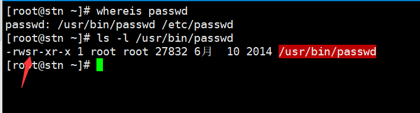
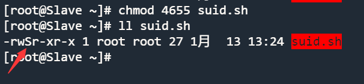

<font color=red>本文档中的所有示例都使用 root 用户进行操作，普通用户操作会单独注释。 在 markdown 代码块中，命令描述将在前一行用 # 表示。</font>

# 查看基本权限

众所周知，GNU/Linux 的基本权限可以使用 `ls -l` 查看：

```bash
Shell > ls -l 
-  rwx  r-x  r-x  1  root  root    1358  Dec 31 14:50  anaconda-ks.cfg
↓   ↓    ↓    ↓   ↓   ↓     ↓       ↓        ↓            ↓
1   2    3    4   5   6     7       8        9            10
```

其含义如下：

| 部分 | 描述                                                                 |
| -- | ------------------------------------------------------------------ |
| 1  | 文件类型。 `-` 表示这是一个普通文件。 稍后将介绍七种文件类型。                                 |
| 2  | 所有者用户的权限，rwx 的含义分别是：读、写、执行。                                        |
| 3  | 所属组的权限。                                                            |
| 4  | 其他用户的权限。                                                           |
| 5  | 子目录数（包括 `.` 和 `..`）。 对于一个文件，它表示硬链接的数量，1 表示文件本身。                    |
| 6  | 所有者用户名称。                                                           |
| 7  | 所属组名称。                                                             |
| 8  | 对于文件，它显示文件的大小。 对于目录，它显示了文件命名占用的固定值 4096 字节。 要计算目录的总大小，请使用 `du -sh` |
| 9  | 最后修改日期。                                                            |
| 10 | 文件（或目录）的名称。                                                        |

## 七种文件类型

| 文件类型  | 描述                                                                          |
|:-----:| --------------------------------------------------------------------------- |
| **-** | 表示一个普通文件。 包括纯文本文件（ASCII）；二进制文件（binary）；数据格式文件（data）；各种压缩文件。                 |
| **d** | 表示一个目录文件。 默认情况下，每个目录中都会有一个 `.` 和 `..`。                                      |
| **b** | 块设备文件。 包括各种硬盘、USB 驱动器等。                                                     |
| **c** | 字符设备文件。 串口接口设备，如鼠标、键盘等。                                                     |
| **s** | 套接字文件。 它是一个专门用于网络通信的文件。                                                     |
| **p** | 管道文件。 它是一种特殊的文件类型，主要目的是解决多个程序同时访问一个文件所引起的错误。 FIFO 是 first-in-first-out 的缩写。 |
| **l** | 软链接文件，也称为符号链接文件，类似于 Windows 中的快捷方式。 硬链接文件，也称为物理链接文件。                        |

## 基本权限的含义

对于文件：

| 数字表示 | 权限           | 描述                                                         |
|:----:| ------------ | ---------------------------------------------------------- |
|  4   | r(read)      | 表示您可以读取此文件。 您可以使用诸如 `cat`、`head`、`more`、`less`、`tail` 等命令。 |
|  2   | w(write)     | 表示文件可以修改。 可以使用 `vim` 等命令。                                  |
|  1   | x(execution) | 可执行文件（如脚本或二进制文件）的权限。                                       |

对于目录：

| 数字表示 | 权限         | 描述                                                 |
|:----:| ---------- | -------------------------------------------------- |
|  4   | r(read)    | 表示可以列出目录的内容，例如 `ls -l` 。                           |
|  2   | w(write)   | 表示您可以在此目录中创建、删除和重命名文件，例如命令 `mkdir`、`touch`、`rm` 等。 |
|  1   | x(execute) | 表示您可以进入到目录，例如命令 `cd`。                              |

!!! info "信息"

    对于目录而言，**r** 和 **x** 权限通常会同时出现。

## 特殊权限

在 GNU/Linux 中，除了上述基本权限外，还有一些特殊权限，我们将逐一介绍。

### ACL 权限

**Q：什么是 ACL？**

ACL（Access Control List，访问控制列表），其目的是解决 Linux 下三种身份无法满足资源权限分配需求的问题。

例如，老师给学生们上课，而老师会在操作系统的根目录下创建一个目录。 只有这个班的学生可以上传和下载，其他人不允许。 此时，目录的权限为770。 有一天，一位来自另一所学校的学生来听这位老师的讲课，应该如何分配权限？ 如果您将此学生放入到 **所属组** 中，他将拥有与此班学生相同的权限 - **rwx**。 若将学生放入到 **其他用户** 中，他将没有任何权限。 此时，基本权限分配无法满足要求，需要使用 ACL。

Windows 操作系统中也有类似的功能。 例如，要为用户分配文件的权限，对于用户定义的目录/文件，**右键单击** ---> **属性** ---> **安全** ---> **编辑** ---> **添加** ---> **高级** ---> **立刻查找**，查找相应的用户/组 ---> 分配特定权限 ---> **应用** 并完成。

<!--Screenshots of the English interface are required-->

GNU/Linux 也是如此：将指定的用户/组添加到文件/目录中，并授予适当的权限以完成 ACL 权限分配。

**Q：如何启用 ACL？**

您需要找到挂载点所在设备的文件名及其分区号。 例如，在我的机器上，你可以这样做：

```bash
Shell > df -hT
Filesystem     Type      Size  Used  Avail Use% Mounted on
devtmpfs       devtmpfs  3.8G     0  3.8G    0% /dev
tmpfs          tmpfs     3.8G     0  3.8G    0% /dev/shm
tmpfs          tmpfs     3.8G  8.9M  3.8G    1% /run
tmpfs          tmpfs     3.8G     0  3.8G    0% /sys/fs/cgroup
/dev/nvme0n1p2 ext4       47G   11G   35G   24% /
/dev/nvme0n1p1 xfs      1014M  187M  828M   19% /boot
tmpfs          tmpfs     774M     0  774M    0% /run/user/0

Shell > dumpe2fs /dev/nvme0n1p2 | head -n 10
dumpe2fs 1.45.6 (20-Mar-2020)
Filesystem volume name:   <none>
Last mounted on:          /
Filesystem UUID:          c8e6206d-2892-4c22-a10b-b87d2447a885
Filesystem magic number:  0xEF53
Filesystem revision #:    1 (dynamic)
Filesystem features:      has_journal ext_attr resize_inode dir_index filetype needs_recovery extent 64bit flex_bg sparse_super large_file huge_file dir_nlink extra_isize metadata_csum
Filesystem flags:         signed_directory_hash 
Default mount options:    user_xattr acl
Filesystem state:         clean
Errors behavior:          Continue
```

当您看到行 **"Default mount options: user_xattr acl"**, 时，表示 ACL 已启用。 若未启用，您也可以临时启用它 -- `mount -o remount,acl  /`。 它也可以永久被启用：

```bash
Shell > vim /etc/fstab
UUID=c8e6206d-2892-4c22-a10b-b87d2447a885  /   ext4    defaults,acl        1 1

Shell > mount -o remount /
# 或者
Shell > reboot
```

#### 查看和设置 ACL

要查看 ACL，您需要使用 `getfacle` 命令 -- `getfacle FILE_NAME`

如果你想设置 ACL 权限，你需要使用 `setfacl` 命令。

```bash
Shell > setfacl <option> <FILE_NAME>
```

| 选项 | 描述             |
| -- | -------------- |
| -m | 修改文件的当前 ACL    |
| -x | 从文件的 ACL 中删除条目 |
| -b | 删除所有扩展 ACL 条目  |
| -d | 操作应用于默认 ACL    |
| -k | 移除默认 ACL       |
| -R | 递归进入子目录        |

以本文开头所提及的老师的例子为例，来说明 ACL 的使用方法。

```bash
# 老师是根用户
Shell > groupadd class1
Shell > mkdir /project
Shell > chown root:class1 /project
Shell > chmod 770 /project
Shell > ls -ld /project/
drwxrwx--- 2 root class1 4096 Jan  12 12:58 /project/

# 把班上的学生分配到 class1 组中
Shell > useradd frank
Shell > passwd frank
Shell > useradd aron
Shell > passwd aron
Shell > gpasswd -a frank class1
Shell > gpasswd -a aron class1

# 一个来自另一所学校的学生来听老师讲课
Shell > useradd tom
Shell > passwd tom
# 如果是一个组，这里的 "u" 应该替换为 "g"
Shell > setfacle -m u:tom:rx  /project

# 输出消息中添加了 "+" 符号
Shell > ls -ld /project/
drwxrwx---+ 2 root class1 4096 Jan  12 12:58 /project/

Shell > getfacl -p /project/
# file: /project/
# owner: root
# group: class1
user::rwx
user:tom:r-x
group::rwx
mask::rwx
other::---
```

#### ACL 的最大有效权限

**Q： 当使用 `getfacl` 命令时，输出消息中的 "mask:: rwx" 是什么意思？**

**mask** 用于指定最大有效权限。 授予用户的权限并非真正的权限，真正的权限只能通过将用户的权限与掩码权限进行 "逻辑与" 运算来获得。

!!! info "信息"

    "逻辑与" 含义：如果都为真，则结果为真；若有一个假，则结果为假。
    
    | 用户设置的权限 | Mask 权限 | 结果 |
    |:---:|:---:|:---:|
    | r | r | r |
    | r | - | - |
    | - | r | - |
    | - | - | - |

!!! info "信息"

    因为默认 mask 是 rwx，所以对于任何用户的 ACL 权限，结果都是用户自身的权限。

您还可以调整 mask 权限：

```bash
Shell > setfacl -m u:tom:rwx /project
Shell > setfacl -m m:rx /project

Shell > getfacl  -p /project/
# file: project/
# owner: root
# group: class1
user::rwx
user:tom:rwx                    #effective:r-x
group::rwx                      #effective:r-x
mask::r-x
other::---
```

#### 删除 ACL 权限

```bash
# 删除指定目录中用户/组的 ACL 权限
Shell > setfacl -x u:USER_NAME FILE_NAME
Shell > setfacl -x g:GROUP_NAME FILE_NAME

# 删除指定目录的所有 ACL 权限
Shell > setfacl -b FILE_NAME
```

#### ACL 权限的默认和递归

**Q：ACL权限的递归是什么？**

对于 ACL 权限，这意味着当父目录设置 ACL 权限时，所有子目录和子文件将具有相同的 ACL 权限。

!!! info "信息"

    递归适用于目录中已存在的文件/目录。

请看以下示例：

```bash
Shell > setfacl -m m:rwx /project
Shell > setfacl -m u:tom:rx /project

Shell > cd /project
Shell > touch file1 file2
# 因为没有递归，所以这里的文件没有 ACL 权限。 
Shell > ls -l
-rw-r--r-- 1 root root 0 Jan  12 14:35 file1
-rw-r--r-- 1 root root 0 Jan  12 14:35 file2

Shell > setfacl -m u:tom:rx -R /project
Shell > ls -l /project
-rw-r-xr--+ 1 root root 0 Jan  12 14:35 file1
-rw-r-xr--+ 1 root root 0 Jan  12 14:35 file2
```

**Q：如果我在此目录中创建一个新文件，它是否具有 ACL 权限？**

答案是否定的，因为新创建的文件是在执行命令 `setfacl-m u:tom:rx -R /project` 之后完成的。

```bash
Shell > touch /project/file3
Shell > ls -l /project/file3
-rw-r--r-- 1 root root 0 Jan  12 14:52 /project/file3
```

如果您希望新创建的目录/文件也具有 ACL 权限，则需要使用默认 ACL 权限。

```bash
Shell > setfacl -m d:u:tom:rx  /project
Shell > cd /project && touch file4 && ls -l 
-rw-r-xr--+ 1 root root 0 Jan  12 14:35 file1
-rw-r-xr--+ 1 root root 0 Jan  12 14:35 file2
-rw-r--r--  1 root root 0 Jan  12 14:52 file3
-rw-rw----+ 1 root root 0 Jan  12 14:59 file4

Shell > getfacl -p /project
# file: /project
# owner: root
# group: class1
user::rwx
user:tom:r-x
group::rwx
mask::rwx
other::---
default:user::rwx
default:user:tom:r-x
default:group::rwx
default:mask::rwx
default:other::---
```

!!! info "信息"

    使用 ACL 权限的默认和递归要求命令的操作对象是目录！ 如果操作对象是文件，将输出错误提示。

### SetUID

"SetUID" 的规则：

* 只有可执行二进制文件可以设置 SUID 权限。
* 命令的执行者应该对程序具有 x 权限。
* 命令的执行者在执行程序时获得程序文件所有者的身份。
* 身份变更仅在执行期间有效，一旦二进制程序完成，执行者的身份将恢复为原始身份。

**Q：为什么 GNU/Linux 需要如此奇怪的权限？**

以最常见的 `passwd` 命令为例：



如您所见，普通用户只有 r 和 x，但所有者的 x 变为 s，证明 `passwd` 命令具有 SUID 权限。

众所周知，普通用户（uid >= 1000）可以更改自己的密码。 真实密码存储在 **/etc/shadow** 文件中，但 shadows 文件的权限为 000，普通用户没有任何权限。

```bash
Shell > ls -l /etc/shadow
---------- 1 root root 874 Jan  12 13:42 /etc/shadow
```

由于普通用户可以更改密码，所以他们必须将密码写入到 **/etc/shadow** 文件中。 当普通用户执行 `passwd` 命令时，它将临时更改为文件的所有者 -- **root**。 对于 **shadow** 文件而言，**root** 不受权限限制。 这就是为什么 `passwd` 命令需要 SUID 权限。

如前所述，基本权限可以用数字表示，如 755、644 等。 SUID 用 **4** 进行表示。 对于可执行的二进制文件，您可以这样设置权限 -- **4755**。

```bash
# 设置 SUID 权限
Shell > chmod 4755 FILE_NAME
# 或者
Shell > chmod u+s FILE_NAME

# 移除 SUID 权限
Shell > chmod 755 FILE_NAME
# 或者
Shell > chmod u-s FILE_NAME
```

!!! warning

    当可执行二进制文件/程序的所有者没有 **x** 时，使用大写 **S** 意味着该文件不能使用 SUID 权限。


    ```bash
    # 假设这是一个可执行的二进制文件
    Shell > vim suid.sh
    #!/bin/bash
    cd /etc && ls

    Shell > chmod 4644 suid.sh
    ```


    

!!! warning

    因为 SUID 可以临时将普通用户更改为 root，所以在维护服务器时，您需要特别小心具有此权限的文件。 您可以使用以下命令查找具有 SUID 权限的文件：

    ```bash
    Shell > find / -perm -4000 -a -type f -exec ls -l  {} \;
    ```

### SetGID

"SetGID" 的规则：

* 只有可执行二进制文件可以设置 SGID 权限。
* 命令的执行者应该对程序具有 x 权限。
* 执行程序时命令的执行者获取程序文件所属组的身份。
* 身份变更仅在执行期间有效，一旦二进制程序完成，执行者的身份将恢复为原始身份。

以 `locate` 命令为例：

```bash
Shell > rpm -ql mlocate
/usr/bin/locate
...
/var/lib/mlocate/mlocate.db

Shell > ls -l /var/lib/mlocate/mlocate.db
-rw-r----- 1 root slocate 4151779 1月  14 11:43 /var/lib/mlocate/mlocate.db

Shell > ll /usr/bin/locate 
-rwx--s--x. 1 root slocate 42248 4月  12 2021 /usr/bin/locate
```

`locate` 命令使用 **mlocate.db** 数据库文件快速搜索文件。

由于 `locate` 命令具有 SGID 权限，当执行者（普通用户）执行 `locate` 命令时，所属组会切换为 **slocate**。 `slocate` 对 **/var/lib/mlocate/mlocate.db** 文件具有 r 权限。

SGID 的表示方式为数字 **2**，因此 `locate` 命令的权限为 2711。

```bash
# 设置 SGID 权限
Shell > chmod 2711 FILE_NAME
# 或者
Shell > chmod g+s FILE_NAME

# 移除 SGID 权限
Shell > chmod 711 FILE_NAME
# 或者
Shell > chmod g-s FILE_NAME
```

!!! warning

    当可执行二进制文件/程序的所属组没有 **x** 时，使用大写 **S** 表示无法正确使用该文件的 SGID 权限。

    ```bash
    # 假设这是一个可执行的二进制文件
    Shell > touch sgid

    Shell > chmod 2741 sgid
    Shell > ls -l sgid
    -rwxr-S--x  1 root root         0 Jan  14 12:11 sgid
    ```

SGID 不仅可以用于可执行二进制文件/程序，还可以用于目录，但很少使用。

* 普通用户必须对目录具有 rwx 权限。
* 对于普通用户在此目录中创建的文件，默认的所属组是目录的所属组。

例如：

```bash
Shell > mkdir /SGID_dir
Shell > chmod 2777 /SGID_dir
Shell > ls -ld /SGID_dir
drwxrwsrwx  2 root root      4096 Jan 14 12:17 SGID_dir

Shell > su - tom
Shell(tom) > cd /SGID_dir && touch tom_file && ls -l
-rw-rw-r-- 1 tom root 0 Jan  14 12:26 tom_file
```

!!! warning

    由于 SGID 可以临时将普通用户的所属组更改为 root，因此在维护服务器时需要特别注意具有此权限的文件。 您可以通过以下命令找到具有 SGID 权限的文件：

    ```bash
    Shell > find / -perm -2000 -a -type f -exec ls -l  {} \;
    ```

### Sticky BIT

"Sticky BIT" 的规则：

* 仅对目录有效。
* 普通用户对此目录具有 w 和 x 权限。
* 如果没有 Sticky Bit ，拥有 w 权限的普通用户可以删除此目录中的所有文件（包括其他用户创建的文件）。 一旦目录被授予了 SBIT 权限，只有 root 用户可以删除所有文件。 即使普通用户有 w 权限，他们只能删除自己创建的文件（其他用户创建的文件不能删除）。

SBIT 用数字 **1** 表示。

```bash
# 为目录设置 SBIT 权限
Shell > chmod 1777 DIR
# 或者
Shell > chmod o+t DIR

# 从目录中移除 SBIT 权限
Shell > chmod 777 DIR
# 或者
Shell > chmow o-t DIR
```

**Q：文件或目录可以有 7755 权限吗？**

不， 它们针对的是不同的对象。 SUID 用于可执行二进制文件；SGID 用于可执行二进制文件和目录；SBIT 仅适用于目录。 也就是说，您需要根据不同的对象设置这些特殊权限。

目录 **/tmp** 具有 SBIT 权限。 以下是一个示例：

```bash
# /tmp 目录的权限为 1777
Shell > ls -ld /tmp
drwxrwxrwt. 8 root root 4096 Jan  14 12:50 /tmp

Shell > su - tom 
Shell > cd /tmp && touch tom_file1 
Shell > exit

Shell > su - jack 
Shell(jack) > cd /tmp && rm -rf tom_file1
rm: cannot remove 'tom_file1': Operation not permitted
Shell(jack) > exit

# 文件已被删除
Shell > su - tom 
Shell(tom) > rm -rf /tmp/tom_file1
```

!!! info "信息"

    root（uid=0）用户不受 SUID、SGID 和 SBIT 权限的限制。

### chattr

chattr 权限的功能：用于保护系统中的重要文件或目录不被误操作删除。

`chattr` 命令的用法 - `chattr [ -RVf ] [ -v version ] [ -p project ] [ mode ] files...`

符号模式的格式为 +-=[aAcCdDeFijPsStTu]。

* "+" 表示增加权限；
* "-" 表示减少权限；
* "=" 表示等于权限。

最常用的权限（也称为属性）是 **a** 和 **i** 。

#### 属性 i 的描述

|    |           删除            |         自由修改          |        追加文件内容         |          查看           | 创建文件 |
|:--:|:-----------------------:|:---------------------:|:---------------------:|:---------------------:|:----:|
| 文件 |            ×            |           ×           |           ×           |           √           |  -   |
| 目录 | x <br>（目录和目录下的文件） | 路径 <br>（目录中的文件） | 路径 <br>（目录中的文件） | 路径 <br>（目录中的文件） |  ×   |

文件示例：

```bash
Shell > touch /tmp/filei
Shell > vim /tmp/filei
123

Shell > chattr +i /tmp/filei
Shell > lsattr -a /tmp/filei
----i---------e----- /tmp/filei

Shell > rm -rf /tmp/filei
rm: cannot remove '/tmp/filei': Operation not permitted

# 不能自由修改
Shell > vim /tmp/file1

Shell > echo "adcd" >> /tmp/filei 
-bash: /tmp/filei: Operation not permitted

Shell > cat /tmp/filei
123
```

目录示例：

```bash
Shell > mkdir /tmp/diri
Shell > cd /tmp/diri && echo "qwer" > f1

Shell > chattr +i /tmp/diri
Shell > lsattr -ad /tmp/diri
----i---------e----- /tmp/diri

Shell > rm -rf /tmp/diri
rm: cannot remove '/tmp/diri/f1': Operation not permitted

# 允许修改
Shell > vim /tmp/diri/f1
qwer-tom

Shell > echo "jim" >> /tmp/diri/f1
Shell > cat /tmp/diri/f1
qwer-tom
jim

Shell > touch /tmp/diri/file2
touch: settng time of '/tmp/diri/file2': No such file or directory
```

从上面的示例中删除 i 属性：

```bash
Shell > chattr -i /tmp/filei /tmp/diri
```

#### 属性 a 的描述

|    |           删除            |         自由修改         |        追加文件内容         |          查看           | 创建文件 |
|:--:|:-----------------------:|:--------------------:|:---------------------:|:---------------------:|:----:|
| 文件 |            ×            |          ×           |           √           |           √           |  -   |
| 目录 | x <br>（目录和目录下的文件） | x <br>（目录中的文件） | 路径 <br>（目录中的文件） | 路径 <br>（目录中的文件） |  √   |

文件示例：

```bash
Shell > touch /etc/tmpfile1
Shell > echo "zxcv" > /etc/tmpfile1

Shell > chattr +a /etc/tmpfile1
Shell > lsattr -a /etc/tmpfile1
-----a--------e----- /etc/tmpfile1

Shell > rm -rf /etc/tmpfile1
rm: cannot remove '/etc/tmpfile1': Operation not permitted

# 不能自由修改
Shell > vim /etc/tmpfile1

Shell > echo "new line" >> /etc/tmpfile1
Shell > cat /etc/tmpfile1
zxcv
new line
```

目录示例：

```bash
Shell > mkdir /etc/dira
Shell > cd /etc/dira && echo "asdf" > afile

Shell > chattr +a /etc/dira
Shell > lsattr -ad /etc/dira
-----a--------e----- /etc/dira/

Shell > rm -rf /etc/dira
rm: cannot remove '/etc/dira/afile': Operation not permitted

# 自由修改不被允许
Shell > vim /etc/dira/afile
asdf

Shell > echo "new line" >> /etc/dira/afile
Shell > cat /etc/dira/afile
asdf
new line

# 允许创建新文件
Shell > touch /etc/dira/newfile
```

从上面的示例中删除 a 属性：

```bash
Shell > chattr -a /etc/tmpfile1 /etc/dira/
```

!!! question "问题"

    **Q：当我对文件设置 ai 属性时会发生什么**
    
    你除了查看文件外，无法对文件进行任何操作。
    
    **Q：关于目录呢？**
    
    允许的包括：自由修改、追加文件内容和查看。
    不允许：删除和创建文件。

### sudo

"sudo" 的规则：

* 通过 root 用户，将只能由 root 用户（uid=0）执行的命令分配给普通用户执行。
* "sudo" 的操作对象是系统命令。

我们知道，在 GNU/Linux 操作系统中，只有管理员 root 用户才有权限使用位于 **/sbin/** 和 **/usr/sbin/** 目录中的命令。 一般来说，一家公司会有一个团队来维护一组服务器。 这组服务器系统既可以指一个地理位置内的单个机房，也可以指多个地理位置内的机房。 团队负责人使用 root 用户的权限，而其他团队成员可能只有普通用户的权限。 由于负责人工作量很大，没有时间维护服务器的日常工作，因此大部分工作需要由普通用户来完成。 然而，普通用户在使用命令时有很多限制，此时就需要使用 sudo 权限。

若要向普通用户授予权限，**您必须使用 root 用户（uid=0）**。

您可以通过使用 `visudo` 命令来提升普通用户的权限，实际上您所修改的是 **/etc/sudoers** 文件。

```bash
Shell > visudo
...
88 Defaults    secure_path = /sbin:/bin:/usr/sbin:/usr/bin
89 
90 ## Next comes the main part: which users can run what software on
91 ## which machines (the sudoers file can be shared between multiple
92 ## systems).
93 ## Syntax:
94 ##
95 ##      user    MACHINE=COMMANDS
96 ##
97 ## The COMMANDS section may have other options added to it.
98 ##
99 ## Allow root to run any commands anywhere
100 root    ALL=(ALL)       ALL
     ↓       ↓    ↓          ↓
     1       2    3          4
...
```

| 部分 | 描述                                                    |
|:--:| ----------------------------------------------------- |
| 1  | 用户名或所属组名。 指被授予权限的用户或组。 如果是所属组，则需要写入 "%"，例如 **%root**。 |
| 2  | 哪些机器可以执行命令。 它可以是单个 IP 地址、网段或 ALL。                     |
| 3  | 表示可以转换为哪些身份。                                          |
| 4  | 一个或多个授权命令（以绝对路径表示）。 多个授权命令需要用逗号分隔。                    |

例如：

```bash
Shell > visudo
...
101 tom  ALL=/sbin/shutdown  -r now 
...

# 您可以使用 "-c" 选项检查 /etc/sudoers 编写中的错误。
Shell > visudo -c

Shell > su - tom
# 查看可用的 sudo 命令。
Shell(tom) > sudo -l

# 要使用可用的 sudo 命令，普通用户需要在命令前添加 sudo 。
Shell(tom) > sudo /sbin/shutdown -r now
```

如果您的授权命令是 `/sbin/shutdown`，则意味着授权用户可以使用该命令的任何选项。

!!! warning

    由于 sudo 是一种 "提升用户权限" 的操作，所以在处理 **/etc/sudoers** 文件时必须极其谨慎！

由于 sudo 初始设计时的各种原因（如设计复杂、功能冗余、历史负担重等），目前的 sudo 发现了许多高风险漏洞：

* ‌CVE-2019-14287
* ‌CVE-2021-3156
* ‌CVE-2025-32462
* ‌CVE-2025-32463

您可以使用 Rust 版本的 sudo 作为替代方案。 有关更多详细信息，请参阅 [此处](https://github.com/trifectatechfoundation/sudo-rs)。

