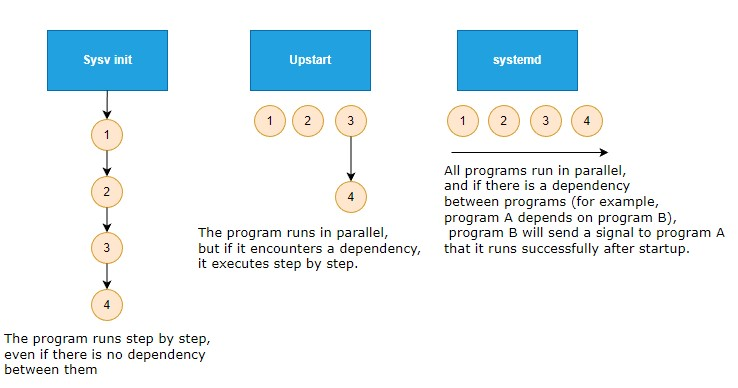
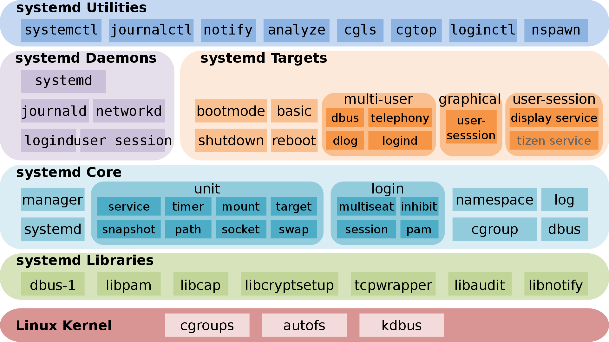

# Basic overview

The **systemd**, also known as **system daemon**, is a kind of init software under GNU/linux OS. 

Purpose of development:

* To provide a better framework for representing dependencies between services
* Implements parallel startup of services at system initialization
* Reduces Shell overhead and replaces System V style init

The **systemd** provides a series of system components for the GNU/Linux operating system, with the goal of unifying the service configuration and behavior across GNU/Linux distributions and eliminating differences in their usage.

Since 2015, most GNU/Linux distributions have adopted systemd to replace traditional init programs such as SysV. It is worth noting that many of the concepts and designs of systemd are inspired by Apple Mac OS's **launchd**.



After the emergence of systemd, it caused huge controversy in the open source community.

Praising voices:

* Developers and users have praised systemd for eliminating the usage differences between GNU/Linux and providing a more stable and faster out-of-the-box solution.

Critical voices:

* Systemd takes over too many components on the operating system, violating UNIX's KISS (**K**eep **I**t **S**imple, **S**tupid) principle.
* From a code perspective, the systemd is too complex and cumbersome, with over a million lines of code, thus reducing maintainability and increasing attack surface.

Official website - https://systemd.io/
The github repository - https://github.com/systemd/systemd

## Development history

In 2010, two Red Hat software engineers, Lennart Poettering and Kay Sievers, developed the first version of systemd to replace the traditional System V .


In May 2011, Fedora 15 became the first GNU/Linux distribution to enable systemd by default, with the reason given at the time:

> systemd provides aggressive parallelization capabilities, uses socket and D-Bus activation for starting services, offers on-demand starting of daemons, keeps track of processes using Linux cgroups, supports snapshotting and restoring of the system state, maintains mount and automount points and implements a powerful transactional dependency-based service control logic. It can work as a drop-in replacement for sysvinit. 

In October 2012, Arch Linux was booted with systemd by default.

From October 2013 to February 2014, the Debian Technical Committee had a long debate on the Debian mailing list, focusing on the topic "which init should be used by Debian 8 jessie as the system default" and finally decided to use systemd.

In February 2014, Ubuntu adopted systemd as its init and abandoned its own Upstart.

In August 2015, systemd began providing login shells that can be called through `machinectl`.

In 2016, systemd discovered a security vulnerability that allowed any non privileged user to perform a "deny of service attack" on systemd.

In 2017, systemd discovered another security vulnerability - **CVE-2017-9445**. Remote attackers can trigger a buffer overflow vulnerability and execute malicious code through malicious DNS responses.

!!! info

    **Buffer overflow**: It is a program design flaw that writes to the input buffer of a program to make it overflow (usually more data than the maximum amount of data that can be stored in the buffer), thus disrupting the program operation, taking advantage of the occasion of interruption, and obtaining control of the program or even the system.

## Architecture design

Here, I will use the systemd used by Samsung's Tizen as an example to illustrate its architecture.



!!! info

    **Tizen** - A mobile operating system based on Linux kernel, supported by Linux Foundation, mainly developed and used by Samsung

!!! info

    Some "target" of systemd do not belong to systemd components, such as `telephony`, `bootmode`, `dlog`, `tizen service`, they belong to Tizen.

Systemd uses a modular design, and at compile time, there are many configuration switches to determine what needs to be built and what does not need to be built, which is similar to the modular design of the Linux kernel. When compiled, systemd can have up to 69 binary executables that perform the following tasks, including:

* The systemd program runs with pid 1 and provides the startup of as many parallel services as possible. This also manages the shutdown sequence.
* The systemctl program provides a user interface for service management.
* To ensure compatibility, support for SystemV and LSB scripts is also provided.
* Compared to SystemV, Systemd's service management and reporting can output more detailed information.
* By mounting and unmounting file systems in layers, systemd can more securely cascade mounted file systems.
* Systemd provides management of basic component configuration, including hostname, time and date, locale, log, and so on.
* Provides management of sockets.
* Systemd timers provides functions similar to cron scheduled tasks.
* Support for the creation and management of temporary files, including deletion.
* The D-Bus interface provides the ability to run scripts when a device is inserted or removed. In this way, all devices, whether pluggable or not, can be regarded as plug and play devices, thus greatly simplifying the device processing process.
* The startup sequence analysis tool can be used to locate the service that takes the longest time.
* Manage system logs and service logs

**systemd is not just an initialization program, it is a large software suite that takes over many system components.**

## systemd as pid 1

The mount of the systemd is determined by the contents of the **/etc/fstab** file, including the swap partition.

The default "target" configuration is determined by **/etc/systemd/system/default.target**.

In the previous systemv initializer, it had the concept of a **runlevel**. Speaking of systemd, there is also a related compatibility comparison table, as shown below (List in descending order by number of dependencies):

| systemd targets   | SystemV runlevel | target alias (soft link) | description |
| :---              | :---             | :---                     | :---        |
| defautl.target    |                  | | This "target" is always a soft link to "multi-user.target" or "graphical.target". Systemd always uses "default.target" to start the system. Attention please! It cannot be a soft link to "halt.target", "poweroff.target" or "reboot.target". |
| graphical.target  | 5                | runlevel5.target | GUI environment. |
|                   | 4                | runlevel4.target | Reserved and unused. In the SystemV initialization program, runlevel4 is the same as runlevel3. In the systemd initialization program, users can create and customize this "target" to start local services without changing the default "multi-user.target". |
| multi-user.target | 3                | runlevel3.target | Full multi-user command line mode.  |
|                   | 2                | | In SystemV, it refers to the multi-user command line mode that does not include the NFS service.|
| rescue.target     | 1                | runlevel1.target | In SystemV, it is called **single-user mode**, which starts minimal services and does not start other additional programs or drivers. It is mainly used to repair the operating system. It is similar to the security mode of the Windows operating system. |
| emergency.target  |                  | | Basically equivalent to "rescue.target". |
| reboot.target     | 6                | runlevel6.target | reboot. |
| poweroff.target   | 0                | runlevel0.target | Shut down the operating system and power off.|

```bash
Shell > find  / -iname  runlevel?\.target -a -type l -exec ls -l {} \;
lrwxrwxrwx 1 root root 17 8月  23 03:05 /usr/lib/systemd/system/runlevel4.target -> multi-user.target
lrwxrwxrwx 1 root root 17 8月  23 03:05 /usr/lib/systemd/system/runlevel3.target -> multi-user.target
lrwxrwxrwx 1 root root 13 8月  23 03:05 /usr/lib/systemd/system/runlevel6.target -> reboot.target
lrwxrwxrwx 1 root root 13 8月  23 03:05 /usr/lib/systemd/system/runlevel1.target -> rescue.target
lrwxrwxrwx 1 root root 16 8月  23 03:05 /usr/lib/systemd/system/runlevel5.target -> graphical.target
lrwxrwxrwx 1 root root 15 8月  23 03:05 /usr/lib/systemd/system/runlevel0.target -> poweroff.target
lrwxrwxrwx 1 root root 17 8月  23 03:05 /usr/lib/systemd/system/runlevel2.target -> multi-user.target

Shell > ls -l /etc/systemd/system/default.target
lrwxrwxrwx. 1 root root 41 12月 23 2022 /etc/systemd/system/default.target -> /usr/lib/systemd/system/multi-user.target
```

Each "target" has a set of dependencies described in its configuration file, which are the services required to run the GNU/Linux host at a specific runlevel. The more features you have, the more dependencies "target" requires, for example, the GUI environment requires more services than the command-line mode.

From the man page (`man 7 bootup`), we can consult the boot diagram of systemd:

```
 local-fs-pre.target
                    |
                    v
           (various mounts and   (various swap   (various cryptsetup
            fsck services...)     devices...)        devices...)       (various low-level   (various low-level
                    |                  |                  |             services: udevd,     API VFS mounts:
                    v                  v                  v             tmpfiles, random     mqueue, configfs,
             local-fs.target      swap.target     cryptsetup.target    seed, sysctl, ...)      debugfs, ...)
                    |                  |                  |                    |                    |
                    \__________________|_________________ | ___________________|____________________/
                                                         \|/
                                                          v
                                                   sysinit.target
                                                          |
                     ____________________________________/|\________________________________________
                    /                  |                  |                    |                    \
                    |                  |                  |                    |                    |
                    v                  v                  |                    v                    v
                (various           (various               |                (various          rescue.service
               timers...)          paths...)              |               sockets...)               |
                    |                  |                  |                    |                    v
                    v                  v                  |                    v              rescue.target
              timers.target      paths.target             |             sockets.target
                    |                  |                  |                    |
                    v                  \_________________ | ___________________/
                                                         \|/
                                                          v
                                                    basic.target
                                                          |
                     ____________________________________/|                                 emergency.service
                    /                  |                  |                                         |
                    |                  |                  |                                         v
                    v                  v                  v                                 emergency.target
                display-        (various system    (various system
            manager.service         services           services)
                    |             required for            |
                    |            graphical UIs)           v
                    |                  |           multi-user.target
                    |                  |                  |
                    \_________________ | _________________/
                                      \|/
                                       v
                             graphical.target
```

* "sysinit.target" and "basic.target" can be considered checkpoints during the startup process. Although one of the design goals of systemd is to start system services in parallel, it is necessary to start the "targets" of certain services and features before starting other services and "targets"
* After the "units" that "sysinit.target" depends on are completed, the startup will move to the "sysinit.target" phase. These "units" can be started in parallel, including:
  * Mount the file system
  * Set up the swap file
  * Start udev
  * Set Random Generator seed
  * Start low-level services
  * Set up encryption services
* "sysinit.target" will start all the low-level services and "units" required for the basic functions of the operating system, which are required before entering the "basic.target" phase.
* After completing the "sysinit.target" phase, systemd starts all the "units" required to complete the next "target" (that is, "basic.target"). The target provides additional functions, including:
  * Set the directories paths for the various executable files.
  * communication sockets
  * timers
* Finally, initialization is performed for the user-level "target" ("multi-user.target" or "graphical.target"). Systemd must arrive at "multi-user.target" before entering "graphical.target".

You can execute the following command to see the dependencies required for full startup:

```bash
Shell > systemctl list-dependencies multi-user.target
multi-user.target
● ├─auditd.service
● ├─chronyd.service
● ├─crond.service
● ├─dbus.service
● ├─irqbalance.service
● ├─kdump.service
● ├─NetworkManager.service
● ├─sshd.service
● ├─sssd.service
● ├─systemd-ask-password-wall.path
● ├─systemd-logind.service
● ├─systemd-update-utmp-runlevel.service
● ├─systemd-user-sessions.service
● ├─tuned.service
● ├─basic.target
● │ ├─-.mount
● │ ├─microcode.service
● │ ├─paths.target
● │ ├─slices.target
● │ │ ├─-.slice
● │ │ └─system.slice
● │ ├─sockets.target
● │ │ ├─dbus.socket
● │ │ ├─sssd-kcm.socket
● │ │ ├─systemd-coredump.socket
● │ │ ├─systemd-initctl.socket
● │ │ ├─systemd-journald-dev-log.socket
● │ │ ├─systemd-journald.socket
● │ │ ├─systemd-udevd-control.socket
● │ │ └─systemd-udevd-kernel.socket
● │ ├─sysinit.target
● │ │ ├─dev-hugepages.mount
● │ │ ├─dev-mqueue.mount
● │ │ ├─dracut-shutdown.service
● │ │ ├─import-state.service
● │ │ ├─kmod-static-nodes.service
● │ │ ├─ldconfig.service
● │ │ ├─loadmodules.service
● │ │ ├─nis-domainname.service
● │ │ ├─proc-sys-fs-binfmt_misc.automount
● │ │ ├─selinux-autorelabel-mark.service
● │ │ ├─sys-fs-fuse-connections.mount
● │ │ ├─sys-kernel-config.mount
● │ │ ├─sys-kernel-debug.mount
● │ │ ├─systemd-ask-password-console.path
● │ │ ├─systemd-binfmt.service
● │ │ ├─systemd-firstboot.service
● │ │ ├─systemd-hwdb-update.service
● │ │ ├─systemd-journal-catalog-update.service
● │ │ ├─systemd-journal-flush.service
● │ │ ├─systemd-journald.service
● │ │ ├─systemd-machine-id-commit.service
● │ │ ├─systemd-modules-load.service
● │ │ ├─systemd-random-seed.service
● │ │ ├─systemd-sysctl.service
● │ │ ├─systemd-sysusers.service
● │ │ ├─systemd-tmpfiles-setup-dev.service
● │ │ ├─systemd-tmpfiles-setup.service
● │ │ ├─systemd-udev-trigger.service
● │ │ ├─systemd-udevd.service
● │ │ ├─systemd-update-done.service
● │ │ ├─systemd-update-utmp.service
● │ │ ├─cryptsetup.target
● │ │ ├─local-fs.target
● │ │ │ ├─-.mount
● │ │ │ ├─boot.mount
● │ │ │ ├─systemd-fsck-root.service
● │ │ │ └─systemd-remount-fs.service
● │ │ └─swap.target
● │ │   └─dev-disk-by\x2duuid-76e2324e\x2dccdc\x2d4b75\x2dbc71\x2d64cd0edb2ebc.swap
● │ └─timers.target
● │   ├─dnf-makecache.timer
● │   ├─mlocate-updatedb.timer
● │   ├─systemd-tmpfiles-clean.timer
● │   └─unbound-anchor.timer
● ├─getty.target
● │ └─getty@tty1.service
● └─remote-fs.target
```

You can also use the `--all` option to expand all "units".

## Use systemd

### Unit types

The `systemctl` command is the main tool for managing systemd, and it is a combination of previous `service` commands and `chkconfig` commands.

Systemd manages so-called "units", which are representations of system resources and services. This following list shows the "unit" types that systemd can manage:

* **service** - A service on the system, including instructions for starting, restarting, and stopping the service. See `man 5 systemd.service`.
* **socket** - A network socket associated with a service. See `man 5 systemd.socket`.
* **device** - A device specifically managed with systemd. See `man 5 systemd.device`.
* **mount** - A mountpoint managed with systemd. See `man 5 systemd.mount`.
* **automount** - A mountpoint automatically mounted on boot. See `man 5 systemd.automount`.
* **swap** - Swap space on the system. See `man 5 systemd.swap`.
* **target** - A synchronization point for other units. Usually used to start enabled services on boot. See `man 5 systemd.target`.
* **path** - A path for path-based activation. For example, you can start services based on the state of a certain path, such as whether it exists or not. See `man 5 systemd.path`.
* **timer** - A timer to schedule activation of another unit. See `man 5 systemd.timer`.
* **snapshot** - A snapshot of the current systemd state. Usually used to rollback after making temporary changes to systemd.
* **slice** - Restriction of resources through Linux Control Group nodes (cgroups). See `man 5 systemd.slice`.
* **scope** - Information from systemd bus interfaces. Usually used to manage external system processes. See `man 5 systemd.scope`.

### Operate "units"

The usage of the `systemictl` command is - `systemctl [OPTIONS...] COMMAND [UNIT...]`.

COMMAND can be divided into:

* Unit Commands
* Unit File Commands
* Machine Commands
* Job Commands
* Environment Commands
* Manager Lifecycle Commands
* System Commands

You can use `systemctl --help` to find out the details.

Here are some common operational demonstration commands:

```bash
# Start the service
Shell > systemctl start sshd.service

# Stop the service
Shell > systemctl stop sshd.service

# Reload the service
Shell > systemctl reload sshd.service

# Restart the service
Shell > systemctl restart sshd.service

# View the status of the service
Shell > systemctl status sshd.service

# The service starts automatically after the system starts
Shell > systemctl enable sshd.service

# The service stops automatically after the system starts
Shell > systemctl disable sshd.service

# Check if the service automatically starts after startup
Shell > systemctl is-enabled sshd.service

# Mask one unit
Shell > systemctl mask sshd.service

# Unmask one unit
Shell > systemctl unmask sshd.service

# View the file contents of unit
Shell > systemctl cat sshd.service

# Edit the contents of the unit file and save it in the /etc/systemd/system/ directory after editing
Shell > systemctl edit sshd.service

# View the complete properties of unit
Shell > systemctl show sshd.service
```

!!! info

    For the above operations, you can operate on one or more units in a single command line. The above operations are not limited to ".service".

About "units":

```bash
# List all currently running units.
Shell > systemctl
## or
Shell > systemctl list-units
## You can also add "--type=TYPE" for type filtering
Shell > systemctl --type=target

# List all unit files. You can also filter using "--type=TYPE"
Shell > systemctl list-unit-files
```

About "target":

```bash
# Query current "target" ("runlevel") information
Shell > systemctl get-default
multi-user.target

# Switch "target"（"runlevel"）. For example, you need to switch to the GUI environment
Shell > systemctl isolate graphical.target

# Define the default "target" ("runlevel")
Shell > systemctl set-default graphical.target
```

### Important directory

There are three main important directories, arranged in ascending order of priority:

* **/usr/lib/systemd/system/** - Systemd unit files distributed with installed RPM packages. Similar to the /etc/init.d/ directory for Centos 6.
* **/run/systemd/system/** - Systemd unit files created at run time.
* **/etc/systemd/system/** - Systemd unit files created by `systemctl enable` as well as unit files added for extending a service.

### Systemd configuration files

`man 5 systemd-system.conf`:

> When run as a system instance, systemd interprets the configuration file "system.conf" and the files in "system.conf.d" directories; when run as a user instance, it interprets the configuration file user.conf (either in the home directory of the user, or if not found, under "/etc/systemd/") and the files in "user.conf.d" directories. These configuration files contain a few  settings controlling basic manager operations.

In the RockyLinux 8.x operating system, the relevant configuration files are:

* **/etc/systemd/system.conf** - Edit the file to change the Settings. Deleting the file restores the default Settings. See `man 5 systemd-system.conf`
* **/etc/systemd/user.conf** - You can override the directives in this file by creating files in "/etc/systemd/user.conf.d/*.conf". See `man 5 systemd-user.conf`