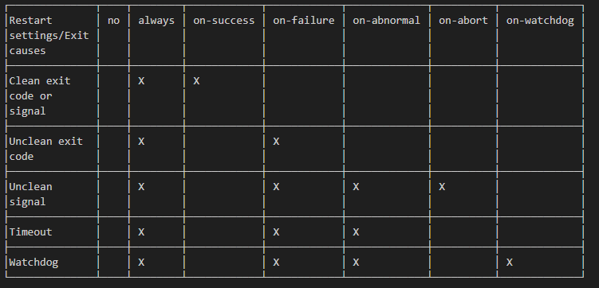

# Basic overview

**`systemd`**, also known as **system daemon**, is a kind of init software under GNU/Linux operating system.

Purpose of development:

* to provide a better framework for representing dependencies between services
* implements parallel startup of services at system initialization
* reduces shell overhead and replaces SysV style init

**`systemd`** provides a series of system components for the GNU/Linux operating system to unify the service configuration and behavior across GNU/Linux distributions and eliminate differences in their usage.

Since 2015, most GNU/Linux distributions have adopted `systemd` to replace traditional init programs such as SysV. It is worth noting that many of the concepts and designs of `systemd` are inspired by Apple Mac OS's **launchd**.


The emergence of `systemd` caused massive controversy in the open source community.

Praising voices:

* Developers and users have praised `systemd` for eliminating the usage differences between GNU/Linux and providing a more stable and faster out-of-the-box solution.

Critical voices:

* `systemd` takes over too many components on the operating system, violating UNIX's KISS (**K**eep **I**t **S**imple, **S**tupid) principle.
* From a code perspective, `systemd` is too complex and cumbersome, with over a million lines of code, thus reducing maintainability and increasing attack surface.

Official website - [https://systemd.io/](https://systemd.io/)
The GitHub repository - [https://github.com/systemd/systemd](https://github.com/systemd/systemd)

## Development history

In 2010, two Red Hat software engineers, Lennart Poettering and Kay Sievers, developed the first version of `systemd` to replace the traditional SysV.


In May 2011, Fedora 15 became the first GNU/Linux distribution to enable `systemd` by default, with the reason given at the time:

> systemd provides aggressive parallelization capabilities, uses socket and D-Bus activation for starting services, offers on-demand starting of daemons, keeps track of processes using Linux cgroups, supports snapshotting and restoring of the system state, maintains mount and automount points and implements a powerful transactional dependency-based service control logic. It can work as a drop-in replacement for sysvinit.

In October 2012, Arch Linux booted with `systemd` by default.

From October 2013 to February 2014, the Debian Technical Committee had a lengthy debate on the Debian mailing list, focusing on "which init should be used by Debian 8 Jessie as the system default" and finally decided to use `systemd`.

In February 2014, Ubuntu adopted `systemd` as its init and abandoned its own Upstart.

In August 2015, `systemd` began providing login shells callable through `machinectl`.

In 2016, `systemd` discovered a security vulnerability that allows any non-privileged user to perform a "denial of service attack" on `systemd`.

In 2017, `systemd` discovered another security vulnerability - **CVE-2017-9445**. Remote attackers can trigger a buffer overflow vulnerability and execute malicious code through malicious DNS responses.

!!! info

    **Buffer overflow**: It is a program design flaw that writes to the input buffer of a program to make it overflow (usually more data than the maximum amount of data that can be stored in the buffer), thus disrupting the program operation, taking advantage of the occasion of interruption, and obtaining control of the program or even the system.

## Architecture design

Here, the author chose as an example of `systemd` the one used by Samsung's Tizen to illustrate its architecture.


!!! info

    **Tizen** - A mobile operating system based on the Linux kernel, supported by the Linux Foundation, mainly developed and used by Samsung.

!!! info

    Some "targets" of `systemd` do not belong to `systemd` components, such as `telephony`, `bootmode`, `dlog`, `tizen service`, they belong to Tizen.

`systemd` uses a modular design. Many configuration switches exist at compile time to determine what will or will not be built, similar to the Linux kernel's modular design. When compiled, `systemd` can have up to 69 binary executables that perform the following tasks, including:

* `systemd` runs with PID 1 and provides the startup of as many parallel services as possible. This also manages the shutdown sequence.
* The `systemctl` program provides a user interface for service management.
* Support for SysV and LSB scripts are also provided to ensure compatibility.
* Compared to SysV, `systemd` service management and reporting can output more detailed information.
* By mounting and unmounting file systems in layers, `systemd` can cascade mounted file systems more securely.
* `systemd` provides management of basic component configuration, including hostname, time and date, locale, log, and so on.
* Provides management of sockets.
* `systemd` timers provide functions similar to cron scheduled tasks.
* Support for the creation and management of temporary files, including deletion.
* The D-Bus interface allows running scripts when a device is inserted or removed. In this way, all devices, whether pluggable or not, can be regarded as plug-and-play devices, thus greatly simplifying the device processing.
* The startup sequence analysis tool can be used to locate the service that takes the longest time.
* The management of logs and service logs.

**`systemd` is not just an initialization program, it is a large software suite that takes over many system components.**

## `systemd` as PID 1

The `systemd` mount is determined by using the contents of the **/etc/fstab** file, including the swap partition.

The default "target" configuration is determined by using **/etc/systemd/system/default.target**.

Previously, with SysV initialization, there was the concept of a **runlevel**. With `systemd`, there is also a related compatibility comparison table as shown below (List in descending order by number of dependencies):

| systemd targets   | SystemV runlevel | target alias (soft link) | description |
| :---              | :---             | :---                     | :---        |
| defautl.target    |                  | | This "target" is always a soft link to "multi-user.target" or "graphical.target". `systemd` always uses "default.target" to start the system. Attention please! It cannot be a soft link to "halt.target", "poweroff.target" or "reboot.target". |
| graphical.target  | 5                | runlevel5.target | GUI environment. |
|                   | 4                | runlevel4.target | Reserved and unused. In the SysV initialization program, runlevel4 is the same as runlevel3. In the `systemd` initialization program, users can create and customize this "target" to start local services without changing the default "multi-user.target". |
| multi-user.target | 3                | runlevel3.target | Full multi-user command line mode.  |
|                   | 2                | | In SystemV, it refers to the multi-user command line mode that does not include the NFS service.|
| rescue.target     | 1                | runlevel1.target | In SystemV, it is called **single-user mode**, which starts minimal services and does not start other additional programs or drivers. It is mainly used to repair the operating system. It is similar to the security mode of the Windows operating system. |
| emergency.target  |                  | | Basically equivalent to "rescue.target". |
| reboot.target     | 6                | runlevel6.target | reboot. |
| poweroff.target   | 0                | runlevel0.target | Shut down the operating system and power off.|

```bash
Shell > find  / -iname  runlevel?\.target -a -type l -exec ls -l {} \;
lrwxrwxrwx 1 root root 17 8月  23 03:05 /usr/lib/systemd/system/runlevel4.target -> multi-user.target
lrwxrwxrwx 1 root root 17 8月  23 03:05 /usr/lib/systemd/system/runlevel3.target -> multi-user.target
lrwxrwxrwx 1 root root 13 8月  23 03:05 /usr/lib/systemd/system/runlevel6.target -> reboot.target
lrwxrwxrwx 1 root root 13 8月  23 03:05 /usr/lib/systemd/system/runlevel1.target -> rescue.target
lrwxrwxrwx 1 root root 16 8月  23 03:05 /usr/lib/systemd/system/runlevel5.target -> graphical.target
lrwxrwxrwx 1 root root 15 8月  23 03:05 /usr/lib/systemd/system/runlevel0.target -> poweroff.target
lrwxrwxrwx 1 root root 17 8月  23 03:05 /usr/lib/systemd/system/runlevel2.target -> multi-user.target

Shell > ls -l /etc/systemd/system/default.target
lrwxrwxrwx. 1 root root 41 12月 23 2022 /etc/systemd/system/default.target -> /usr/lib/systemd/system/multi-user.target
```

Each "target" has a set of dependencies described in its configuration file, which are the services required to run the GNU/Linux host at a specific runlevel. The more features you have, the more dependencies the "target" requires. For example, the GUI environment requires more services than the command-line mode.

From the man page (`man 7 bootup`), we can consult the boot diagram of `systemd`:

```text
 local-fs-pre.target
                    |
                    v
           (various mounts and   (various swap   (various cryptsetup
            fsck services...)     devices...)        devices...)       (various low-level   (various low-level
                    |                  |                  |             services: udevd,     API VFS mounts:
                    v                  v                  v             tmpfiles, random     mqueue, configfs,
             local-fs.target      swap.target     cryptsetup.target    seed, sysctl, ...)      debugfs, ...)
                    |                  |                  |                    |                    |
                    \__________________|_________________ | ___________________|____________________/
                                                         \|/
                                                          v
                                                   sysinit.target
                                                          |
                     ____________________________________/|\________________________________________
                    /                  |                  |                    |                    \
                    |                  |                  |                    |                    |
                    v                  v                  |                    v                    v
                (various           (various               |                (various          rescue.service
               timers...)          paths...)              |               sockets...)               |
                    |                  |                  |                    |                    v
                    v                  v                  |                    v              rescue.target
              timers.target      paths.target             |             sockets.target
                    |                  |                  |                    |
                    v                  \_________________ | ___________________/
                                                         \|/
                                                          v
                                                    basic.target
                                                          |
                     ____________________________________/|                                 emergency.service
                    /                  |                  |                                         |
                    |                  |                  |                                         v
                    v                  v                  v                                 emergency.target
                display-        (various system    (various system
            manager.service         services           services)
                    |             required for            |
                    |            graphical UIs)           v
                    |                  |           multi-user.target
                    |                  |                  |
                    \_________________ | _________________/
                                      \|/
                                       v
                             graphical.target
```

* "sysinit.target" and "basic.target" are checkpoints during the startup process. Although one of the design goals of `systemd` is to start system services in parallel, it is necessary to start the "targets" of certain services and features before starting other services and "targets"
* After the "units" that "sysinit.target" depends on are completed, the startup will move to the "sysinit.target" phase. These "units" can be started in parallel, including:
    * Mount the file system
    * Set up the swap file
    * Start udev
    * Set Random Generator seed
    * Start low-level services
    * Set up encryption services
* "sysinit.target" will start all the low-level services and "units" required for the essential functions of the operating system, which are necessary before entering the "basic.target" phase.
* After completing the "sysinit.target" phase, `systemd` starts all the "units" required to complete the next "target" (that is, "basic.target"). The target provides additional functions, including:
    * Set the directory paths for the various executable files.
    * communication sockets
    * timers
* Finally, initialization is performed for the user-level "target" ("multi-user.target" or "graphical.target"). `systemd` must arrive at "multi-user.target" before entering "graphical.target".

You can run the following command to see the dependencies required for full startup:

```bash
Shell > systemctl list-dependencies multi-user.target
multi-user.target
● ├─auditd.service
● ├─chronyd.service
● ├─crond.service
● ├─dbus.service
● ├─irqbalance.service
● ├─kdump.service
● ├─NetworkManager.service
● ├─sshd.service
● ├─sssd.service
● ├─systemd-ask-password-wall.path
● ├─systemd-logind.service
● ├─systemd-update-utmp-runlevel.service
● ├─systemd-user-sessions.service
● ├─tuned.service
● ├─basic.target
● │ ├─-.mount
● │ ├─microcode.service
● │ ├─paths.target
● │ ├─slices.target
● │ │ ├─-.slice
● │ │ └─system.slice
● │ ├─sockets.target
● │ │ ├─dbus.socket
● │ │ ├─sssd-kcm.socket
● │ │ ├─systemd-coredump.socket
● │ │ ├─systemd-initctl.socket
● │ │ ├─systemd-journald-dev-log.socket
● │ │ ├─systemd-journald.socket
● │ │ ├─systemd-udevd-control.socket
● │ │ └─systemd-udevd-kernel.socket
● │ ├─sysinit.target
● │ │ ├─dev-hugepages.mount
● │ │ ├─dev-mqueue.mount
● │ │ ├─dracut-shutdown.service
● │ │ ├─import-state.service
● │ │ ├─kmod-static-nodes.service
● │ │ ├─ldconfig.service
● │ │ ├─loadmodules.service
● │ │ ├─nis-domainname.service
● │ │ ├─proc-sys-fs-binfmt_misc.automount
● │ │ ├─selinux-autorelabel-mark.service
● │ │ ├─sys-fs-fuse-connections.mount
● │ │ ├─sys-kernel-config.mount
● │ │ ├─sys-kernel-debug.mount
● │ │ ├─systemd-ask-password-console.path
● │ │ ├─systemd-binfmt.service
● │ │ ├─systemd-firstboot.service
● │ │ ├─systemd-hwdb-update.service
● │ │ ├─systemd-journal-catalog-update.service
● │ │ ├─systemd-journal-flush.service
● │ │ ├─systemd-journald.service
● │ │ ├─systemd-machine-id-commit.service
● │ │ ├─systemd-modules-load.service
● │ │ ├─systemd-random-seed.service
● │ │ ├─systemd-sysctl.service
● │ │ ├─systemd-sysusers.service
● │ │ ├─systemd-tmpfiles-setup-dev.service
● │ │ ├─systemd-tmpfiles-setup.service
● │ │ ├─systemd-udev-trigger.service
● │ │ ├─systemd-udevd.service
● │ │ ├─systemd-update-done.service
● │ │ ├─systemd-update-utmp.service
● │ │ ├─cryptsetup.target
● │ │ ├─local-fs.target
● │ │ │ ├─-.mount
● │ │ │ ├─boot.mount
● │ │ │ ├─systemd-fsck-root.service
● │ │ │ └─systemd-remount-fs.service
● │ │ └─swap.target
● │ │   └─dev-disk-by\x2duuid-76e2324e\x2dccdc\x2d4b75\x2dbc71\x2d64cd0edb2ebc.swap
● │ └─timers.target
● │   ├─dnf-makecache.timer
● │   ├─mlocate-updatedb.timer
● │   ├─systemd-tmpfiles-clean.timer
● │   └─unbound-anchor.timer
● ├─getty.target
● │ └─getty@tty1.service
● └─remote-fs.target
```

You can also use the `--all` option to expand all "units".

## Use `systemd`

### Unit types

The `systemctl` command is the main tool for managing `systemd`, and it is a combination of previous `service` commands and `chkconfig` commands.

`systemd` manages so-called "units", which are representations of system resources and services. The following list shows the "unit" types that `systemd` can manage:

* **service** - A service on the system, including instructions for starting, restarting, and stopping the service. See `man 5 systemd.service`.
* **socket** - A network socket associated with a service. See `man 5 systemd.socket`.
* **device** - A device specifically managed with `systemd`. See `man 5 systemd.device`.
* **mount** - A mount point managed with `systemd`. See `man 5 systemd.mount`.
* **automount** - A mount point automatically mounted on boot. See `man 5 systemd.automount`.
* **swap** - Swap space on the system. See `man 5 systemd.swap`.
* **target** - A synchronization point for other units. Usually used to start enabled services on boot. See `man 5 systemd.target`.
* **path** - A path for path-based activation. For example, you can start services based on the state of a certain path, such as whether it exists or not. See `man 5 systemd.path`.
* **timer** - A timer to schedule activation of another unit. See `man 5 systemd.timer`.
* **snapshot** - A snapshot of the current `systemd` state. Usually used to rollback after making temporary changes to `systemd`.
* **slice** - Restriction of resources through Linux Control Group nodes (cgroups). See `man 5 systemd.slice`.
* **scope** - Information from `systemd` bus interfaces. Usually used to manage external system processes. See `man 5 systemd.scope`.

### Operational "units"

The usage of the `systemictl` command is - `systemctl [OPTIONS...] COMMAND [UNIT...]`.

COMMAND can be divided into:

* Unit Commands
* Unit File Commands
* Machine Commands
* Job Commands
* Environment Commands
* Manager Lifecycle Commands
* System Commands

You can use `systemctl --help` to discover the details.

Here are some common operational demonstration commands:

```bash
# Start the service
Shell > systemctl start sshd.service

# Stop the service
Shell > systemctl stop sshd.service

# Reload the service
Shell > systemctl reload sshd.service

# Restart the service
Shell > systemctl restart sshd.service

# View the status of the service
Shell > systemctl status sshd.service

# The service starts automatically after the system starts
Shell > systemctl enable sshd.service

# The service stops automatically after the system starts
Shell > systemctl disable sshd.service

# Check if the service automatically starts after startup
Shell > systemctl is-enabled sshd.service

# Mask one unit
Shell > systemctl mask sshd.service

# Unmask one unit
Shell > systemctl unmask sshd.service

# View the file contents of unit
Shell > systemctl cat sshd.service

# Edit the contents of the unit file and save it in the /etc/systemd/system/ directory after editing
Shell > systemctl edit sshd.service

# View the complete properties of unit
Shell > systemctl show sshd.service
```

!!! info

     You can operate on one or more units in a single command line for the above operations. The above operations are not limited to ".service".

About "units":

```bash
# List all currently running units.
Shell > systemctl
## or
Shell > systemctl list-units
## You can also add "--type=TYPE" for type filtering
Shell > systemctl --type=target

# List all unit files. You can also filter using "--type=TYPE"
Shell > systemctl list-unit-files
```

About "targets":

```bash
# Query current "target" ("runlevel") information
Shell > systemctl get-default
multi-user.target

# Switch "target"（"runlevel"）. For example, you need to switch to the GUI environment
Shell > systemctl isolate graphical.target

# Define the default "target" ("runlevel")
Shell > systemctl set-default graphical.target
```

### Important directories

Three main important directories exist, arranged in ascending order of priority:

* **/usr/lib/systemd/system/** - Systemd unit files distributed with installed RPM packages. Similar to the /etc/init.d/ directory for Centos 6.
* **/run/systemd/system/** - Systemd unit files created at run time.
* **/etc/systemd/system/** - Systemd unit files created by `systemctl enable` as well as unit files added for extending a service.

### `systemd` configuration files

`man 5 systemd-system.conf`:

> When run as a system instance, systemd interprets the configuration file "system.conf" and the files in "system.conf.d" directories; when run as a user instance, it interprets the configuration file user.conf (either in the home directory of the user, or if not found, under "/etc/systemd/") and the files in "user.conf.d" directories. These configuration files contain a few settings controlling basic manager operations.

In the Rocky Linux 8.x operating system, the relevant configuration files are:

* **/etc/systemd/system.conf** - Edit the file to change the Settings. Deleting the file restores the default Settings. See `man 5 systemd-system.conf`
* **/etc/systemd/user.conf** - You can override the directives in this file by creating files in "/etc/systemd/user.conf.d/*.conf". See `man 5 systemd-user.conf`

### `systemd` units file content description

Take the file sshd.service as an example:

```bash
Shell > systemctl cat sshd.service
[Unit]
Description=OpenSSH server daemon
Documentation=man:sshd(8) man:sshd_config(5)
After=network.target sshd-keygen.target
Wants=sshd-keygen.target

[Service]
Type=notify
EnvironmentFile=-/etc/crypto-policies/back-ends/opensshserver.config
EnvironmentFile=-/etc/sysconfig/sshd
ExecStart=/usr/sbin/sshd -D $OPTIONS $CRYPTO_POLICY
ExecReload=/bin/kill -HUP $MAINPID
KillMode=process
Restart=on-failure
RestartSec=42s

[Install]
WantedBy=multi-user.target
```

As you can see, the content of the unit file has the same style as the configuration file of the RL 9 network card. It uses ++open-bracket++ and ++close-bracket++ to include the title, and below the title are the relevant key-value pairs.

```bash
# RL 9
Shell > cat /etc/NetworkManager/system-connections/ens160.nmconnection
[connection]
id=ens160
uuid=5903ac99-e03f-46a8-8806-0a7a8424497e
type=ethernet
interface-name=ens160
timestamp=1670056998

[ethernet]
mac-address=00:0C:29:47:68:D0

[ipv4]
address1=192.168.100.4/24,192.168.100.1
dns=8.8.8.8;114.114.114.114;
method=manual

[ipv6]
addr-gen-mode=default
method=disabled

[proxy]
```

Usually three titles exist for the ".service" type unit:

* **Unit**
* **Service**
* **Install**

1. Unit title

    The following key-value pairs are usable:

    * `Description=OpenSSH server daemon`. The string is used to describe the "unit".
    * `Documentation=man:sshd(8) man:sshd_config(5)`.  A space-separated list of URIs referencing documentation for this "unit" or its configuration. Accepted are only URIs of the types "http://", "https://", "file:", "info:", "man:".
    * `After=network.target sshd-keygen.target`. Defines the startup sequence relationship with other "units". In this example, "network.target" and "sshd-keygen.target" start first, and "sshd.service" starts last.
    * `Before=`. Define the startup sequence relationship with other "units".
    * `Requires=`. Configure dependencies on other "units." The values can be multiple units separated by spaces. If the current "unit" is activated, the values listed here will also activate. If at least one of the listed values of "unit" fails to activate successfully, `systemd` does not start the current "unit".
    * `Wants=sshd-keygen.target`. Similar to the `Requires` key. The difference is that if the dependent unit fails to start, it will not affect the normal operation of the current "unit".
    * `BindsTo=`. Similar to the `Requires` key. The difference is that if any dependent "unit" fails to start, the current unit is stopped in addition to the "unit" that stops the dependency.
    * `PartOf=`. Similar to the `Requires` key. The difference is that if any dependent "unit" fails to start, in addition to stopping and restarting the dependent units, the current "unit" will be stopped and restarted.
    * `Conflicts=`. Its value is a "unit" list separated by spaces. If the "unit" listed by the value is running, the current "unit" cannot run.
    * `OnFailure=`. When the current "unit" fails, the "unit" or "units" (separated by spaces) in the value activate(s).

    See `man 5 systemd.unit` for more information.

2. Service title

    The following key-value pairs are usable:

    * `Type=notify`. Configure the type of this ".service" unit, which can be one of the following:
        * `simple` - The service starts as the main process. This is the default.
        * `forking` - The service calls forked processes and runs as part of the main daemon.
        * `exec` - Similar to `simple`. The service manager will start this unit immediately after executing the binary of the main service. Other successor units must remain blocked until after this point before they can continue to start.
        * `oneshot` - Similar to `simple`, except the process must exit before `systemd` starts follow-up services.
        * `dbus` - Similar to `simple`, except the daemon acquires a name of the D-Bus bus.
        * `notify` - Similar to `simple`, except the daemon sends a notification message using `sd_notify` or an equivalent call after starting up.
        * `idle` - Similar to `simple`, except the execution of the service is delayed until all active jobs are dispatched.
    * `RemainAfterExit=`. Whether the current service should be considered active when all processes of the service exit. The default is no.
    * `GuessMainPID=`. The value is of type boolean and defaults to yes. In the absence of a clear location for the main process of the service, should `systemd` guess the PID of the main process (which may not be correct). If you set `Type=forking` and do not set `PIDFile`, this key value pair will take effect. Otherwise, ignore the key value pair.
    * `PIDFile=`. Specify the file path (absolute path) of the service PID. For `Type=forking` services, it is recommended to use this key-value pair. `systemd` reads the PID of the main process of the daemon after start-up of the service.
    * `BusName=`. A D-Bus bus name to reach this service. This option is mandatory for services where `Type=dbus` is used.
    * `ExecStart=/usr/sbin/sshd -D $OPTIONS $CRYPTO_POLICY`. The commands and arguments executed when the service starts.
    * `ExecStartPre=`. Other commands run before commands in `ExecStart`.
    * `ExecStartPost=`. Other commands run after commands in `ExecStart`.
    * `ExecReload=/bin/kill -HUP $MAINPID`. The commands and arguments run when the service reloads.
    * `ExecStop=`. The commands and arguments run when the service stops.
    * `ExecStopPost=`. Additional commands to run after the service stops.
    * `RestartSec=42s`. The time in seconds to sleep before restarting a service.
    * `TimeoutStartSec=`. The time in seconds to wait for the service to start.
    * `TimeoutStopSec=`. The time in seconds to wait for the service to stop.
    * `TimeoutSec=`. A shorthand for configuring both `TimeoutStartSec` and `TimeoutStopSec` simultaneously.
    * `RuntimeMaxSec=`. A maximum time in seconds for the service to run. Passes `infinity` (the default) to configure no runtime limit.
    * `Restart=on-failure`. Configures whether to restart the service when the service’s process exits, is killed, or reaches a timeout:
        * `no` - The service will not restart. This is the default.
        * `on-success` - Restarts only when the service process exits cleanly (exit code 0).
        * `on-failure` - Restarts only when the service process does not exit cleanly (node-zero exit code).
        * `on-abnormal` - Restarts if the process terminates with a signal or when a timeout occurs.
        * `on-abort` - Restarts if the process exits due to an uncaught signal not specified as a clean exit status.
        * `on-watchdog` -  If set to `on-watchdog`, the service restarts only if the watchdog timeout expires.
        * `always` - Always restarts.

    Exit causes and the effect of the `Restart=` settings on them:

    

    * `KillMode=process`. Specifies how processes of this unit shall be killed. Its value can be one of the following:
        * `control-group` - Default value. If set to `control-group`, all remaining processes in the control group of this unit are killed on unit stop.
        * `process` - Only the main process is killed.
        * `mixed` - The SIGTERM signal is sent to the main process while the subsequent SIGKILL signal is sent to all remaining processes of the unit's control group.
        * `none` - Does not kill any processes.
    * `PrivateTmp=`. Whether to use a private tmp directory. Based on certain security, the recommendation is to set the value to yes.
    * `ProtectHome=`. Whether to protect the home directory. Its value can be one of the following:
        * `yes` - The three directories (/root/, /home/, /run/user/) are not visible to unit.
        * `no` - The three directories are visible to unit.
        * `read-only` - The three directories are read-only to unit.
        * `tmpfs` - The temporary file system will be mounted in read-only mode on these three directories.
    * `ProtectSystem=`. The directory used to protect the system from modification by the service. The value can be:
        * `yes` - Indicates that the process called by the unit will be mounted read-only to the /usr/ and /boot/ directories.
        * `no` - Default value
        * `full` - Indicates that the /usr/, /boot/, /etc/ directories are mounted read-only.
        * `strict` - All file systems are mounted read-only (excluding virtual file system directories such as /dev/, /proc/, and /sys/).
    * `EnvironmentFile=-/etc/crypto-policies/back-ends/opensshserver.config`. Read environment variables from a text file. "-" means that if the file does not exist, the file will not be read and no errors or warnings will be logged.

    See `man 5 systemd.service` for more information.

3. Install title

    * `Alias=`. A list of additional names separated by spaces. Attention please! Your additional name should have the same type (suffix) as the current unit.
    * `RequiredBy=` or `WantedBy=multi-user.target`. Define the unit of the current operation as a dependency of unit in the value. After the definition is complete, you can find the relevant files in the /etc/systemd/systemd/ directory. For example:

      ```bash
      Shell > systemctl is-enabled chronyd.service
      enabled

      Shell > systemctl cat chronyd.service
      ...
      [Install]
      WantedBy=multi-user.target

      Shell > ls -l /etc/systemd/system/multi-user.target.wants/
      total 0
      lrwxrwxrwx. 1 root root 38 Sep 25 14:03 auditd.service -> /usr/lib/systemd/system/auditd.service
      lrwxrwxrwx. 1 root root 39 Sep 25 14:03 chronyd.service -> /usr/lib/systemd/system/chronyd.service  ←←
      lrwxrwxrwx. 1 root root 37 Sep 25 14:03 crond.service -> /usr/lib/systemd/system/crond.service
      lrwxrwxrwx. 1 root root 42 Sep 25 14:03 irqbalance.service -> /usr/lib/systemd/system/irqbalance.service
      lrwxrwxrwx. 1 root root 37 Sep 25 14:03 kdump.service -> /usr/lib/systemd/system/kdump.service
      lrwxrwxrwx. 1 root root 46 Sep 25 14:03 NetworkManager.service -> /usr/lib/systemd/system/NetworkManager.service
      lrwxrwxrwx. 1 root root 40 Sep 25 14:03 remote-fs.target -> /usr/lib/systemd/system/remote-fs.target
      lrwxrwxrwx. 1 root root 36 Sep 25 14:03 sshd.service -> /usr/lib/systemd/system/sshd.service
      lrwxrwxrwx. 1 root root 36 Sep 25 14:03 sssd.service -> /usr/lib/systemd/system/sssd.service
      lrwxrwxrwx. 1 root root 37 Sep 25 14:03 tuned.service -> /usr/lib/systemd/system/tuned.service
      ```

    * `Also=`. Other units to install or uninstall when installing or uninstalling this unit.

      In addition to the manual pages mentioned above, you can also type `man 5 systemd.exec` or `man 5 systemd.kill` to access other information.

## Command related to other components

* `timedatactl` - Queries or changes system time and date settings.
* `hostnamectl` - Queries or changes system hostname.
* `localectl` - Queries or changes system locale and keyboard settings.
* `systemd-analyze` - Profile `systemd`, shows unit dependencies, checks unit files.
* `journalctl` - Views system or service logs. The `journalctl` command is so important that a separate section will come later explaining its use and what to look out for.
* `loginctl` - Session management of login users.
