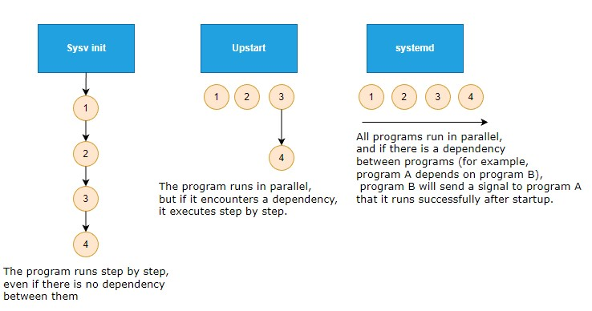
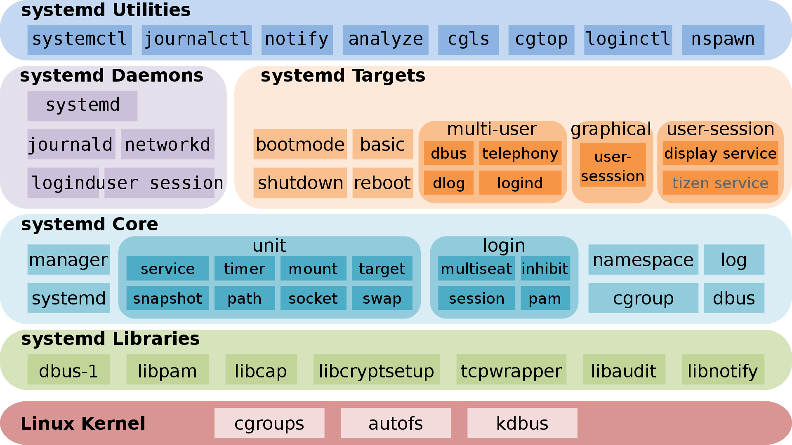
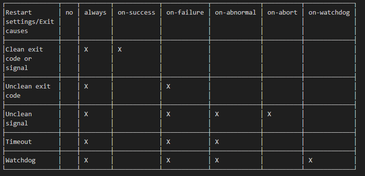

# Basic overview

**`systemd`**, also known as **system daemon**, is a kind of init software under GNU/Linux operating system.

Purpose of development:

- to provide a better framework for representing dependencies between services
- implements parallel startup of services at system initialization
- reduces shell overhead and replaces SysV style init

**`systemd`** provides a series of system components for the GNU/Linux operating system to unify the service configuration and behavior across GNU/Linux distributions and eliminate differences in their usage.

З 2015 року більшість дистрибутивів GNU/Linux прийняли `systemd` для заміни традиційних програм ініціалізації, таких як SysV. Варто зазначити, що багато концепцій і дизайнів `systemd` натхненні **launchd** від Apple Mac OS.



The emergence of `systemd` caused massive controversy in the open source community.

Praising voices:

- Developers and users have praised `systemd` for eliminating the usage differences between GNU/Linux and providing a more stable and faster out-of-the-box solution.

Critical voices:

- `systemd` takes over too many components on the operating system, violating UNIX's KISS (**K**eep **I**t **S**imple, **S**tupid) principle.
- From a code perspective, `systemd` is too complex and cumbersome, with over a million lines of code, thus reducing maintainability and increasing attack surface.

Official website - [https://systemd.io/](https://systemd.io/)
The GitHub repository - [https://github.com/systemd/systemd](https://github.com/systemd/systemd)

## Development history

In 2010, two Red Hat software engineers, Lennart Poettering and Kay Sievers, developed the first version of `systemd` to replace the traditional SysV.


In May 2011, Fedora 15 became the first GNU/Linux distribution to enable `systemd` by default, with the reason given at the time:

> systemd надає потужні можливості розпаралелювання, використовує активацію сокета та D-Bus для запуску служб, пропонує запуск демонов на вимогу, відстежує процеси за допомогою контрольних груп Linux, підтримує знімок і відновлення стану системи, підтримує точки монтування та автоматичного монтування та реалізує потужна логіка керування послугами на основі транзакційних залежностей. Він може працювати як додаткова заміна sysvinit.

In October 2012, Arch Linux booted with `systemd` by default.

From October 2013 to February 2014, the Debian Technical Committee had a lengthy debate on the Debian mailing list, focusing on "which init should be used by Debian 8 Jessie as the system default" and finally decided to use `systemd`.

In February 2014, Ubuntu adopted `systemd` as its init and abandoned its own Upstart.

In August 2015, `systemd` began providing login shells callable through `machinectl`.

У 2016 році `systemd` виявила вразливість безпеки, яка дозволяє будь-якому непривілейованому користувачеві виконувати «атаку відмови в обслуговуванні» на `systemd`.

У 2017 році `systemd` виявив ще одну вразливість безпеки - **CVE-2017-9445**. Віддалені зловмисники можуть викликати вразливість переповнення буфера та виконати зловмисний код через зловмисні відповіді DNS.

!!! info

    **Buffer overflow**: It is a program design flaw that writes to the input buffer of a program to make it overflow (usually more data than the maximum amount of data that can be stored in the buffer), thus disrupting the program operation, taking advantage of the occasion of interruption, and obtaining control of the program or even the system.

## Architecture design

Here, the author chose as an example of `systemd` the one used by Samsung's Tizen to illustrate its architecture.



!!! info

    **Tizen** - A mobile operating system based on the Linux kernel, supported by the Linux Foundation, mainly developed and used by Samsung.

!!! info

    Some "targets" of `systemd` do not belong to `systemd` components, such as `telephony`, `bootmode`, `dlog`, `tizen service`, they belong to Tizen.

`systemd` використовує модульний дизайн. Багато перемикачів конфігурації існують під час компіляції, щоб визначити, що буде, а що не буде створено, подібно до модульної конструкції ядра Linux. Після компіляції `systemd` може мати до 69 двійкових виконуваних файлів, які виконують такі завдання, зокрема:

- `systemd` працює з PID 1 і забезпечує запуск якомога більшої кількості паралельних служб. Це також керує послідовністю завершення роботи.
- The `systemctl` program provides a user interface for service management.
- Support for SysV and LSB scripts are also provided to ensure compatibility.
- Compared to SysV, `systemd` service management and reporting can output more detailed information.
- By mounting and unmounting file systems in layers, `systemd` can cascade mounted file systems more securely.
- `systemd` provides management of basic component configuration, including hostname, time and date, locale, log, and so on.
- Provides management of sockets.
- `systemd` timers provide functions similar to cron scheduled tasks.
- Support for the creation and management of temporary files, including deletion.
- Інтерфейс D-Bus дозволяє запускати сценарії, коли пристрій вставлено або вилучено. Таким чином, усі пристрої, незалежно від того, підключаються чи ні, можна розглядати як пристрої, що підключаються та працюють, що значно спрощує обробку пристроїв.
- The startup sequence analysis tool can be used to locate the service that takes the longest time.
- The management of logs and service logs.

**`systemd` is not just an initialization program, it is a large software suite that takes over many system components.**

## `systemd` as PID 1

The `systemd` mount is determined by using the contents of the **/etc/fstab** file, including the swap partition.

The default "target" configuration is determined by using **/etc/systemd/system/default.target**.

Раніше з ініціалізацією SysV існувала концепція **runlevel**. З `systemd` також існує пов’язана таблиця порівняння сумісності, як показано нижче (перераховано в порядку спадання за кількома залежностями):

| systemd targets                   | SystemV runlevel | target alias (soft link) | description                                                                                                                                                                                                                                                                                                                                                                                                             |
| :-------------------------------- | :--------------- | :------------------------------------------ | :---------------------------------------------------------------------------------------------------------------------------------------------------------------------------------------------------------------------------------------------------------------------------------------------------------------------------------------------------------------------------------------------------------------------- |
| default.target    |                  |                                             | Ця «ціль» завжди є м’яким посиланням на «multi-user.target» або «graphical.target». `systemd` завжди використовує "default.target" для запуску системи. Увага, будь ласка! Це не може бути програмне посилання на "halt.target", "poweroff.target" або "reboot.target". |
| graphical.target  | 5                | runlevel5.target            | GUI environment.                                                                                                                                                                                                                                                                                                                                                                                        |
|                                   | 4                | runlevel4.target            | Зарезервований і невикористовуваний. У програмі ініціалізації SysV runlevel4 такий самий, як runlevel3. У програмі ініціалізації `systemd` користувачі можуть створювати та налаштовувати цю "ціль" для запуску локальних служб без зміни типового "multi-user.target".                                                                                 |
| multi-user.target | 3                | runlevel3.target            | Full multi-user command line mode.                                                                                                                                                                                                                                                                                                                                                                      |
|                                   | 2                |                                             | In SystemV, it refers to the multi-user command line mode that does not include the NFS service.                                                                                                                                                                                                                                                                                                        |
| rescue.target     | 1                | runlevel1.target            | У SystemV це називається **однокористувацький режим**, який запускає мінімальні служби та не запускає інші додаткові програми чи драйвери. В основному використовується для відновлення операційної системи. Він схожий на режим безпеки операційної системи Windows.                                                                                                   |
| emergency.target  |                  |                                             | Basically equivalent to "rescue.target".                                                                                                                                                                                                                                                                                                                                                |
| reboot.target     | 6                | runlevel6.target            | reboot.                                                                                                                                                                                                                                                                                                                                                                                                 |
| poweroff.target   | 0                | runlevel0.target            | Shut down the operating system and power off.                                                                                                                                                                                                                                                                                                                                                           |

```bash
Shell > find  / -iname  runlevel?\.target -a -type l -exec ls -l {} \;
lrwxrwxrwx 1 root root 17 8月  23 03:05 /usr/lib/systemd/system/runlevel4.target -> multi-user.target
lrwxrwxrwx 1 root root 17 8月  23 03:05 /usr/lib/systemd/system/runlevel3.target -> multi-user.target
lrwxrwxrwx 1 root root 13 8月  23 03:05 /usr/lib/systemd/system/runlevel6.target -> reboot.target
lrwxrwxrwx 1 root root 13 8月  23 03:05 /usr/lib/systemd/system/runlevel1.target -> rescue.target
lrwxrwxrwx 1 root root 16 8月  23 03:05 /usr/lib/systemd/system/runlevel5.target -> graphical.target
lrwxrwxrwx 1 root root 15 8月  23 03:05 /usr/lib/systemd/system/runlevel0.target -> poweroff.target
lrwxrwxrwx 1 root root 17 8月  23 03:05 /usr/lib/systemd/system/runlevel2.target -> multi-user.target

Shell > ls -l /etc/systemd/system/default.target
lrwxrwxrwx. 1 root root 41 12月 23 2022 /etc/systemd/system/default.target -> /usr/lib/systemd/system/multi-user.target
```

Кожна «ціль» має набір залежностей, описаних у файлі конфігурації: служби, необхідні для запуску хосту GNU/Linux на певному рівні виконання. Чим більше функцій у вас є, тим більше залежностей вимагає «ціль». Наприклад, середовище GUI вимагає більше послуг, ніж режим командного рядка.

From the man page (`man 7 bootup`), we can consult the boot diagram of `systemd`:

```text
 local-fs-pre.target
                    |
                    v
           (various mounts and   (various swap   (various cryptsetup
            fsck services...)     devices...)        devices...)       (various low-level   (various low-level
                    |                  |                  |             services: udevd,     API VFS mounts:
                    v                  v                  v             tmpfiles, random     mqueue, configfs,
             local-fs.target      swap.target     cryptsetup.target    seed, sysctl, ...)      debugfs, ...)
                    |                  |                  |                    |                    |
                    \__________________|_________________ | ___________________|____________________/
                                                         \|/
                                                          v
                                                   sysinit.target
                                                          |
                     ____________________________________/|\________________________________________
                    /                  |                  |                    |                    \
                    |                  |                  |                    |                    |
                    v                  v                  |                    v                    v
                (various           (various               |                (various          rescue.service
               timers...)          paths...)              |               sockets...)               |
                    |                  |                  |                    |                    v
                    v                  v                  |                    v              rescue.target
              timers.target      paths.target             |             sockets.target
                    |                  |                  |                    |
                    v                  \_________________ | ___________________/
                                                         \|/
                                                          v
                                                    basic.target
                                                          |
                     ____________________________________/|                                 emergency.service
                    /                  |                  |                                         |
                    |                  |                  |                                         v
                    v                  v                  v                                 emergency.target
                display-        (various system    (various system
            manager.service         services           services)
                    |             required for            |
                    |            graphical UIs)           v
                    |                  |           multi-user.target
                    |                  |                  |
                    \_________________ | _________________/
                                      \|/
                                       v
                             graphical.target
```

- "sysinit.target" і "basic.target" є контрольними точками під час процесу запуску. Хоча однією з цілей розробки `systemd` є паралельний запуск системних служб, необхідно запустити "цілі" певних служб і функцій перед запуском інших служб і "цілей"
- Після завершення «одиниць», від яких залежить «sysinit.target», запуск перейде до фази «sysinit.target». Ці «одиниці» можна запускати паралельно, зокрема:
  - Mount the file system
  - Set up the swap file
  - Start udev
  - Set Random Generator seed
  - Start low-level services
  - Set up encryption services
- "sysinit.target" will start all the low-level services and "units" required for the essential functions of the operating system, which are necessary before entering the "basic.target" phase.
- Після завершення фази «sysinit.target» `systemd` запускає всі «одиниці», необхідні для завершення наступної «цілі» (тобто «basic.target»). Ціль надає додаткові функції, зокрема:
  - Set the directory paths for the various executable files.
  - communication sockets
  - timers
- Нарешті, ініціалізація виконується для "цілі" на рівні користувача ("multi-user.target" або "graphical.target"). `systemd` має досягти "multi-user.target" перед тим, як ввести "graphical.target".

You can run the following command to see the dependencies required for full startup:

```bash
Shell > systemctl list-dependencies multi-user.target
multi-user.target
● ├─auditd.service
● ├─chronyd.service
● ├─crond.service
● ├─dbus.service
● ├─irqbalance.service
● ├─kdump.service
● ├─NetworkManager.service
● ├─sshd.service
● ├─sssd.service
● ├─systemd-ask-password-wall.path
● ├─systemd-logind.service
● ├─systemd-update-utmp-runlevel.service
● ├─systemd-user-sessions.service
● ├─tuned.service
● ├─basic.target
● │ ├─-.mount
● │ ├─microcode.service
● │ ├─paths.target
● │ ├─slices.target
● │ │ ├─-.slice
● │ │ └─system.slice
● │ ├─sockets.target
● │ │ ├─dbus.socket
● │ │ ├─sssd-kcm.socket
● │ │ ├─systemd-coredump.socket
● │ │ ├─systemd-initctl.socket
● │ │ ├─systemd-journald-dev-log.socket
● │ │ ├─systemd-journald.socket
● │ │ ├─systemd-udevd-control.socket
● │ │ └─systemd-udevd-kernel.socket
● │ ├─sysinit.target
● │ │ ├─dev-hugepages.mount
● │ │ ├─dev-mqueue.mount
● │ │ ├─dracut-shutdown.service
● │ │ ├─import-state.service
● │ │ ├─kmod-static-nodes.service
● │ │ ├─ldconfig.service
● │ │ ├─loadmodules.service
● │ │ ├─nis-domainname.service
● │ │ ├─proc-sys-fs-binfmt_misc.automount
● │ │ ├─selinux-autorelabel-mark.service
● │ │ ├─sys-fs-fuse-connections.mount
● │ │ ├─sys-kernel-config.mount
● │ │ ├─sys-kernel-debug.mount
● │ │ ├─systemd-ask-password-console.path
● │ │ ├─systemd-binfmt.service
● │ │ ├─systemd-firstboot.service
● │ │ ├─systemd-hwdb-update.service
● │ │ ├─systemd-journal-catalog-update.service
● │ │ ├─systemd-journal-flush.service
● │ │ ├─systemd-journald.service
● │ │ ├─systemd-machine-id-commit.service
● │ │ ├─systemd-modules-load.service
● │ │ ├─systemd-random-seed.service
● │ │ ├─systemd-sysctl.service
● │ │ ├─systemd-sysusers.service
● │ │ ├─systemd-tmpfiles-setup-dev.service
● │ │ ├─systemd-tmpfiles-setup.service
● │ │ ├─systemd-udev-trigger.service
● │ │ ├─systemd-udevd.service
● │ │ ├─systemd-update-done.service
● │ │ ├─systemd-update-utmp.service
● │ │ ├─cryptsetup.target
● │ │ ├─local-fs.target
● │ │ │ ├─-.mount
● │ │ │ ├─boot.mount
● │ │ │ ├─systemd-fsck-root.service
● │ │ │ └─systemd-remount-fs.service
● │ │ └─swap.target
● │ │   └─dev-disk-by\x2duuid-76e2324e\x2dccdc\x2d4b75\x2dbc71\x2d64cd0edb2ebc.swap
● │ └─timers.target
● │   ├─dnf-makecache.timer
● │   ├─mlocate-updatedb.timer
● │   ├─systemd-tmpfiles-clean.timer
● │   └─unbound-anchor.timer
● ├─getty.target
● │ └─getty@tty1.service
● └─remote-fs.target
```

You can also use the `--all` option to expand all "units".

## Use `systemd`

### Unit types

Команда `systemctl` є основним інструментом для керування "юнітами" та пов'язаними з ними файлами `systemd`.

`systemd` керує так званими "одиницями", які представляють системні ресурси та служби. У наступному списку показано типи «юнітів», якими може керувати `systemd`:

- **service** - Служба в системі, включаючи інструкції щодо запуску, перезапуску та зупинки служби. Дивіться `man 5 systemd.service`.
- **socket** - Мережевий сокет, пов’язаний зі службою. Дивіться `man 5 systemd.socket`.
- **device** - Пристрій, спеціально керований за допомогою `systemd`. Дивись `man 5 systemd.device`.
- **mount** - Точка монтування, керована за допомогою `systemd`. Дивись `man 5 systemd.mount`.
- **automount** - Точка монтування автоматично монтується на завантажувачі. Дивись `man 5 systemd.automount`.
- **swap** - Поміняти місце в системі. Дивись `man 5 systemd.swap`.
- **target** - Точка синхронізації для інших блоків. Зазвичай використовується для запуску активних служб під час завантаження. Дивись `man 5 systemd.target`.
- **path** - Шлях для активації на основі шляху. Наприклад, ви можете запускати служби на основі стану певного шляху, наприклад, чи існує він чи ні. Дивись `man 5 systemd.path`.
- **timer** - Таймер для планування активації іншого блоку. Дивись `man 5 systemd.timer`.
- **snapshot** - Знімок поточного стану `systemd`. Зазвичай використовується для відкоту після внесення тимчасових змін до `системи`.
- **slice** - Обмеження ресурсів через вузли Linux Control Group (cgroups). Дивись `man 5 systemd.slice`.
- **scope** - Інформація з інтерфейсів шини `systemd`. Зазвичай використовується для керування процесами зовнішньої системи. Дивись `man 5 systemd.scope`.

### Operational "units"

Використання команди `systemictl` - `systemctl [OPTIONS...] COMMAND [UNIT...]`.

COMMAND can be divided into:

- Unit Commands
- Unit File Commands
- Machine Commands
- Job Commands
- Environment Commands
- Manager Lifecycle Commands
- System Commands

You can use `systemctl --help` to discover the details.

Here are some common operational demonstration commands:

```bash
# Start the service
Shell > systemctl start sshd.service

# Stop the service
Shell > systemctl stop sshd.service

# Reload the service
Shell > systemctl reload sshd.service

# Restart the service
Shell > systemctl restart sshd.service

# View the status of the service
Shell > systemctl status sshd.service

# The service starts automatically after the system starts
Shell > systemctl enable sshd.service

# The service stops automatically after the system starts
Shell > systemctl disable sshd.service

# Check if the service automatically starts after startup
Shell > systemctl is-enabled sshd.service

# Mask one unit
Shell > systemctl mask sshd.service

# Unmask one unit
Shell > systemctl unmask sshd.service

# View the file contents of unit
Shell > systemctl cat sshd.service

# Edit the contents of the unit file and save it in the /etc/systemd/system/ directory after editing
Shell > systemctl edit sshd.service

# View the complete properties of unit
Shell > systemctl show sshd.service
```

!!! info

    Ви можете виконувати вищезазначені операції з одним або кількома блоками за допомогою одного командного рядка. Вищезазначені операції не обмежуються ".service".

About "units":

```bash
# List all currently running units.
Shell > systemctl
## or
Shell > systemctl list-units
## You can also add "--type=TYPE" for type filtering
Shell > systemctl --type=target

# List all unit files. You can also filter using "--type=TYPE"
Shell > systemctl list-unit-files
```

About "targets":

```bash
# Query current "target" ("runlevel") information
Shell > systemctl get-default
multi-user.target

# Switch "target"（"runlevel"）. For example, you need to switch to the GUI environment
Shell > systemctl isolate graphical.target

# Define the default "target" ("runlevel")
Shell > systemctl set-default graphical.target
```

### Important directories

Three main important directories exist, arranged in ascending order of priority:

- **/usr/lib/systemd/system/** - Файли модуля Systemd, що розповсюджуються разом із встановленими пакетами RPM. Подібно до каталогу /etc/init.d/ для Centos 6.
- **/run/systemd/system/** - Systemd unit files created at run time.
- **/etc/systemd/system/** - Systemd unit files created by `systemctl enable` as well as unit files added for extending a service.

### `systemd` configuration files

`man 5 systemd-system.conf`:

> При запуску як системного екземпляра systemd інтерпретує файл конфігурації "system.conf" і файли в каталогах "system.conf.d"; коли він запускається як екземпляр користувача, він інтерпретує файл конфігурації user.conf (у домашньому каталозі користувача або, якщо його не знайдено, у "/etc/systemd/") та файли в "user.conf.d" довідники. Ці конфігураційні файли містять кілька налаштувань, які керують основними операціями менеджера.

In the Rocky Linux 8.x operating system, the relevant configuration files are:

- **/etc/systemd/system.conf** - Редагує файл, щоб змінити налаштування. Видалення файлу відновлює налаштування за замовчуванням. Дивись `man 5 systemd-system.conf`
- **/etc/systemd/user.conf** - Ви можете змінити директиви в цьому файлі, створивши файли в "/etc/systemd/user.conf.d/\*.conf". Дивись `man 5 systemd-user.conf`

### `systemd` units file content description

Take the file sshd.service as an example:

```bash
Shell > systemctl cat sshd.service
[Unit]
Description=OpenSSH server daemon
Documentation=man:sshd(8) man:sshd_config(5)
After=network.target sshd-keygen.target
Wants=sshd-keygen.target

[Service]
Type=notify
EnvironmentFile=-/etc/crypto-policies/back-ends/opensshserver.config
EnvironmentFile=-/etc/sysconfig/sshd
ExecStart=/usr/sbin/sshd -D $OPTIONS $CRYPTO_POLICY
ExecReload=/bin/kill -HUP $MAINPID
KillMode=process
Restart=on-failure
RestartSec=42s

[Install]
WantedBy=multi-user.target
```

Як бачите, вміст файлу модуля має той самий стиль, що й файл конфігурації мережевої карти RL 9. Він використовує ++open-bracket++ і ++close-bracket++ для включення заголовка, а під заголовком розташовані відповідні пари ключ-значення.

```bash
# RL 9
Shell > cat /etc/NetworkManager/system-connections/ens160.nmconnection
[connection]
id=ens160
uuid=5903ac99-e03f-46a8-8806-0a7a8424497e
type=ethernet
interface-name=ens160
timestamp=1670056998

[ethernet]
mac-address=00:0C:29:47:68:D0

[ipv4]
address1=192.168.100.4/24,192.168.100.1
dns=8.8.8.8;114.114.114.114;
method=manual

[ipv6]
addr-gen-mode=default
method=disabled

[proxy]
```

Usually three titles exist for the ".service" type unit:

- **Unit**
- **Service**
- **Install**

1. Unit title

   Можна використовувати наступні пари ключ-значення:

   - `Description=OpenSSH server daemon`. Рядок використовується для опису "одиниці".
   - `Documentation=man:sshd(8) man:sshd_config(5)`.  Відокремлений пробілами список URI, що посилається на документацію для цього «блока» або його конфігурації. Приймаються лише URI типів "http://", "https://", "file:", "info:", "man:".
   - `After=network.target sshd-keygen.target`. Визначає зв'язок послідовності запуску з іншими "одиницями". У цьому прикладі "network.target" і "sshd-keygen.target" починаються першими, а "sshd.service" починається останнім.
   - `Before=`. Визначте зв’язок послідовності запуску з іншими «одиницями».
   - `Requires=`. Налаштуйте залежності від інших "юнітів". Значення можуть бути кількома одиницями, розділеними пробілами. Якщо поточна «одиниця» активована, значення, наведені тут, також активуються. Якщо принаймні одне з перелічених значень "одиниці" не вдається успішно активувати, `systemd` не запускає поточний "блок".
   - `Wants=sshd-keygen.target`. Подібно до ключа `Requires`. Різниця в тому, що якщо залежний блок не запускається, це не вплине на нормальну роботу поточного «блока».
   - `BindsTo=`. Подібно до ключа `Requires`. Різниця полягає в тому, що якщо будь-який залежний "блок" не запускається, поточний блок зупиняється на додаток до "блоку", який зупиняє залежність.
   - `PartOf=`. Подібно до ключа `Requires`. Різниця полягає в тому, що якщо будь-який залежний «блок» не запускається, окрім зупинки та перезапуску залежних блоків, поточний «блок» буде зупинено та перезапущено.
   - `Conflicts=`. Його значенням є список одиниць, розділених пробілами. Якщо «одиниця», зазначена у значенні, працює, поточна «одиниця» працювати не може.
   - `OnFailure=`. Коли поточна «одиниця» виходить з ладу, активується «одиниця» або «одиниці» (відокремлені пробілами) у значенні.

   Дивись `man 5 systemd.unit`.

2. Назва служби

   Можна використовувати наступні пари ключ-значення:

   - `Type=notify`. Налаштуйте тип цього блоку ".service", який може бути одним із таких:
     - `simple` - Сервіс запускається як основний процес. Це значення за умовчанням.
     - `forking` - Служба викликає роздвоєні процеси та працює як частина основного демона.
     - `exec` - Схожий до `simple`. Менеджер служби запустить цей блок одразу після виконання двійкового файлу основної служби. Інші підрозділи-наступники повинні залишатися заблокованими до цього моменту, перш ніж вони зможуть продовжити роботу.
     - `oneshot` - Подібно до `simple`, за винятком того, що процес має завершитися, перш ніж `systemd` запустить наступні служби.
     - `dbus` - Подібно до `simple`, за винятком того, що демон отримує назву шини D-Bus.
     - `notify` - Подібно до `simple`, за винятком того, що демон надсилає сповіщення за допомогою `sd_notify` або еквівалентного виклику після запуску.
     - `idle` - Подібно до «simple», за винятком того, що виконання служби відкладено, доки не буде відправлено всі активні завдання.
   - `RemainAfterExit=`. Чи слід вважати поточну службу активною, коли завершуються всі процеси служби. За замовчуванням ні.
   - `GuessMainPID=`. Значення має тип boolean і за замовчуванням yes. За відсутності чіткого розташування основного процесу служби, `systemd` має вгадати PID основного процесу (який може бути неправильним). Якщо ви встановите `Type=forking` і не встановите `PIDFile`, ця пара ключ-значення вступить у силу. В іншому випадку ігноруйте пару ключ-значення.
   - `PIDFile=`. Вкажіть шлях до файлу (абсолютний шлях) PID служби. Для служб `Type=forking` рекомендується використовувати цю пару ключ-значення. `systemd` зчитує PID основного процесу демона після запуску служби.
   - `BusName=`. Назва шини D-Bus, щоб дістатися до цієї служби. Цей параметр є обов’язковим для служб, де використовується `Type=dbus`.
   - `ExecStart=/usr/sbin/sshd -D $OPTIONS $CRYPTO_POLICY`. Команди та аргументи виконуються під час запуску служби.
   - `ExecStartPre=`. Інші команди виконуються перед командами в `ExecStart`.
   - `ExecStartPost=`. Інші команди виконуються після команд у `ExecStart`.
   - `ExecReload=/bin/kill -HUP $MAINPID`. Команди та аргументи запускаються під час перезавантаження служби.
   - `ExecStop=`. Команди та аргументи запускаються, коли служба зупиняється.
   - `ExecStopPost=`. Додаткові команди для запуску після зупинки служби.
   - `RestartSec=42s`. Час у секундах до переходу в режим сну перед перезапуском служби.
   - `TimeoutStartSec=`. Час очікування запуску служби в секундах.
   - `TimeoutStopSec=`. Час у секундах очікування зупинки служби.
   - `TimeoutSec=`. Скорочення для одночасного налаштування `TimeoutStartSec` і `TimeoutStopSec`.
   - `RuntimeMaxSec=`. Максимальний час роботи служби в секундах. Передає `infinity` (за замовчуванням), щоб не налаштувати обмеження часу виконання.
   - `Restart=on-failure`. Налаштовує, чи потрібно перезапускати службу, коли процес служби завершується, завершується або досягає тайм-ауту:
     - `no` - Служба не буде перезапущена. Це значення за умовчанням.
     - `on-success` - Перезапускається лише тоді, коли сервісний процес закінчується чисто (код виходу 0).
     - `on-failure` - Перезапускається лише тоді, коли процес обслуговування не завершується належним чином (код виходу node-zero).
     - `on-abnormal` - Перезапускається, якщо процес завершується сигналом або коли настає тайм-аут.
     - `on-abort` - Перезапускається, якщо процес завершується через неперехоплений сигнал, не вказаний як чистий статус виходу.
     - `on-watchdog` -  Якщо встановлено значення `on-watchdog`, служба перезапуститься лише після закінчення тайм-ауту сторожового таймера.
     - `always` - Завжди перезапускається.

   Причини виходу та вплив на них налаштувань `Restart=`:

   

   - `KillMode=process`. Визначає, як процеси цього блоку мають бути припинені. Його значення може бути одним із таких:
     - `control-group` - Значення за замовчуванням. Якщо встановлено значення `control-group`, усі решта процесів у групі керування цього блоку припиняються під час зупинки блоку.
     - `process` - Знищується лише основний процес.
     - `mixed` - Сигнал SIGTERM надсилається головному процесу, тоді як наступний сигнал SIGKILL надсилається всім іншим процесам групи керування блоком.
     - `none` - Не вбиває жодних процесів.
   - `PrivateTmp=`. Чи використовувати приватний каталог tmp. Виходячи з певної безпеки, рекомендовано встановити значення так.
   - `ProtectHome=`. Чи захищати домашній каталог. Його значення може бути одним із таких:
     - `yes` - Три каталоги (/root/, /home/, /run/user/) не видимі для пристрою.
     - `no` - Три каталоги видимі для пристрою.
     - `read-only` - Три каталоги доступні лише для читання.
     - `tmpfs` - Тимчасова файлова система буде змонтована в режимі лише для читання в цих трьох каталогах.
   - `ProtectSystem=`. Каталог використовується для захисту системи від модифікації службою. Значення може бути:
     - `yes` - Вказує, що процес, викликаний модулем, буде змонтовано лише для читання до каталогів /usr/ і /boot/.
     - `no` - За замовченням
     - `full` - Вказує, що каталоги /usr/, /boot/, /etc/ монтуються лише для читання.
     - `strict` - Усі файлові системи монтуються лише для читання (за винятком каталогів віртуальних файлових систем, таких як /dev/, /proc/ і /sys/).
   - `EnvironmentFile=-/etc/crypto-policies/back-ends/opensshserver.config`. Читання змінних середовища з текстового файлу. «-» означає, що якщо файл не існує, він не буде прочитаний, а помилки чи попередження не реєструватимуться.

   Дивись `man 5 systemd.service`.

3. Назва установки

   - `Alias=`. Список додаткових імен, розділених пробілами. Увага, будь ласка! Ваша додаткова назва повинна мати той самий тип (суфікс), що й поточна одиниця.

   - `RequiredBy=` or `WantedBy=multi-user.target`. Визначте одиницю поточної операції як залежність одиниці від значення. Після завершення визначення ви зможете знайти відповідні файли в каталозі /etc/systemd/systemd/. Наприклад:

      ```bash
      Shell > systemctl is-enabled chronyd.service
      enabled
      
      Shell > systemctl cat chronyd.service
      ...
      [Install]
      WantedBy=multi-user.target
      
      Shell > ls -l /etc/systemd/system/multi-user.target.wants/
      total 0
      lrwxrwxrwx. 1 root root 38 Sep 25 14:03 auditd.service -> /usr/lib/systemd/system/auditd.service
      lrwxrwxrwx. 1 root root 39 Sep 25 14:03 chronyd.service -> /usr/lib/systemd/system/chronyd.service  ←←
      lrwxrwxrwx. 1 root root 37 Sep 25 14:03 crond.service -> /usr/lib/systemd/system/crond.service
      lrwxrwxrwx. 1 root root 42 Sep 25 14:03 irqbalance.service -> /usr/lib/systemd/system/irqbalance.service
      lrwxrwxrwx. 1 root root 37 Sep 25 14:03 kdump.service -> /usr/lib/systemd/system/kdump.service
      lrwxrwxrwx. 1 root root 46 Sep 25 14:03 NetworkManager.service -> /usr/lib/systemd/system/NetworkManager.service
      lrwxrwxrwx. 1 root root 40 Sep 25 14:03 remote-fs.target -> /usr/lib/systemd/system/remote-fs.target
      lrwxrwxrwx. 1 root root 36 Sep 25 14:03 sshd.service -> /usr/lib/systemd/system/sshd.service
      lrwxrwxrwx. 1 root root 36 Sep 25 14:03 sssd.service -> /usr/lib/systemd/system/sssd.service
      lrwxrwxrwx. 1 root root 37 Sep 25 14:03 tuned.service -> /usr/lib/systemd/system/tuned.service
      ```

   - `Also=`. Інші пристрої для встановлення або видалення під час встановлення або видалення цього пристрою.

Окрім згаданих вище сторінок довідника, ви також можете ввести `man 5 systemd.exec` або `man 5 systemd.kill` для доступу до іншої інформації.

## Команда, пов'язана з іншими компонентами

- `timedatactl` - Запитує або змінює налаштування системного часу та дати.
- `hostnamectl` - Запитує або змінює ім'я хоста системи.
- `localectl` - Запитує або змінює налаштування локалі системи та клавіатури.
- `systemd-analyze` - Профіль `systemd`, показує залежності модулів, перевіряє файли модулів.
- `journalctl` - Переглядає системні або службові журнали. Команда `journalctl` настільки важлива, що окремий розділ буде пізніше пояснено її використання та на що звернути увагу.
- `loginctl` - Керування сесіями користувачів, які ввійшли в систему.
