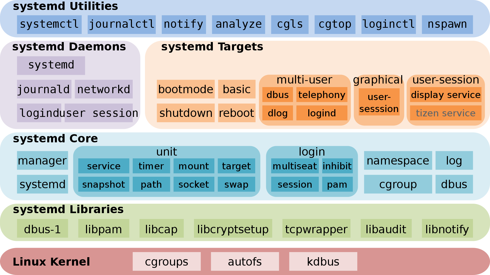

# Основний огляд

**`systemd`**, також відомий як **системний демон**, є різновидом програмного забезпечення ініціалізації в операційній системі GNU/Linux.

Мета розробки:

- забезпечення кращої структури для представлення залежностей між службами
- реалізація паралельного запуску служб при ініціалізації системи
- зменшення витрат оболонки та заміна ініціалізації у стилі SysV

**`systemd`** надає низку системних компонентів для операційної системи GNU/Linux для уніфікації конфігурації служби та поведінки в усіх дистрибутивах GNU/Linux та усунення відмінностей у їх використанні.

З 2015 року більшість дистрибутивів GNU/Linux прийняли `systemd` для заміни традиційних програм ініціалізації, таких як SysV. Варто зазначити, що багато концепцій і дизайнів `systemd` натхненні **launchd** від Apple Mac OS.


Поява `systemd` викликала масові суперечки в спільноті відкритих джерел.

Схвальні відгуки:

- Розробники та користувачі похвалили `systemd` за усунення відмінностей у використанні між GNU/Linux і забезпечення стабільнішого та швидшого готового рішення.

Критика:

- `systemd` бере на себе надто багато компонентів операційної системи, порушуючи принцип UNIX KISS (**K**eep **I**t **S**imple, **S**tupid).
- З точки зору коду, `systemd` є надто складним і громіздким, містить понад мільйон рядків коду, що зменшує зручність обслуговування та збільшує площу атаки.

Офіційний веб-сайт - [https://systemd.io/](https://systemd.io/)
Репозиторій GitHub - [https://github.com/systemd/systemd](https://github.com/systemd/systemd)

## Історія розвитку

У 2010 році двоє програмістів Red Hat, Леннарт Поеттерінг і Кей Сіверс, розробили першу версію `systemd`, щоб замінити традиційний SysV.


У травні 2011 року Fedora 15 стала першим дистрибутивом GNU/Linux, який увімкнув `systemd` за замовчуванням, тоді була названа причина:

> systemd надає потужні можливості розпаралелювання, використовує активацію сокета та D-Bus для запуску служб, пропонує запуск демонов на вимогу, відстежує процеси за допомогою контрольних груп Linux, підтримує знімок і відновлення стану системи, підтримує точки монтування та автоматичного монтування та реалізує потужна логіка керування послугами на основі транзакційних залежностей. Він може працювати як додаткова заміна sysvinit.

У жовтні 2012 року Arch Linux завантажувався з `systemd` за замовчуванням.

З жовтня 2013 року по лютий 2014 року Технічний комітет Debian мав тривалу дискусію щодо списку розсилки Debian, зосереджуючись на тому, «який init має використовувати Debian 8 Jessie як системний за замовчуванням», і врешті вирішив використати `systemd`.

У лютому 2014 року Ubuntu прийняла `systemd` як свій init і відмовилася від власного Upstart.

У серпні 2015 року `systemd` почав надавати оболонки входу, які можна викликати через `machinectl`.

У 2016 році `systemd` виявив уразливість безпеки, яка дозволяє будь-якому непривілейованому користувачеві здійснити «атаку на відмову в обслуговуванні» на `systemd`.

У 2017 році `systemd` виявив ще одну вразливість безпеки - **CVE-2017-9445**. Віддалені зловмисники можуть викликати вразливість переповнення буфера та виконати зловмисний код через зловмисні відповіді DNS.

!!! info "примітка"

```
**Переповнення буфера**: це дефект конструкції програми, який записує у вхідний буфер програми, щоб викликати його переповнення (зазвичай більше даних, ніж максимальний обсяг даних, який може зберігатися в буфері), таким чином порушуючи роботу програми., скориставшись випадком перерви та отримавши контроль над програмою чи навіть системою.
```

## Архітектурний дизайн

Тут автор вибрав як приклад `systemd` той, який використовується Tizen від Samsung для ілюстрації його архітектури.



!!! info "примітка"

```
**Tizen** – мобільна операційна система на основі ядра Linux, яка підтримується Linux Foundation, в основному розроблена та використовується компанією Samsung.
```

!!! info "примітка"

```
Деякі «цілі» `systemd` не належать до компонентів `systemd`, наприклад `telephony`, `bootmode`, `dlog`, `tizen service`, вони належать Tizen.
```

`systemd` використовує модульний дизайн. Багато перемикачів конфігурації існують під час компіляції, щоб визначити, що буде, а що не буде створено, подібно до модульної конструкції ядра Linux. Після компіляції `systemd` може мати до 69 двійкових виконуваних файлів, які виконують такі завдання, зокрема:

- `systemd` працює з PID 1 і забезпечує запуск якомога більшої кількості паралельних служб. Це також керує послідовністю завершення роботи.
- Програма `systemctl` надає інтерфейс користувача для керування послугами.
- Для забезпечення сумісності також надається підтримка сценаріїв SysV і LSB.
- Порівняно з SysV, керування службою systemd і звітність можуть виводити більш детальну інформацію.
- Монтуючи та демонтуючи файлові системи по рівнях, `systemd` може безпечніше каскадувати змонтовані файлові системи.
- `systemd` забезпечує керування базовою конфігурацією компонента, включаючи ім’я хоста, час і дату, мову, журнал тощо.
- Забезпечує керування сокетами.
- Таймери `systemd` забезпечують функції, подібні до запланованих завдань cron.
- Підтримка створення та керування тимчасовими файлами, включаючи видалення.
- Інтерфейс D-Bus дозволяє запускати сценарії, коли пристрій вставлено або вилучено. Таким чином, усі пристрої, незалежно від того, підключаються чи ні, можна розглядати як пристрої, що підключаються та працюють, що значно спрощує обробку пристроїв.
- Інструмент аналізу послідовності запуску можна використовувати для визначення місцезнаходження служби, яка потребує найбільше часу.
- Управління журналами та службовими журналами.

**`systemd` — це не просто програма ініціалізації, це великий програмний пакет, який бере на себе багато системних компонентів.**

## `systemd` як PID 1

Монтування `systemd` визначається за допомогою вмісту файлу **/etc/fstab**, включаючи розділ підкачки.

Конфігурація "ціль" за замовчуванням визначається за допомогою **/etc/systemd/system/default.target**.

Раніше з ініціалізацією SysV існувала концепція **runlevel**. З `systemd` також існує пов’язана таблиця порівняння сумісності, як показано нижче (перераховано в порядку спадання за кількома залежностями):

| цілі systemd      | SystemV runlevel | цільовий псевдонім (м'яке посилання) | опис                                                                                                                                                                                                                                                                    |
| :---------------- | :--------------- | :------------------------------------------------------ | :---------------------------------------------------------------------------------------------------------------------------------------------------------------------------------------------------------------------------------------------------------------------- |
| default.target    |                  |                                                         | Ця «ціль» завжди є м’яким посиланням на «multi-user.target» або «graphical.target». `systemd` завжди використовує "default.target" для запуску системи. Увага, будь ласка! Це не може бути програмне посилання на "halt.target", "poweroff.target" або "reboot.target". |
| graphical.target  | 5                | runlevel5.target                                        | GUI середовище.                                                                                                                                                                                                                                                         |
|                   | 4                | runlevel4.target                                        | Зарезервований і невикористовуваний. У програмі ініціалізації SysV runlevel4 такий самий, як runlevel3. У програмі ініціалізації `systemd` користувачі можуть створювати та налаштовувати цю "ціль" для запуску локальних служб без зміни типового "multi-user.target". |
| multi-user.target | 3                | runlevel3.target                                        | Повноцінний багатокористувацький режим командного рядка.                                                                                                                                                                                                                |
|                   | 2                |                                                         | У SystemV це стосується багатокористувацького режиму командного рядка, який не включає службу NFS.                                                                                                                                                                      |
| rescue.target     | 1                | runlevel1.target                                        | У SystemV це називається **однокористувацький режим**, який запускає мінімальні служби та не запускає інші додаткові програми чи драйвери. В основному використовується для відновлення операційної системи. Він схожий на режим безпеки операційної системи Windows.   |
| emergency.target  |                  |                                                         | В основному еквівалент "rescue.target".                                                                                                                                                                                                                                 |
| reboot.target     | 6                | runlevel6.target                                        | перезавантаження.                                                                                                                                                                                                                                                       |
| poweroff.target   | 0                | runlevel0.target                                        | Закриває операційну систему та вимикає живлення.                                                                                                                                                                                                                        |

```bash
Shell > find  / -iname  runlevel?\.target -a -type l -exec ls -l {} \;
lrwxrwxrwx 1 root root 17 8月  23 03:05 /usr/lib/systemd/system/runlevel4.target -> multi-user.target
lrwxrwxrwx 1 root root 17 8月  23 03:05 /usr/lib/systemd/system/runlevel3.target -> multi-user.target
lrwxrwxrwx 1 root root 13 8月  23 03:05 /usr/lib/systemd/system/runlevel6.target -> reboot.target
lrwxrwxrwx 1 root root 13 8月  23 03:05 /usr/lib/systemd/system/runlevel1.target -> rescue.target
lrwxrwxrwx 1 root root 16 8月  23 03:05 /usr/lib/systemd/system/runlevel5.target -> graphical.target
lrwxrwxrwx 1 root root 15 8月  23 03:05 /usr/lib/systemd/system/runlevel0.target -> poweroff.target
lrwxrwxrwx 1 root root 17 8月  23 03:05 /usr/lib/systemd/system/runlevel2.target -> multi-user.target

Shell > ls -l /etc/systemd/system/default.target
lrwxrwxrwx. 1 root root 41 12月 23 2022 /etc/systemd/system/default.target -> /usr/lib/systemd/system/multi-user.target
```

Кожна «ціль» має набір залежностей, описаних у файлі конфігурації: служби, необхідні для запуску хосту GNU/Linux на певному рівні виконання. Чим більше функцій у вас є, тим більше залежностей вимагає «ціль». Наприклад, середовище GUI вимагає більше послуг, ніж режим командного рядка.

З довідкової сторінки (`man 7 bootup`) ми можемо переглянути діаграму завантаження `systemd`:

```text
 local-fs-pre.target
                    |
                    v
           (various mounts and   (various swap   (various cryptsetup
            fsck services...)     devices...)        devices...)       (various low-level   (various low-level
                    |                  |                  |             services: udevd,     API VFS mounts:
                    v                  v                  v             tmpfiles, random     mqueue, configfs,
             local-fs.target      swap.target     cryptsetup.target    seed, sysctl, ...)      debugfs, ...)
                    |                  |                  |                    |                    |
                    \__________________|_________________ | ___________________|____________________/
                                                         \|/
                                                          v
                                                   sysinit.target
                                                          |
                     ____________________________________/|\________________________________________
                    /                  |                  |                    |                    \
                    |                  |                  |                    |                    |
                    v                  v                  |                    v                    v
                (various           (various               |                (various          rescue.service
               timers...)          paths...)              |               sockets...)               |
                    |                  |                  |                    |                    v
                    v                  v                  |                    v              rescue.target
              timers.target      paths.target             |             sockets.target
                    |                  |                  |                    |
                    v                  \_________________ | ___________________/
                                                         \|/
                                                          v
                                                    basic.target
                                                          |
                     ____________________________________/|                                 emergency.service
                    /                  |                  |                                         |
                    |                  |                  |                                         v
                    v                  v                  v                                 emergency.target
                display-        (various system    (various system
            manager.service         services           services)
                    |             required for            |
                    |            graphical UIs)           v
                    |                  |           multi-user.target
                    |                  |                  |
                    \_________________ | _________________/
                                      \|/
                                       v
                             graphical.target
```

- "sysinit.target" і "basic.target" є контрольними точками під час процесу запуску. Хоча однією з цілей розробки `systemd` є паралельний запуск системних служб, необхідно запустити "цілі" певних служб і функцій перед запуском інших служб і "цілей"
- Після завершення «одиниць», від яких залежить «sysinit.target», запуск перейде до фази «sysinit.target». Ці «одиниці» можна запускати паралельно, зокрема:
  - Монтування файлової системи
  - Налаштування файлу підкачки
  - Запуск udev
  - Встановлення початкового значення генератора випадкових змін
  - Запуск низькорівневої служби
  - Налаштувати служби шифрування
- "sysinit.target" запустить усі низькорівневі служби та "модулі", необхідні для основних функцій операційної системи, які необхідні перед переходом у фазу "basic.target".
- Після завершення фази «sysinit.target» `systemd` запускає всі «одиниці», необхідні для завершення наступної «цілі» (тобто «basic.target»). Ціль надає додаткові функції, зокрема:
  - Встановлення шляхів до каталогу для різних виконуваних файлів.
  - комунікаційні сокети
  - таймери
- Нарешті, ініціалізація виконується для "цілі" на рівні користувача ("multi-user.target" або "graphical.target"). `systemd` має досягти "multi-user.target" перед тим, як ввести "graphical.target".

Ви можете виконати таку команду, щоб побачити залежності, необхідні для повного запуску:

```bash
Shell > systemctl list-dependencies multi-user.target
multi-user.target
● ├─auditd.service
● ├─chronyd.service
● ├─crond.service
● ├─dbus.service
● ├─irqbalance.service
● ├─kdump.service
● ├─NetworkManager.service
● ├─sshd.service
● ├─sssd.service
● ├─systemd-ask-password-wall.path
● ├─systemd-logind.service
● ├─systemd-update-utmp-runlevel.service
● ├─systemd-user-sessions.service
● ├─tuned.service
● ├─basic.target
● │ ├─-.mount
● │ ├─microcode.service
● │ ├─paths.target
● │ ├─slices.target
● │ │ ├─-.slice
● │ │ └─system.slice
● │ ├─sockets.target
● │ │ ├─dbus.socket
● │ │ ├─sssd-kcm.socket
● │ │ ├─systemd-coredump.socket
● │ │ ├─systemd-initctl.socket
● │ │ ├─systemd-journald-dev-log.socket
● │ │ ├─systemd-journald.socket
● │ │ ├─systemd-udevd-control.socket
● │ │ └─systemd-udevd-kernel.socket
● │ ├─sysinit.target
● │ │ ├─dev-hugepages.mount
● │ │ ├─dev-mqueue.mount
● │ │ ├─dracut-shutdown.service
● │ │ ├─import-state.service
● │ │ ├─kmod-static-nodes.service
● │ │ ├─ldconfig.service
● │ │ ├─loadmodules.service
● │ │ ├─nis-domainname.service
● │ │ ├─proc-sys-fs-binfmt_misc.automount
● │ │ ├─selinux-autorelabel-mark.service
● │ │ ├─sys-fs-fuse-connections.mount
● │ │ ├─sys-kernel-config.mount
● │ │ ├─sys-kernel-debug.mount
● │ │ ├─systemd-ask-password-console.path
● │ │ ├─systemd-binfmt.service
● │ │ ├─systemd-firstboot.service
● │ │ ├─systemd-hwdb-update.service
● │ │ ├─systemd-journal-catalog-update.service
● │ │ ├─systemd-journal-flush.service
● │ │ ├─systemd-journald.service
● │ │ ├─systemd-machine-id-commit.service
● │ │ ├─systemd-modules-load.service
● │ │ ├─systemd-random-seed.service
● │ │ ├─systemd-sysctl.service
● │ │ ├─systemd-sysusers.service
● │ │ ├─systemd-tmpfiles-setup-dev.service
● │ │ ├─systemd-tmpfiles-setup.service
● │ │ ├─systemd-udev-trigger.service
● │ │ ├─systemd-udevd.service
● │ │ ├─systemd-update-done.service
● │ │ ├─systemd-update-utmp.service
● │ │ ├─cryptsetup.target
● │ │ ├─local-fs.target
● │ │ │ ├─-.mount
● │ │ │ ├─boot.mount
● │ │ │ ├─systemd-fsck-root.service
● │ │ │ └─systemd-remount-fs.service
● │ │ └─swap.target
● │ │   └─dev-disk-by\x2duuid-76e2324e\x2dccdc\x2d4b75\x2dbc71\x2d64cd0edb2ebc.swap
● │ └─timers.target
● │   ├─dnf-makecache.timer
● │   ├─mlocate-updatedb.timer
● │   ├─systemd-tmpfiles-clean.timer
● │   └─unbound-anchor.timer
● ├─getty.target
● │ └─getty@tty1.service
● └─remote-fs.target
```

Ви також можете використовувати опцію `--all`, щоб розгорнути всі "одиниці".

## Використання `systemd`

### Типи юнітів

Команда `systemctl` є основним інструментом для керування `systemd`, комбінацією попередніх команд `service` і команд `chkconfig`.

`systemd` керує так званими "одиницями", які представляють системні ресурси та служби. У наступному списку показано типи «юнітів», якими може керувати `systemd`:

- **service** - Служба в системі, включаючи інструкції щодо запуску, перезапуску та зупинки служби. Дивіться `man 5 systemd.service`.
- **socket** - Мережевий сокет, пов’язаний зі службою. Дивіться `man 5 systemd.socket`.
- **device** - Пристрій, спеціально керований за допомогою `systemd`. Дивись `man 5 systemd.device`.
- **mount** - Точка монтування, керована за допомогою `systemd`. Дивись `man 5 systemd.mount`.
- **automount** - Точка монтування автоматично монтується на завантажувачі. Дивись `man 5 systemd.automount`.
- **swap** - Поміняти місце в системі. Дивись `man 5 systemd.swap`.
- **target** - Точка синхронізації для інших блоків. Зазвичай використовується для запуску активних служб під час завантаження. Дивись `man 5 systemd.target`.
- **path** - Шлях для активації на основі шляху. Наприклад, ви можете запускати служби на основі стану певного шляху, наприклад, чи існує він чи ні. Дивись `man 5 systemd.path`.
- **timer** - Таймер для планування активації іншого блоку. Дивись `man 5 systemd.timer`.
- **snapshot** - Знімок поточного стану `systemd`. Зазвичай використовується для відкоту після внесення тимчасових змін до `системи`.
- **slice** - Обмеження ресурсів через вузли Linux Control Group (cgroups). Дивись `man 5 systemd.slice`.
- **scope** - Інформація з інтерфейсів шини `systemd`. Зазвичай використовується для керування процесами зовнішньої системи. Дивись `man 5 systemd.scope`.

### Оперативні "юніти"

Використання команди `systemictl` - `systemctl [OPTIONS...] COMMAND [UNIT...]`.

COMMAND можна розділити на:

- Команди юнітів
- Команди Unit File
- Машинні команди
- Job Commands
- Команди середовища
- Команди життєвого циклу менеджера
- Системні команди

Ви можете використовувати `systemctl --help`, щоб дізнатися деталі.

Ось кілька поширених демонстраційних команд:

```bash
# Start the service
Shell > systemctl start sshd.service

# Stop the service
Shell > systemctl stop sshd.service

# Reload the service
Shell > systemctl reload sshd.service

# Restart the service
Shell > systemctl restart sshd.service

# View the status of the service
Shell > systemctl status sshd.service

# The service starts automatically after the system starts
Shell > systemctl enable sshd.service

# The service stops automatically after the system starts
Shell > systemctl disable sshd.service

# Check if the service automatically starts after startup
Shell > systemctl is-enabled sshd.service

# Mask one unit
Shell > systemctl mask sshd.service

# Unmask one unit
Shell > systemctl unmask sshd.service

# View the file contents of unit
Shell > systemctl cat sshd.service

# Edit the contents of the unit file and save it in the /etc/systemd/system/ directory after editing
Shell > systemctl edit sshd.service

# View the complete properties of unit
Shell > systemctl show sshd.service
```

!!! info "примітка"

```
Ви можете працювати з одним або декількома блоками в одному командному рядку для вищевказаних операцій. Наведені вище операції не обмежуються ".service".
```

Про "юніти":

```bash
# List all currently running units.
Shell > systemctl
## or
Shell > systemctl list-units
## You can also add "--type=TYPE" for type filtering
Shell > systemctl --type=target

# List all unit files. You can also filter using "--type=TYPE"
Shell > systemctl list-unit-files
```

Про "цілі":

```bash
# Query current "target" ("runlevel") information
Shell > systemctl get-default
multi-user.target

# Switch "target"（"runlevel"）. For example, you need to switch to the GUI environment
Shell > systemctl isolate graphical.target

# Define the default "target" ("runlevel")
Shell > systemctl set-default graphical.target
```

### Важливі каталоги

Існує три основні важливі каталоги, розташовані в порядку зростання пріоритету:

- **/usr/lib/systemd/system/** - Файли модуля Systemd, що розповсюджуються разом із встановленими пакетами RPM. Подібно до каталогу /etc/init.d/ для Centos 6.
- **/run/systemd/system/** - Файли модуля Systemd, створені під час виконання.
- **/etc/systemd/system/** - Файли модуля Systemd, створені за допомогою `systemctl enable`, і файли модуля, додані для розширення служби.

### Конфігураційні файли `systemd`

`man 5 systemd-system.conf`:

> При запуску як системного екземпляра systemd інтерпретує файл конфігурації "system.conf" і файли в каталогах "system.conf.d"; коли він запускається як екземпляр користувача, він інтерпретує файл конфігурації user.conf (у домашньому каталозі користувача або, якщо його не знайдено, у "/etc/systemd/") та файли в "user.conf.d" довідники. Ці конфігураційні файли містять кілька налаштувань, які керують основними операціями менеджера.

В операційній системі Rocky Linux 8.x відповідні конфігураційні файли:

- **/etc/systemd/system.conf** - Редагує файл, щоб змінити налаштування. Видалення файлу відновлює налаштування за замовчуванням. Дивись `man 5 systemd-system.conf`
- **/etc/systemd/user.conf** - Ви можете змінити директиви в цьому файлі, створивши файли в "/etc/systemd/user.conf.d/\*.conf". Дивись `man 5 systemd-user.conf`

### Опис вмісту файлу одиниць `systemd`

Візьмемо для прикладу файл sshd.service:

```bash
Shell > systemctl cat sshd.service
[Unit]
Description=OpenSSH server daemon
Documentation=man:sshd(8) man:sshd_config(5)
After=network.target sshd-keygen.target
Wants=sshd-keygen.target

[Service]
Type=notify
EnvironmentFile=-/etc/crypto-policies/back-ends/opensshserver.config
EnvironmentFile=-/etc/sysconfig/sshd
ExecStart=/usr/sbin/sshd -D $OPTIONS $CRYPTO_POLICY
ExecReload=/bin/kill -HUP $MAINPID
KillMode=process
Restart=on-failure
RestartSec=42s

[Install]
WantedBy=multi-user.target
```

Як бачите, вміст файлу модуля має той самий стиль, що й файл конфігурації мережевої карти RL 9. Він використовує ++open-bracket++ і ++close-bracket++ для включення заголовка, а під заголовком розташовані відповідні пари ключ-значення.

```bash
# RL 9
Shell > cat /etc/NetworkManager/system-connections/ens160.nmconnection
[connection]
id=ens160
uuid=5903ac99-e03f-46a8-8806-0a7a8424497e
type=ethernet
interface-name=ens160
timestamp=1670056998

[ethernet]
mac-address=00:0C:29:47:68:D0

[ipv4]
address1=192.168.100.4/24,192.168.100.1
dns=8.8.8.8;114.114.114.114;
method=manual

[ipv6]
addr-gen-mode=default
method=disabled

[proxy]
```

Зазвичай існує три назви для одиниці типу ".service":

- **Unit**
- **Service**
- **Install**

1. Назва підрозділу

   Можна використовувати наступні пари ключ-значення:

   - `Description=OpenSSH server daemon`. Рядок використовується для опису "одиниці".
   - `Documentation=man:sshd(8) man:sshd_config(5)`.  Відокремлений пробілами список URI, що посилається на документацію для цього «блока» або його конфігурації. Приймаються лише URI типів "http\://", "https\://", "file:", "info:", "man:".
   - `After=network.target sshd-keygen.target`. Визначає зв'язок послідовності запуску з іншими "одиницями". У цьому прикладі "network.target" і "sshd-keygen.target" починаються першими, а "sshd.service" починається останнім.
   - `Before=`. Визначте зв’язок послідовності запуску з іншими «одиницями».
   - `Requires=`. Налаштувати залежності від інших «одиниць». Значення можуть бути кількома одиницями, розділеними пробілами. Якщо поточна «одиниця» активована, значення, наведені тут, також активуються. Якщо принаймні одне з перелічених значень "одиниці" не вдається успішно активувати, `systemd` не запускає поточний "блок".
   - `Wants=sshd-keygen.target`. Подібно до ключа `Requires`. Різниця в тому, що якщо залежний блок не запускається, це не вплине на нормальну роботу поточного «блока».
   - `BindsTo=`. Подібно до ключа `Requires`. Різниця полягає в тому, що якщо будь-який залежний "блок" не запускається, поточний блок зупиняється на додаток до "блоку", який зупиняє залежність.
   - `PartOf=`. Подібно до ключа `Requires`. Різниця полягає в тому, що якщо будь-який залежний «блок» не запускається, окрім зупинки та перезапуску залежних блоків, поточний «блок» буде зупинено та перезапущено.
   - `Conflicts=`. Його значенням є список одиниць, розділених пробілами. Якщо «одиниця», зазначена у значенні, працює, поточна «одиниця» працювати не може.
   - `OnFailure=`. Коли поточна «одиниця» виходить з ладу, активується «одиниця» або «одиниці» (відокремлені пробілами) у значенні.

   Дивись `man 5 systemd.unit`.

2. Назва служби

   Можна використовувати наступні пари ключ-значення:

   - `Type=notify`. Налаштуйте тип цього блоку ".service", який може бути одним із таких:
     - `simple` - Сервіс запускається як основний процес. Це значення за умовчанням.
     - `forking` - Служба викликає роздвоєні процеси та працює як частина основного демона.
     - `exec` - Схожий до `simple`. Менеджер служби запустить цей блок одразу після виконання двійкового файлу основної служби. Інші підрозділи-наступники повинні залишатися заблокованими до цього моменту, перш ніж вони зможуть продовжити роботу.
     - `oneshot` - Подібно до `simple`, за винятком того, що процес має завершитися, перш ніж `systemd` запустить наступні служби.
     - `dbus` - Подібно до `simple`, за винятком того, що демон отримує назву шини D-Bus.
     - `notify` - Подібно до `simple`, за винятком того, що демон надсилає сповіщення за допомогою `sd_notify` або еквівалентного виклику після запуску.
     - `idle` - Подібно до «simple», за винятком того, що виконання служби відкладено, доки не буде відправлено всі активні завдання.
   - `RemainAfterExit=`. Чи слід вважати поточну службу активною, коли завершуються всі процеси служби. За замовчуванням ні.
   - `GuessMainPID=`. Значення має тип boolean і за замовчуванням yes. За відсутності чіткого розташування основного процесу служби, `systemd` має вгадати PID основного процесу (який може бути неправильним). Якщо ви встановите `Type=forking` і не встановите `PIDFile`, ця пара ключ-значення вступить у силу. В іншому випадку ігноруйте пару ключ-значення.
   - `PIDFile=`. Вкажіть шлях до файлу (абсолютний шлях) PID служби. Для служб `Type=forking` рекомендується використовувати цю пару ключ-значення. `systemd` зчитує PID основного процесу демона після запуску служби.
   - `BusName=`. Назва шини D-Bus, щоб дістатися до цієї служби. Цей параметр є обов’язковим для служб, де використовується `Type=dbus`.
   - `ExecStart=/usr/sbin/sshd -D $OPTIONS $CRYPTO_POLICY`. Команди та аргументи виконуються під час запуску служби.
   - `ExecStartPre=`. Інші команди виконуються перед командами в `ExecStart`.
   - `ExecStartPost=`. Інші команди виконуються після команд у `ExecStart`.
   - `ExecReload=/bin/kill -HUP $MAINPID`. Команди та аргументи запускаються під час перезавантаження служби.
   - `ExecStop=`. Команди та аргументи запускаються, коли служба зупиняється.
   - `ExecStopPost=`. Додаткові команди для запуску після зупинки служби.
   - `RestartSec=42s`. Час у секундах до переходу в режим сну перед перезапуском служби.
   - `TimeoutStartSec=`. Час очікування запуску служби в секундах.
   - `TimeoutStopSec=`. Час у секундах очікування зупинки служби.
   - `TimeoutSec=`. Скорочення для одночасного налаштування `TimeoutStartSec` і `TimeoutStopSec`.
   - `RuntimeMaxSec=`. Максимальний час роботи служби в секундах. Передає `infinity` (за замовчуванням), щоб не налаштувати обмеження часу виконання.
   - `Restart=on-failure`. Налаштовує, чи потрібно перезапускати службу, коли процес служби завершується, завершується або досягає тайм-ауту:
     - `no` - Служба не буде перезапущена. Це значення за умовчанням.
     - `on-success` - Перезапускається лише тоді, коли сервісний процес закінчується чисто (код виходу 0).
     - `on-failure` - Перезапускається лише тоді, коли процес обслуговування не завершується належним чином (код виходу node-zero).
     - `on-abnormal` - Перезапускається, якщо процес завершується сигналом або коли настає тайм-аут.
     - `on-abort` - Перезапускається, якщо процес завершується через неперехоплений сигнал, не вказаний як чистий статус виходу.
     - `on-watchdog` -  Якщо встановлено значення `on-watchdog`, служба перезапуститься лише після закінчення тайм-ауту сторожового таймера.
     - `always` - Завжди перезапускається.

   Причини виходу та вплив на них налаштувань `Restart=`:

   

   - `KillMode=process`. Визначає, як процеси цього блоку мають бути припинені. Його значення може бути одним із таких:
     - `control-group` - Значення за замовчуванням. Якщо встановлено значення `control-group`, усі решта процесів у групі керування цього блоку припиняються під час зупинки блоку.
     - `process` - Знищується лише основний процес.
     - `mixed` - Сигнал SIGTERM надсилається головному процесу, тоді як наступний сигнал SIGKILL надсилається всім іншим процесам групи керування блоком.
     - `none` - Не вбиває жодних процесів.
   - `PrivateTmp=`. Чи використовувати приватний каталог tmp. Виходячи з певної безпеки, рекомендовано встановити значення так.
   - `ProtectHome=`. Чи захищати домашній каталог. Його значення може бути одним із таких:
     - `yes` - Три каталоги (/root/, /home/, /run/user/) не видимі для пристрою.
     - `no` - Три каталоги видимі для пристрою.
     - `read-only` - Три каталоги доступні лише для читання.
     - `tmpfs` - Тимчасова файлова система буде змонтована в режимі лише для читання в цих трьох каталогах.
   - `ProtectSystem=`. Каталог використовується для захисту системи від модифікації службою. Значення може бути:
     - `yes` - Вказує, що процес, викликаний модулем, буде змонтовано лише для читання до каталогів /usr/ і /boot/.
     - `no` - За замовченням
     - `full` - Вказує, що каталоги /usr/, /boot/, /etc/ монтуються лише для читання.
     - `strict` - Усі файлові системи монтуються лише для читання (за винятком каталогів віртуальних файлових систем, таких як /dev/, /proc/ і /sys/).
   - `EnvironmentFile=-/etc/crypto-policies/back-ends/opensshserver.config`. Читання змінних середовища з текстового файлу. «-» означає, що якщо файл не існує, він не буде прочитаний, а помилки чи попередження не реєструватимуться.

   Дивись `man 5 systemd.service`.

3. Назва установки

   - `Alias=`. Список додаткових імен, розділених пробілами. Увага, будь ласка! Ваша додаткова назва повинна мати той самий тип (суфікс), що й поточна одиниця.

   - `RequiredBy=` or `WantedBy=multi-user.target`. Визначте одиницю поточної операції як залежність одиниці від значення. Після завершення визначення ви зможете знайти відповідні файли в каталозі /etc/systemd/systemd/. Наприклад:

     ```bash
     Shell > systemctl is-enabled chronyd.service
     enabled

     Shell > systemctl cat chronyd.service
     ...
     [Install]
     WantedBy=multi-user.target

     Shell > ls -l /etc/systemd/system/multi-user.target.wants/
     total 0
     lrwxrwxrwx. 1 root root 38 Sep 25 14:03 auditd.service -> /usr/lib/systemd/system/auditd.service
     lrwxrwxrwx. 1 root root 39 Sep 25 14:03 chronyd.service -> /usr/lib/systemd/system/chronyd.service  ←←
     lrwxrwxrwx. 1 root root 37 Sep 25 14:03 crond.service -> /usr/lib/systemd/system/crond.service
     lrwxrwxrwx. 1 root root 42 Sep 25 14:03 irqbalance.service -> /usr/lib/systemd/system/irqbalance.service
     lrwxrwxrwx. 1 root root 37 Sep 25 14:03 kdump.service -> /usr/lib/systemd/system/kdump.service
     lrwxrwxrwx. 1 root root 46 Sep 25 14:03 NetworkManager.service -> /usr/lib/systemd/system/NetworkManager.service
     lrwxrwxrwx. 1 root root 40 Sep 25 14:03 remote-fs.target -> /usr/lib/systemd/system/remote-fs.target
     lrwxrwxrwx. 1 root root 36 Sep 25 14:03 sshd.service -> /usr/lib/systemd/system/sshd.service
     lrwxrwxrwx. 1 root root 36 Sep 25 14:03 sssd.service -> /usr/lib/systemd/system/sssd.service
     lrwxrwxrwx. 1 root root 37 Sep 25 14:03 tuned.service -> /usr/lib/systemd/system/tuned.service
     ```

   - `Also=`. Інші пристрої для встановлення або видалення під час встановлення або видалення цього пристрою.

     На додаток до сторінок посібника, згаданих вище, ви також можете ввести `man 5 systemd.exec` або `man 5 systemd.kill`, щоб отримати доступ до іншої інформації.

## Команда, пов'язана з іншими компонентами

- `timedatactl` - Запитує або змінює параметри системного часу та дати.
- `hostnamectl` - Запитує або змінює назву хоста системи.
- `localectl` - Запитує або змінює локаль системи та налаштування клавіатури.
- `systemd-analyze` - Профіль `systemd`, показує залежності модулів, перевіряє файли модулів.
- `journalctl` - Переглядає системні або службові журнали. Команда `journalctl` настільки важлива, що пізніше буде окремий розділ, де пояснюватиметься її використання та на що слід звернути увагу.
- `loginctl` - Управління сеансами користувачів, які ввійшли в систему.
