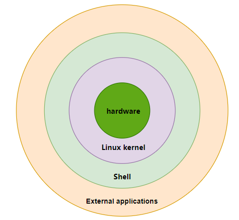

# Basic Introduction

**What is Shell?**

Shell is called a **command interface** or **command interpreter**. It provides a system level interface program for users to send requests to the Linux kernel for running programs.

When introducing the operating system, we mentioned the following sentence:

> Intercept **access to peripherals**. Software is rarely allowed to access hardware directly (except for graphics cards for very specific needs).

The bottom layer is hardware devices, managed by the Linux kernel. When people remotely connect to the server through SSH and type various commands, the Linux kernel does not recognize these words or letters. As is well known, computers can recognize machine languages such as 0 and 1. In order to complete the conversion of human language and machine language, a two-way translation officer similar to that in real life was introduced into the operating system, that is, Shell.

It works like this:

**People from Country A** <<--->> **Shell** <<--->> **People from Country B**

From a user perspective, Shell is actually a human-computer interaction interface, and the interaction interfaces of modern operating systems mainly include:

* Command line interaction interface. For example, operating systems like **RockyLinux** and **Debian** that serve as server roles.
* Graphical interactive interface. For example, the **Windows 11** operating system for home and office environments.
* Command line and graphical mixed interactive interface. For example, **mint**, **Ubuntu** with graphical environment, **Windows Server** with Powershell, etc.

Shell classification:

* Bourne Shell - This family includes but is not limited to:
    * sh (Bourne Shell, /usr/bin/sh). It was developed at Bell LABS in 1977 by Stephen Bourne and used on V7 UNIX
    * ksh (Korn Shell, /usr/bin/ksh)
    * Bash (GNU Bourne-Again Shell, /bin/bash) - Born in 1987, it is the product of the GNU Project. Most GNU/Linux operating systems use bash as their default shell
    * psh (POSIX Shell)
    * zsh (Z-shell)
* C Shell - This family includes but is not limited to:
    * csh
    * tcsh
* Power Shell

