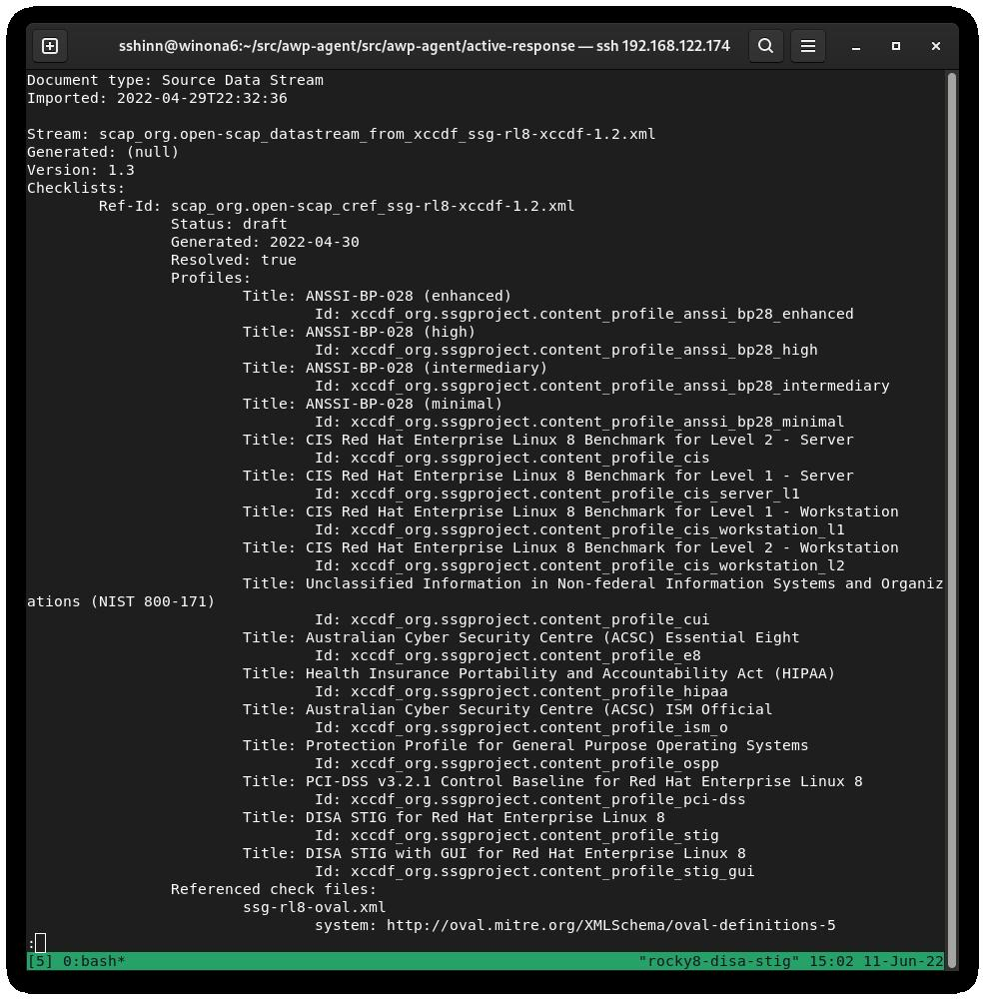
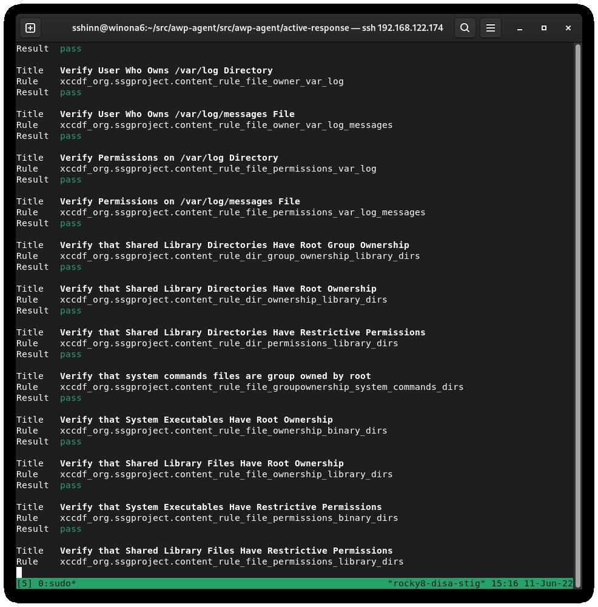
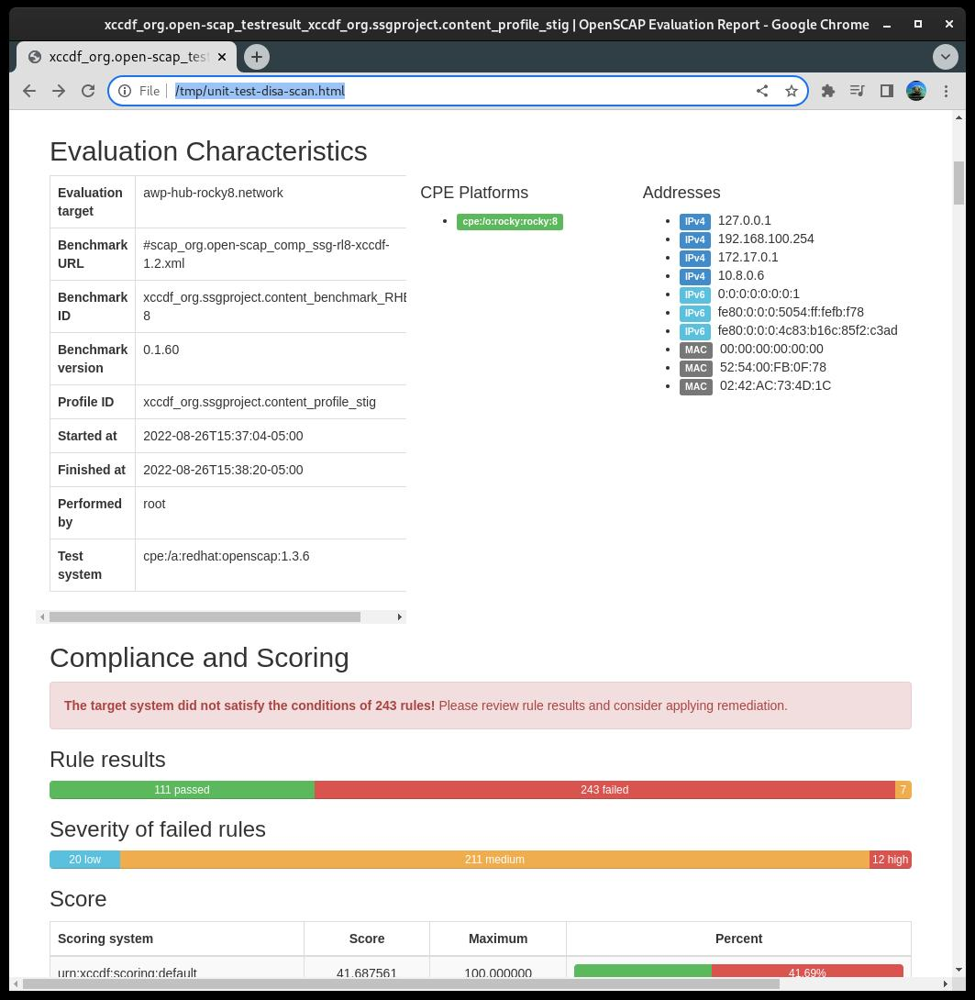
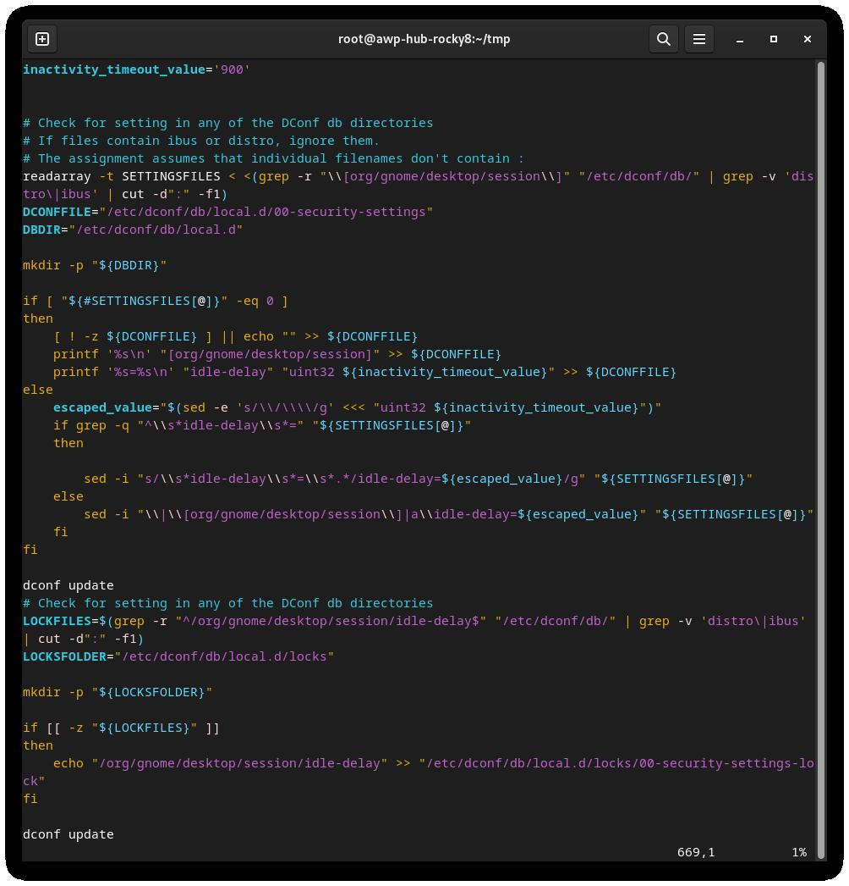
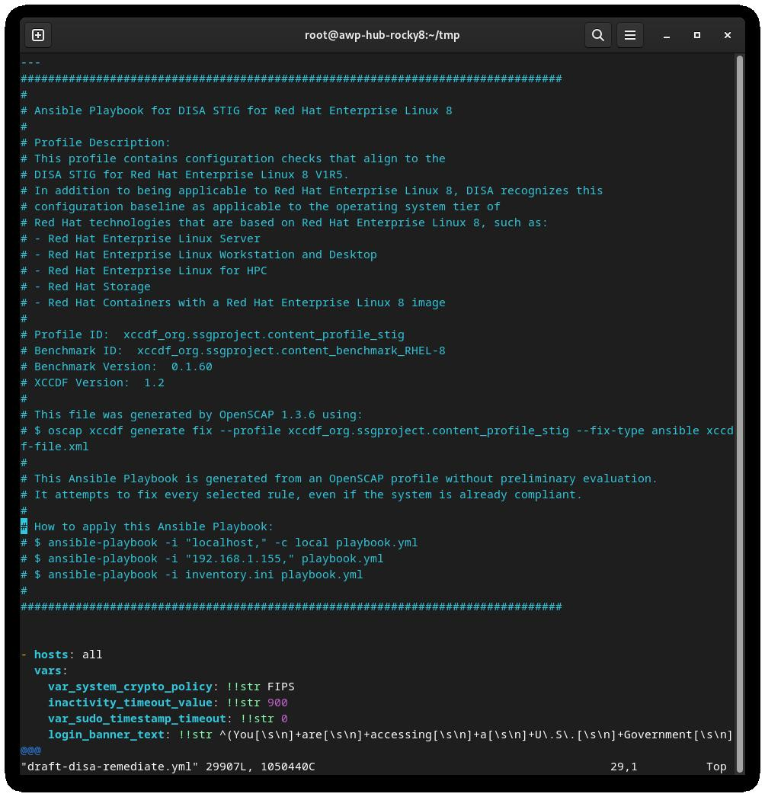

# Вступ

У попередній статті ми налаштували нову систему Linux 8 із застосуванням DISA stig за допомогою [OpenSCAP](https://www.openscap.org). Тепер ми розглянемо, як перевірити систему за допомогою тих самих інструментів, і розглянемо, які типи звітів ми можемо створювати за допомогою інструментів oscap і аналога SCAP Workbench для інтерфейсу користувача.

Rocky Linux 8 (і 9!) містить набір вмісту [SCAP](https://csrc.nist.gov/projects/security-content-automation-protocol) для тестування та виправлення відповідності проти різних стандартів. Якщо ви створили систему STIG’d у частині 1, ви вже бачили це в дії. Інсталятор anaconda використовував цей вміст, щоб змінити конфігурацію rocky 8 для впровадження різних елементів керування, встановлення/видалення пакетів і зміни способу роботи точок монтування рівня ОС.

З часом ці речі можуть змінитися, і ви захочете стежити за цим. Часто я також використовую ці звіти, щоб показати доказ того, що певний контроль було реалізовано правильно. У будь-якому випадку, це запекло в Rocky. Ми почнемо з деяких основ.

## Список профілів безпеки

Щоб отримати список доступних профілів безпеки, нам потрібно використати команду `oscap info`, яку надає пакет `openscap-scanner`. Це має бути вже встановлено у вашій системі, якщо ви стежите за цим, починаючи з частини 1.  Щоб отримати доступні профілі безпеки:

```
oscap info /usr/share/xml/scap/ssg/content/ssg-rl8-ds.xml
```

!!! note "Примітка"

    Вміст Rocky Linux 8 використовуватиме тег «rl8» у назві файлу. У Rocky 9 це буде «rl9».

Якщо все піде добре, ви повинні отримати екран, який виглядає приблизно так:



DISA — це лише один із багатьох профілів безпеки, які підтримуються визначеннями Rocky Linux SCAP. У нас також є профілі для:

* [ANSSI](https://www.ssi.gouv.fr/en/)
* [CIS](https://cisecurity.org)
* [Australian Cyber Security Center](https://cyber.gov.au)
* [NIST-800-171](https://csrc.nist.gov/publications/detail/sp/800-171/rev-2/final)
* [HIPAA](https://www.hhs.gov/hipaa/for-professionals/security/laws-regulations/index.html)
* [PCI-DSS](https://www.pcisecuritystandards.org/)

## Аудит відповідності DISA STIG

Тут є два типи на вибір:

* stig - без графічного інтерфейсу
* stig_gui – з графічним інтерфейсом

Запуск сканування та створення HTML-звіту для DISA STIG:

```
sudo oscap xccdf eval --report unit-test-disa-scan.html --profile stig /usr/share/xml/scap/ssg/content/ssg-rl8-ds.xml
```

Це призведе до такого звіту:



І виведе звіт HTML:



## Створення сценаріїв Bash для виправлення

Далі ми згенеруємо сканування, а потім використаємо результати сканування для створення сценарію bash для відновлення системи на основі профілю stig DISA. Я не рекомендую використовувати автоматичне виправлення, вам слід завжди переглядати зміни перед їх фактичним запуском.

1) Згенеруйте сканування системи:
    ```
    sudo oscap xccdf eval --results disa-stig-scan.xml --profile stig /usr/share/xml/scap/ssg/content/ssg-rl8-ds.xml
    ```
2) Використовуйте цей результат сканування, щоб створити сценарій:
    ```
    sudo oscap xccdf generate fix --output draft-disa-remediate.sh --profile stig disa-stig-scan.xml
    ```

Отриманий сценарій міститиме всі зміни, які він внесе в систему.

!!! важливо

    Перегляньте це, перш ніж запускати! Це внесе значні зміни в систему.



## Створення підручників щодо виправлення

Ви також можете створити дії з виправлення у форматі ansible playbook. Давайте повторимо наведений вище розділ, але цього разу з виводом ansible:

1) Згенеруйте сканування системи:
    ```
    sudo oscap xccdf eval --results disa-stig-scan.xml --profile stig /usr/share/xml/scap/ssg/content/ssg-rl8-ds.xml
    ```
2) Використовуйте цей результат сканування, щоб створити сценарій:
    ```
    sudo oscap xccdf generate fix --fix-type ansible --output draft-disa-remediate.yml --profile stig disa-stig-scan.xml
    ```

!!! важливо

    Знову ж таки, перегляньте це перед запуском! Ви відчуваєте тут закономірність? Цей етап перевірки для всіх цих процедур дуже важливий!



## Про автора

Скотт Шінн є технічним директором Atomicorp і є частиною команди Rocky Linux Security. Він брав участь у федеральних інформаційних системах Білий дім, Міністерство оборони та розвідки з 1995 року. Частково це було створення STIG і вимоги що ви використовуєте їх, і мені дуже шкода про це.

