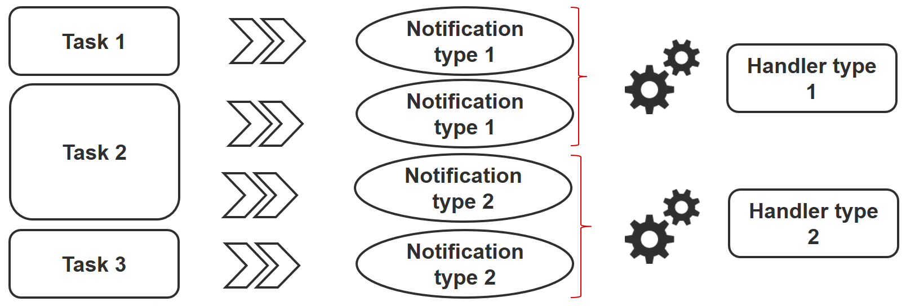

# Ansible - Tutoriel Niveau Intermédiaire

Dans ce chapitre, vous allez approfondir vos connaissances sur Ansible.

****

**Objectifs** : Dans ce chapitre, vous apprendrez à :

:heavy_check_mark: travailler avec des variables ;  
:heavy_check_mark: utiliser des boucles ;  
:heavy_check_mark: gérer les changements d'état et réagir en conséquence ;  
:heavy_check_mark: gérer des tâches asynchrones.

:checkered_flag: **ansible**, **module**, **playbook**

**Connaissances** : :star: :star: :star:  
**Complexité** : :star: :star:

**Temps de lecture** : 30 minutes

****

Dans le chapitre précédent, vous avez appris à installer Ansible, à l'utiliser en ligne de commande ou comment écrire des playbooks pour permettre la réutilisation de votre code.

Dans ce chapitre, nous pouvons commencer à découvrir des notions plus avancées sur la façon d'utiliser Ansible et quelques tâches intéressantes que vous utiliserez très régulièrement.

## Les variables

!!! note "Remarque"

    Pour de plus amples détails veuillez consulter la documentation Plus [ici](https://docs.ansible.com/ansible/latest/user_guide/playbooks_variables.html).

Sous Ansible, il y a différents types de variables primitives :

* chaînes de caractères,
* nombres entiers,
* booléens.

Ces variables peuvent être organisées ainsi :

* dictionnaires,
* listes.

Une variable peut être définie à différents endroits, comme dans un playbook, dans un rôle ou à partir de la ligne de commande par exemple.

Par exemple, à partir d'un playbook :

```bash
---
- hosts: apache1
  vars:
    port_http: 80
    service:
      debian: apache2
      rhel: httpd
```

ou depuis la ligne de commande :

```bash
ansible-playbook deploy-http.yml --extra-vars "service=httpd"
```

Une fois définie, une variable peut être utilisée en l'appelant entre des accolades doubles :

* `{{ port_http }}` pour une valeur simple,
* `{{ service['rhel'] }}` ou `{{ service.rhel }}` pour un dictionnaire.

Par exemple :

```bash
- name: make sure apache is started
  ansible.builtin.systemd:
    name: "{{ service['rhel'] }}"
    state: started
```

Bien sûr, il est également possible d'accéder aux variables globales les faits  (**facts**) d'Ansible (type d'OS, adresses IP, nom de la VM, etc.).

### Variables d'externalisation

Les variables peuvent être incluses dans un fichier externe au playbook, auquel cas ce fichier doit être défini dans le playbook avec la directive `vars_files` :

```bash
---
- hosts: apache1
  vars_files:
    - myvariables.yml
```

Le fichier `myvariables.yml` :

```bash
---
port_http: 80
ansible.builtin.systemd::
  debian: apache2
  rhel: httpd
```

Il peut également être ajouté dynamiquement avec l'utilisation du module `include_vars` :

```bash
- name: Include secrets.
  ansible.builtin.include_vars:
    file: vault.yml
```

### Afficher une variable

Pour afficher une variable, vous devez activer le module `debug` comme suit :

```bash
- ansible.builtin.debug:
    var: service['debian']
```

Vous pouvez également utiliser la variable à l'intérieur d'un texte :

```bash
- ansible.builtin.debug:
    msg: "Print a variable in a message : {{ service['debian'] }}"
```

### Enregistrer le retour d'une tâche

Pour enregistrer le retour d'une tâche et pouvoir y accéder plus tard, vous devez utiliser le mot clé `register` dans la tâche elle-même.

Utilisation d'une variable stockée :

```bash
- name: /home content
  shell: ls /home
  register: homes

- name: Print the first directory name
  ansible.builtin.debug:
    var: homes.stdout_lines[0]

- name: Print the first directory name
  ansible.builtin.debug:
    var: homes.stdout_lines[1]
```

!!! note "Remarque"

    La variable `homes.stdout_lines` est une liste de variables de type 'string', un moyen d'organiser des variables que nous n'avions pas encore rencontrées.

Les chaînes qui composent la variable stockée peuvent être accédées via la valeur `stdout` (qui vous permet de faire des choses comme `homes.stdout.find("core") != -1`), pour les exploiter en utilisant une boucle (voir `loop`) ou simplement par leurs indices tels que ce qui est illustré dans l'exemple précédent.

### Exercices :

* Écrire un playbook `play-vars.yml` qui affiche le nom de la distribution de la cible avec sa version majeure, en utilisant des variables globales.

* Écrivez un playbook en utilisant le dictionnaire suivant pour afficher les services qui seront installés :

```bash
service:
  web:
    name: apache
    rpm: httpd
  db:
    name: mariadb
    rpm: mariadb-server
```

Le type par défaut doit être "web".

* Remplacer la valeur de la variable `type` en utilisant la ligne de commande

* Externaliser les variables dans un fichier `vars.yml`

## Gestion de boucles

Avec l'aide d'une boucle, vous pouvez itérer une tâche sur une liste, un hachage ou un dictionnaire par exemple.

!!! note "Remarque"

    Plus d'informations peuvent être [trouvées ici](https://docs.ansible.com/ansible/latest/user_guide/playbooks_loops.html).

Exemple d'utilisation simple, création de quatre utilisateurs :

```bash
- name: add users
  user:
    name: "{{ item }}"
    state: present
    groups: "users"
  loop:
     - antoine
     - patrick
     - steven
     - xavier
```

À chaque itération de la boucle, la valeur de la liste utilisée est stockée dans la variable `item` accessible dans le code de la boucle.

Bien sûr, une liste peut être définie dans un fichier externe :

```bash
users:
  - antoine
  - patrick
  - steven
  - xavier
```

et être utilisé dans la tâche comme ceci (après avoir inclus le fichier vars) :

```bash
- name: add users
  user:
    name: "{{ item }}"
    state: present
    groups: "users"
  loop: "{{ users }}"
```

Nous pouvons utiliser l'exemple vu lors de l'étude des variables stockées pour l'améliorer. Utilisation d'une variable stockée :

```bash
- name: /home content
  shell: ls /home
  register: homes

- name: Print the directories name
  ansible.builtin.debug:
    msg: "Directory => {{ item }}"
  loop: "{{ homes.stdout_lines }}"
```

Un dictionnaire peut également être utilisé dans une boucle.

Dans ce cas, vous devrez transformer le dictionnaire en un élément avec ce que l'on appelle un filtre **jinja** (jinja est le moteur utilisé par Ansible) : `| dict2items`.

Dans la boucle, il devient possible d'utiliser `item.key` qui correspond à la clé de dictionnaire et `item.value` qui correspond à la valeur de la clé.

Voyons cela à travers un exemple concret, montrant la gestion des utilisateurs du système :

```bash
---
- hosts: rocky8
  become: true
  become_user: root
  vars:
    users:
      antoine:
        group: users
        state: present
      steven:
        group: users
        state: absent

  tasks:

  - name: Manage users
    user:
      name: "{{ item.key }}"
      group: "{{ item.value.group }}"
      state: "{{ item.value.state }}"
    loop: "{{ users | dict2items }}"
```

!!! note "Remarque"

    Beaucoup d'applications peuvent être réalisées avec les boucles. Vous découvrirez les possibilités qu'offrent les boucles au fur et à mesure que votre utilisation d'Ansible vous pousse à les utiliser de manière plus complexe.

### Exercices :

* Afficher le contenu de la variable `service` de l'exercice précédent en utilisant une boucle.

!!! note "Remarque"

    Vous devrez transformer votre variable `service`, qui est un dictionnaire, en une liste avec l'aide du filtre jinja `list` comme ceci :

    ```
    {{ service.values() | list }}
    ```

## Conditionals

!!! note "Remarque"

    Pour plus d'informations veuillez consulter la documentation [ici](https://docs.ansible.com/ansible/latest/user_guide/playbooks_conditionals.html).

L'instruction `when` est très utile dans de nombreux cas : ne pas effectuer certaines actions sur certains types de serveurs, si un fichier ou un utilisateur n'existe pas, ...

!!! note "Remarque"

    Derrière l'instruction `when` les variables n'ont pas besoin de doubles accolades (ce sont en fait des expressions en Jinja2...).

```bash
- name: "Reboot only Debian servers"
  reboot:
  when: ansible_os_family == "Debian"
```

Les conditions peuvent être regroupées avec des parenthèses :

```bash
- name: "Reboot only CentOS version 6 and Debian version 7"
  reboot:
  when: (ansible_distribution == "CentOS" and ansible_distribution_major_version == "6") or
        (ansible_distribution == "Debian" and ansible_distribution_major_version == "7")
```

Les conditions correspondant à un ET logique peuvent être fournies en tant que liste :

```bash
- name: "Reboot only CentOS version 6"
  reboot:
  when:
    - ansible_distribution == "CentOS"
    - ansible_distribution_major_version == "6"
```

Vous pouvez tester la valeur d'un booléen et vérifier qu'il est vrai :

```bash
- name: check if directory exists
  stat:
    path: /home/ansible
  register: directory

- ansible.builtin.debug:
    var: directory

- ansible.builtin.debug:
    msg: The directory exists
  when:
    - directory.stat.exists
    - directory.stat.isdir
```

Vous pouvez également tester que ce n'est pas vrai :

```bash
when:
  - file.stat.exists
  - not file.stat.isdir
```

Vous devrez probablement tester qu'une variable existe pour éviter les erreurs d'exécution :

```bash
when: myboolean is defined and myboolean
```

### Exercices :

* Afficher la valeur de `service.web` uniquement lorsque `type` est égal à `web`.

## Gestion des changements : les `handler`s

!!! note "Remarque"

    Vous trouverez de plus amples informations [ici](https://docs.ansible.com/ansible/latest/user_guide/playbooks_handlers.html).

Les 'handlers' permettent de lancer des opérations, comme redémarrer un service, lorsque des changements se produisent.

Un module, étant idempotent, un playbook peut détecter qu'il y a eu un changement significatif sur un système distant, et donc déclencher une opération en réaction à ce changement. Une notification est envoyée à la fin d'un bloc de tâches du playbook et l'opération de réaction ne sera déclenchée qu'une seule fois même si plusieurs tâches envoient la même notification.



Par exemple, plusieurs tâches peuvent indiquer que le service `httpd` doit être redémarré en raison d'un changement dans ses fichiers de configuration. Mais le service ne sera redémarré qu'une seule fois pour éviter de multiples démarrages inutiles.

```bash
- name: template configuration file
  template:
    src: template-site.j2
    dest: /etc/httpd/sites-availables/test-site.conf
  notify:
     - restart memcached
     - restart httpd
```

Un handler est une sorte de tâche référencée par un nom global unique :

* Il est activé par un ou plusieurs 'notifiers'.
* Il ne commence pas immédiatement, mais attend que toutes les tâches soient terminées pour être exécuté.

Exemple de handler :

```bash
handlers:

  - name: restart memcached
    systemd:
      name: memcached
      state: restarted

  - name: restart httpd
    systemd:
      name: httpd
      state: restarted
```

Depuis la version 2.2 de l'Ansible, les handlers peuvent également écouter directement :

```bash
handlers:

  - name: restart memcached
    systemd:
      name: memcached
      state: restarted
    listen: "web services restart"

  - name: restart apache
    systemd:
      name: apache
      state: restarted
    listen: "web services restart"

tasks:
    - name: restart everything
      command: echo "this task will restart the web services"
      notify: "web services restart"
```

## Tâches asynchrones

!!! note "Remarque"

    Plus d'informations sont disponibles [ici](https://docs.ansible.com/ansible/latest/user_guide/playbooks_async.html).

Par défaut, les connexions SSH aux hôtes restent ouvertes pendant l'exécution de diverses tâches du playbook sur tous les nœuds.

Cela peut causer des problèmes, en particulier :

* si le temps d'exécution de la tâche est plus long que le délai de connexion SSH
* si la connexion est interrompue pendant l'action (redémarrage du serveur par exemple)

Dans ce cas, vous devrez passer en mode asynchrone et spécifier un temps d'exécution maximum ainsi que la fréquence (par défaut 10s) avec laquelle vous allez vérifier le statut de l'hôte.

En spécifiant une valeur de 0, Ansible exécute la tâche et continue sans se soucier du résultat.

Voici un exemple utilisant des tâches asynchrones, qui vous permet de redémarrer un serveur et d'attendre que le port 22 soit à nouveau joignable :

```bash
# Wait 2s and launch the reboot
- name: Reboot system
  shell: sleep 2 && shutdown -r now "Ansible reboot triggered"
  async: 1
  poll: 0
  ignore_errors: true
  become: true
  changed_when: False

  # Wait the server is available
  - name: Waiting for server to restart (10 mins max)
    wait_for:
      host: "{{ inventory_hostname }}"
      port: 22
      delay: 30
      state: started
      timeout: 600
    delegate_to: localhost
```

Vous pouvez également décider de lancer une tâche longue durée et de l'oublier (feu et oublier) parce que l'exécution n'a pas d'importance dans le playbook.

## Résultats de l'exercice

* Écrire un playbook `play-vars.yml` qui affiche le nom de la distribution de la cible avec sa version majeure, en utilisant des variables globales.

```bash
---
- hosts: ansible_clients

  tasks:

    - name: Print globales variables
      debug:
        msg: "The distribution is {{ ansible_distribution }} version {{ ansible_distribution_major_version }}"
```

```bash
$ ansible-playbook play-vars.yml

PLAY [ansible_clients] *********************************************************************************

TASK [Gathering Facts] *********************************************************************************
ok: [192.168.1.11]

TASK [Print globales variables] ************************************************************************
ok: [192.168.1.11] => {
    "msg": "The distribution is Rocky version 8"
}

PLAY RECAP *********************************************************************************************
192.168.1.11               : ok=2    changed=0    unreachable=0    failed=0    skipped=0    rescued=0    ignored=0   

```

* Écrire un playbook en utilisant le dictionnaire suivant pour afficher les services qui seront installés :

```bash
service:
  web:
    name: apache
    rpm: httpd
  db:
    name: mariadb
    rpm: mariadb-server
```

Le type par défaut doit être "web".

```bash
---
- hosts: ansible_clients
  vars:
    type: web
    service:ɓ
      web:
        name: apache
        rpm: httpd
      db:
        name: mariadb
        rpm: mariadb-server

  tasks:

    - name: Print a specific entry of a dictionary
      debug:
        msg: "The {{ service[type]['name'] }} will be installed with the packages {{ service[type].rpm }}"
```

```bash
$ ansible-playbook display-dict.yml

PLAY [ansible_clients] *********************************************************************************

TASK [Gathering Facts] *********************************************************************************
ok: [192.168.1.11]

TASK [Print a specific entry of a dictionnaire] ********************************************************
ok: [192.168.1.11] => {
    "msg": "The apache will be installed with the packages httpd"
}

PLAY RECAP *********************************************************************************************
192.168.1.11               : ok=2    changed=0    unreachable=0    failed=0    skipped=0    rescued=0    ignored=0   

```

* Remplacer la valeur de la variable `type` en utilisant la ligne de commande :

```bash
ansible-playbook --extra-vars "type=db" display-dict.yml

PLAY [ansible_clients] *********************************************************************************

TASK [Gathering Facts] *********************************************************************************
ok: [192.168.1.11]

TASK [Print a specific entry of a dictionary] ********************************************************
ok: [192.168.1.11] => {
    "msg": "The mariadb will be installed with the packages mariadb-server"
}

PLAY RECAP *********************************************************************************************
192.168.1.11               : ok=2    changed=0    unreachable=0    failed=0    skipped=0    rescued=0    ignored=0   
```

* Externaliser les variables dans un fichier `vars.yml`

```bash
type: web
service:
  web:
    name: apache
    rpm: httpd
  db:
    name: mariadb
    rpm: mariadb-server
```

```bash
---
- hosts: ansible_clients
  vars_files:
    - vars.yml

  tasks:

    - name: Print a specific entry of a dictionary
      debug:
        msg: "The {{ service[type]['name'] }} will be installed with the packages {{ service[type].rpm }}"
```

* Afficher le contenu de la variable `service` de l'exercice précédent en utilisant une boucle.

!!! note "Remarque"

    Vous devrez transformer votre variable `service`, qui est un dictionnaire, en un élément ou une liste avec l'aide du filtre jinja `dict2items` ou `list` ainsi :

    ```
    {{ service | dict2items }}
    ```

    ```
    {{ service.values() | list }}
    ```

Avec `dict2items` :

```bash
---
- hosts: ansible_clients
  vars_files:
    - vars.yml

  tasks:

    - name: Print a dictionary variable with a loop
      debug:
        msg: "{{item.key }} | The {{ item.value.name }} will be installed with the packages {{ item.value.rpm }}"
      loop: "{{ service | dict2items }}"              
```

```bash
$ ansible-playbook display-dict.yml

PLAY [ansible_clients] *********************************************************************************

TASK [Gathering Facts] *********************************************************************************
ok: [192.168.1.11]

TASK [Print a dictionary variable with a loop] ********************************************************
ok: [192.168.1.11] => (item={'key': 'web', 'value': {'name': 'apache', 'rpm': 'httpd'}}) => {
    "msg": "web | The apache will be installed with the packages httpd"
}
ok: [192.168.1.11] => (item={'key': 'db', 'value': {'name': 'mariadb', 'rpm': 'mariadb-server'}}) => {
    "msg": "db | The mariadb will be installed with the packages mariadb-server"
}

PLAY RECAP *********************************************************************************************
192.168.1.11               : ok=2    changed=0    unreachable=0    failed=0    skipped=0    rescued=0    ignored=0   

```

Avec `list` :

```bash
---
- hosts: ansible_clients
  vars_files:
    - vars.yml

  tasks:

    - name: Print a dictionary variable with a loop
      debug:
        msg: "The {{ item.name }} will be installed with the packages {{ item.rpm }}"
      loop: "{{ service.values() | list}}"
~                                                 
```

```bash
$ ansible-playbook display-dict.yml

PLAY [ansible_clients] *********************************************************************************

TASK [Gathering Facts] *********************************************************************************
ok: [192.168.1.11]

TASK [Print a dictionary variable with a loop] ********************************************************
ok: [192.168.1.11] => (item={'name': 'apache', 'rpm': 'httpd'}) => {
    "msg": "The apache will be installed with the packages httpd"
}
ok: [192.168.1.11] => (item={'name': 'mariadb', 'rpm': 'mariadb-server'}) => {
    "msg": "The mariadb will be installed with the packages mariadb-server"
}

PLAY RECAP *********************************************************************************************
192.168.1.11               : ok=2    changed=0    unreachable=0    failed=0    skipped=0    rescued=0    ignored=0   
```

* Afficher la valeur de `service.web` uniquement lorsque `type` équivaut à `web`.

```bash
---
- hosts: ansible_clients
  vars_files:
    - vars.yml

  tasks:

    - name: Print a dictionary variable
      debug:
        msg: "The {{ service.web.name }} will be installed with the packages {{ service.web.rpm }}"
      when: type == "web"


    - name: Print a dictionary variable
      debug:
        msg: "The {{ service.db.name }} will be installed with the packages {{ service.db.rpm }}"
      when: type == "db"
```

```bash
$ ansible-playbook display-dict.yml

PLAY [ansible_clients] *********************************************************************************

TASK [Gathering Facts] *********************************************************************************
ok: [192.168.1.11]

TASK [Print a dictionary variable] ********************************************************************
ok: [192.168.1.11] => {
    "msg": "The apache will be installed with the packages httpd"
}

TASK [Print a dictionary variable] ********************************************************************
skipping: [192.168.1.11]

PLAY RECAP *********************************************************************************************
192.168.1.11               : ok=2    changed=0    unreachable=0    failed=0    skipped=1    rescued=0    ignored=0   

$ ansible-playbook --extra-vars "type=db" display-dict.yml

PLAY [ansible_clients] *********************************************************************************

TASK [Gathering Facts] *********************************************************************************
ok: [192.168.1.11]

TASK [Print a dictionary variable] ********************************************************************
skipping: [192.168.1.11]

TASK [Print a dictionary variable] ********************************************************************
ok: [192.168.1.11] => {
    "msg": "The mariadb will be installed with the packages mariadb-server"
}

PLAY RECAP *********************************************************************************************
192.168.1.11               : ok=2    changed=0    unreachable=0    failed=0    skipped=1    rescued=0    ignored=0   
```
