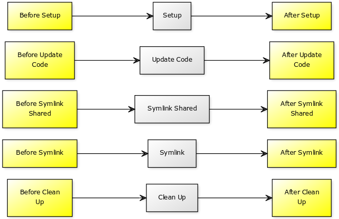

# Ansible Розгортання з Ansistrano

У цьому розділі ви дізнаєтеся, як розгортати програми з роллю Ansible [Ansistrano](https://ansistrano.com).

****

**Цілі**: В цьому розділі ви дізнаєтеся як:

:heavy_check_mark: Запровадити Ansistrano;  
:heavy_check_mark: Налаштувати Ansistrano;  
:heavy_check_mark: Використовувати спільні папки та файли між розгорнутими версіями;  
:heavy_check_mark: Розгорнути різних версій сайту з git;  
:heavy_check_mark: Реагувати між кроками розгортання.

:checkered_flag: **ansible**, **ansistrano**, **roles**, **deployments**

**Знання**: :star: :star:  
**Складність**: :star: :star: :star:

**Час для читання**: 40 хвилин

****

Ansistrano — це роль Ansible для легкого розгортання програм PHP, Python тощо.
Він базується на функціональності [Capistrano](http://capistranorb.com/).

## Вступ

Для запуску Ansistrano потрібно:

- Ansible на машині розгортання,
- `rsync` або `git` на клієнтській машині.

Він може завантажити вихідний код із `rsync`, `git`, `scp`, `http`, `S3` , ...

!!! Примітка

    Для нашого прикладу розгортання ми будемо використовувати протокол `git`.

Ansistrano розгортає програми, дотримуючись наступних 5 кроків:

- **Налаштування**: створіть структуру каталогів для розміщення випусків;
- **Код оновлення**: завантаження нового випуску до цілей;
- **Symlink Shared** і **Symlink**: після розгортання нового випуску `поточне` символічне посилання змінено, щоб вказувати на цей новий випуск;
- **Очищення**: для очищення (видалення старих версій).



Скелет розгортання з Ansistrano виглядає так:

```bash
/var/www/site/
├── current -> ./releases/20210718100000Z
├── releases
│   └── 20210718100000Z
│       ├── css -> ../../shared/css/
│       ├── img -> ../../shared/img/
│       └── REVISION
├── repo
└── shared
    ├── css/
    └── img/
```

Ви можете знайти всю документацію Ansistrano в його [репозиторії Github](https://github.com/ansistrano/deploy).

## Тестова платформа

Ви продовжите працювати на своїх 2 серверах:

Сервер керування:

- Ansible вже встановлено. Вам потрібно буде встановити роль `ansistrano.deploy`.

Керований сервер:

- Вам потрібно буде встановити Apache і розгорнути клієнтський сайт.

### Розгортання веб-сервера

Для більшої ефективності ми використаємо роль `geerlingguy.apache` для налаштування сервера:

```bash
$ ansible-galaxy role install geerlingguy.apache
Starting galaxy role install process
- downloading role 'apache', owned by geerlingguy
- downloading role from https://github.com/geerlingguy/ansible-role-apache/archive/3.1.4.tar.gz
- extracting geerlingguy.apache to /home/ansible/.ansible/roles/geerlingguy.apache
- geerlingguy.apache (3.1.4) was installed successfully
```

Можливо, нам знадобиться відкрити деякі правила брандмауера, тому ми також встановимо колекцію `ansible.posix` для роботи з її модулем `firewalld`:

```bash
$ ansible-galaxy collection install ansible.posix
Starting galaxy collection install process
Process install dependency map
Starting collection install process
Downloading https://galaxy.ansible.com/download/ansible-posix-1.2.0.tar.gz to /home/ansible/.ansible/tmp/ansible-local-519039bp65pwn/tmpsvuj1fw5/ansible-posix-1.2.0-bhjbfdpw
Installing 'ansible.posix:1.2.0' to '/home/ansible/.ansible/collections/ansible_collections/ansible/posix'
ansible.posix:1.2.0 was installed successfully
```

Після встановлення ролі та колекції ми можемо створити першу частину нашої playbook, яка:

- Встановить Apache,
- Створить цільову папку для нашого `vhost`,
- Створить типовий `vhost`,
- Відкриє firewall,
- Запустить або перезапустить Apache.

Технічні міркування:

- Ми розгорнемо наш сайт у папці `/var/www/site/`.
- Як ми побачимо пізніше, `ansistrano` створить символічне посилання `current` на поточну папку випуску.
- Вихідний код для розгортання містить папку `html`, на яку має вказувати віртуальний хост. Його `DirectoryIndex` — це `index.htm`.
- Розгортання виконується за допомогою `git`, пакет буде встановлено.

!!! Примітка

    Таким чином, ціль нашого vhost буде: `/var/www/site/current/html`.

Наш playbook із налаштування сервера: `playbook-config-server.yml`

```yaml
---
- hosts: ansible_clients
  become: yes
  become_user: root
  vars:
    dest: "/var/www/site/"
    apache_global_vhost_settings: |
      DirectoryIndex index.php index.htm
    apache_vhosts:
      - servername: "website"
    documentroot: "{{ dest }}current/html"

  tasks:

    - name: create directory for website
      file:
        path: /var/www/site/
        state: directory
        mode: 0755

    - name: install git
      package:
        name: git
        state: latest

    - name: permit traffic in default zone for http service
      ansible.posix.firewalld:
        service: http
        permanent: yes
        state: enabled
        immediate: yes

  roles:
    - { role: geerlingguy.apache }
```

Playbook можна застосувати до сервера:

```bash
ansible-playbook playbook-config-server.yml
```

Зверніть увагу на виконання наступних завдань:

```bash
TASK [geerlingguy.apache : Ensure Apache is installed on RHEL.] ****************
TASK [geerlingguy.apache : Configure Apache.] **********************************
TASK [geerlingguy.apache : Add apache vhosts configuration.] *******************
TASK [geerlingguy.apache : Ensure Apache has selected state and enabled on boot.] ***
TASK [permit traffic in default zone for http service] *************************
RUNNING HANDLER [geerlingguy.apache : restart apache] **************************
```

Роль `geerlingguy.apache` значно полегшує нашу роботу, піклуючись про встановлення та налаштування Apache.

Ви можете перевірити, чи все працює, використовуючи `curl`:

```bash
$ curl -I http://192.168.1.11
HTTP/1.1 404 Not Found
Date: Mon, 05 Jul 2021 23:30:02 GMT
Server: Apache/2.4.37 (rocky) OpenSSL/1.1.1g
Content-Type: text/html; charset=iso-8859-1
```

!!! Примітка

    Ми ще не розгорнули жодного коду, тому для curl нормально повертати HTTP-код 404. Але ми вже можемо підтвердити, що служба `httpd` працює і що брандмауер відкритий.

### Розгортання програмного забезпечення

Тепер, коли наш сервер налаштовано, ми можемо розгортати програму.

Для цього ми використаємо роль `ansistrano.deploy` у другому playbook, присвяченому розгортанню програми (для кращої читабельності).

```bash
$ ansible-galaxy role install ansistrano.deploy
Starting galaxy role install process
- downloading role 'deploy', owned by ansistrano
- downloading role from https://github.com/ansistrano/deploy/archive/3.10.0.tar.gz
- extracting ansistrano.deploy to /home/ansible/.ansible/roles/ansistrano.deploy
- ansistrano.deploy (3.10.0) was installed successfully

```

Джерела програмного забезпечення можна знайти в [репозиторії Github](https://github.com/alemorvan/demo-ansible.git).

Ми створимо playbook `playbook-deploy.yml` для керування розгортанням:

```yaml
---
- hosts: ansible_clients
  become: yes
  become_user: root
  vars:
    dest: "/var/www/site/"
    ansistrano_deploy_via: "git"
    ansistrano_git_repo: https://github.com/alemorvan/demo-ansible.git
    ansistrano_deploy_to: "{{ dest }}"

  roles:
     - { role: ansistrano.deploy }
```

```bash
$ ansible-playbook playbook-deploy.yml

PLAY [ansible_clients] *********************************************************

TASK [ansistrano.deploy : ANSISTRANO | Ensure deployment base path exists] *****
TASK [ansistrano.deploy : ANSISTRANO | Ensure releases folder exists]
TASK [ansistrano.deploy : ANSISTRANO | Ensure shared elements folder exists]
TASK [ansistrano.deploy : ANSISTRANO | Ensure shared paths exists]
TASK [ansistrano.deploy : ANSISTRANO | Ensure basedir shared files exists]
TASK [ansistrano.deploy : ANSISTRANO | Get release version] ********************
TASK [ansistrano.deploy : ANSISTRANO | Get release path]
TASK [ansistrano.deploy : ANSISTRANO | GIT | Register ansistrano_git_result variable]
TASK [ansistrano.deploy : ANSISTRANO | GIT | Set git_real_repo_tree]
TASK [ansistrano.deploy : ANSISTRANO | GIT | Create release folder]
TASK [ansistrano.deploy : ANSISTRANO | GIT | Sync repo subtree[""] to release path]
TASK [ansistrano.deploy : ANSISTRANO | Copy git released version into REVISION file]
TASK [ansistrano.deploy : ANSISTRANO | Ensure shared paths targets are absent]
TASK [ansistrano.deploy : ANSISTRANO | Create softlinks for shared paths and files]
TASK [ansistrano.deploy : ANSISTRANO | Ensure .rsync-filter is absent]
TASK [ansistrano.deploy : ANSISTRANO | Setup .rsync-filter with shared-folders]
TASK [ansistrano.deploy : ANSISTRANO | Get current folder]
TASK [ansistrano.deploy : ANSISTRANO | Remove current folder if it's a directory]
TASK [ansistrano.deploy : ANSISTRANO | Change softlink to new release]
TASK [ansistrano.deploy : ANSISTRANO | Clean up releases]

PLAY RECAP ********************************************************************************************************************************************************************************************************
192.168.1.11 : ok=25   changed=8    unreachable=0    failed=0    skipped=14   rescued=0    ignored=0

```

Стільки всього зроблено лише за допомогою 11 рядків коду!

```html
$ curl http://192.168.1.11
<html>
<head>
<title>Demo Ansible</title>
</head>
<body>
<h1>Version Master</h1>
</body>
<html>
```

### Перевірка на сервері

Тепер ви можете підключитися до клієнтської машини через ssh.

- Створіть `дерево` в каталозі `/var/www/site/`:

```bash
$ tree /var/www/site/
/var/www/site
├── current -> ./releases/20210722155312Z
├── releases
│   └── 20210722155312Z
│       ├── REVISION
│       └── html
│    └── index.htm
├── repo
│   └── html
│       └── index.htm
└── shared
```

Будь ласка, зверніть увагу:

- `поточне` символічне посилання на випуск `./releases/20210722155312Z`

- наявність каталогу `shared`

- наявність репозиторіїв git у `./repo/`

- На сервері Ansible перезапустіть розгортання **3** рази, а потім перевірте клієнта.

```bash
$ tree /var/www/site/
var/www/site
├── current -> ./releases/20210722160048Z
├── releases
│   ├── 20210722155312Z
│   │   ├── REVISION
│   │   └── html
│   │       └── index.htm
│   ├── 20210722160032Z
│   │   ├── REVISION
│   │   └── html
│   │       └── index.htm
│   ├── 20210722160040Z
│   │   ├── REVISION
│   │   └── html
│   │       └── index.htm
│   └── 20210722160048Z
│       ├── REVISION
│       └── html
│    └── index.htm
├── repo
│   └── html
│       └── index.htm
└── shared
```

Будь ласка, зверніть увагу:

- `ansistrano` зберіг 4 останні випуски,
- посилання `current`, пов’язане з останнім випуском

### Обмеження кількості релізів

Змінна `ansistrano_keep_releases` використовується для визначення кількості випусків, які потрібно зберегти.

- Використовуючи змінну `ansistrano_keep_releases`, збережіть лише 3 релізи проєкту. Перевірка.

```yaml
---
- hosts: ansible_clients
  become: yes
  become_user: root
  vars:
    dest: "/var/www/site/"
    ansistrano_deploy_via: "git"
    ansistrano_git_repo: https://github.com/alemorvan/demo-ansible.git
    ansistrano_deploy_to: "{{ dest }}"
    ansistrano_keep_releases: 3

  roles:
     - { role: ansistrano.deploy }
```

```bash
---
$ ansible-playbook -i hosts playbook-deploy.yml
```

На клієнтській машині:

```bash
$ tree /var/www/site/
/var/www/site
├── current -> ./releases/20210722160318Z
├── releases
│   ├── 20210722160040Z
│   │   ├── REVISION
│   │   └── html
│   │       └── index.htm
│   ├── 20210722160048Z
│   │   ├── REVISION
│   │   └── html
│   │       └── index.htm
│   └── 20210722160318Z
│       ├── REVISION
│       └── html
│    └── index.htm
├── repo
│   └── html
│       └── index.htm
└── shared
```

### Використання shared_paths і shared_files

```yaml
---
- hosts: ansible_clients
  become: yes
  become_user: root
  vars:
    dest: "/var/www/site/"
    ansistrano_deploy_via: "git"
    ansistrano_git_repo: https://github.com/alemorvan/demo-ansible.git
    ansistrano_deploy_to: "{{ dest }}"
    ansistrano_keep_releases: 3
    ansistrano_shared_paths:
      - "img"
      - "css"
    ansistrano_shared_files:
      - "logs"

  roles:
     - { role: ansistrano.deploy }
```

На клієнтській машині створіть файл `logs` у каталозі `shared`:

```bash
sudo touch /var/www/site/shared/logs
```

Потім виконайте playbook:

```bash
TASK [ansistrano.deploy : ANSISTRANO | Ensure shared paths targets are absent] *******************************************************
ok: [192.168.10.11] => (item=img)
ok: [192.168.10.11] => (item=css)
ok: [192.168.10.11] => (item=logs/log)

TASK [ansistrano.deploy : ANSISTRANO | Create softlinks for shared paths and files] **************************************************
changed: [192.168.10.11] => (item=img)
changed: [192.168.10.11] => (item=css)
changed: [192.168.10.11] => (item=logs)
```

На клієнтській машині:

```bash
$  tree -F /var/www/site/
/var/www/site/
├── current -> ./releases/20210722160631Z/
├── releases/
│   ├── 20210722160048Z/
│   │   ├── REVISION
│   │   └── html/
│   │       └── index.htm
│   ├── 20210722160318Z/
│   │   ├── REVISION
│   │   └── html/
│   │       └── index.htm
│   └── 20210722160631Z/
│       ├── REVISION
│       ├── css -> ../../shared/css/
│       ├── html/
│       │   └── index.htm
│       ├── img -> ../../shared/img/
│       └── logs -> ../../shared/logs
├── repo/
│   └── html/
│       └── index.htm
└── shared/
    ├── css/
    ├── img/
    └── logs
```

Зверніть увагу, що останній випуск містить 3 посилання: `css`, `img` і `logs`

- із `/var/www/site/releases/css` до каталогу `../../shared/css/`.
- із `/var/www/site/releases/img` до каталогу `../../shared/img/`.
- із `/var/www/site/releases/logs` у файл `../../shared/logs`.

Таким чином, файли, що містяться в цих двох папках, і файл `logs` завжди доступні за такими шляхами:

- `/var/www/site/current/css/`,
- `/var/www/site/current/img/`,
- `/var/www/site/current/logs`,

але перш за все вони зберігатимуться від одного випуску до іншого.

### Використання підкаталогу репозиторію для розгортання

У нашому випадку репозиторій містить папку `html`, яка містить файли сайту.

- Щоб уникнути цього додаткового рівня каталогу, використовуйте змінну `ansistrano_git_repo_tree`, вказавши шлях до підкаталогу для використання.

Не забудьте змінити конфігурацію Apache, щоб врахувати цю зміну!

Змініть playbook для конфігурації сервера `playbook-config-server.yml`

```yaml
---
- hosts: ansible_clients
  become: yes
  become_user: root
  vars:
    dest: "/var/www/site/"
    apache_global_vhost_settings: |
      DirectoryIndex index.php index.htm
    apache_vhosts:
      - servername: "website"
 documentroot: "{{ dest }}current/" # <1>

  tasks:

    - name: create directory for website
      file:
 path: /var/www/site/
 state: directory
 mode: 0755

    - name: install git
      package:
 name: git
 state: latest

  roles:
    - { role: geerlingguy.apache }
```

<1> Змініть цей рядок

Змініть playbook для розгортання `playbook-deploy.yml`

```yaml
---
- hosts: ansible_clients
  become: yes
  become_user: root
  vars:
    dest: "/var/www/site/"
    ansistrano_deploy_via: "git"
    ansistrano_git_repo: https://github.com/alemorvan/demo-ansible.git
    ansistrano_deploy_to: "{{ dest }}"
    ansistrano_keep_releases: 3
    ansistrano_shared_paths:
      - "img"
      - "css"
    ansistrano_shared_files:
      - "log"
    ansistrano_git_repo_tree: 'html' # <1>

  roles:
     - { role: ansistrano.deploy }
```

<1> Змініть цей рядок

- Не забудьте запустити обидва playbooks

- Перевірте на клієнтській машині:

```bash
$  tree -F /var/www/site/
/var/www/site/
├── current -> ./releases/20210722161542Z/
├── releases/
│   ├── 20210722160318Z/
│   │   ├── REVISION
│   │   └── html/
│   │       └── index.htm
│   ├── 20210722160631Z/
│   │   ├── REVISION
│   │   ├── css -> ../../shared/css/
│   │   ├── html/
│   │   │   └── index.htm
│   │   ├── img -> ../../shared/img/
│   │   └── logs -> ../../shared/logs
│   └── 20210722161542Z/
│       ├── REVISION
│       ├── css -> ../../shared/css/
│       ├── img -> ../../shared/img/
│       ├── index.htm
│       └── logs -> ../../shared/logs
├── repo/
│   └── html/
│       └── index.htm
└── shared/
    ├── css/
    ├── img/
    └── logs
```

<1> Зверніть увагу на відсутність `html`

### Керування гілкою або тегами git

Змінна `ansistrano_git_branch` використовується для визначення `гілки` або `тегу` для розгортання.

- Розгорніть гілку `releases/v1.1.0`:

```yaml
---
- hosts: ansible_clients
  become: yes
  become_user: root
  vars:
    dest: "/var/www/site/"
    ansistrano_deploy_via: "git"
    ansistrano_git_repo: https://github.com/alemorvan/demo-ansible.git
    ansistrano_deploy_to: "{{ dest }}"
    ansistrano_keep_releases: 3
    ansistrano_shared_paths:
      - "img"
      - "css"
    ansistrano_shared_files:
      - "log"
    ansistrano_git_repo_tree: 'html'
    ansistrano_git_branch: 'releases/v1.1.0'

  roles:
     - { role: ansistrano.deploy }
```

!!! Примітка

    Ви можете весело провести час під час розгортання, оновивши свій веб-переглядач, щоб побачити «живі» зміни.

```html
$ curl http://192.168.1.11
<html>
<head>
<title>Demo Ansible</title>
</head>
<body>
<h1>Version 1.0.1</h1>
</body>
<html>
```

- Розгорніть тег `v2.0.0`:

```yaml
---
- hosts: ansible_clients
  become: yes
  become_user: root
  vars:
    dest: "/var/www/site/"
    ansistrano_deploy_via: "git"
    ansistrano_git_repo: https://github.com/alemorvan/demo-ansible.git
    ansistrano_deploy_to: "{{ dest }}"
    ansistrano_keep_releases: 3
    ansistrano_shared_paths:
      - "img"
      - "css"
    ansistrano_shared_files:
      - "log"
    ansistrano_git_repo_tree: 'html'
    ansistrano_git_branch: 'v2.0.0'

  roles:
     - { role: ansistrano.deploy }
```

```html
$ curl http://192.168.1.11
<html>
<head>
<title>Demo Ansible</title>
</head>
<body>
<h1>Version 2.0.0</h1>
</body>
<html>
```

### Дії між етапами розгортання

Розгортання з Ansistrano передбачає наступні кроки:

- `Налаштування`
- `Оновлення коду`
- `Розшарення символічного посилання`
- `Символьне посилання`
- `Прибирання`

Можна втручатися до і після кожного з цих кроків.


Playbook можна включити за допомогою змінних, наданих для цієї мети:

- `ansistrano_before_<task>_tasks_file`

- або `ansistrano_after_<task>_tasks_file`

- Простий приклад: надішліть електронний лист (або будь-яке інше, наприклад сповіщення Slack) на початку розгортання:

```yaml
---
- hosts: ansible_clients
  become: yes
  become_user: root
  vars:
    dest: "/var/www/site/"
    ansistrano_deploy_via: "git"
    ansistrano_git_repo: https://github.com/alemorvan/demo-ansible.git
    ansistrano_deploy_to: "{{ dest }}"
    ansistrano_keep_releases: 3
    ansistrano_shared_paths:
      - "img"
      - "css"
    ansistrano_shared_files:
      - "logs"
    ansistrano_git_repo_tree: 'html'
    ansistrano_git_branch: 'v2.0.0'
    ansistrano_before_setup_tasks_file: "{{ playbook_dir }}/deploy/before-setup-tasks.yml"

  roles:
     - { role: ansistrano.deploy }
```

Створіть файл `deploy/before-setup-tasks.yml`:

```yaml
---
- name: Send a mail
  mail:
    subject: Starting deployment on {{ ansible_hostname }}.
  delegate_to: localhost
```

```bash
TASK [ansistrano.deploy : include] *************************************************************************************
included: /home/ansible/deploy/before-setup-tasks.yml for 192.168.10.11

TASK [ansistrano.deploy : Send a mail] *************************************************************************************
ok: [192.168.10.11 -> localhost]
```

```bash
[root] # mailx
Heirloom Mail version 12.5 7/5/10.  Type ? for help.
"/var/spool/mail/root": 1 message 1 new
>N  1 root@localhost.local  Tue Aug 21 14:41  28/946   "Starting deployment on localhost."
```

- Можливо, вам доведеться перезапустити деякі служби наприкінці розгортання, наприклад, щоб очистити кеші. Давайте перезапустимо Apache наприкінці розгортання:

```yaml
---
- hosts: ansible_clients
  become: yes
  become_user: root
  vars:
    dest: "/var/www/site/"
    ansistrano_deploy_via: "git"
    ansistrano_git_repo: https://github.com/alemorvan/demo-ansible.git
    ansistrano_deploy_to: "{{ dest }}"
    ansistrano_keep_releases: 3
    ansistrano_shared_paths:
      - "img"
      - "css"
    ansistrano_shared_files:
      - "logs"
    ansistrano_git_repo_tree: 'html'
    ansistrano_git_branch: 'v2.0.0'
    ansistrano_before_setup_tasks_file: "{{ playbook_dir }}/deploy/before-setup-tasks.yml"
    ansistrano_after_symlink_tasks_file: "{{ playbook_dir }}/deploy/after-symlink-tasks.yml"

  roles:
     - { role: ansistrano.deploy }
```

Створіть файл `deploy/after-symlink-tasks.yml`:

```yaml
---
- name: restart apache
  systemd:
    name: httpd
    state: restarted
```

```bash
TASK [ansistrano.deploy : include] *************************************************************************************
included: /home/ansible/deploy/after-symlink-tasks.yml for 192.168.10.11

TASK [ansistrano.deploy : restart apache] **************************************************************************************
changed: [192.168.10.11]
```

Як ви бачили в цьому розділі, Ansible може значно покращити життя системного адміністратора. Дуже інтелектуальні ролі, такі як Ansistrano, є «необхідними», які швидко стають незамінними.

Використання Ansistrano забезпечує дотримання належних практик розгортання, скорочує час, необхідний для запуску системи, і запобігає ризику потенційних людських помилок. Машина працює швидко, добре і рідко помиляється!
