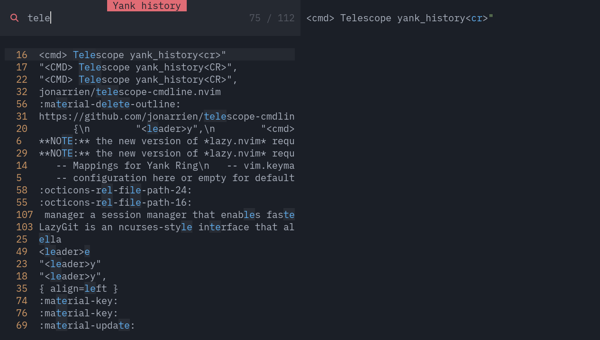

The basic functionality of NvChad has been expanded to provide an enhanced experience from the already excellent one provided by the editor; there are features for file management, buffer navigation, string copying, and other small utilities.

To enrich the experience of writing and editing markdown files, the use of dictionaries (multilingual) for spell-checking and exception handling has also been implemented.

## :material-file-tree: File Manager

The most notable change to the configuration of the editor is the replacement of the file manager used by NvChad, in its place is [neo-tree.nvim](https://github.com/nvim-neo-tree/neo-tree.nvim), this plugin allows for a simpler configuration and provides "out of the box" a floating layout and various parameters to be passed to the `:Neotree` command.


The commands used in NvChad have been migrated to reflect the changes but the functionality remains the same; ++ctrl+"n"++ opens the file manager sideways and ++space+"e"++ places the focus on it.

!!! notes "Disabling nvimtree"

    The plugin provided by the base configuration has been completely disabled to avoid incompatibility problems with its replacement, the disabling is set in the file `lua/plugins/init.lua`.

    ```lua
    -- disable nvim-tree
    {
    "nvim-tree/nvim-tree.lua",
    enabled = false,
    },
    ```

The plugin also provides a floating layout that is invoked with the ++"-"++ character, the command executed by this shortcut corresponds to the execution of *Neotree* with the ==float== flag, the ==toggle== flag was also added to the particular command to use the same character also to close the buffer.


The shortcut can be changed according to preference by editing the corresponding character in the file `lua/plugins/neotree.lua`.

```lua
  { -- lazy style key map
   "-",
   "<cmd>Neotree float toggle<cr>",
   desc = "file manager float",
  },
```

The `:Neotree` command has many default options and layouts, for a more in-depth discussion of it visit [the related section](https://github.com/nvim-neo-tree/neo-tree.nvim?tab=readme-ov-file#the-neotree-command) of the documentation.

## :octicons-command-palette-16: Command line

In addition to the *cmdline* provided by NvChad, a second more modern and functional *command line* was also included, its inclusion was made in the file `lua/plugins/telescope.lua`. The plugin is a custom *picker* of *Telescope*, it provides a history of the commands made and allows them to be searched, the functionality is provided by the [telescope-cmdline.nvim](https://github.com/jonarrien/telescope-cmdline.nvim) plugin.  
To open the *cmdline* use the ++comma++ (comma) key:


## :octicons-paste-16: Copy and Paste

The copy/paste functionality has been extended through the integration into the configuration of [yanky.nvim](https://github.com/gbprod/yanky.nvim), this plugin allows for the pasting, from a convenient history displayed in *Telescope*, of previously copied strings. The history (*yanky-ring*) is saved in `~.local/share/nvim/databases/yanky.db`, this is a *sqlite* database that allows more strings to be stored and offers better search performance.  
The keys to use *yanky* are ++space+"y "++ in *NORMAL* mode and ++ctrl+"y "++ in *INSERT* mode, both of which position the string to be pasted at the current location where the cursor is.



The history of the copied strings is shared with the *clipboard* of the host system, this allows the copied strings to be used outside Neovim as web addresses, remote images, etc. in the open buffer. The setting that enables the feature is found in the file `lua/plugins/yanky.lua` and is as follows:

```lua
    system_clipboard = {
     sync_with_ring = true,
    },
```

## :octicons-diff-added-16: Further additions

A number of plugins have also been added to the plugins that provide the functionality described above that provide common functionality dedicated to buffer management.

* [nvim-highlight-colors](https://github.com/brenoprata10/nvim-highlight-colors) for color code translation (*hexadecimal*), this plugin adds a background color to the hexadecimal value (e.g. #FCFCFC) making it much easier to manage and edit. The feature is particularly useful for those who want to try their hand at editing NvChad themes. The ++space+"uC "++ shortcut is available for activation, which also allows its disabling (*toggle command*).


* [neoscroll.nvim](https://github.com/karb94/neoscroll.nvim) enables smoother scrolling of the document (in *NORMAL* mode), its use allows you to quickly navigate the markdown file, which is useful for both editing and reviewing documents. The plugin provides two commands, ++ctrl+"u "++ and ++ctrl+"d "++ to scroll up or down the document.

* [rainbow-delimiters.nvim](https://github.com/hiphish/rainbow-delimiters.nvim) this plugin colors the parentheses (*round*, *square*, and *curly*) of the code by following their nesting order, allows for easier recognition of code blocks, and although not strictly related to markdown is a very useful tool for editing the NvChad configuration.


## :material-file-check-outline: Spell checking

One of the *built-in* functions of Neovim is spell-checking, this function allows you to compare the word you have just typed with the words contained in a dictionary localized in that language, you can thus avoid typos, allowing you to eliminate this check from the document review.  
The dictionary for the English language is available along with a standard installation of Neovim and can be activated immediately with the command `:set spell spelllang=en`; for international users, however, dictionaries are not available and must be built locally.

### Dictionary construction

The process of creating a local dictionary consists of downloading the dictionary source files and then building them in Neovim with the `:mkspell` command. The source files can be found using various sources (*Openoffice*, *Libreoffice*, others..) and consist of a `.aff` file and a `.dict` file.  
The file `.aff` store the description related to the selected spell check dictionary file while the file `.dict` is the file that contains the word lists and language information used to spell check and provide synonyms.

#### Download source files

!!! notes "Choice of source"

    A search by the author found that the most up-to-date dictionaries are those on the [Libreoffice extensions](https://extensions.libreoffice.org/?Tags%5B%5D=50) site.

    In this guide, the dictionary for the Italian language will be built, but the same process can be performed for any language you want by changing the *local* and source path.

Open the Libreoffice extensions site in a browser and select the *Dictionary* section, once in the section you can use the search function to find, for example, all dictionaries dealing with the Italian language.


Selecting the Italian dictionary takes you to a new page where the project description and available versions are present; to download the most recent simply use the button in the top left corner.  
In the case of the Italian dictionary the file to download is `874d181c_dict-it.oxt`, all these files are compressed archives (*zip*) and can be unpacked with the `unzip` utility.  
Then go on to prepare the sources by executing the following commands:

```bash
mkdir -p ~/nvspell/italian
cd ~/nvspell/italian
curl -O https://extensions.libreoffice.org/assets/downloads/z/874d181c_dict-it.oxt
  % Total    % Received % Xferd  Average Speed   Time    Time     Time  Current
                                 Dload  Upload   Total   Spent    Left  Speed
100 1341k  100 1341k    0     0  1938k      0 --:--:-- --:--:-- --:--:-- 1935k
```

Once saved unpack the dictionary with:

```bash
unzip 874d181c_dict-it.oxt
```

That will create the following structure:

```txt
.
├── description
├── description.xml
└──  dictionaries
    ├── CHANGELOG.txt
    ├── hyph_it_IT.dic
    ├── it_IT.aff
    ├── it_IT.dic
    ├── README_hyph_it_IT.txt
    ├── README.txt
    ├── th_it_IT_v2.dat
    └── th_it_IT_v2.idx
├── images
├── legacy
├── META-INF
└── registry
```

#### Building the dictionary

The command built into Neovim [mkspell](https://neovim.io/doc/user/spell.html#_3.-generating-a-spell-file) is used to build the dictionary, the command scans all available words in the **.dict** file and creates a **.spl** file from the scan.  
The **.spl** file is the file that Neovim uses to compare words in the buffer and should be placed in a default search path of the `:spell` command.

One of the default paths is a `spell` folder in the configuration path (`~/.config/nvim`) and will be used in this example for the build. Using this path also allows, if the configuration is maintained in a git repository, to replicate the dictionaries as well, avoiding the need to build them on the other machines where the configuration is replicated.

```bash
mkdir ~/.config/nvim/spell/
```

Open NvChad and type the following command, the command is to pass to `mkspell` as the first argument the destination path of the dictionary followed by the *locale* you want to build and as the second argument the source where to find the words followed again by the *locale*.  

```txt
:mkspell ~/.config/nvim/spell/it_IT ~/nvspell/italian/it_IT
```

At the end of the process a new file will be available in the `spell` folder called **it.utf-8.spl**, now you can have Italian spell-check of the file you are writing with:

```txt
:set spell spelllang=it
```

Multiple dictionaries can also be used for spell-checking at the same time, allowing you to have control both when writing the drafting of the document and when translating it into English. To have both dictionaries available in the buffer run the following command:

```txt
:set spell spelllang=en,it
```

#### Dictionary update

Dictionaries, like all *libraries*, are also updated to reflect changes in the language; updates even if not as frequent insert new words and new rules into the dictionaries.

Once the updated dictionary is available first you need to retrieve the new sources by downloading and unpacking them into a new folder which for this example will be `~/nvspell/it_new`, the instructions are the same as for the build procedure.

For the dictionary update, the previous `mkspell` command is used, to which the `!` flag should be added to indicate to the command that the file is already present and should be overwritten; consequently, the destination path should be changed to reflect the location of the file, and the source path should also be directed to the new folder containing the new dictionaries. The command will be as follows:

```txt
:mkspell! ~/.config/nvim/spell/it.utf-8.spl ~/nvspell/it_new/it_IT
```

Once the construction is finished, it will be immediately available in the NvChad buffer.

### Dictionary of exceptions

There are also two files in the `spell` folder, **exceptions.utf-8.add** and **exceptions.utf-8.add.spl**, the former being the file that acts as the bridge for entering new words into the dictionary.  
The file **exceptions.utf-8.add** is an arbitrary file that must be created since it is not present, what makes it *special* is the fact that it is defined as a `spellfile` in this way it is communicated to the `spell` command to use it as a bridge for the creation of a dictionary with the same name but suffixed *.spl*.  
The file is shared among all languages set in `spelllang` and is used to eliminate error reports on words that are spelled incorrectly but are correct in the document context such as *Rocky*, *yaml*, or *mkdocs*.


!!! note

    The exception dictionary is set by the autocommand, found in `lua/autocmds.lua`, which takes care of the automatic settings for *markdown* files and thus is always available in an open buffer on a file of that type.

#### Dictionary management

To enter a word marked as correct in the dictionary, simply place the cursor in the word and type ++"z"+"g"++ (*good*), and the word in the buffer, and in future documents, will no longer be underlined to indicate an error. Similarly to mark something as incorrect you use, again positioned on the word, the combination ++"z"+"w"++ (*wrong*).  
For an overview of the available commands you can refer to this [help section](https://neovim.io/doc/user/spell.html#_1.-quick-start) of Neovim.
