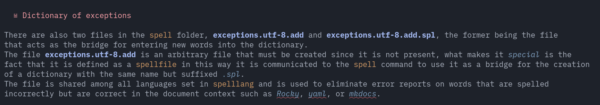

The basic functionality of NvChad has been expanded to provide an enhanced experience from the already excellent one provided by the editor; there are features for file management, buffer navigation, string copying, and other small utilities.

To enrich the experience of writing and editing markdown files, the use of dictionaries (multilingual) for spell-checking and exception handling has also been implemented.

## :material-file-tree: File Manager

The most notable change to the configuration of the editor is the replacement of the file manager used by NvChad, in its place is [neo-tree.nvim](https://github.com/nvim-neo-tree/neo-tree.nvim), this plugin allows for a simpler configuration and provides "out of the box" a floating layout and various parameters to be passed to the `:Neotree` command.


The commands used in NvChad have been migrated to reflect the changes but the functionality remains the same; ++ctrl+"n "++ opens the file manager sideways and ++space+"e "++ places the focus on it.

!!! notes "Disabling nvimtree"

    The plugin provided by the base configuration has been completely disabled to avoid incompatibility problems with its replacement, the disabling is set in the file `lua/plugins/init.lua`.

    ```lua
    -- disable nvim-tree
    {
    "nvim-tree/nvim-tree.lua",
    enabled = false,
    },
    ```

The plugin also provides a floating layout that is invoked with the ++"-"++ character, the command executed by this shortcut corresponds to the execution of *Neotree* with the ==float== flag, the ==toggle== flag was also added to the particular command to use the same character also to close the buffer.


The shortcut can be changed according to preference by editing the corresponding character in the file `lua/plugins/neotree.lua`.

```lua
  { -- lazy style key map
   "-",
   "<cmd>Neotree float toggle<cr>",
   desc = "file manager float",
  },
```

The `:Neotree` command has many default options and layouts, for a more in-depth discussion of it visit [the related section](https://github.com/nvim-neo-tree/neo-tree.nvim?tab=readme-ov-file#the-neotree-command) of the documentation.

## :octicons-command-palette-16: Command line

In addition to the *cmdline* provided by NvChad, a second more modern and functional *command line* was also included, its inclusion was made in the file `lua/plugins/telescope.lua`. The plugin is a custom *picker* of *Telescope*, it provides a history of the commands made and allows them to be searched, the functionality is provided by the [telescope-cmdline.nvim](https://github.com/jonarrien/telescope-cmdline.nvim) plugin.


## :octicons-paste-16: Copy and Paste

The copy/paste functionality has been extended through the integration into the configuration of [yanky.nvim](https://github.com/gbprod/yanky.nvim), this plugin allows for the pasting, from a convenient history displayed in *Telescope*, of previously copied strings. The history (*yanky-ring*) is saved in `~.local/share/nvim/databases/yanky.db`, this is a *sqlite* database that allows more strings to be stored and offers better search performance.  
The keys to use *yanky* are ++space+"y "++ in *NORMAL* mode and ++ctrl+"y "++ in *INSERT* mode, both of which position the string to be pasted at the current location where the cursor is.


The history of the copied strings is shared with the *clipboard* of the host system, this allows the copied strings to be used outside Neovim as web addresses, remote images, etc. in the open buffer. The setting that enables the feature is found in the file `lua/plugins/yanky.lua` and is as follows:

```lua
    system_clipboard = {
     sync_with_ring = true,
    },
```

## :octicons-diff-added-16: Further additions

A number of plugins have also been added to the plugins that provide the functionality described above that provide common functionality dedicated to buffer management.

* [nvim-highlight-colors](https://github.com/brenoprata10/nvim-highlight-colors) for color code translation (*hexadecimal*), this plugin adds a background color to the hexadecimal value (e.g. #FCFCFC) making it much easier to manage and edit. The feature is particularly useful for those who want to try their hand at editing NvChad themes. The ++space+"uC "++ shortcut is available for activation, which also allows its disabling (*toggle command*).


* [neoscroll.nvim](https://github.com/karb94/neoscroll.nvim) enables smoother scrolling of the document (in *NORMAL* mode), its use allows you to quickly navigate the markdown file, which is useful for both editing and reviewing documents. The plugin provides two commands, ++ctrl+"u "++ and ++ctrl+"d "++ to scroll up or down the document.

* [rainbow-delimiters.nvim](https://github.com/hiphish/rainbow-delimiters.nvim) this plugin colors the parentheses (*round*, *square*, and *curly*) of the code by following their nesting order, allows for easier recognition of code blocks, and although not strictly related to markdown is a very useful tool for editing the NvChad configuration.


## :material-file-check-outline: Spell checking

Una delle funzioni *built-in* di Neovim è il controllo ortografico, questa funzione permette di confrontare la parola che si ha appena scritto con le parole contenute in un dizionario localizzato in quella lingua, si possono così evitare gli errori di battitura, permettendo di eliminare questo controllo dalla revisione del documento.  
Il dizionario per la lingua inglese è disponibile assieme ad una installazione standard di Neovim e può essere attivata immediatamente con il comando `:set spell spelllang=en`, per gli utenti internazionali invece i dizionari non sono disponibili e devono essere costruiti in locale.

### Costruzione del dizionario

Il processo di creazione di un dizionario locale consiste nello scaricamento dei file sorgente del dizionario e la successiva costruzione in Neovim con il comando `:mkspell`. I file sorgente possono essere reperiti utilizzando varie fonti (*Openoffice*, *Libreoffice*, altri..) e consistono in un file `.aff` e un file `.dict`.  
Il file `.aff` memorizzare la descrizione relativa al file dizionario del controllo ortografico selezionato mentre il file `.dict` è il file che contiene gli elenchi di parole e informazioni sulla lingua usati per controllare l'ortografia e fornire sinonimi.

#### Scaricare i file sorgente

!!! note "Scelta della fonte"

    Da una ricerca effettuata dall'autore è risultato che i dizionari più aggiornati siano quelli presenti sul sito delle [estensioni di Libreoffice](https://extensions.libreoffice.org/?Tags%5B%5D=50).

    In questa guida verrà costruito il dizionario per la lingua italiana ma lo stesso procedimento può essere eseguito per qualsiasi lingua si desideri, modificando il *locale* e il percorso dei sorgenti.

Aprire in un browser il sito delle estensioni di Libreoffice e selezionare la sezione *Dictionary*, una volta nella sezione si può utilizzare la funzione di ricerca per trovare, ad esempio, tutti i dizionari che trattano la lingua italiana.


Selezionando il dizionario italiano si viene indirizzati ad una nuova pagina dove sono presenti la descrizione del progetto e le versioni disponibili, per scaricare la più recente basta semplicemente utilizzare il bottone presente in alto a sinistra.  
Nel caso del dizionario italiano il file da scaricare è `874d181c_dict-it.oxt`, tutti questi file sono archivi compressi (*zip*) e si possono scompattare con l'utilità `unzip`.  
Passiamo quindi a preparare i sorgenti eseguendo i seguenti comandi:

```bash
mkdir -p ~/nvspell/italian
cd ~/nvspell/italian
curl -O https://extensions.libreoffice.org/assets/downloads/z/874d181c_dict-it.oxt
  % Total    % Received % Xferd  Average Speed   Time    Time     Time  Current
                                 Dload  Upload   Total   Spent    Left  Speed
100 1341k  100 1341k    0     0  1938k      0 --:--:-- --:--:-- --:--:-- 1935k
```

Una volta salvato scompattiamo il dizionario con:

```bash
unzip 874d181c_dict-it.oxt
```

Che creerà la seguente struttura:

```txt
.
├── description
├── description.xml
└──  dictionaries
    ├── CHANGELOG.txt
    ├── hyph_it_IT.dic
    ├── it_IT.aff
    ├── it_IT.dic
    ├── README_hyph_it_IT.txt
    ├── README.txt
    ├── th_it_IT_v2.dat
    └── th_it_IT_v2.idx
├── images
├── legacy
├── META-INF
└── registry
```

#### Costruire il dizionario

Per costruire il dizionario ci si avvale del comando integrato in Neovim [mkspell](https://neovim.io/doc/user/spell.html#_3.-generating-a-spell-file), il comando scansiona tutte le parole disponibili nel file **.dict** e crea un file **.spl** dalla scansione.  
Il file **.spl** è il file che Neovim utilizza per il confronto delle parole nel buffer e va posizionato in un percorso di ricerca predefinito del comando `:spell`.

Uno dei percorsi predefiniti è una cartella `spell` nel percorso della configurazione (`~/.config/nvim`) e verrà utilizzata in questo esempio per la costruzione. L'uso di questo percorso consente inoltre, se la configurazione è mantenuta in un repository git, di replicare anche i dizionari evitando di doverli costruire sulle altre macchine dove viene replicata la configurazione.

```bash
mkdir ~/.config/nvim/spell/
```

Aprire NvChad e digitare il seguente comando, il comando consiste nel passare a `mkspell` come primo argomento il percorso di destinazione del dizionario seguito dal *locale* che si vuole costruire e come secondo argomento la sorgente dove reperire le parole seguito sempre dal *locale*.  

```txt
:mkspell ~/.config/nvim/spell/it_IT ~/nvspell/italian/it_IT
```

Al termine del processo sarà disponibile un nuovo file nella cartella `spell` chiamato **it.utf-8.spl**, ora è possibile avere il controllo ortografico in italiano del file che si sta scrivendo con:

```txt
:set spell spelllang=it
```

Per il controllo ortografico possono essere utilizzati anche più dizionari contemporaneamente, consentendo così di avere il controllo sia quando si scrive la stesura del documento che quando lo si traduce in inglese. Per avere entrambe i dizionari disponibili nel buffer a questo punto è sufficiente un:

```txt
:set spell spelllang=en,it
```

#### Aggiornamento del dizionario

Anche i dizionari, come tutte le *librerie*, vengono aggiornati per riflettere le modifiche della lingua, gli aggiornamenti anche se non così frequenti inseriscono nuove parole e nuove regole nei dizionari.

Una volta disponibile il dizionario aggiornato per prima cosa bisogna recuperare i nuovi sorgenti scaricandoli e scompattandoli in una nuova cartella che per questo esempio sarà `~/nvspell/it_new`, le istruzioni sono le stesse della procedura di costruzione.

Per l'aggiornamento del dizionario viene utilizzato il precedente comando `mkspell`, al quale va aggiunta la flag `!` per indicare al comando che il file è già presente e va sovrascritto; di conseguenza il percorso di destinazione va modificato per riflettere la posizione del file e anche il percorso dei sorgenti va indirizzato alla nuova cartella contenente i nuovi dizionari. Il comando sarà il seguente:

```txt
:mkspell! ~/.config/nvim/spell/it.utf-8.spl ~/nvspell/it_new/it_IT
```

Una volta terminata la costruzione sarà immediatamente disponibile nel buffer di NvChad.

### Dizionario delle eccezioni

Nella cartella `spell` sono presenti inoltre due file, **exceptions.utf-8.add** e **exceptions.utf-8.add.spl**, il primo è il file che fa da ponte per l'inserimento delle nuove parole nel dizionario. Il file **exceptions.utf-8.add** è un file arbitrario che deve essere creato in quanto non presente, quello che lo rende *speciale* è il fatto che venga definito come `spellfile` in questo modo si comunica al comando `spell` di utilizzarlo come ponte per la creazione di un dizionario con lo stesso nome ma con suffisso *.spl*.
Il file è condiviso fra tutte le lingue impostate in `spelllang` e serve ad eliminare le segnalazione di errore su parole che ortograficamente non sono corrette ma che lo sono nel contesto documentale come *Rocky*, *yaml* o *mkdocs*.



!!! note

    Il dizionario delle eccezioni viene impostato dal autocomando, presente in `lua/autocmds.lua`, che si occupa delle impostazioni automatiche per i file *markdown* e quindi è sempre disponibile in un buffer aperto su un file di quel tipo.

#### Gestione del dizionario

Per inserire nel dizionario una parola contrassegnata come corretta è sufficiente posizionare il cursore nella parola e digitare ++"z"+"g"++ (*good*) e la parola nel buffer, e nei prossimi documenti, non sarà più sottolineata ad indicare un errore. Allo stesso modo per contrassegnare qualcosa come errato si utilizza, sempre posizionati sulla parola, la combinazione ++"z"+"w"++ (*wrong*).  
Per una panoramica dei comandi disponibili si può fare riferimento a questa [sezione della guida](https://neovim.io/doc/user/spell.html#_1.-quick-start) di Neovim.
