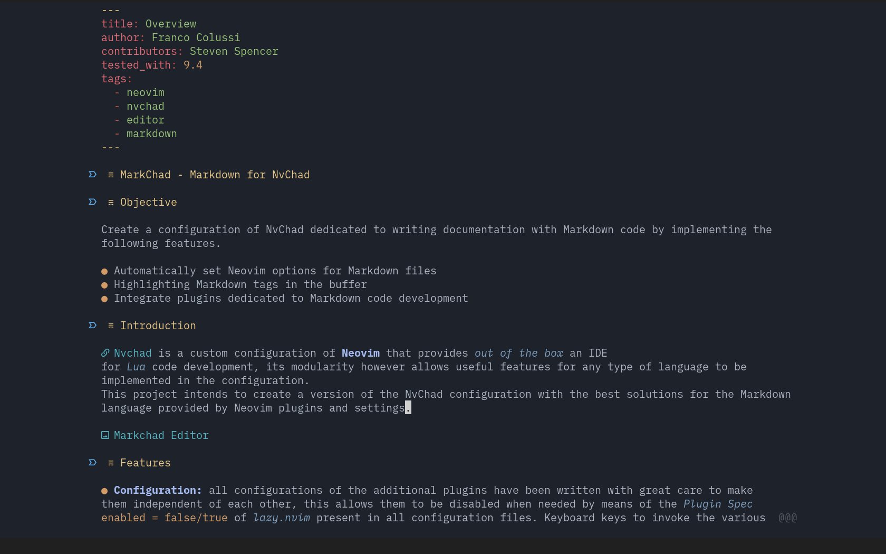

## :simple-streamrunners: Objective

Create a configuration of NvChad dedicated to writing documentation with Markdown code by implementing the following features.

* Automatically set Neovim options for Markdown files
* Highlight Markdown tags in the buffer
* Integrate plugins dedicated to Markdown code development

## :material-book-open-page-variant-outline: Introduction

[Nvchad](https://nvchad.com/) is a custom configuration of **Neovim** that provides *out of the box* an IDE for *Lua* code development. Its modularity allows the implementation of useful features for any type of language in the configuration.
This project intends to create a version of the NvChad configuration with the best solutions for the Markdown language provided by Neovim plugins and settings.

## :material-feature-search-outline: Features

* **Configuration:** The author took care in writing all the configurations of the additional plugins to make them independent of each other. This allows disabling them when needed by means of the *Plugin Spec* `enabled = false/true` of *lazy.nvim* present in all configuration files. Included are keyboard keys to invoke the various features in the configuration files, converted where possible to the *lazy style* format.
* **UI - Interface:** Made some changes to the layout strategy of `Telescope` to have a more modern and functional interface. Themes (*dropdown* and *ivy*) were also used for the `pickers` provided by default and for those inserted by additional plugins.
Made no changes to the themes provided by *NvChad*. This is to allow you to use it according to your own aesthetic tastes. Not all themes offer a *rich* display for highlights. The default `onedark` theme, for graphic development, also remains.
* **Editor:** A *git* repository and other small utilities supplement the section of plugins that provide functionality to the editor to improve workflow.
* **Markdown:** Included are features for writing Markdown documentation including a preview of the document in the browser, highlighting in the buffer of markdown tags, conversion by keyboard keys of attributes to text, and more.

## :fontawesome-regular-handshake: Acknowledgements

A big thank you goes to [Siduck](https://github.com/siduck), the main developer, and to all those who contributed to the creation of *NvChad*, without them this project could not exist.
A big thank you also goes to all the developers of the plugins used in this setup for sharing their knowledge.
