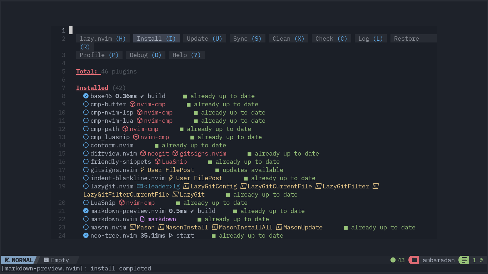
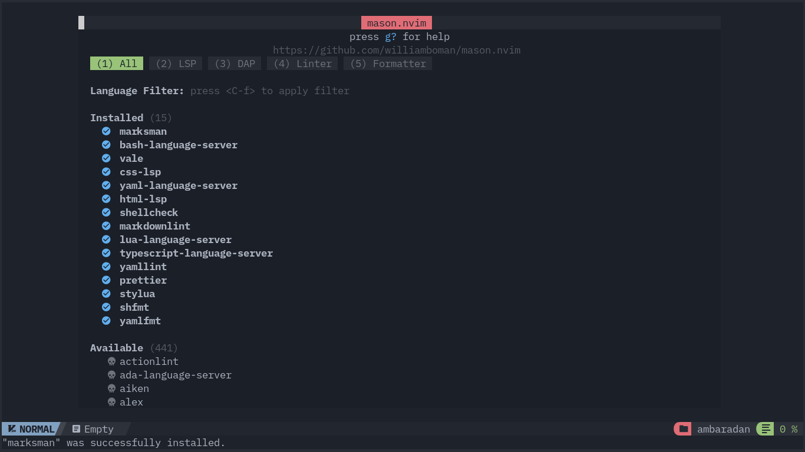

## :material-cart-plus: Requirements

The configuration for its installation requires the same components required by NvChad, which are:

* *Neovim* 0.10
* A *Nerd Font* installed and configured in the terminal
* *git* installed in the system
* *GCC* and *Make*

For a more in-depth overview of the necessary components, consult the [NvChad installation](https://nvchad.com/docs/quickstart/install) page.

### :material-tray-plus: Additional requirements

The following components are also required for successful configuration:

* [sqlite](https://sqlite.org/) (lightweight database) used by *yanky.nvim* to store copied strings
* [pandoc](https://www.pandoc.org/) (document converter) for markdown table alignment function
* [lazygit](https://github.com/jesseduffield/lazygit) an ncurses-style interface that allows you to perform all git operations in a more user-friendly way

#### Installation of additional packages

Installation of add-on packages in Rocky Linux comes from various sources. These procedures are:

!!! note

    The following commands assume that you are using the *root* account or have `sudo` privileges. If using `sudo`, append `sudo` to the command listed. 

The `sqlite` package is available from the official Rocky Linux repositories so just install it with the package manager:

```bash
dnf sqlite -y
```

For the installation of `pandoc`, the EPEL repository is needed. A [dedicated section](https://docs.rockylinux.org/books/admin_guide/13-softwares/?h=#the-epel-repository) in the Administrator's Guide is available for an overview of the project.  
It involves executing the following commands:

```bash
dnf install epel-release
dnf update
dnf install pandoc -y
```

The third required package, `lazygit`, is not available in the official channels (Rocky Linux, EPEL), but installation from Fedora's [Repository Copr](https://copr.fedorainfracloud.org/) is possible with the commands:

```bash
dnf copr enable atim/lazygit -y
dnf install lazygit
```

## :material-monitor-arrow-down-variant: Installation

Installation consists of copying the repository (clone) to a folder within the user's configuration path `~/.config/`, a path used by *Neovim* to search for the configuration to insert.  
Two scenarios are possible:

1. Using the primary configuration as the main configuration, replacing the default configuration of *Neovim* (see "Main Editor")
2. Installing separately and using it independently of the main configuration (see "Additional Editor")

The second solution allows you to test it without compromising your default installation, leaving the default configuration for use of other development languages you may use.

=== "Main Editor"

    !!! warning "Backup the configuration"

        The present configuration is deleted to install the one provided by *Markchad* and consequently a backup is strongly recommended before starting:

            ```bash
            mkdir -p ~/backup/nvim_backup/
            cp -r ~/.config/nvim/ ~/backup/nvim_backup/nvim_config
            cp -r ~/.local/share/nvim/ ~/backup/nvim_backup/nvim_local
            ```

    **:material-delete-outline: Removal of previous configuration**

    The configuration clone requires that the target folder not be present to run properly, so first you must remove the existing configuration with:

    ```bash
    rm -rf ~/.config/nvim/
    rm -rf ~/.local/share/nvim/
    ```

    **:octicons-rel-file-path-16: Installation of the configuration**

    Once you have deleted the pre-existing configuration, you can move on to copying the Markchad configuration. The copy will be made to the `~/.config/nvim` folder using *git*, the folder selected is the one set by default by Neovim to search for configurations. Use the following command for copying (clone):

    ```bash
    git clone https://github.com/ambaradan/markchad.git ~/.config/nvim && nvim
    ```

    The command clones the repository present on GitHub into the target folder and then calls the Neovim executable (*nvim*) which is initialized with the new configuration. The installation configures and installs all plugins present in the configuration (NvChad + Markchad) and when finished displays a summary of installed plugins.

    

    Close the *buffer* with ++"q"++ and go on to install the language servers with:

    ```bash
    :MasonInstallAll
    ```

    

    When *Mason* has finished installing the various components, close this buffer with ++"q"++ as well, and the editor is ready for use.

    !!! note "Editor restart"

        Although technically the editor is ready for use, it is recommended that it be closed and reopened to ensure the proper loading of all components. You can also use the `:checkhealth` command for an additional check on the status of the editor.

=== "Additional Editor"

    **:octicons-rel-file-path-16: Installation of the configuration**

    Installing the configuration as additional to the pre-existing one requires the use of Neovim's ==NVIM_APPNAME== variable. Passing this variable at the start of the Neovim instance (*nvim*) allows carrying out the entire process by selecting a custom path for both the configuration `~/.config/markchad/` and the installation data `~/.local/share/markchad/` thus ensuring complete independence from the configuration in use.  
    This method allows you to test the configuration before choosing whether to use it as a *production editor*. It also allows you to develop a configuration tailored to your preferences.

    To install the configuration run the following command:

    ```bash
    git clone https://github.com/ambaradan/markchad.git ~/.config/markchad && NVIM_APPNAME=markchad nvim
    ```

    The command clones the remote repository present on GitHub in the `~/.config/markchad/` folder and then calls the Neovim executable (*nvim*) by passing the *NVIM_APPNAME* variable, so the whole process is handled separately using the `markchad` folder.

    The installation configures and installs all plugins in the configuration (NvChad + Markchad) and when finished displays a summary of installed plugins.

    

    Close the *buffer* with ++"q"++ and go on to install the language servers with:

    ```bash
    :MasonInstallAll
    ```

    

    When *Mason* finishes installing the various components, close this buffer with ++"q"++ as well, and the editor is ready for use.

    !!! note "Editor restart"

        Although technically the editor is ready for use, it is recommended that it be closed and reopened to ensure the proper loading of all components. You can also use the `:checkhealth` command for an additional check on the status of the editor.

    **:material-run-fast: Starting the configuration**

    Subsequent runs of the configuration also require passing the variable to Neovim otherwise the executable will initialize its instance starting from the default `~/.config/nvim/` folder.
    *Neovim* should then be started with the command:

    ```bash
    NVIM_APPNAME=markchad nvim
    ```

## :material-update: Configuration update

Neovim's plugin ecosystem for markdown code is relatively young and in full ferment consequently it can be useful to update the cloned configuration to reflect the changes. You update in the usual way, using *git*, but when finished it requires an additional step. That is to bring the plugin state to that present on the repository, with the command:

```text
:Lazy restore
```

The command uses the plugin states (*commit*) saved in the `lazy-lock.json` file to bring all plugins to the state present in the configuration, thus ensuring maximum adherence of the local configuration with the remote one.

## :material-contain-end: Conclusions

The configuration is constantly evolving and tries to follow the development of the main plugins for writing markdown code. The author uses it daily, so it should be stable enough for use in *production*. Any kind of suggestions or corrections are welcome.
