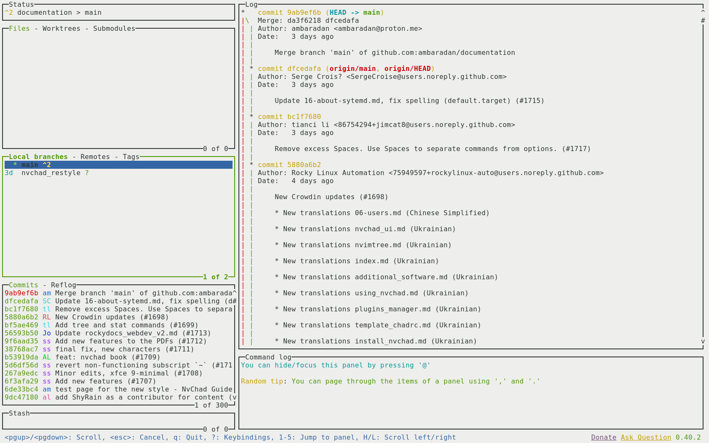

# Se necesita software adicional

Hay varias piezas de software adicionales que, aunque no son necesarias, ayudarán en el uso general de NvChad. Las secciones que se muestran a continuación le guiarán a través de ese software y sus usos.

## RipGrep

`ripgrep` es una herramienta de búsqueda orientada a líneas que busca recursivamente en el directorio actual un patrón _regex_ (expresión regular). Por defecto, _ripgrep_ respeta las reglas de _gitignore_ y automáticamente omite archivos/directorios ocultos y los binarios. Ripgrep ofrece un excelente soporte en Windows, macOS y Linux, con binarios disponibles para cada versión.

Ripgrep es un software escrito en _Rust_ que puede instalar con la utilidad `cargo`. Sin embargo, tenga en cuenta que `cargo` no se instala por defecto con la instalación predeterminada de _Rust_ por lo que tiene que instalarlo explícitamente.

```bash
dnf install rust cargo
```

Una vez instalado el software necesario, podemos instalar `ripgrep` ejecutando el siguiente comando:

```bash
cargo install ripgrep
```

La instalación guardará el ejecutable `rg` en la carpeta `~/.cargo/bin` que se encuentra fuera del PATH, para utilizarlo a nivel de usuario lo enlazaremos a `~/.local/bin/`.

```bash
ln -s ~/.cargo/bin/rg ~/.local/bin/
```

En este punto podemos comprobar que todo está correcto mediante la ejecución del siguiente comando:

```bash
rg --version
ripgrep 13.0.0
-SIMD -AVX (compiled)
+SIMD +AVX (runtime)
```

Para poder realizar búsquedas recursivas con `:Telescopio` es necesario tener instalado RipGrep.

## Lazygit

[LazyGit](https://github.com/jesseduffield/lazygit) es una interfaz de estilo ncurses que le permite realizar todas las operaciones de `git` de una manera fácil. Es requerido por el plugin _lazygit.nvim_. Este plugin permite utilizar LazyGit directamente desde NvChad, abre una ventana flotante desde la que puede realizar todas las operaciones sobre sus repositorios, por lo tanto, le permite hacer todos los cambios en un _ repositorio git_ sin salir del editor.

Para instalarlo podemos utilizar el repositorio de Fedora. En Rocky Linux 9 funciona perfectamente.

```bash
sudo dnf copr enable atim/lazygit -y
sudo dnf install lazygit
```

Una vez instalado abrimos un terminal y tecleamos el comando `lazygit`, aparecerá una interfaz similar:



Con la tecla <kbd>x</kbd> , podemos abrir el menú con todos los comandos disponibles.


Ahora que tenemos todo el software de apoyo necesario instalado en nuestro sistema, podemos pasar a instalar el software básico. Empezaremos con el editor en el que se basa toda la configuración, [Neovim](install_nvim.md).
