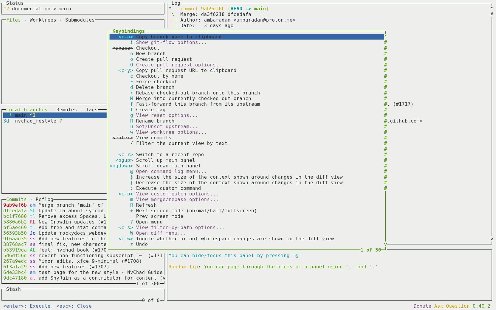

# 추가 소프트웨어 필요

필수는 아니지만 NvChad의 전반적인 사용에 도움이 되는 몇 가지 추가 소프트웨어가 있습니다. 아래 섹션에서는 해당 소프트웨어와 해당 용도를 안내합니다.

## RipGrep

`ripgrep`는 현재 디렉터리를 _regex_(regular expression) 패턴으로 재귀적으로 검색하는 행 지향 검색 도구입니다. 기본적으로 _ripgrep_은 _gitignore_의 규칙을 준수하고 숨겨진 파일/디렉토리 및 바이너리를 자동으로 건너뜁니다. Ripgrep은 Windows, macOS 및 Linux에서 탁월한 지원을 제공하며 각 릴리스에 사용할 수 있는 바이너리가 있습니다.

### EPEL에서 RipGrep 설치

Rocky Linux 8 및 9 모두에서 EPEL에서 RipGrep을 설치할 수 있습니다. 이렇게 하려면 `epel-release`를 설치하고 시스템을 업그레이드한 다음 `ripgrep.`를 설치합니다.

```
sudo dnf install -y epel-release
sudo dnf upgrade
sudo dnf install ripgrep
```

### `cargo`를 사용하여 RipGrep 설치

Ripgrep은 _Rust_로 작성된 소프트웨어이며 `cargo` 유틸리티로 설치할 수 있습니다. 그러나 _rust_의 기본 설치로는 `cargo`가 설치되지 않으므로 명시적으로 설치해야 합니다. 이 방법을 사용할 때 오류가 발생하면 EPEL에서 다시 설치하십시오.

```bash
dnf install rust cargo
```

필요한 소프트웨어가 설치되면 다음을 사용하여 `ripgrep`을 설치할 수 있습니다.

```bash
cargo install ripgrep
```

설치는 `rg` 실행 파일을 PATH 외부에 있는 `~/.cargo/bin` 폴더에 저장하고 사용자 수준에서 사용하기 위해 `~/.local/bin/`에 연결합니다.

```bash
ln -s ~/.cargo/bin/rg ~/.local/bin/
```

## RipGrep 인증

이 시점에서 다음을 통해 모든 것이 정상인지 확인할 수 있습니다.

```bash
rg --version
ripgrep 13.0.0
-SIMD -AVX (compiled)
+SIMD +AVX (runtime)
```

RipGrep은 `:Telescope`를 사용한 재귀 검색에 필요합니다.

## Lazygit

[LazyGit](https://github.com/jesseduffield/lazygit)은 모든 `git` 작업을 보다 사용자 친화적인 방식으로 수행할 수 있는 ncurses 스타일의 인터페이스입니다. _lazygit.nvim_ 플러그인에 필요합니다. 이 플러그인을 사용하면 NvChad에서 직접 LazyGit을 사용할 수 있습니다. 리포지토리에서 모든 작업을 수행할 수 있는 플로팅 창을 열어 편집기를 종료하지 않고 _git 리포지토리_를 변경할 수 있습니다.

이를 설치하기 위해 Fedora용 저장소를 사용할 수 있습니다. Rocky Linux 9에서는 완벽하게 작동합니다.

```bash
sudo dnf copr enable atim/lazygit -y
sudo dnf install lazygit
```

설치가 완료되면 터미널을 열고 `lazygit` 명령을 입력하면 다음과 유사한 인터페이스가 나타납니다.


<kbd>x</kbd> 키를 사용하면 사용 가능한 모든 명령이 포함된 메뉴를 불러올 수 있습니다.



이제 시스템에 필요한 모든 지원 소프트웨어가 있으므로 기본 소프트웨어 설치로 넘어갈 수 있습니다. 전체 구성의 기반이 되는 편집기인 [Neovim](install_nvim.md)부터 시작하겠습니다.
