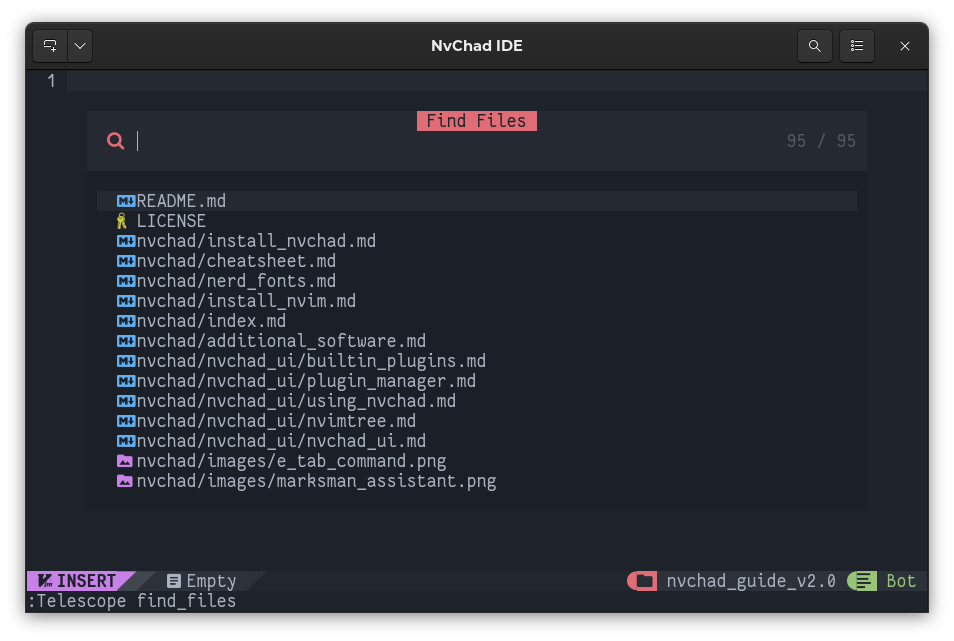

# Advanced configuration of the Custom Folder

## Introduction

!!! warning

    With the release of version 2.0 of NvChad the custom configuration proposed in this guide is no longer compatible and indeed would break the configuration. Pending the necessary changes we caution against **not applying** the instructions contained here on a version 2.0 installation.

NvChad uses `git` for updates. This implies that at every update, part or the whole configuration is overwritten by new commits. Consequently it would be useless to make customizations within the default configuration. 

To solve this problem the NvChad developers have set up the `custom` folder which **must** be placed in `.config/nvim/lua/`, and is designed to house all of your custom configuration files. Below we have a representation of the basic structure of a standard NvChad installation. 

```text
nvim/
├── examples
│   ├── chadrc.lua
│   └── init.lua
├── init.lua
├── LICENSE
├── lua
│   ├── core
│   └── plugins
└── plugin
    └── packer_compiled.lua
```

### Structure Creation

To start the customization we have to create the `custom` folder that will contain all our files, and also the `plugins` folder that will contain the _configuration files_ of our plugins. Since the folders will not be present, we will use the `-p` flag to tell the `mkdir` command to create the missing folders. The command will be as follows:

```bash
mkdir -p ~/.config/nvim/lua/custom/plugins
```

The structure of the `nvim/lua` folder should now look like this:

```text
├── lua
│   ├── core
│   ├── custom
│   │   └── plugins
│   └── plugins
```

The choice of path is not accidental. It responds to the need to preserve this folder from updates. Without this, with each update the folder would simply be deleted as it is not part of the repository. 

The NvChad developers have prepared a `.gitignore` file for this, which determines its exclusion.

```bash
cat .config/nvim/.gitignore 
plugin
custom
spell
```

### Structure of the Custom Folder

The structure of the _custom_ folder used for this guide is as follows:

```text
custom/
├── chadrc.lua
├── init.lua
├── mappings.lua
├── override.lua
└── plugins
    ├── init.lua
    └── lspconfig.lua
```

We are going to analyze its contents, and briefly describe the files it contains. The files will be analyzed in detail later, on the pages dedicated to them.

- `chadrc.lua` - This file allows for the override of default configurations. It also allows plugins to be overridden so that they can then be associated with _override.lua_ configurations. For example, it is used to save the interface theme with:

```lua
M.ui = {
  theme = "everforest",
}
```

- `init.lua` - This file is executed after the primary `init.lua` file, contained in `nvim/lua/core/`, and allows the execution of personalized commands at NvChad startup.

- `mappings.lua` - Allows for the setting of custom commands. These commands are normally used to abbreviate standard commands. An example is the abbreviation of the command `:Telescope find_files`, which can be set in _mappings.lua_ like so:

```lua
["\\\\"] = { "<cmd> Telescope find_files<CR>", "file finder" },
```

allows you to retrieve **:Telescope find_files** by typing two `\\`

 


- `override.lua` - This file contains the custom configurations that replaces the default ones. This is made possible thanks to the override effected upstream in _chadrc.lua_.

Let us now move on to the `plugins` folder. This folder contains all the configuration files of the various plugins installed. It also contains the `init.lua` file for the customizations. The `init.lua` file should contain the plugins we want to install on our IDE. Once inserted and configured, they will be installable via the `:PackerSync` command.

The only plugin required is _neovim/nvim-lspconfig_, which enables LSP (language server) functionality for advanced editing.
