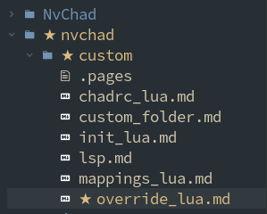

# `override.lua`

The `custom/override.lua` file is used for overriding the settings of plugins defined in `chadrc.lua`, allows various *parsers* to be installed at startup, extends the functionality of *nvimtree*, and other customizations.

The file used for our example is as follows:

```lua
local M = {}

M.treesitter = {
  ensure_installed = {
    "html",
    "markdown",
    "yaml",
    "lua",
  },
}

M.nvimtree = {
  git = {
    enable = true,
  },
  renderer = {
    highlight_git = true,
    icons = {
      show = {
        git = true,
      },
    },
  },
  view = {
    side = "right",
  },
}

M.blankline = {
  filetype_exclude = {
    "help",
    "terminal",
    "alpha",
    "packer",
    "lspinfo",
    "TelescopePrompt",
    "TelescopeResults",
    "nvchad_cheatsheet",
    "lsp-installer",
    "",
  },
}

M.mason = {
  ensure_installed = {
    "lua-language-server",
    "marksman",
    "html-lsp",
    "yaml-language-server",
  },
}

return M
```

Let's walk through that whole configuration. The first part checks the *treesitter* parsers defined in the table, and installs anything that's missing. In our example, we added only those useful for writing documents in Markdown. For a complete list of available parsers you can refer to [this page](https://github.com/nvim-treesitter/nvim-treesitter#supported-languages).

{ align=right }

The second part enriches our file explorer (*nvimtree*) with decorations for the state of the files with respect to the *Git* repository, and moves the view to the right.

Then we have a section that takes care of removing the lines that indicate nesting in the code. Finally, one that takes care of informing *Mason* which language servers are needed in the IDE, called by the `ensure_installed` function.

The control and eventual installation of *parser* and *LSP* is very useful in managing one's customizations on multiple workstations. By saving the *custom* folder in a Git Repository, one has the ability to clone one's custom settings to any machine on which NvChad is installed, and any changes can be synchronized between all the machines on which one is working.

Summarizing the `custom/override.lua` file is used to override parts of the default plugin configuration. Customizations set in this file are taken into account *only* if the plugin is defined in `custom/chadrc.lua` in the *plugin override* section.

```lua
M.plugins = {
  user = require("custom.plugins"),
  override = {
    ["kyazdani42/nvim-tree.lua"] = override.nvimtree,
    ["nvim-treesitter/nvim-treesitter"] = override.treesitter,
    ["lukas-reineke/indent-blankline.nvim"] = override.blankline,
    ["williamboman/mason.nvim"] = override.mason,
...
```
