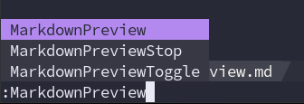
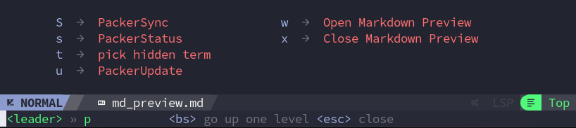
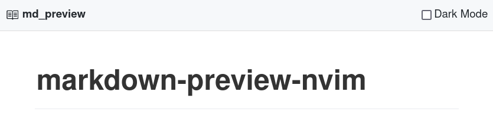
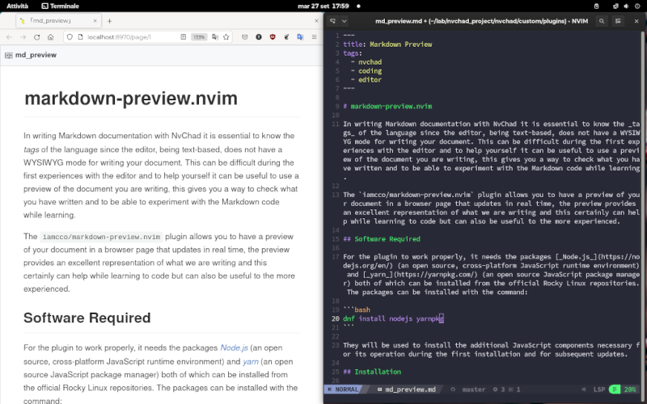

# markdown-preview.nvim

Per scrivere documentazione Markdown con NvChad è essenziale conoscere i _tag_ del linguaggio, poiché l'editor, essendo basato sul testo, non dispone di una modalità WYSIWYG per la scrittura del documento. Questo può essere difficile durante le prime esperienze con l'editor e per aiutarsi può essere utile utilizzare un'anteprima del documento che si sta scrivendo. In questo modo è possibile verificare ciò che si è scritto e sperimentare con il codice Markdown durante l'apprendimento.

Il plugin `iamcco/markdown-preview.nvim` consente di avere un'anteprima del documento in una pagina del browser che si aggiorna in tempo reale. L'anteprima fornisce un'eccellente rappresentazione di ciò che stiamo scrivendo, il che può certamente essere d'aiuto durante l'apprendimento del codice, ma può anche essere utile ai più esperti.

## Software Richiesto

Per funzionare correttamente, il plugin ha bisogno dei pacchetti [_Node.js_](https://nodejs.org/en/) (un ambiente runtime JavaScript open source e multipiattaforma) e [_yarn_](https://yarnpkg.com/) (un gestore di pacchetti JavaScript open source), entrambi installabili dai repository ufficiali di Rocky Linux. I pacchetti possono essere installati con il comando:

```bash
dnf install nodejs yarnpkg
```

Essi verranno utilizzati per installare i componenti JavaScript aggiuntivi necessari per il suo funzionamento durante la prima installazione e per gli aggiornamenti successivi.

## Installazione

L'installazione del plugin passa, come per tutti i plugin, da una modifica del file `custom/plugins/init.lua`. Il codice da inserire è il seguente:

```lua
  ["iamcco/markdown-preview.nvim"] = {
    ft = { "markdown" },
    run = "cd app && yarn install",
  },
```

Analizzando il codice si può dire che la prima riga istruisce _Packer_ sul plugin da installare, la seconda specifica il tipo di file che deve essere caricato e la terza esegue una serie di comandi post-installazione. In particolare, l'opzione `run`, in questo caso, esegue il comando come un comando di shell (impostato nella variabile di sistema $SHELL). Il comando `run`, per impostazione predefinita, utilizza sempre la cartella dei plugin come origine, quindi in questo caso si posiziona nella cartella _app_ e successivamente esegue il comando `yarn install`.

Una volta apportate le modifiche, occorre chiudere l'editor e riaprirlo. Questo per dare la possibilità di ricaricare la configurazione. Ora è possibile installare e configurare il _plugin_ con il comando `:PackerSync`.

## Usare il plugin

{ align=right }

Una volta installato, avremo a disposizione tre comandi per gestire l'anteprima. I comandi saranno attivi solo se abbiamo un file _markdown_ nel buffer e sono i seguenti:

- **:MarkdownPreview** con questo comando viene avviata l'anteprima, viene aperta una pagina del browser predefinito e viene avviato un server _html_
- **:MarkdownPreviewStop** il comando termina l'anteprima e la pagina del browser viene chiusa
- **:MarkdownPreviewToggle** consente di passare dalla visualizzazione _chiara_ a quella _scura_

L'anteprima viene chiusa anche se si chiude il buffer corrispondente (ad esempio, con <kbd>Spazio</kbd> + <kbd>x</kbd>).

## Mappatura

Il plugin può essere facilmente integrato in NvChad con una mappatura personalizzata. Per farlo, possiamo inserire il seguente codice nel file `custom/mapping.lua`:

```lua
M.mdpreview = {
  n = {
    ["<leader>pw"] = { "<cmd> MarkdownPreview<CR>", "Open Markdown Preview" },
    ["<leader>px"] = { "<cmd> MarkdownPreviewStop<CR>", "Close Markdown Preview" },
  },

  i = {
    ["<A-p>"] = { "<cmd> MarkdownPreview<CR>" },
    ["<A-x>"] = { "<cmd> MarkdownPreviewStop<CR>" },
  },
}
```

Il primo array imposta le scorciatoie per la modalità NORMAL ( `n = {` ) e consente di selezionare i due comandi di _markdown-preview.nvim_ digitando <kbd>Spazio</kbd> + <kbd>p</kbd> seguito dalla lettera corrispondente al comando desiderato.



Il secondo array li imposta per la modalità INSERT ( `i = {` ), consentendo di attivarla durante la modifica del documento. Poiché in modalità INSERT il tasto <kbd>Spazio</kbd> non può essere utilizzato per la scorciatoia, abbiamo spostato il comando su <kbd>Alt</kbd>. Il tasto <kbd>Spazio</kbd> in modalità INSERT viene interpretato come uno spazio da inserire all'interno del documento e pertanto non può essere utilizzato nei collegamenti.

Attiveremo quindi l'anteprima con la combinazione <kbd>Alt</kbd> + <kbd>p</kbd> e la chiuderemo con <kbd>Alt</kbd> + <kbd>x</kbd>.

## Visualizzazione

Gli sviluppatori del plugin hanno incluso due temi nel foglio di stile css utilizzato: uno chiaro e uno scuro. Per selezionare il tema desiderato c'è un pulsante nascosto in alto a destra della pagina. Portando il mouse in quella posizione, il pulsante dovrebbe apparire come mostrato nella schermata seguente.



Selezionando il tema scuro si passa alla visualizzazione:


Esiste anche la possibilità di utilizzare il proprio foglio di stile css per avere una visualizzazione il più possibile simile al documento che si sta scrivendo. Il percorso dei proprio _css_ deve essere impostato nella variabile `mkdp_markdown_css` e si può anche specificare il proprio file _css_ per l'evidenziazione del codice in `mkdp_highlight_css`. Entrambi i percorsi devono essere assoluti (es. /home/user/your_css.css).

Per una modifica temporanea possiamo impostare il tema scuro direttamente in _NvChad_ inserendo il seguente comando nella statusline:

```text
:let g:mkdp_theme = 'dark'
```

## Conclusione

Il plugin _iamcco/markdown-preview.nvim_ fornisce un'anteprima del documento markdown che stiamo scrivendo, consentendoci di verificare il risultato in tempo reale. I comandi possono essere facilmente integrati nella mappatura NvChad per un flusso di lavoro più rapido. Esiste anche la possibilità di personalizzare la visualizzazione dell'anteprima utilizzando il proprio foglio di stile css. Ulteriori informazioni sono disponibili nella [pagina del progetto](https://github.com/iamcco/markdown-preview.nvim).


