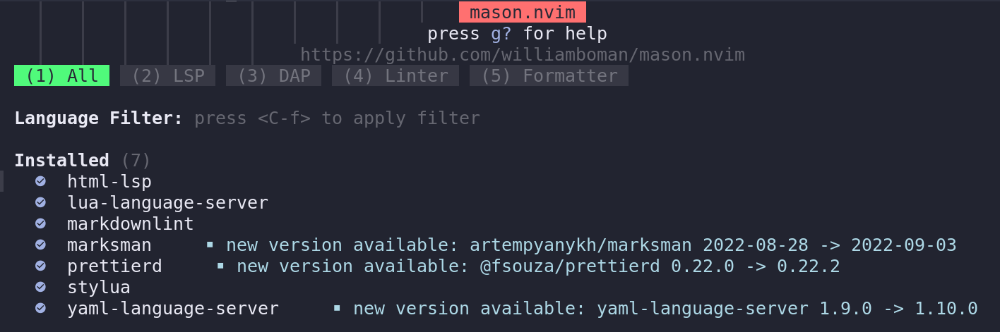

# Null-ls

The `jose-elias-alvarez/null-ls.nvim` plugin although not essential to the operation of the IDE is definitely one to have in your configuration, it allows you to use language server features to insert LSPs dedicated to diagnostics, formatting and other operations.

Null-ls aims to simplify the creation, sharing, and setting up of LSP sources; it also enables improved performance by eliminating any external processes.

## Plugin Insertion

Inserting the plugin consists of editing the file `custom/plugins/init.lua` and creating a new configuration file `custom/plugins/null-ls.lua`. The code to be inserted into _init.lua_ is as follows:

```lua
["jose-elias-alvarez/null-ls.nvim"] = {
	after = "nvim-lspconfig",
		config = function()
			require("custom.plugins.null-ls")
	end,
},
```

As also evidenced by the code, the entry must be made after the _neovim/nvim-lspconfig_ plugin, the configuration function is then called and then our configuration file _null-ls.lua_ is requested.

### LSP Installation Required

For proper operation of language servers these must be installed separately with _Mason_, for installation one can use the interface callable with the command `:Mason` or installation from _statusline_ with the command `:MasonInstall name_lsp`, e.g.:

```text
:MasonInstall markdownlint
```



The LSPs to be installed are `prettierd`, `markdownlint` and `stylua`. The first two LSPs will provide formatting and diagnostic capabilities for Markdown code, the third provides support for formatting Lua code.

!!! attention "Markdownlint setting"

    For optimal use of the linter, a `rc` configuration file must be placed in your home directory; detailed instructions are available at the end of this document.

## Creating null-ls.lua

Once we have installed the necessary language servers we can move on to creating the `custom/plugins/null-ls.lua` file. For creation we can use our NvChad:

```bash
nvim ~/.config/nvim/lua/custom/plugins/null-ls.lua
```

We copy the code below, bring ourselves into our IDE, making sure we are in the NORMAL state and with the <kbd>p</kbd> (paste) key we copy it, at which point we save it and close it with the `:wq` command.

```lua
local present, null_ls = pcall(require, "null-ls")

if not present then
  return
end

local b = null_ls.builtins

local sources = {
  -- format html and markdown
  b.formatting.prettierd.with { filetypes = { "html", "yaml", "markdown" } },
  -- markdown diagnostic
  b.diagnostics.markdownlint,
  -- Lua formatting
  b.formatting.stylua,
}

local augroup = vim.api.nvim_create_augroup("LspFormatting", {})
local on_attach = function(client, bufnr)
  if client.supports_method "textDocument/formatting" then
    vim.api.nvim_clear_autocmds { group = augroup, buffer = bufnr }
    vim.api.nvim_create_autocmd("BufWritePre", {
      group = augroup,
      buffer = bufnr,
      callback = function()
        -- on 0.8, you should use vim.lsp.buf.format({ bufnr = bufnr }) instead
        vim.lsp.buf.formatting_sync()
        end,
    })
  end
end

null_ls.setup {
  debug = true,
  sources = sources,
  on_attach = on_attach,
}
```

Once the changes are finished to instruct NvChad we have to perform a `:PackerSync`, it is advisable to exit the editor and re-enter before doing the sync.

### LSP sources

The part of the _null-ls.lua_ configuration file where we can intervene with any changes is as follows:

```lua
local sources = {
  -- format html and markdown
  b.formatting.prettierd.with { filetypes = { "html", "yaml", "markdown" } },
  -- markdown diagnostic
  b.diagnostics.markdownlint,
  -- Lua formatting
  b.formatting.stylua,
}

```

This is where local sources are set up, using the `b.formatting` and `b.diagnostic` functions provided by _null-ls_ followed by our chosen LSPs. For a complete list of the functions included in the plugin, see the [Project Page](https://github.com/jose-elias-alvarez/null-ls.nvim).

For formatting Markdown documents you also have other LSPs available, the setting used here provides excellent support but for a complete list you can consult the [Dedicated Page](https://github.com/jose-elias-alvarez/null-ls.nvim/blob/main/doc/BUILTINS.md).

### Markdownlint setting

_Markdownlint_ works by comparing the code we write with rules set by the project that can be found at [this page](https://github.com/DavidAnson/markdownlint/blob/main/doc/Rules.md).

Once activated each time a Markdown file is modified and the editor return in NORMAL mode, a message should appear in the middle part of the _statusline_ that first informs us of the check with `diagnostic markdown` and then once the check is finished the message of errors founded `diagnostic (0%)`, the percentage refers to the number of errors found and not to the progress in the file.

The rules set by `markdownlint` are very stringent and include, for example, a maximum line length of 80 words, which in writing documentation may not be adequate. To get around these limitations, it is possible to change the settings passed to the executable by placing a `rc` file in the _workspace_directory_ for a project-level override or in one's _home_ for a user-level one. The file should be named `.markdownlintrc` if placed in your own _home_ or `.markdownlint.jsonc` if placed in the project's _workspace_directory_. For working on a fork of the Rocky documentation, the first solution is preferable as it does not interfere with the _Git repository_.

The comments are explanatory of the checks performed by the various rules, in particular the _MD013_ rule on maximum line length (customizable length) if not modified is particularly tedious, the _MD033_ rule is needed to avoid warnings when entering keyboard keys `<kbd>` and can be integrated in array form with other keys, the _MD025_ rule prevents the interpretation of the title present in the _frontmatter_ giving the `H1` double header error signaling and the _MD046_ rule changes the default (consistent) to _fenced_ this is because in the documentation on Rocky Linux admonitions (indent) are commonly used with block codes (fenced) and this would give an inconsistency error.

The complete excellently commented example can be found on the [related pages](https://github.com/DavidAnson/markdownlint/blob/main/schema/.markdownlint.jsonc).

Here, then, is the proposed `.markdownlintrc` file:

```json
{
  // Default state for all rules
  "default": true,
  // MD007/ul-indent - Unordered list indentation
  "MD007": {
    // Spaces for indent
    "indent": 4,
    // Whether to indent the first level of the list
    "start_indented": true,
    // Spaces for first level indent (when start_indented is set)
    "start_indent": 4
  },
  // MD013/line-length - Line length
  "MD013": {
    // Number of characters
    "line_length": 480,
    // Number of characters for headings
    "heading_line_length": 80,
    // Number of characters for code blocks
    "code_block_line_length": 280,
    // Include code blocks
    "code_blocks": true,
    // Include tables
    "tables": true,
    // Include headings
    "headings": true,
    // Include headings
    "headers": true,
    // Strict length checking
    "strict": false,
    // Stern length checking
    "stern": false
  },
  // MD033/no-inline-html - Inline HTML
  "MD033": {
    // Allowed elements
    "allowed_elements": ["kbd"]
  },
  // MD025/single-title/single-h1 - Multiple top-level headings in the same document
  "MD025": {
    // Heading level
    "level": 1,
    // RegExp for matching title in front matter
    "front_matter_title": "^\\s*title\\s*[:=]"
  },
  // MD046/code-block-style - Code block style
  "MD046": {
    // Block style
    "style": "fenced"
  }
}
```

The inclusion of the file should eliminate flags regarding aspects of code control that we want or need to include to write documentation on Rocky Linux, exceptions that would violate the default rules.

In summary, although not indispensable, the _null-ls_ plugin makes a significant contribution to our documentation work, if installed it will help to write correct and consistent code.
