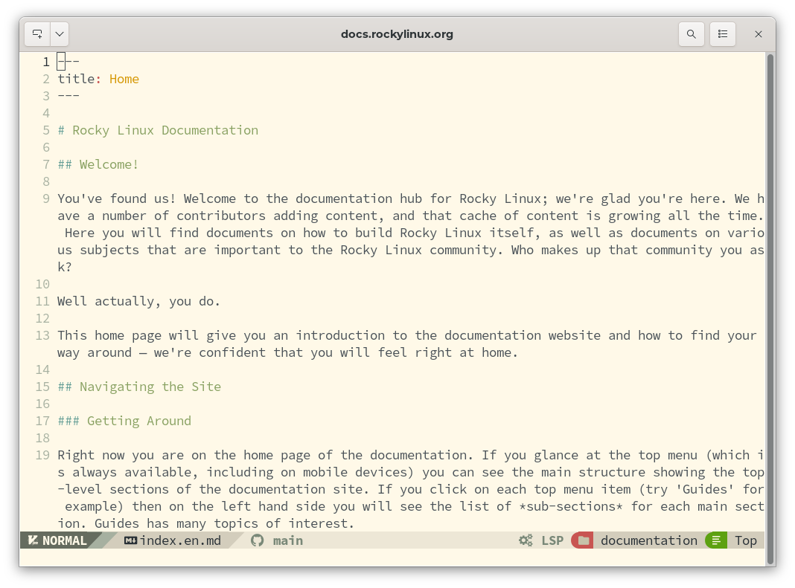
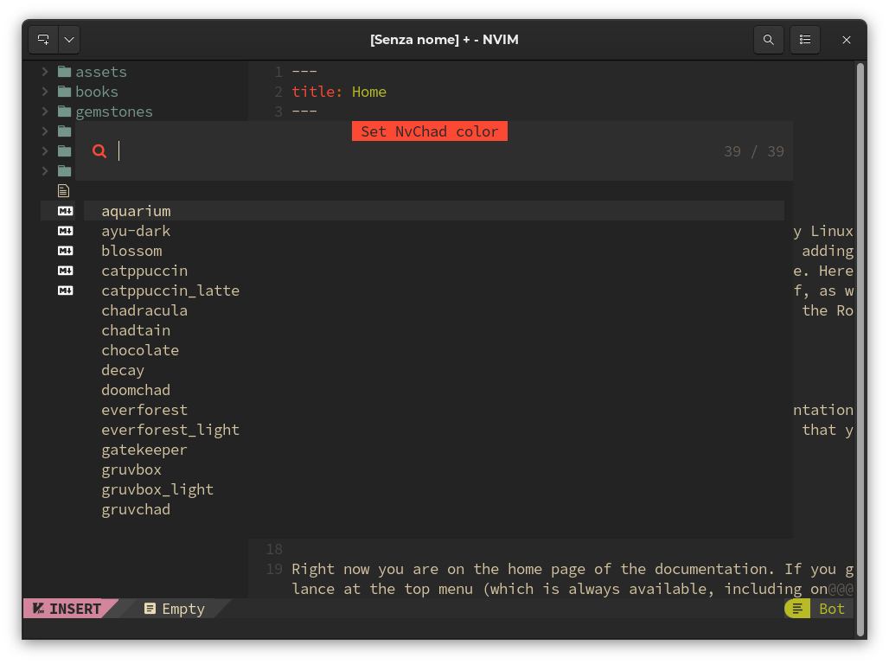

# Introduction

Throughout this book, you will find ways to implement Neovim, along with NvChad, to create a fully functional **I**ntegrated **D**evelopment **E**nvironment (IDE).

I say "ways" because there are many possibilities. The author focuses here on using these tools for writing markdown, but if markdown isn't your focus, don't worry simply read on. If you are unfamiliar with either of these tools (NvChad or Neovim), then this book will give you an introduction to both, and if you step through these documents, you'll soon realize that you can set up this environment to be a huge help for whatever your programming or script writing needs are.

Want an IDE that will help in writing Ansible playbooks? You can get that! Want an IDE for Golang? That's available too. Simply want a good interface for writing BASH scripts? It's also available.

Through the use of **L**anguage **S**erver **P**rotocols and linters, you can setup an environment that is customized just for you. The best part is that once you have the environment setup, it can quickly be updated when new changes are available through the use of [lazy.nvim](https://github.com/folke/lazy.nvim) and [Mason](https://github.com/williamboman/mason.nvim), both of which are covered here.

Because Neovim is a fork of `vim`, the overall interface will be familiar to `vim` users. If you aren't a `vim` user, you will pick up on the syntax of the commands quickly using this book. There's a lot of information covered here but it's easy to follow along, and once you've completed the content, you'll know enough to build your own IDE for _your_ needs with these tools.

It was the author's intent **not** to break this book down into chapters. The reason is that this implies an order that must be followed and, for the most part, that's not necessary. You *will* want to start with this page, read and follow the "Additional Software", "Install Neovim" and "Install NvChad" sections, but from there, you can choose how you want to proceed.

## Using Neovim as an IDE

The basic installation of Neovim provides an excellent editor for development, but it cannot yet be called an IDE; all the more advanced IDE features, even if already preset, are not yet activated. To do this we need to pass the necessary configurations to Neovim, and this is where NvChad comes to our aid. This allows us to have a basic configuration out of the box with just one command!

The configuration is written in Lua, a very fast programming language that allows NvChad to have startup and execution times for commands and keystrokes that are very fast. This is also made possible by the `Lazy loading` technique used for plugins that loads them only when required.

The interface turns out to be very clean and pleasant.

As the developers of NvChad are keen to point out, the project is only intended to be a base on which to build your own personal IDE. Subsequent customization is done through the use of plugins.

### Main Features

- **Designed to be fast.** From the choice of programming language to techniques for loading components, everything is designed to minimize execution time.

- **Attractive Interface.** Despite being a _cli_ application the interface looks modern and beautiful graphically, plus all the components fit the UI perfectly.

- **Extremely Configurable.** Due to the modularity derived from the base application (NeoVim), the editor can be adapted perfectly to one's needs. Keep in mind, however, that when we talk about customization we are referring to functionality, and not to the appearance of the interface.

- **Automatic update mechanism.** The editor comes with a mechanism (through the use of _git_) that allows updates with a simple `:NvChadUpdate` command.

- **Powered by Lua.** NvChad's configuration is written entirely in _lua_, which allows it to integrate seamlessly into Neovim's configuration by taking advantage of the full potential of the editor on which it is based.

- **Numerous inbuilt themes.** The configuration already includes a large number of themes to use, always keeping in mind that we are talking about a _cli_ application, themes can be selected with the `<leader> + th` key.

## References

### Lua

#### What is Lua?

Lua is a robust, lightweight, scripting language that supports a variety of programming methods. The name "Lua" comes from the Portuguese word meaning "moon."

Lua was developed at the Catholic University of Rio de Janeiro by Roberto Ierusalimschy, Luiz Henrique de Figueiredo, and Waldemar Celes. The development was necessary for them because until 1992 Brazil was subject to strict import regulations for hardware and software, so out of sheer necessity, these three programmers developed their own scripting language called Lua.

Because Lua focuses primarily on scripts, it is rarely used as a stand-alone programming language. Instead, it is most often used as a scripting language that can be integrated (embedded) into other programs.

Lua is used in the development of video games and game engines (Roblox, Warframe..), as a programming language in many network programs (Nmap, ModSecurity..), and as a programming language in industrial programs. Lua is also used as a library that developers can integrate into their programs to enable scripting functionality by acting solely as an integral part of the host application.

#### How Lua works

There are two main components of Lua:

- The Lua interpreter
- The Lua virtual machine (VM)

Lua is not interpreted directly through a Lua file like other languages, for example Python. Instead, it uses the Lua interpreter to compile a Lua file into bytecode. The Lua interpreter is highly portable and capable of running on a multitude of devices.

#### Key Features

- Speed: Lua is considered one of the fastest programming languages among interpreted scripting languages; it can perform very performance-heavy tasks faster than most other programming languages.

- Size: Lua has a really small size compared to other programming languages. This small size is ideal for integrating Lua into multiple platforms, from embedded devices to game engines.

- Portability and integration: The portability of Lua is almost unlimited. Any platform that supports the standard C compiler can run Lua without problems. Lua does not require complex rewrites to be compatible with other programming languages.

- Simplicity: Lua has a simple design but provides powerful functionality. One of the main features of Lua is meta-mechanisms, which allow developers to implement their own functionality. The syntax is simple and in an easily understood format, so that anyone can easily learn Lua and use it in their own programs.

- License: Lua is free and open-source software distributed under the MIT license. This allows anyone to use it for any purpose without paying any license or royalties.

### Neovim

Neovim is described in detail on its [dedicated page](install_nvim.md) so we will just dwell on the main features, which are:

- Performance: Very fast.

- Customizable: Wide ecosystem of plugins and themes.

- Syntax highlighting: Integration with Treesitter and LSP, (requires some additional configurations).

- Multiplatform: Linux, Windows and macOS

- License: Mit: A short and simple permissive license with conditions requiring only the preservation of copyright and license notices.

### LSP

What is the **L**anguage **S**erver **P**rotocol?

A language server is a standardized language library that uses its own procedure (protocol) to provide support for functions such as autocomplete, goto definition, or mouseover definitions.

The idea behind the Language Server Protocol (LSP) is to standardize the communication protocol between tools and servers, so that a single language server can be reused in multiple development tools. In this way, developers can simply integrate these libraries into their editors and reference existing language infrastructures, instead of customizing their code to include them.

### tree-sitter

[Tree-sitter](https://tree-sitter.github.io/tree-sitter/) basically consists of two components: a parser generator, and an incremental parsing library. It can build a syntactic tree of the source file and efficiently update it with each change.

A parser is a component that decomposes data into smaller elements to facilitate its translation into another language, or as in our case, to be then passed to the parsing library. Once the source file has been decomposed, the parsing library parses the code and transforms it into a syntactic tree, allowing the structure of the code to be manipulated more intelligently. This makes it possible to improve (and speed up)

- syntax highlighting
- code navigation
- refactoring
- text objects and movements

!!! notes "LSP and tree-sitter complementarity."

    Although it may seem that the two services (LSP and tree-sitter) are redundant, they are actually complementary in that LSP works at the project level while tree-sitter works only on the open source file.

Now that we have explained a bit about the technologies used to create the IDE we can move on to the [Additional Software](additional_software.md) needed to configure our NvChad.
